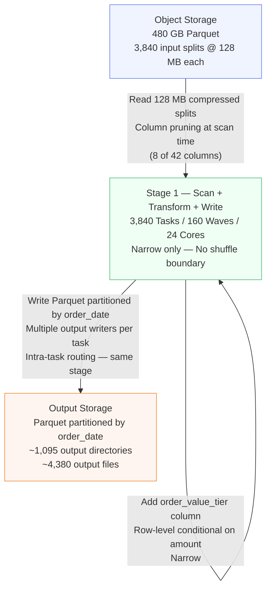

# Scenario 01 — Narrow Transformation ETL Pipeline

**Domain:** E-commerce order processing
**Difficulty:** Standard
**Primary Concepts:** Narrow transformations, input partitioning, task waves, executor memory budget, no-shuffle stages

---

## Cluster Specification

| Component | Count | Cores | RAM |
|---|---|---|---|
| Driver node | 1 | 4 | 8 GB |
| Executor nodes | 6 | 4 each | 20 GB each |
| **Total executor cores** | — | **24** | **120 GB** |

Configuration parameters at defaults unless stated:

| Parameter | Value |
|---|---|
| `spark.executor.memory` | 20 GB (20,480 MB) |
| `spark.executor.cores` | 4 |
| `spark.sql.files.maxPartitionBytes` | 128 MB (134,217,728 bytes) |
| `spark.sql.files.openCostInBytes` | 4 MB (4,194,304 bytes) |
| `spark.default.parallelism` | 24 (total executor cores) |
| `spark.sql.shuffle.partitions` | 200 (irrelevant — no shuffle here) |
| `spark.memory.fraction` | 0.6 |
| `spark.memory.storageFraction` | 0.5 |
| `spark.executor.memoryOverhead` | auto (10% of executor memory) |

---

## Data Characteristics

| Property | Value |
|---|---|
| Total compressed size on disk | 480 GB |
| Total row count | ~2.1 billion rows |
| Average row size (compressed) | ~230 bytes |
| File format | Parquet (splittable at any codec) |
| Storage location | Object storage (HDFS-compatible) |
| Compression codec | Snappy (typical Parquet default) |
| Data span | 3 years of order records |
| Estimated unique order dates | ~1,095 dates (3 years x 365 days) |
| Filter selectivity | ~65% rows retained (order_status = COMPLETED) |
| Columns in source schema | 42 |
| Columns selected in output | 8 |

**Compression ratio context:** 480 GB on-disk Parquet represents data that would be substantially larger as raw CSV. The partition math operates on the on-disk file sizes, not the in-memory decompressed sizes. When tasks read and decompress, memory pressure is higher than the partition byte count suggests (typically 3-5x expansion for Parquet with Snappy).

---

## Transformation Chain

Operations in pipeline order, with narrow/wide classification:

| Step | Operation | Narrow or Wide | Reason |
|---|---|---|---|
| 1 | Read Parquet from object storage | Narrow | Each file split maps to exactly one task; no data crosses partition boundaries |
| 2 | Filter `order_status = COMPLETED` | Narrow | Each row evaluated independently; output stays in same partition as input |
| 3 | Select 8 of 42 columns | Narrow (projection pushdown) | Column pruning is applied at scan time via Parquet column statistics; no cross-partition movement |
| 4 | Add derived column `order_value_tier` | Narrow | Row-level computation (if/else on `amount`); output row stays in the same partition |
| 5 | Write Parquet partitioned by `order_date` | Wide in terms of output file layout, but NOT a shuffle stage | Spark writes each output partition to the corresponding `order_date=` directory; rows for different dates within the same input partition are sent to different output files — handled within the task via multiple output file writers, not via a network shuffle |

**Critical distinction for Step 5:** Writing partitioned output by a column (`order_date`) does not by default introduce a shuffle stage if no explicit `repartition()` is called. Each task opens multiple output file writers (one per `order_date` value it encounters) and routes rows locally. This is intra-task routing — no data leaves the executor. The DAG shows this as the same stage.

**Key insight:** Because steps 1-5 have no aggregation, join, distinct, groupBy, orderBy, or repartition operations, the entire pipeline is **one stage, one job**. Spark's Catalyst optimizer collapses all narrow transformations into a single scan + transform + write stage. No shuffle boundary exists anywhere in this pipeline.

---

## Pre-Execution Sizing Math

### Step 1: Compute maxSplitBytes

```
spark.default.parallelism = total executor cores = 6 nodes x 4 cores = 24

bytesPerCore = total input size / spark.default.parallelism
             = 480 GB x 1,024 MB/GB / 24
             = 491,520 MB / 24
             = 20,480 MB per core

maxSplitBytes = min(maxPartitionBytes, max(openCostInBytes, bytesPerCore))
              = min(128 MB, max(4 MB, 20,480 MB))
              = min(128 MB, 20,480 MB)
              = 128 MB
```

Result: `maxSplitBytes = 128 MB`. The `bytesPerCore` value (20,480 MB) is so large relative to `maxPartitionBytes` (128 MB) that the cap always wins. This is the expected outcome for large datasets on small-to-medium clusters: when data >> cluster capacity, `maxSplitBytes` collapses to `maxPartitionBytes`.

### Step 2: Compute Input Partition Count

Parquet is always splittable regardless of codec. Each file is split at 128 MB boundaries.

```
Total input size   = 480 GB = 480 x 1,024 MB = 491,520 MB

Input partitions   = ceil(total input size / maxSplitBytes)
                   = ceil(491,520 MB / 128 MB)
                   = ceil(3,840.0)
                   = 3,840 input partitions
```

**Note on openCostInBytes packing:** The 4 MB open cost per file matters when packing multiple small files into one partition. At 480 GB of enterprise Parquet, individual files are almost certainly larger than 128 MB (typical landing sizes are 256 MB to 1 GB). When a file exceeds `maxSplitBytes`, Spark splits it — the open cost applies per resulting chunk. For this scenario, the dominant factor is the 128 MB split ceiling, yielding clean 3,840 splits.

### Step 3: Compute Total Task Count for Stage 1

In a narrow-only pipeline with no shuffle:

```
Tasks in Stage 1 = Input partitions = 3,840 tasks
```

Each task processes one 128 MB partition: reads from object storage, decompresses, applies filter, projects columns, computes derived column, and writes its portion of output.

### Step 4: Compute Parallelism Waves

```
Total executor cores  = 6 nodes x 4 cores/node = 24 cores
Tasks in Stage 1      = 3,840

Waves = ceil(tasks / total cores)
      = ceil(3,840 / 24)
      = ceil(160.0)
      = 160 waves
```

Each wave lasts as long as the slowest task in that wave. With uniform data distribution and Parquet files of consistent size, waves should be near-uniform in duration.

### Step 5: Estimate Output Partition Count

The write is partitioned by `order_date`. Each unique date gets its own output directory. Within each directory, Spark writes one file per task that contains rows for that date.

```
Unique order_dates     = ~1,095 (3 years x 365 days)

Rows retained          = 2.1 billion x 0.65 = ~1.365 billion rows

Rows per date (avg)    = 1,365,000,000 / 1,095 = ~1,246,575 rows/date

Output file count depends on how many tasks touch each date:
  If data files are stored chronologically (one date per file):
    Tasks per date ≈ bytes for that date / 128 MB
    Assuming uniform daily volume: 491,520 MB / 1,095 dates = ~449 MB/date
    Files per date = ceil(449 MB / 128 MB) = ceil(3.5) = 4
    Total output files ≈ 1,095 dates x 4 files/date = ~4,380 files

  If data files contain mixed dates (random order):
    Each task may touch many dates
    Upper bound: 3,840 tasks x avg_dates_per_task output files
    This produces the small file problem (see Bottleneck section)

Conservative estimate for chronologically stored data: ~4,380 output files
```

**Output size estimate:**

```
Column pruning: keeping 8 of 42 columns
  Approximate column fraction = 8 / 42 = 19%
  Estimated output size       = 480 GB x 0.19 x 0.65
                              = 480 x 0.1235
                              = ~59.3 GB on disk

  Note: actual savings depend on which 8 columns are selected and their
  data types. Parquet columnar layout makes column pruning highly effective.
```

---

## DAG Structure



**Stage boundary explanation:**

A new Spark stage is created ONLY when a wide transformation (shuffle) occurs. Wide transformations include: `groupBy`, `agg`, `join` (non-broadcast), `distinct`, `orderBy` on the full dataset, `repartition(n)`. None of these appear in this pipeline.

```
Number of stages in this job = 1
Number of jobs               = 1
Number of shuffle operations = 0
Shuffle bytes written        = 0 bytes
Shuffle bytes read           = 0 bytes
```

---

## Stage-by-Stage Execution Trace

### Stage 1 (only stage): Scan + Filter + Project + Derive + Write

| Metric | Value | Derivation |
|---|---|---|
| Task count | 3,840 | 480 GB / 128 MB per partition |
| Concurrent tasks | 24 | 6 executors x 4 cores each |
| Execution waves | 160 | ceil(3,840 / 24) = 160.0 exactly |
| Data read per task (compressed) | 128 MB | maxSplitBytes |
| Estimated decompressed per task | ~384-640 MB | 3-5x Parquet Snappy expansion |
| Rows per task (input) | ~546,875 | 2.1B rows / 3,840 tasks |
| Rows per task (after filter) | ~355,469 | 546,875 x 0.65 |
| Shuffle write | 0 bytes | Narrow pipeline, no shuffle |
| Shuffle read | 0 bytes | No preceding shuffle stage |
| Spill to disk (expected) | None | Memory per task (756 MB min) > peak demand (~640 MB) |

**Per-wave breakdown:**

```
Wave 1 through Wave 160: each wave = 24 tasks running concurrently

3,840 total tasks / 24 tasks per wave = 160.0 waves exactly
No partial final wave — all 160 waves are fully saturated at 24 tasks.

Last wave task count      = 3,840 - (159 x 24) = 3,840 - 3,816 = 24 tasks
Last wave utilization     = 24 / 24 = 100%
Overall cluster utilization = 100% for all waves
```

This is an ideal partition-to-core ratio. No core-seconds are wasted waiting at the tail of the job.

**Wave timing estimate:**

```
Reading 128 MB compressed from object storage at ~200 MB/s per executor:
  Read time per task      = 128 MB / 200 MB/s = 0.64 seconds

Decompression + filter + project + derive (CPU-bound, fast columnar operations):
  CPU time per task       = ~0.3-1.0 seconds

Writing output (~20 MB per task after pruning + filter):
  Output per task         = ~59,300 MB / 3,840 tasks = ~15 MB
  Write time per task     = 15 MB / 200 MB/s = 0.08 seconds

Estimated time per wave   = 0.64 + 0.65 + 0.08 = ~1.4 seconds

Estimated total job time  = 160 waves x 1.4 seconds/wave = ~224 seconds = ~3.7 minutes
```

---

## Memory Budget Analysis

### Step 1: YARN container memory per executor

```
spark.executor.memory       = 20 GB = 20,480 MB

memoryOverhead = max(384 MB, 0.10 x spark.executor.memory)
               = max(384 MB, 0.10 x 20,480 MB)
               = max(384 MB, 2,048 MB)
               = 2,048 MB

Total YARN container = spark.executor.memory + memoryOverhead
                     = 20,480 MB + 2,048 MB
                     = 22,528 MB (~22 GB per executor)
```

The `memoryOverhead` region is off-heap: it covers JVM overhead, thread stacks, native libraries. It is NOT available to Spark's memory manager.

### Step 2: JVM Heap regions

```
Reserved Memory       = 300 MB (hardcoded Spark constant, cannot be changed)
Usable Heap           = spark.executor.memory - Reserved Memory
                      = 20,480 MB - 300 MB
                      = 20,180 MB
```

### Step 3: Unified Memory pool

```
Unified Memory        = Usable Heap x spark.memory.fraction
                      = 20,180 MB x 0.6
                      = 12,108 MB (~11.8 GB)

User Memory           = Usable Heap x (1 - spark.memory.fraction)
                      = 20,180 MB x 0.4
                      = 8,072 MB (~7.9 GB)
```

User Memory holds: Spark internal data structures, user-defined data structures, UDF objects, broadcast variable metadata. It does NOT participate in dynamic spill/eviction.

### Step 4: Storage and Execution split within Unified Memory

```
Storage Memory Floor  = Unified Memory x spark.memory.storageFraction
                      = 12,108 MB x 0.5
                      = 6,054 MB (~5.9 GB)

Execution Memory Init = Unified Memory x (1 - storageFraction)
                      = 12,108 MB x 0.5
                      = 6,054 MB (~5.9 GB)
```

Dynamic sharing rule: Execution memory can evict Storage memory (LRU cache eviction) if it needs more than 6,054 MB. Storage memory cannot evict Execution memory.

**In practice for this ETL (no caching):**

```
Storage Memory floor is idle (no cache() or persist() calls in this pipeline).
Execution memory can expand toward the full Unified Memory pool.
Execution Memory (effective) = ~12,108 MB (borrows idle storage pool)
```

### Step 5: Memory per task

```
Concurrent tasks per executor = spark.executor.cores = 4

Memory per task (min guaranteed) = Execution Memory Init / (2 x concurrent tasks)
                                  = 6,054 MB / (2 x 4)
                                  = 6,054 MB / 8
                                  = 756.75 MB (~756 MB)

Memory per task (initial max)     = Execution Memory Init / concurrent tasks
                                  = 6,054 MB / 4
                                  = 1,513.5 MB (~1,513 MB)

Memory per task (effective max)   = Unified Memory / concurrent tasks
                                  = 12,108 MB / 4
                                  = 3,027 MB (~3.0 GB)
```

### Step 6: Memory demand vs supply

```
Compressed input per task           = 128 MB
Decompressed expansion factor       = 3x - 5x (Snappy Parquet typical)
Decompressed size per task          = 128 x 3 = 384 MB (low end)
                                    = 128 x 5 = 640 MB (high end)

After column pruning (8 of 42 cols):
  Column fraction applied at read    = 8 / 42 = 19%
  In-memory working set post-pruning = 640 MB x 0.19 = ~122 MB

Peak memory before column pruning (initial decompression buffer):
  Peak demand per task               = ~384-640 MB

Memory sufficiency check:
  Minimum guaranteed per task        = 756 MB
  Peak demand                        = ~640 MB
  756 MB > 640 MB → minimum guaranteed EXCEEDS peak demand
  → No spill to disk expected
  → All 4 concurrent tasks per executor run without memory contention
```

### Full Memory Budget Summary Table

| Region | Formula | Value |
|---|---|---|
| `spark.executor.memory` (JVM heap) | configured | 20,480 MB |
| `memoryOverhead` (off-heap/YARN) | max(384, 0.10 x 20,480) | 2,048 MB |
| Total YARN container | 20,480 + 2,048 | 22,528 MB |
| Reserved Memory | hardcoded constant | 300 MB |
| Usable Heap | 20,480 - 300 | 20,180 MB |
| Unified Memory | 20,180 x 0.6 | 12,108 MB |
| User Memory | 20,180 x 0.4 | 8,072 MB |
| Storage Memory Floor | 12,108 x 0.5 | 6,054 MB |
| Execution Memory Init | 12,108 x 0.5 | 6,054 MB |
| Execution Memory (effective, no cache) | borrows idle storage pool | ~12,108 MB |
| Memory per task (guaranteed min) | 6,054 / (2 x 4) | 756 MB |
| Memory per task (initial max) | 6,054 / 4 | 1,513 MB |
| Memory per task (effective max) | 12,108 / 4 | 3,027 MB |
| Peak task memory demand | 128 MB x 5x expansion | ~640 MB |
| Spill expected? | 756 MB > 640 MB | No |

---

## Parallelism and Wave Analysis

```
Total executor cores        = 6 x 4 = 24 cores
Stage 1 task count          = 3,840 tasks
Waves required              = ceil(3,840 / 24) = 160.0 = 160 waves exactly
Last wave task count        = 3,840 - (159 x 24) = 24 tasks (full wave)
Last wave utilization       = 24 / 24 = 100%
Overall cluster utilization = 100% (no partial final wave)
```

**Why 3,840 divides evenly by 24:**

```
3,840 / 24 = 160.0 exactly

This falls naturally from the math:
  480 GB / 128 MB = 491,520 MB / 128 MB = 3,840 partitions
  6 nodes x 4 cores = 24 total cores
  3,840 / 24 = 160

Every wave is fully utilized. In practice, task scheduling overhead, object
storage read latency variance, and JVM GC pauses create effective partial waves,
but from a planning perspective this is a maximally efficient scenario.
```

**Core-seconds accounting:**

```
Total task-slots consumed   = 3,840 tasks x 1 core-slot each
                            = 3,840 core-task-units

At 100% utilization across all waves, zero core-seconds are wasted.
If last wave had only 8 tasks: utilization = 8/24 = 33%, wasting 16 core-slots.
This scenario avoids that by virtue of the even divisibility.
```

---

## Bottleneck Identification

### Primary Bottleneck: Object Storage Read Throughput

```
24 concurrent tasks each reading 128 MB simultaneously (per wave):
  Aggregate read per wave   = 24 x 128 MB = 3,072 MB

Required cluster-wide bandwidth per wave:
  3,072 MB / ~0.64 seconds = ~4,800 MB/s aggregate read throughput

If object storage sustains < 4,800 MB/s aggregate:
  → Waves stretch beyond 0.64 seconds for the read phase
  → Tasks are I/O-bound, not CPU-bound
  → Increasing executor cores would not help; more cores would only create
    more concurrent reads fighting for the same bandwidth
```

This is the most likely real-world bottleneck for this scan-heavy pipeline. Parquet column pruning reduces actual bytes read significantly (19% of raw data), which alleviates but does not eliminate this bottleneck.

### Secondary Bottleneck: Small File Proliferation on Write

```
Output is partitioned by order_date (~1,095 directories).
Each task opens one output file writer per unique order_date it encounters.

If data is not pre-sorted by order_date (typical for time-ingested data):
  Each task may contain rows from many different dates.
  Assume each task touches 30 unique dates on average:
    Total output files = 3,840 tasks x 30 files/task = 115,200 files
    Average file size  = 59,300 MB / 115,200 files = ~0.5 MB per file

  0.5 MB output files are extremely small — downstream reads will be
  severely impacted by per-file overhead (open, metadata lookup, close).
  Object storage is particularly sensitive to small file counts.

If data is stored chronologically (date-correlated file layout):
  Each task touches ~3-4 dates.
  Total output files = 3,840 x 4 = ~15,360 files
  Average file size  = 59,300 MB / 15,360 = ~3.9 MB per file
  Still small, but less pathological.
```

**The tradeoff:** Repartitioning by `order_date` before write concentrates all rows for a given date into dedicated tasks, yielding ~1,095 output files of ~54 MB each — but introduces a shuffle stage, converting the 1-stage job into a 2-stage job with significant shuffle overhead.

### Non-Bottleneck: Memory

```
Minimum guaranteed per task = 756 MB
Peak demand per task        = ~640 MB
Margin                      = 756 - 640 = 116 MB (18% headroom)

Memory is not the constraint. No spill expected.
```

### Non-Bottleneck: CPU

Filter on a string equality predicate, column projection, and a conditional expression are among the cheapest Spark operations. Catalyst generates JVM bytecode via Whole-Stage Code Generation (WSCG) for these. CPU utilization will be low relative to I/O wait time.

---

## Optimizer Decisions

### Predicate Pushdown (Always Active for Parquet)

Spark's Catalyst optimizer pushes `order_status = COMPLETED` down into the Parquet reader. Parquet stores min/max statistics at the row group level (and optionally bloom filters). If statistics show a row group cannot contain "COMPLETED", the row group is skipped entirely without reading or deserializing.

```
Effect: Actual bytes read < 480 GB if Parquet row groups have useful statistics
        for the order_status column.

For a string equality predicate on a column with high cardinality (many status
values), bloom filters are more effective than min/max statistics. Without bloom
filters, predicate pushdown still eliminates row groups where max(order_status)
< "COMPLETED" or min(order_status) > "COMPLETED" lexicographically.

Practical I/O reduction: 0% (no useful stats) to 35% (well-clustered data)
```

### Column Pruning (Always Active for Parquet)

Selecting 8 of 42 columns instructs the Parquet reader to only read those 8 column chunks per row group. Parquet's columnar layout on disk means unselected columns are never read from storage.

```
Column fraction           = 8 / 42 = 19.0%

Estimated actual I/O      = 480 GB x 0.19 = ~91 GB

Note: actual reduction depends on column sizes. If the 8 selected columns
include large variable-length strings (product_name, shipping_address), the
column fraction by bytes may exceed 19%. If they are numeric/date columns,
savings are greater.
```

### Whole-Stage Code Generation (WSCG)

For narrow transformations (filter, project, derived column), Catalyst generates a single fused JVM method per stage that processes rows end-to-end without materializing intermediate objects. This eliminates virtual dispatch overhead and enables JIT optimization across the entire transformation chain.

```
Effect: All 4 narrow operations (filter, select, withColumn, scan)
        fuse into one generated method per task.
        No intermediate DataFrame materializations between steps.
```

### Adaptive Query Execution (AQE) — Not Applicable

AQE's three features:
1. Dynamic shuffle partition coalescing — requires a shuffle to coalesce; no shuffle here
2. Dynamic skew join handling — requires a join; no join here
3. Dynamic join strategy switching — requires a join; no join here

```
AQE impact on this pipeline = 0
None of AQE's features activate without a shuffle or join.
```

### Broadcast Threshold — Not Applicable

`spark.sql.autoBroadcastJoinThreshold` affects join strategy selection. No joins exist in this pipeline.

---

## Key Numbers Summary

| Metric | Value | How Derived |
|---|---|---|
| Total input size | 480 GB | Given |
| `bytesPerCore` | 20,480 MB | 491,520 MB / 24 cores |
| `maxSplitBytes` | 128 MB | min(128 MB, max(4 MB, 20,480 MB)) |
| Input partition count | 3,840 | 491,520 MB / 128 MB |
| Total executor cores | 24 | 6 nodes x 4 cores |
| Stage count | 1 | Zero shuffle boundaries |
| Total task count | 3,840 | Equals input partitions (narrow only) |
| Execution waves | 160 | ceil(3,840 / 24) = 160.0 |
| Last wave utilization | 100% | 3,840 mod 24 = 0 (no partial wave) |
| Shuffle bytes written | 0 bytes | No shuffle in pipeline |
| Shuffle bytes read | 0 bytes | No preceding shuffle stage |
| Executor JVM heap | 20,480 MB | Given (`spark.executor.memory`) |
| Memory overhead (off-heap) | 2,048 MB | max(384, 0.10 x 20,480) |
| Total YARN container | 22,528 MB | 20,480 + 2,048 |
| Reserved Memory (JVM) | 300 MB | Hardcoded Spark constant |
| Usable Heap | 20,180 MB | 20,480 - 300 |
| Unified Memory | 12,108 MB | 20,180 x 0.6 |
| User Memory | 8,072 MB | 20,180 x 0.4 |
| Execution Memory Init | 6,054 MB | 12,108 x 0.5 |
| Memory per task (guaranteed min) | 756 MB | 6,054 / (2 x 4) |
| Memory per task (effective max) | 3,027 MB | 12,108 / 4 |
| Peak task memory demand | ~640 MB | 128 MB x 5x decompression |
| Spill to disk expected | No | 756 MB > 640 MB |
| Rows per task (input) | ~546,875 | 2.1B / 3,840 |
| Rows per task (after filter) | ~355,469 | 546,875 x 0.65 |
| Column pruning fraction | 19% | 8 / 42 |
| Estimated output size | ~59.3 GB | 480 GB x 0.19 x 0.65 |
| Unique output directories | ~1,095 | 3 years x 365 days |
| Estimated output files (best case) | ~4,380 | 1,095 dates x ~4 files/date |

---

## Interview Takeaways

**1. All narrow transformations collapse into one stage — no exceptions.**

Filter, select, withColumn, map, and any row-level computation never create a shuffle boundary. Spark's DAG scheduler creates a new stage ONLY at wide transformation boundaries (groupBy, join, distinct, orderBy, repartition). This pipeline has zero wide transformations, therefore exactly one stage, one job, and zero shuffle bytes. The number of stages is counted by counting shuffle dependencies in the DAG, not by counting transformation operations.

**2. Input partition count is set by file size and maxPartitionBytes, not by executor count or row count.**

```
480 GB / 128 MB = 3,840 partitions
```

This is true whether the cluster has 24 cores or 2,400 cores. Executor count affects wave count (how many passes are needed to complete all tasks), not partition count. Partition count is fixed at planning time from physical file metadata. A common interview mistake is claiming "more executors = more partitions" — this is false. More executors reduces waves but not partitions.

**3. The 300 MB reserved memory and memoryOverhead together remove ~10.5 GB from a 20 GB executor before any task gets memory.**

Starting from 20,480 MB: subtract 2,048 MB overhead (off-heap) leaves 20,480 MB in JVM. Subtract 300 MB reserved leaves 20,180 MB usable. Multiply by 0.4 User Memory fraction removes another 8,072 MB. A task's guaranteed minimum is 6,054 / 8 = 756 MB — not "20 GB / 4 cores = 5 GB". Sizing executors without accounting for all deductions leads to OOM errors or excessive GC pressure.

**4. Partitioned writes without a preceding repartition create small files proportional to (tasks x avg_dates_per_task).**

Writing `partitioned by order_date` sounds like it creates one file per date, but it actually creates one file per (task, date) combination. With 3,840 tasks and data spread across many dates per partition, this can produce tens of thousands of files averaging under 1 MB each. The fix — repartitioning by `order_date` before write — reduces output to ~1,095 files of ~54 MB each, but converts the 1-stage job into a 2-stage job and adds shuffle overhead. This tradeoff (write I/O cost vs downstream read performance) is a classic Spark design decision.

**5. AQE, CBO, and broadcast thresholds are irrelevant to a single-stage narrow pipeline.**

AQE handles shuffle partition coalescing, skew joins, and join strategy switching. CBO informs join ordering and broadcast decisions. Broadcast thresholds affect join strategy. None of these mechanisms activate without a shuffle or join. The only optimizations that matter for this pipeline are applied at plan compilation: predicate pushdown (skip row groups), column pruning (skip unneeded columns), and WSCG (fuse narrow operations). Knowing WHICH optimizer features apply to WHICH pipeline shapes is more valuable in interviews than listing all features generically.
