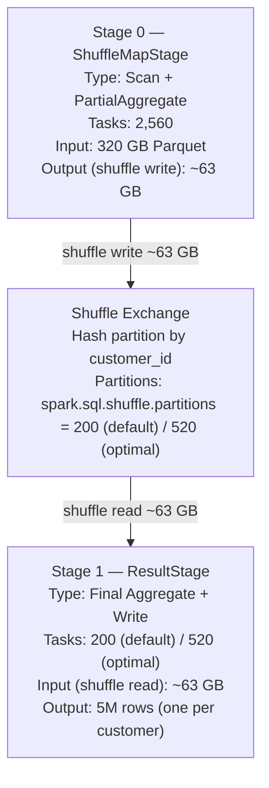

# Scenario 02 — GroupBy Aggregation with Shuffle

**Domain:** Retail sales analytics — daily revenue per customer
**Difficulty:** Standard
**Primary Concepts:** Wide transformation, shuffle boundary, two-stage execution, partial aggregation (map-side combine), shuffle partitions tuning

---

## Cluster Specification

| Component | Detail |
|---|---|
| Executor nodes | 8 |
| Cores per executor | 5 |
| RAM per executor | 24 GB |
| Driver cores | 8 |
| Driver RAM | 16 GB |
| Total executor cores | 8 × 5 = **40 cores** |
| Total executor RAM | 8 × 24 GB = **192 GB** |

---

## Data Characteristics

| Property | Value |
|---|---|
| Total data size | 320 GB (Parquet) |
| Total rows | 1.4 billion |
| Average row size | 320 GB × 1,024 MB/GB / 1,400,000,000 rows ≈ **228 bytes/row** |
| Distinct customer_ids | 5,000,000 |
| Average transactions per customer | 1,400,000,000 / 5,000,000 = **280 transactions/customer** |
| File format | Parquet (splittable regardless of codec) |
| Distribution assumption | Uniform customer distribution across all input files |

---

## Transformation Chain

```
Read Parquet (320 GB)
  ↓ [narrow] filter (if any predicates — pipelines with scan)
  ↓ [narrow] project (select relevant columns — pipelined)
  ↓ [WIDE]   groupBy(customer_id)           ← SHUFFLE BOUNDARY here
  ↓ [narrow] agg(sum(amount), count(), max(txn_date))
  ↓ [narrow] result write / collect
```

Operations labeled:

| Step | Transformation Type | Reason |
|---|---|---|
| Read Parquet | Narrow (scan) | Each task reads its own partition independently |
| filter / project | Narrow | Data stays within the same partition |
| groupBy | **Wide** | customer_id values are scattered across all partitions; must redistribute by key |
| agg (sum, count, max) | Narrow (post-shuffle) | Each reducer owns all rows for a key after shuffle |

Wide transformations in this query: **1**
Expected stage count: 1 wide transformation + 1 = **2 stages**

---

## Pre-Execution Sizing Math

### Input Partition Count

```
spark.sql.files.maxPartitionBytes = 128 MB (default)

total input bytes = 320 GB × 1,024 MB/GB = 327,680 MB

input partitions = ceil(327,680 MB / 128 MB per partition)
                 = ceil(2,560.0)
                 = 2,560 input partitions
```

Each input partition holds:
```
rows per input partition = 1,400,000,000 rows / 2,560 partitions
                         = 546,875 rows/partition ≈ 547,000 rows/partition
```

Sanity check via bytes:
```
bytes per partition = 128 MB = 134,217,728 bytes
rows per partition  = 134,217,728 bytes / 228 bytes per row
                    = 588,674 rows ≈ 589,000 rows/partition
```

The two estimates bracket the same range — use **~560,000 rows per input partition** as the working number.

### Unique Customers Per Input Partition (Partial Aggregation Estimate)

With 5,000,000 distinct customer_ids uniformly distributed, the question is how many unique customers appear in a single partition of 560,000 rows.

Expected appearances per customer per partition:
```
avg appearances per customer globally  = 1,400,000,000 / 5,000,000 = 280 rows/customer
fraction of rows in one partition      = 560,000 / 1,400,000,000 = 0.0004

expected rows per customer in this partition = 280 × 0.0004 = 0.112 rows
```

Using the Poisson complement for P(customer appears at least once):
```
P(appears) = 1 - e^(-0.112) = 1 - 0.8940 = 0.106

expected unique customers per partition = 5,000,000 × 0.106 = 530,000 unique customers
```

So each input partition goes from 560,000 rows → 530,000 unique customer keys after partial aggregation. This is only a ~5% row reduction per partition, but across all partitions the aggregate effect on shuffle traffic is dramatic (see below).

### Shuffle Write Bytes (After Map-Side Combine)

Each input partition emits one partial aggregate row per unique customer seen:

```
output columns after partial agg:
  customer_id   8 bytes  (Long)
  sum_amount    8 bytes  (Double)
  count         8 bytes  (Long)
  max_txn_date  4 bytes  (Date32)
  ≈ 28 bytes raw + Spark serialization overhead → use 50 bytes/row as working estimate

shuffle write per partition = 530,000 unique keys × 50 bytes/key
                            = 26,500,000 bytes
                            ≈ 25.3 MB per partition

total shuffle write = 2,560 partitions × 25.3 MB
                    = 64,768 MB ≈ 63 GB
```

Sanity check from the global row count:
```
total partial-agg rows emitted = 2,560 partitions × 530,000 rows/partition
                               = 1,356,800,000 rows

total shuffle write = 1,356,800,000 rows × 50 bytes/row
                    = 67,840,000,000 bytes ≈ 63 GB   ✓
```

Comparison to a naive (no partial aggregation) shuffle:
```
naive shuffle write = 1,400,000,000 rows × 228 bytes/row
                    = 319,200,000,000 bytes ≈ 297 GB

reduction factor = 297 GB / 63 GB ≈ 4.7×
```

Partial aggregation saved approximately **234 GB of shuffle traffic** in this scenario.

---

## DAG Structure



**Narrative:**
- Stage 0 is a ShuffleMapStage: scans Parquet files (narrow), performs partial (map-side) aggregation, then hash-partitions the partial results by customer_id and writes them to local disk.
- The shuffle exchange redistributes partial aggregates by key so all partial results for the same customer_id land in the same Stage 1 task.
- Stage 1 is the ResultStage: each task reads its slice of the shuffle data and performs the final merge aggregation (sum of partial sums, sum of partial counts, max of partial maxes), producing one output row per customer.

---

## Stage-by-Stage Execution Trace

### Stage 0 — ShuffleMapStage (Scan + Partial Aggregate)

| Metric | Value | Derivation |
|---|---|---|
| Input partitions (tasks) | 2,560 | 327,680 MB / 128 MB |
| Total cluster cores | 40 | 8 executors × 5 cores |
| Concurrent tasks | 40 | one per core |
| Task waves | ceil(2,560 / 40) = **64 waves** | 2,560 / 40 = 64.0 exactly |
| Input per task | 128 MB | one partition = one split |
| Rows per task | ~560,000 | 1,400,000,000 / 2,560 |
| Unique keys per task after partial agg | ~530,000 | 5,000,000 × (1 - e^-0.112) |
| Shuffle write per task | ~25.3 MB | 530,000 × 50 bytes |
| Total shuffle write | ~63 GB | 2,560 × 25.3 MB |
| Memory pressure | Low | 128 MB input vs 1,457 MB execution budget |

Stage 0 is CPU-bound, not memory-bound. The partial aggregation hash map (530,000 entries of {customer_id → running_sum, running_count, running_max}) occupies roughly:
```
hash map size ≈ 530,000 entries × 50 bytes/entry = 26.5 MB
```

26.5 MB fits trivially within the 1,457 MB execution budget per task. No spill to disk expected.

Wave analysis for Stage 0:
```
Stage 0 tasks = 2,560
Wave capacity = 40 tasks/wave
Waves         = 2,560 / 40 = 64.0 → exactly 64 full waves (no partial final wave)
Core utilization per wave = 40/40 = 100%
```

2,560 is an exact multiple of 40 — every wave in Stage 0 runs at 100% core utilization. No cores ever sit idle during Stage 0.

### Stage 1 — ResultStage (Final Aggregate) — Default 200 Partitions

| Metric | Value | Derivation |
|---|---|---|
| Shuffle partitions (tasks) | 200 | spark.sql.shuffle.partitions default |
| Total cluster cores | 40 | 8 executors × 5 cores |
| Concurrent tasks | 40 | one per core |
| Task waves | ceil(200 / 40) = **5 waves** | 200 / 40 = 5.0 exactly |
| Shuffle read per task | 64,512 MB / 200 = **315 MB** | |
| Final output rows per task | 5,000,000 / 200 = 25,000 customer rows | |
| Memory pressure | Low-medium | 315 MB shuffle read vs 1,457 MB execution budget |

200 is also an exact multiple of 40, so Stage 1 also runs at 100% core utilization. The issue is not utilization — it is partition size and the low wave count.

Why 200 is wrong:
```
shuffle data = 63 GB = 64,512 MB
optimal partition size target = 128 MB

optimal shuffle partitions = ceil(64,512 MB / 128 MB)
                           = ceil(504.0)
                           = 504

round to nearest multiple of total cores (40):
  ceil(504 / 40) × 40 = 13 × 40 = 520 partitions
```

With 200 partitions each task processes 315 MB instead of the 128 MB target.

### Stage 1 — ResultStage (Final Aggregate) — Optimal 520 Partitions

| Metric | Value | Derivation |
|---|---|---|
| Shuffle partitions (tasks) | 520 | ceil(63 GB / 128 MB) rounded to multiple of 40 |
| Task waves | ceil(520 / 40) = **13 waves** | 520 / 40 = 13.0 exactly |
| Shuffle read per task | 64,512 MB / 520 = **124 MB** | near-ideal 128 MB target |
| Core utilization per wave | 40/40 = 100% | 520 is exact multiple of 40 |

---

## Memory Budget Analysis

### Full Executor Memory Breakdown

```
spark.executor.memory = 24 GB = 24,576 MB

Step 1: Reserved memory (hardcoded JVM overhead)
  Reserved memory       = 300 MB

Step 2: Usable heap
  Usable heap           = 24,576 - 300 = 24,276 MB

Step 3: Unified vs User split (spark.memory.fraction = 0.6 default)
  Unified memory        = 24,276 × 0.6 = 14,565.6 MB ≈ 14,566 MB
  User memory           = 24,276 × 0.4 =  9,710.4 MB ≈  9,710 MB

Step 4: Storage vs Execution split (spark.memory.storageFraction = 0.5 default)
  Storage floor         = 14,566 × 0.5 = 7,283 MB
  Execution initial     = 14,566 × 0.5 = 7,283 MB
```

Storage and Execution share the full 14,566 MB Unified pool dynamically. Execution can evict Storage (LRU), but Storage cannot evict Execution.

### YARN Container Memory

```
spark.executor.memory = 24,576 MB

memoryOverhead = max(384 MB, 0.10 × 24,576 MB)
               = max(384, 2,458)
               = 2,458 MB

Total YARN container = 24,576 + 2,458 = 27,034 MB ≈ 26.4 GB per executor
```

### Memory Per Task (5 concurrent tasks per executor)

```
Execution memory available    = 7,283 MB
Concurrent tasks per executor = 5 (= spark.executor.cores)

Max execution memory per task = 7,283 / 5  = 1,457 MB (~1.4 GB)
Min execution memory per task = 7,283 / 10 =   729 MB (~730 MB)
```

The min/max range exists because Spark allows a task to use up to 1/N of execution memory (N = concurrent tasks), but requires at least 1/(2N) to be free before granting a new task any memory. Tasks requesting more than their max share block and may trigger spill.

### Memory Budget Summary Table

| Region | Formula | Size |
|---|---|---|
| spark.executor.memory | configured | 24,576 MB (24 GB) |
| memoryOverhead | max(384, 10% × 24,576) | 2,458 MB |
| Total YARN container | executor + overhead | 27,034 MB |
| Reserved memory | hardcoded | 300 MB |
| Usable heap | 24,576 - 300 | 24,276 MB |
| Unified memory | usable × 0.6 | 14,566 MB |
| User memory | usable × 0.4 | 9,710 MB |
| Execution memory (initial) | unified × 0.5 | 7,283 MB |
| Storage memory (floor) | unified × 0.5 | 7,283 MB |
| Max execution per task (5 cores) | 7,283 / 5 | 1,457 MB |
| Min execution per task (5 cores) | 7,283 / 10 | 729 MB |

---

## Parallelism and Wave Analysis

### Cluster Parallelism

```
total cluster cores = 8 executors × 5 cores/executor = 40 cores
concurrent tasks    = 40  (spark.task.cpus = 1, default)
```

### Full Wave Comparison

| Stage | Tasks (Default) | Waves (Default) | Tasks (Optimal) | Waves (Optimal) |
|---|---|---|---|---|
| Stage 0 (Scan + Partial Agg) | 2,560 | ceil(2,560/40) = **64** | 2,560 | 64 (unchanged) |
| Stage 1 (Final Agg) | 200 | ceil(200/40) = **5** | 520 | ceil(520/40) = **13** |
| **Total tasks** | **2,760** | | **3,080** | |

### Utilization Notes

```
Stage 0: 2,560 tasks, 40 cores
  2,560 / 40 = 64.0 → 64 full waves, 0 idle slots
  Core utilization = 100% across all waves

Stage 1 default (200 tasks):
  200 / 40 = 5.0 → 5 full waves, 0 idle slots
  Core utilization = 100% across all waves
  BUT: each task reads 315 MB vs 128 MB target

Stage 1 optimal (520 tasks):
  520 / 40 = 13.0 → 13 full waves, 0 idle slots
  Core utilization = 100% across all waves
  Each task reads 124 MB ≈ 128 MB target   ✓

Pathological case — 201 tasks:
  201 / 40 = 5.025 → 6 waves
  Wave 6 runs 1 task, 39 cores idle
  Core utilization wave 6 = 1/40 = 2.5%
  → Always align partition count to a multiple of total cores
```

### Stage Duration Asymmetry

Stage 0 runs 64 waves. Stage 1 (default) runs only 5 waves. Stage 0 dominates total job duration regardless of per-task speed. If 1 wave takes 30 seconds:
```
Stage 0 duration ≈ 64 waves × 30s = ~32 minutes
Stage 1 duration ≈  5 waves × 30s =  ~2.5 minutes (reads faster, smaller output)
```

Total job time is dominated by Stage 0. Increasing shuffle partitions from 200 to 520 only affects Stage 1 (adds ~8 more waves), a minor addition.

---

## Bottleneck Identification

### Primary Bottleneck: Stage 0 Duration (Wave Count)

Stage 0 runs 64 waves to process 320 GB of input data. This is the correct amount of work — the bottleneck is inherent to the data volume. To reduce Stage 0 duration, you would need to either reduce the data scanned (predicate/column pruning, partition pruning) or increase cluster cores.

### Secondary Issue: Underpartitioned Shuffle (Stage 1, Default 200)

With 200 shuffle partitions on 63 GB of shuffle data:
```
315 MB per Stage 1 task vs 128 MB target = 2.5× oversize
```

In this scenario, 315 MB per task does not cause spill (1,457 MB execution budget is sufficient), but it does create resistance to skew: if one customer_id hash bucket is disproportionately large, a single 315 MB task could balloon further while peers finish quickly.

### What Is NOT a Bottleneck

**Memory spill**: 1,457 MB execution budget vs 25.3 MB partial-agg hash map (Stage 0) and 315 MB shuffle read (Stage 1). Memory is not the constraint in any stage.

**GC pressure**: 9,710 MB of User Memory per executor provides ample headroom for JVM object allocation.

**Data skew**: Assumed uniform distribution. In a real retail dataset, VIP customers could create hot hash buckets in Stage 1. With 200 shuffle partitions each bucket handles ~25,000 customers on average; a VIP cluster could produce one task with 10× the average rows.

---

## Optimizer Decisions

### Partial Aggregation (Map-Side Combine)

Spark's Catalyst optimizer automatically inserts a `partial aggregate` step before the shuffle for all decomposable aggregation functions. sum, count, min, max are all decomposable. Non-decomposable functions (collect_list, collect_set, countDistinct without approximation) bypass partial aggregation and force the full dataset through the shuffle.

Effect in this scenario:
```
Without partial aggregation:
  shuffle write = 1,400,000,000 rows × 228 bytes/row = 319,200,000,000 bytes ≈ 297 GB

With partial aggregation:
  shuffle write = 2,560 × 530,000 unique keys × 50 bytes/key ≈ 63 GB

Reduction factor = 297 GB / 63 GB ≈ 4.7×
Bytes saved = 297 - 63 = 234 GB of shuffle traffic eliminated
```

### AQE (Adaptive Query Execution — Spark 3.2+ Default)

With `spark.sql.adaptive.enabled = true` (default since Spark 3.2):

- After Stage 0 completes, AQE reads actual shuffle map output statistics (bytes written per reducer bucket).
- `spark.sql.adaptive.coalescePartitions.enabled = true` (default): AQE merges consecutive small shuffle partitions up to `spark.sql.adaptive.advisoryPartitionSizeInBytes` (default 64 MB).

In this scenario with default 200 partitions → 315 MB/task: partitions are already large, AQE coalescing will NOT trigger (it only merges small partitions upward, not splits large ones).

With 520 partitions → 124 MB/task: above the 64 MB advisory size, AQE will also leave partitions as-is.

**Recommended AQE approach**: Set `spark.sql.shuffle.partitions = 2000` (generous upper bound) and let AQE coalesce at runtime. With 63 GB of shuffle data AQE targets ~64 MB/partition → coalesces toward ~64,512 MB / 64 MB = 1,008 partitions. This eliminates the need to pre-compute the optimal count while still avoiding 315 MB oversize partitions.

### Broadcast Threshold

Not applicable. `spark.sql.autoBroadcastJoinThreshold` applies only to join operations. GroupBy aggregations are not eligible for broadcast optimization.

---

## Key Numbers Summary

| Metric | Value | Derivation |
|---|---|---|
| Input partitions (Stage 0 tasks) | 2,560 | 327,680 MB / 128 MB |
| Rows per input partition | ~560,000 | 1,400,000,000 / 2,560 |
| Unique customer keys per partition | ~530,000 | 5,000,000 × (1 - e^-0.112) |
| Map-side row reduction per partition | ~5% | 560K → 530K rows |
| Total shuffle write (after partial agg) | ~63 GB | 2,560 × 530,000 × 50 bytes |
| Naive shuffle write (no partial agg) | ~297 GB | 1,400,000,000 × 228 bytes |
| Shuffle byte reduction factor | ~4.7× | 297 GB / 63 GB |
| Default shuffle partitions | 200 | spark.sql.shuffle.partitions default |
| Optimal shuffle partitions | 520 | ceil(504) rounded to multiple of 40 |
| Stage 1 shuffle read per task (default) | 315 MB | 64,512 MB / 200 |
| Stage 1 shuffle read per task (optimal) | 124 MB | 64,512 MB / 520 |
| Total cluster cores | 40 | 8 executors × 5 cores |
| Stage 0 task waves | 64 | ceil(2,560 / 40) = 64.0 exactly |
| Stage 1 task waves (default 200) | 5 | ceil(200 / 40) = 5.0 exactly |
| Stage 1 task waves (optimal 520) | 13 | ceil(520 / 40) = 13.0 exactly |
| Stage 0 core utilization | 100% | 2,560 = 64 × 40 exact |
| Stage 1 core utilization (default) | 100% | 200 = 5 × 40 exact |
| Total tasks (default) | 2,760 | 2,560 + 200 |
| Total tasks (optimal) | 3,080 | 2,560 + 520 |
| Executor memory | 24,576 MB | configured |
| YARN container per executor | 27,034 MB | 24,576 + 2,458 overhead |
| Usable heap per executor | 24,276 MB | 24,576 - 300 reserved |
| Unified memory per executor | 14,566 MB | 24,276 × 0.6 |
| Execution memory per executor | 7,283 MB | 14,566 × 0.5 |
| Max execution per task (5 cores) | 1,457 MB | 7,283 / 5 |
| Memory pressure Stage 0 | None | 25.3 MB hash map vs 1,457 MB budget |
| Memory pressure Stage 1 (default) | None | 315 MB shuffle read vs 1,457 MB budget |
| Final output rows | 5,000,000 | one row per distinct customer_id |
| Total stages | 2 | 1 wide transformation + 1 |

---

## Interview Takeaways

**1. Partial aggregation is the most impactful automatic optimization in a groupBy — and it is free.**
Catalyst inserts map-side combine automatically for all decomposable functions (sum, count, min, max). In this scenario it reduced shuffle bytes from 297 GB to 63 GB — a 4.7× reduction — eliminating 234 GB of network traffic with zero configuration. The cost is a slightly larger hash map per task (25.3 MB here), which is negligible against the 1.4 GB execution budget. The scenario inverts for non-decomposable functions: collect_list forces all 1.4 billion rows through the shuffle, costing the full 297 GB.

**2. The default of 200 shuffle partitions is historically arbitrary — derive the right number from actual shuffle size.**
The correct formula is: `optimal_partitions = ceil(shuffle_write_bytes / target_partition_bytes)`, rounded up to a multiple of total cluster cores. Here: ceil(64,512 MB / 128 MB) = 504 → 520 (multiple of 40). Default 200 gives 315 MB per reduce task vs the 128 MB target. In this scenario 315 MB fits within memory budget so no spill occurs, but the pattern is dangerous at scale: tighter memory budgets, skewed data, or non-aggregation shuffles (joins) with larger per-row payload can easily cause 315 MB tasks to spill.

**3. Partition count must be a multiple of total cluster cores to avoid stranded final waves.**
200 / 40 = 5.0 and 520 / 40 = 13.0 — both exact multiples, both run at 100% core utilization every wave. A count of 201 would produce 6 waves where wave 6 runs 1 task with 39 cores idle. The rule: `best_count = round_up_to_multiple(data_driven_count, total_cluster_cores)`. This simultaneously satisfies the partition size target and eliminates stranded compute.

**4. Stage 0 (scan + partial agg) dominates total job duration — not Stage 1.**
Stage 0 runs 64 waves; Stage 1 runs 5 (default) or 13 (optimal) waves. The job spends the vast majority of its time in Stage 0 reading 320 GB from storage and running the partial aggregation. Tuning shuffle partitions from 200 to 520 only affects Stage 1, which is already the short stage. To materially reduce job duration, focus on Stage 0: reduce scanned data via partition pruning and column pruning, increase the cluster core count, or store the data in a layout that enables more aggressive predicate pushdown.

**5. With AQE enabled, set a generous upper bound on shuffle partitions and let the runtime coalesce.**
Set `spark.sql.shuffle.partitions` to a large value (e.g., 2000) and rely on `spark.sql.adaptive.coalescePartitions.enabled = true`. After Stage 0 completes, AQE reads the actual shuffle map output sizes and merges adjacent small buckets up to `spark.sql.adaptive.advisoryPartitionSizeInBytes` (default 64 MB). This eliminates the need to pre-compute the optimal partition count while preventing both the underpartitioned case (200 × 315 MB) and the overpartitioned overhead case (too many tiny tasks). Manual tuning becomes advisory rather than mandatory.
