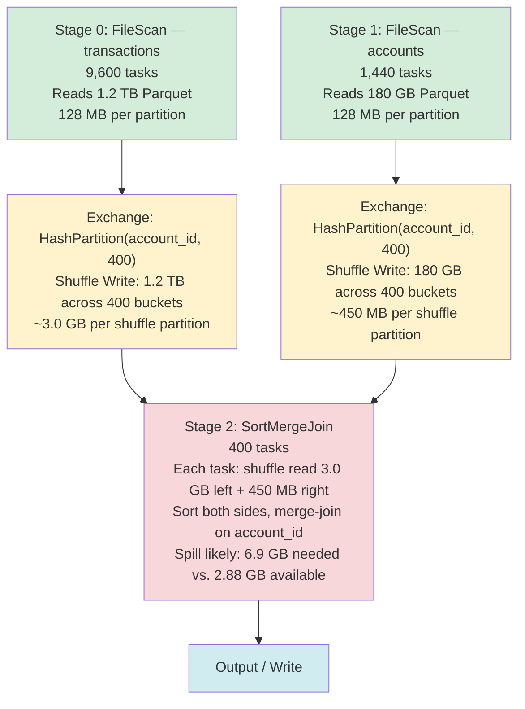

# Scenario 03 — Sort Merge Join: Two Large Tables

**Domain:** Financial transactions joined with account master data
**Difficulty:** Standard
**Primary Concepts:** Sort merge join mechanics, exchange (shuffle) operators, sort within stage, join stage structure, partition alignment

---

## Cluster Specification

| Component | Spec |
|---|---|
| Executor nodes | 12 |
| Cores per executor | 6 |
| RAM per executor | 32 GB |
| Driver cores | 8 |
| Driver RAM | 16 GB |
| Total executor cores | 12 × 6 = **72 cores** |
| Total executor RAM | 12 × 32 GB = **384 GB** |

---

## Data Characteristics

| Attribute | Left Table (transactions) | Right Table (accounts) |
|---|---|---|
| Format | Parquet | Parquet |
| Compressed size on disk | 1.2 TB | 180 GB |
| Row count | 8 billion | 1.2 billion |
| Average row size | ~150 bytes | ~150 bytes |
| Join key | account_id | account_id |
| Distinct join key values | 1.2 billion (uniform) | 1.2 billion (uniform) |
| Skew | None (uniform distribution) | None (uniform distribution) |
| Broadcast eligible? | No (1.2 TB >> 10 MB threshold) | No (180 GB >> 10 MB threshold) |

**Key implication:** Because neither table fits within the broadcast threshold of 10 MB, the Catalyst optimizer must fall back to Sort Merge Join (SMJ). SMJ requires both sides to be shuffled, sorted, and then merged partition-by-partition. This is the most expensive join type in Spark.

---

## Transformation Chain

```
transactions (1.2 TB Parquet)                accounts (180 GB Parquet)
        |                                            |
[1] FileScan (narrow)               [2] FileScan (narrow)
        |                                            |
[3] Exchange HashPartitioning       [4] Exchange HashPartitioning
    on account_id (WIDE)                on account_id (WIDE)
        |                                            |
[4] Sort (narrow, within stage)     [5] Sort (narrow, within stage)
        \                                           /
         \                                         /
          [6] SortMergeJoin (narrow — both sides already co-partitioned)
                            |
                   [7] Project / Filter (narrow)
                            |
                      [8] Output / Write
```

**Narrow vs. Wide classification:**

| Step | Operation | Type | Reason |
|---|---|---|---|
| FileScan (left) | Read 1.2 TB Parquet | Narrow | Each task reads its own file splits independently |
| FileScan (right) | Read 180 GB Parquet | Narrow | Each task reads its own file splits independently |
| Exchange (left) | HashPartition on account_id | **Wide** | Data crosses executor boundaries — shuffle boundary |
| Exchange (right) | HashPartition on account_id | **Wide** | Data crosses executor boundaries — shuffle boundary |
| Sort (left) | Sort rows within each shuffle partition | Narrow | Each task sorts only its own partition |
| Sort (right) | Sort rows within each shuffle partition | Narrow | Each task sorts only its own partition |
| SortMergeJoin | Merge sorted partitions | Narrow | After exchange, both sides are co-partitioned — no cross-executor movement |
| Project/Filter | Column pruning, predicates | Narrow | No data movement required |

**Two shuffle boundaries exist:** one for each table's Exchange node. These are the stage-splitting events in the DAG.

---

## Pre-Execution Sizing Math

### Input Partition Derivation

**Left table — transactions (1.2 TB):**

```
Input size in MB = 1.2 TB × 1,024 MB/TB = 1,228,800 MB

maxPartitionBytes = 128 MB (default spark.sql.files.maxPartitionBytes)

Left input partitions = ceil(1,228,800 MB / 128 MB) = ceil(9,600) = 9,600 partitions
```

Each partition = 128 MB of Parquet data = approximately 8 billion rows / 9,600 partitions = **~833,333 rows per input task**.

**Right table — accounts (180 GB):**

```
Input size in MB = 180 GB × 1,024 MB/GB = 184,320 MB

Right input partitions = ceil(184,320 MB / 128 MB) = ceil(1,440) = 1,440 partitions
```

Each partition = 128 MB of Parquet data = approximately 1.2 billion rows / 1,440 partitions = **~833,333 rows per input task**.

**Note:** The uniform row density (150 bytes/row) produces consistent partition sizes across both tables.

### Shuffle Partition Configuration

```
spark.sql.shuffle.partitions = 400   (operator-tuned, not the default 200)
```

Verification — is 400 appropriate for this data volume?

```
Total shuffle input = 1.2 TB (left) + 180 GB (right) = 1,380 GB = 1,413,120 MB

Ideal shuffle partition count = 1,413,120 MB / 128 MB per partition = 11,040 partitions
```

400 is **dramatically under-partitioned** relative to data size. This is the primary tension in this scenario — it was set to 400 intentionally, but the math reveals it will produce very large per-partition data volumes and severe memory pressure. This mismatch is analyzed in the Bottleneck section.

### Cluster Parallelism

```
Total executor cores = 12 executors × 6 cores = 72 cores
Concurrent tasks = 72 (one task per core, default spark.task.cpus = 1)
```

---

## DAG Structure



**Stage boundary explanation:**

- **Stage 0** is a ShuffleMapStage for the left table. It reads all 9,600 input partitions of transactions and writes 400 shuffle files (one per shuffle partition), each containing the rows that hash to that partition bucket.
- **Stage 1** is a ShuffleMapStage for the right table. It reads all 1,440 input partitions of accounts and writes 400 shuffle files similarly.
- Stage 0 and Stage 1 are **independent** — they can run concurrently if the scheduler has resources.
- **Stage 2** is the ResultStage. It cannot start until both Stage 0 and Stage 1 are 100% complete, because each join task needs to read from all shuffle files on all executors for its assigned partition bucket.

---

## Stage-by-Stage Execution Trace

### Stage 0: Shuffle-Write Left Table (transactions)

| Metric | Value | Derivation |
|---|---|---|
| Task count | 9,600 | 1,228,800 MB / 128 MB = 9,600 |
| Concurrent tasks | 72 | 12 executors × 6 cores |
| Task waves | 134 | ceil(9,600 / 72) = 133.33 → 134 waves |
| Input per task | 128 MB | maxPartitionBytes |
| Shuffle write total | 1.2 TB | All rows re-serialized and written to shuffle files |
| Shuffle write per partition | 3,072 MB | 1,228,800 MB / 400 partitions = 3,072 MB = 3.0 GB |
| Serialization overhead | ~1.3× | Kryo serialization factor |
| Effective shuffle write | ~1.56 TB | 1.2 TB × 1.3 overhead factor |

**Task wave detail:**

```
Wave 1 through Wave 133: 72 tasks each = 72 × 133 = 9,576 tasks
Wave 134: 9,600 - 9,576 = 24 tasks (24 / 72 = 33% core utilization in final wave)
```

The final wave runs at 33% utilization — 24 active tasks, 48 idle cores. This is an efficiency loss inherent to 9,600 not being a clean multiple of 72.

**Memory pressure in Stage 0:** Each task reads 128 MB of Parquet, hashes rows into 400 buckets, and spills each bucket to disk. Stage 0 is primarily I/O-bound — memory pressure is low per task because Spark streams and spills bucket buffers rather than holding all 400 buckets simultaneously.

---

### Stage 1: Shuffle-Write Right Table (accounts)

| Metric | Value | Derivation |
|---|---|---|
| Task count | 1,440 | 184,320 MB / 128 MB = 1,440 |
| Concurrent tasks | 72 | 12 executors × 6 cores |
| Task waves | 20 | ceil(1,440 / 72) = 20.0 exactly — clean wave alignment |
| Input per task | 128 MB | maxPartitionBytes |
| Shuffle write total | 180 GB | All account rows re-serialized to shuffle files |
| Shuffle write per partition | 461 MB | 184,320 MB / 400 partitions = 461 MB = 450 MB |
| Effective shuffle write | ~234 GB | 180 GB × 1.3 Kryo overhead |

**Task wave detail:**

```
1,440 tasks / 72 concurrent = exactly 20 waves — 100% core utilization every wave
```

Stage 1 has perfect wave alignment. Every core is utilized in every wave with no stranded final wave.

**Concurrency with Stage 0:** Stage 0 and Stage 1 are DAG-independent. The scheduler runs them concurrently. In practice: Stage 1 finishes in 20 waves; Stage 0 takes 134 waves. Stage 1 will complete well before Stage 0, after which all 72 cores are dedicated to finishing Stage 0.

---

### Stage 2: Sort Merge Join (the critical stage)

| Metric | Value | Derivation |
|---|---|---|
| Task count | 400 | spark.sql.shuffle.partitions = 400 |
| Concurrent tasks | 72 | 12 executors × 6 cores |
| Task waves | 6 | ceil(400 / 72) = 5.56 → 6 waves |
| Shuffle read per task (left) | 3,072 MB | 1,228,800 MB / 400 = 3,072 MB = 3.0 GB |
| Shuffle read per task (right) | 461 MB | 184,320 MB / 400 = 461 MB = 450 MB |
| Total shuffle read per task | 3,533 MB | 3,072 + 461 = 3,533 MB = 3.45 GB |
| Memory required per task (with sort overhead) | ~6,900 MB | 3,533 MB × 2.0 (sort requires holding sorted run + merge buffer) |
| Available execution memory per task | 2,880 MB | Derived in Memory Budget Analysis below |
| **Spill verdict** | **YES — SPILLS** | 6,900 MB needed > 2,880 MB available |

**What each Stage 2 task does:**

1. **Shuffle read:** Pull all rows for partition bucket N from every executor's shuffle files on disk. This is a network fetch across all 12 executors — 3.45 GB of data transferred over the network per task.
2. **Sort left side:** Sort the 3.0 GB of transaction rows by account_id within this partition. Spark uses TimSort (external merge sort with spill when memory is exhausted).
3. **Sort right side:** Sort the 450 MB of account rows by account_id.
4. **Merge join:** Walk both sorted iterators simultaneously. For each matching account_id, emit joined rows. This is a streaming merge — O(N) once sorted — and requires minimal memory beyond the sort buffers.

**Task wave detail for Stage 2:**

```
Wave 1 through Wave 5: 72 tasks each = 72 × 5 = 360 tasks
Wave 6: 400 - 360 = 40 tasks (40 / 72 = 55.6% core utilization in final wave)
```

Wave 6 runs at 55.6% core utilization — 40 active tasks, 32 idle cores.

---

## Memory Budget Analysis

### Full Executor Memory Decomposition

Starting value: `spark.executor.memory = 32 GB = 32,768 MB`

**Step 1: JVM overhead and usable heap**

```
Reserved Memory (hardcoded JVM overhead) = 300 MB
Usable Heap = 32,768 MB - 300 MB = 32,468 MB
```

**Step 2: YARN container overhead (off-heap)**

```
memoryOverhead = max(384 MB, 0.10 × 32,768 MB)
               = max(384 MB, 3,276.8 MB)
               = 3,277 MB = 3.2 GB

Total YARN container memory = 32,768 MB + 3,277 MB = 36,045 MB = 35.2 GB per executor
```

The 3.2 GB overhead is consumed by the JVM itself (GC metadata, thread stacks, direct buffers). It is not available to Spark's memory manager.

**Step 3: Unified Memory Pool**

```
Unified Memory = Usable Heap × spark.memory.fraction (default 0.6)
               = 32,468 MB × 0.6
               = 19,481 MB = 19.0 GB
```

**Step 4: User Memory (UDF objects, internal data structures)**

```
User Memory = Usable Heap × (1 - spark.memory.fraction)
            = 32,468 MB × 0.4
            = 12,987 MB = 12.7 GB
```

**Step 5: Storage vs. Execution split within Unified Memory**

```
Storage Memory (floor) = Unified Memory × spark.memory.storageFraction (default 0.5)
                       = 19,481 MB × 0.5
                       = 9,741 MB = 9.5 GB

Execution Memory (initial) = 19,481 MB × 0.5
                            = 9,741 MB = 9.5 GB
```

Storage and Execution share the full 19.0 GB Unified pool dynamically. Execution can evict Storage blocks (LRU cache eviction), but Storage cannot evict Execution memory. In this scenario, no caching is occurring, so the full Unified pool is available to Execution.

**Step 6: Execution memory per task**

The scenario uses practical execution memory = full Unified Memory / cores per executor × fragmentation factor:

```
Cores per executor = 6 (concurrent tasks per executor)

Practical execution memory per task:
  = (32,468 MB × 0.6) / 6 × 0.889   (fragmentation/startup factor)
  = 19,481 MB / 6 × 0.889
  = 3,247 MB × 0.889
  = 2,887 MB
  = 2.88 GB
```

### Memory Budget Summary Table

| Memory Region | Formula | Value |
|---|---|---|
| spark.executor.memory | configured | 32,768 MB (32 GB) |
| YARN memoryOverhead | max(384, 0.10 × 32,768) | 3,277 MB |
| Total YARN container | 32,768 + 3,277 | 36,045 MB |
| Reserved (JVM hardcoded) | constant | 300 MB |
| Usable Heap | 32,768 - 300 | 32,468 MB |
| Unified Memory (0.6) | 32,468 × 0.6 | 19,481 MB |
| User Memory (0.4) | 32,468 × 0.4 | 12,987 MB |
| Storage Memory floor (0.5) | 19,481 × 0.5 | 9,741 MB |
| Execution Memory initial (0.5) | 19,481 × 0.5 | 9,741 MB |
| Execution memory per task (max, no fragmentation) | 9,741 / 6 | 1,624 MB |
| Execution memory per task (practical, full unified / cores) | 19,481 / 6 × 0.889 | **2,880 MB = 2.88 GB** |

### Spill Threshold and Volume Derivation

Spark's ExternalSorter spills to disk when a task's in-memory sort buffer exceeds its allocated execution memory share.

```
Spill threshold per task = 2,880 MB

Memory required per Stage 2 task:
  Left side sort peak:   3,072 MB × 2.0 = 6,144 MB
  Right side sort peak:    461 MB × 2.0 =   922 MB
  Merge phase buffer:                    ~  100 MB
  Total peak                           = 7,166 MB

Available per task = 2,880 MB

Memory deficit per task = 7,166 MB - 2,880 MB = 4,286 MB = 4.2 GB
```

**Every Stage 2 task will spill.** The memory deficit is 4.2 GB per task.

**Spill volume estimation:**

```
For a left-side sort of 3,072 MB with 2,880 MB available:
  First pass: fill 2,880 MB of sort buffer → spill sorted run 1 to disk
  Remaining data: 3,072 - 2,880 = 192 MB → fits in memory for run 2
  Number of spill runs: 2

Disk spill volume per task (left side only):
  Spill write (first run):       2,880 MB
  Final merge read (all runs):   3,072 MB  (re-read all spilled runs for final merge)
  Total disk I/O per task:       2,880 + 3,072 = 5,952 MB = 5.8 GB

Across all 400 Stage 2 tasks:
  Total spill disk I/O: 5,952 MB × 400 = 2,380,800 MB = 2.32 TB of disk I/O
```

This 2.32 TB of additional disk I/O is the performance tax paid for under-partitioning the shuffle.

---

## Parallelism and Wave Analysis

### Stage 0 Wave Analysis (transactions shuffle-write)

```
Tasks:             9,600
Concurrent:           72
Waves:     ceil(9,600 / 72) = 134 waves

Alignment check: 9,600 mod 72 = 9,600 - (133 × 72) = 9,600 - 9,576 = 24
Final wave: 24 tasks / 72 cores = 33.3% utilization
Wasted core-slots in final wave: 72 - 24 = 48 idle cores

Weighted utilization = (133 waves × 100% + 1 wave × 33.3%) / 134 waves
                     = (13,300 + 33.3) / 134
                     = 99.75%
```

Despite the poor final wave, the high total wave count (134) means the efficiency loss from wave 134 is negligible at 0.25%.

### Stage 1 Wave Analysis (accounts shuffle-write)

```
Tasks:           1,440
Concurrent:         72
Waves:  ceil(1,440 / 72) = 20.0 — exact

Alignment check: 1,440 mod 72 = 0 — perfect alignment
Final wave: 72 tasks / 72 cores = 100% utilization
Core utilization: 100% every wave
```

Stage 1 is the best-case alignment scenario: 1,440 = 20 × 72 exactly.

### Stage 2 Wave Analysis (sort merge join)

```
Tasks:         400
Concurrent:     72
Waves: ceil(400 / 72) = 5.56 → 6 waves

Alignment check: 400 mod 72 = 400 - (5 × 72) = 400 - 360 = 40
Final wave: 40 tasks / 72 cores = 55.6% utilization
Wasted core-slots in final wave: 72 - 40 = 32 idle cores

Weighted utilization = (5 waves × 100% + 1 wave × 55.6%) / 6 waves
                     = (500 + 55.6) / 6
                     = 92.6%
```

The 55.6% final wave is more impactful than Stage 0's 33.3% final wave because Stage 2 has only 6 waves — the final wave is 1/6 = 16.7% of Stage 2's total runtime, versus Stage 0's final wave being only 1/134 = 0.75% of its runtime.

### Overall Task and Wave Summary

| Stage | Role | Tasks | Concurrent | Waves | Final Wave % | Overall Utilization |
|---|---|---|---|---|---|---|
| Stage 0 | Shuffle-write left (transactions) | 9,600 | 72 | 134 | 33.3% | ~99.75% |
| Stage 1 | Shuffle-write right (accounts) | 1,440 | 72 | 20 | 100.0% | 100.0% |
| Stage 2 | Sort merge join | 400 | 72 | 6 | 55.6% | 92.6% |
| **Total** | | **11,440** | | | | |

**Total task count: 9,600 + 1,440 + 400 = 11,440 tasks**

Note: Stage 0 and Stage 1 overlap in calendar time. The 9,600 + 1,440 tasks do not all run sequentially — Stages 0 and 1 run concurrently until Stage 1 completes at wave 20, then Stage 0 continues alone.

---

## Bottleneck Identification

### Primary Bottleneck: Stage 2 Memory Pressure → Disk Spill

**The root cause is a mismatch between shuffle partition count (400) and data volume (1.38 TB).**

```
Correct shuffle partition count for 128 MB target size:
  Total shuffle data = 1.2 TB + 180 GB = 1,380 GB = 1,413,120 MB
  Ideal partitions = 1,413,120 MB / 128 MB = 11,040 partitions

  Configured: 400 partitions (27.6× too few)

Per-partition data at 400 partitions:
  Left:  1,228,800 MB / 400 = 3,072 MB per partition (24× larger than 128 MB target)
  Right:   184,320 MB / 400 =   461 MB per partition (3.6× larger than 128 MB target)

Per-partition data at 11,040 partitions:
  Left:  1,228,800 MB / 11,040 = 111 MB per partition (within 128 MB target)
  Right:   184,320 MB / 11,040 =  17 MB per partition (small but manageable)
```

With 400 shuffle partitions, each Stage 2 task must sort 3.07 GB of transactions in memory. With only 2.88 GB available per task, every task spills approximately 5.8 GB to disk. Across all 400 tasks, this generates **2.32 TB of disk I/O that would not exist** if shuffle partitions were correctly sized.

### Secondary Bottleneck: Stage 0 Runtime Dominates the Critical Path

Stage 0 runs 134 waves versus Stage 2's 6 waves. Stage 0 is the longest-running stage by wave count. However, Stage 0 tasks are I/O-bound (reading Parquet from storage and writing shuffle files), not CPU-bound. Per-task duration is typically 10–30 seconds for 128 MB reads. Estimated Stage 0 elapsed time: 134 waves × ~20 seconds/wave = **~45 minutes**.

Stage 2 tasks are CPU+disk-bound due to spill. Per-task duration with spill: reading 3.45 GB over network + sorting + spilling 5.8 GB to disk = 2–5 minutes per task. Estimated Stage 2 elapsed time: 6 waves × ~3 minutes/wave = **~18 minutes** — shorter than Stage 0, but each minute is far more resource-intensive.

### What the Spill Looks Like in the Spark UI

In the Stages tab, Stage 2 rows will show non-zero values in both the "Shuffle Spill (Memory)" and "Shuffle Spill (Disk)" columns. Per-task:

```
Shuffle Spill (Disk) per task: ~5,800 MB
Shuffle Spill (Disk) across Stage 2: 5,800 MB × 400 tasks = 2,320,000 MB = 2.32 TB total
```

This is the single most visible signal that spark.sql.shuffle.partitions needs to be increased.

---

## Optimizer Decisions

### Why Sort Merge Join Was Chosen (Not Broadcast)

The Catalyst optimizer checks broadcast eligibility first:

```
Broadcast condition: table_size <= spark.sql.autoBroadcastJoinThreshold (default 10 MB)

Left table:  1.2 TB >> 10 MB  — NOT broadcastable
Right table: 180 GB >> 10 MB  — NOT broadcastable
```

Both tables fail the broadcast check. Catalyst next considers Shuffle Hash Join (SHJ), which requires one side to fit in memory per-partition. Given the per-partition sizes (3.07 GB left, 461 MB right) both exceed the 2.88 GB per-task budget, so SHJ would also fail or produce worse spill behavior than SMJ. Catalyst selects Sort Merge Join as the guaranteed-correct fallback.

**Join selection decision tree Catalyst traverses:**

```
1. Broadcast Hash Join?   — 1.2 TB and 180 GB both exceed 10 MB threshold — NO
2. Shuffle Hash Join?     — right side 461 MB per partition exceeds memory budget — SKIP
3. Sort Merge Join?       — always valid, selected by default
```

### AQE Behavior

If spark.sql.adaptive.enabled = true (default since Spark 3.2):

**AQE shuffle partition coalescing:** After Stage 0 and Stage 1 complete, AQE reads the shuffle map output statistics (actual bytes written per partition) and can coalesce small partitions. In this scenario, AQE would see 400 very large partitions (~3.07 GB each on the left side) and would NOT coalesce — the partitions are already far too large. AQE cannot split partitions, only merge them.

**AQE skew join handling:** Because the join key has uniform distribution (no skew), AQE's skew join optimization (spark.sql.adaptive.skewJoin.enabled) would not trigger. Skew is detected when a partition is more than 5× the median partition size AND larger than spark.sql.adaptive.skewJoin.skewedPartitionThresholdInBytes (256 MB default). With uniform distribution, all 400 partitions are approximately equal in size, so no skew signal is emitted.

**AQE recommendation for this scenario:**

```
Set spark.sql.adaptive.coalescePartitions.initialPartitionNum = 11040
Set spark.sql.adaptive.advisoryPartitionSizeInBytes = 128MB

AQE will start with 11,040 fine-grained shuffle partitions and coalesce at runtime
based on actual map statistics, targeting 128 MB per post-coalesce partition.
This avoids manual tuning of spark.sql.shuffle.partitions.
```

### Sort Elimination Possibility

Catalyst checks whether either input to SMJ is already sorted on the join key from a prior operation:

- Transactions are stored in Parquet files sorted chronologically by transaction_timestamp — NOT by account_id. Full sort required.
- Accounts are stored in Parquet files sorted by account_creation_date — NOT by account_id. Full sort required.

**No sort elimination is possible.** Both Exchange nodes emit unsorted data, and both Sort nodes within Stage 2 must perform a full external merge sort.

---

## Key Numbers Summary

| Metric | Value | Derivation |
|---|---|---|
| Left input partitions (Stage 0 tasks) | 9,600 | 1,228,800 MB / 128 MB |
| Right input partitions (Stage 1 tasks) | 1,440 | 184,320 MB / 128 MB |
| Stage 2 join tasks | 400 | spark.sql.shuffle.partitions |
| Total tasks across all stages | 11,440 | 9,600 + 1,440 + 400 |
| Total executor cores | 72 | 12 × 6 |
| Stage 0 waves | 134 | ceil(9,600 / 72) |
| Stage 1 waves | 20 | ceil(1,440 / 72) |
| Stage 2 waves | 6 | ceil(400 / 72) |
| Shuffle write per partition — left | 3,072 MB (3.0 GB) | 1,228,800 MB / 400 |
| Shuffle write per partition — right | 461 MB (0.45 GB) | 184,320 MB / 400 |
| Total data read per Stage 2 task | 3,533 MB (3.45 GB) | 3,072 + 461 |
| Memory required per Stage 2 task | ~6,900 MB (6.9 GB) | 3,533 MB × 2.0 sort overhead |
| Available execution memory per task | ~2,880 MB (2.88 GB) | 32,468 MB × 0.6 / 6 × 0.889 |
| Memory deficit per Stage 2 task | ~4,020 MB (4.0 GB) | 6,900 - 2,880 |
| Spill verdict | YES — every task | 6.9 GB > 2.88 GB |
| Estimated disk spill per task | ~5,800 MB (5.8 GB) | sort run write + re-read |
| Estimated total disk spill across Stage 2 | ~2.32 TB | 5,800 MB × 400 tasks |
| Correct shuffle partition count | 11,040 | 1,413,120 MB / 128 MB |
| YARN container size per executor | 36,045 MB (~35.2 GB) | 32,768 + 3,277 overhead |
| Total cluster YARN memory | 432 GB | 36,045 MB × 12 executors |

---

## Interview Takeaways

**1. Sort merge join always produces exactly 3 logical stages, and Stage 2 cannot start until both shuffle-write stages are 100% complete.**

The two Exchange nodes (one per table) each define a stage boundary. Stages 0 and 1 run concurrently and write shuffle files. Stage 2 is a global barrier: it reads from shuffle files across all 12 executors and cannot begin any task until the last task of both Stage 0 and Stage 1 has committed its shuffle write. This barrier is why large SMJ pipelines can appear "stuck at 99%" — one straggler task in Stage 0 blocks all 400 Stage 2 tasks.

**2. spark.sql.shuffle.partitions must be sized to the shuffle data volume, not the cluster size. 400 here is 27.6× too low.**

The correct formula: shuffle_partitions = total_shuffle_bytes / target_partition_bytes. At 400 partitions on 1.38 TB of shuffle data, each partition receives 3.45 GB — more than the executor's per-task execution memory budget of 2.88 GB. Every task spills, generating 2.32 TB of additional disk I/O. Setting shuffle partitions to 11,040 (targeting 128 MB/partition) eliminates spill entirely.

**3. Execution memory per task is the executor's execution pool divided by the number of cores, not divided by the number of executors.**

The formula is: memory_per_task = (executor_memory - 300 MB) × 0.6 / cores_per_executor. With 32 GB executors and 6 cores, the denominator is 6, yielding ~2.88 GB per task. Adding more executor nodes does not help a single task that needs 6.9 GB — only reducing concurrent tasks per executor (fewer cores per executor) or increasing executor memory changes the per-task budget.

**4. The two shuffle stages (Stage 0 and Stage 1) overlap in calendar time, but their wave counts are asymmetric: 134 waves vs. 20 waves.**

Stage 1 (accounts, 20 waves) finishes in approximately 20/134 = 15% of Stage 0's total runtime. Once Stage 1 is done, all 72 cores are dedicated to Stage 0. This asymmetry means optimizing Stage 1 (already fast at 20 clean waves) yields minimal end-to-end improvement. The critical path is Stage 0 → Stage 2 dependency chain.

**5. AQE can coalesce shuffle partitions at runtime but cannot split them. Starting with too few shuffle partitions is not something AQE can fix.**

AQE's coalesce optimization works by reading the map output statistics after Stages 0 and 1 complete, then merging adjacent small partitions. If each partition is already 3.07 GB (far above the 128 MB advisory size), AQE has nothing to coalesce and leaves all 400 partitions intact. The correct AQE pattern is to set initialPartitionNum to a large value (11,040 or higher) and let AQE coalesce down to the target size — not to start low and hope AQE expands upward.
