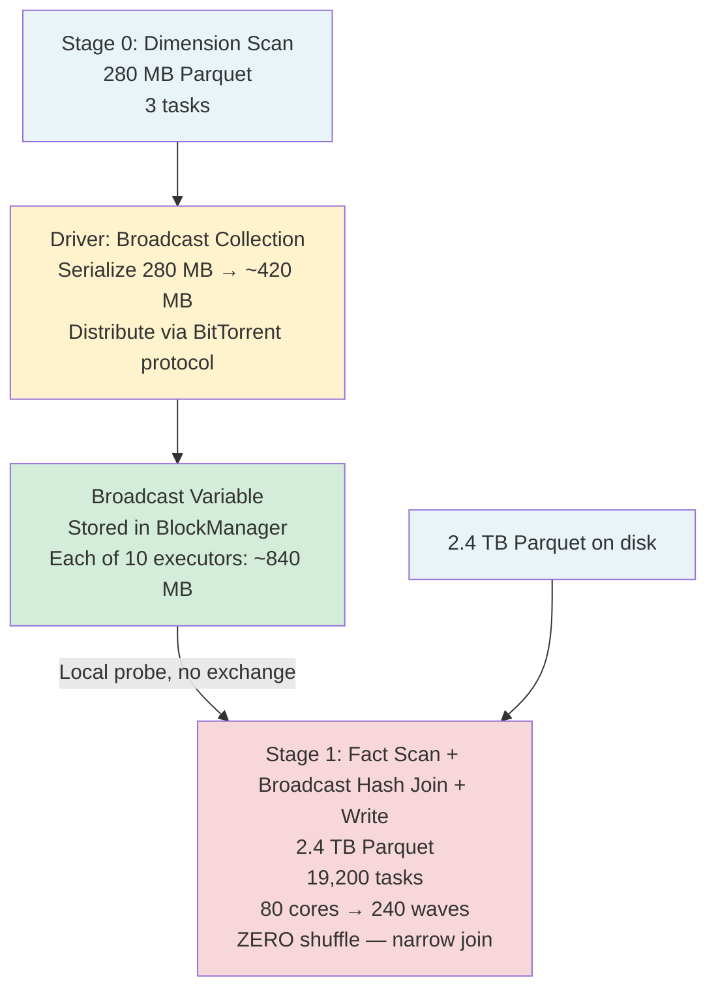

# Scenario 04 — Broadcast Join: Fact Table + Dimension Table

**Domain:** Data warehouse dimension enrichment — orders enriched with product catalog  
**Difficulty:** Intermediate  
**Primary Concepts:** Broadcast join mechanics, broadcast variable memory impact, broadcast threshold tuning, when broadcast eliminates shuffles, executor memory pressure from broadcast

---

## Cluster Specification

| Component | Count | Cores | RAM | Notes |
|---|---|---|---|---|
| Executor nodes | 10 | 8 cores each | 28 GB each | Worker nodes |
| Driver node | 1 | 8 cores | 32 GB | Orchestration + broadcast collection |
| Total executor cores | — | 80 cores | 280 GB total | Usable for tasks |
| Total executor RAM | — | — | 280 GB | Before overhead deductions |

---

## Data Characteristics

| Property | Value | Notes |
|---|---|---|
| Fact table (orders) | 2.4 TB Parquet | Snappy compressed |
| Fact table row count | 16,000,000,000 (16 billion) | ~152 bytes per row on disk |
| Fact table join key | product_id | Integer or string — low-to-moderate cardinality |
| Dimension table (products) | 280 MB Parquet | Product catalog — columnar, static |
| Dimension table row count | 1,800,000 (1.8 million) | ~155 bytes per row on disk |
| Dimension table join key | product_id | Matches fact table key |
| Join type | Inner join (orders must have a matching product) | All 16B fact rows participate |
| Default auto-broadcast threshold | 10 MB (10,485,760 bytes) | 280 MB dimension is far above this default |
| Tuned broadcast threshold | 300 MB (314,572,800 bytes) | `spark.sql.autoBroadcastJoinThreshold = 314572800` |
| Broadcast method | Manual `broadcast()` hint OR tuned threshold | Either triggers broadcast hash join |

### Why 280 MB Does Not Auto-Broadcast at Default Settings

The default `autoBroadcastJoinThreshold = 10 MB` checks the Catalyst-estimated serialized size of the relation. At 280 MB, the products table is 28x over the default limit. Without intervention, Spark would fall back to a Sort-Merge Join, which requires two full shuffle stages — one for the 2.4 TB fact table and one for the 280 MB dimension. The tuned threshold of 300 MB unlocks automatic broadcast, or the engineer applies an explicit `broadcast()` hint which bypasses threshold checking entirely.

---

## Transformation Chain

| Step | Operation | Type | Notes |
|---|---|---|---|
| 1 | Read 2.4 TB Parquet (orders) | Source scan | 19,200 partitions — derived below |
| 2 | Read 280 MB Parquet (products) | Source scan | 3 partitions — but irrelevant post-broadcast |
| 3 | Driver collects products into broadcast variable | Driver-side | Products shipped to all executors |
| 4 | Broadcast hash join: orders joined to broadcast products | Narrow | Each task probes its local copy of the hash table — NO shuffle |
| 5 | Project / select enriched columns | Narrow | Column pruning, computed fields |
| 6 | Write enriched output | Wide (optional repartition) | Sink |

The critical classification is Step 4: **narrow transformation**. Because the dimension table is broadcast, every task on every executor has a local copy of the full products hash table. Each task processes its partition of orders independently, probing its local copy. There is no exchange operator between Stage 1 (scan) and the join. The entire pipeline from scan to write is a **single stage** — zero shuffle boundaries.

---

## Pre-Execution Sizing Math

### Fact Table Input Partitions

```
Fact table size = 2.4 TB = 2,400 GB = 2,400 x 1,024 MB = 2,457,600 MB
maxPartitionBytes = 128 MB (default)

Input partitions = ceil(2,457,600 MB / 128 MB)
                 = ceil(19,200)
                 = 19,200 partitions
```

Each partition covers approximately:

```
Rows per partition = 16,000,000,000 rows / 19,200 partitions
                   = 833,333 rows per partition (~833K rows)
```

### Dimension Table Input Partitions (informational only — becomes irrelevant)

```
Dimension table size = 280 MB
maxPartitionBytes = 128 MB

Dimension input partitions = ceil(280 MB / 128 MB) = ceil(2.19) = 3 partitions
```

These 3 partitions are read by a small number of tasks, their data is collected by the driver, serialized into a broadcast variable, and distributed. The 3 scan tasks complete in a sub-second warm-up stage. After the broadcast variable is built, there is no shuffle of the dimension data at all — those 3 partitions are the last time the dimension data is read from disk.

### Total Cluster Cores and Parallelism

```
Total executor cores = 10 nodes x 8 cores = 80 cores
```

### Wave Analysis for Fact Scan + Join Stage

```
Tasks in join stage = 19,200 (one per fact partition)
Cores available     = 80

Waves = ceil(19,200 / 80) = ceil(240) = 240 waves
```

Each wave runs 80 tasks in parallel (one per core), each reading one 128 MB partition of orders and probing the local broadcast hash table. With no shuffle, no task needs to wait for any other task — pure data-parallel execution.

---

## Memory Budget Analysis

### Step 1: Executor Overhead and Usable Heap

```
spark.executor.memory = 28 GB = 28,672 MB

memoryOverhead = max(384 MB, 0.10 x 28,672 MB)
               = max(384 MB, 2,867 MB)
               = 2,867 MB (~2.8 GB)

Total YARN container = 28,672 MB + 2,867 MB = 31,539 MB (~30.8 GB)

Reserved Memory      = 300 MB (hardcoded JVM safety margin)
Usable Heap          = 28,672 MB - 300 MB = 28,372 MB
```

### Step 2: Unified Memory and User Memory

```
spark.memory.fraction = 0.6 (default)

Unified Memory = 28,372 MB x 0.6 = 17,023 MB (~16.6 GB)
User Memory    = 28,372 MB x 0.4 = 11,349 MB (~11.1 GB)
```

### Step 3: Storage and Execution Split Within Unified Memory

```
spark.memory.storageFraction = 0.5 (default)

Storage Memory Floor  = 17,023 MB x 0.5 = 8,512 MB (~8.3 GB)
Execution Memory Init = 17,023 MB x 0.5 = 8,512 MB (~8.3 GB)
```

### Step 4: Broadcast Variable Memory Footprint Per Executor

The 280 MB figure is the on-disk (serialized, Parquet-compressed) size. Two expansion factors apply:

| Stage | Size | Derivation |
|---|---|---|
| On-disk (Parquet Snappy) | 280 MB | Given |
| Serialized broadcast bytes (driver sends this) | ~420 MB | ~1.5x: Parquet columnar compression removed; Java serialization applied. Parquet is often more compact than Java serialized objects, but the ~1.5x accounts for schema metadata stripping and Java object overhead. |
| Deserialized in-memory hash table (executor holds this) | ~840 MB | ~3x on-disk: Java HashMap with string/int keys, object pointers, array backing, ~2–3x typical for structured catalog data |

```
Broadcast variable in-memory cost per executor = ~840 MB
```

This 840 MB is allocated from the **Storage Memory** region of the Unified Memory pool. It is stored once per executor (in the executor's BlockManager), shared across all 8 tasks running concurrently on that executor.

### Step 5: Execution Memory Per Task After Broadcast

The broadcast consumes storage memory. Under Spark's unified memory model, storage memory and execution memory share the same pool (17,023 MB Unified). Execution can borrow from storage if storage is not fully occupied, but the broadcast variable will occupy a fixed 840 MB of the storage region.

```
Unified Memory per executor       = 17,023 MB
Broadcast occupies (storage area) =    840 MB
Unified Memory remaining          = 17,023 MB - 840 MB = 16,183 MB

This remaining pool is still shared between storage and execution.
Under default storageFraction = 0.5, execution can access up to:

Available for execution (after broadcast) ≈ 16,183 MB x 0.6 = 9,710 MB
(rough approximation: execution can grow into the freed storage space)

Concurrent tasks per executor = 8 cores = 8 concurrent tasks

Max execution memory per task = 9,710 MB / 8 = 1,214 MB (~1.2 GB per task)
Min execution memory per task = 9,710 MB / (2 x 8) = 607 MB (~600 MB per task)
```

Each task reads ~128 MB of compressed Parquet (which expands to ~256–384 MB in memory), performs a hash probe against the local broadcast table, and writes output. The ~1.2 GB ceiling per task is well above the ~384 MB working set — this join is **not memory-constrained**.

### Step 6: Cluster-Wide Broadcast Memory Cost

```
Broadcast cost per executor  = 840 MB
Number of executors          = 10

Total broadcast memory across cluster = 840 MB x 10 = 8,400 MB (~8.2 GB)
```

This is the hidden cluster-wide tax of broadcast joins. 8.2 GB of executor storage memory is occupied by copies of the same 280 MB table. For a 280 GB total executor RAM cluster, that is:

```
Broadcast overhead fraction = 8,400 MB / (280 GB x 1,024 MB/GB)
                             = 8,400 / 286,720
                             = ~2.9% of total cluster RAM
```

At this dimension table size, the 2.9% overhead is entirely acceptable given the elimination of all shuffle I/O.

---

## DAG Structure



**Key structural observation:** There is no Exchange operator (shuffle) in this DAG. Stage 0 is a tiny warm-up (3 tasks, sub-second). Stage 1 is the only substantial stage, containing all 19,200 tasks. The broadcast variable flows into Stage 1 as a side-input, not as a shuffle dependency.

Compare to Sort-Merge Join DAG (hypothetical, if broadcast were disabled):

```
Stage 0: Dimension scan → Stage 1: Dimension shuffle (hash partition by product_id) → 200 tasks
Stage 2: Fact scan → Stage 3: Fact shuffle (hash partition by product_id) → 200 tasks
Stage 4: Sort-merge join on matching partitions → 200 tasks
```

That hypothetical path requires writing the 2.4 TB fact table to shuffle storage and reading it back — effectively doubling the I/O cost of the join.

---

## Stage-by-Stage Execution Trace

### Stage 0: Dimension Table Scan (warm-up)

| Metric | Value | Derivation |
|---|---|---|
| Tasks | 3 | ceil(280 MB / 128 MB) = 3 |
| Parallelism | 3 tasks (trivial) | Well below 80 available cores |
| Wall time | < 1 second | 280 MB / typical scan throughput |
| Shuffle write | 0 bytes | Data goes directly to driver, not shuffle store |
| Driver receives | ~420 MB serialized | Parquet decoded + Java serialization |
| Driver broadcasts | ~420 MB via 4 MB blocks | BitTorrent-like distribution to 10 executors |
| Each executor stores | ~840 MB deserialized | In BlockManager storage region |

The driver must hold the broadcast table in memory during collection and distribution. With `spark.driver.maxResultSize = 1 GB` (default), the ~420 MB serialized table fits. If the driver had insufficient heap, the job would fail at this stage with an OOM before a single fact row is processed.

### Stage 1: Fact Scan + Broadcast Hash Join (main stage)

| Metric | Value | Derivation |
|---|---|---|
| Tasks | 19,200 | 2,400 GB / 128 MB = 19,200 |
| Available cores | 80 | 10 nodes x 8 cores |
| Waves | 240 | ceil(19,200 / 80) = 240 |
| Tasks per wave | 80 | Full cluster utilization |
| Shuffle read | 0 bytes | No shuffle — broadcast join |
| Shuffle write | 0 bytes | No downstream shuffle in this scenario |
| Data scanned per task | ~128 MB compressed (~256–384 MB decompressed) | One Parquet partition |
| Hash probe per task | 1.8M rows probed per partition | Local broadcast table — in-memory lookup |
| Memory per task | ~1.2 GB max, ~600 MB min | Derived in Memory Budget Analysis |
| Stage wall time | 240 waves x (time per wave) | Dominated by disk I/O at ~128 MB/task |

**Join mechanics per task:** Each task reads its 128 MB Parquet partition of orders (~833K rows), deserializes each row, extracts the `product_id`, and performs a hash lookup against the local 840 MB products hash table (1.8M entries). For an inner join, unmatched rows are discarded. There is no sort, no range partition, no network transfer. This is the fastest possible distributed join pattern.

---

## Shuffle Elimination: Quantified Savings vs Sort-Merge Join

### Sort-Merge Join Hypothetical Cost

If broadcast were disabled and a Sort-Merge Join were used instead:

```
Fact shuffle write  = 2.4 TB (entire fact table repartitioned by product_id)
Fact shuffle read   = 2.4 TB (read back for sort-merge)
Dimension shuffle   = 280 MB (negligible)

Total additional I/O = 2.4 TB write + 2.4 TB read = 4.8 TB extra disk/network I/O
```

### Broadcast Join Cost

```
Broadcast distribution = 420 MB x 10 executors = 4.2 GB of network transfer
(BitTorrent protocol: driver sends first chunks; executors peer-share remaining)

Total additional I/O = 4.2 GB network transfer (one-time, before Stage 1 begins)
```

### Savings

```
SMJ shuffle I/O    = 4,800 GB
Broadcast net I/O  =     4.2 GB

I/O reduction = (4,800 - 4.2) / 4,800 = 99.9% reduction in cross-node I/O
```

The broadcast join eliminates effectively all data movement associated with the join operation, at the cost of 4.2 GB of upfront network transfer and 8.4 GB of cluster-wide memory consumption.

---

## Risk Analysis: What Happens When the Dimension Grows?

### Current State: 280 MB (Safe)

```
Per-executor broadcast memory = 840 MB (~3x on-disk)
Per-executor unified memory   = 17,023 MB
Broadcast as % of unified     = 840 / 17,023 = ~4.9%
Verdict: Healthy — execution memory barely affected
```

### Scenario: Dimension Grows to 800 MB

```
Broadcast in-memory per executor = 800 MB x 3 = 2,400 MB (~2.3 GB)
Cluster-wide cost = 2,400 MB x 10 = 24,000 MB (23.4 GB)

Unified Memory per executor = 17,023 MB
Remaining after broadcast   = 17,023 MB - 2,400 MB = 14,623 MB
Max execution per task      = (14,623 MB x 0.6) / 8 = 1,097 MB

Verdict: Still safe. Memory per task decreases slightly but no spill risk.
Tuned threshold needed: autoBroadcastJoinThreshold must be >= 800 MB.
```

### Scenario: Dimension Grows to 2 GB — OOM Risk Threshold

```
Broadcast in-memory per executor = 2,048 MB x 3 = 6,144 MB (~6 GB)
Cluster-wide cost = 6,144 MB x 10 = 61,440 MB (60 GB)

Unified Memory per executor         = 17,023 MB
Storage region floor                = 8,512 MB
Broadcast requires                  = 6,144 MB from storage region
Storage region after broadcast      = 8,512 MB - 6,144 MB = 2,368 MB remaining for storage

Execution memory (initial share)    = 8,512 MB
Under memory pressure, execution can borrow from the remaining storage space.
Max available for execution         ≈ 8,512 MB + 2,368 MB = 10,880 MB (if storage fully yields)
Max execution per task              = 10,880 MB / 8 = 1,360 MB

However: The 6,144 MB broadcast load is 36% of the executor's unified memory.
If combined execution demand (8 tasks x 400 MB working set = 3,200 MB) plus broadcast (6,144 MB)
exceeds unified memory (17,023 MB): 3,200 + 6,144 = 9,344 MB — still fits.

Verdict: Marginal at 2 GB. Not immediate OOM, but headroom is shrinking.
The absolute hard limit in BroadcastExchangeExec.scala is 8 GB serialized.
A 2 GB on-disk table → ~3 GB serialized — still under the 8 GB code limit.
```

### Scenario: Dimension Grows to 3 GB — Hard OOM Territory

```
Broadcast in-memory per executor = 3,072 MB x 3 = 9,216 MB (~9 GB)

Executor unified memory = 17,023 MB
Broadcast alone = 9,216 MB = 54% of unified memory consumed by one variable

Remaining for execution (8 concurrent tasks) = 17,023 - 9,216 = 7,807 MB
Max execution per task = 7,807 / 8 = 976 MB

This is still technically non-OOM, but:
  - GC pressure from a 9 GB JVM object is severe
  - Any GC pause during broadcast distribution creates timeout risk
  - spark.sql.broadcastTimeout = 300 seconds (default) — large tables risk timeout
  - Cluster-wide: 9,216 MB x 10 = 92,160 MB (90 GB) consumed by broadcast copies

Verdict: Dangerous. Likely GC-induced slowdowns, possible timeout OOM.
Switch to Sort-Merge Join or Bucket Join at this size.
```

### Dimension Growth Danger Summary Table

| Dimension Size (on-disk) | In-Memory Per Executor (~3x) | Cluster Total (10 executors) | % of Per-Executor Unified Memory | Verdict |
|---|---|---|---|---|
| 280 MB (current) | 840 MB | 8.4 GB | 4.9% | Safe |
| 500 MB | 1,500 MB | 15 GB | 8.8% | Safe |
| 800 MB | 2,400 MB | 24 GB | 14.1% | Safe — watch GC |
| 1.5 GB | 4,608 MB | 46 GB | 27.1% | Marginal |
| 2 GB | 6,144 MB | 61 GB | 36.1% | Risky — reduced execution headroom |
| 3 GB | 9,216 MB | 92 GB | 54.1% | Dangerous — GC pressure, timeout risk |
| ~5.7 GB (serialized ~8 GB) | N/A | N/A | Exceeds code limit | Hard failure: SparkException thrown |

The practical danger threshold for this cluster is approximately **2 GB on-disk dimension** (~6 GB in-memory per executor). Above that size, the team should evaluate bucket joins (pre-partitioned by `product_id`) as a zero-shuffle alternative that does not require holding the full table in executor memory.

---

## Parallelism and Wave Analysis

```
Total tasks in main stage = 19,200
Total executor cores      = 80

Waves = ceil(19,200 / 80) = 240 waves
Tasks per wave            = 80 (full utilization — 19,200 is divisible by 80)
Cluster utilization       = 80 / 80 = 100% for all 240 waves
```

This is ideal parallelism. 19,200 tasks / 80 cores = exactly 240.0 waves — no partial final wave. Every wave uses all 80 cores. The job has no tail effect from an undersized final wave.

```
Rows processed per wave   = 80 tasks x 833,333 rows/task = ~66.7 million rows
Total rows validated      = 240 waves x 66.7M = ~16B rows ✓
```

### Comparison: SMJ Wave Analysis (hypothetical)

Under Sort-Merge Join with `spark.sql.shuffle.partitions = 200` (default):

```
Post-shuffle tasks = 200
Waves             = ceil(200 / 80) = 3 waves
  Wave 1: 80 tasks (full)
  Wave 2: 80 tasks (full)
  Wave 3: 40 tasks (50% utilization — tail wave)

But preceding shuffle stages (sort + write) also need 19,200 fact scan tasks (240 waves).
Total stages: 5 stages vs 2 stages for broadcast join.
```

The broadcast join eliminates 3 shuffle stages entirely and produces a cleaner, single-stage execution for the join itself.

---

## Bottleneck Identification

### Primary Bottleneck: Disk I/O Throughput at Scale

With zero shuffle, the bottleneck shifts entirely to disk read throughput:

```
Total data scanned = 2.4 TB
Per-executor scan load = 2.4 TB / 10 executors = 240 GB per executor
Per-core scan load = 240 GB / 8 cores = 30 GB per core
Tasks per core across full job = 19,200 / 80 = 240 tasks per core
Each task reads 128 MB → 240 x 128 MB = 30,720 MB = 30 GB per core ✓
```

The job is I/O-bound, not CPU-bound and not memory-bound. Optimizing read throughput (local data placement, parallel file reads, larger partition sizes if tasks are I/O-bound) would reduce wall time more than any CPU or memory tuning.

### Secondary Bottleneck: Broadcast Distribution Latency

Before Stage 1 begins, all 10 executors must receive the broadcast variable. With a 420 MB serialized broadcast distributed over a 10 Gbps internal network:

```
Naive sequential: 420 MB x 10 = 4,200 MB / 10 Gbps = ~3.4 seconds
BitTorrent protocol: Initial chunks from driver, then peer sharing
Practical time: ~1–2 seconds for 10 executors at 420 MB
```

This is a one-time cost paid before Stage 1. It does not scale with the 16 billion fact rows.

### Non-Bottleneck: CPU (hash probe)

Hash table lookup for a single row is O(1). For 833K rows per task against a 1.8M-row hash table, the probe time is negligible relative to I/O:

```
Rows per task = 833,333
Hash lookups  = 833,333 O(1) operations
At 100M lookups/second (conservative JVM HashMap): ~8.3 ms CPU per task
Disk I/O for 128 MB at 500 MB/s: ~256 ms per task
CPU is <4% of task time — not the bottleneck
```

---

## Optimizer Decisions

### Broadcast Hash Join Selection

Spark's Catalyst optimizer selects Broadcast Hash Join when:

1. `autoBroadcastJoinThreshold` is set to 300 MB (`314572800` bytes) and the dimension table's estimated size (via Parquet footer statistics) is <= 300 MB, OR
2. The query contains an explicit `broadcast()` hint on the dimension table — hint overrides the threshold check entirely

In this scenario, either mechanism works. The hint is more reliable because it bypasses Catalyst's size estimation, which can be inaccurate if table statistics are stale.

### Which Side Gets Broadcast?

Spark always broadcasts the **smaller** relation. In a broadcast hash join:
- The broadcast side (products, 280 MB) is built into an in-memory hash table
- The streaming side (orders, 2.4 TB) is scanned partition by partition
- Each task on the streaming side probes the local copy of the hash table

If the user applied `broadcast()` to the wrong side (orders), Spark would attempt to broadcast 2.4 TB — hitting the 8 GB hard limit and throwing an immediate SparkException. Catalyst protects against this in most cases when using `autoBroadcastJoinThreshold`, but explicit hints bypass this protection.

### AQE Interaction

With `spark.sql.adaptive.enabled = true` (default in Spark 3.x+):

- AQE cannot convert a Sort-Merge Join to Broadcast Hash Join at runtime if the table is above the AQE broadcast threshold (`spark.sql.adaptive.autoBroadcastJoinThreshold`, which defaults to the same value as `autoBroadcastJoinThreshold`)
- However, if the threshold is set correctly (300 MB in this scenario), AQE confirms or re-evaluates the broadcast decision at runtime after the dimension scan completes, using actual measured bytes rather than Catalyst estimates
- AQE skew join detection does not apply here: broadcast hash joins do not produce shuffle partitions on the streaming side, so there are no post-shuffle partitions to inspect for skew

### Broadcast Timeout Risk

```
spark.sql.broadcastTimeout = 300 seconds (default)

At 420 MB over a 1 Gbps network (conservative): 420 MB / 125 MB/s = ~3.4 seconds
At 420 MB over a congested 100 Mbps link: 420 MB / 12.5 MB/s = ~34 seconds
```

With standard 10 Gbps internal networking, the 300-second timeout is never a concern at 280 MB. It becomes relevant at dimensions approaching 3–5 GB where distribution to many executors can take minutes.

---

## Key Numbers Summary

| Metric | Value | Derivation |
|---|---|---|
| Fact table input partitions | 19,200 | 2,400 GB / 128 MB = 19,200 |
| Dimension table input partitions | 3 | ceil(280 MB / 128 MB) = 3 |
| Total executor cores | 80 | 10 nodes x 8 cores |
| Waves (main stage) | 240 | ceil(19,200 / 80) = 240 |
| Shuffle stages | 0 | Broadcast join is narrow — no Exchange operator |
| Broadcast on-disk size | 280 MB | Given |
| Broadcast serialized size (driver sends) | ~420 MB | ~1.5x on-disk |
| Broadcast in-memory per executor | ~840 MB | ~3x on-disk (deserialized JVM objects) |
| Total broadcast memory across cluster | ~8,400 MB (~8.2 GB) | 840 MB x 10 executors |
| Broadcast as % of per-executor unified memory | ~4.9% | 840 MB / 17,023 MB |
| Executor overhead | ~2,867 MB | max(384 MB, 0.10 x 28,672 MB) |
| Usable heap per executor | 28,372 MB | 28,672 MB - 300 MB reserved |
| Unified memory per executor | 17,023 MB | 28,372 MB x 0.6 |
| User memory per executor | 11,349 MB | 28,372 MB x 0.4 |
| Execution memory per task (max) | ~1,214 MB | ~(17,023 - 840) MB x 0.6 / 8 |
| Execution memory per task (min) | ~607 MB | max / 2 |
| SMJ shuffle I/O (hypothetical) | 4,800 GB | 2 x 2.4 TB fact shuffle |
| Broadcast I/O (actual) | ~4.2 GB | 420 MB x 10 executors |
| I/O reduction vs SMJ | ~99.9% | (4,800 GB - 4.2 GB) / 4,800 GB |
| Dimension growth danger threshold | ~2 GB on-disk | ~6 GB in-memory = 36% of unified memory |
| Broadcast hard code limit | 8 GB serialized | BroadcastExchangeExec.scala enforcement |
| Rows per task | ~833,333 | 16B rows / 19,200 tasks |
| Cluster utilization | 100% | 19,200 tasks / 80 cores = exactly 240 waves |

---

## Interview Takeaways

1. **Broadcast joins eliminate shuffle entirely — the join is narrow, not wide.** The shuffle/no-shuffle distinction is the most important classification in Spark performance. By broadcasting 280 MB, this scenario avoids writing and reading 4.8 TB of shuffle data. The trade-off is 8.4 GB of cluster-wide memory consumed by the broadcast copies — a trade that is overwhelmingly favorable at this scale.

2. **The memory cost of broadcast is per-executor, not per-task.** 10 executors means exactly 10 copies of the 840 MB in-memory hash table, regardless of whether 80 tasks or 800 tasks are running. Misunderstanding this leads to massively overcalculating broadcast memory cost (per-task would be 80 x 840 MB = 67 GB, not 8.4 GB).

3. **On-disk size and in-memory size diverge by 3x for typical dimension tables.** The autoBroadcastJoinThreshold is measured against serialized/compressed size, but the executor pays the deserialized cost. A 280 MB Parquet file becomes ~840 MB in the executor's JVM heap. Engineers who tune the threshold against on-disk size without accounting for this expansion underestimate memory pressure.

4. **Dimension growth from 280 MB to 3 GB changes the risk profile dramatically.** At 280 MB, broadcast consumes 4.9% of unified memory per executor — negligible. At 3 GB, it consumes 54% — leaving only ~8 GB for 8 concurrent tasks and creating severe GC pressure. The danger threshold for this cluster is approximately 2 GB on-disk. Above that, bucket join (pre-partitioned static tables) provides zero-shuffle joins without the memory risk.

5. **Explicit broadcast() hints are more reliable than threshold tuning alone.** AQE can re-evaluate join strategies at runtime, but only within the bounds of the configured threshold. An explicit hint bypasses size estimation uncertainty. For a known-static dimension table that will always be small enough to broadcast, the hint is preferable to relying on Catalyst's potentially stale statistics. The downside: the hint also bypasses the safety check that prevents accidentally broadcasting the wrong (large) side.
