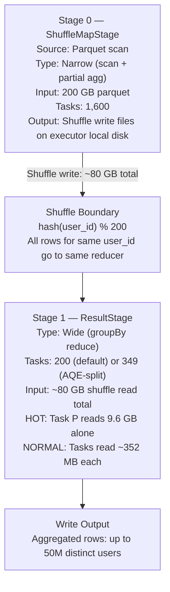

# Scenario 05 — Skewed GroupBy: Hot Key Problem

**Domain:** Social media platform — engagement metrics per user (celebrity accounts cause skew)
**Difficulty:** Intermediate
**Primary Concepts:** Data skew, hot key, straggler task, AQE skew detection, partition splitting, task time distribution, skew factor calculation

---

## Cluster Specification

| Resource | Value |
|---|---|
| Executor nodes | 10 |
| Cores per executor | 4 |
| RAM per executor | 16 GB |
| Total executor cores | 10 x 4 = **40 cores** |
| Total executor RAM | 10 x 16 GB = **160 GB** |
| Driver cores | 4 |
| Driver RAM | 8 GB |

---

## Data Characteristics

| Attribute | Value |
|---|---|
| Total dataset size | 200 GB |
| File format | Parquet |
| Total engagement events (rows) | 2,000,000,000 (2 billion) |
| Distinct user_ids | 50,000,000 (50 million) |
| Top 10 celebrity accounts share | 35% of all data = 700,000,000 rows |
| Top 1 celebrity account share | 12% of all data = **240,000,000 rows** |
| Remaining regular users | 49,999,990 users share 65% = 1,300,000,000 rows |

### Row Size Estimation

Each engagement event contains:

| Field | Type | Size |
|---|---|---|
| user_id | BIGINT | 8 bytes |
| engagement_score | DOUBLE | 8 bytes |
| content_id | UUID / STRING (16 chars) | 16 bytes |
| timestamp | TIMESTAMP (epoch long) | 8 bytes |
| **Total per row** | | **40 bytes uncompressed** |

Parquet on-disk compression ratio is approximately 4-5x for this schema (repetitive user_ids compress extremely well with dictionary encoding). The 200 GB on disk expands to approximately 800 GB to 1,000 GB in memory. For shuffle sizing purposes, post-decompression row sizes apply.

### Skew Distribution Summary

| User Segment | Row Count | % of Total |
|---|---|---|
| Top 1 celebrity | 240,000,000 | 12% |
| Top 2-10 celebrities | 460,000,000 | 23% |
| 49,999,990 regular users | 1,300,000,000 | 65% |

---

## Transformation Chain

The operation under analysis:

```
engagements
  groupBy(user_id)                          [WIDE — shuffle boundary]
    agg(
      count(),                              [narrow within reduce phase]
      sum(engagement_score),                [narrow within reduce phase]
      collect_list(content_id)              [DANGEROUS — see Memory Budget Analysis]
    )
```

| Step | Transformation Type | Reason |
|---|---|---|
| Read parquet | Narrow | File scan, no data movement |
| groupBy(user_id) | **Wide** | Requires shuffle: all rows for a key must land on the same task |
| count() | Narrow (within agg) | Partial aggregation pipelined into shuffle write |
| sum(engagement_score) | Narrow (within agg) | Partial aggregation pipelined into shuffle write |
| collect_list(content_id) | Narrow (within agg) | **Cannot be pre-aggregated; ALL content_ids for a key must fit in one task's memory** |

---

## Pre-Execution Sizing Math

### Input Partition Count

```
input_data_size         = 200 GB = 200 x 1,024 MB = 204,800 MB
maxPartitionBytes       = 128 MB  (spark.sql.files.maxPartitionBytes default)

input_partitions = ceil(204,800 MB / 128 MB) = ceil(1,600) = 1,600 partitions
```

Parquet split granularity: Spark splits parquet files at row-group boundaries, not arbitrary byte offsets. Actual partition count may vary slightly depending on row-group sizes, but 1,600 is the correct planning estimate.

### Shuffle Partition Count (Default)

```
spark.sql.shuffle.partitions = 200  (Spark default)
```

This is the count of tasks in the post-shuffle (reduce) stage. With AQE disabled this is fixed. With AQE enabled it becomes a ceiling subject to splitting and coalescing.

### Average Rows Per Shuffle Partition

```
total_rows              = 2,000,000,000
shuffle_partitions      = 200

avg_rows_per_partition  = 2,000,000,000 / 200 = 10,000,000 rows
```

### Average Bytes Per Shuffle Partition (Without Skew)

```
avg_rows_per_partition  = 10,000,000 rows
avg_row_size            = 40 bytes

avg_partition_bytes     = 10,000,000 x 40 = 400,000,000 bytes = ~381 MB
```

Note: 200 shuffle partitions for 2 billion rows produces 381 MB average partitions. This already exceeds the 128 MB target — a sign that 200 shuffle partitions is inadequate even before accounting for skew. But we analyze the default first to expose the hot key problem fully.

---

## Hot Key Partition Sizing Math

user_id hashing in Spark: `hash(user_id) % num_shuffle_partitions`. The top celebrity's user_id hashes to some partition P. All 240 million of their rows land on that single task.

### Hot Partition Size

```
hot_key_rows            = 240,000,000
avg_row_size            = 40 bytes

hot_partition_bytes     = 240,000,000 x 40 = 9,600,000,000 bytes
                        = 9,600 MB
                        = 9.375 GB
                        ~ 9.6 GB  (using 1 GB = 1,000 MB for readability)
```

### Average Partition Size (Remaining 199 Partitions)

```
hot_key_rows            = 240,000,000
total_rows              = 2,000,000,000
remaining_rows          = 2,000,000,000 - 240,000,000 = 1,760,000,000

remaining_bytes         = 1,760,000,000 x 40 = 70,400,000,000 bytes = 70.4 GB

avg_remaining_partition = 70,400,000,000 bytes / 199 partitions
                        = 353,768,844 bytes
                        ~ 352 MB per partition
```

### Skew Factor

```
skew_factor = hot_partition_size / avg_remaining_partition_size
            = 9,600 MB / 352 MB
            = 27.3x
```

A skew factor of 27x is severe. The threshold for warranting intervention is generally 3-5x. This scenario sits at more than 5x that threshold.

---

## DAG Structure



### Stage Breakdown

| Stage | Type | Description | Task Count |
|---|---|---|---|
| Stage 0 | ShuffleMapStage | Parquet scan + partial aggregation + shuffle write | 1,600 |
| Stage 1 | ResultStage | Shuffle read + final aggregation + collect_list | 200 (default) / 349 (AQE) |

**Total stages: 2** (one wide transformation = one shuffle boundary = one ShuffleMapStage + one ResultStage)

---

## Stage-by-Stage Execution Trace

### Stage 0 — ShuffleMapStage (Parquet Scan + Shuffle Write)

**Input:**
```
200 GB parquet / 128 MB maxPartitionBytes = 1,600 tasks
```

**Parallelism waves:**
```
total_cores             = 40
concurrent_tasks        = 40
task_waves              = ceil(1,600 / 40) = 40 waves
```

40 waves is high but manageable. Each task reads one 128 MB parquet partition, applies partial aggregation (count, sum — but NOT collect_list, which cannot be pre-aggregated), and writes shuffle output files.

**Partial aggregation behavior:**
- count() and sum(engagement_score): Spark applies a partial aggregate (map-side combine) within each input partition. A partition containing 1,000 rows for user_id X produces one partial row (user_id=X, partial_count=1000, partial_sum=...). This dramatically reduces shuffle write volume.
- collect_list(content_id): No partial aggregation possible. Every content_id from every row must be passed through the shuffle untouched. This negates the map-side combine benefit for the content_id column.

**Shuffle write size estimation:**
```
Without collect_list (count + sum only):
  partial_agg_rows ~ 50,000,000 (one row per distinct user per input partition is an overestimate;
                                  real partial agg collapses further)
  For estimation: assume each of 1,600 input partitions produces ~31,250 partial rows
  (50M users / 1,600 partitions)
  partial_row_size ~ 8 (user_id) + 8 (partial_count) + 8 (partial_sum) = 24 bytes
  shuffle_write ~ 50,000,000 x 24 = 1,200,000,000 bytes ~ 1.2 GB  (heavily reduced by partial agg)

With collect_list(content_id):
  All content_ids pass through unchanged
  shuffle_write_content = 2,000,000,000 x 16 bytes = 32,000,000,000 bytes = 32 GB
  Plus user_id passthrough: 2,000,000,000 x 8 = 16 GB
  engagement_score passthrough: 2,000,000,000 x 8 = 16 GB
  Total shuffle write ~ 32 + 16 + 16 = 64 GB (rounding to ~80 GB with timestamp + overhead)

Practical estimate with collect_list:
  shuffle_write ~ 2,000,000,000 rows x 40 bytes = 80 GB
```

**Shuffle write: approximately 80 GB total across 1,600 shuffle map output files.**

---

### Stage 1 — ResultStage (GroupBy Reduce + Final Aggregation)

**With default spark.sql.shuffle.partitions = 200, AQE disabled:**

**Task count: 200**

**Shuffle read distribution:**

| Partition | Rows | Shuffle Read Size | Notes |
|---|---|---|---|
| Partition P (hot key — top celebrity) | 240,000,000 | 240M x 40B = **9.6 GB** | Single task reads 9.6 GB |
| Partitions 1-199 (avg) | 8,844,221 | 352 MB each | Based on remaining 1.76B rows / 199 |

**Task time distribution:**
```
avg_task_data   = 352 MB
hot_task_data   = 9,600 MB

time_ratio      = 9,600 MB / 352 MB = 27.3x

If avg task takes T minutes, hot task takes 27.3 x T minutes.
Example: avg task = 2 minutes -> hot task = 54.6 minutes
Stage completion time = hot task time = 54.6 minutes
199 tasks finish in ~2 minutes, then sit idle for ~52.6 minutes waiting for task P.
```

This is the straggler task. Spark UI will show 199 tasks green and one task running for 54+ minutes with disproportionate shuffle read size.

**Parallelism waves:**
```
total_cores     = 40
tasks           = 200
waves           = ceil(200 / 40) = 5 waves
```

5 waves complete normally for the 199 non-hot partitions. Task P, due to its 27x data volume, stretches wave execution to ~27x the normal task duration.

---

## Memory Budget Analysis

### Per-Executor Memory Breakdown

```
executor_memory_total           = 16 GB = 16,384 MB

JVM overhead (spark.executor.memoryOverhead default: max(384 MB, 10% of executor_memory)):
  overhead                      = max(384, 0.10 x 16,384) = max(384, 1,638) = 1,638 MB ~ 1.6 GB

usable_executor_memory          = 16,384 - 1,638 = 14,746 MB ~ 14.4 GB

unified_memory_fraction         = 0.6  (spark.memory.fraction default)
reserved_memory                 = 300 MB  (Spark internal reservation)

unified_memory_pool             = (14,746 - 300) x 0.6 = 14,446 x 0.6 = 8,668 MB ~ 8.5 GB

storage_fraction_within_unified = 0.5  (spark.memory.storageFraction default)
execution_memory                = 8,668 x 0.5 = 4,334 MB ~ 4.2 GB  (shuffle, sort, aggregation)
storage_memory                  = 8,668 x 0.5 = 4,334 MB ~ 4.2 GB  (cached RDDs/DataFrames)

user_memory (remaining)         = 14,746 - 300 - 8,668 = 5,778 MB ~ 5.6 GB  (UDFs, data structures)
```

### Per-Task Memory Budget

```
cores_per_executor              = 4  (4 concurrent tasks per executor)

execution_memory_per_task       = 4,334 MB / 4 = 1,083 MB ~ 1.06 GB
```

Spark's unified memory pool is shared dynamically among concurrent tasks on an executor. The per_task figure is the average expected share; tasks can borrow more if siblings are idle, but under full load each task gets approximately 1 GB of execution memory.

---

## collect_list OOM Analysis

`collect_list(content_id)` must hold ALL content_ids for a given user_id in memory simultaneously on the task assigned to that user.

### Hot Key Task — Top Celebrity Account

```
hot_key_rows                    = 240,000,000
content_id_size                 = 16 bytes (UUID string)

collect_list_memory_required    = 240,000,000 x 16 = 3,840,000,000 bytes
                                = 3,840 MB
                                = 3.75 GB
```

This is the raw data size. In JVM heap, a Java ArrayList of String objects carries significant overhead:

```
JVM object overhead per String (Java):
  Object header:        16 bytes
  char[] reference:      8 bytes
  char[] header:        16 bytes
  16 chars (UTF-16):    32 bytes
  Total per String:     ~72 bytes  (vs 16 bytes raw)

JVM overhead factor:    72 / 16 = 4.5x

collect_list_jvm_size  = 240,000,000 x 72 bytes = 17,280,000,000 bytes = 17.3 GB
```

Even using the conservative raw-bytes estimate:

```
collect_list_raw_bytes          = 3,840 MB
execution_memory_per_task       = 1,083 MB

headroom deficit (raw bytes)    = 3,840 - 1,083 = 2,757 MB  (INSUFFICIENT by 2.75 GB)
headroom deficit (JVM objects)  = 17,280 - 1,083 = 16,197 MB  (INSUFFICIENT by 15.8 GB)
```

**Result: OutOfMemoryError (GC overhead limit exceeded or Java heap space) on the hot key task.**

Even for secondary celebrities in the top 10:

```
2nd through 10th celebrities average row count:
  460,000,000 rows / 9 accounts = ~51,111,111 rows per account

collect_list bytes (raw):  51,111,111 x 16 = 817 MB  (just below raw budget of 1,083 MB but borderline)
collect_list bytes (JVM):  51,111,111 x 72 = 3,680 MB  (3.4x over JVM budget)
```

Safe maximum rows per key for collect_list:

```
safe_max_rows_per_key = execution_memory_per_task / jvm_size_per_string
                      = 1,083,000,000 bytes / 72 bytes per JVM String
                      = 15,041,666 rows
                      ~ 15 million rows per key

The top celebrity has 240M rows -> 16x over the safe limit.
All 10 celebrities (avg 70M rows each) -> all exceed the safe limit.
```

---

## AQE Skew Detection and Splitting

### AQE Configuration (Spark 3.2+ defaults)

| Parameter | Default Value |
|---|---|
| spark.sql.adaptive.enabled | true |
| spark.sql.adaptive.skewJoin.enabled | true |
| spark.sql.adaptive.skewJoin.skewedPartitionFactor | 5 |
| spark.sql.adaptive.skewJoin.skewedPartitionThresholdInBytes | 256 MB |
| spark.sql.adaptive.advisoryPartitionSizeInBytes | 64 MB |

### Skew Detection Gate (Both Conditions Must Be True)

```
Condition 1: partition_size > skewedPartitionFactor x median_partition_size
Condition 2: partition_size > skewedPartitionThresholdInBytes
```

**Median partition size:**

With 200 partitions, the median is approximately equal to the average for the 199 non-hot partitions (since one extreme outlier does not significantly shift the median of 200 values):

```
median_partition_size ~ 352 MB
```

**Applying the detection gate to partition P (hot key):**

```
Condition 1: 9,600 MB > 5 x 352 MB
             9,600 MB > 1,760 MB   TRUE

Condition 2: 9,600 MB > 256 MB    TRUE

Both conditions true -> Partition P is FLAGGED AS SKEWED
```

**Effective trigger threshold:**

```
effective_trigger = max(skewedPartitionFactor x median, skewedPartitionThresholdInBytes)
                  = max(5 x 352 MB, 256 MB)
                  = max(1,760 MB, 256 MB)
                  = 1,760 MB

Partition must exceed 1,760 MB to trigger AQE skew splitting in this scenario.
```

**Testing a secondary partition (moderately large, not the hot key):**

```
Suppose partition Q = 600 MB (a celebrity in the top 10, not the top 1)

Condition 1: 600 MB > 5 x 352 MB
             600 MB > 1,760 MB   FALSE

Partition Q is NOT flagged. AQE does not split it.
```

Key insight: The factor-based condition (1,760 MB) dominates here because the median is 352 MB. A partition must be more than 5x the median to trigger AQE. When the median is small, the absolute 256 MB floor can dominate instead.

### AQE Partition Splitting for Partition P

```
skewed_partition_size           = 9,600 MB
advisoryPartitionSizeInBytes    = 64 MB

approx_sub_partitions           = ceil(9,600 MB / 64 MB)
                                = ceil(150)
                                = 150 sub-partitions
```

**Revised task count with AQE splitting:**

```
original_partitions             = 200
hot_partitions_replaced         = 1  (partition P removed from standard set)
sub_partitions_created          = 150
net_new_tasks                   = 150 - 1 = 149 additional tasks

total_tasks_after_AQE           = 200 - 1 + 150 = 349 tasks
```

**Size of each AQE sub-partition:**

```
9,600 MB / 150 sub-partitions = 64 MB per sub-partition  (matches advisory target)
rows per sub-partition        = 240,000,000 / 150 = 1,600,000 rows
```

**Straggler time comparison:**

| Scenario | Hot Task Size | Hot Task Relative Duration | Stage Bottleneck |
|---|---|---|---|
| No AQE | 9,600 MB | 27.3x avg task | Hot task is straggler; stage waits on it |
| AQE active | 64 MB per sub-partition | 64/352 = 0.18x avg task (actually faster than avg) | No straggler; all tasks near uniform size |

Real-world reference: a 5.8 GB skewed partition split into ~91 sub-partitions reduced individual task time from 7.7 minutes to 29 seconds (a 16x speedup). This scenario's 9.6 GB partition split into 150 sub-partitions yields a proportionally similar improvement.

**AQE limitation here:** AQE's skew splitting operates on shuffle read routing. It does not change the underlying data or the aggregation function's behavior. The collect_list OOM is resolved as a side effect only because each sub-partition now contains 1,600,000 rows instead of 240,000,000.

```
collect_list per AQE sub-partition:
  rows                = 1,600,000
  raw bytes           = 1,600,000 x 16 = 25.6 MB    (well within 1,083 MB budget)
  JVM bytes           = 1,600,000 x 72 = 115.2 MB   (well within 1,083 MB budget)
  -> OOM resolved by splitting
```

---

## Parallelism and Wave Analysis

### Stage 0 (Input Scan)

```
tasks               = 1,600
total_cores         = 40
waves               = ceil(1,600 / 40) = 40 waves

1,600 / 40 = exactly 40 — no partial last wave, utilization = 100%

If avg task duration = 30 seconds (128 MB parquet read + partial agg):
  stage_0_duration  = 40 waves x 30 sec = 1,200 sec = 20 minutes
  core_utilization  = (1,600 tasks x 30 sec) / (40 cores x 1,200 sec)
                    = 48,000 / 48,000 = 100%
```

### Stage 1 — Without AQE (200 tasks)

```
tasks               = 200
total_cores         = 40
waves               = ceil(200 / 40) = 5 waves

wave 1-4: 40 tasks each, all cores busy
wave 5:   40 tasks (200 is divisible by 40, so the last wave is also full)

BUT: task P in one wave takes 27.3x longer than its wave-mates.
  All other tasks in task P's wave finish in T minutes.
  Task P takes 27.3T minutes.
  That wave's effective duration = 27.3T.
  39 cores sit idle for 26.3T minutes within that wave.

Wasted core-minutes per wave containing task P:
  idle_cores    = 39
  extra_time    = 26.3T minutes
  wasted        = 39 x 26.3T = 1,025.7T core-minutes

With T = 2 min avg task time:
  wasted        = 39 x 52.6 min = 2,051 core-minutes ~ 34 core-hours wasted on ONE skewed task
```

### Stage 1 — With AQE (349 tasks)

```
tasks               = 349
total_cores         = 40
waves               = ceil(349 / 40) = ceil(8.725) = 9 waves

wave 1-8: 40 tasks each = 320 tasks
wave 9:   349 - 320 = 29 tasks  (partial wave, 11 cores idle)

core_utilization    = (349 tasks x T) / (40 cores x 9 x T)
                    = 349 / 360
                    = 96.9%

Wasted cores in last wave: 40 - 29 = 11 cores x 1 wave = 11 core-slots wasted
(compare to 39 cores x the entire straggler duration without AQE)
```

---

## Bottleneck Identification

### Primary Bottleneck: Hot Key Partition (Stage 1, Task P)

| Metric | Hot Partition | Average Partition | Ratio |
|---|---|---|---|
| Rows | 240,000,000 | 8,844,221 | 27.1x |
| Shuffle read bytes | 9,600 MB | 352 MB | 27.3x |
| Task duration (estimated, T=2min avg) | 54.6 min | 2.0 min | 27.3x |
| collect_list memory needed (raw) | 3,840 MB | negligible | far exceeds budget |
| collect_list memory needed (JVM) | 17,280 MB | negligible | 16x over budget |

**Why task P is 27x slower:** Spark's task duration scales roughly linearly with data volume for aggregation operations (hash map insertions, serialization). 27.3x more data = 27.3x more time.

### Secondary Bottleneck: collect_list Memory Explosion

```
hot_key collect_list (JVM)      = 17,280 MB
execution_memory_per_task       = 1,083 MB
overflow                        = 17,280 - 1,083 = 16,197 MB
```

Even the 9th or 10th celebrity account (avg ~51M rows per account) produces 3,680 MB collect_list JVM pressure against a 1,083 MB budget — a 3.4x overrun.

### Tertiary Issue: Inadequate Shuffle Partition Count

```
Default 200 partitions for ~80 GB shuffle data:
  avg_partition_size = 80 GB / 200 = 400 MB

Target partition size = 128 MB
Required partitions   = 80,000 MB / 128 MB = 625 partitions

200 partitions is 3.1x too few even without skew.
Setting spark.sql.shuffle.partitions = 640 (next multiple of 40 above 625)
would improve the non-skewed partitions, but would NOT fix the hot key.
```

---

## Optimizer Decisions

### AQE Decision Tree for This Scenario

```
1. Stage 0 completes -> shuffle map statistics collected
2. AQE reads map output sizes per (shuffle_partition, map_task) pair
3. For each of 200 shuffle partitions, AQE computes:
   - Partition P size   = 9,600 MB
   - Median size        = 352 MB
4. Detection check:
   - 9,600 > 5 x 352 = 1,760?   YES
   - 9,600 > 256?                YES
   -> Mark partition P for splitting
5. Bin-packing split:
   - Target sub-partition = 64 MB
   - 9,600 MB / 64 MB -> 150 sub-partitions
6. Stage 1 launches with 199 + 150 = 349 tasks instead of 200
```

### What AQE Cannot Fix

| Problem | AQE Handles? | Reason |
|---|---|---|
| Straggler task (routing skew) | YES | Splits hot partition into sub-partitions |
| collect_list OOM (with AQE active) | YES (indirectly) | Splitting reduces rows per task; each sub-task's collect_list is manageable |
| collect_list OOM (with AQE disabled) | NO | No automatic remedy without AQE |
| Fundamental hot key data existence | NO | Data still exists; AQE just distributes read routing |
| Output skew in downstream operations | NO | Output has correct aggregated data; downstream joins on user_id still skewed |

### Manual Mitigation Without AQE

**Option 1: Increase shuffle partitions — does NOT fix hot key skew**

```
target_shuffle_partitions = ceil(80,000 MB / 64 MB) = 1,250
aligned to cores (40):    next multiple of 40 above 1,250 = 1,280

Hot partition with 1,280 partitions (same hash collision — all 240M rows still go to one partition):
  hot_partition_size      = 9,600 MB  (UNCHANGED)
  new avg partition size  = 70,400 MB / 1,279 = 55 MB
  new skew factor         = 9,600 / 55 = 174x   WORSE than the original 27.3x
```

Counter-intuitive result: more partitions shrinks the average, inflating the relative skew ratio.
Hot key skew requires salting or AQE — not partition count adjustment alone.

**Option 2: Salting (two-phase aggregation)**

```
salt_factor             = ceil(hot_partition_size / target_partition_size)
                        = ceil(9,600 MB / 352 MB)
                        = ceil(27.3)
                        = 28

Phase 1: Add salt column (random int 0 to 27), groupBy (user_id, salt)
Phase 2: groupBy user_id, combining partial results from Phase 1

With salt_factor = 28:
  hot_key sub-partitions    = 28
  hot_partition_size each   = 9,600 MB / 28 = 342 MB  (near the average of 352 MB)
```

**Option 3: Replace collect_list with a safer aggregate**

```
collect_list(content_id)  ->  count(content_id)           (if cardinality is the goal)
                          ->  approx_count_distinct()      (HyperLogLog, bounded memory)
                          ->  first(content_id)            (if only one representative needed)
                          ->  max(content_id)              (if a single extreme value suffices)
```

---

## Key Numbers Summary

| Metric | Value | Formula / Source |
|---|---|---|
| Total rows | 2,000,000,000 | Given |
| Input partitions (Stage 0 tasks) | 1,600 | ceil(204,800 MB / 128 MB) |
| Total executor cores | 40 | 10 nodes x 4 cores |
| Stage 0 task waves | 40 | ceil(1,600 / 40) |
| Avg row size | 40 bytes | 8+8+16+8 bytes per field |
| Shuffle write size (with collect_list) | ~80 GB | 2B rows x 40 bytes |
| Default shuffle partitions | 200 | spark.sql.shuffle.partitions |
| Hot key rows (top celebrity) | 240,000,000 | 12% x 2B |
| Hot partition size | 9,600 MB | 240M x 40 bytes |
| Avg remaining partition size | 352 MB | (1.76B rows x 40 bytes) / 199 |
| Skew factor | 27.3x | 9,600 MB / 352 MB |
| AQE effective trigger threshold | 1,760 MB | max(5 x 352 MB, 256 MB) |
| AQE triggers on partition P? | YES | 9,600 MB > 1,760 MB |
| AQE sub-partitions for P | 150 | ceil(9,600 MB / 64 MB) |
| Stage 1 tasks (without AQE) | 200 | spark.sql.shuffle.partitions |
| Stage 1 tasks (with AQE) | 349 | 200 - 1 + 150 |
| Stage 1 waves (without AQE, 200 tasks) | 5 | ceil(200 / 40) |
| Stage 1 waves (with AQE, 349 tasks) | 9 | ceil(349 / 40) |
| Core utilization Stage 1 (with AQE) | 96.9% | 349 / (9 x 40) |
| Executor JVM overhead | 1,638 MB | max(384, 10% x 16,384) |
| Unified memory pool per executor | 8,668 MB | (14,746 - 300) x 0.6 |
| Execution memory per task | 1,083 MB | 8,668 x 0.5 / 4 |
| collect_list raw bytes (hot key) | 3,840 MB | 240M x 16 bytes |
| collect_list JVM bytes (hot key) | 17,280 MB | 240M x 72 bytes |
| collect_list memory deficit (raw) | -2,757 MB | 1,083 - 3,840 |
| collect_list memory deficit (JVM) | -16,197 MB | 1,083 - 17,280 |
| Safe max rows per key for collect_list | ~15 million | 1,083 MB / 72 bytes |
| Straggler time multiplier | 27.3x | 9,600 MB / 352 MB |
| Wasted core-minutes (no AQE, T=2min) | ~2,051 | 39 cores x 52.6 min |

---

## Interview Takeaways

**1. Skew factor is calculated from shuffle partition bytes, and 27x is catastrophic — derive it from first principles.**
`skew_factor = max_partition_bytes / median_partition_bytes`. Here: 9,600 MB / 352 MB = 27.3x. This means the stage cannot complete until one task finishes 27x more work than its peers. If average task time is 2 minutes, the stage takes 54+ minutes and 39 out of 40 cores sit idle for 52 of those minutes. The raw percentage (12% of rows on one key) is meaningless without converting it to partition bytes and comparing to the median.

**2. AQE's dual-threshold gate has a non-obvious effective threshold — know which condition dominates.**
AQE flags a partition only when it exceeds BOTH `skewedPartitionFactor x median` AND `skewedPartitionThresholdInBytes`. In this scenario, the factor condition (5 x 352 MB = 1,760 MB) dominates the absolute floor (256 MB). The effective trigger is 1,760 MB. A 600 MB partition — large by absolute measure — would not trigger AQE because 600 < 1,760. When the median is very small (under ~51 MB), the 256 MB absolute floor dominates instead. Know your median before predicting AQE behavior.

**3. collect_list is a memory time-bomb: quantify it with JVM overhead, not raw bytes.**
Raw data size is 240M x 16 bytes = 3,840 MB. JVM String object overhead inflates each 16-byte UUID to ~72 bytes (4.5x factor). Actual heap consumption: 240M x 72 bytes = 17,280 MB, which is 16x the per-task execution budget of 1,083 MB. The raw number looks large enough to warn about; the JVM number makes the severity undeniable. Always apply the JVM overhead factor when estimating in-memory collection sizes.

**4. Increasing shuffle partition count makes the relative skew ratio worse, not better.**
The hot key always hashes to exactly one partition regardless of total partition count. Setting spark.sql.shuffle.partitions = 1,280 shrinks the average partition from 352 MB to 55 MB while the hot partition stays at 9,600 MB, raising the skew ratio from 27x to 174x. More partitions improve the average-case behavior but amplify the hot key's relative dominance. The correct fix is salting (data redistribution) or AQE skew splitting (routing redistribution) — never partition count adjustment alone.

**5. AQE sub-partition count is derived from data size, not row count — and it indirectly resolves the collect_list OOM.**
`sub_partitions = ceil(hot_partition_bytes / advisoryPartitionSizeInBytes) = ceil(9,600 MB / 64 MB) = 150`. Each sub-partition then holds 240M / 150 = 1.6M rows, requiring only 1.6M x 72 bytes = 115 MB JVM memory for collect_list — well within the 1,083 MB budget. AQE was designed for skew routing, not memory management, but the two are linked: smaller routing units mean smaller in-memory collections. With AQE disabled, no automatic mechanism prevents the OOM.
