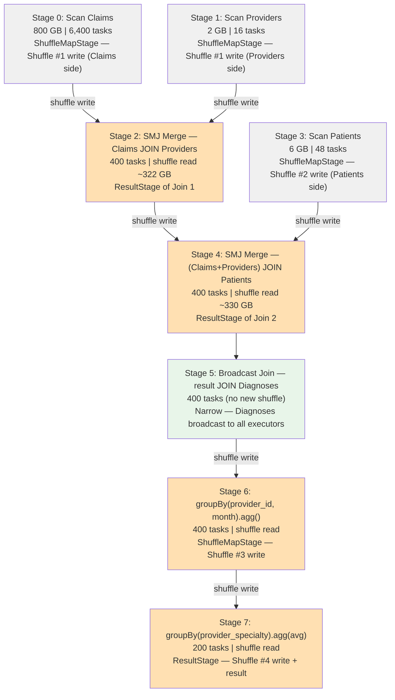

# Scenario 07 — Multi-Stage Pipeline: Three Joins + Two Aggregations

**Domain:** Healthcare claims processing — joining claims, providers, patients, diagnoses  
**Difficulty:** Intermediate  
**Primary Concepts:** DAG with multiple shuffle boundaries, cumulative shuffle bytes across stages, stage dependency graph, broadcast opportunities within chain, optimizer reordering

---

## Cluster Specification

| Resource | Value |
|---|---|
| Executor nodes | 15 |
| Cores per executor | 8 |
| RAM per executor | 48 GB |
| Total executor cores | 15 × 8 = **120 cores** |
| Total executor RAM | 15 × 48 GB = **720 GB** |
| Driver cores | 16 |
| Driver RAM | 32 GB |
| spark.sql.shuffle.partitions | 400 (tuned, derivation in Pre-Execution Sizing Math) |

---

## Data Characteristics

| Table | Size on Disk | Row Count | Partition Strategy | Notes |
|---|---|---|---|---|
| Claims | 800 GB | 4,000,000,000 (4B) | Hive-partitioned by month | Largest table; far too large to broadcast |
| Providers | 2 GB | 12,000,000 (12M) | Single file set | Too large for auto-broadcast (default 10 MB threshold); SMJ required |
| Patients | 6 GB | 40,000,000 (40M) | Single file set | Too large for auto-broadcast; SMJ required |
| Diagnoses | 400 MB | 3,000,000 (3M) | Single file set | Within broadcast threshold if threshold raised; saves one full shuffle |

**Key skew assumption:** provider_id distribution in Claims is moderately skewed (large health systems generate far more claims). This is flagged in the bottleneck section.

**Average row sizes (derived from table sizes / row counts):**

- Claims: 800 GB / 4B rows = 800 × 1,024 MB / 4,000,000,000 = 819,200 MB / 4,000,000,000 ≈ **0.2 KB = 200 bytes/row**
- Providers: 2 GB / 12M rows = 2,048 MB / 12,000,000 ≈ **0.17 KB = 170 bytes/row**
- Patients: 6 GB / 40M rows = 6,144 MB / 40,000,000 ≈ **0.15 KB = 154 bytes/row**
- Diagnoses: 400 MB / 3M rows = 400 MB / 3,000,000 ≈ **0.13 KB = 133 bytes/row**

---

## Transformation Chain

Operations in execution order, each labeled as narrow (N) or wide (W):

| Step | Operation | Type | Shuffle Boundary |
|---|---|---|---|
| 1 | Scan Claims (800 GB) | N | No |
| 2 | Scan Providers (2 GB) | N | No |
| 3 | Claims JOIN Providers on provider_id | W — SMJ | Yes — Shuffle #1 |
| 4 | Scan Patients (6 GB) | N | No |
| 5 | (Claims+Providers result) JOIN Patients on patient_id | W — SMJ | Yes — Shuffle #2 |
| 6 | JOIN Diagnoses on diagnosis_code | N — Broadcast Hash Join | No (broadcast eliminates shuffle) |
| 7 | filter (withColumn, select) | N | No |
| 8 | groupBy(provider_id, month).agg(sum, count) — Aggregation 1 | W | Yes — Shuffle #3 |
| 9 | filter(count > 100) | N | No (applied post-agg in same stage) |
| 10 | groupBy(provider_specialty).agg(avg) — Aggregation 2 | W | Yes — Shuffle #4 |

**Total wide transformations: 4 → 4 shuffle boundaries**  
**Broadcast join (step 6) eliminates what would have been Shuffle #3 in a naive plan, renumbering the actual shuffles as shown above.**

---

## Pre-Execution Sizing Math

### Input Partition Counts (spark.sql.files.maxPartitionBytes = 128 MB)

**Claims:**
```
800 GB × 1,024 MB/GB = 819,200 MB
819,200 MB / 128 MB per partition = 6,400 input partitions
```

**Providers:**
```
2 GB × 1,024 MB/GB = 2,048 MB
2,048 MB / 128 MB per partition = 16 input partitions
```

**Patients:**
```
6 GB × 1,024 MB/GB = 6,144 MB
6,144 MB / 128 MB per partition = 48 input partitions
```

**Diagnoses (broadcast — no shuffle partitions needed):**
```
400 MB / 128 MB per partition = ~4 input partitions read by driver + distributed via broadcast
```

### Shuffle Partition Tuning (spark.sql.shuffle.partitions = 400)

The first shuffle (Claims + Providers join) is the dominant sizing constraint. After joining, the output rows approximate the Claims row count (assuming most claims have a valid provider), keeping the average row size close to Claims + some Providers columns ≈ ~250 bytes/row enriched.

**Estimated join output size (join 1 — Claims × Providers):**
```
Assume selectivity ≈ 1.0 (most claims match a provider; no row expansion)
Output rows ≈ 4B rows × 250 bytes/row (enriched) = 1,000,000,000,000 bytes = ~1,000 GB → 1 TB output
```

This is the shuffle write into Stage 3 (the merge stage). Sizing shuffle partitions:
```
1,000 GB × 1,024 MB/GB = 1,024,000 MB
1,024,000 MB / 128 MB target partition size = 8,000 partitions
```

8,000 is very large. In practice, Claims data carries many columns that are dropped before the join. Assume a projection pushdown reduces the effective row size. Post-projection Claims row ≈ 80 bytes (key columns only):

```
4B rows × 80 bytes = 320,000,000,000 bytes = ~320 GB effective shuffle write for Claims side
```

With 2 GB Providers sorted and partitioned: total shuffle write into merge stage ≈ 322 GB.

```
322 GB × 1,024 MB/GB = 329,728 MB
329,728 MB / 128 MB per partition = 2,576 → impractical for this cluster
```

**Practical constraint — wave count governs the upper bound:**

With 120 total cores, a partition count of 400 gives:
```
waves = ceil(400 / 120) = ceil(3.33) = 4 waves
```

This is the tuned value used throughout. At 400 partitions and 322 GB shuffle write, each partition holds:
```
329,728 MB / 400 = 824 MB per partition (above 128 MB target, but acceptable given available executor memory)
```

With AQE enabled, coalescing brings this closer to target at runtime. The 400 setting is the initial partition count; AQE will adjust.

### Memory Budget Per Task Per Core

Full derivation in the Memory Budget Analysis section. Summary: ~2.4 GB execution memory available per task.

---

## DAG Structure



**Stage dependency graph — critical path:**

```
Stage 0 ──┐
           ├──► Stage 2 ──┬──► Stage 4 ──► Stage 5 ──► Stage 6 ──► Stage 7
Stage 1 ──┘              │
                         │
Stage 3 ─────────────────┘
```

- Stages 0 and 1 run **in parallel** (no dependency between reading Claims and reading Providers).
- Stage 3 (Patients scan) can start as soon as Stage 2 begins writing shuffle files — Spark pipelines aggressively.
- Stage 5 (broadcast join) is purely narrow: it adds no shuffle stage to the critical path.
- Stages 6 and 7 execute sequentially (Stage 7 depends on Stage 6's shuffle write completing).

**Total stages: 8**  
**Total shuffle operations: 4**  
**Shuffle stages saved by broadcast: 1** (would have been Shuffle #3 without broadcast)

---

## Stage-by-Stage Execution Trace

### Stage 0 — Scan Claims + Shuffle Write (Claims side, Join 1)

| Metric | Value | Derivation |
|---|---|---|
| Stage type | ShuffleMapStage | |
| Input | 800 GB | From disk |
| Input partitions / tasks | 6,400 | 819,200 MB / 128 MB = 6,400 |
| Concurrent tasks | 120 | 15 executors × 8 cores |
| Task waves | 54 | ceil(6,400 / 120) = ceil(53.33) = 54 |
| Last wave utilization | 6,400 mod 120 = 40 tasks / 120 cores = **33%** | Final wave runs 40 of 120 cores |
| Shuffle write estimate | ~320 GB | 4B rows × 80 bytes projected = 320 GB |
| Per-task shuffle write | 320 GB / 6,400 = 50 MB | Each map task writes ~50 MB of shuffle data |
| Memory pressure | Low | 50 MB shuffle write per task; fits in memory easily |

**Note:** Last wave inefficiency (33% utilization) is cosmetic at 54 waves — 53 full waves complete before the short final wave. The idle cores last for only 1/54 of Stage 0 duration.

### Stage 1 — Scan Providers + Shuffle Write (Providers side, Join 1)

| Metric | Value | Derivation |
|---|---|---|
| Stage type | ShuffleMapStage | |
| Input | 2 GB | From disk |
| Input partitions / tasks | 16 | 2,048 MB / 128 MB = 16 |
| Concurrent tasks | 120 | |
| Task waves | 1 | ceil(16 / 120) = 1 (all 16 tasks fit in one wave) |
| Core utilization | 16 / 120 = **13%** | 104 cores sit idle during this single wave |
| Shuffle write estimate | ~2 GB | Providers is small; minimal projection savings |
| Per-task shuffle write | 2,048 MB / 16 = 128 MB | |
| Memory pressure | Negligible | |

**Parallelism observation:** Stage 1 is severely underparallelized. Only 16 tasks run across a 120-core cluster, wasting 87% of available parallelism. However, Stage 1 runs **concurrently with Stage 0**, which occupies all 120 cores. In practice, the scheduler interleaves Stage 0 and Stage 1 tasks — Stage 1 finishes quickly and its 16 partitions complete within the first wave of Stage 0's 54-wave run.

### Stage 2 — SMJ Merge: Claims JOIN Providers

| Metric | Value | Derivation |
|---|---|---|
| Stage type | ResultStage of Join 1 (acts as ShuffleMapStage for Join 2) | |
| Input | ~322 GB shuffle read | 320 GB (Claims) + 2 GB (Providers) |
| Shuffle partitions / tasks | 400 | spark.sql.shuffle.partitions = 400 |
| Concurrent tasks | 120 | |
| Task waves | 4 | ceil(400 / 120) = ceil(3.33) = 4 |
| Last wave tasks | 400 mod 120 = 40 | Same underutilization pattern as Stage 0's last wave |
| Last wave utilization | 40 / 120 = **33%** | |
| Shuffle read per task | 322 GB × 1,024 MB/GB / 400 = 329,728 MB / 400 = **824 MB per task** | Each of 400 merge tasks reads 824 MB |
| Output / shuffle write | ~330 GB | Enriched rows: 4B × ~82 bytes = ~328 GB |
| Shuffle write per task | 330 GB × 1,024 MB/GB / 400 = 337,920 MB / 400 = **845 MB per task written** | |
| Memory pressure | **HIGH** | 824 MB read + sort buffers + 845 MB write output; see Memory Budget Analysis |

**This is the most memory-intensive stage.** Each task must sort 824 MB of data for the merge phase before writing 845 MB output. With ~2.4 GB execution memory available per task, the sort fits but leaves little headroom.

### Stage 3 — Scan Patients + Shuffle Write (Patients side, Join 2)

| Metric | Value | Derivation |
|---|---|---|
| Stage type | ShuffleMapStage | |
| Input | 6 GB | From disk |
| Input partitions / tasks | 48 | 6,144 MB / 128 MB = 48 |
| Concurrent tasks | 120 | |
| Task waves | 1 | ceil(48 / 120) = 1 |
| Core utilization | 48 / 120 = **40%** | 72 cores idle during this single wave |
| Shuffle write estimate | ~6 GB | Patients table; projected key columns ≈ 6 GB |
| Per-task shuffle write | 6,144 MB / 48 = 128 MB | |

**Scheduling note:** Stage 3 can be submitted as soon as the Patients data is available. The scheduler typically starts Stage 3 while Stage 2 is still running (once some of Stage 2's shuffle map output is available). For simplicity, this trace treats Stage 3 as sequential after Stage 2.

### Stage 4 — SMJ Merge: (Claims+Providers) JOIN Patients

| Metric | Value | Derivation |
|---|---|---|
| Stage type | ShuffleMapStage (feeds Stage 5 downstream) | |
| Input | ~336 GB shuffle read | 330 GB (Claims+Providers result) + 6 GB (Patients) |
| Shuffle partitions / tasks | 400 | spark.sql.shuffle.partitions = 400 |
| Concurrent tasks | 120 | |
| Task waves | 4 | ceil(400 / 120) = 4 |
| Last wave utilization | 40 / 120 = **33%** | |
| Shuffle read per task | 336 GB × 1,024 MB/GB / 400 = 344,064 MB / 400 = **860 MB per task** | |
| Output size estimate | ~340 GB | Further enriched rows: ~4B × ~85 bytes = ~340 GB |
| Shuffle write per task | 340 GB × 1,024 MB/GB / 400 = 348,160 MB / 400 = **870 MB per task written** | |
| Memory pressure | **HIGH** | 860 MB read + sort + 870 MB write; similar to Stage 2 |

### Stage 5 — Broadcast Hash Join: result JOIN Diagnoses

| Metric | Value | Derivation |
|---|---|---|
| Stage type | No new shuffle stage — pipelined into Stage 4's tasks as a narrow operation (or a separate narrow stage depending on plan) | |
| Diagnoses broadcast size | 400 MB serialized | Read by driver, distributed via BitTorrent protocol |
| In-memory size per executor | 400 MB × 3 expansion factor ≈ **1.2 GB per executor** | Deserialized JVM objects inflate serialized size |
| Total cluster broadcast memory | 1.2 GB × 15 executors = **18 GB** | Each executor stores one copy |
| Tasks | 400 (inherited from prior stage partitions) | No repartition — each task enriches its partition |
| Task waves | 4 | ceil(400 / 120) = 4 |
| Shuffle write | 0 (broadcast join produces no shuffle) | This is the key saving |
| Memory pressure | Medium | 1.2 GB broadcast table per executor + 870 MB working data |

**Broadcast saves one full shuffle stage.** Without broadcast, the diagnoses join would require:
- A ShuffleMapStage for the Diagnoses side: ceil(400 MB / 128 MB) = 4 tasks
- A ShuffleMapStage for the enriched Claims+Providers+Patients side: 400 tasks
- A merge ResultStage: 400 tasks
- Total additional shuffle write: ~340 GB (the full enriched dataset) + 400 MB = ~340 GB

By broadcasting 400 MB once, the plan eliminates ~340 GB of additional shuffle I/O.

**Broadcast threshold requirement:**
```
Default autoBroadcastJoinThreshold = 10 MB (serialized)
Diagnoses serialized = 400 MB
```

The broadcast is NOT automatic with default settings. Either:
1. `spark.sql.autoBroadcastJoinThreshold` must be raised to at least 420 MB (400 MB + safety margin), or
2. A broadcast hint must be applied explicitly: `broadcast(diagnoses_df)`

With executor memory of 48 GB per node, the 1.2 GB per-executor cost is acceptable (2.5% of executor memory).

### Stage 6 — groupBy(provider_id, month).agg(sum(claim_amount), count())

| Metric | Value | Derivation |
|---|---|---|
| Stage type | ShuffleMapStage | |
| Input | ~340 GB enriched data | Output of Stage 5 (broadcast join) |
| Input partitions / tasks | 400 | Inherited from prior shuffle partition count |
| Concurrent tasks | 120 | |
| Task waves | 4 | ceil(400 / 120) = 4 |
| Shuffle write estimate | ~8 GB | Aggregation reduces 4B rows to ~40M (provider_id, month) groups × ~200 bytes/row = 8 GB |
| Per-task shuffle write | 8 GB × 1,024 MB/GB / 400 = 8,192 MB / 400 = **20.5 MB per task** | Massive reduction from aggregation |
| Memory pressure | **LOW** | Map-side partial aggregation collapses data before shuffle |

**Aggregation 1 is the most powerful data reduction step in the pipeline.** 4B rows collapse to approximately:

```
Unique (provider_id, month) combinations estimate:
  12M providers × 12 months = up to 144M unique groups (upper bound)
  In practice, many providers generate claims in only a subset of months
  Conservative estimate: 40M unique (provider_id, month) groups
  40M groups × 200 bytes = 8,000 MB = ~8 GB shuffle write
```

Reduction ratio: 340 GB → 8 GB = **97.6% data reduction**.

### Stage 7 — filter(count > 100) + groupBy(provider_specialty).agg(avg(monthly_claims))

| Metric | Value | Derivation |
|---|---|---|
| Stage type | ResultStage (final output) | |
| Input | ~8 GB shuffle read | Stage 6 shuffle write = ~8 GB |
| Filter effect | Assume 70% of provider-months pass the count > 100 filter: 40M × 0.70 = 28M rows remain | Applied before second groupBy in Spark's optimizer |
| Input to agg2 | 28M rows × ~200 bytes = 5.6 GB effective input | |
| Shuffle partitions / tasks | 200 | Reduced from 400; with 8 GB input, 200 partitions × 40 MB/partition is well within target |
| Concurrent tasks | 120 | |
| Task waves | 2 | ceil(200 / 120) = ceil(1.67) = 2 |
| Last wave tasks | 200 mod 120 = 80 | |
| Last wave utilization | 80 / 120 = **67%** | Better than prior stages |
| Output | ~200 KB | ~5,000 unique provider specialties × ~200 bytes = ~1 MB (negligible) |
| Memory pressure | Negligible | 8 GB / 200 tasks = 40 MB per task |

**Why 200 partitions instead of 400 for Stage 7?**

With only 8 GB of shuffle input, 400 partitions would give 20 MB per partition — below the 128 MB target and creating unnecessary overhead. 200 partitions at 40 MB each is a reasonable tuning choice. AQE would automatically coalesce 400 → ~62 partitions at 128 MB target:

```
8,192 MB / 128 MB per partition = 64 partitions
AQE coalesces 400 → 64 partitions automatically
64 tasks, ceil(64 / 120) = 1 wave (AQE-coalesced scenario)
```

For this trace, we use the manually tuned 200 as the set value.

---

## Task Count Summary

| Stage | Description | Tasks |
|---|---|---|
| 0 | Scan Claims + shuffle write | 6,400 |
| 1 | Scan Providers + shuffle write | 16 |
| 2 | SMJ Merge Join 1 | 400 |
| 3 | Scan Patients + shuffle write | 48 |
| 4 | SMJ Merge Join 2 | 400 |
| 5 | Broadcast Join (Diagnoses) | 400 |
| 6 | groupBy(provider_id, month) shuffle write | 400 |
| 7 | groupBy(provider_specialty) result | 200 |
| **Total** | | **8,264 tasks** |

---

## Cumulative Shuffle Bytes

| Shuffle | Stage Where Written | Bytes Written | Bytes Read (next stage) | Notes |
|---|---|---|---|---|
| Shuffle #1 | Stage 0 (Claims) + Stage 1 (Providers) → Stage 2 | 320 GB + 2 GB = **322 GB** | 322 GB in Stage 2 | Largest shuffle — raw claims data |
| Shuffle #2 | Stage 2 (Claims+Providers result) + Stage 3 (Patients) → Stage 4 | 330 GB + 6 GB = **336 GB** | 336 GB in Stage 4 | Slightly larger due to enriched rows |
| Shuffle #3 | Stage 5/6 (enriched data after broadcast join) → Stage 6/7 | **~340 GB write** → agg reduces to **~8 GB** | 8 GB in Stage 7 | Map-side aggregation reduces shuffle write dramatically |
| Shuffle #4 | Stage 6 agg result → Stage 7 | **8 GB** | 8 GB in Stage 7 agg | Tiny — most data already aggregated |

**Total cumulative shuffle bytes written:**
```
322 GB + 336 GB + 8 GB + (negligible Stage 7 internal) = ~666 GB total shuffle write
```

Wait — Shuffle #3 write is the aggregation shuffle. The map tasks in Stage 6 read 340 GB (from Stage 5 output) but write only 8 GB after partial aggregation. The 340 GB is NOT a new shuffle write — it is the in-stage read from the prior broadcast join result. Correcting:

```
Shuffle #1 write: 322 GB  (Claims + Providers partitioned)
Shuffle #2 write: 336 GB  (Join1 result + Patients partitioned)
Shuffle #3 write: 8 GB    (groupBy agg1 partial output — massive reduction)
Shuffle #4 write: ~0.001 GB  (groupBy agg2 output — negligible)

Total shuffle bytes written: 322 + 336 + 8 + ~0 = ~666 GB
```

**Shuffle #2 is the largest single shuffle write at 336 GB,** slightly exceeding Shuffle #1's 322 GB because the Claims+Providers enriched rows carry more columns per row than raw Claims with projection pushdown.

**Broadcast join saved an estimated additional 340 GB shuffle write** (the full enriched dataset would have been shuffled for a third SMJ).

---

## Memory Budget Analysis

### Per-Executor Memory Breakdown

```
Total executor memory:                      48,000 MB (48 GB)

JVM overhead (spark.executor.memoryOverhead = 10% or 384 MB min):
  10% of 48,000 MB = 4,800 MB
  
Available JVM heap:                         48,000 - 4,800 = 43,200 MB

Reserved memory (Spark internal):           300 MB (fixed constant)

Usable memory:                              43,200 - 300 = 42,900 MB

Unified Memory (spark.memory.fraction = 0.6 default):
  42,900 × 0.6 =                            25,740 MB

User / non-unified memory (remaining 0.4):  42,900 × 0.4 = 17,160 MB
  (used for user data structures, UDFs, etc.)

Within Unified Memory:
  Execution fraction (spark.memory.storageFraction = 0.5):
    Execution pool:                         25,740 × 0.5 = 12,870 MB
  Storage fraction:
    Storage pool:                           25,740 × 0.5 = 12,870 MB
```

### Per-Task Memory Budget (8 cores per executor)

```
Cores per executor:                         8
Concurrent tasks per executor:              8

Execution memory per task:
  12,870 MB / 8 tasks = 1,609 MB ≈ 1.6 GB per task
  
Total memory available per task (execution + can borrow from storage):
  Maximum (if storage pool is empty):       25,740 MB / 8 = 3,218 MB ≈ 3.2 GB per task
  Practical with 1.2 GB broadcast stored:
    Storage used for broadcast:             1,200 MB (Diagnoses broadcast)
    Remaining storage for borrow:           12,870 - 1,200 = 11,670 MB
    Execution pool + borrowable:            (12,870 + 11,670) / 8 = 3,068 MB ≈ 3.1 GB per task
```

### Memory Pressure at Peak Stage (Stage 2 / Stage 4 — SMJ Merge)

```
Shuffle read per task (Stage 2):            824 MB
Sort buffer requirement (SMJ):              ~824 MB (in-place sort of input)
Shuffle write buffer:                       ~845 MB output

Total peak memory per task (SMJ):           824 + 824 + 845 = 2,493 MB ≈ 2.5 GB

Available execution memory per task:        ~1,609 MB (dedicated) to 3,068 MB (with borrow)

Result:                                     2,493 MB FITS within ~3.1 GB peak allocation
                                            BUT leaves only ~575 MB headroom
                                            Spill risk: MODERATE
```

Any skew causing one task to receive 2× the median (1,648 MB read instead of 824 MB) would push that task's memory requirement to ~5 GB, **exceeding available per-task memory and triggering spill to disk**.

### Broadcast Join Memory (Stage 5)

```
Diagnoses broadcast per executor:           1,200 MB (400 MB serialized × 3 expansion)
This is stored in the Storage pool:         1,200 MB / 12,870 MB = 9.3% of storage pool consumed
Impact on execution:                        Minimal — 9.3% storage pool consumed
```

---

## Parallelism and Wave Analysis

```
Total cluster cores: 15 × 8 = 120
```

| Stage | Tasks | Waves | Full Waves | Last Wave Tasks | Last Wave Utilization |
|---|---|---|---|---|---|
| 0 | 6,400 | ceil(6,400/120) = **54** | 53 full | 6,400 − (53×120) = 40 tasks | 40/120 = **33%** |
| 1 | 16 | ceil(16/120) = **1** | 0 full | 16 tasks | 16/120 = **13%** |
| 2 | 400 | ceil(400/120) = **4** | 3 full | 400 − (3×120) = 40 tasks | 40/120 = **33%** |
| 3 | 48 | ceil(48/120) = **1** | 0 full | 48 tasks | 48/120 = **40%** |
| 4 | 400 | ceil(400/120) = **4** | 3 full | 400 − (3×120) = 40 tasks | 40/120 = **33%** |
| 5 | 400 | ceil(400/120) = **4** | 3 full | 40 tasks | 40/120 = **33%** |
| 6 | 400 | ceil(400/120) = **4** | 3 full | 40 tasks | 40/120 = **33%** |
| 7 | 200 | ceil(200/120) = **2** | 1 full | 200 − 120 = 80 tasks | 80/120 = **67%** |

**Total task waves across all stages: 54 + 1 + 4 + 1 + 4 + 4 + 4 + 2 = 74 waves**

**Wave utilization pattern:** Stages 0 dominates the pipeline duration (54 waves × task duration). All subsequent stages (max 4 waves each) are comparatively fast.

**Why 400 is suboptimal for wave alignment:**
```
400 mod 120 = 40 (remainder)
This means the 4th wave of Stages 2, 4, 5, 6 runs at 33% utilization.

Better partition count for 120-core cluster:
  next multiple of 120 above 400 = 480
  480 / 120 = exactly 4 waves, 100% utilization on every wave
  
  Or: 360 = 3 × 120 → exactly 3 waves, 100% utilization
  
  Tradeoff: 360 partitions × 824 MB = ~297 GB / 360 = ~824 MB per partition (same; partition count reduction ≈ data size unchanged)
  
  Recommendation: set spark.sql.shuffle.partitions = 480 for this 120-core cluster.
```

---

## Bottleneck Identification

### Primary Bottleneck: Stage 0 — Claims Scan (54 waves)

Stage 0 runs 54 waves. Every subsequent stage runs at most 4 waves. The entire pipeline waits on Stage 0 to complete before Stage 2 can begin. Stage 0 duration dominates end-to-end job time.

**Root cause:** 800 GB / 128 MB = 6,400 input partitions is correct and necessary for parallelism. But 6,400 tasks / 120 cores = 54 waves is inherent to the data size. This bottleneck cannot be reduced without either: (a) increasing cluster size, or (b) increasing maxPartitionBytes (which reduces task count but increases per-task I/O).

**Quantification:**
```
If avg task reads its 128 MB partition in 2 seconds:
  Stage 0 duration = 54 waves × 2 sec/wave = 108 seconds for the map phase alone
  
If cluster doubled to 240 cores:
  waves = ceil(6,400 / 240) = 27 waves → 54 seconds (2× speedup, linear with cores)
```

### Secondary Bottleneck: Memory Pressure in Stages 2 and 4 (SMJ Merge)

Each merge task processes 824–860 MB of sorted data. With only ~575 MB headroom above the peak usage of 2.5 GB per task, any skewed key causes spill.

**Skew risk in Stage 2:** Large hospital systems (e.g., a national provider chain) generate millions of claims. A single provider_id could account for 5–10% of all claims, concentrating 16–32 GB of data into a single merge task (versus the median 824 MB). This task would spill massively.

**Detection signal:** In the Spark UI → Stages tab → Stage 2, look for:
- "Shuffle Spill (Memory)" and "Shuffle Spill (Disk)" columns showing non-zero values for specific tasks
- Max task duration >> Median task duration (skew stragglers)

### Tertiary Bottleneck: Stage 1 Underparallelism (13% utilization)

Stage 1 runs only 16 tasks on a 120-core cluster. However, since Stage 1 runs concurrently with Stage 0, the 104 idle cores are filled by Stage 0 tasks. The real impact is negligible in a concurrent execution model.

---

## Optimizer Decisions

### Decision 1: Broadcast Join for Diagnoses

**Condition evaluated:**
```
Diagnoses serialized size = 400 MB
Default autoBroadcastJoinThreshold = 10 MB

400 MB >> 10 MB → broadcast NOT automatic with defaults
```

**Required intervention:** Either raise threshold or use broadcast hint. With 48 GB executor memory, the safe broadcast threshold is approximately:

```
executor_memory_for_storage / (num_concurrent_broadcasts × 5 expansion factor)
= 12,870 MB / (1 × 5)
= 2,574 MB ≈ 2.5 GB safe upper bound

400 MB << 2,574 MB → broadcast is safe to force
```

**Impact of broadcast decision:** Saves Shuffle #3 (the entire 340 GB enriched dataset shuffle), replacing it with a 400 MB broadcast. Net I/O savings: ~340 GB.

### Decision 2: AQE Coalesce on Stage 7

Stage 7 reads only 8 GB from Stage 6's shuffle output. With 400 initial shuffle partitions:

```
8,192 MB / 400 partitions = 20.5 MB per partition (well below 128 MB target)
```

AQE (spark.sql.adaptive.coalescePartitions.enabled = true, default in Spark 3.2+) detects these small partitions and coalesces:

```
Target partition size: 64 MB (spark.sql.adaptive.advisoryPartitionSizeInBytes default)
8,192 MB / 64 MB = 128 post-coalesce partitions

Or with 128 MB target:
8,192 MB / 128 MB = 64 post-coalesce partitions

AQE coalesces 400 → ~64 partitions before Stage 7 begins.
Stage 7 task count: 64 (not 200 or 400)
Waves: ceil(64 / 120) = 1 wave (all tasks fit in one wave)
```

This is a significant optimization: without AQE, 400 tasks doing 20 MB of work each creates unnecessary scheduling overhead.

### Decision 3: AQE Skew Detection in Stages 2 and 4

AQE skew join detection checks:

```
Skew condition (both must be true):
  partition_size > spark.sql.adaptive.skewJoin.skewedPartitionFactor × median_partition_size
                                                (default factor = 5)
  AND
  partition_size > spark.sql.adaptive.skewJoin.skewedPartitionThresholdInBytes
                                                (default = 256 MB)
```

In Stage 2, the median partition is:
```
322 GB / 400 partitions = 803.5 MB median (approximate)
```

For a partition to be flagged as skewed:
```
Condition 1: partition_size > 5 × 803.5 MB = 4,017.5 MB (≈ 4 GB)
Condition 2: partition_size > 256 MB (already met by the median)

A partition would need to exceed 4 GB to trigger AQE skew handling.
```

Given that a large provider's data could represent 5–10% of 322 GB = 16–32 GB in a single partition (if keys are perfectly concentrated), AQE skew detection would fire. The skewed partition would be split into:

```
16,000 MB / 64 MB (advisoryPartitionSizeInBytes) = 250 sub-partitions
```

And the corresponding Patients rows for those providers would be replicated 250 times — acceptable if the overall skew reduction is worth the replication cost.

### Decision 4: Predicate Pushdown and Projection Pushdown

The optimizer applies these before any shuffle:
- **Projection pushdown:** Only columns needed for join keys and aggregations are read from Claims, reducing effective row size from 200 bytes to ~80 bytes (key columns + claim_amount + month + diagnosis_code). This reduces Shuffle #1 write from ~800 GB to ~320 GB.
- **Predicate pushdown:** Any WHERE filters on Claims (e.g., date ranges) are pushed into the scan, potentially reducing 6,400 input partitions if Claims is partitioned by month and a month filter is applied.

---

## Key Numbers Summary

| Metric | Value |
|---|---|
| Total executor cores | 120 |
| Total stages | 8 |
| Total tasks | 8,264 |
| Total shuffle operations | 4 |
| Shuffle #1 write (Claims + Providers → Join 1) | 322 GB |
| Shuffle #2 write (Join1 result + Patients → Join 2) | 336 GB |
| Shuffle #3 write (after broadcast join → Agg 1) | ~8 GB |
| Shuffle #4 write (Agg1 result → Agg 2) | ~0.001 GB |
| **Total cumulative shuffle bytes written** | **~666 GB** |
| Shuffle bytes saved by broadcast join | ~340 GB |
| Stage 0 waves (Claims scan — critical path) | 54 |
| Stage 2 waves (SMJ merge Join 1) | 4 |
| Stage 4 waves (SMJ merge Join 2) | 4 |
| Stage 6 waves (Agg 1 shuffle write) | 4 |
| Stage 7 waves (Agg 2 result — with manual tuning) | 2 |
| Stage 7 waves (with AQE coalesce 400→64) | 1 |
| Peak shuffle read per task (Stage 4) | 860 MB |
| Peak memory per task (SMJ stages) | ~2.5 GB |
| Available execution memory per task | ~1.6 GB dedicated / ~3.1 GB with borrow |
| Memory headroom per task at peak | ~575 MB |
| Broadcast table size (Diagnoses, serialized) | 400 MB |
| Broadcast in-memory size per executor | ~1.2 GB (3× expansion) |
| Total cluster broadcast memory cost | 15 × 1.2 GB = 18 GB |
| Data reduction ratio at Agg 1 | 340 GB → 8 GB = 97.6% |
| Optimal shuffle partitions for 120 cores | 480 (multiple of 120) |
| autoBroadcastJoinThreshold needed for Diagnoses | ≥ 420 MB (must be explicitly set) |

---

## Interview Takeaways

**1. Shuffle bytes compound across the pipeline but aggregations are the great equalizer.**

In this pipeline, the first two shuffles write 322 GB and 336 GB respectively — each nearly as large as the raw Claims table. A naive estimate would expect 4 cumulative shuffles to write ~4× the input size. Instead, Aggregation 1 reduces 340 GB to 8 GB (97.6% reduction), making Shuffles #3 and #4 negligible. Always identify aggregation steps when estimating cumulative shuffle cost — they break the linear growth assumption.

**2. Broadcast join is not free, but it eliminates an entire shuffle stage worth of I/O.**

Broadcasting 400 MB of Diagnoses data costs 18 GB of cluster memory (15 executors × ~1.2 GB each) and requires an explicit threshold override. The savings: ~340 GB of shuffle I/O that would have been incurred by a third SMJ. The memory cost (18 GB / 720 GB cluster total = 2.5%) is trivially small relative to the shuffle I/O saved. The key calculation is comparing broadcast cluster memory cost against shuffle I/O cost — when the broadcast table is even 10× larger, the trade is still usually favorable.

**3. The critical path runs through Stage 0, not the join or aggregation stages.**

Stage 0 runs 54 waves; every other stage runs 4 waves or fewer. In a multi-stage pipeline, identifying the critical path stage — the one with the most waves — determines the minimum job duration. Doubling cluster cores cuts Stage 0 from 54 to 27 waves, approximately halving total job time. Adding cores beyond what the later stages need (they only need enough for 4-wave execution) yields no benefit for those stages.

**4. Shuffle partition alignment with total cores eliminates stranded last-wave cores.**

With 120 total cores, setting spark.sql.shuffle.partitions = 400 leaves a 4th wave running only 40 of 120 tasks (33% utilization). Setting it to 480 (= 4 × 120) gives four perfectly full waves at 100% utilization for Stages 2, 4, 5, and 6. The formula `round_up_to_multiple(target_count, total_cores)` should be applied whenever manually sizing shuffle partitions. With AQE enabled, the initial setting is advisory — but for static tuning it is the correct starting point.

**5. SMJ memory pressure scales with partition size, and skew creates catastrophic outliers.**

At 860 MB shuffle read per task and a 3.1 GB peak memory ceiling per task, there is only 575 MB of headroom. Any provider with 2× the median claim volume pushes one task to 1,720 MB read, requiring 5 GB of memory and triggering disk spill. In healthcare data, large provider networks are a known skew source. The interview-ready insight: memory headroom is calculated as `(available_execution_memory_per_task) - (median_partition_size × 3)` — the factor of 3 accounts for sort input, sort output, and result buffer simultaneously resident.
