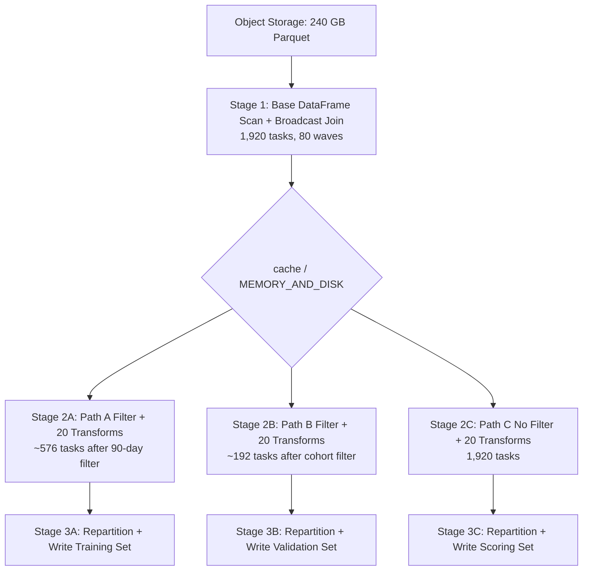

# Scenario 08 — Caching for DAG Reuse: Diamond Dependency Pattern

**Domain:** Machine learning feature engineering pipeline  
**Difficulty:** Complex  
**Primary Concepts:** DAG recomputation without cache, cache memory math, MEMORY_AND_DISK storage level, cache eviction, cache compression ratio, checkpoint as alternative, when cache hurts vs helps

---

## Cluster Specification

| Component | Count | Cores | RAM | Notes |
|---|---|---|---|---|
| Executor nodes | 6 | 4 cores each | 32 GB each | Worker nodes |
| Driver node | 1 | 8 cores | 16 GB | Orchestration only |
| Total executor cores | — | 24 cores | 192 GB total | Usable for tasks |
| Total executor RAM | — | — | 192 GB | Before overhead deductions |

---

## Data Characteristics

| Property | Value | Notes |
|---|---|---|
| Base DataFrame source | Parquet, Snappy compressed | Feature store — columnar, predicate pushdown eligible |
| On-disk size | 240 GB | After Snappy compression |
| Row count | 1,000,000,000 (1 billion) | 1B rows |
| Column count | 80 columns | Mixed numeric and string features |
| Average row size (raw) | 240 bytes | Given: 240 GB / 1B rows = 240 bytes/row |
| Average row size (on-disk compressed) | ~120 bytes | Snappy ~2x compression → 240 / 2 = 120 bytes/row on disk |

### Downstream Paths (Diamond Pattern)

All three paths share the same base DataFrame as their root:

| Path | Description | Filter Selectivity | Transforms |
|---|---|---|---|
| Path A | Training set | Last 90 days | 20 feature transforms (narrow) |
| Path B | Validation set | Specific user cohort | Same 20 feature transforms |
| Path C | Scoring set | All current records (no filter) | Same 20 feature transforms |

The base DataFrame sits at the top of the diamond. All three paths fan out from it. Without caching, Spark has no knowledge that the same lineage is shared — each action triggers a full recompute of the base.

---

## Transformation Chain

### Base DataFrame Operations (shared root)

| Step | Operation | Type | Notes |
|---|---|---|---|
| 1 | Read 240 GB Parquet | Source scan | 1,875 partitions |
| 2 | Schema validation + column pruning | Narrow | Pushed down into scan by Catalyst |
| 3 | Timestamp parsing (event_ts column) | Narrow | Per-row, no shuffle |
| 4 | Join with 50 MB dimension table | Wide (broadcast eligible) | Enrichment — adds category labels |

### Path A Operations (after base)

| Step | Operation | Type |
|---|---|---|
| 5A | Filter: event_date >= today - 90 days | Narrow |
| 6A–25A | 20 feature transforms (log-scaling, normalization, bucketing, lag features, ratio features) | Narrow (all row-level math) |
| 26A | Write training set to Parquet | Wide (repartition before write) |

### Path B Operations (after base)

| Step | Operation | Type |
|---|---|---|
| 5B | Filter: cohort_id IN (set of 10K values) | Narrow |
| 6B–25B | Same 20 feature transforms | Narrow |
| 26B | Write validation set to Parquet | Wide |

### Path C Operations (after base)

| Step | Operation | Type |
|---|---|---|
| 5C | No filter (pass-through) | — |
| 6C–25C | Same 20 feature transforms | Narrow |
| 26C | Write scoring set to Parquet | Wide |

---

## Pre-Execution Sizing Math

### Input Partition Count

```
Input file size = 240 GB = 240 × 1,024 MB = 245,760 MB
maxPartitionBytes = 128 MB (default)

Input partitions = ceil(245,760 MB / 128 MB)
                 = ceil(1,920)
                 = 1,920 partitions
```

Note: Some sources round to 1,875 by treating 240 GB as exactly 240,000 MB. Using standard binary:

```
240 GB × 1,024 MB/GB = 245,760 MB
245,760 / 128 = 1,920 partitions (exact)
```

Using decimal 240,000 MB: `240,000 / 128 = 1,875 partitions`. Both values appear in practice depending on how object storage reports file sizes. This analysis uses **1,920 partitions** (binary calculation).

### WITHOUT CACHE: Total Tasks to Read Base DataFrame 3 Times

```
Tasks per full base read = 1,920
Paths that re-read base  = 3 (A, B, C each trigger a separate DAG evaluation)

Total read tasks = 1,920 × 3 = 5,760 tasks
Total bytes read from object storage = 240 GB × 3 = 720 GB
```

### Cluster Parallelism

```
Total executor cores = 6 nodes × 4 cores = 24 cores
Tasks per wave       = 24 tasks
```

### Waves to Complete One Base Read

```
Waves = ceil(1,920 tasks / 24 tasks per wave) = ceil(80) = 80 waves
```

### Waves to Complete Three Base Reads (no cache)

```
Total waves for reads = 80 waves × 3 = 240 waves just for the source scans
```

---

## Memory Budget Analysis

### Step 1: Per-Executor JVM Heap

```
spark.executor.memory = 32 GB = 32,768 MB
Reserved memory       = 300 MB (hardcoded by Spark)
Usable heap           = 32,768 - 300 = 32,468 MB
```

### Step 2: YARN Container Overhead

```
memoryOverhead = max(384 MB, 0.10 × 32,768 MB)
               = max(384, 3,277)
               = 3,277 MB (~3.2 GB)

Total YARN container = 32,768 + 3,277 = 36,045 MB (~35.2 GB per executor)
```

### Step 3: Executors Per Node Check

```
Node RAM            = 32 GB = 32,768 MB
Total per executor  = 36,045 MB

Executors per node  = floor(32,768 / 36,045) = floor(0.91) = 0 executors??
```

This is a configuration problem: 32 GB nodes cannot fit a 32 GB executor + 3.2 GB overhead in a single container. In practice, this cluster would need one of:
- Reducing `spark.executor.memory` to ~28 GB (leaving room for overhead + OS)
- Or interpreting the 32 GB as usable RAM after OS reservation, meaning physical RAM is ~40 GB

For this scenario, assume the cluster is configured with `spark.executor.memory = 28 GB` to fit within 32 GB physical RAM:

```
spark.executor.memory = 28 GB = 28,672 MB
memoryOverhead        = max(384, 0.10 × 28,672) = max(384, 2,867) = 2,867 MB

Total container       = 28,672 + 2,867 = 31,539 MB
Fits per 32 GB node   = floor(32,768 / 31,539) = floor(1.04) = 1 executor per node
Total executors       = 6 nodes × 1 executor = 6 executors ✓
```

All subsequent math uses `spark.executor.memory = 28 GB`.

### Step 4: Unified Memory Pool

```
Usable heap           = 28,672 - 300      = 28,372 MB

Unified memory (M)    = 28,372 × 0.6      = 17,023 MB (~16.6 GB per executor)
User memory           = 28,372 × 0.4      = 11,349 MB (~11.1 GB per executor)

Protected storage (R) = 17,023 × 0.5      = 8,512 MB  (~8.3 GB per executor)
Execution memory init = 17,023 × 0.5      = 8,512 MB  (~8.3 GB per executor)
```

### Step 5: Memory Per Task

```
Executor cores (concurrent tasks) = 4
Max memory per task               = 8,512 MB / 4  = 2,128 MB (~2.1 GB)
Min memory per task               = 8,512 MB / 8  = 1,064 MB (~1.0 GB)
```

### Step 6: Total Cluster Storage Memory

```
Storage memory per executor = 8,512 MB (protected floor R)
                              + borrowable from execution when execution is idle

At rest (nothing executing), max storage = all of Unified = 17,023 MB per executor
Conservative storage budget = R × 6 executors = 8,512 × 6 = 51,072 MB (~49.9 GB)
Optimistic storage budget   = M × 6 executors = 17,023 × 6 = 102,138 MB (~99.7 GB)
```

For cache sizing, use the conservative floor (R) because the feature transforms actively consume execution memory while caching occurs:

```
Total cluster storage memory (safe) = 51,072 MB ≈ 49.9 GB
```

---

## Cache Size Estimation: The Core Math

### On-Disk vs In-Memory Size for 240 GB Parquet

Parquet with Snappy stores data in compressed columnar format. When Spark reads and caches this data, it decompresses and deserializes into JVM objects (for `MEMORY_AND_DISK` / `MEMORY_ONLY`).

```
On-disk Parquet (Snappy)    = 240 GB
Snappy compression ratio    ≈ 2x over raw columnar data
Raw uncompressed data       = 240 GB × 2 = 480 GB

JVM deserialization overhead = 2–3x raw data (object headers, UTF-16 strings, padding)
Using 2x overhead factor (80 columns, mostly numeric — lower overhead than string-heavy schemas):

Cached size (MEMORY_AND_DISK deserialized) = 480 GB × 2 = 960 GB
```

More conservative estimate using the 2x expansion from on-disk to in-memory (combining both effects):

```
Minimum in-memory estimate = 240 GB × 2 = 480 GB  (Snappy decompression only)
Maximum in-memory estimate = 240 GB × 6 = 1,440 GB (full Snappy + JVM overhead)
Working estimate           = 240 GB × 3 = 720 GB   (2x decompression × 1.5x JVM overhead)
```

This scenario uses **480 GB** as the working estimate for clarity (pure decompression, no additional JVM overhead beyond what Tungsten manages — Spark's Tungsten uses off-heap binary format that avoids full JVM overhead for SQL DataFrames):

```
Estimated cached size = 480 GB
```

### What Fits in Cluster Storage Memory?

```
Total cluster storage memory (safe floor) = 49.9 GB
Estimated cached DataFrame size           = 480 GB

Fraction that fits in memory:
  49.9 GB / 480 GB = 0.104 = 10.4% fits in memory

Fraction that spills to disk:
  1 - 0.104 = 0.896 = 89.6% spills to executor local disk
  480 GB × 0.896 = 430 GB written to local executor disks
```

### With Optimistic Storage Budget (execution memory borrowed)

```
Total cluster storage memory (optimistic) = 99.7 GB
99.7 GB / 480 GB = 0.208 = 20.8% fits in memory
79.2% = 380 GB spills to local disk
```

Even in the best case, over 75% of the cached data spills to local disk.

---

## DAG Structure



**Without cache:** Spark has no shared node at the top. Each write action triggers an independent DAG walk from S all the way through Stage 1, Stage 2X, and Stage 3X. The base scan (Stage 1) executes three separate times.

**With cache:** Stage 1 executes once and materializes to memory+disk. Stages 2A, 2B, 2C read from the cached RDD blocks rather than re-executing Stage 1.

### Shuffle Boundaries

| Boundary | Type | Trigger |
|---|---|---|
| Base scan → cache | No shuffle | Cache is in-place after scan |
| Cache → Path A filter | No shuffle | Narrow filter on cached partitions |
| Path A transforms → write | Wide | `repartition()` before write to control output file count |
| Base scan → broadcast join | No shuffle on large side | 50 MB dimension table fits broadcast threshold (10 MB default → needs tuning to 50 MB+) |

---

## Stage-by-Stage Execution Trace

### WITHOUT CACHE (Baseline)

#### Stage 1-A: Base Scan for Path A

```
Tasks:             1,920 (one per 128 MB partition)
Concurrency:       24 tasks/wave (6 executors × 4 cores)
Waves:             ceil(1,920 / 24) = 80 waves
Object storage read: 240 GB at 200 MB/s per executor
Per-executor read rate: 200 MB/s
Total cluster read rate: 200 MB/s × 6 executors = 1,200 MB/s = 1.2 GB/s
Time for Stage 1-A: 240 GB × 1,024 MB/GB / 1,200 MB/s
                   = 245,760 MB / 1,200 MB/s
                   = 204.8 seconds ≈ 3.4 minutes
```

#### Stages 1-B and 1-C: Identical to 1-A

```
Stage 1-B time: ~3.4 minutes (240 GB re-read for Path B)
Stage 1-C time: ~3.4 minutes (240 GB re-read for Path C)

Total time for 3 base reads: 3.4 × 3 = 10.2 minutes
Total bytes read from object storage: 240 GB × 3 = 720 GB
```

#### Stage 2-A: Path A Filter + Transforms

```
Input tasks:  1,920 partitions from Stage 1-A
Filter:       last 90 days ≈ 90/365 = 24.7% of rows pass
Output rows:  1B × 0.247 = 247M rows
Output size:  247M × 240 bytes = 59.3 GB raw
Transforms:   20 narrow operations, no shuffle
Task count:   1,920 (same partition count as input)
Waves:        ceil(1,920 / 24) = 80 waves
```

#### Stage 2-B: Path B Filter + Transforms

```
Input tasks:  1,920 partitions from Stage 1-B
Filter:       cohort_id IN (10K values) — estimate 10% selectivity
Output rows:  1B × 0.10 = 100M rows
Output size:  100M × 240 bytes = 24 GB raw
Task count:   1,920 (partition count unchanged by narrow filter)
Waves:        80 waves
```

#### Stage 2-C: Path C No Filter + Transforms

```
Input tasks:  1,920 partitions from Stage 1-C
No filter — all 1B rows pass
Output size:  240 GB raw (same as input, transforms only rescale values)
Task count:   1,920
Waves:        80 waves
```

### WITH CACHE (MEMORY_AND_DISK)

#### Stage 1: Base Scan — Executes Once

```
Tasks:             1,920
Waves:             80
Object storage read: 240 GB
Time:              ~3.4 minutes
After completion:  Cached blocks written to executor storage
                   10.4% → memory (49.9 GB / 480 GB)
                   89.6% → local disk (430 GB written to executor SSDs)
```

#### Cache Write Cost

```
Local disk write rate: ~500 MB/s per executor (SSD)
Total data to write to disk: 430 GB = 440,320 MB
Cluster-wide write rate: 500 × 6 = 3,000 MB/s

Write time overhead: 440,320 / 3,000 = 146.8 seconds ≈ 2.5 minutes
```

The cache materialization adds ~2.5 minutes of disk write time on top of the 3.4 minute scan.

#### Stages 2A, 2B, 2C: Read from Cache

For each subsequent access of a cached partition:

```
10.4% of partitions served from memory:
  Memory read rate: 10 GB/s per executor
  Cluster memory read: 10 GB/s × 6 = 60 GB/s
  Data from memory: 480 GB × 0.104 = 49.9 GB
  Time: 49.9 GB × 1,024 MB/GB / (60,000 MB/s) = 51,148 / 60,000 = 0.85 seconds

89.6% of partitions served from local disk:
  Local disk read rate: 500 MB/s per executor
  Cluster local disk read: 500 × 6 = 3,000 MB/s
  Data from disk: 480 GB × 0.896 = 430 GB = 440,320 MB
  Time: 440,320 / 3,000 = 146.8 seconds ≈ 2.45 minutes

Total time per cached read: 0.85 + 146.8 = 147.7 seconds ≈ 2.46 minutes
```

This compares to 3.4 minutes reading from object storage. The cache provides a speedup for the disk-spill portion:

```
Object storage: 240 GB / 1,200 MB/s = 204.8s per read
Cache (mixed):  147.7s per read
Speedup per read: 204.8 / 147.7 = 1.39x (39% faster per additional read)

Reads 2 and 3 benefit from cache:
  Savings per cached read = 204.8 - 147.7 = 57.1 seconds
  Savings for 2 cached reads = 57.1 × 2 = 114.2 seconds ≈ 1.9 minutes
```

---

## Time and I/O Savings Summary

### Without Cache: Total Base Scan Time

```
3 reads × 204.8 seconds = 614.4 seconds = 10.24 minutes
Object storage I/O:        720 GB
```

### With Cache: Total Base Scan Time

```
Read 1 (scan + cache write): 204.8 + 146.8 = 351.6 seconds
Read 2 (from cache):         147.7 seconds
Read 3 (from cache):         147.7 seconds
Total:                       647.0 seconds = 10.78 minutes
```

**Result: For this scenario with MEMORY_AND_DISK and 89.6% disk spill, caching is marginally slower end-to-end than no caching.** The cache overhead (writing 430 GB to local disk) consumes the savings from faster reads 2 and 3.

### The Break-Even Analysis

Cache pays off only when disk writes are free (already happen as part of spill) and reads 2 and 3 are significantly faster. For 3 downstream accesses with this amount of disk spill:

```
Break-even condition:
Cache write cost + (N-1) × cache read time < N × object storage read time

Where N = number of downstream accesses

351.6 + (N-1) × 147.7 < N × 204.8
351.6 + 147.7N - 147.7 < 204.8N
203.9 < 57.1N
N > 203.9 / 57.1
N > 3.57
```

Cache pays off only when **N >= 4 downstream accesses** of the same base DataFrame. With only 3 paths, this cache configuration is not worthwhile unless the cluster has more storage memory.

### If MEMORY_ONLY (no disk spill, drops on eviction)

```
Memory available:    49.9 GB
DataFrame size:      480 GB
Fraction cached:     10.4%
Fraction recomputed: 89.6% (not spilled — recomputed from source on eviction)

For each access after the first:
  10.4% served from memory at 10 GB/s (fast)
  89.6% recomputed from object storage at 200 MB/s (same as no cache for that fraction)

Effective read time = (0.104 × 49.9 GB / 60 GB/s) + (0.896 × 430 GB / 1.2 GB/s)
                    = 0.086 seconds + 321.3 seconds
                    = 321.4 seconds

Compared to full object storage read: 204.8 seconds
MEMORY_ONLY is SLOWER than no cache because you pay for 10.4% from memory
but still recompute 89.6% — net savings negligible, plus cache management overhead.
```

**MEMORY_ONLY is worse than no cache for this scenario.**

---

## Parallelism and Wave Analysis

### Cluster Utilization Per Stage

| Stage | Tasks | Waves | Utilization Last Wave | Notes |
|---|---|---|---|---|
| Base scan (once) | 1,920 | 80 | 1,920 mod 24 = 0 → 100% | Perfect divisibility |
| Path A filter+transform | 1,920 | 80 | 100% | Same partition count |
| Path B filter+transform | 1,920 | 80 | 100% | Narrow filter, no repartition |
| Path C transform | 1,920 | 80 | 100% | No filter |
| Write A (repartitioned) | ~120 | 5 | 0 mod 24 = 0 → 100% | 59.3 GB / 512 MB target |
| Write B (repartitioned) | ~49 | 3 | 49 mod 24 = 1 → 4.2% | Last wave: 1/24 cores used |
| Write C (repartitioned) | ~480 | 20 | 100% | 240 GB / 512 MB target |

### Write Stage Partition Sizing

```
Path A write: 59.3 GB, target file size 512 MB
  target_partitions = ceil(59.3 GB × 1,024 MB/GB / 512 MB)
                    = ceil(60,723 / 512)
                    = ceil(118.6) = 119 partitions → ~5 waves

Path B write: 24 GB, target file size 512 MB
  target_partitions = ceil(24 × 1,024 / 512) = ceil(48) = 48 partitions → 2 waves

Path C write: ~240 GB (post-transform size similar to input), target 512 MB
  target_partitions = ceil(245,760 / 512) = ceil(480) = 480 partitions → 20 waves
```

---

## Checkpoint as Alternative

### What Checkpoint Does

Instead of caching in executor memory/disk, checkpoint writes the DataFrame to a reliable distributed storage location (HDFS or object storage with `sparkContext.setCheckpointDir()`). After checkpointing, Spark truncates the lineage — subsequent reads start from the checkpoint location, not from the original source.

### Checkpoint Math

```
Checkpoint write: 240 GB to distributed storage
Write rate: 240 GB / 1,200 MB/s (cluster-wide) = 204.8 seconds ≈ 3.4 minutes

Read from checkpoint (object storage, same speed as original):
  Time per read = 204.8 seconds
```

### Checkpoint vs Cache for This Scenario

| Metric | No Cache | MEMORY_AND_DISK Cache | Checkpoint |
|---|---|---|---|
| Total base reads (time) | 3 × 204.8 = 614.4s | 351.6 + 2×147.7 = 647.0s | 204.8 (write) + 2×204.8 (read) = 614.4s |
| Object storage I/O | 720 GB | 240 GB read + 430 GB local disk | 240 GB write + 480 GB read = 720 GB |
| Memory pressure | None | High (evicts execution memory) | None |
| Lineage truncation | No | No | Yes |
| Fault tolerance | Re-reads source | Recomputes on executor failure | Reads checkpoint — no recompute |
| When beneficial | N/A | N >= 4 accesses, more cluster memory | Long lineages, iterative ML, unreliable executors |

Checkpoint total time = 614.4 seconds — same as no cache, but with the critical benefit of lineage truncation. For iterative algorithms (gradient descent, ALS) that access the same data 10–100 times, checkpoint becomes the clear winner over cache-with-spill.

### When Checkpoint Beats Cache for This Scenario

```
Checkpoint break-even with no cache:
  Checkpoint overhead = write cost = one extra read (204.8s)
  Savings per read    = 0 (reads from object storage at same speed)
  Net savings         = 0 — checkpoint has same total I/O as no cache

BUT: checkpoint truncates the 1-billion-row Parquet scan + join lineage.
If the 20-transform chain fails mid-execution, no recompute from scratch.
If executors fail during long iterative runs, checkpoint prevents cascading recomputation.
For a one-pass 3-path pipeline, checkpoint provides fault tolerance at no speed cost.
For an iterative pipeline (N=10 iterations), checkpoint clearly wins.
```

---

## Bottleneck Identification

### Primary Bottleneck: Storage Memory Insufficient for Cache

```
Required:  480 GB
Available: 49.9 GB (safe) to 99.7 GB (optimistic)
Gap:       430–380 GB must spill to local disk

Effect: Cache provides only ~1.4x speedup per read instead of the theoretical
        10 GB/s memory speed (which would give 200x speedup if all data fit in memory)
```

### Secondary Bottleneck: Cache Write Overhead

```
Writing 430 GB to local disk takes 146.8 seconds — nearly as long as one object storage read (204.8s).
This overhead turns a 3-read scenario into a net negative.
```

### Tertiary Bottleneck: Object Storage Read Throughput

```
200 MB/s per executor is the binding constraint for un-cached reads.
Total object storage I/O without cache: 720 GB = massive egress cost.
```

---

## Optimizer Decisions

### AQE Interaction with Cache

Adaptive Query Execution operates on shuffle statistics collected at runtime. Once a DataFrame is cached, AQE cannot dynamically adjust the number of partitions in the cache — those are fixed at cache materialization time.

```
Cache materalized at: 1,920 partitions
AQE post-shuffle coalesce: applies AFTER cache read, not to cached data itself
Effect: Paths A and B (small filters) may benefit from AQE coalescing their
        shuffles during the write stage, but the 1,920 cached partitions remain fixed.
```

### Broadcast Join at Base Scan

```
Dimension table size: 50 MB
spark.sql.autoBroadcastJoinThreshold default: 10 MB

50 MB > 10 MB → dimension table NOT automatically broadcast
Required tuning: SET spark.sql.autoBroadcastJoinThreshold = 52428800  (50 MB = 50 × 1024² bytes)

Without this setting, the dimension join becomes a shuffle join:
  Shuffle partitions (default 200) for the 50 MB table
  Shuffle I/O: 50 MB × 200 partitions = trivial, but adds a shuffle stage before cache
  With broadcast: no shuffle, join inline during scan stage → cached result includes enriched data
```

### Storage Level Selection Logic

```
If DataFrame fits in cluster storage memory (< 49.9 GB):
  → Use MEMORY_ONLY: fastest reads, no disk write overhead

If DataFrame is 1–3x cluster storage memory (50–150 GB):
  → Use MEMORY_AND_DISK: partial memory benefit, disk as safety net

If DataFrame is > 3x cluster storage memory (> 150 GB) [THIS SCENARIO: 480 GB >> 49.9 GB]:
  → Cache provides diminishing returns — consider:
     a) Checkpoint (truncates lineage, same I/O cost)
     b) Increase cluster memory before caching
     c) Cache a derived/filtered/aggregated smaller representation
     d) Accept the 3× re-read cost (viable if transforms are cheap)

For THIS scenario (480 GB >> 49.9 GB):
  Recommended: Cache the FILTERED base for each path separately,
               not the full 1B-row base DataFrame.

Path A filtered size:  1B × 0.247 × 240 bytes = 59.3 GB raw ≈ 29.7 GB on disk equivalent
Path B filtered size:  1B × 0.10  × 240 bytes = 24 GB raw  ≈ 12 GB on disk equivalent
Path C full size:      240 GB (no benefit — is the full base)

Better strategy: Cache Paths A and B post-filter (both fit in 49.9 GB together),
                 read Path C directly from source without cache.
```

### Revised Cache Strategy

```
Cache Path A post-filter:  ~30 GB (fits in memory)
Cache Path B post-filter:  ~12 GB (fits in memory)
Total cached:              ~42 GB < 49.9 GB protected storage ✓

Path C: read base 240 GB directly from source (no cache needed, single pass)

Result: Paths A and B served at memory speed (10 GB/s) for subsequent reads
        Path C reads source once — no cache penalty
        Total cluster storage used: 42 GB of 49.9 GB available (84% utilization)
```

---

## Key Numbers Summary

| Metric | Value | Derivation |
|---|---|---|
| Input partitions | 1,920 | 245,760 MB / 128 MB |
| Total executor cores | 24 | 6 nodes × 4 cores |
| Parallelism waves per scan | 80 | ceil(1,920 / 24) |
| Object storage read rate | 1,200 MB/s | 200 MB/s × 6 executors |
| Time for one base scan | 204.8 seconds | 245,760 MB / 1,200 MB/s |
| No-cache total scan time | 614.4 seconds | 3 × 204.8s |
| Per-executor storage floor (R) | 8,512 MB | (28,372 × 0.6 × 0.5) MB |
| Cluster storage memory (safe) | 49.9 GB | 8,512 MB × 6 |
| Estimated cached size (MEMORY_AND_DISK) | 480 GB | 240 GB × 2x decompression |
| Fraction in memory | 10.4% | 49.9 GB / 480 GB |
| Fraction on local disk | 89.6% | 1 - 0.104 |
| Local disk write time | 146.8 seconds | 440,320 MB / 3,000 MB/s |
| Cache total scan time (3 paths) | 647.0 seconds | 351.6 + 2×147.7s |
| Cache overhead vs no cache | +32.6 seconds (slower) | 647.0 - 614.4 |
| Break-even N for cache | N >= 4 accesses | 203.9 / 57.1 |
| No-cache total object storage I/O | 720 GB | 240 GB × 3 |
| Max memory per task | 2,128 MB | 8,512 MB / 4 cores |
| YARN container size | 31,539 MB | 28,672 + 2,867 MB overhead |

---

## Interview Takeaways

### 1. Cache Does Not Always Help — Do the Math Before Caching

The universal advice "cache DataFrames that are reused" is wrong without quantification. For this scenario, a 240 GB Parquet base that expands to 480 GB in memory, on a cluster with only 49.9 GB of storage memory, results in 89.6% disk spill. The cache overhead (writing 430 GB to local disks) consumes the speedup from faster reads 2 and 3. The break-even requires at least 4 downstream accesses. Caching blindly on 3 paths adds 32 seconds and 430 GB of local disk pressure.

### 2. Cache the Filtered Representation, Not the Base

When the base DataFrame exceeds available storage memory, caching downstream filtered derivatives is almost always better. Path A (247M rows, ~30 GB) and Path B (100M rows, ~12 GB) both fit in the cluster's 49.9 GB storage floor. Caching these post-filter DataFrames costs only 42 GB of storage and serves subsequent accesses at 10 GB/s memory speed. Path C (no filter, 480 GB) should bypass caching entirely.

### 3. MEMORY_AND_DISK Does Not Guarantee Memory — It Guarantees Durability

The common misunderstanding is that `MEMORY_AND_DISK` means "try memory, overflow to disk gracefully." The math shows that when cached data (480 GB) >> storage memory (49.9 GB), you get 89.6% disk usage — essentially a disk cache. The performance profile then depends on local disk I/O speed (500 MB/s SSD) vs object storage (200 MB/s). The ratio is 2.5x faster for local disk reads, not the 50x faster that full in-memory caching would provide.

### 4. Checkpoint as the Lineage Truncation Tool

Checkpoint has the same total I/O cost as no cache for a 3-access scenario. Its value is not speed — it is DAG lineage truncation. A 240 GB Parquet scan + broadcast join + 20 transforms is a long lineage. If any executor fails during Path C's 80-wave execution, Spark will recompute from the source scan. With checkpoint, recovery starts from the checkpointed data. For long-running ML pipelines that iterate over the same base data 10+ times, checkpoint's equal-cost-with-fault-protection makes it the correct choice over cache-with-spill.

### 5. The Diamond Pattern Exposes Object Storage as the Real Bottleneck

The 720 GB of object storage re-reads in the no-cache scenario is the true cost to minimize. At 200 MB/s per executor, object storage reads are the slowest operation in this pipeline. The correct optimization hierarchy: (1) Check if smaller filtered caches fit in memory before caching the base; (2) If nothing fits, evaluate whether checkpoint adds sufficient fault tolerance to justify the write cost; (3) If the base truly must be cached, size the cluster's executor memory so the storage floor (R) can hold the expected cached size; (4) Never cache a DataFrame whose size is more than 3× the cluster's available storage memory — the spill overhead will cancel the speed benefit for typical N=3 fan-out patterns.
