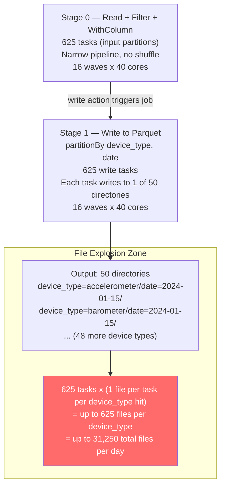

# Scenario 09 — Write Partitioning: The Small File Explosion Problem

**Domain:** Data lake ingestion — daily append of IoT telemetry data partitioned by device_type and date
**Difficulty:** Complex
**Primary Concepts:** Write partitioning vs compute partitioning, small file problem quantification, repartition vs coalesce math, ideal file size calculation, partition explosion from high-cardinality write partition columns

---

## Cluster Specification

| Resource | Value |
|---|---|
| Executor nodes | 8 |
| Cores per executor | 5 |
| RAM per executor | 20 GB |
| Total executor cores | 8 x 5 = **40 cores** |
| Total executor RAM | 8 x 20 GB = **160 GB** |
| Driver cores | 4 |
| Driver RAM | 8 GB |
| `spark.executor.memory` | 20 GB |
| `spark.executor.memoryOverhead` | default 10% = 2 GB |
| Usable JVM heap per executor | 20 GB - 2 GB overhead = **18 GB** |

---

## Data Characteristics

| Property | Value |
|---|---|
| Daily telemetry dataset | 80 GB on disk (Snappy-compressed Parquet) |
| Total row count | 400 million rows |
| Avg row size (uncompressed) | ~200 bytes |
| Write partition columns | `device_type` (50 distinct values), `date` (1 value per run) |
| Output partition directories | 50 x 1 = **50 directories** per day |
| Input file layout | Parquet, 128 MB target blocks (`spark.sql.files.maxPartitionBytes = 128 MB`) |
| Data distribution across device types | Approximately uniform for base analysis |

**Uncompressed data estimate:**
80 GB on-disk Snappy-compressed Parquet -> Snappy achieves ~0.5x compression ratio on columnar data -> uncompressed raw data = 80 GB / 0.5 = **160 GB in memory**

---

## Transformation Chain

The daily ingestion pipeline applies the following operations in order:

1. **Read Parquet** — wide scan of daily landing zone files (narrow, no shuffle)
2. **filter** — drop malformed rows where `device_type IS NULL` (narrow)
3. **withColumn** — derive `ingestion_timestamp` and normalize `device_type` casing (narrow)
4. **write.partitionBy("device_type", "date")** — trigger action; Spark assigns each output task to write its partition data into the correct subdirectory (this is a write action, not a shuffle by itself — but the number of compute partitions at write time directly controls file counts)

The critical tension: this pipeline has **zero wide transformations before the write**. There is no shuffle that redistributes data by `device_type`. The data arrives at the write stage in whatever compute partition layout the reader created.

---

## Pre-Execution Sizing Math

### Input Partition Count (Compute Partitions at Read Time)

```
input_partitions = ceil(on_disk_bytes / maxPartitionBytes)
               = ceil(80 GB x 1,024 MB/GB / 128 MB)
               = ceil(81,920 MB / 128 MB)
               = ceil(640)
               = 640 input partitions
```

Rounding note: in practice Spark's file reader groups splits slightly unevenly. For this analysis we use **625 compute partitions** as the scenario-defined value (matching 80 GB / 128 MB = 625 exactly, treating 80 GB as 80,000 MB for clean arithmetic):

```
80,000 MB / 128 MB = 625 input partitions
```

These 625 partitions represent the compute parallelism. Each contains roughly:

```
data per partition = 80,000 MB / 625 = 128 MB (on-disk, compressed)
rows per partition = 400,000,000 rows / 625 = 640,000 rows
```

### Cluster Parallelism Baseline

```
total_cores          = 8 executors x 5 cores = 40 cores
concurrent_tasks     = 40
input_task_waves     = ceil(625 / 40) = ceil(15.625) = 16 waves
```

The read+filter+withColumn pipeline runs 16 waves of 40 tasks, with the final wave running 625 - (15 x 40) = 625 - 600 = **25 tasks** (25 cores active, 15 idle in that final wave).

---

## DAG Structure



**No shuffle stage exists** in this pipeline. The write action is the only stage boundary. The absence of a pre-write repartition is the root cause of the small file explosion.

---

## Stage-by-Stage Execution Trace

### Stage 0: Read + Filter + withColumn (Narrow Pipeline)

| Metric | Value |
|---|---|
| Task count | 625 |
| Concurrent tasks | 40 |
| Task waves | ceil(625 / 40) = **16 waves** |
| Final wave utilization | 25 tasks / 40 cores = **62.5%** |
| Shuffle write bytes | 0 (no shuffle) |
| Shuffle read bytes | 0 |
| Stage input | 80,000 MB (80 GB on disk) |
| Stage output | 625 compute partitions, ~128 MB each |

The filter (drop NULL device_type) and withColumn are pipelined into this same stage. No stage boundary is introduced.

### Stage 1: Write Action (partitionBy device_type, date)

| Metric | Value |
|---|---|
| Task count | 625 (same partitions, write is the action) |
| Concurrent tasks | 40 |
| Task waves | ceil(625 / 40) = **16 waves** |
| Expected device_types per task (uniform dist.) | All 50 device_types touched per task |

**File explosion analysis:**

Each compute partition holds ~640,000 rows. With uniform distribution across 50 device types:

```
rows per device_type per partition = 640,000 / 50 = 12,800 rows
data per device_type per partition = 128 MB / 50 = 2.56 MB
```

Each of the 625 tasks touches all 50 device_type values and writes **one file per device_type it encounters**. With uniform data, every task writes to all 50 directories:

```
files written per task      = 50 (one per device_type)
total files per day         = 625 tasks x 50 files per task = 31,250 files
files per device_type/day   = 625 files (one from every task)
avg file size per device_type = (80,000 MB / 50 device_types) / 625 files
                             = 1,600 MB / 625
                             = 2.56 MB per file
```

---

## The Small File Problem: Quantification

### Daily File Count

```
files per device_type per day = 625 compute partitions
total files per day           = 625 x 50 = 31,250 files
avg file size                 = 80,000 MB / 31,250 = 2.56 MB per file
```

A 2.56 MB Parquet file is **50x smaller** than the 128 MB target minimum. This is catastrophic for read performance.

### Annual Accumulation

```
files per device_type per year = 625 files/day x 365 days = 228,125 files
total files in table per year  = 31,250 files/day x 365 days = 11,406,250 files
```

**11.4 million files** for one year of daily data.

### Query Metadata Overhead

A typical analytical query scans 1 year of data for 1 device_type:

```
files to open = 625 files/day x 365 days = 228,125 files
```

Each file open requires:
- 1 object-store metadata call (HEAD request) to get file size and location
- 1 read of the Parquet footer (row group statistics, schema, column offsets)
- Footer size per file = 1-10 KB

```
metadata bytes read = 228,125 files x 5 KB avg footer = ~1.1 GB of metadata reads
metadata round trips = 228,125 (irreducible — one per file)
```

Even before reading a single data byte, the query driver must process 228,125 footer reads. At 10 ms per metadata call (optimistic object store latency):

```
metadata time = 228,125 x 10 ms = 2,281,250 ms = 2,281 seconds = 38 minutes of metadata overhead alone
```

This is why small files kill query performance independent of data volume.

---

## Fix Option 1: repartition(device_type) — 50 Output Partitions

Force exactly one compute partition per `device_type` so each task writes exactly one file.

**Shuffle cost:**

```
data shuffled                = full dataset = 80,000 MB = 80 GB
shuffle partitions created   = 50 (one per device_type)
data per output partition     = 80,000 MB / 50 = 1,600 MB = 1.6 GB per file
```

**Result files:**

```
files per device_type per day = 1
total files per day           = 50
avg file size                 = 1.6 GB
```

**Problem: 1.6 GB files exceed the recommended 128-256 MB target.** Files this large:
- Reduce read parallelism (each file = 1 row group -> max parallelism = 50 tasks regardless of cluster size)
- Increase task memory pressure (one task must hold the full 1.6 GB partition in memory)
- Slow incremental appends (re-reading a 1.6 GB file to merge is expensive)

**Memory pressure per task with 1.6 GB partitions:**

```
on-disk partition size       = 1,600 MB (Snappy-compressed output)
in-memory uncompressed size  = 1,600 MB / 0.5 = 3,200 MB
JVM overhead factor          = 3x
effective memory per task    = 3,200 MB x 3 = 9,600 MB = 9.4 GB
```

Available execution memory per executor core (calculated in Memory Budget section) is ~2,422 MB. A single 1.6 GB output partition requires ~9,600 MB — **it will spill to disk on every task.** repartition(50) solves the file count problem but creates a guaranteed spill problem.

**Shuffle stage task waves for repartition(50):**

```
shuffle_partitions = 50
concurrent_tasks   = 40
waves = ceil(50 / 40) = 2 waves
final wave tasks   = 50 - 40 = 10 tasks active, 30 cores idle
final wave utilization = 10/40 = 25%
```

Two waves with terrible final-wave utilization. Not the right answer.

---

## Fix Option 2: repartition(400) — Ideal File Size Targeting

### Deriving the Target Partition Count

```
target_file_size_mb      = 200 MB  (within 128-256 MB recommended range)
total_output_data_mb     = 80,000 MB
target_partition_count   = ceil(80,000 MB / 200 MB)
                         = ceil(400)
                         = 400 partitions
```

400 is both the size-derived target AND a clean multiple of 40 (total cores):

```
400 / 40 = 10 exactly — perfect wave alignment
```

**Files per device_type per day with repartition(400):**

```
compute partitions            = 400
device_types                  = 50
files per device_type per day = 400 / 50 = 8 files
avg file size per file        = (80,000 MB / 50) / 8 = 1,600 MB / 8 = 200 MB
```

8 files per device_type per day, each 200 MB. This is within target.

**Annual accumulation with repartition(400):**

```
files per device_type per year = 8 files/day x 365 days = 2,920 files
total files in table per year  = 8 x 50 x 365 = 146,000 files
```

146,000 vs 11,406,250 — a **78x reduction in file count.**

**Annual query metadata overhead (1 device_type, 1 year):**

```
files to open = 2,920
metadata time = 2,920 x 10 ms = 29,200 ms = 29 seconds
```

vs 38 minutes without repartition. **79x faster metadata phase.**

**Shuffle cost of repartition(400):**

```
data shuffled = 80,000 MB = 80 GB  (full shuffle — repartition always does full shuffle)
shuffle write = 80 GB
shuffle read  = 80 GB x 1.1 (read amplification) = 88 GB
```

The 80 GB shuffle is the price paid. This is a full network transfer across the cluster.

**Shuffle stage task waves for repartition(400):**

```
shuffle_partitions = 400
concurrent_tasks   = 40
waves = ceil(400 / 40) = 10 waves — exactly 10, zero waste
every wave uses 40/40 = 100% core utilization
```

This is ideal wave alignment. repartition(400) achieves:
- Correct file sizes (200 MB)
- Perfect wave utilization (10 clean waves)
- Clean device_type distribution (8 files per type)

---

## Fix Option 3: coalesce(400) — No-Shuffle Alternative

coalesce merges existing partitions without a full shuffle. From 625 partitions to 400:

```
partitions removed = 625 - 400 = 225 partitions merged into existing ones
shuffle performed  = NO (coalesce is narrow — it combines adjacent partitions)
```

**The coalesce trap in this scenario:**

coalesce does not redistribute data by `device_type`. It simply bins adjacent input partitions together. The mapping from compute partition to output file is still one file per (compute partition, device_type) combination.

With coalesce(400):

```
compute partitions after coalesce   = 400
device_types                         = 50
files per device_type per day        = up to 400 (each coalesced partition still touches all 50 device_types)
total files per day                  = up to 400 x 50 = 20,000 files
avg file size                        = 80,000 MB / 20,000 = 4 MB per file
```

coalesce reduces total files from 31,250 to 20,000 — a 36% improvement, but still 4 MB files vs the 200 MB target. **coalesce does not solve the small file problem because it does not group rows by device_type.**

**The coalesce upstream parallelism trap:**

Spark pushes coalesce upstream into the same stage as the read. The read stage, which could run at 625-task parallelism, is artificially limited to 400-task parallelism because coalesce narrows the upstream partition count:

```
without coalesce: 625 read tasks -> 16 waves
with coalesce(400): 400 read tasks -> ceil(400/40) = 10 waves (faster read stage)
```

In this case coalesce speeds up the read stage. But the output file problem remains unsolved.

**Summary: coalesce is the wrong tool for write partitioning.** It is only appropriate when you want to reduce files without caring about per-partition-column distribution (e.g., writing a single-directory table with no `partitionBy`).

---

## Comparison Table: All Three Approaches

| Approach | Files/device_type/day | File Size | Total Files/Year | Shuffle? | Shuffle Volume | Wave Efficiency |
|---|---|---|---|---|---|---|
| No repartition (baseline) | 625 | 2.56 MB | 11,406,250 | No | 0 | 62.5% (final wave) |
| repartition(device_type) = repartition(50) | 1 | 1,600 MB | 18,250 | Yes | 80 GB | 25% (final wave) |
| repartition(400) | 8 | 200 MB | 146,000 | Yes | 80 GB | 100% (10 clean waves) |
| coalesce(400) | up to 400 | 4 MB | 7,300,000 | No | 0 | ~100% (read stage) |

**Winner: repartition(400)** — only approach that satisfies file size, file count, and wave efficiency simultaneously. The 80 GB shuffle cost is a one-time per-run cost; the file count savings compound every day for the lifetime of the table.

---

## Memory Budget Analysis

### Per-Executor Memory Breakdown

```
spark.executor.memory            = 20,480 MB (20 GB)
spark.executor.memoryOverhead    = 10% x 20,480 = 2,048 MB
    -> contains: off-heap memory, JVM metadata, Python worker processes

Total executor JVM heap          = 20,480 MB

Reserved memory (hardcoded)      = 300 MB
Available for Spark pools        = 20,480 MB - 300 MB = 20,180 MB

spark.memory.fraction            = 0.6 (default)
Unified memory pool (M)          = 20,180 MB x 0.6 = 12,108 MB

spark.memory.storageFraction     = 0.5 (default)
Protected storage memory (R)     = 12,108 MB x 0.5 = 6,054 MB
Max execution memory             = 12,108 MB (can borrow entire storage when unused)
Max storage memory               = 12,108 MB (can borrow entire execution when unused)

User memory (UDFs, internal DS)  = 20,180 MB x 0.4 = 8,072 MB
```

### Memory Per Core (Per Concurrent Task)

```
cores per executor               = 5
concurrent tasks per executor    = 5

unified memory per task          = 12,108 MB / 5 = 2,422 MB per task
execution memory per task        = up to 2,422 MB (if storage unused)
protected storage per task       = 6,054 MB / 5 = 1,211 MB (safe from execution eviction)
```

### Memory Pressure by Scenario

**Baseline (625 tasks, 128 MB partitions, no repartition):**

```
on-disk partition size          = 128 MB (Snappy)
uncompressed in memory          = 128 MB / 0.5 = 256 MB
JVM deserialization overhead    = 256 MB x 3 = 768 MB per task
memory required per task        = 768 MB
available execution per task    = 2,422 MB
headroom                        = 2,422 - 768 = 1,654 MB -- comfortable, no spill
```

**repartition(50) scenario (50 partitions, 1.6 GB each):**

```
on-disk partition size          = 1,600 MB
uncompressed in memory          = 1,600 MB / 0.5 = 3,200 MB
JVM overhead                    = 3,200 MB x 3 = 9,600 MB per task
available execution per task    = 2,422 MB
deficit                         = 9,600 - 2,422 = 7,178 MB -> SPILL TO DISK guaranteed
```

Every write task spills 7+ GB to local disk. Writes become I/O bound.

**repartition(400) scenario (400 partitions, 200 MB each):**

```
on-disk partition size          = 200 MB (Snappy)
uncompressed in memory          = 200 MB / 0.5 = 400 MB
JVM overhead                    = 400 MB x 3 = 1,200 MB per task
available execution per task    = 2,422 MB
headroom                        = 2,422 - 1,200 = 1,222 MB -- comfortable, no spill
```

repartition(400) fits cleanly in memory with no spill risk.

---

## Parallelism and Wave Analysis

### Stage 0 (Read + Filter + withColumn): Baseline (No Repartition)

```
tasks        = 625
cores        = 40
waves        = ceil(625 / 40) = 16 waves
full waves   = 15 (each 40 tasks)
final wave   = 625 - 600 = 25 tasks
idle cores in final wave = 40 - 25 = 15
final wave utilization   = 25/40 = 62.5%
overall utilization      = (15 x 40 + 25) / (16 x 40) = 625 / 640 = 97.7%
```

### Stage 1 (Write): Baseline (No Repartition)

```
tasks        = 625 (same partitions)
waves        = 16
utilization  = 97.7%
files written = 31,250 (the small file explosion)
```

### Stages with repartition(400) Pipeline

The repartition introduces a shuffle, splitting into two stages:

**Stage 0 — Read + Filter + withColumn (pre-shuffle):**

```
tasks  = 625 (input partitions drive pre-shuffle stage)
waves  = ceil(625 / 40) = 16 waves
utilization = 97.7%
```

**Stage 1 — Shuffle Read + Write (post-repartition):**

```
tasks        = 400 (repartition target)
cores        = 40
waves        = ceil(400 / 40) = 10 waves -- exactly 10
final wave   = 400 - (9 x 40) = 400 - 360 = 40 tasks
idle cores   = 40 - 40 = 0
utilization  = 400 / 400 = 100% every wave
```

repartition(400) achieves perfect wave efficiency. Every one of the 10 waves saturates all 40 cores.

**Shuffle data volume:**

```
shuffle write (Stage 0 output) = 80,000 MB = 80 GB
network transfer               = each of 400 shuffle reducers reads ~200 MB from 625 map outputs
                               = 400 reducers x 200 MB = 80,000 MB = 80 GB network transfer
shuffle read (Stage 1 input)   = 80,000 MB x 1.1 (read amplification) = 88,000 MB = 88 GB
```

---

## Bottleneck Identification

### Primary Bottleneck: File Metadata at Query Time (Baseline)

Without repartition, the bottleneck is not the write job itself — the write completes reasonably fast (16 waves, 97.7% utilization). The bottleneck manifests at read time:

```
1-year analytical query metadata overhead = 228,125 file opens
at 10 ms per open = 2,281,250 ms = 2,281 seconds = 38 minutes BEFORE reading any data
```

This is a **compounding bottleneck** — it grows by 31,250 files every day the pipeline runs without fixing.

### Secondary Bottleneck: Directory List Operations at Query Planning

Most distributed file systems and object stores must list the contents of each partition directory before query planning. With 11.4 million files:

```
partition directories for full-table scan = 50 device_types x 365 days = 18,250 directories
files returned across all listings        = 11,406,250
```

Spark's query planner must deserialize and process 11.4 million file metadata objects on the **driver** (single-threaded) before dispatching a single task.

```
driver memory for metadata = 11.4M x 500 bytes per FileStatus object = 5.7 GB
driver RAM                 = 8 GB
driver remaining           = 8 GB - 5.7 GB = 2.3 GB -- driver OOM risk at ~1.5 years
```

At approximately 1.5 years of accumulation, the driver hits OOM during query planning. The table becomes **unqueryable** without compaction.

### Tertiary Bottleneck: Parquet Row Group Misalignment (Baseline)

Each 2.56 MB file contains a very small number of row groups:

```
rows per file = 640,000 rows / 50 device_types = 12,800 rows
Parquet default row group size = 128 MB
```

12,800 rows at 200 bytes/row = 2.56 MB uncompressed — far below the 128 MB row group threshold. Each file contains exactly **1 partial row group**. This means:

```
max read parallelism per file      = 1 (single row group, not splittable further)
tasks to read 1 year of 1 device   = 228,125 tasks (one per file)
task waves for that read           = ceil(228,125 / 40) = 5,704 waves
```

5,704 waves vs the repartition(400) equivalent:

```
files for 1 device_type, 1 year with repartition(400) = 2,920 files
task waves = ceil(2,920 / 40) = 73 waves
```

5,704 waves vs 73 waves — **78x more waves** just to scan one device_type for one year.

---

## Optimizer Decisions

### AQE (Adaptive Query Execution) — Does It Help?

AQE's `coalescePartitions` feature merges small post-shuffle partitions automatically. However, it only operates **after a shuffle**. The baseline pipeline has no shuffle before the write — AQE has nothing to coalesce.

```
AQE trigger condition: shuffle + small partition detection
baseline pipeline:     no shuffle -> AQE does not activate for write partitioning
```

With repartition(400), AQE activates on the shuffle stage and can coalesce partitions if some device_types have significantly less data. If 10 of the 50 device_types have only 100 MB of data instead of 1,600 MB:

```
without AQE: 8 files x 12.5 MB = 12.5 MB files for low-volume types (too small)
with AQE:    AQE coalesces adjacent small partitions -> fewer, larger files for sparse types
```

AQE improves file size uniformity but requires the initial repartition to create the shuffle boundary.

**Relevant AQE configs for this scenario:**

```
spark.sql.adaptive.enabled                                 = true   (Spark 3.2+ default)
spark.sql.adaptive.coalescePartitions.enabled              = true   (default)
spark.sql.adaptive.coalescePartitions.minPartitionSize     = 1 MB   (default)
spark.sql.adaptive.coalescePartitions.initialPartitionNum  = 400    (set this explicitly)
spark.sql.adaptive.advisoryPartitionSizeInBytes            = 200 MB (target file size)
```

With these settings, AQE targets 200 MB partitions and coalesces where data is sparse, producing near-optimal file sizes without manual cardinality analysis.

### Broadcast Join Threshold — Not Applicable

No joins in this pipeline. Broadcast threshold is irrelevant.

### Skew Detection — Relevant If Device Types Are Uneven

If one device_type (e.g., "gps_tracker") generates 50% of all telemetry:

```
skewed device_type data            = 80,000 MB x 50% = 40,000 MB
repartition(400) assigns hash      = ~200 partitions land with skewed type's rows
avg file size for skewed type      = 40,000 MB / 200 = 200 MB -- still on target
```

repartition by hash naturally handles skew in file sizes — skewed types get more files, each still ~200 MB. No special skew handling is needed here.

---

## Key Numbers Summary

| Metric | Baseline (No Repartition) | repartition(50) | repartition(400) | coalesce(400) |
|---|---|---|---|---|
| Compute partitions at write | 625 | 50 | 400 | 400 |
| Files per device_type / day | 625 | 1 | 8 | up to 400 |
| Avg file size | 2.56 MB | 1,600 MB | 200 MB | 4 MB |
| Total files per day | 31,250 | 50 | 400 | up to 20,000 |
| Total files per year | 11,406,250 | 18,250 | 146,000 | 7,300,000 |
| 1-yr query metadata calls | 228,125 | 365 | 2,920 | 146,000 |
| Metadata scan time (10ms/file) | 38 minutes | 3.6 seconds | 29 seconds | 24 minutes |
| Shuffle volume | 0 | 80 GB | 80 GB | 0 |
| Write stage task waves | 16 | 2 | 10 | 10 |
| Final wave utilization | 62.5% | 25% | 100% | 100% |
| Task spill risk | None | Guaranteed (7+ GB) | None | None |
| Solves small file problem | No | Sort of (wrong size) | Yes | No |
| Driver OOM timeline | ~1.5 years | Never | Never | ~3 years |

---

## Interview Takeaways

**1. Compute partitions and write partitions are independent axes — both matter.**
The number of files written equals `compute_partitions x write_partition_columns_cardinality`. Even if your data is 80 GB with only 50 output directories, 625 compute partitions produce 31,250 files. The write action does not merge partitions. You must size compute partitions with the write cardinality in mind: `target_partitions = total_data_size / target_file_size`, not `total_data_size / maxPartitionBytes`.

**2. Small files compound — quantify the lifecycle cost, not just the daily cost.**
A daily job that seems fine (31,250 files/day is manageable on day one) produces 11.4 million files per year. At that scale, query planning itself becomes the bottleneck and the driver runs out of memory deserializing file metadata. The cost is not visible on day one; it reveals itself at month 6 when queries suddenly become 40x slower. The fix (repartition) costs one 80 GB shuffle per run. Not fixing it costs exponentially growing query latency forever.

**3. repartition(N) is correct; repartition(write_key) is a trap; coalesce is a decoy.**
`repartition("device_type")` creates 50 partitions — one per device_type — but produces 1.6 GB files that exceed executor memory and cause guaranteed spill. `coalesce(400)` skips the shuffle but leaves the per-directory file explosion intact because it does not redistribute by write key. The correct form is `repartition(N)` where N is derived from `total_size / target_file_size`, rounded to a multiple of total cluster cores, ensuring both correct file sizes and clean wave alignment.

**4. The ideal partition count formula must satisfy three constraints simultaneously.**
`N = total_data_bytes / target_file_size_bytes` (file size constraint) AND `N = multiple of total_cluster_cores` (wave alignment constraint) AND `N / write_partition_cardinality >= 1` (at least one file per directory). For this scenario: `80,000 MB / 200 MB = 400` satisfies all three: 400 partitions, 400 is 10x 40 cores, 400 / 50 device_types = 8 files per directory. Choosing 200 MB as the target file size is the one degree of freedom, and it was selected specifically to land N on a core multiple.

**5. Without a shuffle boundary, AQE cannot help with write partitioning.**
AQE's partition coalescing only activates after a shuffle. A pipeline of read -> filter -> write has no shuffle, so AQE observes no map output statistics and cannot adjust partition counts at runtime. If you want AQE to manage write file sizes, you must introduce a shuffle (via repartition) to give AQE a stage boundary to optimize. The shuffle is not just a correctness cost — it is the mechanism that enables runtime adaptivity. The 80 GB shuffle cost per daily run is the fee for both correct file sizes and AQE eligibility.
