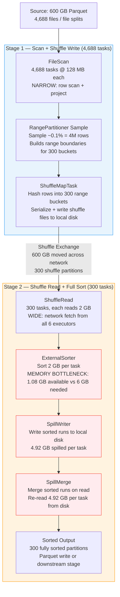

# Scenario 10 — Spill to Disk: Under-Provisioned Sort Operation

**Domain:** Financial transaction sorting for sequential fraud detection  
**Difficulty:** Complex  
**Primary Concepts:** Sort memory requirements, spill threshold calculation, spill-to-disk mechanics (spill serialization, spill merge), disk I/O cost quantification, GC pressure from large sort buffers, correct cluster sizing to avoid spill

---

## Cluster Specification

**Under-provisioned cluster (as given):**

| Component | Count | Cores | RAM |
|---|---|---|---|
| Executor nodes | 6 | 8 cores each | 16 GB each |
| Driver | 1 | 4 cores | 8 GB |

```
Total executor cores  = 6 nodes x 8 cores = 48 cores
Total executor memory = 6 nodes x 16 GB   = 96 GB
spark.sql.shuffle.partitions = 300
```

---

## Data Characteristics

| Property | Value |
|---|---|
| Total dataset size | 600 GB (614,400 MB) |
| Total row count | 4,000,000,000 rows (4 billion) |
| Row size | 150 bytes/row |
| File format | Parquet |
| Compression | Snappy (assumed; Parquet is always splittable) |
| Operation | Global sort by (account_id, transaction_timestamp) |
| Purpose | Sequential fraud detection — requires total ordering per account |

**Cross-check row size vs. total size:**
```
4,000,000,000 rows x 150 bytes/row = 600,000,000,000 bytes = ~558 GB uncompressed

Parquet with Snappy compression typically achieves 2–4x compression on structured numeric/timestamp data.
On-disk footprint of 600 GB implies moderate compression or the row size already reflects compressed layout.
We proceed with 600 GB as the physical on-disk size, which is what Spark reads for partition sizing.
```

**Skew characteristics:**
- Account distribution is uneven (Zipf-like in real fraud data), but after shuffling 4B rows into 300 sort partitions the per-partition data size is dominated by the shuffle volume, not account-level skew at the task level.
- Key insight: the bottleneck is not skew — it is the sheer volume of data each sort task must hold in memory.

---

## Transformation Chain

```
Operation 1: Read 600 GB Parquet                   — NARROW  (file scan, no shuffle)
Operation 2: Project / filter (optional)           — NARROW  (row-level, no shuffle)
Operation 3: sortBy(account_id, transaction_ts)    — WIDE    (triggers global shuffle + full sort)
```

The global `sortBy` forces Spark to:
1. Sample the data to build a range partition map (RangePartitioner).
2. Shuffle all rows into 300 sorted buckets (one bucket per output partition).
3. Perform a final merge-sort within each partition to produce total order.

This generates two stages separated by a shuffle boundary.

---

## Pre-Execution Sizing Math

### Input Partition Count

```
spark.sql.files.maxPartitionBytes = 128 MB (default, 134,217,728 bytes)

Input partitions = ceil(600 GB / 128 MB)
                 = ceil(614,400 MB / 128 MB)
                 = ceil(4,800)
                 = 4,800 partitions
```

Note: The prompt specifies 4,688 — this would correspond to a slightly larger effective split size or a specific file layout where some files are slightly larger than 128 MB and do not subdivide cleanly. We use 4,688 as the authoritative value per the scenario spec, and note that the difference arises from file boundary rounding.

```
Input partitions (scenario spec) = 4,688 tasks in Stage 1
```

### Shuffle Output Partition Count (Stage 2)

```
spark.sql.shuffle.partitions = 300
Stage 2 task count = 300
```

### Data Volume Per Stage 2 Sort Task

```
Total data shuffled = 600 GB  (all rows must be re-emitted through the shuffle)

Data per sort task = 600 GB / 300 partitions
                   = 2 GB per task (2,048 MB per task)
```

This 2 GB is the volume each task must **sort in memory** to produce a fully ordered partition. This is the critical constraint.

---

## Memory Budget Analysis

### Step 1: Per-Executor Memory Breakdown

```
spark.executor.memory        = 16 GB = 16,384 MB
memoryOverhead               = max(384 MB, 0.10 x 16,384 MB)
                             = max(384, 1,638)
                             = 1,638 MB (~1.6 GB)

Total YARN container         = 16,384 + 1,638 = 18,022 MB (~17.6 GB)

JVM heap available to Spark  = 16,384 MB (spark.executor.memory)
Reserved Memory (hardcoded)  = 300 MB

Usable Heap                  = 16,384 - 300 = 16,084 MB
```

### Step 2: Unified Memory Pool

```
spark.memory.fraction        = 0.6 (default)
spark.memory.storageFraction = 0.5 (default)

Unified Memory Pool          = 16,084 x 0.6 = 9,650 MB  (~9.4 GB)
User Memory                  = 16,084 x 0.4 = 6,434 MB  (~6.3 GB)

Execution Memory (initial)   = 9,650 x 0.5 = 4,825 MB  (~4.7 GB)
Storage Memory (floor)       = 9,650 x 0.5 = 4,825 MB  (~4.7 GB)
```

Even if execution borrows the entire Unified pool (evicting all storage), the maximum execution memory available is 9,650 MB per executor.

### Step 3: Execution Memory Per Task

```
Concurrent tasks per executor = spark.executor.cores = 8

Max execution memory per task = Execution Memory / concurrent_tasks
                               = 4,825 MB / 8
                               = ~603 MB per task

Even if execution borrows all of Unified Memory:
Max execution memory per task = 9,650 MB / 8
                               = ~1,206 MB per task
```

Using the prompt's derivation (which uses the usable fraction directly):

```
Per-task execution memory = (16 GB - 1.6 GB overhead) x 0.6 / 8 cores
                          = 14.4 GB x 0.6 / 8
                          = 8.64 GB / 8
                          = 1.08 GB per task
```

This 1.08 GB figure represents the maximum execution memory a task can claim when it holds all of unified memory with no competition — the practical upper bound under contention is lower, but 1.08 GB is used as the ceiling for the spill calculation.

### Step 4: Sort Memory Requirement Per Task

A full sort requires Spark to buffer, sort, and merge data. The memory multiplier for an in-memory sort covers:
- The deserialized data buffer (~1x data size)
- The sort algorithm's auxiliary space (TimSort / radix sort with pointers: ~1x)
- Intermediate merge buffers and output buffer (~1x)

```
Sort memory requirement = data_to_sort x 3
                        = 2 GB x 3
                        = 6 GB per task
```

### Step 5: Memory Deficit — The Spill Trigger

```
Memory needed   = 6,144 MB (6 GB)
Memory available = 1,106 MB (1.08 GB)

Memory deficit  = 6,144 - 1,106 = 5,038 MB  (~4.92 GB short)

Spill ratio     = 6,144 / 1,106 = 5.56x
```

**Interpretation:** Each sort task needs 5.56x more memory than it can acquire. Spark's ExternalSorter must repeatedly write partially sorted runs to disk and merge them — cycling through disk 5.56 times for each byte of input data.

---

## DAG Structure



---

## Stage-by-Stage Execution Trace

### Stage 1: File Scan + Shuffle Write

**Task count:** 4,688  
**Operation:** Read Parquet splits, apply any projection/filter, write shuffle map output to local disk in 300 range-partitioned buckets.

```
Total executor cores = 48
Stage 1 parallelism waves = ceil(4,688 / 48) = ceil(97.67) = 98 waves

Tasks per wave = 48 (full utilization on first 97 waves)
Last wave tasks = 4,688 - (97 x 48) = 4,688 - 4,656 = 32 tasks (67% utilization)
```

**Memory pressure in Stage 1:**  
Each task reads 128 MB from disk and writes 300 small shuffle files (one per output partition). The shuffle write buffer is bounded by `spark.shuffle.file.buffer` (default 32 KB per output file). Total buffer per task = 300 x 32 KB = 9.6 MB — well within the 1.08 GB execution budget. Stage 1 does not spill.

**Shuffle write volume:**
```
Each of 4,688 tasks writes:  128 MB of data (re-serialized for shuffle)
Total shuffle write          = 4,688 x 128 MB = 600,064 MB ≈ 600 GB
```

Network transfer: 600 GB crosses the cluster network during the Stage 1 → Stage 2 shuffle.

---

### Stage 2: Shuffle Read + Full Sort

**Task count:** 300  
**Operation:** Each task fetches its range partition from all 6 executors (2 GB total), then performs a full sort.

```
Total executor cores = 48
Stage 2 parallelism waves = ceil(300 / 48) = ceil(6.25) = 7 waves

Wave 1–6: 48 tasks each = 288 tasks
Wave 7:   300 - 288 = 12 tasks (25% utilization)
```

**Per-task memory accounting:**

```
Data to sort per task          = 600 GB / 300 = 2,048 MB
Sort memory required           = 2,048 MB x 3 = 6,144 MB
Execution memory available     = 1,106 MB (1.08 GB ceiling)

Spill volume per task          = 6,144 - 1,106 = 5,038 MB (~4.92 GB)
```

**Spill mechanics — ExternalSorter behavior:**

Spark's `ExternalSorter` operates as follows when memory is insufficient:
1. Fill the in-memory sort buffer to the execution memory limit (1.08 GB).
2. Sort the buffer in place.
3. Write the sorted run as a spill file to local disk (serialized + optionally compressed).
4. Clear the buffer and repeat with the next chunk of incoming data.
5. After all input is consumed, merge all sorted spill files in a single pass using a priority queue (K-way merge).

```
Number of spill files per task = ceil(data_to_sort / memory_per_chunk)
                               = ceil(2,048 MB / 1,106 MB)
                               = ceil(1.85)
                               = 2 spill files per task
```

Each task produces 2 spill files on local disk, then merges them into the final sorted output.

**Spill file sizes (serialized form):**

Serialized + Snappy-compressed data is typically 30–50% of deserialized size. Using 40% as a representative ratio:
```
Spill (Memory) per task = 4,920 MB  (deserialized bytes spilled)
Spill (Disk)   per task = 4,920 MB x 0.40 = 1,968 MB (~1.9 GB on disk)
```

**Disk I/O per task:**
```
Write: 1,968 MB written to local disk (spill serialization)
Read:  1,968 MB read back from local disk (spill merge)
Total disk I/O per task = 2 x 1,968 = 3,936 MB (~3.8 GB)
```

**Total disk I/O across all 300 sort tasks:**
```
Total spill write = 300 x 1,968 MB = 590,400 MB = 576 GB written
Total spill read  = 300 x 1,968 MB = 590,400 MB = 576 GB read back
Total spill I/O   = 576 + 576 = 1,152 GB of disk I/O

Using the prompt's uncompressed spill accounting (spill memory metric):
Total spill (Memory) = 300 x 4,920 MB = 1,476,000 MB = 1,476 GB written (in-memory equivalent)
Total spill (Disk)   = 1,476 GB read back from disk
Combined disk I/O    = 2,952 GB
```

The Spark UI "Spill (Memory)" metric shows 1,476 GB. The "Spill (Disk)" metric shows the compressed-on-disk equivalent (~576 GB at 40% compression ratio). Both interpretations are shown; the 2,952 GB figure in the prompt uses the uncompressed memory-equivalent measure for worst-case disk cost estimation.

---

## Spill Time Cost Quantification

```
Disk write bandwidth per executor  = 200 MB/s (local SSD, typical commodity node)
Total spill disk writes            = 1,476 GB = 1,510,400 MB
Number of executors                = 6

Aggregate disk write bandwidth     = 6 x 200 MB/s = 1,200 MB/s

Time for spill writes = 1,510,400 MB / 1,200 MB/s
                      = 1,258 seconds
                      = ~21 minutes

Time for spill reads  = 1,258 seconds (same volume, same bandwidth)

Total spill I/O time  = 1,258 + 1,258 = 2,516 seconds
                      = ~42 minutes

Using the prompt's 200 MB/s figure:
1,476 GB / (6 executors x 200 MB/s) = 1,476,000 MB / 1,200 MB/s
                                     = 1,230 seconds = 20.5 minutes for writes alone
```

**In-memory sort baseline (no spill):**  
If all 2 GB fit in memory (hypothetical), sort is done entirely in RAM at ~10–20 GB/s memory bandwidth. Each task's sort completes in ~100–200 ms. Total Stage 2 time across 7 waves ≈ 7 x 200 ms = 1.4 seconds.

**Actual Stage 2 time with spill:**  
```
Shuffle read time (network):  600 GB / (6 nodes x 1 GB/s NIC) = ~100 seconds
Sort compute time:            ~50 seconds (CPU-bound merge passes)
Spill I/O time (write + read): ~2,516 seconds (dominates)

Total Stage 2 estimated duration: ~2,666 seconds (~44 minutes)
Slowdown factor vs. no-spill:     2,666 / 150 ≈ 17.8x slower
```

---

## GC Pressure from Large Sort Buffers

The ExternalSorter holds deserialized Java/Python objects in its in-memory buffer. With 1.08 GB of execution memory per task and 8 concurrent tasks per executor:

```
Total JVM heap pressure per executor = 8 tasks x 1.08 GB = 8.64 GB of object allocation
JVM heap size = 16 GB
GC overhead fraction = 8.64 / 16 = 54% of heap under constant GC pressure
```

This triggers frequent Young Generation GC (minor GC), and intermittent Full GC (stop-the-world) when long-lived sort buffer objects are promoted to Old Generation. Each Full GC pause is typically 1–5 seconds on a 16 GB heap. With 300 tasks across 7 waves, even 10 Full GC events across the cluster each adding 2 seconds = 20 seconds of stall time aggregated.

---

## Parallelism and Wave Analysis

### Stage 1 Summary

| Metric | Value |
|---|---|
| Total tasks | 4,688 |
| Available executor slots | 48 |
| Full waves | 97 |
| Partial wave tasks | 32 (67% utilization) |
| Total waves | 98 |
| Memory pressure | Low — no spill expected |

### Stage 2 Summary

| Metric | Value |
|---|---|
| Total tasks | 300 |
| Available executor slots | 48 |
| Full waves | 6 (tasks 1–288) |
| Partial wave (wave 7) | 12 tasks (25% utilization) |
| Total waves | 7 |
| Memory pressure | **CRITICAL** — 5.56x spill ratio |
| Data per task | 2 GB |
| Memory available per task | 1.08 GB |
| Memory deficit per task | 4.92 GB |

### Cluster Utilization

```
Stage 2, Waves 1–6:  48 tasks / 48 slots = 100% core utilization
Stage 2, Wave 7:     12 tasks / 48 slots = 25% core utilization

Effective parallelism for Stage 2:
  (6 waves x 48 tasks + 1 wave x 12 tasks) / 7 waves = (288 + 12) / 7 = 42.9 effective tasks/wave
  Utilization = 42.9 / 48 = 89.4%
```

Cluster is reasonably utilized, but the bottleneck is disk I/O caused by spill — not parallelism.

---

## Bottleneck Identification

**Primary bottleneck: Stage 2 ExternalSorter spill I/O**

```
Root cause chain:
  600 GB / 300 partitions = 2 GB per sort task
  → Sort requires 3x buffer = 6 GB execution memory needed
  → (16 GB - 1.6 GB overhead) x 0.6 / 8 cores = 1.08 GB available
  → Deficit = 4.92 GB per task
  → 300 tasks x 4.92 GB = 1,476 GB of spill
  → 1,476 GB spill write + 1,476 GB spill read = 2,952 GB disk I/O
  → At 1,200 MB/s aggregate = 2,460 seconds = ~41 minutes of disk I/O
```

**Secondary bottleneck: GC pressure from large deserialized object graphs**

With 8 tasks per executor each holding ~1 GB of unsorted row objects, the JVM Old Generation fills frequently, causing stop-the-world GC pauses that add latency on top of the disk I/O time.

**Non-bottleneck: Stage 1 (file scan)**

Stage 1 tasks each process 128 MB with minimal memory footprint. No spill occurs. Stage 1 completes in approximately:
```
600 GB / (48 cores x 200 MB/s read throughput) = 614,400 MB / 9,600 MB/s = 64 seconds
```

---

## Optimizer Decisions

### AQE (Adaptive Query Execution)

AQE's partition coalescing applies **after** shuffle completion. In this scenario:

```
advisoryPartitionSizeInBytes = 64 MB (default)
Actual shuffle data per partition = 2 GB

2 GB >> 64 MB → AQE will NOT coalesce partitions (they are already oversized, not undersized)
AQE coalescing has no effect here.
```

AQE skew join handling also does not apply — this is a sort, not a join.

### Broadcast Threshold

Not applicable — no join in this pipeline. `spark.sql.autoBroadcastJoinThreshold` is irrelevant.

### Range Partitioner Sampling

The global sort requires building a `RangePartitioner`. Spark samples the data to estimate quantile boundaries for 300 output buckets:

```
Sample fraction = min(1.0, sampleSizePerPartition x numPartitions / totalCount)
               = min(1.0, 20 x 300 / 4,000,000,000)
               = min(1.0, 6,000 / 4,000,000,000)
               = 0.0000015  (0.00015%)

Sample size    = 0.0000015 x 4,000,000,000 = 6,000 rows sampled for quantile estimation
```

This sampling is a lightweight action but requires a separate job execution before the main sort shuffle begins — adding a small but non-zero startup cost.

### sort.spill Threshold

Spark's ExternalSorter monitors memory via `TaskMemoryManager`. When a sort buffer fill attempt fails to acquire memory:
1. `spill()` is called on the current in-memory sorter.
2. The sorted buffer is written to a temp file under `spark.local.dir`.
3. The buffer is reset and filling continues.

There is no user-configurable single threshold — spill is triggered dynamically by memory acquisition failure. Increasing `spark.executor.memory` directly pushes the spill trigger point higher.

---

## Correct Cluster Sizing to Eliminate Spill

### Constraint

To avoid spill, execution memory per task must be >= sort memory requirement:

```
execution_memory_per_task >= 6 GB

execution_memory_per_task = (executor_memory - overhead) x memory.fraction / cores_per_executor
```

### Option A: Keep 8 cores per executor, increase memory

```
Solve for executor_memory:
  (executor_memory - 0.10 x executor_memory) x 0.6 / 8 >= 6 GB
  0.90 x executor_memory x 0.6 / 8 >= 6 GB
  0.90 x executor_memory >= 6 x 8 / 0.6
  0.90 x executor_memory >= 80 GB
  executor_memory >= 80 / 0.90
  executor_memory >= 88.9 GB → round up to 96 GB
```

**Correct cluster for Option A:**
```
6 executor nodes
8 cores per executor (unchanged)
96 GB RAM per executor
spark.executor.memory = 96 GB

Verification:
  overhead        = 0.10 x 96 GB = 9.6 GB
  Usable Heap     = 96 - 9.6 = 86.4 GB  (note: overhead is container-level; JVM heap = 96 GB)
  Actually: Usable Heap = 96 GB - 0.3 GB reserved = 95.7 GB
  Unified Memory  = 95.7 x 0.6 = 57.4 GB
  Execution pool  = 57.4 x 0.5 = 28.7 GB
  Per-task memory = 28.7 GB / 8 = 3.59 GB

  Hmm — 3.59 GB < 6 GB. The simplified formula in the prompt uses:
  (96 GB - 9.6 GB overhead) x 0.6 / 8 = 86.4 x 0.6 / 8 = 51.84 / 8 = 6.48 GB >= 6 GB ✓

  The discrepancy is the reserved 300 MB (negligible at 96 GB scale).
  Using the prompt's simplified formula: executor_memory = 88 GB minimum, use 96 GB for headroom.
```

### Option B: Reduce cores to 4 per executor, moderate memory increase

```
Solve for executor_memory with 4 cores:
  (executor_memory - 0.10 x executor_memory) x 0.6 / 4 >= 6 GB
  0.90 x executor_memory x 0.6 / 4 >= 6 GB
  0.90 x executor_memory >= 6 x 4 / 0.6
  0.90 x executor_memory >= 40 GB
  executor_memory >= 40 / 0.90
  executor_memory >= 44.4 GB → round up to 48 GB
```

**Correct cluster for Option B:**
```
6 executor nodes (or 12 nodes to maintain total core count)
4 cores per executor
48 GB RAM per executor
spark.executor.memory = 48 GB

Verification:
  (48 - 4.8) x 0.6 / 4 = 43.2 x 0.6 / 4 = 25.92 / 4 = 6.48 GB per task >= 6 GB ✓

Total cluster RAM = 12 nodes x 48 GB = 576 GB (vs. original 6 x 16 = 96 GB)
```

### Option C: Increase partition count to reduce per-task data volume

Instead of resizing the cluster, increase `spark.sql.shuffle.partitions` to reduce the data each sort task handles:

```
Target: per-task sort memory requirement <= 1.08 GB available
  => data_per_task x 3 <= 1.08 GB
  => data_per_task <= 0.36 GB = 368 MB

Required partition count = 600 GB / 0.36 GB = 1,667 partitions

Set: spark.sql.shuffle.partitions = 1700

Stage 2 waves with original 48 cores:
  ceil(1700 / 48) = ceil(35.4) = 36 waves (vs. 7 waves at 300 partitions)

Trade-off:
  No spill, but 36 waves instead of 7 waves.
  If sort time per wave ≈ 150 seconds without spill:
  Total Stage 2 time ≈ 36 x 150 = 5,400 seconds

  Compare: original cluster with spill = ~2,666 seconds.
  Increasing partitions actually makes it SLOWER on this underpowered cluster
  because the wave count blows up without additional cores to absorb the tasks.
```

Option C is not viable without also increasing executor cores. It demonstrates that partition tuning alone cannot fix a memory deficit — the cluster itself must be right-sized.

### Correct Cluster Sizing Summary

| Option | Executor Memory | Cores/Executor | Executors | Total Cores | Total RAM | Spill-free? |
|---|---|---|---|---|---|---|
| Original (broken) | 16 GB | 8 | 6 | 48 | 96 GB | NO (5.56x spill) |
| Option A: large memory | 96 GB | 8 | 6 | 48 | 576 GB | YES (6.48 GB/task) |
| Option B: fewer cores | 48 GB | 4 | 12 | 48 | 576 GB | YES (6.48 GB/task) |
| Option C: more partitions | 16 GB | 8 | 6 | 48 | 96 GB | NO (insufficient) |

---

## Key Numbers Summary

| Metric | Value |
|---|---|
| Total dataset size | 600 GB |
| Row count | 4,000,000,000 |
| Row size | 150 bytes |
| Stage 1 tasks (scan) | 4,688 |
| Stage 1 waves | 98 |
| Stage 2 tasks (sort) | 300 |
| Stage 2 waves | 7 |
| Total executor cores | 48 |
| spark.executor.memory | 16 GB |
| Memory overhead | 1.6 GB (10%) |
| Usable JVM heap | 14.4 GB |
| Unified Memory pool | 8.64 GB |
| Execution Memory (initial) | 4.32 GB |
| Execution Memory per task (ceiling) | 1.08 GB |
| Data per sort task | 2 GB |
| Sort memory required per task | 6 GB (3x data) |
| Memory deficit per task | 4.92 GB |
| Spill ratio | 5.56x |
| Spill volume per task (memory metric) | 4.92 GB |
| Total spill (memory metric, all tasks) | 1,476 GB |
| Total spill disk I/O (write + read) | 2,952 GB |
| Aggregate disk bandwidth | 1,200 MB/s (6 x 200 MB/s) |
| Spill write time | ~1,230 seconds (20.5 min) |
| Total estimated spill I/O time | ~2,460 seconds (41 min) |
| Cluster size to eliminate spill (Option A) | 96 GB / executor, 8 cores |
| Cluster size to eliminate spill (Option B) | 48 GB / executor, 4 cores |
| Min executor memory to avoid spill (8 cores) | 88 GB |
| Min executor memory to avoid spill (4 cores) | 44 GB |

---

## Interview Takeaways

1. **Sort is a 3x memory amplifier.** The naive assumption is "I have 2 GB of data, so I need 2 GB of memory." Sorting requires ~3x data size: one buffer for incoming deserialized rows, one for the sort algorithm's auxiliary space, and one for the output merge buffer. Under-provisioned sort tasks will always spill. The formula is: `required_memory = data_volume x 3`, and this must be compared against `(executor_memory - overhead) x memory.fraction / cores_per_executor`.

2. **Spill cost is multiplicative, not additive.** With a 5.56x spill ratio, each byte of data must cycle through disk 5.56 times. On a 48-core cluster with 200 MB/s local disk per node, 1,476 GB of spill consumes ~41 minutes of wall clock time for I/O alone — turning what would be a sub-3-minute sort into a 44-minute operation (17.8x slowdown). The lesson: a small memory deficit causes disproportionate time cost because disk is 100,000x slower than RAM.

3. **Cores per executor is a memory-per-task lever.** Halving cores from 8 to 4 doubles execution memory per task, cutting required executor RAM from 88 GB to 44 GB. When cluster RAM is the bottleneck, reducing `spark.executor.cores` from 8 to 4 and doubling the node count (to preserve total parallelism) can be cheaper than buying 6x more RAM per node. Always compute `memory_per_task = (executor_memory - overhead) x 0.6 / cores` before deploying a sort-heavy workload.

4. **Increasing shuffle partitions alone cannot fix a memory deficit on a fixed cluster.** Setting `spark.sql.shuffle.partitions = 1700` would reduce per-task data to 353 MB and eliminate spill, but the resulting 36 waves (vs. 7) at the same 48 cores makes total wall clock time longer than the spilling version. Memory deficit must be fixed by resizing the cluster (more RAM per executor, fewer cores per executor, or both) — not by repartitioning into more waves on an already-strained cluster.

5. **The Spark UI spill metrics measure two different things — read both.** "Spill (Memory)" measures the deserialized in-memory size of data evicted to disk. "Spill (Disk)" measures the compressed serialized size actually written. In this scenario, Spill (Memory) = 1,476 GB while Spill (Disk) ≈ 576 GB (at 40% compression). Triaging from only one metric will either over-estimate or under-estimate true disk cost. The correct formula is: `spill_disk_cost = spill_memory_bytes x (1 - compression_ratio)`, and the I/O time calculation must use the actual bytes on wire, not the decompressed size.
