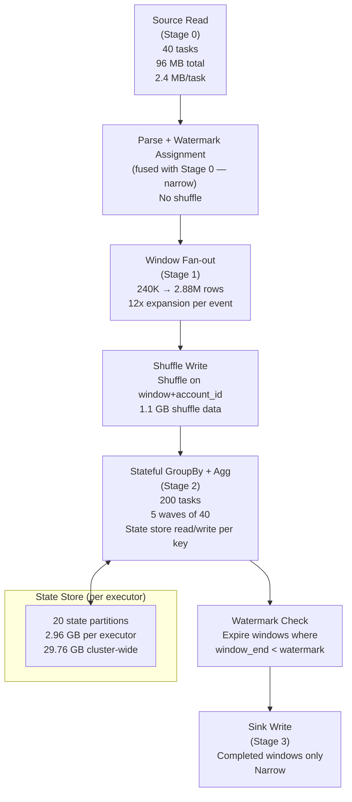

# Scenario 11 — Structured Streaming Micro-Batch: Event Processing with Stateful Aggregations

**Domain:** Real-time payment fraud detection — running aggregations per account over sliding windows  
**Difficulty:** Complex  
**Primary Concepts:** Micro-batch execution model, trigger interval math, tasks per batch, state store size growth, watermark lag, throughput calculation, state store memory pressure, checkpoint overhead

---

## Cluster Specification

| Component | Count | Cores | RAM | Role |
|---|---|---|---|---|
| Executor nodes | 10 | 4 cores each | 24 GB each | Stream processing + state store |
| Driver | 1 | 8 cores | 32 GB | State store metadata, micro-batch scheduling |

```
Total executor cores  = 10 nodes x 4 cores = 40 cores
Total executor memory = 10 nodes x 24 GB   = 240 GB

spark.sql.shuffle.partitions        = 200 (default)
spark.streaming.backpressure.enabled = true (recommended)
Trigger: ProcessingTime("30 seconds")
```

---

## Data Characteristics

| Property | Value |
|---|---|
| Average ingest rate | 8,000 payment events / second |
| Peak ingest rate | 25,000 payment events / second |
| Event size | 400 bytes |
| Trigger interval | 30 seconds |
| Stateful operation | groupBy(account_id).agg(count(), sum(amount)) |
| Window type | Sliding window: 1-hour duration, 5-minute slide |
| Watermark | 2 minutes late-arrival tolerance |
| Active distinct accounts | 20 million in any 1-hour window |
| State key | account_id (64-bit integer: 8 bytes) |

**Derived batch volumes:**

```
Average events per micro-batch  = 8,000 events/sec x 30 sec   = 240,000 events
Average data per micro-batch    = 240,000 events x 400 bytes  = 96,000,000 bytes
                                = 96 MB per batch

Peak events per micro-batch     = 25,000 events/sec x 30 sec  = 750,000 events
Peak data per micro-batch       = 750,000 x 400 bytes         = 300,000,000 bytes
                                = 300 MB per batch
```

**Sliding window multiplier:**

```
Window duration = 60 minutes
Slide interval  = 5 minutes
Simultaneous active windows = 60 min / 5 min = 12 windows maintained per account
```

Every new 5-minute slide adds one window and closes one. At steady state, each account carries state for exactly 12 overlapping windows.

---

## Transformation Chain

Each micro-batch executes the following logical stages:

| Step | Operation | Type | Stage Boundary |
|---|---|---|---|
| 1 | Read from source (Kafka or equivalent) | Source read (narrow) | — |
| 2 | Parse event bytes, extract account_id + amount + event_time | Narrow (map/filter) | — |
| 3 | Watermark assignment: withWatermark("event_time", "2 minutes") | Narrow | — |
| 4 | groupBy(window("event_time", "1 hour", "5 minutes"), account_id) | **Wide** — shuffle on (window, account_id) | Stage boundary |
| 5 | .agg(count(), sum(amount)) — stateful aggregation with state store read/write | **Wide** — stateful, state store I/O per key | Stage boundary |
| 6 | Sink write (output completed windows) | Narrow | — |

The groupBy + sliding window expansion is the critical wide transformation. Each incoming event fans out to all windows it falls into. With a 1-hour window and 5-minute slide, one event joins up to 12 window buckets simultaneously, multiplying shuffle volume.

**Effective records after window fan-out:**

```
Average events entering shuffle = 240,000 events x 12 windows = 2,880,000 logical rows per batch
Shuffle data volume              = 2,880,000 rows x 400 bytes   = 1,152,000,000 bytes ≈ 1.1 GB per batch
```

---

## Pre-Execution Sizing Math

### Input Partition Count

The raw source delivers 96 MB per batch at average load. With default Kafka topic partitioning:

```
Read Stage Tasks = Number of source partitions (1 task per partition)

If source has 1 partition (naive):
    Tasks = 1   → all 40 cores sit idle during source read
    Parallelism utilization = 1 / 40 = 2.5%  ← pathological
```

Correct fix: set minimum source partitions to match total executor cores.

```
Recommended minPartitionNum  = total executor cores = 40
Read stage tasks (corrected) = 40
Data per read task            = 96 MB / 40 = 2.4 MB per task   (well within memory)
```

### Shuffle Partition Count

```
Shuffle stage tasks = spark.sql.shuffle.partitions = 200
Total executor cores = 40

Waves required = ceil(200 / 40) = ceil(5.0) = 5 waves
Tasks per wave = 40 (full cluster utilization across all 5 waves)
```

### State Store Memory per Executor

**State per account per window:**

```
count field  =  8 bytes (Long)
sum field    =  8 bytes (Double)
account_id   =  8 bytes (Long key)
state overhead (RocksDB row header, pointers, index) ≈ 100 bytes
─────────────────────────────────────────────────────
State per account per window = 8 + 8 + 8 + 100 = 124 bytes
```

**Sliding window multiplication:**

```
State per account (all 12 windows) = 124 bytes x 12 windows = 1,488 bytes per account
```

**Total state store size (cluster-wide):**

```
Total state = 20,000,000 accounts x 1,488 bytes/account
            = 29,760,000,000 bytes
            = 29.76 GB distributed across all state store partitions
```

**State partitioned across shuffle partitions:**

```
State store partitions = spark.sql.shuffle.partitions = 200
State per store partition = 29.76 GB / 200 = 0.1488 GB = 148.8 MB per partition
```

**State partitions assigned to each executor:**

```
State partitions per executor = 200 partitions / 10 executors = 20 partitions per executor
State memory required per executor = 20 x 148.8 MB = 2,976 MB ≈ 2.96 GB per executor
```

This 2.96 GB figure is a steady-state floor. It grows each batch as new accounts enter the active window set and decays only after the watermark advances past a window's close time.

---

## DAG Structure



**Stage boundary summary:**

| Stage | Boundary Trigger | Tasks | Shuffle Write | Shuffle Read |
|---|---|---|---|---|
| Stage 0: Source Read + Parse | — | 40 | 1.1 GB (fan-out) | — |
| Stage 1: Shuffle Exchange | Wide: groupBy(window, account_id) | 200 | — | 1.1 GB |
| Stage 2: Stateful Agg | State store I/O | 200 | Delta checkpoint | — |
| Stage 3: Sink Write | — | 200 (output only) | — | — |

---

## Stage-by-Stage Execution Trace

### Stage 0: Source Read + Parse + Watermark Assignment

```
Tasks         = 40 (matching total executor cores via minPartitionNum)
Parallelism   = 40 tasks / 40 cores = 1 wave (100% utilization)
Data per task = 96 MB / 40 = 2.4 MB
CPU work      = deserialize event bytes, extract fields, assign event_time watermark
Output        = 240,000 rows × 12 window slots = 2,880,000 logical output rows
Shuffle write = 2,880,000 rows x 400 bytes = 1,152 MB ≈ 1.1 GB

Key concern: window fan-out here is 12x. Each event is replicated into 12
window buckets before shuffle. Shuffle write volume = 12 × ingest volume.
```

### Stage 1 / Stage 2: Stateful Aggregation (Shuffle + State Store)

```
Shuffle stage tasks = 200
Waves               = ceil(200 / 40) = 5 waves
Tasks per wave      = 40

Shuffle read per task = 1,152 MB / 200 = 5.76 MB per task (modest)
Shuffle read total    = 1,152 MB

Per task work:
  1. Read shuffle data (5.76 MB)
  2. For each (window, account_id) key in task's partition:
       a. Load current state from RocksDB state store
       b. Update count += 1, sum += amount
       c. Write updated state back to RocksDB
  3. Emit completed windows (those where window_end < watermark)

State store I/O per task:
  Keys per shuffle task = 2,880,000 rows / 200 tasks = 14,400 state reads/writes per task
  State ops = 14,400 reads + 14,400 writes = 28,800 state store ops per task
```

**State store access latency impact:**

```
RocksDB (on-disk state store):
  Warm read (in block cache): ~1–5 μs
  Cold read (disk): ~100–500 μs
  Write (WAL + memtable): ~5–20 μs

Assuming 80% cache hit rate:
  Effective read latency per key = 0.8 × 2 μs + 0.2 × 200 μs = 1.6 + 40 = 41.6 μs
  Total read time per task       = 14,400 × 41.6 μs = 599,040 μs ≈ 0.6 seconds
  Total write time per task      = 14,400 × 10 μs   = 144,000 μs ≈ 0.14 seconds
  State I/O time per task        ≈ 0.74 seconds per task
```

### Watermark Evaluation and Window Expiry

```
Watermark formula:
  Global Watermark = min(max_event_time per partition) − 2 minutes

At steady state with average load:
  max_event_time ≈ current_wall_clock − 0 to 30 sec (events are near-real-time)
  Watermark ≈ current_wall_clock − 30 sec (trigger lag) − 2 min (tolerance)
            ≈ current_wall_clock − 2.5 minutes

Window closed and emitted when:
  window_end ≤ Global Watermark

For a window that opened at T:
  Window closes at T + 60 minutes (window duration)
  Window emitted to sink when: T + 60 min ≤ current_wall_clock − 2.5 min
  → Windows are emitted approximately 62.5 minutes after they open
```

### Stage 3: Sink Write

```
Output events = only completed windows emitted this batch
At steady state: 1 window completes every 5 minutes (slide interval)
Per 30-second batch: 30 sec / 300 sec per slide = 0.1 windows close per batch
→ Most batches write 0 sink records; every 10th batch writes 1 complete window

When a window closes: 20M accounts × (count, sum) output
Output records per window close = 20,000,000 rows
Output volume                   = 20,000,000 × (8 + 8 + 8 + 8) bytes ≈ 640 MB per output event
```

---

## Memory Budget Analysis

### Per-Executor Memory Breakdown

```
spark.executor.memory              = 24 GB = 24,576 MB
spark.executor.memoryOverhead      = max(384 MB, 0.1 × 24,576 MB) = 2,457 MB
                                     (off-heap: JVM overhead, Python worker, OS buffers)

On-heap usable memory              = 24,576 MB − 300 MB (reserved system) = 24,276 MB
Unified Memory Pool                = 24,276 MB × 0.6  (spark.memory.fraction)
                                   = 14,565.6 MB ≈ 14,566 MB
Storage Memory Region              = 14,566 MB × 0.5  (spark.memory.storageFraction)
                                   = 7,283 MB
Execution Memory Region            = 14,566 MB × 0.5
                                   = 7,283 MB

User Memory (non-managed)          = 24,276 MB − 14,566 MB = 9,710 MB
```

### State Store Memory vs. Available Storage

```
State memory required per executor = 2.96 GB = 3,031 MB
Available Storage Memory           = 7,283 MB

State fits in Storage Memory:
  3,031 MB < 7,283 MB  ✓  (41.6% of storage budget consumed)

Remaining storage for RDD/broadcast cache = 7,283 − 3,031 = 4,252 MB per executor
```

### Memory Per Task (Execution Region)

```
Cores per executor = 4 (maximum 4 concurrent tasks per executor)
Execution memory per task = 7,283 MB / 4 = 1,820 MB per task

Each task's shuffle read = 5.76 MB — well within 1,820 MB execution budget
No spill expected for average load.
```

### Peak Load Memory Pressure

```
Peak events per batch    = 25,000 × 30 = 750,000 events
Peak shuffle write       = 750,000 × 12 windows × 400 bytes = 3,600 MB ≈ 3.5 GB
Peak shuffle read/task   = 3,600 MB / 200 tasks = 18 MB per task

18 MB < 1,820 MB execution memory per task  ✓  (still no spill at peak)

However, state store growth at peak:
  New accounts per batch (worst case) = 750,000 unique accounts (new entrants)
  New state footprint = 750,000 × 1,488 bytes = 1,116 MB added per batch

If this growth rate persists over multiple batches without watermark advancement:
  State grows by up to 1.1 GB per 30-second batch
  After 10 batches (5 minutes): 11.16 GB additional state
  After 30 batches (15 minutes): 33.5 GB additional state → exceeds 7.28 GB storage budget
  OOM risk if watermark stalls (see Bottleneck Identification)
```

---

## Parallelism and Wave Analysis

### Stage 0: Source Read

```
Total cores     = 40
Tasks           = 40
Waves           = 1
Utilization     = 40 / 40 = 100%
Duration        = read 96 MB at ~500 MB/s per executor network = ~0.2 seconds
```

### Stage 2: Stateful Aggregation

```
Total cores  = 40
Tasks        = 200
Waves        = 200 / 40 = 5.0 (exactly 5 full waves)
Utilization  = 40 / 40 = 100% per wave (no partial wave waste)

Per-wave duration (dominated by state I/O):
  State I/O time     ≈ 0.74 seconds per task (calculated above)
  Shuffle read time  = 5.76 MB / 200 MB/s local disk = 0.029 seconds per task
  Compute time       ≈ 0.05 seconds per task
  ──────────────────────────────────────────────
  Estimated per-task = 0.74 + 0.03 + 0.05 = 0.82 seconds per task

Total Stage 2 duration = 5 waves × 0.82 seconds = 4.1 seconds

Total estimated batch processing time:
  Stage 0 (read + parse)          = 0.2 sec
  Shuffle exchange                = ~0.5 sec (network + serialization for 1.1 GB)
  Stage 2 (stateful agg)          = 4.1 sec
  Checkpoint write (delta)        = 1.79 sec (see below)
  Overhead (scheduling, GC)       = ~1.0 sec
  ────────────────────────────────────────────
  Estimated total batch time      ≈ 7.6 seconds

Trigger budget = 30 seconds
Utilization of trigger budget     = 7.6 / 30 = 25.3%   ← healthy headroom at average load
```

### Peak Load Wave Analysis

```
Peak tasks input = 750,000 events × 12 windows = 9,000,000 logical rows
Peak shuffle volume = 3,600 MB → 3,600 / 200 = 18 MB per task (vs 5.76 MB avg)

State I/O at peak: same number of keys (state partitions don't change)
  Keys per task = 14,400 (same — state keyed by account, not event count)
  State I/O time = 0.74 seconds (unchanged)

Peak per-task time:
  Shuffle read: 18 MB / 200 MB/s = 0.09 sec
  State I/O: 0.74 sec
  Compute: 0.08 sec (more rows per key)
  Peak per-task ≈ 0.91 seconds

Peak Stage 2 duration = 5 waves × 0.91 = 4.55 seconds

Peak checkpoint delta:
  750,000 unique accounts × 1,488 bytes = 1,116 MB = 1.09 GB delta
  At 200 MB/s write: 1,116 / 200 = 5.58 seconds

Peak total batch time:
  Stage 0             = 0.3 sec
  Shuffle             = 1.5 sec (3.6 GB at ~2.4 GB/s aggregate)
  Stage 2             = 4.55 sec
  Checkpoint write    = 5.58 sec
  Overhead            = 1.5 sec
  ──────────────────────────────
  Peak batch time     ≈ 13.4 seconds

Still within 30-second trigger budget:  13.4 / 30 = 44.7%  ✓
Sustained headroom exists, but checkpoint I/O is now the single largest cost at peak.
```

---

## Checkpoint Overhead Analysis

State store checkpointing is mandatory for fault tolerance. Every batch writes a delta snapshot of changed state to durable object storage.

### Average Batch Checkpoint

```
Events per batch                 = 240,000
Assumed unique accounts touched  = 240,000 (upper bound: each event from different account)
Delta state written              = 240,000 accounts × 1,488 bytes/account
                                 = 357,120,000 bytes = 357 MB

Object storage write bandwidth   = 200 MB/s (conservative single-stream estimate)
Checkpoint write time            = 357 MB / 200 MB/s = 1.785 seconds ≈ 1.79 seconds

Checkpoint as fraction of budget = 1.79 / 30 = 5.97%  (acceptable)
```

### Full Checkpoint (Periodic)

```
Spark Structured Streaming also writes periodic full snapshots (default: every 10 batches).
Full checkpoint = 29.76 GB total state

Full checkpoint write time = 29,760 MB / 200 MB/s = 148.8 seconds

This EXCEEDS the 30-second trigger interval by 4.96x.

Implication: Full checkpoint batches will be delayed. The next batch cannot start
until the checkpoint completes (checkpoint is synchronous on the critical path).
Batch latency spike every 10 batches = 148.8 seconds per affected batch.

Fix: Use incremental checkpointing (RocksDB state store with changelog),
which writes only WAL deltas (~357 MB) every batch regardless.
With RocksDB incremental checkpointing, no full-snapshot batches occur.
```

### Minimum End-to-End Event Latency

```
Min Latency ≥ (Batch Interval / 2) + Batch Processing Time

Avg case: (30 / 2) + 7.6  = 15 + 7.6  = 22.6 seconds min latency
Peak case: (30 / 2) + 13.4 = 15 + 13.4 = 28.4 seconds min latency

The 15-second average wait (half the trigger interval) is inherent to micro-batch
and cannot be removed without switching to Continuous Processing mode.
```

---

## Watermark Lag Analysis

### Normal Operation

```
Watermark formula:
  Global Watermark = min(max_event_time per partition) − 2 minutes

At 30-second trigger with 2-minute watermark:
  Expected watermark lag = trigger_interval + watermark_tolerance
                         = 30 sec + 120 sec = 150 seconds ≈ 2.5 minutes

Alert threshold = 2× to 3× late_arrival_threshold
  Alert at: 2 × 120 sec = 240 seconds = 4 minutes lag
  Critical: 3 × 120 sec = 360 seconds = 6 minutes lag
```

### Stalled Partition Scenario

```
If one of the 40 source partitions stalls (no new events):
  max_event_time for that partition = frozen at last seen event
  Global Watermark = min(all partitions) − 2 min = frozen partition's time − 2 min

Impact:
  1. Watermark stops advancing
  2. No windows are finalized — sink writes stop
  3. State store cannot expire old windows
  4. State grows unbounded at:
     240,000 new events/batch × 1,488 bytes = 357 MB new state per 30-second batch
     After 30 minutes (60 batches): 357 MB × 60 = 21.4 GB additional state
     Added to baseline 29.76 GB = 51.2 GB — exceeds cluster storage budget of 72.8 GB (10 × 7.28)

At approximately 72 minutes of stall: cluster OOM risk materializes.
```

### Small File Problem

```
Sink partitions = spark.sql.shuffle.partitions = 200
Files/day = (3,600 sec / 30 sec) × 24 hours × 200 partitions
          = 120 batches/hour × 24 × 200
          = 576,000 files/day

Most of these files are near-empty (windows close infrequently).
Average file size ≈ 640 MB (one window close) / 200 partitions = 3.2 MB per file
                   vs. ideal Parquet size of 128 MB
                   = 40× excess file count for output partition sink

Mitigation: Compact output by repartitioning to 5–10 partitions before sink write,
or use trigger(availableNow=True) for batch compaction jobs.
```

---

## Bottleneck Identification

### Primary Bottleneck: Full Checkpoint Write Latency

```
Full checkpoint (periodic, every 10 batches): 29.76 GB at 200 MB/s = 148.8 seconds
Trigger budget: 30 seconds

Severity: CRITICAL — full checkpoints cause batch processing to stall for 5× the trigger interval.
Fix: Enable RocksDB incremental checkpointing (changelog mode).
     Reduces every checkpoint to delta only: 357 MB → 1.79 seconds.
```

### Secondary Bottleneck: State Store Cold Reads

```
State per partition = 148.8 MB
RocksDB block cache per partition ≈ 50–100 MB (typical default)
Cache hit rate depends on key locality and recency

If cache miss rate rises from 20% to 50% (cold start or rebalance):
  Effective read latency = 0.5 × 200 μs + 0.5 × 2 μs = 101 μs per key
  State I/O per task     = 14,400 × 101 μs = 1,454,400 μs ≈ 1.45 seconds
  Stage 2 duration       = 5 × 1.45 = 7.25 seconds (vs 4.1 seconds warm)
  Total batch time       ≈ 10.75 seconds (vs 7.6 seconds warm)

Still within budget, but significant regression. Occurs after executor restart,
rebalance, or first-batch cold start.
```

### Tertiary Bottleneck: Watermark Stall from Slow Partition

```
One stalled source partition freezes global watermark.
State grows unbounded (357 MB per batch).
OOM risk at ~72 minutes of stall on this cluster configuration.
Fix: Monitor per-partition max event time; alert if any partition lags by > 3× watermark.
```

### Non-Bottleneck: Shuffle Volume

```
Average shuffle: 1.1 GB across 40 cores = 27.5 MB per core
Peak shuffle: 3.6 GB across 40 cores = 90 MB per core
Both are well within execution memory limits (1,820 MB per task).
No shuffle spill expected under any load scenario with this cluster.
```

---

## Optimizer Decisions

### AQE Impact on Streaming

```
AQE is active between micro-batch stages but does not optimize across batches.
Within a single batch:

  AQE coalesces shuffle partitions:
    Average shuffle data = 1.1 GB
    advisoryPartitionSizeInBytes = 64 MB (default)
    Estimated post-coalesce partitions = ceil(1,100 MB / 64 MB) = ceil(17.2) = 18 partitions
    AQE would coalesce 200 → 18 partitions for the aggregation stage

  BUT: Stateful streaming DISABLES AQE partition coalescing for stateful stages.
  Reason: State store partitions are keyed by (window, account_id) hash % shuffle.partitions.
  If AQE reduces partitions from 200 to 18, the state store partition mapping breaks.
  Spark disables coalescing when StateStoreSaveExec is in the plan.

  Result: All 200 shuffle partitions are preserved for stateful aggregation regardless of AQE.
  This is intentional and correct — partition count stability is required for state continuity.
```

### Broadcast Join Threshold

```
No joins in this query plan. Broadcast threshold not applicable.
```

### Skew Detection

```
AQE skew detection is also disabled for stateful stages (same reason as coalescing).
If a single account_id generates extreme event volume (hot key), that state partition
will be overloaded. Detection must be done externally:

  Identify skew: compare task durations in Stage 2 across waves.
  Skew signal: one task takes 3× median duration.
  Root cause: one account_id contributes disproportionate events.
  Fix: salting is not feasible for stateful aggregation (breaks state key lookup).
  Fix: Application-level deduplication or rate limiting per account upstream.
```

---

## Key Numbers Summary

| Metric | Value | Basis |
|---|---|---|
| Events per avg batch | 240,000 | 8,000/sec × 30 sec |
| Events per peak batch | 750,000 | 25,000/sec × 30 sec |
| Data per avg batch | 96 MB | 240,000 × 400 bytes |
| Data per peak batch | 300 MB | 750,000 × 400 bytes |
| Shuffle data per avg batch | 1,100 MB | 96 MB × 12 window fan-out |
| Shuffle data per peak batch | 3,600 MB | 300 MB × 12 window fan-out |
| Active windows per account | 12 | 60 min / 5 min slide |
| State per account | 1,488 bytes | 12 × 124 bytes/window |
| Total cluster state | 29.76 GB | 20M accounts × 1,488 bytes |
| State per executor | 2.96 GB | 20 partitions × 148.8 MB |
| State store partitions | 200 | = spark.sql.shuffle.partitions |
| Available storage memory/executor | 7,283 MB | (24,276 × 0.6 × 0.5) |
| State vs storage budget | 40.6% | 2,960 MB / 7,283 MB |
| Execution memory per task | 1,820 MB | 7,283 MB / 4 cores |
| Read stage tasks | 40 | = total executor cores (corrected) |
| Shuffle stage tasks | 200 | spark.sql.shuffle.partitions |
| Shuffle waves | 5 | 200 / 40 |
| Avg batch processing time | ~7.6 sec | Stages 0+1+2+checkpoint |
| Peak batch processing time | ~13.4 sec | Stages 0+1+2+checkpoint |
| Trigger budget headroom (avg) | 74.7% | (30 − 7.6) / 30 |
| Trigger budget headroom (peak) | 55.3% | (30 − 13.4) / 30 |
| Min event latency (avg) | 22.6 sec | 15 sec wait + 7.6 sec processing |
| Min event latency (peak) | 28.4 sec | 15 sec wait + 13.4 sec processing |
| Delta checkpoint per avg batch | 357 MB | 240K accounts × 1,488 bytes |
| Delta checkpoint per peak batch | 1,116 MB | 750K accounts × 1,488 bytes |
| Delta checkpoint time (avg) | 1.79 sec | 357 MB / 200 MB/s |
| Delta checkpoint time (peak) | 5.58 sec | 1,116 MB / 200 MB/s |
| Full checkpoint time | 148.8 sec | 29,760 MB / 200 MB/s |
| Full checkpoint budget overrun | 4.96× | 148.8 / 30 |
| Files/day (sink output) | 576,000 | (3600/30) × 24 × 200 |
| Watermark normal lag | ~2.5 min | 30 sec trigger + 2 min tolerance |
| Watermark alert threshold | 4 min | 2× late arrival threshold |
| OOM risk at stall duration | ~72 min | state growth until 72.8 GB budget exhausted |
| AQE coalescing on stateful stage | Disabled | State key mapping requires stable partition count |

---

## Interview Takeaways

**1. Sliding windows multiply shuffle volume by (window_duration / slide_interval), not just 1×.**
A naive assumption is that shuffle volume equals ingest volume. With a 1-hour window on a 5-minute slide, each event fans out into 12 window buckets before the shuffle. The 96 MB ingest batch becomes 1.1 GB of shuffle data — a 12× amplification that dominates network and serialization cost. Always compute: shuffle volume = ingest volume × (window_duration / slide_interval).

**2. Full checkpoint write time can dwarf batch processing time; incremental checkpointing is non-optional at scale.**
The math is unambiguous: 29.76 GB of state at 200 MB/s = 148.8 seconds, nearly 5× the 30-second trigger budget. Without RocksDB incremental checkpointing (changelog mode), every 10th batch stalls for 2.5 minutes, destroying latency SLAs. This is not a configuration tweak — it is a fundamental prerequisite for production stateful streaming at this scale.

**3. A single stalled source partition freezes the entire pipeline's watermark, triggering unbounded state growth.**
The global watermark is the minimum across all source partitions. If any one partition stops receiving events, the watermark freezes. State from all active windows can no longer expire. On this cluster, state grows by 357 MB per 30-second batch when stalled, and the total storage budget (72.8 GB) is exhausted in approximately 72 minutes — long enough to miss in manual monitoring but fast enough to cause a production outage during a weekend on-call rotation.

**4. AQE partition coalescing is intentionally disabled for stateful streaming stages, so spark.sql.shuffle.partitions directly governs state parallelism.**
AQE would coalesce 200 shuffle partitions to ~18 based on 1.1 GB shuffle data and 64 MB advisory size. But the state store keys are hashed modulo the fixed partition count. AQE coalescing would corrupt state key routing, so Spark disables it for any stage containing StateStoreSaveExec. This means the correct way to tune stateful streaming parallelism is to set spark.sql.shuffle.partitions = 2–4× total executor cores at query start, not rely on AQE to correct an initial over-partition.

**5. Micro-batch latency has an irreducible floor of half the trigger interval, independent of processing speed.**
The minimum end-to-end latency formula — (trigger_interval / 2) + batch_processing_time — shows that a 30-second trigger means events wait on average 15 seconds just to be collected into a batch, before any processing begins. Even if Stage 0 through Stage 3 complete in 1 millisecond, latency cannot drop below 15 seconds. For payment fraud detection requiring sub-second response, Continuous Processing mode (microsecond checkpointing at higher overhead) or a different architecture is required.
