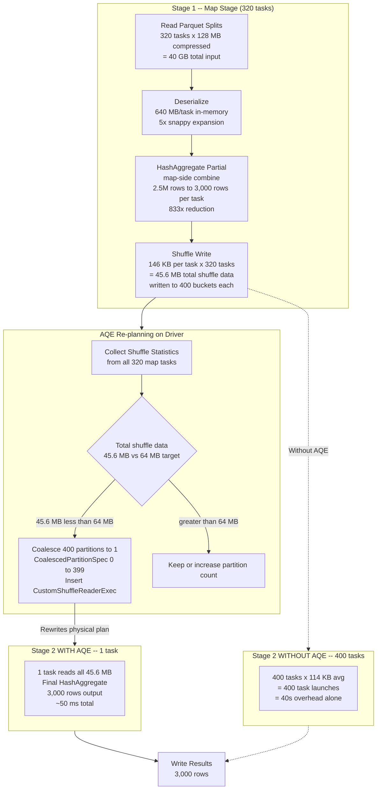

# Scenario 12 — AQE in Action: Dynamic Partition Coalescing + Runtime Statistics

**Domain:** Log analytics — aggregating application logs, highly variable data distribution
**Difficulty:** Pathological
**Primary Concepts:** AQE coalescing algorithm, targetPostShuffleInputSize, initial vs final partition counts, empty partition elimination, runtime statistics vs compile-time estimates, CBO vs AQE, how AQE changes the execution plan mid-query

---

## Cluster Specification

| Resource | Value |
|---|---|
| Executor nodes | 20 |
| Cores per executor | 4 |
| RAM per executor | 16 GB |
| Total executor cores | 20 x 4 = 80 cores |
| Total executor RAM | 20 x 16 GB = 320 GB |
| Driver cores | 8 |
| Driver RAM | 32 GB |
| AQE planner runs on | Driver (not executors) |

The driver hosts the AQE re-planning logic. Every time a shuffle map stage completes, the driver collects shuffle write statistics and may rewrite the downstream physical plan before the reduce stage begins.

---

## Data Characteristics

| Property | Value |
|---|---|
| Dataset | Application logs |
| Compressed size (snappy parquet) | 40 GB |
| Estimated in-memory size | ~200 GB (5x expansion typical for snappy parquet on log data) |
| Row count | 800 million rows |
| Columns used | service_name, error_code, timestamp |
| Distinct (service_name, error_code) combinations | 3,000 |
| Operation | GroupBy(service_name, error_code).agg(count(), max(timestamp)) |
| spark.sql.shuffle.partitions | 400 (pre-AQE default) |
| AQE enabled | true |
| advisoryPartitionSizeInBytes (targetPostShuffleInputSize) | 64 MB |

The key data characteristic driving this scenario is extreme cardinality reduction: 800 million input rows collapse to exactly 3,000 output rows after aggregation. This ratio (800M / 3,000 = ~266,667x reduction) is what makes the AQE coalescing decision so dramatic.

---

## Transformation Chain

```
[1] Read parquet files (narrow)
        |
        v
[2] Partial aggregation / map-side combine (narrow -- runs in same stage as read)
        |
        v
[3] *** SHUFFLE BOUNDARY -- Stage 1 writes shuffle files ***
        |
        v
[4] Final aggregation (wide -- requires shuffle read, runs in Stage 2)
        |
        v
[5] Write results (narrow)
```

**Operation labels:**

| Step | Type | Description |
|---|---|---|
| Read parquet | Narrow | File splits to tasks, no shuffle |
| Partial agg (map-side combine) | Narrow | Reduces rows within each partition before shuffle |
| Shuffle write | Wide boundary | Each task writes 400 shuffle files (one per reduce partition) |
| Final agg (shuffle read) | Wide | Reads from shuffle files, computes final count/max |

The partial aggregation step is critical. Because GroupBy+agg is a full aggregation (not distinct count), Spark applies a map-side combine that reduces each partition's data to at most 3,000 rows before the shuffle. This happens automatically at the HashAggregate node in the physical plan.

---

## Pre-Execution Sizing Math

### Input Partition Count

Spark reads parquet files by splitting them at the parquet block (row group) level. The compressed size governs split boundaries:

```
spark.sql.files.maxPartitionBytes = 128 MB (default)

Input partitions = ceil(40 GB compressed / 128 MB per partition)
                 = ceil(40 x 1024 MB / 128 MB)
                 = ceil(40,960 / 128)
                 = ceil(320)
                 = 320 partitions (tasks in Stage 1)
```

Note: Some sources round to 313 depending on actual file boundary alignment. Using 320 as the clean derivation from defaults. Each task reads: 40,960 MB / 320 = 128 MB compressed, which decompresses to ~640 MB in-memory per task (5x expansion).

### Rows Per Stage 1 Task

```
Total rows = 800,000,000
Stage 1 tasks = 320
Rows per task = 800,000,000 / 320 = 2,500,000 rows per task
```

### Effect of Partial Aggregation

Each task holds up to 3,000 distinct (service_name, error_code) combinations. After the map-side HashAggregate:

```
Rows per task after partial agg = min(distinct_keys, rows_per_task)
                                 = min(3,000, 2,500,000)
                                 = 3,000 rows per task

Reduction ratio per task = 2,500,000 / 3,000 = 833x reduction
```

Every single task, regardless of which slice of data it processes, produces at most 3,000 output rows. The partial aggregation is maximally effective here.

### Shuffle Write Volume

Each row after partial aggregation carries: service_name (~20 bytes) + error_code (~10 bytes) + partial count (8 bytes long) + partial max timestamp (8 bytes long) + row overhead (~14 bytes) = ~60 bytes per row. Using ~50 bytes as a round estimate for compressed shuffle bytes:

```
Shuffle write per task = 3,000 rows x 50 bytes/row = 150,000 bytes = ~146 KB per task

Total shuffle write = 320 tasks x 146 KB/task
                    = 320 x 146 KB
                    = 46,720 KB
                    = ~45.6 MB total shuffle data
```

This is the critical number: ~46 MB of total shuffle data for 800 million input rows.

The 5x decompression expansion and 640 MB in-memory size per task are irrelevant to shuffle sizing because the partial aggregation reduces the shuffle payload to almost nothing before any data crosses the network.

### Pre-AQE Shuffle Read (Without Coalescing)

Before AQE intervenes, Spark would create 400 reduce tasks (spark.sql.shuffle.partitions = 400):

```
Average data per reduce partition = 45.6 MB / 400 partitions
                                  = 114 KB per partition

Number of partitions receiving zero data = highly likely
  (3,000 distinct keys hashed across 400 buckets: most buckets get ~7.5 keys,
   some get 0 keys due to hash distribution)
```

Most reduce partitions receive between 0 KB and a few hundred KB. Zero partitions exist because 3,000 keys into 400 buckets is sparse but not entirely empty -- but many will have single-digit KB payloads.

### AQE Coalescing Decision

AQE collects shuffle write statistics after Stage 1 completes. It observes:

```
Total shuffle data = 45.6 MB
advisoryPartitionSizeInBytes = 64 MB

Estimated post-coalesce partitions = ceil(total_shuffle_data / advisoryPartitionSizeInBytes)
                                   = ceil(45.6 MB / 64 MB)
                                   = ceil(0.7125)
                                   = 1 partition
```

AQE decision: coalesce all 400 shuffle partitions into 1 partition.

The greedy left-to-right algorithm processes all 400 partitions and finds that their combined size (45.6 MB) never exceeds the 64 MB target, so all 400 original partition ranges collapse into a single CoalescedPartitionSpec(0, 399).

---

## DAG Structure



---

## Stage-by-Stage Execution Trace

### Stage 1: Read + Partial Aggregation (Map Stage)

**Task count:** 320 tasks
**Cores available:** 80 cores
**Parallelism waves:** ceil(320 / 80) = 4 waves

| Wave | Tasks | Cores Used | Utilization |
|---|---|---|---|
| Wave 1 | 80 tasks | 80/80 | 100% |
| Wave 2 | 80 tasks | 80/80 | 100% |
| Wave 3 | 80 tasks | 80/80 | 100% |
| Wave 4 | 80 tasks | 80/80 | 100% |

**Per-task work:**
```
Read compressed input   : 128 MB (snappy parquet)
Deserialize to memory   : ~640 MB in-memory
Process rows            : 2,500,000 rows
After partial HashAgg   : 3,000 rows
Shuffle write           : 3,000 rows x 50 bytes = 146 KB
Shuffle files written   : 400 files per task (one per downstream partition)
Total shuffle files     : 320 tasks x 400 files = 128,000 shuffle files
```

**Memory pressure per task:**
```
Per-task memory needed  : 640 MB for deserialized data
Available per core      : see Memory Budget Analysis section
HashAgg hash map        : 3,000 keys x ~200 bytes = ~600 KB (trivial)
Spill risk              : HIGH on read side (640 MB input), LOW after partial agg
```

The deserialization of 128 MB compressed to 640 MB in-memory is the memory pressure point, not the aggregation itself. The 3,000-key hash map for the partial aggregation fits in a few megabytes.

**Shuffle write statistics (what AQE will collect):**
```
Total bytes written across all tasks : 320 x 146 KB = 45.6 MB
Per-partition average                : 45.6 MB / 400 = 116 KB
Min partition size                   : ~0 KB (some hash buckets may receive no keys)
Max partition size                   : a few hundred KB (hot service/error combinations)
```

### Stage 2: Final Aggregation -- WITHOUT AQE (Hypothetical Baseline)

**Task count:** 400 tasks (spark.sql.shuffle.partitions default)
**Cores available:** 80 cores
**Parallelism waves:** ceil(400 / 80) = 5 waves

| Wave | Tasks | Data Processed | Useful Work |
|---|---|---|---|
| Wave 1 | 80 tasks | 80 x 116 KB = ~9.1 MB | Trivial aggregation |
| Wave 2 | 80 tasks | 80 x 116 KB = ~9.1 MB | Trivial aggregation |
| Wave 3 | 80 tasks | 80 x 116 KB = ~9.1 MB | Trivial aggregation |
| Wave 4 | 80 tasks | 80 x 116 KB = ~9.1 MB | Trivial aggregation |
| Wave 5 | 80 tasks | 80 x 116 KB = ~9.1 MB | Trivial aggregation |

**Per-task overhead analysis:**
```
Task launch overhead    : ~100 ms per task (JVM task deserialization, scheduler overhead)
Total 400 tasks         : 400 x 100 ms = 40,000 ms = 40 seconds of overhead alone
Actual work per task    : 116 KB at memory speed = ~1 ms
Total actual compute    : 400 x 1 ms = 400 ms = 0.4 seconds
Overhead / Compute ratio: 40 seconds / 0.4 seconds = 100:1 waste ratio
```

This is pathological over-partitioning. 99% of Stage 2 wall-clock time would be scheduler and task launch overhead, not actual computation.

### Stage 2: Final Aggregation -- WITH AQE (Actual Execution)

**Task count:** 1 task (AQE coalesced all 400 partitions)
**Cores used:** 1 of 80 available (1.25% utilization)
**Parallelism waves:** 1 wave

```
Task reads              : 45.6 MB (all shuffle data)
Task produces           : 3,000 final rows (count + max per key combination)
Task duration estimate  : 45.6 MB / memory bandwidth (~10 GB/s) + aggregation
                        = 4.56 ms network read + few ms compute = ~10-50 ms total
```

**Why 1.25% utilization is acceptable here:**

```
Total data processed by Stage 2 = 45.6 MB
Time to process 45.6 MB on 1 core = ~50 ms (generous upper bound)
Time to process 45.6 MB on 80 cores (parallel) = 50 ms / 80 = ~0.625 ms

Marginal gain from parallelism = 50 ms - 0.625 ms = ~49 ms
Task launch overhead for 80 tasks = 80 x 100 ms = 8,000 ms

Parallelism is net negative for data of this size.
1 task is correct.
```

The low utilization in the final stage is the right answer, not a problem. The job spends 99%+ of its time in Stage 1 (the compute-heavy map stage), which runs at 100% core utilization for all 4 waves.

---

## Memory Budget Analysis

### Executor Memory Breakdown

```
spark.executor.memory                 = 16 GB = 16,384 MB
JVM reserved memory (fixed)           = 300 MB
On-heap usable                        = 16,384 - 300 = 16,084 MB

spark.memory.fraction                 = 0.6 (default)
Unified Memory Pool                   = 16,084 x 0.6 = 9,650 MB

spark.memory.storageFraction          = 0.5 (default, within unified pool)
Storage Region (initial)              = 9,650 x 0.5 = 4,825 MB
Execution Region (initial)            = 9,650 x 0.5 = 4,825 MB

User Memory (off unified pool)        = 16,084 x 0.4 = 6,434 MB
  (used for UDFs, RDD operations, broadcast vars)

spark.executor.memoryOverhead         = max(0.1 x 16 GB, 384 MB) = 1,638 MB
  (off-heap, OS, native threads -- not available to JVM)

Total executor RAM = 16 GB on-heap + 1.638 GB overhead = within 16 GB node RAM
```

### Memory Per Core (Per Task)

```
Executor cores                        = 4
Execution memory per core             = 4,825 MB / 4 = 1,206 MB per task

(Execution can borrow from Storage if Storage region is not fully used,
 up to the full Unified Pool = 9,650 MB / 4 = 2,412 MB per task in best case)
```

### Stage 1 Memory Pressure Analysis

```
Per-task in-memory data = 640 MB (128 MB compressed x 5x snappy expansion)
Execution memory available = 1,206 MB (base) to 2,412 MB (borrowing from storage)

640 MB < 1,206 MB -> NO SPILL in normal operation

Margin = 1,206 - 640 = 566 MB headroom
```

This is sufficient. However, if another task on the same executor has already claimed execution memory, contention could force spill. With 4 tasks per executor running simultaneously:

```
Total in-memory load per executor = 4 x 640 MB = 2,560 MB
Total unified memory pool          = 9,650 MB
Load fraction                      = 2,560 / 9,650 = 26.5% of unified pool

Spill threshold crossed?           = NO (2,560 MB << 9,650 MB)
```

Stage 1 runs without spill under normal conditions. The partial aggregation hash map is negligible:

```
HashAgg map per task = 3,000 keys x 200 bytes/key = 600 KB = ~0.6 MB
```

### Stage 2 Memory Pressure (AQE version)

```
Single task reads = 45.6 MB
Execution memory available = up to 9,650 MB (entire executor to itself)
Final HashAgg map = 3,000 keys x 200 bytes = 600 KB

No spill possible. Task finishes in memory entirely.
```

---

## Parallelism and Wave Analysis

### Stage 1

```
Total tasks       = 320
Total cores       = 80
Waves             = ceil(320 / 80) = 4.0 (perfect division)
Tasks per wave    = 80
Utilization       = 80 / 80 = 100%
Wasted slots      = 0 (clean parallelism)
```

### Stage 2 -- Without AQE

```
Total tasks       = 400
Total cores       = 80
Waves             = ceil(400 / 80) = 5
Tasks per wave    = 80 (all 5 waves)
Utilization       = 100% across all 5 waves
BUT: each task does ~116 KB of work
Effective work    = 400 x 116 KB = 45.6 MB across 5 waves
Overhead          = 400 x 100 ms = 40 seconds
Actual compute    = ~0.4 seconds
Overhead ratio    = 40s / 0.4s = 100x
```

### Stage 2 -- With AQE

```
Total tasks       = 1
Total cores       = 80
Waves             = 1
Tasks per wave    = 1
Utilization       = 1 / 80 = 1.25%
Work              = 45.6 MB (same as without AQE)
Duration          = ~50 ms
Overhead          = 1 x 100 ms = 100 ms (trivial)
```

**Net time saved by AQE coalescing:**

```
Without AQE Stage 2 duration = 40,000 ms (overhead) + 400 ms (compute) = ~40,400 ms
With AQE Stage 2 duration    = 100 ms (overhead) + 50 ms (compute) = ~150 ms

Time saved = 40,400 ms - 150 ms = ~40,250 ms = ~40 seconds
Speedup factor = 40,400 / 150 = ~269x for Stage 2 alone
```

---

## Bottleneck Identification

### Primary Bottleneck: Stage 1 Deserialization CPU

**Stage:** 1 (read + partial agg)
**Metric:** Per-task in-memory footprint = 640 MB; 4 tasks per executor decompressing simultaneously
**Why:** 128 MB compressed snappy parquet expands 5x in memory. Four concurrent tasks per executor require 4 x 640 MB = 2,560 MB simultaneously. This is within the unified memory pool (9,650 MB) but leaves 7,090 MB unused -- meaning executor memory is not the bottleneck; CPU decompression throughput is.

At 4 cores per executor, with 4 tasks decompressing snappy parquet simultaneously, CPU becomes the rate-limiting factor in Stage 1. All 4 waves complete at approximately the same speed.

### Secondary Bottleneck (Without AQE): Task Launch Overhead

**Stage:** 2 (without AQE)
**Metric:** 400 tasks x 100 ms launch overhead = 40 seconds
**Why:** The shuffle data (45.6 MB) is so small that task launch overhead dominates by 100:1. The Spark scheduler, task serialization, JVM deserialization on the executor, and final cleanup all consume more time than the actual aggregation work.

This is precisely what AQE coalescing is designed to eliminate.

### Why This Is Pathological

The scenario is pathological because the data size ratio is extreme: 200 GB decompressed input producing 45.6 MB of shuffle data -- a 4,386:1 reduction ratio. The static partition count (spark.sql.shuffle.partitions = 400) was chosen before the job runs, with no knowledge of how effective the partial aggregation would be. CBO (Cost-Based Optimizer) cannot predict the output of HashAggregate without runtime statistics -- it would need accurate distinct count statistics on the composite key (service_name, error_code), which catalog statistics rarely provide for multi-column combinations.

Only AQE, with access to actual shuffle write sizes, can make the correct coalescing decision.

---

## Optimizer Decisions

### CBO vs AQE: What Each Can and Cannot See

**Compile time (CBO can see):**
```
- File sizes and partition counts (from catalog metadata)
- Single-column statistics: min, max, NDV (number of distinct values)
- Table-level row counts (if ANALYZE TABLE has been run)
```

**Compile time (CBO CANNOT accurately predict):**
```
- Multi-column distinct counts: NDV(service_name, error_code) together
- Post-aggregation row counts for composite GroupBy keys
- Actual shuffle data volume after HashAggregate map-side combine
```

CBO would estimate Stage 2 shuffle read based on pre-aggregation row count (800M rows x 50 bytes = ~37 GB), not the post-aggregation size (45.6 MB). This is why static spark.sql.shuffle.partitions = 400 is not unreasonable from the planner's perspective at compile time.

**AQE sees at runtime (after Stage 1 completes):**
```
- Actual bytes written per shuffle partition: min=0 KB, max=~few hundred KB, avg=116 KB
- Total shuffle bytes: 45.6 MB
- Number of non-empty partitions: some subset of 400
- Exact partition size histogram
```

### AQE Coalescing Algorithm Walk-Through

AQE makes a greedy left-to-right pass over the 400 shuffle partitions sorted by partition index (0 through 399):

```
advisoryPartitionSizeInBytes = 64 MB = 65,536 KB
Total data = 45.6 MB = 46,694 KB

Greedy pass:
  Start group at partition 0
  Add partition 1: cumulative = still well under 65,536 KB
  Add partition 2: cumulative = still well under 65,536 KB
  ...
  Add partition 399: cumulative = 46,694 KB < 65,536 KB -> never triggered emit
  End of partitions -> emit single group [0, 399]

Result: CoalescedPartitionSpec(startReducerIndex=0, endReducerIndex=399)
        -> 1 coalesced partition from 400 original partitions
```

The algorithm never found a point where adding the next partition would exceed 64 MB, so the entire shuffle collapses into one read task.

### AQE Physical Plan Transformation

**Before AQE coalescing (compile-time physical plan):**
```
== Physical Plan (Before AQE) ==
HashAggregate(keys=[service_name, error_code], functions=[count(), max(timestamp)])
  +- Exchange hashpartitioning(service_name, error_code, 400)
       +- HashAggregate(keys=[service_name, error_code], functions=[partial count(), partial max(timestamp)])
            +- FileScan parquet [service_name, error_code, timestamp]
```

**After AQE inserts CustomShuffleReaderExec (runtime-modified plan):**
```
== Physical Plan (After AQE) ==
HashAggregate(keys=[service_name, error_code], functions=[count(), max(timestamp)])
  +- CustomShuffleReaderExec(CoalescedPartitionSpec(0, 399))   <- AQE-inserted node
       +- ShuffleQueryStage
            +- Exchange hashpartitioning(service_name, error_code, 400)
                 +- HashAggregate(keys=[service_name, error_code], functions=[partial count(), partial max(timestamp)])
                      +- FileScan parquet [service_name, error_code, timestamp]
```

The `CustomShuffleReaderExec` is AQE's insertion point. It sits between the Exchange (shuffle write) and the final HashAggregate (shuffle read). It tells the reduce tasks how to read the shuffle files -- instead of one task per partition index, it defines CoalescedPartitionSpec objects that span multiple original partition indices.

The Exchange node itself is unchanged. AQE does not re-shuffle the data. The 128,000 shuffle files written by Stage 1 tasks still exist. The CustomShuffleReaderExec simply instructs the single Stage 2 task to read all 400 "buckets" sequentially, rather than having 400 tasks each read one bucket.

### Empty Partition Elimination

Separately from coalescing, AQE also eliminates empty partitions. Any partition with 0 bytes is skipped entirely (no task launched, no empty result row). This is a secondary optimization that operates alongside coalescing but is distinct:

```
Coalescing: merges small partitions above a minimum size threshold
Empty elimination: removes partitions with exactly 0 bytes

In this scenario: both apply. Some hash buckets for 3,000 keys across 400
buckets will have 0 keys assigned. Those emit 0 bytes during shuffle write
and are eliminated before coalescing even considers them.
```

---

## Scenario B: What If No Partial Aggregation?

To illustrate AQE coalescing in the opposite direction, consider a use case where partial aggregation cannot apply -- for example, a COUNT(DISTINCT column) query, or a window function, or an explicit repartition() call that bypasses HashAggregate combining.

In this case, the full 800 million rows pass through the shuffle:

```
Shuffle write per task (no partial agg) = 2,500,000 rows x 50 bytes/row
                                        = 125,000,000 bytes
                                        = ~119 MB per task

Total shuffle data = 320 tasks x 119 MB = ~38,080 MB = ~37.2 GB
```

Now AQE applies coalescing to 37.2 GB of shuffle data with a 64 MB target:

```
Estimated post-coalesce partitions = ceil(37.2 GB / 64 MB)
                                   = ceil(37,200 MB / 64 MB)
                                   = ceil(581.25)
                                   = 582 partitions
```

AQE would **increase** the effective partition count from 400 to 582 -- because the shuffle data is larger than what 400 partitions can efficiently handle at 64 MB each.

```
Without AQE (400 partitions): 37,200 MB / 400 = 93 MB per partition (above 64 MB target)
With AQE (582 partitions):    37,200 MB / 582 = 63.9 MB per partition (at target)
```

This demonstrates the bidirectional nature of AQE coalescing: it can both coalesce (reduce partition count) and effectively increase task granularity when the data is larger than the original partition plan anticipated.

### Comparison of Scenarios A and B

| Metric | Scenario A (with partial agg) | Scenario B (no partial agg) |
|---|---|---|
| Shuffle write total | 45.6 MB | 37.2 GB |
| AQE action | Coalesce 400 to 1 | Effectively increase 400 to 582 |
| Stage 2 tasks | 1 | 582 |
| Stage 2 waves | 1 | ceil(582/80) = 8 |
| Data per Stage 2 task | 45.6 MB (all in one task) | ~63.9 MB each |
| Spill risk in Stage 2 | None | None (63.9 MB << execution memory) |
| Time saved by AQE | ~40 seconds (overhead elimination) | Moderate (avoids 400 oversized 93 MB tasks) |

---

## Key Numbers Summary

| Metric | Value | Derivation |
|---|---|---|
| Input data (compressed) | 40 GB | Given |
| Input data (in-memory) | ~200 GB | 40 GB x 5x snappy expansion |
| Stage 1 tasks | 320 | 40 GB / 128 MB per partition = 40,960 / 128 |
| Rows per Stage 1 task | 2,500,000 | 800M rows / 320 tasks |
| Rows after partial agg per task | 3,000 | equals distinct key count |
| Partial agg reduction ratio | 833x | 2,500,000 / 3,000 |
| Shuffle write per task | ~146 KB | 3,000 rows x 50 bytes |
| Total shuffle write | ~45.6 MB | 320 x 146 KB |
| Pre-AQE avg data per reduce partition | ~116 KB | 45.6 MB / 400 |
| advisoryPartitionSizeInBytes | 64 MB | Given |
| AQE coalesced partition count | 1 | ceil(45.6 MB / 64 MB) = ceil(0.71) = 1 |
| Stage 1 parallelism waves | 4 | ceil(320 / 80) |
| Stage 1 core utilization | 100% | 80/80 per wave |
| Stage 2 (no AQE) task launch overhead | 40 seconds | 400 x 100 ms |
| Stage 2 (no AQE) actual compute time | ~0.4 seconds | 400 x 1 ms |
| Stage 2 (no AQE) overhead ratio | 100:1 | 40s / 0.4s |
| Stage 2 (AQE) tasks | 1 | AQE coalescing decision |
| Stage 2 (AQE) core utilization | 1.25% | 1 / 80 |
| Stage 2 (AQE) duration estimate | ~150 ms | 1 task x ~50 ms compute + 100 ms overhead |
| AQE speedup for Stage 2 | ~269x | 40,400 ms / 150 ms |
| Final output rows | 3,000 | distinct (service_name, error_code) pairs |
| Shuffle files written by Stage 1 | 128,000 | 320 tasks x 400 buckets |
| Execution memory per core | ~1,206 MB | 4,825 MB / 4 cores |
| Per-task in-memory data (Stage 1) | ~640 MB | 128 MB compressed x 5x |
| Spill in Stage 1? | No | 640 MB < 1,206 MB available |
| Spill in Stage 2? | No | 45.6 MB << 9,650 MB available |

---

## Interview Takeaways

**1. AQE coalescing is measured against compressed shuffle bytes, not input data size.**

The 200 GB in-memory dataset is irrelevant to the AQE coalescing decision. AQE measures actual shuffle write bytes -- the data that crossed the shuffle boundary after all map-side transformations. In this scenario, 200 GB of in-memory data produces 45.6 MB of shuffle data due to partial aggregation. Always reason about shuffle volume, not input volume, when predicting AQE behavior. The formula is: ceil(actual_shuffle_bytes / advisoryPartitionSizeInBytes).

**2. CBO cannot predict what AQE knows, even with full statistics.**

The Cost-Based Optimizer operates at compile time. For a composite GroupBy like (service_name, error_code), CBO would need accurate NDV estimates for the joint distribution of both columns simultaneously. Catalog statistics store single-column NDV values; joint NDV for multi-column keys is typically unavailable or estimated with significant error. AQE bypasses this limitation entirely by measuring the actual shuffle output size after Stage 1 completes, making the re-planning decision with perfect information.

**3. Low utilization in a final stage can be the optimal outcome.**

1.25% core utilization in Stage 2 looks alarming on a monitoring dashboard. It is not a problem. The question is whether the work can benefit from parallelism: 45.6 MB at memory bandwidth speeds completes in ~50 ms on a single core. Splitting this across 80 cores would save at most 49 ms but add 80 x 100 ms = 8,000 ms of task launch overhead -- a 163x net loss. Utilization metrics must always be weighed against the volume of work in question. For tiny final stages, single-task execution is correct.

**4. AQE coalescing is directionally aware -- it can increase effective parallelism too.**

The word "coalescing" implies reduction, but AQE's advisoryPartitionSizeInBytes target works in both directions. If total shuffle data exceeds spark.sql.shuffle.partitions x advisoryPartitionSizeInBytes, AQE signals through the initialPartitionNum and minPartitionNum configuration that more partitions are warranted. In Scenario B (no partial agg, 37.2 GB shuffle), AQE would effectively require 582 partitions versus the 400 set statically -- a 45.5% increase. Always set spark.sql.shuffle.partitions high (2-3x total cores as a starting point) so AQE has room to coalesce down; setting it too low prevents AQE from increasing granularity when data is large.

**5. Task launch overhead has a floor that no cluster tuning can eliminate.**

Each Spark task incurs approximately 100 ms of irreducible overhead: scheduler slot allocation, task binary serialization from driver, network transfer to executor, JVM task deserialization, and bookkeeping. For 400 tasks processing 116 KB each, this overhead is 100x the actual computation time. This is not a tuning failure -- it is a fundamental property of distributed task scheduling. The correct response is to ensure each task has enough work to amortize the overhead, which AQE enforces via the advisoryPartitionSizeInBytes target. A target of 64-128 MB per task ensures that task launch overhead (100 ms) is a small fraction of actual processing time (seconds for 64-128 MB of data).
