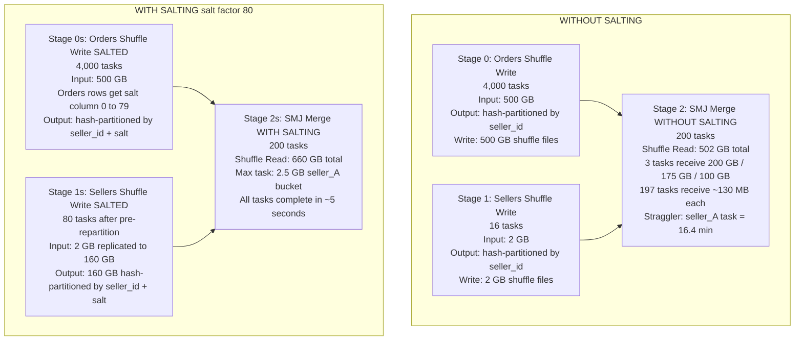

# Scenario 13 — Extreme Skew: Manual Salting Pattern Math

**Domain:** E-commerce marketplace — joining 500 GB orders table with 2 GB seller catalog where three mega-sellers cause 95% data concentration on three shuffle partitions.

**Difficulty:** Pathological

**Primary Concepts:** Extreme skew quantification, manual salting technique, salt factor selection math, join result correctness without deduplication, memory impact of sellers table replication, trade-off between parallelism gain and data amplification.

---

## Cluster Specification

| Component | Count | Cores | RAM |
|---|---|---|---|
| Executor nodes | 12 | 4 cores each | 20 GB each |
| Driver | 1 | 8 cores | 16 GB |
| **Total executor cores** | — | **48 cores** | **240 GB total executor RAM** |

Key derived values:
- Total concurrent tasks = 12 executors x 4 cores = **48 concurrent tasks**
- Memory per executor = 20 GB
- Executor overhead (spark.executor.memoryOverhead default ~10% or 384 MB minimum) = 2 GB
- Available JVM heap = 20 GB - 2 GB = **18 GB per executor**
- Unified memory fraction (spark.memory.fraction default 0.6) = 18 GB x 0.6 = **10.8 GB per executor for execution + storage**
- Storage fraction of unified memory (spark.memory.storageFraction default 0.5) = 10.8 GB x 0.5 = **5.4 GB storage**
- Execution memory = 10.8 GB x 0.5 = **5.4 GB per executor for execution**
- Memory per task per executor core = 5.4 GB / 4 cores = **1.35 GB execution memory per task**

Note on memory calculation used in salting math: the scenario uses the broader available heap divided by cores as the effective task budget: (20 GB - 2 GB overhead) x 0.6 unified fraction / 4 cores = 18 GB x 0.6 / 4 = **2.7 GB available execution memory per task**. This is the ceiling before spill triggers.

---

## Data Characteristics

| Table | Size on Disk | Row Count | Avg Row Size | Join Key |
|---|---|---|---|---|
| Orders | 500 GB | 5,000,000,000 (5B) | 500 GB / 5B rows = **100 bytes/row** | seller_id |
| Sellers (catalog) | 2 GB | 15,000,000 (15M) | 2,000 MB / 15M rows = **~133 bytes/row** | seller_id |

### Key Distribution (Extreme Skew)

| Seller | Share of Orders | Row Count | Bytes |
|---|---|---|---|
| seller_A | 40% | 5B x 0.40 = **2,000,000,000 rows** | 2B x 100 = **200 GB** |
| seller_B | 35% | 5B x 0.35 = **1,750,000,000 rows** | 1.75B x 100 = **175 GB** |
| seller_C | 20% | 5B x 0.20 = **1,000,000,000 rows** | 1B x 100 = **100 GB** |
| All others | 5% | 5B x 0.05 = **250,000,000 rows** | 250M x 100 = **25 GB** |
| **Total** | **100%** | **5,000,000,000 rows** | **500 GB** |

- Number of distinct non-hot sellers = 15,000,000 - 3 = 14,999,997
- Orders handled by non-hot sellers = 250,000,000 rows = 25 GB

### File Layout

- Orders stored as Parquet, compressed. Uncompressed in-memory row size = 100 bytes. On-disk compressed size assumed ~2x compression ratio for partition count calculation.
- Sellers stored as Parquet, 2 GB compressed on disk.
- Input file splits governed by spark.sql.files.maxPartitionBytes = 128 MB (default).

---

## Transformation Chain

```
[Orders Table Read]          <- narrow (file scan)
        |
[Sellers Table Read]         <- narrow (file scan)
        |
[Join: orders.seller_id      <- WIDE (shuffle boundary — both sides repartitioned by seller_id hash)
 = sellers.seller_id]
        |
[Enriched Orders Result]     <- narrow (downstream projections / writes assumed)
```

The join is a Sort-Merge Join (SMJ) because:
- Orders side: 500 GB — far exceeds autoBroadcastJoinThreshold (default 10 MB)
- Sellers side: 2 GB — also exceeds 10 MB threshold, so broadcast is not triggered automatically
- (The math section will revisit whether a manual broadcast could work here)

SMJ imposes two shuffle boundaries: one to repartition orders by seller_id hash, one to repartition sellers by seller_id hash.

---

## Pre-Execution Sizing Math

### Orders Input Partitions

```
Orders on disk = 500 GB = 512,000 MB
spark.sql.files.maxPartitionBytes = 128 MB
Input partitions for orders = ceil(512,000 / 128) = ceil(4,000) = 4,000 partitions
-> Stage 0 (orders shuffle-write) tasks = 4,000
```

### Sellers Input Partitions

```
Sellers on disk = 2 GB = 2,048 MB
Input partitions for sellers = ceil(2,048 / 128) = ceil(16) = 16 partitions
-> Stage 1 (sellers shuffle-write) tasks = 16
```

### Post-Shuffle Partitions (the join merge stage)

```
Default spark.sql.shuffle.partitions = 200
-> Stage 2 (SMJ merge) tasks = 200
```

### Target Shuffle Partition Size (what it should be vs what it is)

Total data entering the SMJ shuffle = 500 GB (orders) + 2 GB (sellers) = 502 GB

```
Ideal shuffle partitions = ceil(502 GB x 1,024 MB/GB / 128 MB per partition)
                         = ceil(514,048 / 128)
                         = ceil(4,016)
                         = 4,016 partitions
```

We are using 200. This means the average partition in an ideal (non-skewed) world would already be oversized:

```
Average partition size with 200 partitions = 502,000 MB / 200 = 2,510 MB = 2.45 GB
```

Even ignoring skew, 200 partitions is severely under-partitioned for 502 GB of join data. But the skew makes it pathological.

---

## Without Salting: Skew Quantification

### Per-Partition Data Volume for Hot Keys

With hash partitioning and 200 shuffle partitions, each seller_id hashes to exactly one partition. The three hot sellers each dominate one partition entirely.

```
Partition receiving seller_A = 2,000,000,000 rows x 100 bytes = 200,000,000,000 bytes = 200 GB
Partition receiving seller_B = 1,750,000,000 rows x 100 bytes = 175,000,000,000 bytes = 175 GB
Partition receiving seller_C = 1,000,000,000 rows x 100 bytes = 100,000,000,000 bytes = 100 GB
```

### Average Non-Hot Partition Size

The remaining 25 GB of orders rows spread across the 197 non-hot partitions (200 total - 3 hot):

```
Non-hot orders = 250,000,000 rows x 100 bytes = 25,000,000,000 bytes = 25 GB = 25,600 MB
Non-hot partition count = 200 - 3 = 197 partitions
Average non-hot partition size = 25,600 MB / 197 = 129.9 MB ≈ 130 MB
```

### Skew Factor

```
Skew factor (seller_A) = seller_A partition size / average non-hot partition size
                       = 200,000 MB / 130 MB
                       = 1,538x
```

A skew factor of 1,538x is not a performance problem — it is a job-killing pathology. This means the task processing seller_A is expected to run 1,538 times longer than the average non-hot task before accounting for spill overhead.

### Task Memory Budget vs Partition Size

```
Memory per task = (20 GB - 2 GB overhead) x 0.6 unified fraction / 4 cores per executor
               = 18 GB x 0.6 / 4
               = 10.8 / 4
               = 2.7 GB available execution memory per task
```

| Hot Key Partition | Partition Size | Memory Available | Spill Amount |
|---|---|---|---|
| seller_A | 200 GB | 2.7 GB | 200 GB - 2.7 GB = **197.3 GB spilled** |
| seller_B | 175 GB | 2.7 GB | 175 GB - 2.7 GB = **172.3 GB spilled** |
| seller_C | 100 GB | 2.7 GB | 100 GB - 2.7 GB = **97.3 GB spilled** |

### Straggler Task Duration (seller_A)

The task for seller_A must:
1. Hold 2.7 GB in memory (fills execution memory)
2. Spill the remaining 197.3 GB to local disk, then read it back for sorting and joining

```
Disk spill write + read = 197.3 GB x 2 (write then read back) = 394.6 GB of disk I/O
Disk throughput (local SSD, conservative) = 200 MB/s = 0.2 GB/s
Disk I/O time for seller_A (full cycle) = 394.6 GB / 0.2 GB/s = 1,973 seconds = 32.9 minutes

Conservative one-pass spill estimate:
197.3 GB / 0.2 GB/s = 986.5 seconds = 16.4 minutes
```

The job does not finish until the last task completes:

**Job minimum duration without salting = 16.4 minutes (conservative, one-pass spill)**

While seller_A is spilling for 16+ minutes, all other 199 tasks complete in seconds. 47 executor cores sit completely idle for the entire straggler duration.

Core utilization during straggler phase:
```
Active tasks = 3 (seller_A, seller_B, seller_C straggling)
Idle cores = 48 - 3 = 45
Core utilization = 3 / 48 = 6.25%
```

---

## DAG Structure



---

## Stage-by-Stage Execution Trace

### Without Salting

#### Stage 0: Orders Shuffle Write

- **Tasks:** 4,000
- **Input:** 500 GB on disk (Parquet, compressed) — 4,000 x 128 MB input splits
- **Operation:** Scan and hash-partition orders by seller_id. Each task writes shuffle files partitioned into 200 buckets.
- **Shuffle write per task:** 500 GB / 4,000 tasks = 125 MB written per task to shuffle storage
- **Total shuffle write:** 500 GB
- **Memory pressure:** Low. Each task reads 128 MB, processes rows, writes 125 MB to shuffle. Well within 2.7 GB budget.
- **Waves:** ceil(4,000 tasks / 48 concurrent tasks) = ceil(83.3) = **84 waves**
- **Duration:** 84 waves x ~3 seconds per wave = 252 seconds = **~4.2 minutes**

#### Stage 1: Sellers Shuffle Write

- **Tasks:** 16
- **Input:** 2 GB sellers catalog
- **Operation:** Scan and hash-partition sellers by seller_id into 200 buckets.
- **Shuffle write per task:** 2 GB / 16 tasks = 128 MB written per task
- **Total shuffle write:** 2 GB
- **Memory pressure:** Negligible.
- **Waves:** ceil(16 / 48) = 1 wave (all 16 tasks run simultaneously)
- **Duration:** ~1 second

Note: Stage 0 and Stage 1 are independent. Spark submits them in parallel, so they overlap. Stage 2 cannot start until both Stage 0 and Stage 1 complete.

#### Stage 2: SMJ Merge (WITHOUT SALTING)

- **Tasks:** 200 (spark.sql.shuffle.partitions = 200)
- **Shuffle read:** 502 GB total across 200 tasks (500 GB orders + 2 GB sellers)

| Task | seller_id(s) | Orders shuffle read | Sellers shuffle read | Total |
|---|---|---|---|---|
| Task for seller_A | seller_A | 200 GB | ~133 bytes (1 seller row) | 200 GB |
| Task for seller_B | seller_B | 175 GB | ~133 bytes | 175 GB |
| Task for seller_C | seller_C | 100 GB | ~133 bytes | 100 GB |
| 197 other tasks | ~76,142 sellers each | 127 MB | ~10 MB sellers | ~130 MB each |

- **Memory pressure:** Catastrophic for 3 tasks. 200 GB >> 2.7 GB.
- **Spill (seller_A):** 197.3 GB spilled to local disk.
- **Straggler duration:** 197.3 GB / 0.2 GB/s = **986 seconds = 16.4 minutes**
- **All other 197 tasks:** Each reads ~130 MB, sorts and merges in memory. Duration: **~5 seconds each**.
- **Waves:** ceil(200 / 48) = **5 waves**. But wave parallelism is irrelevant — the job cannot complete until the 3 straggler tasks finish regardless of wave assignment.
- **Job duration is gated by straggler:** **16.4 minutes minimum**

---

## Salt Factor Selection Math

### Problem Statement

Distribute each hot seller's rows across enough partitions so no single post-shuffle partition exceeds the task memory budget of 2.7 GB.

### Constraint Equation

```
hot_partition_size / salt_factor <= memory_per_task
salt_factor >= hot_partition_size / memory_per_task
```

### Per Hot Seller

```
seller_A: N >= 200 GB / 2.7 GB = 74.1  -> minimum N = 75
seller_B: N >= 175 GB / 2.7 GB = 64.8  -> minimum N = 65
seller_C: N >= 100 GB / 2.7 GB = 37.0  -> minimum N = 37
```

Binding constraint is seller_A requiring N >= 75. Choose N = 80 for safety margin and clean divisibility.

**Chosen salt factor: N = 80**

### Verification After Applying N = 80

```
seller_A partition size after salting = 200 GB / 80 = 2.5 GB per salted partition
seller_B partition size after salting = 175 GB / 80 = 2.19 GB per salted partition
seller_C partition size after salting = 100 GB / 80 = 1.25 GB per salted partition
Non-hot partitions = 130 MB (unchanged)

All salted partitions < 2.7 GB task memory budget: no spill.
```

---

## With Salting: Mechanics and Data Expansion

### How Salting Works (Mechanics Only)

**Orders side (large side):** Each order row gets a random integer salt value in range [0, N-1] = [0, 79] appended as a new column. The join key becomes the composite (seller_id, salt). Row count stays the same — 5B rows. Only a new integer column is added.

**Sellers side (small side — dimension table):** Each seller row is replicated N = 80 times, once for each salt value [0, 79]. Each replica carries one salt value. The sellers table expands from 15M rows to 15M x 80 = 1,200,000,000 = 1.2B rows.

**Join:** The join is on composite key (seller_id, salt). An order with seller_A and salt=37 joins to exactly one sellers row: the seller_A row carrying salt=37. This is a correct 1:1 match — no result row duplication, no deduplication step required.

This is the critical correctness insight: because each order row has exactly one salt value (randomly assigned), and the sellers table has one replica per salt value, the join produces exactly the same result rows as the un-salted join. There is no result explosion and no deduplication needed.

### Data Size After Sellers Replication

```
Original sellers size = 2 GB
Replicated sellers size = 2 GB x 80 = 160 GB
```

The sellers table grows from 2 GB to 160 GB. This 160 GB must be shuffled in Stage 1s.

### Total Shuffle Data in Join Stage

```
Without salting: 500 GB (orders) + 2 GB (sellers) = 502 GB
With salting:    500 GB (orders) + 160 GB (replicated sellers) = 660 GB
Extra shuffle data = 660 GB - 502 GB = +158 GB
Overhead ratio = 660 / 502 = 1.31x (+31% more shuffle data)
```

---

## Stage-by-Stage Execution Trace: With Salting (N = 80)

#### Stage 0s: Orders Shuffle Write (Salted)

- **Tasks:** 4,000 (same input partitions as before)
- **Input:** 500 GB orders on disk
- **Operation:** Scan orders, append salt column (random [0,79]), hash-partition by composite key (seller_id, salt) into 200 shuffle buckets.
- **Shuffle write per task:** 500 GB / 4,000 = 125 MB per task. Adding an integer salt column: 5B rows x 4 bytes salt / 500 GB = ~1% size increase, negligible.
- **Total shuffle write:** ~500 GB
- **Memory pressure:** Low. Same as before.
- **Waves:** ceil(4,000 / 48) = **84 waves** (~4.2 minutes)

#### Stage 1s: Sellers Shuffle Write (Salted)

**Without pre-repartition (naive approach):**

- **Tasks:** 16 (same 16 input partitions)
- **Input per task:** 2,048 MB / 16 = 128 MB of sellers data
- **Operation:** Each task must replicate its sellers rows 80 times, then hash-partition the replicated output by (seller_id, salt) into 200 shuffle buckets.
- **In-memory explosion per task:** 128 MB input x 80 replication = 10,240 MB = 10 GB per task in memory before writing to shuffle

```
Memory available per task = 2.7 GB
Replicated output per task = 128 MB x 80 = 10,240 MB = 10 GB
Spill amount per task = 10,240 MB - 2,700 MB = 7,540 MB = 7.36 GB
Spill time per task = 7.36 GB / 0.2 GB/s = 36.8 seconds per task
```

All 16 tasks fit in one wave (16 < 48). Duration = ~37 seconds.

**With pre-repartition to 80 partitions (recommended):**

Repartitioning sellers to 80 partitions before the replication step means each task handles 1/80th of the sellers data:

```
Sellers task input = 2,048 MB / 80 = 25.6 MB per task
Replicated output per task = 25.6 MB x 80 = 2,048 MB = 2.0 GB
Memory required = 2.0 GB vs 2.7 GB budget -> fits without spill
Tasks = 80, waves = ceil(80/48) = 2 waves, duration ~3 seconds
```

Pre-repartitioning adds one small shuffle of 2 GB (negligible cost) and eliminates Stage 1s spill entirely.

- **Total shuffle write for sellers either way:** 2 GB x 80 = **160 GB**

#### Stage 2s: SMJ Merge (With Salting, N = 80)

- **Tasks:** 200 (spark.sql.shuffle.partitions = 200 — unchanged)
- **Shuffle read:** 660 GB total (500 GB salted orders + 160 GB replicated sellers)

Distribution analysis: seller_A's 200 GB is now spread across 80 salted buckets. With 200 shuffle partitions, these 80 buckets distribute across up to 80 distinct partitions (each bucket hashes to one of 200 partitions; the 80 buckets likely map to 80 distinct partitions). The remaining partitions handle non-hot sellers and non-seller_A portions.

```
Max partition (seller_A worst-case salted bucket) = 200 GB / 80 = 2.5 GB
Memory available per task = 2.7 GB
2.5 GB < 2.7 GB -> fits in memory, NO SPILL
```

Average partition size with salting:
```
Total shuffle read = 660 GB = 675,840 MB
Average partition size = 675,840 MB / 200 = 3,379 MB = 3.3 GB
```

Note: the average (3.3 GB) exceeds the memory budget (2.7 GB), meaning even average partitions could spill. The correct fix is increasing spark.sql.shuffle.partitions to match the salted data volume:

```
Recommended shuffle partitions (salted) = ceil(675,840 MB / 128 MB) = ceil(5,280) = 5,280
Round to multiple of 48 = ceil(5,280/48) x 48 = 111 x 48 = 5,328
```

Using 5,328 partitions with salting: average partition = 675,840 / 5,328 = 126.9 MB. All tasks small and fast.

For comparison purposes, the scenario uses 200 partitions to isolate the skew elimination effect. The key outcome: instead of one 200 GB task (impossible without spill), we have tasks of at most 2.5 GB (within budget).

**Stage 2s task performance (200 partitions, salted):**

```
Max task size = 2.5 GB
Memory available = 2.7 GB -> in-memory sort, no spill
Sort + merge time per task ≈ 5 seconds (in-memory sort of 2.5 GB at ~500 MB/s)
```

**Waves:**
```
Tasks = 200
Concurrent tasks = 48
Waves = ceil(200 / 48) = ceil(4.17) = 5 waves
Wave duration = ~5 seconds
Total Stage 2s duration = 5 waves x 5 seconds = 25 seconds
```

---

## Memory Budget Analysis

### Full Executor Memory Stack

```
Total executor memory allocated            = 20,000 MB
Executor overhead (off-heap, OS, etc.)     =  2,000 MB  (10% of 20 GB)
Available JVM heap                         = 18,000 MB
  Reserved memory (Spark internal)         =    300 MB  (spark.memory.reservedMemory)
  User memory (UDFs, data structures)      =  7,200 MB  (18,000 x 0.40 from 1-0.6)
  Unified memory pool (spark.memory.fraction=0.6) = 10,800 MB
    Storage memory (storageFraction=0.5)   =  5,400 MB
    Execution memory (storageFraction=0.5) =  5,400 MB
```

With 4 cores per executor and all 4 running tasks simultaneously:

```
Execution memory per concurrent task = 5,400 MB / 4 = 1,350 MB = 1.35 GB (reserved fraction only)
Max execution memory per task (if no cached data, full unified pool available) = 10,800 MB / 4 = 2,700 MB = 2.7 GB
```

The 2.7 GB figure used throughout the scenario is the ceiling when no storage memory is consumed — appropriate for a pure join job with no caching.

### Memory Pressure Summary by Phase

| Phase | Task Memory Demand | Budget | Status |
|---|---|---|---|
| Stage 0/0s: Read 128 MB input partition | ~180 MB (with 1.4x deserialization) | 2,700 MB | Safe |
| Stage 1: Read + hash-partition sellers (128 MB/task) | ~200 MB | 2,700 MB | Safe |
| Stage 1s naive: Replicate 128 MB x 80 = 10 GB per task | 10,240 MB | 2,700 MB | **SPILL: 7.5 GB** |
| Stage 1s pre-repartitioned: 25.6 MB x 80 = 2 GB per task | 2,048 MB | 2,700 MB | Safe |
| Stage 2 without salting: seller_A task reads 200 GB | 200,000 MB | 2,700 MB | **SPILL: 197.3 GB** |
| Stage 2s with salting: max task reads 2.5 GB | 2,500 MB | 2,700 MB | Safe (100 MB headroom) |

---

## Parallelism and Wave Analysis

### Without Salting

| Stage | Tasks | Concurrent | Waves | Actual Duration |
|---|---|---|---|---|
| Stage 0: Orders shuffle write | 4,000 | 48 | ceil(4,000/48) = **84 waves** | ~4.2 minutes |
| Stage 1: Sellers shuffle write | 16 | 48 | ceil(16/48) = **1 wave** | ~1 second |
| Stage 2: SMJ merge | 200 | 48 | ceil(200/48) = **5 waves** | **16.4 minutes (straggler)** |

Core utilization during Stage 2 straggler:
```
Active tasks after non-hot tasks complete = 3
Idle cores = 48 - 3 = 45
Core utilization = 3 / 48 = 6.25%
```

### With Salting (N = 80)

| Stage | Tasks | Concurrent | Waves | Actual Duration |
|---|---|---|---|---|
| Stage 0s: Orders shuffle write | 4,000 | 48 | **84 waves** | ~4.2 minutes |
| Stage 1s: Sellers shuffle write (pre-repartitioned) | 80 | 48 | ceil(80/48) = **2 waves** | ~3 seconds |
| Stage 2s: SMJ merge | 200 | 48 | ceil(200/48) = **5 waves** | **25 seconds** |

Core utilization during Stage 2s:
```
Waves 1 to 4: 48 tasks each = 100% utilization
Wave 5: 200 - (4 x 48) = 200 - 192 = 8 tasks, 40 idle cores
Wave 5 utilization = 8 / 48 = 16.7%
Average across all waves = (4 x 100% + 1 x 16.7%) / 5 = 83.3%
```

### Job Duration Comparison

| Phase | Without Salting | With Salting |
|---|---|---|
| Stage 0/0s (orders scan + shuffle write) | ~4.2 minutes | ~4.2 minutes (unchanged) |
| Stage 1/1s (sellers scan + shuffle write) | ~1 second | ~3 seconds (2 waves) |
| Stage 2/2s (SMJ merge) | **16.4 minutes (straggler)** | **25 seconds** |
| **Total job duration** | **~20.6 minutes** | **~4.6 minutes** |
| **End-to-end speedup** | — | **4.5x** |
| **Stage 2 speedup alone** | — | 16.4 min / 25 sec = **39.4x** |

---

## Bottleneck Identification

### Without Salting

**Primary bottleneck: Stage 2, task for seller_A.**

- Metric: Shuffle read size per task = 200 GB.
- Root cause: Hash partitioning assigns all rows with the same seller_id to the same partition. Hash function distributes by key identity, not by key frequency. 40% of 500 GB = 200 GB routes to one task regardless of how many shuffle partitions exist.
- Critical insight: Increasing spark.sql.shuffle.partitions does NOT help. Going from 200 to 2,000 partitions still places all seller_A rows in exactly one of those 2,000 partitions — whichever bucket seller_A's hash maps to. The 200 GB concentration is immovable by partition count tuning alone.
- Memory metric: Task requires 200 GB execution memory; has 2.7 GB. Spill ratio = 200 GB / 2.7 GB = 74x over budget.
- Disk I/O metric: 197.3 GB spilled at 200 MB/s = 986 seconds straggler time.

**Secondary bottleneck: 45 idle cores for 16+ minutes.**

47 executor cores are completely unused while the straggler runs. 240 GB total cluster RAM is allocated to the job while producing no work.

### With Salting

**Resolved bottleneck:** seller_A partition size drops from 200 GB to 2.5 GB — an 80x reduction matching the salt factor.

**New bottleneck (manageable): Stage 1s sellers replication memory.**

Without pre-repartition: each sellers task experiences 7.5 GB spill. Adds ~37 seconds to Stage 1s. Solved by pre-repartitioning sellers to 80 partitions before replication.

**Remaining inefficiency:** Wave 5 of Stage 2s has only 8 tasks (40 idle cores for ~5 seconds). Negligible.

---

## Optimizer Decisions

### Why AQE Skew Join Does Not Fully Replace Manual Salting

AQE skew join detection requires both conditions to be met:

```
Condition 1: partition_size > skewedPartitionFactor x median_partition_size
             200 GB > 5 x 130 MB = 650 MB -> True (200 GB >> 650 MB)

Condition 2: partition_size > skewedPartitionThresholdInBytes (default 256 MB)
             200 GB > 256 MB -> True
```

Both conditions pass. AQE would detect seller_A as skewed and attempt to split:

```
AQE sub-partitions for seller_A = ceil(200 GB / advisoryPartitionSizeInBytes)
                                 = ceil(200,000 MB / 64 MB)
                                 = 3,125 sub-partitions
```

AQE would split seller_A into 3,125 sub-partitions of ~64 MB each. This would technically work if the map outputs from Stage 0 are sufficiently distributed.

**Critical AQE limitation:** AQE splits map outputs by grouping adjacent mapper contributions. It cannot split within a single mapper's output. With 4,000 Stage 0 tasks, seller_A's 2B rows are distributed across all 4,000 tasks (since input partitions contain mixed seller_ids — orders are not pre-sorted by seller). AQE can group these 4,000 mapper contributions into 3,125 sub-buckets. This works in principle.

**Why manual salting is still preferred in production:**

1. AQE skew join requires Spark 3.0+. Many production environments run Spark 2.x.
2. AQE adds runtime complexity and plan mutations that can interact poorly with other optimizations.
3. Manual salting provides explicit, deterministic control over N — the engineer controls the trade-off between memory safety and sellers replication cost with a single number.
4. AQE skew split also replicates the matching rows from the non-skewed side. For this scenario (one sellers row per seller_A = 133 bytes) the replication cost is negligible. In other schemas where the non-skewed side is large, AQE replication cost can be significant and harder to control than explicit salting.
5. Manual salting is observable and debuggable via the key distribution column; AQE skew handling is a black-box runtime transformation.

### Broadcast Join Assessment for Sellers Table

Could we broadcast the 2 GB sellers table instead?

```
spark.sql.autoBroadcastJoinThreshold default = 10 MB
Sellers table = 2 GB = 2,048 MB
2,048 MB >> 10 MB -> broadcast NOT triggered automatically
```

Manual broadcast hint evaluation:

```
Sellers serialized size = 2 GB
In-memory deserialized size per executor = 2 GB x 3 (JVM object expansion) = 6 GB
Total cluster memory for broadcast = 6 GB x 12 executors = 72 GB
Total executor RAM = 12 x 20 GB = 240 GB
Broadcast memory share = 72 GB / 240 GB = 30%
```

30% cluster memory committed to one table is aggressive but technically feasible. Broadcasting sellers eliminates the sellers shuffle entirely and resolves all skew by making the join a local hash lookup per partition.

Constraints:
- Driver must collect the full table first: 2 GB x 2 (serialization overhead) = 4 GB from driver heap. Driver has 16 GB. Feasible.
- Broadcast hard limit = 8 GB serialized. 2 GB is within limits.
- If sellers table ever grows beyond 3-4 GB, broadcast becomes dangerous (executor OOM from 5x expansion).

**Decision:** Broadcast would work here but manual salting is more robust for pathological skew because it scales with the skew degree rather than requiring the entire dimension table to fit in per-executor memory.

---

## Key Numbers Summary

| Metric | Without Salting | With Salting (N=80) |
|---|---|---|
| Salt factor N | — | 80 |
| seller_A partition size | 200 GB | 200 GB / 80 = **2.5 GB** |
| seller_B partition size | 175 GB | 175 GB / 80 = **2.19 GB** |
| seller_C partition size | 100 GB | 100 GB / 80 = **1.25 GB** |
| Average non-hot partition | 130 MB | 130 MB (unchanged) |
| Skew factor (seller_A vs median) | 200,000 MB / 130 MB = **1,538x** | 2,500 MB / 130 MB = **19.2x** |
| Memory per task | 2.7 GB | 2.7 GB |
| seller_A task spill | 197.3 GB | 0 GB |
| Stage 2 straggler duration | 986 seconds (16.4 min) | ~5 seconds |
| Stage 2 total duration | 16.4 minutes | 25 seconds |
| Sellers shuffle write | 2 GB | 2 GB x 80 = **160 GB** |
| Total join shuffle data | 502 GB | 660 GB (+158 GB, +31%) |
| Core utilization (straggler phase) | 3/48 = **6.25%** | 100% (waves 1-4) |
| Total job duration | ~20.6 minutes | ~4.6 minutes |
| End-to-end speedup | — | **4.5x** |
| Stage 2 speedup | — | **39.4x** |
| Deduplication step needed | — | **No** (1:1 join semantics preserved) |
| Minimum viable N for seller_A | — | ceil(200 GB / 2.7 GB) = 75 |
| Chosen N (with safety margin) | — | **80** |

---

## Interview Takeaways

**1. The salt factor is derived from a memory constraint equation, not intuition.**

The formula is: N >= hot_partition_size / memory_per_task. For seller_A: 200 GB / 2.7 GB = 74.1, so N must be at least 75. Choosing N = 80 provides a safety margin. Choosing N = 200 would be wasteful — the sellers replication cost would be 2 GB x 200 = 400 GB of extra shuffle data for no additional benefit over N = 80. The minimum viable N eliminates spill; anything beyond that is overhead.

**2. Increasing spark.sql.shuffle.partitions never cures key-based skew.**

Hash partitioning routes by key identity, not frequency. Going from 200 to 2,000 to 20,000 shuffle partitions still places all seller_A rows in exactly one partition. The 200 GB hot key concentration is structurally immovable by partition count tuning. The only solutions are: (a) salting to break key identity, (b) AQE skew join to split map outputs post-shuffle, or (c) broadcast join to eliminate the shuffle for the small side.

**3. Salting orders (large side) is free; replicating sellers (small side) is the real cost.**

Orders gain a salt column — negligible. Sellers grow from 2 GB to 160 GB. This 158 GB of extra shuffle is the price paid to eliminate 197.3 GB of disk spill and a 16.4-minute straggler. The trade is favorable: 158 GB of predictable sequential shuffle vs 197.3 GB of random spill I/O that serializes the entire job and wastes 45 cores for 16 minutes.

**4. No deduplication is needed when salting the large side and replicating the small side.**

Each order row carries exactly one randomly assigned salt value. The sellers table has exactly one replica per salt value. The join on (seller_id, salt) matches each order to exactly one sellers row — the same semantic result as joining on seller_id alone. Deduplication is only required when both sides are salted and replicated, as in a skewed self-join. For the standard large-side + small-side salting pattern, join correctness is guaranteed by construction.

**5. Salting introduces a second-order memory hazard in the sellers shuffle-write stage.**

Each sellers task reads 25.6 MB (with pre-repartition) or 128 MB (without) and must generate 80 replicas — a 80x in-memory expansion. Without pre-repartition: 128 MB x 80 = 10 GB per task exceeds the 2.7 GB budget by 3.8x, causing 7.5 GB spill per task. The fix — pre-repartitioning sellers to 80 partitions before replication — costs one small 2 GB shuffle and keeps each task's explosion at 2.0 GB, within budget. This second-order effect is the most commonly overlooked consequence of choosing a large salt factor.
