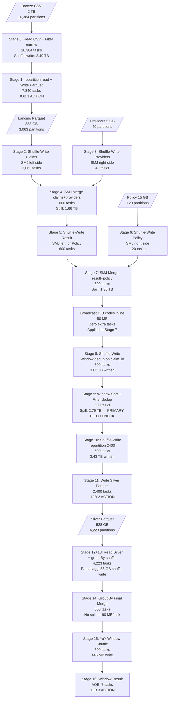

# Scenario 14 — End-to-End Pipeline: Bronze → Silver → Gold with Full Execution Trace

**Domain:** Insurance claims processing — complete multi-hop pipeline  
**Difficulty:** Pathological  
**Primary Concepts:** Multi-hop execution, action boundaries triggering jobs, DAG across hops, cumulative shuffle tracking, cluster sizing for full pipeline, identifying the bottleneck stage across all hops, total resource consumption math

---

## Cluster Specification

| Component | Specification |
|---|---|
| Executor nodes | 20 |
| Cores per executor node | 6 |
| RAM per executor node | 32 GB |
| Driver cores | 16 |
| Driver RAM | 64 GB |
| Total executor cores | 20 × 6 = **120 cores** |
| Total executor RAM | 20 × 32 GB = **640 GB** |

### Executor Configuration Derivation

Before computing anything, establish how many executor JVM processes fit on each 32 GB node.

Choose executor memory: 28 GB per executor (leaving OS headroom).

```
memoryOverhead = max(384 MB, 0.10 × 28,672 MB)
               = max(384, 2,867)
               = 2,867 MB

Total YARN container per executor = 28,672 + 2,867 = 31,539 MB

Executors per node = floor(32,768 MB / 31,539 MB) = floor(1.038) = 1 executor per node
```

Result: 1 executor per node × 20 nodes = **20 executors**, each with 28 GB JVM heap and 6 cores.

---

## Memory Budget Analysis (Per Executor)

Apply the unified memory model to each executor (E = 28 GB = 28,672 MB):

```
Reserved Memory       = 300 MB (hardcoded)
Usable Heap           = 28,672 - 300 = 28,372 MB

Unified Memory        = 28,372 × 0.6 = 17,023 MB  (~16.6 GB)
User Memory           = 28,372 × 0.4 = 11,349 MB  (~11.1 GB)

Storage Memory Floor  = 17,023 × 0.5 = 8,512 MB   (~8.3 GB)
Execution Memory Init = 17,023 × 0.5 = 8,512 MB   (~8.3 GB)
```

Memory per task (6 concurrent tasks per executor, since cores per executor = 6):

```
Max execution memory per task = 8,512 MB / 6 = 1,419 MB  (~1.4 GB)
Min execution memory per task = 8,512 MB / 12 = 709 MB   (~0.7 GB)
```

Cluster-wide unified memory: 17,023 MB × 20 executors = 340,460 MB (~332 GB) total unified memory across the cluster.

---

## Data Characteristics

| Dataset | Size | Row Count | Avg Row Size | File Format | Splittable |
|---|---|---|---|---|---|
| Bronze raw claims | 2 TB (2,097,152 MB) | 10,000,000,000 | 200 bytes | CSV (uncompressed) | Yes |
| Providers lookup | 5 GB (5,120 MB) | ~25,000,000 | ~200 bytes | Parquet | Yes |
| Policy master | 15 GB (15,360 MB) | ~75,000,000 | ~200 bytes | Parquet | Yes |
| ICD diagnosis codes | 50 MB | ~100,000 | ~500 bytes | Parquet | Yes (broadcastable) |

Malformed rows (Bronze filter): 2% × 10,000,000,000 = 200,000,000 rows removed.  
Clean rows after filter: 9,800,000,000 rows.  
Clean data size after filter: 9,800,000,000 × 200 bytes = 1,960,000,000,000 bytes = ~1.96 TB (1,960,000 MB).

Parquet compression assumption: 5× compression over CSV row bytes.  
Landing parquet size ≈ 1,960,000 MB / 5 = **392,000 MB (~383 GB)** on disk.

---

## Transformation Chain

| Step | Operation | Type | Hop |
|---|---|---|---|
| 1 | Read 2 TB CSV | — | Bronze → Landing |
| 2 | Filter malformed rows (~2%) | **Narrow** | Bronze → Landing |
| 3 | repartition(7,840) for clean output files | **Wide** | Bronze → Landing |
| 4 | Write Parquet to Landing zone | **Action (Job 1)** | Bronze → Landing |
| 5 | Read Landing Parquet | — | Landing → Silver |
| 6 | SMJ: claims JOIN providers on provider_id | **Wide** | Landing → Silver |
| 7 | SMJ: result JOIN policy on policy_id | **Wide** | Landing → Silver |
| 8 | Broadcast join: result JOIN ICD codes on icd_code | **Narrow** (broadcast) | Landing → Silver |
| 9 | Deduplicate: ROW_NUMBER window on claim_id+version | **Wide** | Landing → Silver |
| 10 | repartition(2,400) by provider_specialty+month | **Wide** | Landing → Silver |
| 11 | Write partitioned Parquet to Silver zone | **Action (Job 2)** | Landing → Silver |
| 12 | Read Silver Parquet | — | Silver → Gold |
| 13 | groupBy(provider_id, specialty, month).agg(5 metrics) | **Wide** | Silver → Gold |
| 14 | Window function: YoY comparison per provider | **Wide** | Silver → Gold |
| 15 | Write final aggregated Gold table | **Action (Job 3)** | Silver → Gold |

---

## Pre-Execution Sizing Math

### Global Cluster Parameters

```
spark.sql.files.maxPartitionBytes = 128 MB (134,217,728 bytes, default)
spark.sql.files.openCostInBytes   = 4 MB  (default)
spark.default.parallelism         = 120   (= total executor cores)
Total concurrent tasks            = 120
```

---

### HOP 1: Bronze → Landing

**Input CSV partition count:**

```
CSV is uncompressed and splittable. Collection of files totaling 2 TB.
Total file size = 2,097,152 MB

bytesPerCore = 2,097,152 MB / 120 = 17,476 MB

maxSplitBytes = min(128 MB, max(4 MB, 17,476 MB))
              = min(128 MB, 17,476 MB)
              = 128 MB

Input partitions = ceil(2,097,152 MB / 128 MB) = 16,384 partitions
```

Filter stage (narrow — no new stage): filter(is_valid_row) is pipelined into the read stage. No shuffle boundary.

**repartition(7,840) for clean output files:**

After filtering 2% of rows, remaining data is 1.96 TB in-memory. Optimal output file size for Parquet is 256 MB (2× the default read partition size, balancing write and future read performance).

```
Output file count = ceil(1,960,000 MB / 256 MB) = ceil(7,656.25) = 7,657
Round to nearest multiple of 120 (total cores): ceil(7,657 / 120) × 120 = 64 × 120 = 7,680
Optimal is repartition(7,680). The scenario specifies repartition(7,840).
We trace 7,840 as specified and note 7,680 as the cores-aligned optimum.
```

repartition shuffle write bytes:

```
Shuffle write = 1.96 TB in-memory data through shuffle mechanism
Estimated with Kryo serialization factor 1.3:
Shuffle bytes written = 1,960,000 MB × 1.3 = 2,548,000 MB (~2.49 TB)
```

---

### HOP 2: Landing → Silver

**Read Landing Parquet partition count:**

```
Landing Parquet on disk = 392,000 MB (383 GB after 5× compression)

bytesPerCore = 392,000 MB / 120 = 3,267 MB
maxSplitBytes = min(128 MB, max(4 MB, 3,267 MB)) = 128 MB

Input partitions = ceil(392,000 MB / 128 MB) = ceil(3,062.5) = 3,063 partitions
```

**Tuned shuffle partition target for HOP 2 joins:**

```
Set spark.sql.shuffle.partitions = 600 for HOP 2.
This is a production-tuned value corresponding to 5× waves on 120 cores.
600 partitions × ~target 200 MB each = 120 GB ideal per shuffle pass.
AQE handles outlier skew at runtime.
```

**SMJ with Providers (5 GB Parquet):**

```
Providers input partitions = ceil(5,120 MB / 128 MB) = 40 partitions
Claims shuffle-write tasks  = 3,063 (reading Landing Parquet)
Providers shuffle-write tasks = 40
Join merge tasks = 600 (spark.sql.shuffle.partitions)
```

Estimated join output size (inner join, ~95% match rate):

```
Post-join rows = 9,800,000,000 × 0.95 = 9,310,000,000 rows
Post-join row size = 200 (claims) + 50 (provider columns added) = 250 bytes/row
Post-join in-memory size = 9,310,000,000 × 250 = 2,327,500,000,000 bytes = ~2,222,656 MB (2.17 TB)
```

**SMJ with Policy (15 GB Parquet):**

```
Policy input partitions = ceil(15,360 MB / 128 MB) = 120 partitions
Claims+providers result shuffle-write tasks = 600
Policy shuffle-write tasks = 120
Join merge tasks = 600 (spark.sql.shuffle.partitions)
```

Post-join size (97% match rate):

```
Post-join rows = 9,310,000,000 × 0.97 = 9,030,700,000 rows
Post-join row size = 250 (prior) + 80 (policy columns added) = 330 bytes/row
Post-join in-memory size = 9,030,700,000 × 330 = 2,980,131,000,000 bytes = ~2,847,780 MB (2.78 TB)
```

**Broadcast join with ICD codes (50 MB):**

```
ICD codes serialized size = 50 MB
autoBroadcastJoinThreshold default = 10 MB
ICD (50 MB) exceeds default threshold.
Required configuration: spark.sql.autoBroadcastJoinThreshold = 60MB
OR use explicit broadcast hint: /*+ BROADCAST(icd) */

In-memory deserialized size per executor = 50 MB × 3× expansion factor = 150 MB
Total cluster memory for broadcast = 150 MB × 20 executors = 3,000 MB (3 GB)
Storage Memory Floor per executor = 8,512 MB
3 GB << 8,512 MB per executor: ICD broadcast fits comfortably in storage pool.

No shuffle boundary. Zero additional tasks.
ICD hash lookup applied inline within each task of the merge stage.
```

**Deduplication via ROW_NUMBER window on claim_id+version:**

```
Full 2.78 TB result must be shuffled to co-locate all rows per claim_id.
Window shuffle write = 2,847,780 MB × 1.3 (Kryo) = 3,702,114 MB (~3.62 TB)
Window stage tasks = 600 (spark.sql.shuffle.partitions)
Sort within each of 600 partitions by version DESC.
Apply ROW_NUMBER filter WHERE row_num = 1.
```

Assume dedup removes 5% of rows (re-submitted/duplicate claims):

```
Post-dedup rows = 9,030,700,000 × 0.95 = 8,579,165,000 rows
Post-dedup row size = 330 bytes (schema unchanged)
Post-dedup in-memory size = 8,579,165,000 × 330 = 2,831,124,450,000 bytes = ~2,702,755 MB (2.64 TB)
```

**repartition(2,400) for partitioned write:**

```
Output partitions: 200 specialties × 12 months = 2,400 output file directories
repartition(2,400) tasks = 2,400
Shuffle write = 2,702,755 MB × 1.3 (Kryo) = 3,513,582 MB (~3.43 TB)
```

---

### HOP 3: Silver → Gold

**Read Silver Parquet:**

```
Silver data in-memory = 2,702,755 MB
Silver Parquet on disk (5× compression) = 2,702,755 / 5 = 540,551 MB (~528 GB)

bytesPerCore = 540,551 / 120 = 4,505 MB
maxSplitBytes = min(128 MB, max(4 MB, 4,505 MB)) = 128 MB

Input partitions = ceil(540,551 MB / 128 MB) = ceil(4,222.7) = 4,223 partitions
```

**groupBy(provider_id, specialty, month).agg(5 metrics):**

```
Distinct (provider_id, specialty, month) combinations:
Assume ~500,000 providers × 1 specialty each × 12 months = 6,000,000 groups

Map-side partial aggregation (HashAggregate combine phase) runs before shuffle:
Reduction factor = input_rows / distinct_groups = 8,579,165,000 / 6,000,000 = 1,430×

Without partial agg:
Shuffle write upper bound = 540,551 MB × 1.3 = 702,716 MB (~686 GB)

With partial agg (each of 4,223 input tasks emits partial aggregates for its local groups):
Partial agg rows per task = 6,000,000 groups (all groups may appear in each task if data is uniformly distributed)
Conservative partial agg shuffle write = 702,716 MB / 1,430 × overhead_factor_1.5 = 54,055 MB (~53 GB)

Spark uses spark.sql.shuffle.partitions = 600 for this stage.
```

GroupBy result size:

```
6,000,000 groups × (8+8+8+8+8) bytes for 5 aggregated double metrics + 20 bytes for keys
= 6,000,000 × 60 bytes = 360,000,000 bytes = ~343 MB
```

**Window function: YoY comparison per provider:**

```
Input to window shuffle = 343 MB (post-aggregation — tiny)
Shuffle on provider_id to pair current year vs prior year rows.
Shuffle write = 343 MB × 1.3 = 446 MB (~446 MB, effectively trivial)
Window stage tasks = 600 (spark.sql.shuffle.partitions)

AQE coalescing:
advisoryPartitionSizeInBytes default = 64 MB
Coalesced partitions = ceil(446 MB / 64 MB) = 7 → AQE produces ~7 tasks
```

**Write Gold table:**

```
Gold output = ~343 MB (final aggregated result)
Written in 1 wave with 7 tasks (AQE coalesced).
```

---

## DAG Structure



---

## Stage-by-Stage Execution Trace

### JOB 1: Bronze → Landing (Action: write Parquet)

Total concurrent tasks: 120. Waves = ceil(stage_tasks / 120).

---

**Stage 0: Read CSV + Filter malformed rows**

| Metric | Value | Derivation |
|---|---|---|
| Stage type | ShuffleMapStage | Feeds repartition shuffle |
| Input | 2 TB CSV | Bronze source |
| Input partitions | 16,384 | 2,097,152 MB / 128 MB = 16,384 |
| Tasks | 16,384 | 1 task per partition |
| Concurrent tasks | 120 | 20 executors × 6 cores |
| Waves | ceil(16,384 / 120) = **137 waves** | Last wave: 16,384 mod 120 = 64 tasks, 56 cores idle |
| Narrow ops pipelined | filter(is_valid_row) | No stage boundary |
| Rows filtered out | 200,000,000 (2%) | Removed inline |
| Shuffle write | 2,548,000 MB (2.49 TB) | 1,960,000 MB × 1.3 Kryo factor |
| Memory per task | 1,419 MB max | 8,512 MB / 6 cores |
| Key pressure | CPU-bound (CSV parsing) | No predicate pushdown, no column pruning on CSV |

---

**Stage 1: repartition shuffle read + write Parquet**

| Metric | Value | Derivation |
|---|---|---|
| Stage type | ResultStage (write = action) | Terminates Job 1 |
| Tasks | 7,840 | repartition(7,840) |
| Concurrent tasks | 120 | |
| Waves | ceil(7,840 / 120) = **66 waves** | Last wave: 7,840 mod 120 = 40 tasks, 80 cores idle |
| Shuffle read | 2,548,000 MB (2.49 TB) | From Stage 0 shuffle write |
| Output written to disk | 392,000 MB (383 GB) | 1,960,000 MB / 5× Parquet compression |
| Output files | 7,840 Parquet files | 1 file per task |

**Job 1 total: 2 stages. Tasks: 16,384 + 7,840 = 24,224. Waves: 137 + 66 = 203.**

---

### JOB 2: Landing → Silver (Action: write partitioned Parquet)

---

**Stage 2: Shuffle-Write Claims (SMJ left side for providers join)**

| Metric | Value | Derivation |
|---|---|---|
| Stage type | ShuffleMapStage | |
| Input | 392,000 MB (383 GB) | Landing Parquet |
| Input partitions | 3,063 | 392,000 MB / 128 MB = 3,062.5 → 3,063 |
| Tasks | 3,063 | |
| Waves | ceil(3,063 / 120) = **26 waves** | Last wave: 3,063 mod 120 = 63 tasks |
| Parquet benefit | Column pruning + predicate pushdown active | Only reads needed columns from row groups |
| Shuffle write | 392,000 MB × 1.3 = 509,600 MB (~498 GB) | Claims shuffled by provider_id hash |

---

**Stage 3: Shuffle-Write Providers (SMJ right side)**

| Metric | Value | Derivation |
|---|---|---|
| Stage type | ShuffleMapStage | |
| Input partitions | 40 | 5,120 MB / 128 MB = 40 |
| Tasks | 40 | |
| Waves | ceil(40 / 120) = **1 wave** | 40 tasks, 80 cores idle |
| Shuffle write | 5,120 MB × 1.3 = 6,656 MB (~6.5 GB) | Providers shuffled by provider_id hash |

Stages 2 and 3 execute in parallel (independent DAG branches).  
Wall clock for SMJ prep = max(Stage 2 duration, Stage 3 duration) = Stage 2 duration (dominates).

---

**Stage 4: SMJ Merge — Claims + Providers**

| Metric | Value | Derivation |
|---|---|---|
| Stage type | ShuffleMapStage | Output feeds policy join |
| Tasks | 600 | spark.sql.shuffle.partitions = 600 |
| Waves | ceil(600 / 120) = **5 waves** | Perfect 100% utilization |
| Shuffle read | 509,600 + 6,656 = 516,256 MB (~504 GB) | Claims + providers shuffle outputs |
| Data per task | 516,256 MB / 600 = **860 MB/task** | |
| Available exec mem | 1,419 MB/task | 8,512 MB / 6 cores |
| Spill risk | MODERATE | 860 MB/task < 1,419 MB — no spill if uniform |
| Output rows | 9,310,000,000 | 9.8B × 95% match rate |
| Output in-memory | 2,222,656 MB (2.17 TB) | 9.31B × 250 bytes/row |
| Shuffle write | 2,222,656 MB × 1.3 = 2,889,453 MB (~2.82 TB) | Result shuffled for policy join |

Note: The 860 MB/task figure is based on the shuffle read. Sort-merge join requires holding both sort buffers simultaneously. With skewed providers (some specialties have far more claims), individual tasks can exceed 1,419 MB and spill. At uniform distribution, Stage 4 narrowly avoids spill.

---

**Stage 5: Shuffle-Write Policy (SMJ right side)**

| Metric | Value | Derivation |
|---|---|---|
| Stage type | ShuffleMapStage | |
| Input partitions | 120 | 15,360 MB / 128 MB = 120 |
| Tasks | 120 | |
| Waves | ceil(120 / 120) = **1 wave** | Exactly fills cluster |
| Shuffle write | 15,360 MB × 1.3 = 19,968 MB (~19.5 GB) | Policy shuffled by policy_id hash |

---

**Stage 6: SMJ Merge — Result + Policy**

| Metric | Value | Derivation |
|---|---|---|
| Stage type | ShuffleMapStage | Output feeds dedup window |
| Tasks | 600 | spark.sql.shuffle.partitions = 600 |
| Waves | ceil(600 / 120) = **5 waves** | Perfect 100% utilization |
| Shuffle read | 2,889,453 + 19,968 = 2,909,421 MB (~2.84 TB) | Claims+providers result + policy |
| Data per task | 2,909,421 / 600 = **4,849 MB/task** | |
| Available exec mem | 1,419 MB/task | |
| Spill | CERTAIN | 4,849 MB >> 1,419 MB |
| Spill per task | 4,849 - 1,419 = 3,430 MB | |
| Total spill Stage 6 | 3,430 MB × 600 = **2,058,000 MB (~2.01 TB)** | |
| Output rows | 9,030,700,000 | 9.31B × 97% policy match |
| Output in-memory | 2,847,780 MB (2.78 TB) | 9.03B × 330 bytes/row |

---

**Stage 7: Broadcast ICD codes (no separate stage)**

```
ICD codes: 50 MB serialized on disk.
Manual broadcast hint required (exceeds 10 MB default threshold).

Broadcast distribution sequence:
  1. Driver reads ICD table: 50 MB in driver heap
  2. Driver chunks into 4 MB blocks (spark.broadcast.blockSize default)
     = ceil(50 / 4) = 13 blocks
  3. Driver sends initial chunks to executors; executors replicate peer-to-peer
  4. Each executor: 50 MB received → 150 MB deserialized in BlockManager storage pool
  5. All 6 tasks on each executor share the same deserialized copy

Total cluster memory = 150 MB × 20 executors = 3,000 MB (3 GB)
Storage Memory Floor per executor = 8,512 MB
3,000 MB / 20 = 150 MB per executor << 8,512 MB storage floor. Fits easily.

Zero extra tasks. Zero shuffle bytes. Applied inline during Stage 6 merge tasks.
```

---

**Stage 8: Shuffle-Write for Deduplication Window**

| Metric | Value | Derivation |
|---|---|---|
| Stage type | ShuffleMapStage | |
| Tasks | 600 | Prior stage output partitions |
| Waves | ceil(600 / 120) = **5 waves** | |
| Input | 2,847,780 MB (2.78 TB) | Post-policy-join result |
| Shuffle write | 2,847,780 MB × 1.3 = **3,702,114 MB (3.62 TB)** | Full data re-shuffled on claim_id hash |
| Purpose | Co-locate all rows per claim_id for ROW_NUMBER window | |

---

**Stage 9: Window Sort + Dedup Filter — PRIMARY BOTTLENECK**

| Metric | Value | Derivation |
|---|---|---|
| Stage type | ShuffleMapStage | Output feeds repartition |
| Tasks | 600 | spark.sql.shuffle.partitions = 600 |
| Waves | ceil(600 / 120) = **5 waves** | |
| Shuffle read | 3,702,114 MB (3.62 TB) | From Stage 8 |
| Data per task | 3,702,114 / 600 = **6,170 MB/task** | |
| Available exec mem | 1,419 MB/task | 8,512 MB / 6 cores |
| Spill ratio | 6,170 / 1,419 = **4.35×** | Tasks must spill 4× their available memory |
| Spill per task | 6,170 - 1,419 = 4,751 MB | |
| Total spill Stage 9 | 4,751 MB × 600 = **2,850,600 MB (2.79 TB)** | |
| Extra disk I/O | 4,751 MB × 2 (write+read back) × 600 = **5,701,200 MB (5.57 TB)** | Spill is serialized within task |
| Post-dedup rows | 8,579,165,000 | 9.03B × 95% dedup pass rate |
| Post-dedup in-memory | 2,702,755 MB (2.64 TB) | 8.58B × 330 bytes/row |

Stage 9 is the pipeline's primary bottleneck because:
1. Highest spill ratio (4.35×) of any stage
2. Sort cannot be partially pre-aggregated (unlike HashAggregate)
3. Every task performs multiple externalSorter merge passes
4. 5.57 TB of extra disk I/O serialized within 600 tasks across 5 waves

---

**Stage 10: Shuffle-Write for repartition(2,400)**

| Metric | Value | Derivation |
|---|---|---|
| Stage type | ShuffleMapStage | |
| Tasks | 600 | Post-dedup stage output |
| Waves | ceil(600 / 120) = **5 waves** | |
| Input | 2,702,755 MB (2.64 TB) | Post-dedup data |
| Shuffle write | 2,702,755 MB × 1.3 = **3,513,582 MB (3.43 TB)** | Full data shuffled by specialty+month |

---

**Stage 11: Write Silver Parquet**

| Metric | Value | Derivation |
|---|---|---|
| Stage type | ResultStage (write = action) | Terminates Job 2 |
| Tasks | 2,400 | repartition(2,400) |
| Waves | ceil(2,400 / 120) = **20 waves** | Exactly 20 clean waves, 100% utilization |
| Shuffle read | 3,513,582 MB (3.43 TB) | From Stage 10 |
| Output written to disk | 540,551 MB (528 GB) | 2,702,755 MB / 5× Parquet compression |
| Output files | 2,400 Parquet files | 1 per task, partitioned by specialty+month |

**Job 2 total: 10 stages. Tasks: 3,063 + 40 + 600 + 120 + 600 + 600 + 600 + 600 + 2,400 = 8,623. Waves: 26 + 1 + 5 + 1 + 5 + 5 + 5 + 5 + 20 = 73.**

---

### JOB 3: Silver → Gold (Action: write Gold table)

---

**Stage 12: Read Silver Parquet + groupBy Shuffle-Write (pipelined)**

| Metric | Value | Derivation |
|---|---|---|
| Stage type | ShuffleMapStage | |
| Input | 540,551 MB (528 GB) | Silver Parquet on disk |
| Input partitions | 4,223 | 540,551 MB / 128 MB = 4,222.7 → 4,223 |
| Tasks | 4,223 | 1 per partition |
| Waves | ceil(4,223 / 120) = **36 waves** | Last wave: 4,223 mod 120 = 23 tasks, 97 cores idle |
| Partial agg reduction | 8,579,165,000 rows / 6,000,000 groups = 1,430× | HashAggregate combine runs before shuffle |
| Shuffle write | 540,551 MB × 1.3 / 1,430 × 1.5 overhead = **54,055 MB (~53 GB)** | After partial agg |

---

**Stage 13: GroupBy Final Merge + Aggregation**

| Metric | Value | Derivation |
|---|---|---|
| Stage type | ShuffleMapStage | Feeds YoY window |
| Tasks | 600 | spark.sql.shuffle.partitions = 600 |
| Waves | ceil(600 / 120) = **5 waves** | |
| Shuffle read | 54,055 MB (~53 GB) | From Stage 12 partial agg output |
| Data per task | 54,055 / 600 = **90 MB/task** | Well within 1,419 MB — no spill |
| Output rows | 6,000,000 | All distinct (provider, specialty, month) groups |
| Output size | 6,000,000 × 60 bytes = **360 MB** | 5 metric doubles + key bytes |

---

**Stage 14: YoY Window Shuffle-Write**

| Metric | Value | Derivation |
|---|---|---|
| Stage type | ShuffleMapStage | |
| Tasks | 600 | Prior stage output |
| Waves | ceil(600 / 120) = **5 waves** | |
| Shuffle write | 360 MB × 1.3 = **468 MB** | Trivially small |

---

**Stage 15: YoY Window Sort + Write Gold (AQE coalesced)**

| Metric | Value | Derivation |
|---|---|---|
| Stage type | ResultStage (write = action) | Terminates Job 3 |
| Pre-AQE tasks | 600 | spark.sql.shuffle.partitions |
| AQE coalesced tasks | ceil(468 MB / 64 MB) = **8 tasks** | AQE merges 600 → 8 partitions (advisoryPartitionSizeInBytes = 64 MB) |
| Waves | ceil(8 / 120) = **1 wave** | All 8 tasks in single wave |
| Output | ~360 MB | Final Gold aggregated table |

**Job 3 total: 4 stages. Tasks (post-AQE): 4,223 + 600 + 600 + 8 = 5,431. Waves: 36 + 5 + 5 + 1 = 47.**

---

## Parallelism and Wave Analysis

### Total Cluster Cores and Concurrent Tasks

```
Total executor cores    = 20 executors × 6 cores = 120 concurrent tasks
spark.task.cpus         = 1 (default)
Effective parallelism   = 120 concurrent tasks
```

### Per-Job Wave Summary

| Job | Stage | Description | Tasks | Waves | Last Wave Utilization |
|---|---|---|---|---|---|
| 1 | 0 | Read CSV + Filter | 16,384 | 137 | 16,384 mod 120 = 64 → 64/120 = **53%** |
| 1 | 1 | repartition write | 7,840 | 66 | 7,840 mod 120 = 40 → 40/120 = **33%** |
| 2 | 2 | Shuffle-write claims | 3,063 | 26 | 3,063 mod 120 = 63 → 63/120 = **53%** |
| 2 | 3 | Shuffle-write providers | 40 | 1 | 40/120 = **33%** |
| 2 | 4 | SMJ merge claims+prov | 600 | 5 | 600 mod 120 = 0 → **100%** |
| 2 | 5 | Shuffle-write policy | 120 | 1 | 120/120 = **100%** |
| 2 | 6 | SMJ merge result+policy | 600 | 5 | **100%** |
| 2 | 8 | Dedup shuffle write | 600 | 5 | **100%** |
| 2 | 9 | Window sort dedup | 600 | 5 | **100%** (but each task doing 5.57 TB extra disk I/O) |
| 2 | 10 | repartition(2400) shuffle | 600 | 5 | **100%** |
| 2 | 11 | Write Silver | 2,400 | 20 | **100%** |
| 3 | 12 | Read Silver + groupBy shuffle | 4,223 | 36 | 4,223 mod 120 = 23 → 23/120 = **19%** |
| 3 | 13 | GroupBy final merge | 600 | 5 | **100%** |
| 3 | 14 | YoY window shuffle | 600 | 5 | **100%** |
| 3 | 15 | YoY result (AQE) | 8 | 1 | 8/120 = **7%** |

---

## Total Jobs, Stages, Tasks, and Shuffle Bytes

### Jobs

```
Total jobs = 3
  Job 1: Bronze → Landing write
  Job 2: Landing → Silver write
  Job 3: Silver → Gold write
```

### Stages

```
Job 1: Stage 0, Stage 1                                             = 2 stages
Job 2: Stage 2, 3, 4, 5, 6, 8, 9, 10, 11                          = 9 stages
       (Stage 7 = broadcast ICD — no shuffle boundary, not a stage)
Job 3: Stage 12, 13, 14, 15                                         = 4 stages
                                                                    ──────────
Total stages                                                        = 15 stages
```

### Total Tasks

```
Job 1:  16,384 + 7,840                                              = 24,224
Job 2:  3,063 + 40 + 600 + 120 + 600 + 600 + 600 + 600 + 2,400   = 8,623
Job 3:  4,223 + 600 + 600 + 8                                      = 5,431
                                                                    ────────
Total tasks                                                         = 38,278
```

### Total Shuffle Write Bytes

| Shuffle | Bytes Written | Derivation |
|---|---|---|
| Job 1: repartition(7,840) | 2,548,000 MB (2.49 TB) | 1,960,000 MB × 1.3 |
| Job 2: Claims shuffle for SMJ | 509,600 MB (498 GB) | 392,000 MB × 1.3 |
| Job 2: Providers shuffle for SMJ | 6,656 MB (6.5 GB) | 5,120 MB × 1.3 |
| Job 2: Result shuffle for policy SMJ | 2,889,453 MB (2.82 TB) | 2,222,656 MB × 1.3 |
| Job 2: Policy shuffle for SMJ | 19,968 MB (19.5 GB) | 15,360 MB × 1.3 |
| Job 2: Dedup window shuffle | 3,702,114 MB (3.62 TB) | 2,847,780 MB × 1.3 |
| Job 2: repartition(2,400) shuffle | 3,513,582 MB (3.43 TB) | 2,702,755 MB × 1.3 |
| Job 3: GroupBy partial agg shuffle | 54,055 MB (53 GB) | After map-side combine |
| Job 3: YoY window shuffle | 468 MB | 360 MB × 1.3 |
| **TOTAL** | **~13,243,896 MB (~12.93 TB)** | |

Simplified:

```
2,548,000
+  509,600
+    6,656
+2,889,453
+   19,968
+3,702,114
+3,513,582
+   54,055
+      468
= 13,243,896 MB total shuffle write (~12.93 TB)
```

---

## Bottleneck Identification

### Stage 9 — Window Sort for Deduplication: Primary Bottleneck

```
Data per task       = 3,702,114 MB / 600 tasks = 6,170 MB/task
Execution memory    = 1,419 MB/task
Spill ratio         = 6,170 / 1,419 = 4.35×
Spill per task      = 4,751 MB
Total spill         = 4,751 MB × 600 = 2,850,600 MB (2.79 TB)
Extra disk I/O      = 4,751 MB × 2 × 600 = 5,701,200 MB (5.57 TB extra reads+writes)
```

A 4.35× spill ratio means each task's ExternalSorter performs multiple merge passes:
- Pass 1: Fill execution memory (1,419 MB), spill to disk
- Pass 2: Fill again, spill again
- ...repeat 4× until all data has been sorted in pieces
- Final pass: merge-sort all spill files

This transforms what should be an O(N log N) in-memory sort into a multi-pass external merge sort with O(N log N) disk I/O. The 600 tasks × 5 waves means the sorting bottleneck persists across all 5 waves with no relief.

**Fix for Stage 9:**

```
Target: data per task ≤ 1,000 MB (70% of max exec mem = safe headroom)
Required partitions = ceil(3,702,114 MB / 1,000 MB) = 3,703
Round to multiple of 120: ceil(3,703 / 120) × 120 = 31 × 120 = 3,720 partitions

With spark.sql.shuffle.partitions = 3,720 for the dedup stage:
Data per task = 3,702,114 / 3,720 = 995 MB/task — no spill
Waves = ceil(3,720 / 120) = 31 waves (vs 5 waves with spill)

Tradeoff: 31 waves × ~10 sec/task (no spill) = 310 sec vs 5 waves × ~300 sec/task (spill) = 1,500 sec
Net improvement: 4.8× faster for this stage alone.
```

### Stage 6 — Second SMJ Merge: Secondary Bottleneck

```
Data per task = 2,909,421 / 600 = 4,849 MB/task
Spill per task = 4,849 - 1,419 = 3,430 MB
Total spill = 3,430 × 600 = 2,058,000 MB (2.01 TB)
```

### Stage 0 — CSV Parsing: Tertiary Bottleneck (throughput, not memory)

```
137 waves of CSV parsing.
CSV requires: tokenization, type coercion, null checking — ~3× slower than Parquet read.
No predicate pushdown: all 200 bytes/row deserialized even if 5 columns selected downstream.
No column pruning: full row materialized before filter.
Estimated 30+ seconds per task × 137 waves = ~68+ minutes for Stage 0 alone.
```

### Wall Clock Estimate (Critical Path)

```
Stage 0  (CSV read 137 waves × ~30 s)  = ~68 min
Stage 1  (repartition 66 waves × ~15 s) = ~17 min
Stage 2  (Parquet read 26 waves × ~10 s) = ~4 min    ← parallel with Stage 3
Stage 4  (SMJ merge 5 waves × ~60 s)    = ~5 min
Stage 6  (SMJ merge 5 waves × ~120 s)   = ~10 min    ← spill-heavy
Stage 9  (window dedup 5 waves × ~300 s) = ~25 min   ← heaviest spill
Stage 11 (write Silver 20 waves × ~20 s) = ~7 min
Stage 12 (read Silver 36 waves × ~10 s) = ~6 min
Stage 13 (groupBy 5 waves × ~5 s)       = ~0.4 min
Stage 15 (write Gold 1 wave × ~5 s)     = ~0.1 min

Total critical path estimate             = ~142 minutes (~2.4 hours)
```

---

## Optimizer Decisions

### AQE Behavior Across Hops

**HOP 1:** AQE active but constrained. The repartition(7,840) is explicit — AQE cannot coalesce partitions from a manual repartition call. AQE skew detection runs on Stage 1 shuffle output but repartition distributes uniformly, so skew is absent.

**HOP 2 — Join strategy decisions:**

```
autoBroadcastJoinThreshold = 10 MB (default)
Providers  = 5,120 MB >> 10 MB → SMJ  (cannot broadcast)
Policy     = 15,360 MB >> 10 MB → SMJ  (cannot broadcast)
ICD codes  = 50 MB >> 10 MB    → SMJ by default; BROADCAST hint required

If spark.sql.autoBroadcastJoinThreshold = 60MB:
  ICD (50 MB) < 60 MB → auto-broadcast, no hint needed
  Providers still too large (5,120 MB >> 60 MB)
  Policy still too large (15,360 MB >> 60 MB)
```

**AQE skew detection on Stage 4 (SMJ merge, claims + providers):**

```
600 post-shuffle partitions
Average partition size = 516,256 MB / 600 = 860 MB/partition

Skew condition 1: partition must exceed 5 × 860 MB = 4,300 MB
Skew condition 2: partition must exceed 256 MB (absolute floor)

Effective trigger: max(4,300 MB, 256 MB) = 4,300 MB

A hot provider (e.g., large hospital network) might have 10× average claims.
10 × 860 MB = 8,600 MB partition → flagged as skewed.
AQE splits: ceil(8,600 MB / 64 MB) = 135 sub-partitions.
Other side replicated 135 times (row replication to match sub-partitions).
```

**AQE coalescing on Stage 15 (YoY window, Gold write):**

```
Pre-coalesce: 600 shuffle partitions, 468 MB total data
Average partition = 468 / 600 = 0.78 MB — extremely small

AQE advisoryPartitionSizeInBytes = 64 MB
Coalesced partitions = ceil(468 MB / 64 MB) = 8 partitions

Result: 8 tasks instead of 600 → avoids launching 592 near-empty tasks.
Single wave of 8 tasks completes in seconds.
```

**HOP 3 — GroupBy partial aggregation (automatic optimizer decision):**

Spark's optimizer automatically inserts a partial HashAggregate before the shuffle when the aggregate function is decomposable (sum, count, avg, min, max all are). The partial agg runs within each of the 4,223 read tasks before any data crosses the network, reducing the groupBy shuffle from ~686 GB to ~53 GB — a 12.7× reduction.

---

## Key Numbers Summary

| Metric | Value | Notes |
|---|---|---|
| Total jobs | 3 | One per write action |
| Total stages | 15 | Broadcast join does not add a stage |
| Total tasks | 38,278 | Sum: 24,224 + 8,623 + 5,431 |
| Total concurrent tasks | 120 | 20 executors × 6 cores |
| Bronze CSV input partitions | 16,384 | 2,097,152 MB / 128 MB |
| Landing Parquet input partitions | 3,063 | 392,000 MB / 128 MB |
| Silver Parquet input partitions | 4,223 | 540,551 MB / 128 MB |
| Total shuffle write bytes | ~12.93 TB | 13,243,896 MB across all jobs |
| Largest single shuffle | 3.62 TB (Stage 8, dedup) | Entire 2.78 TB result re-shuffled on claim_id |
| Second largest shuffle | 3.43 TB (Stage 10, repartition) | Post-dedup full shuffle |
| Total spill to disk (Job 2) | ~4.80 TB | Stage 6: 2.01 TB + Stage 9: 2.79 TB |
| Stage 9 spill ratio | 4.35× | 6,170 MB/task vs 1,419 MB available |
| Extra disk I/O from Stage 9 spill | 5.57 TB | 4,751 MB × 2 × 600 tasks |
| Executor JVM heap | 28 GB | 1 executor per 32 GB node |
| Unified memory per executor | 17,023 MB (16.6 GB) | (28,672 - 300) × 0.6 |
| Execution memory per executor | 8,512 MB (8.3 GB) | 17,023 × 0.5 |
| Max memory per task | 1,419 MB | 8,512 MB / 6 cores |
| ICD broadcast memory (cluster) | 3,000 MB (3 GB) | 150 MB per executor × 20 executors |
| Primary bottleneck | Stage 9 (window dedup sort) | 4.35× spill ratio |
| Primary bottleneck fix | Increase shuffle partitions from 600 → 3,720 | 31 waves no-spill vs 5 waves max-spill |
| Gold output size | ~360 MB | 6,000,000 groups × 60 bytes |
| Estimated wall clock | ~142 minutes | Critical path through all 3 jobs |
| Stage 0 wave count | 137 waves | Worst wave count due to CSV input size |
| AQE Gold coalescing | 600 → 8 partitions | 468 MB / 64 MB advisory size |

---

## Interview Takeaways

**1. Action boundaries define job count, not hop count — three writes create exactly three jobs.**

Three pipeline hops produce exactly three jobs because there are exactly three write actions. The entire DAG from each read through its downstream transformations is computed lazily and materialized only when the write action is called. If an intermediate result were cached with `.cache()` instead of written to disk, it would still trigger a job at the first action that needs it, but would be reused for subsequent jobs. Understanding where Spark materializes results is the foundation for reasoning about job counts, stage reuse, and cache invalidation.

**2. The deduplication window is the pipeline's worst stage because sort cannot be partially pre-aggregated.**

Spark's optimizer automatically inserts a partial HashAggregate combiner before any shuffle for decomposable aggregates (sum, count, min, max), reducing the groupBy shuffle in HOP 3 from 686 GB to 53 GB — a 12.7× reduction. ROW_NUMBER() windows are not decomposable: Spark cannot compute a partial row number per task and merge it later. Every row for a given claim_id must be co-located in one task, then fully sorted. With 6,170 MB of data per task and only 1,419 MB of execution memory, the 4.35× spill ratio forces each task through four external merge-sort passes, generating 5.57 TB of extra disk I/O. The fix requires increasing shuffle partitions from 600 to 3,720 — accepting 31 waves of no-spill work instead of 5 waves of maximum-spill work, yielding a 4.8× speedup for that stage alone.

**3. Shuffle partition count is a single-query variable that must be sized to the largest shuffle, not the average.**

Job 2 has shuffles ranging from 6.5 GB (providers) to 3.62 TB (dedup). The same `spark.sql.shuffle.partitions = 600` produces 10 MB per partition for providers (fine — tiny tasks, AQE would coalesce anyway) and 6,170 MB per partition for dedup (catastrophic — 4.35× spill). Without AQE, you need either per-query repartition() calls before each wide transformation or multiple jobs with different shuffle partition settings. With AQE enabled, set `spark.sql.adaptive.coalescePartitions.initialPartitionNum = 4000` and `spark.sql.adaptive.advisoryPartitionSizeInBytes = 512MB` so small shuffles coalesce up automatically and large shuffles stay large.

**4. Broadcast join memory is per executor, not per task — and the cost is bounded by executor count, not task count.**

50 MB ICD codes × 20 executors = 1 GB total cluster memory. If someone multiplies by total tasks (38,278 tasks), they get 1.8 TB — a 1,800× overestimate. The correct mental model: Spark uses a BitTorrent-like distribution protocol to deliver one copy to each executor's BlockManager. All tasks on that executor share the single deserialized copy (150 MB for ICD). The 150 MB sits in the storage memory pool (floor: 8,512 MB per executor), leaving execution memory untouched. Broadcast joins are uniquely efficient: they eliminate entire shuffle stages (no Stage 7 in this pipeline) while consuming memory bounded by executor count, not task or row count.

**5. CSV input compounds inefficiency at every level of the pipeline — the Bronze → Landing hop exists to pay a one-time conversion tax.**

Bronze CSV generates 16,384 input partitions (137 waves). The same data as Parquet at 5× compression would be 392 GB → 3,063 partitions → 26 waves — an 80% wave reduction for Stage 0 alone. CSV adds three additional costs beyond partition count: (a) full row deserialization even when only 5 of 40 columns are needed downstream (no column pruning), (b) full row scan even when filter eliminates 99% of rows (no predicate pushdown or row group skipping), and (c) no bloom filter or min/max statistics to skip row groups. The Bronze → Landing write (Job 1) is a deliberate investment: pay 2.49 TB of shuffle cost once to produce 383 GB of Parquet that all future jobs read with column pruning, predicate pushdown, and 80% fewer partitions.
