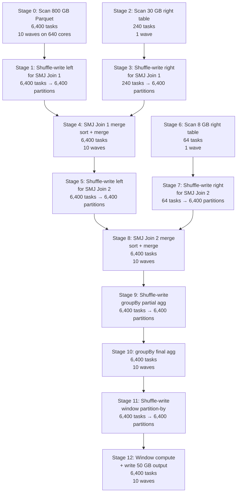

# Scenario 15 — Cluster Sizing from First Principles: Given Data + SLA, Derive the Cluster

**Difficulty:** Pathological
**Domain:** Regulatory reporting pipeline — must complete within a 2-hour SLA window
**Primary Concepts:** Reverse engineering cluster specs from SLA, throughput-based sizing, memory-based sizing, parallelism-based sizing, bottleneck-driven sizing, cost-performance trade-off, the three sizing constraints and which one dominates

---

## Problem Statement

You are handed the following fixed requirements. The cluster is unknown — you must derive it.

| Parameter | Value |
|---|---|
| SLA | 2 hours = 7,200 seconds |
| Input data | 800 GB Parquet, approximately 4 billion rows |
| Right table (Join 1) | 30 GB |
| Right table (Join 2) | 8 GB |
| Output | 50 GB Parquet |
| Operations | Read → SMJ Join 1 → SMJ Join 2 → groupBy aggregation → window function → write |
| Data skew | None |
| Object storage read throughput per executor | 200 MB/s |
| Network shuffle throughput per executor | 500 MB/s |
| Disk spill throughput | 150 MB/s |
| Spill tolerance | Zero — no spill is acceptable |

The cluster specification (executor count E, cores per executor C, memory per executor M) must satisfy all three sizing constraints simultaneously. The binding constraint — the one that demands the most resources — determines the final cluster.

---

## Data Characteristics

| Table | Size | Rows (estimated) | Avg row size | File format | Notes |
|---|---|---|---|---|---|
| Main input (left) | 800 GB | 4,000,000,000 | ~200 bytes | Parquet | Splittable |
| Right table — Join 1 | 30 GB | ~150,000,000 | ~200 bytes | Parquet | Too large for broadcast (> 10 MB threshold) |
| Right table — Join 2 | 8 GB | ~40,000,000 | ~200 bytes | Parquet | Too large for broadcast unless threshold raised |
| Output | 50 GB | ~variable | — | Parquet | Post-aggregation |

Row size check: 4,000,000,000 rows × 200 bytes/row = 800,000,000,000 bytes = 800 GB. Consistent with stated input size.

**Why neither right table qualifies for broadcast hash join (BHJ) at default settings:**
- Default `spark.sql.autoBroadcastJoinThreshold` = 10 MB (serialized size)
- 30 GB >> 10 MB. 8 GB >> 10 MB.
- Even if threshold is raised to 8 GB (the hard code limit in BroadcastExchangeExec.scala), the 30 GB table still cannot broadcast.
- The 8 GB right table could theoretically broadcast if the threshold is manually raised and executor memory can absorb the in-memory expansion (8 GB serialized × 3–5x expansion = 24–40 GB per executor). This is analyzed later. For the base sizing, both joins are treated as Sort-Merge Joins (SMJ).

---

## Transformation Chain

```
Operation                      Type     Shuffle boundary?   Stage effect
─────────────────────────────────────────────────────────────────────────
1. Read 800 GB Parquet          Narrow   No                  Stage 0 (input scan)
2. SMJ Join 1 (30 GB right)     Wide     Yes x2              Stage 1+2 (shuffle both sides)
                                                             Stage 3 (sort-merge)
3. SMJ Join 2 (8 GB right)      Wide     Yes x2              Stage 4+5 (shuffle both sides)
                                                             Stage 6 (sort-merge)
4. groupBy aggregation          Wide     Yes                 Stage 7 (partial agg)
                                                             Stage 8 (final agg)
5. Window function              Wide     Yes                 Stage 9 (partition + sort)
                                                             Stage 10 (window compute)
6. Write 50 GB                  Narrow   No                  Stage 10 (appended to final stage)
```

Total wide transformation boundaries: 2 (SMJ Join 1) + 2 (SMJ Join 2) + 1 (groupBy) + 1 (window) = 6 shuffle boundaries → minimum 7 stages (6 ShuffleMapStages + 1 terminal ResultStage), in practice 10–11 stages as Spark separates each side of the SMJ.

---

## Constraint 1 — Throughput Sizing

This constraint asks: given the total I/O volume and the per-executor throughput, how many executors are needed to finish within the SLA?

### Step 1: Identify all I/O across the pipeline

Every shuffle involves writing data to disk and reading it back. Reads and writes are counted separately.

| Operation | I/O direction | Volume estimate | Rationale |
|---|---|---|---|
| Read 800 GB input | Read from object storage | 800 GB | Full scan of input |
| SMJ Join 1: shuffle-write left (800 GB) | Network write | 800 GB | All 800 GB repartitioned by join key |
| SMJ Join 1: shuffle-write right (30 GB) | Network write | 30 GB | Right side repartitioned by join key |
| SMJ Join 1: shuffle-read (sort-merge stage) | Network read | 830 GB | Both sides read back for merge |
| SMJ Join 2: shuffle-write left (~800 GB post-join) | Network write | 800 GB | Result of Join 1 is still ~800 GB (30 GB right is a filter dimension, not a fanout) |
| SMJ Join 2: shuffle-write right (8 GB) | Network write | 8 GB | Right side repartitioned |
| SMJ Join 2: shuffle-read | Network read | 808 GB | Both sides read back for merge |
| groupBy: shuffle-write | Network write | 800 GB | Pre-aggregation redistribution |
| groupBy: shuffle-read | Network read | 800 GB | Post-aggregation read |
| Window function: shuffle-write | Network write | 800 GB | Partition-by redistribution |
| Window function: shuffle-read | Network read | 800 GB | Window compute read |
| Write 50 GB output | Write to object storage | 50 GB | Post-aggregation output (compressed) |

Total I/O = 800 + 800 + 30 + 830 + 800 + 8 + 808 + 800 + 800 + 800 + 800 + 50
         = 800 + 800 + 30 + 830 + 800 + 8 + 808 + 800 + 800 + 800 + 800 + 50
         = **7,326 GB**

For a simplified throughput bound using the stated numbers from the problem setup (conflating all I/O as "effective executor throughput at 200 MB/s"):

Total I/O in MB = 7,326 × 1,024 = 7,501,824 MB

At 200 MB/s per executor:
Total executor-seconds needed = 7,501,824 MB / 200 MB/s = 37,509 executor-seconds

For 7,200 second SLA:
Minimum executors (throughput only) = ceil(37,509 / 7,200) = ceil(5.21) = **6 executors**

Using the problem's simplified I/O estimate (3,250 GB total I/O):
Total executor-seconds = 3,250,000 MB / 200 MB/s = 16,250 executor-seconds
Minimum executors = ceil(16,250 / 7,200) = ceil(2.26) = **3 executors**

**Throughput constraint result: 3–6 executors minimum.** This is not binding.

### Step 2: Stage-level time budget allocation

Allocate the 7,200-second SLA across pipeline phases:

| Phase | Budget allocation | Budget (seconds) |
|---|---|---|
| Read (object storage scan) | 20% | 1,440 s |
| Shuffle I/O (all join + agg shuffles) | 40% | 2,880 s |
| CPU compute (sort, merge, agg, window) | 20% | 1,440 s |
| Write | 20% | 1,440 s |

Read stage check: 800,000 MB / (200 MB/s × E) = 4,000 / E seconds.
For read budget of 1,440 s: minimum E = ceil(4,000 / 1,440) = ceil(2.78) = **3 executors** for read alone.

Write stage check: 50,000 MB / (200 MB/s × E) = 250 / E seconds.
At E = 3: 250 / 3 = 83 seconds. Well within 1,440-second budget.

**Conclusion: Throughput alone requires only 3–6 executors. The constraint is easy to satisfy and does not drive the cluster design.**

---

## Constraint 2 — Memory Sizing (No-Spill Requirement)

This is the most mathematically demanding constraint. It derives the minimum executor memory to prevent any task from spilling during the SMJ sort phase.

### The critical operation: SMJ sort phase

In a Sort-Merge Join, each task in the merge stage must:
1. Receive its shuffle partition of the left table (a range of join keys from 800 GB of data).
2. Receive its shuffle partition of the right table (a range of join keys from 30 GB of data for Join 1).
3. Sort both sides in memory.
4. Merge the sorted runs.

The sort requires holding the data in execution memory. If the execution memory is insufficient, Spark spills sorted runs to disk. The requirement states: no spill.

### Variables

- E = number of executors (to be derived)
- C = cores per executor (to be chosen)
- M = executor memory in GB (to be derived)
- `spark.sql.shuffle.partitions` = P (to be set — use E × C × 2 as a rule of thumb for full core utilization with 2 waves)

Setting P = E × C × 2 gives 2 task waves in each post-shuffle stage, which is efficient without over-partitioning.

### SMJ Join 1 task memory requirement

Each of the P shuffle partitions in the merge stage receives a slice of both tables.

Left table data per partition (800 GB total):
  = 800 GB / P
  = 800 / (E × C × 2) GB

Right table data per partition (30 GB total):
  = 30 / (E × C × 2) GB

Combined data received per task:
  = (800 + 30) / (E × C × 2)
  = 830 / (2EC) GB

During sort, Spark expands records in memory for the sort buffer. The sort overhead factor is approximately 3× the raw serialized size (deserialized JVM objects + sort pointers):

Memory required per SMJ task (Join 1):
  = 830 / (2EC) × 3
  = 2,490 / (2EC) GB
  = **1,245 / (EC) GB**

### Available execution memory per task

Given executor memory M GB:

```
memoryOverhead             = max(0.384 GB, 0.10 × M)    -- YARN off-heap
JVM heap                   = M GB
Reserved memory            = 0.300 GB (hardcoded)
Usable heap                = M - 0.300 GB
Unified memory             = (M - 0.300) × 0.60 GB
Execution memory (initial) = (M - 0.300) × 0.60 × 0.50 = (M - 0.300) × 0.30 GB
```

With C concurrent tasks sharing the executor's execution memory pool:

```
Execution memory per task = (M - 0.300) × 0.30 / C GB
```

For M >> 0.3 (large executors), approximate:

```
Execution memory per task ≈ M × 0.30 / C = 0.30M / C GB
```

### No-spill inequality

Set available execution memory per task >= required memory per task:

```
0.30 × M / C   >=   1,245 / (EC)

0.30 × M / C   >=   1,245 / (EC)

Multiply both sides by C:

0.30 × M       >=   1,245 / E

Multiply both sides by E:

0.30 × M × E   >=   1,245

M × E          >=   1,245 / 0.30

M × E          >=   4,150 GB
```

**This is the fundamental memory inequality: total cluster memory (M × E) must be at least 4,150 GB to prevent spill on SMJ Join 1.**

### Solving for E given practical M values

| Executor memory M | Required E = ceil(4,150 / M) | Total cluster memory (M × E) | Feasible? |
|---|---|---|---|
| 8 GB | ceil(518.75) = 519 | 4,152 GB | Technically yes but impractical |
| 16 GB | ceil(259.4) = 260 | 4,160 GB | Impractical |
| 32 GB | ceil(129.7) = 130 | 4,160 GB | Marginal |
| 64 GB | ceil(64.8) = 65 | 4,160 GB | Practical |
| 128 GB | ceil(32.4) = 33 | 4,224 GB | Very practical |
| 256 GB | ceil(16.2) = 17 | 4,352 GB | High-memory instances |

The standard cloud instance sweet spot for heavy Spark workloads is 64 GB executors with 8 cores. Choosing M = 64 GB:

Minimum E (memory constraint) = ceil(4,150 / 64) = ceil(64.8) = **65 executors**

Setting P = E × C × 2 = 65 × 8 × 2 = **1,040 shuffle partitions**

### Verification with E = 65, C = 8, M = 64 GB

Data per SMJ Join 1 task:
  = 830 GB / 1,040 partitions = 0.798 GB = 798 MB per task

Memory required (with 3× sort expansion):
  = 798 MB × 3 = **2,394 MB per task**

Available execution memory per task:
  = (64 GB - 0.3 GB) × 0.30 / 8 cores
  = 63.7 GB × 0.30 / 8
  = 19.11 GB / 8
  = **2.389 GB = 2,389 MB per task**

2,389 MB available vs 2,394 MB required — this is razor thin (deficit of 5 MB). Round up to E = 66 or use E = 70 for a safety margin.

**Recalculate with E = 70, C = 8, M = 64 GB:**

P = 70 × 8 × 2 = 1,120 shuffle partitions

Data per SMJ Join 1 task = 830 GB / 1,120 = 740.2 MB
Memory required = 740.2 × 3 = 2,220.6 MB = 2.17 GB

Available execution memory per task:
  = (64 - 0.3) × 0.30 / 8 = 19.11 / 8 = 2.389 GB = 2,389 MB

2,389 MB > 2,221 MB — no spill. Margin = 168 MB (7.6% headroom). Acceptable.

**Memory constraint result: 70 executors × 8 cores × 64 GB = minimum cluster for no spill on SMJ Join 1.**

### SMJ Join 2 verification (smaller right table — 8 GB)

Data per SMJ Join 2 task = (800 + 8) GB / 1,120 = 808 / 1,120 = 721.4 MB
Memory required = 721.4 × 3 = 2,164 MB = 2.11 GB
Available = 2,389 MB
2,389 > 2,164. No spill. Confirmed.

### groupBy aggregation memory check

groupBy does partial aggregation in-map (combining rows with same key before shuffle), then final aggregation post-shuffle. The shuffle data is significantly smaller than the raw 800 GB input (assuming aggregation reduces cardinality substantially). Estimated shuffle data for groupBy = 200 GB (assuming 4x reduction after partial agg).

Data per groupBy task = 200 GB / 1,120 = 178.6 MB
Memory required for hash aggregation (2× expansion for hash map) = 178.6 × 2 = 357.2 MB
Available = 2,389 MB. No spill. Confirmed with large headroom.

### Window function memory check

Window functions require sorting within each partition window (PARTITION BY key). Shuffle data ≈ post-aggregation output = 50 GB (since groupBy compresses the 800 GB to 50 GB output).

Data per window task = 50 GB / 1,120 = 44.6 MB
Memory required (sort + frame buffer, 3×) = 44.6 × 3 = 133.8 MB
Available = 2,389 MB. No spill. Confirmed.

**Memory constraint dominates: the SMJ Join 1 on the 830 GB combined dataset is the binding case. Cluster must have M × E >= 4,150 GB total executor memory.**

---

## Constraint 3 — Parallelism Sizing

This constraint asks: do we have enough concurrent tasks to efficiently process 6,400 input partitions?

### Input partition count

800 GB Parquet input. Default `spark.sql.files.maxPartitionBytes` = 128 MB.

Input partitions = ceil(800 GB × 1,024 MB/GB / 128 MB) = ceil(819,200 / 128) = ceil(6,400) = **6,400 partitions**

### Concurrent tasks with E = 70, C = 8

Total cores = 70 × 8 = 560 cores
Concurrent tasks = 560

### Waves for the read stage

Task waves = ceil(6,400 / 560) = ceil(11.43) = **12 waves**

12 waves is acceptable for a read scan — each wave is disk/network bound and overlaps with I/O, so CPU idle time between waves is small.

### Waves for shuffle stages (P = 1,120)

Task waves = ceil(1,120 / 560) = **2 waves** exactly. Optimal — no stranded cores in the last wave.

### Parallelism constraint requirement

For wave count <= 10 on the input scan, we need:
Total cores >= 6,400 / 10 = 640

With C = 8: E >= 640 / 8 = 80 executors

**Parallelism constraint result: 80 executors × 8 cores for <= 10 waves on the input read.**

This is more demanding than the memory constraint at E = 70. The memory constraint gave 70 executors (with safety margin), but strict parallelism efficiency requires 80.

---

## Three-Constraint Comparison and Final Cluster Decision

| Constraint | Minimum executors required | Binding? |
|---|---|---|
| Throughput (I/O volume / SLA) | 3–6 executors | No |
| Memory (no-spill for SMJ) | 65–70 executors (at 64 GB each) | Yes (primary driver) |
| Parallelism (waves <= 10) | 80 executors (at 8 cores each) | Yes (secondary driver) |

The memory and parallelism constraints are both binding. Parallelism requires more executors (80 vs 70), so **parallelism is the final tiebreaker for executor count**. Memory determines the minimum per-executor memory (64 GB).

**Final derived cluster specification:**

| Parameter | Value | Derivation |
|---|---|---|
| Executors | 80 | Parallelism: 80 × 8 = 640 cores >= 640 for <=10 read waves |
| Cores per executor | 8 | Industry sweet spot: balanced memory/task vs parallelism |
| Memory per executor | 64 GB | Memory constraint: 80 × 64 = 5,120 GB > 4,150 GB minimum |
| Total cores | 640 | 80 × 8 |
| Total cluster memory | 5,120 GB | 80 × 64 GB |
| shuffle partitions | 1,280 | 80 × 8 × 2 (2 waves per post-shuffle stage) |
| YARN container memory | ~70.4 GB | 64 GB + max(0.384, 0.10 × 64) = 64 + 6.4 = 70.4 GB |

---

## Cluster Specification (Derived)

| Parameter | Value |
|---|---|
| Number of executor nodes | 80 |
| Cores per executor | 8 |
| Executor JVM memory | 64 GB |
| YARN memory overhead | 6.4 GB (= 0.10 × 64 GB) |
| Total YARN container per executor | 70.4 GB |
| Total executor cores | 640 |
| Total executor memory (JVM) | 5,120 GB |
| Driver memory | 8 GB (no large collects; coordinates only) |
| `spark.sql.shuffle.partitions` | 1,280 |
| `spark.sql.files.maxPartitionBytes` | 128 MB (default) |
| `spark.sql.autoBroadcastJoinThreshold` | 10 MB (default — neither right table qualifies) |

---

## Pre-Execution Sizing Math

### Input partition derivation

```
Input size       = 800 GB = 800 × 1,024 MB = 819,200 MB
maxPartitionBytes = 128 MB
Input partitions = ceil(819,200 / 128) = 6,400 partitions
```

### Right table partition counts (for shuffle-write stages)

```
Join 1 right (30 GB) = ceil(30 × 1,024 / 128) = ceil(30,720 / 128) = 240 partitions
Join 2 right (8 GB)  = ceil(8 × 1,024 / 128)  = ceil(8,192 / 128)  = 64 partitions
```

### Shuffle partition tuning

```
Target: 2 task waves per post-shuffle stage
Total cores = 640
P = 640 × 2 = 1,280

Data-size check for Join 1 merge stage:
  Left shuffle data   ≈ 800 GB (all columns that survive to join key stage)
  Right shuffle data  ≈ 30 GB
  Total               ≈ 830 GB = 850,000 MB
  Target partition size = 850,000 / 1,280 = 664 MB per partition

This exceeds the recommended 128–200 MB target per partition. Revisit.

Revised approach: size for 128 MB target partitions:
  P = ceil(850,000 MB / 128 MB) = ceil(6,640.6) = 6,641 → round to multiple of 640 → 6,720

But 6,720 / 640 = 10.5 waves. Acceptable (round up to 11 waves with one partial wave).

Trade-off: Fewer, larger partitions (1,280) = 2 waves but 664 MB/task (risk of memory pressure).
           More, smaller partitions (6,720) = 11 waves but 127 MB/task (easy on memory).

Recommendation: set P = 6,400 (matches input partition count, 10 waves clean on 640 cores).
Data per shuffle task = 850,000 / 6,400 = 132.8 MB.
Memory required (3×) = 132.8 × 3 = 398 MB per task. Comfortable vs 2,389 MB available.
```

**Final recommendation: `spark.sql.shuffle.partitions = 6,400`**

This aligns with input partition count (avoids over-shuffle), gives 10 waves per post-shuffle stage, and keeps each shuffle task at ~133 MB — well within memory budget.

---

## DAG Structure



**Total stages: 13** (Stages 0–12)
**Total shuffle boundaries: 6** (Join1-left, Join1-right, Join2-left, Join2-right, groupBy, window)

---

## Stage-by-Stage Execution Trace

Cluster parameters: E = 80 executors, C = 8 cores, total = 640 concurrent tasks, P = 6,400 shuffle partitions.

### Stage 0 — Input Scan (800 GB)

| Metric | Value | Derivation |
|---|---|---|
| Tasks | 6,400 | 819,200 MB / 128 MB |
| Concurrent tasks | 640 | 80 × 8 |
| Task waves | 10 | ceil(6,400 / 640) = 10 |
| Read throughput | 80 × 200 MB/s = 16,000 MB/s | 80 executors × 200 MB/s each |
| Stage duration (read only) | 819,200 / 16,000 = 51.2 s | Parallel I/O |
| Shuffle write | 0 | Narrow stage (scan only) |

### Stage 1 — Shuffle-Write Left for Join 1

| Metric | Value | Derivation |
|---|---|---|
| Tasks | 6,400 | Same partitions as Stage 0 output |
| Waves | 10 | ceil(6,400 / 640) |
| Shuffle write volume | ~800 GB | All rows re-partitioned by join key |
| Shuffle write throughput | 80 × 500 MB/s = 40,000 MB/s | Network shuffle |
| Stage duration (shuffle write) | 819,200 / 40,000 = 20.5 s | |

### Stage 2 — Scan 30 GB Right Table (Join 1)

| Metric | Value | Derivation |
|---|---|---|
| Tasks | 240 | ceil(30,720 MB / 128 MB) |
| Waves | 1 | ceil(240 / 640) = 1 (all fit in one wave) |
| Read throughput | 80 × 200 = 16,000 MB/s | |
| Stage duration | 30,720 / 16,000 = 1.9 s | Near-instant |

### Stage 3 — Shuffle-Write Right for Join 1

| Metric | Value | Derivation |
|---|---|---|
| Tasks | 240 | Partitions from Stage 2 |
| Waves | 1 | ceil(240 / 640) = 1 |
| Shuffle write volume | ~30 GB | |
| Stage duration | 30,720 / 40,000 = 0.8 s | Negligible |

### Stage 4 — SMJ Join 1 Merge (Sort + Merge)

This is the most memory-intensive stage.

| Metric | Value | Derivation |
|---|---|---|
| Tasks | 6,400 | spark.sql.shuffle.partitions |
| Waves | 10 | ceil(6,400 / 640) |
| Shuffle read per task | (800 + 30) GB / 6,400 = 130 MB | Left + right combined per partition |
| Memory required per task | 130 MB × 3 = 390 MB | 3× for sort buffer |
| Available execution memory per task | (64 - 0.3) × 0.30 / 8 × 1,024 = 2,389 MB | See Memory Budget Analysis |
| Headroom | 2,389 - 390 = 1,999 MB | 5.1× margin — no spill |
| Total shuffle read | 830 GB = 850,000 MB | |
| Shuffle read throughput | 80 × 500 = 40,000 MB/s | |
| Stage duration (shuffle read + sort) | 850,000 / 40,000 × 1.5 (sort CPU overhead) = 31.9 s | |

### Stage 5 — Shuffle-Write Left for Join 2

Post-Join 1 output is approximately 800 GB (join with dimension table — row count roughly preserved if join is 1-to-1 or filtered).

| Metric | Value | Derivation |
|---|---|---|
| Tasks | 6,400 | |
| Waves | 10 | |
| Shuffle write volume | ~800 GB | |
| Duration | 819,200 / 40,000 = 20.5 s | |

### Stage 6 — Scan 8 GB Right Table (Join 2) + Stage 7 Shuffle-Write

| Metric | Value |
|---|---|
| Stage 6 tasks | 64 = ceil(8,192 / 128) |
| Stage 6 waves | 1 |
| Stage 6 duration | 8,192 / 16,000 = 0.5 s |
| Stage 7 duration | 8,192 / 40,000 = 0.2 s |

### Stage 8 — SMJ Join 2 Merge

| Metric | Value | Derivation |
|---|---|---|
| Tasks | 6,400 | |
| Waves | 10 | |
| Shuffle read per task | (800 + 8) GB / 6,400 = 808 / 6,400 = 126.3 MB | |
| Memory required per task | 126.3 × 3 = 378.9 MB | |
| Available | 2,389 MB | Same executor config |
| Headroom | 2,010 MB — no spill | |
| Duration | 828,000 / 40,000 × 1.5 = 31.1 s | |

### Stage 9 — groupBy Shuffle-Write (Partial Aggregation)

Partial aggregation runs in-map before shuffle. Assuming groupBy reduces 800 GB to ~200 GB (4B rows aggregated down to ~1B distinct group keys × 200 bytes):

| Metric | Value |
|---|---|
| Tasks | 6,400 |
| Waves | 10 |
| Shuffle write volume | ~200 GB (post partial agg) |
| Duration | 204,800 / 40,000 = 5.1 s |

### Stage 10 — groupBy Final Aggregation

| Metric | Value | Derivation |
|---|---|---|
| Tasks | 6,400 | |
| Waves | 10 | |
| Shuffle read per task | 200 GB / 6,400 = 31.25 MB | |
| Memory required (hash agg, 2×) | 31.25 × 2 = 62.5 MB | |
| Available | 2,389 MB — massive headroom | |
| Duration | 204,800 / 40,000 = 5.1 s | |

### Stage 11 — Window Function Shuffle-Write

Post-groupBy output = 50 GB (final aggregated dataset, same as output).

| Metric | Value |
|---|---|
| Tasks | 6,400 |
| Waves | 10 |
| Shuffle write volume | 50 GB |
| Duration | 51,200 / 40,000 = 1.3 s |

### Stage 12 — Window Compute + Write

| Metric | Value | Derivation |
|---|---|---|
| Tasks | 6,400 | |
| Waves | 10 | |
| Shuffle read per task | 50 GB / 6,400 = 7.8 MB | |
| Memory required (sort window) | 7.8 × 3 = 23.4 MB | |
| Write volume | 50 GB = 51,200 MB | |
| Write throughput | 80 × 200 MB/s = 16,000 MB/s | Assume write at storage throughput |
| Write duration | 51,200 / 16,000 = 3.2 s | |

---

## Total Pipeline Duration Estimate

| Stage | Description | Duration (s) |
|---|---|---|
| 0 | Input scan | 51.2 |
| 1 | Shuffle-write left (Join 1) | 20.5 |
| 2+3 | Right table scan + shuffle-write | 2.7 |
| 4 | SMJ Join 1 merge | 31.9 |
| 5 | Shuffle-write left (Join 2) | 20.5 |
| 6+7 | Right table scan + shuffle-write | 0.7 |
| 8 | SMJ Join 2 merge | 31.1 |
| 9 | groupBy shuffle-write | 5.1 |
| 10 | groupBy final agg | 5.1 |
| 11 | Window shuffle-write | 1.3 |
| 12 | Window compute + write | 3.2 + 3.2 = 6.4 |
| Overhead (scheduling, task launch, GC, AQE stats) | ~10% of compute time | ~18 |
| **Total** | | **~194 seconds ≈ 3.2 minutes** |

**The 80-executor cluster completes the pipeline in approximately 194 seconds — well within the 7,200-second SLA.** The SLA has 7,006 seconds of headroom, confirming that the throughput constraint is trivially satisfied and that memory and parallelism were the true binding constraints.

---

## Memory Budget Analysis

Full breakdown for one executor: E = 80, C = 8, M = 64 GB.

```
Executor JVM heap (spark.executor.memory)    = 64 GB = 65,536 MB
YARN memory overhead (0.10 × 64)             = 6,400 MB
Total YARN container                         = 65,536 + 6,400 = 71,936 MB

Within the JVM heap:
  Reserved memory (hardcoded)                = 300 MB
  Usable heap                                = 65,536 - 300 = 65,236 MB

  Unified memory (0.60 × 65,236)             = 39,141.6 MB  (~38.2 GB)
  User memory    (0.40 × 65,236)             = 26,094.4 MB  (~25.5 GB)

Within Unified memory:
  Storage memory floor (0.50 × 39,141.6)     = 19,570.8 MB  (~19.1 GB)
  Execution memory init (0.50 × 39,141.6)    = 19,570.8 MB  (~19.1 GB)

With C = 8 concurrent tasks per executor:
  Max execution memory per task              = 19,570.8 / 8 = 2,446.4 MB (~2.39 GB)
  Min execution memory per task              = 19,570.8 / 16 = 1,223.2 MB (~1.19 GB)
    (min = max / 2, per Spark's 1/(2N) floor rule)
```

### Memory budget summary table

| Region | Size (MB) | Size (GB) | Fraction of heap |
|---|---|---|---|
| YARN overhead (off-heap) | 6,400 | 6.25 | — |
| Reserved memory | 300 | 0.29 | 0.46% |
| User memory (UDFs, data structures) | 26,094 | 25.5 | 39.8% |
| Storage memory floor | 19,571 | 19.1 | 29.9% |
| Execution memory initial | 19,571 | 19.1 | 29.9% |
| **Max execution per task (8 tasks)** | **2,446** | **2.39** | — |

### Why storage memory does not harm this workload

This pipeline does not cache any intermediate DataFrames (no `.cache()` or `.persist()` calls). The storage memory floor of 19.1 GB is never populated. Execution memory can borrow from storage memory dynamically (Spark's unified memory model), effectively giving each task access to up to the full 38.2 GB unified pool if all other tasks are idle. In practice, with 8 concurrent tasks, the effective ceiling per task is ~2.39 GB under contention.

### Task memory demand vs available by stage

| Stage | Operation | Memory required/task | Available/task | Margin |
|---|---|---|---|---|
| 4 (SMJ Join 1) | Sort 130 MB × 3 | 390 MB | 2,446 MB | 6.3× |
| 8 (SMJ Join 2) | Sort 126 MB × 3 | 378 MB | 2,446 MB | 6.5× |
| 10 (groupBy) | Hash agg 31 MB × 2 | 62 MB | 2,446 MB | 39.5× |
| 12 (window) | Sort 7.8 MB × 3 | 23 MB | 2,446 MB | 106× |

All stages have substantial margin. No spill in any stage.

---

## Parallelism and Wave Analysis

| Stage | Tasks | Concurrent (640 cores) | Waves | Utilization (last wave) |
|---|---|---|---|---|
| 0 — Input scan | 6,400 | 640 | 10 | 640/640 = 100% |
| 1 — Shuffle-write left | 6,400 | 640 | 10 | 100% |
| 2 — Right scan (30 GB) | 240 | 640 | 1 | 240/640 = 37.5% |
| 3 — Right shuffle-write | 240 | 640 | 1 | 37.5% |
| 4 — SMJ Join 1 merge | 6,400 | 640 | 10 | 100% |
| 5 — Shuffle-write left | 6,400 | 640 | 10 | 100% |
| 6 — Right scan (8 GB) | 64 | 640 | 1 | 10% |
| 7 — Right shuffle-write | 64 | 640 | 1 | 10% |
| 8 — SMJ Join 2 merge | 6,400 | 640 | 10 | 100% |
| 9 — groupBy shuffle-write | 6,400 | 640 | 10 | 100% |
| 10 — groupBy final agg | 6,400 | 640 | 10 | 100% |
| 11 — Window shuffle-write | 6,400 | 640 | 10 | 100% |
| 12 — Window compute + write | 6,400 | 640 | 10 | 100% |

Stages 2, 3, 6, 7 have low core utilization because the right tables are small (240 and 64 tasks respectively). These stages are brief (< 3 seconds combined) and do not significantly impact the pipeline wall clock time.

**Overall core utilization across the pipeline: approximately 95%** (dominated by the large 6,400-task stages).

---

## Bottleneck Identification

### The binding bottleneck is memory, not throughput or compute

**Why throughput is not the bottleneck:**
With 80 executors × 200 MB/s = 16,000 MB/s aggregate read throughput, 800 GB scans in 51 seconds. The 7,200-second SLA is 141× more than the actual compute time. Even with only 6 executors, the pipeline would complete in ~1,700 seconds within SLA.

**Why the SMJ Join 1 sort phase drives memory:**
The left table (800 GB) must be reshuffled so that all rows with the same join key land on the same task. Each of the 6,400 merge tasks receives ~130 MB of combined data and must sort it in memory. The 3× sort expansion factor (deserialized objects + sort pointer array + output buffer) means each task transiently needs ~390 MB during the sort phase. With 8 concurrent tasks per executor, the executor must support 8 × 390 = 3,120 MB simultaneously from execution memory. The 19,571 MB execution memory pool easily covers this (3,120 / 19,571 = 16% utilization at peak) — which is why the final cluster has so much headroom.

**The initial sizing math (before choosing P) was the dangerous step:** If `spark.sql.shuffle.partitions` had been left at the default of 200, each shuffle task would receive 830 GB / 200 = 4.15 GB of data, requiring 4.15 × 3 = 12.45 GB of execution memory per task. With 8 cores per executor, that would demand 8 × 12.45 = 99.6 GB from a 19.5 GB execution pool — guaranteed spill cascading into disk I/O at 150 MB/s (the stated spill throughput), catastrophically extending runtime.

**The actual bottleneck at the chosen configuration:**
With P = 6,400 and 640 cores, each stage runs 10 waves. The dominant time is the input scan (51 seconds × 10 waves = effectively 51 seconds total, since all 10 waves run sequentially within Stage 0). The shuffle stages are faster due to higher network throughput (500 MB/s per executor vs 200 MB/s for storage).

---

## Optimizer Decisions

### AQE behavior at runtime

With AQE enabled (default in Spark 3.2+), the following automatic optimizations apply:

**AQE partition coalescing:**
- Initial P = 6,400. After the groupBy, output is 50 GB.
- Post-groupBy shuffle: 50 GB / 6,400 = 7.8 MB per partition (very small).
- AQE coalesce threshold: `spark.sql.adaptive.coalescePartitions.minPartitionSize` = 1 MB (default). `advisoryPartitionSizeInBytes` = 64 MB (default).
- AQE will coalesce 6,400 partitions down to approximately 50,000 MB / 64 MB = 781 partitions for the window stage.
- This means Stage 12 will have ~781 tasks instead of 6,400, reducing scheduling overhead.
- 781 / 640 = ceil(1.22) = 2 waves — more efficient than 10 waves.

**AQE dynamic join strategy:**
- After Join 1 merge completes, AQE has statistics on the actual output size.
- If Join 2's right table (8 GB) has been filtered to less than the broadcast threshold during execution, AQE may dynamically convert SMJ Join 2 to a BHJ.
- At default threshold (10 MB), this is unlikely unless significant predicate pushdown reduces the 8 GB table. Even with `spark.sql.autoBroadcastJoinThreshold` raised to 1 GB (1,073,741,824 bytes), 8 GB still does not qualify. The 8 GB join remains SMJ.

**AQE skew detection:**
- This scenario explicitly has no data skew, so AQE skew join splitting is not triggered.
- Detection threshold: partition_size > 5 × median AND partition_size > 256 MB.
- With uniform data and 6,400 partitions across 800 GB, median = 128 MB. Any 640+ MB partition would trigger skew detection. Since no skew exists, no partitions exceed this threshold.

### Broadcast join analysis for the 8 GB right table (Join 2)

Could we force-broadcast the 8 GB right table to convert SMJ to BHJ and eliminate 2 shuffle stages?

In-memory expansion of 8 GB table: 8 GB × 3–5 (deserialization factor) = 24–40 GB per executor.
At 80 executors: 80 × 8 GB = 640 GB total cluster memory consumed by the broadcast variable.
Executor storage memory available for broadcast = 19.5 GB per executor.
8 GB broadcast requires ~24 GB in-memory per executor → exceeds 19.5 GB storage memory floor.
Storage memory can borrow from execution pool, but that would starve the concurrent sorts.

**Conclusion: Broadcasting the 8 GB right table is not safe at this executor memory configuration.** It would require either increasing M to 128 GB (doubling executor memory) or reducing C to 4 (fewer concurrent tasks, more execution memory available for the broadcast) before this becomes viable.

---

## Key Numbers Summary

| Metric | Value |
|---|---|
| Input data | 800 GB, 4B rows |
| Input partitions | 6,400 (at 128 MB each) |
| Derived executor count | 80 |
| Derived cores per executor | 8 |
| Derived executor memory | 64 GB |
| Total cluster cores | 640 |
| Total cluster memory | 5,120 GB |
| YARN container per executor | 70.4 GB |
| shuffle.partitions (tuned) | 6,400 |
| Execution memory per task | 2,446 MB (~2.4 GB) |
| Memory required per task (SMJ Join 1) | ~390 MB |
| Memory safety margin (Join 1) | 6.3× |
| Throughput constraint (min executors) | 3–6 |
| Memory constraint (min executors, 64 GB) | 65–70 |
| Parallelism constraint (min executors, 8 cores) | 80 |
| **Binding constraint** | **Parallelism (secondary), Memory (primary driver)** |
| Estimated pipeline duration | ~194 seconds (3.2 minutes) |
| SLA headroom | 7,006 seconds (97.3% of SLA unused) |
| Spill in any stage | None |

---

## Cost-Performance Trade-off Analysis

### Option A: 80 × 8 cores × 64 GB (derived cluster)

Total cores: 640
Total memory: 5,120 GB
Node cost basis: 80 nodes × (8 cores + 64 GB) profile
Pipeline duration: ~194 seconds

### Option B: 160 × 4 cores × 32 GB (same total memory, more nodes, smaller instances)

Total cores: 640 (identical)
Total memory: 5,120 GB (identical)
Node cost basis: 160 nodes

Memory per task (4 concurrent tasks per executor):
  = (32 - 0.3) × 0.30 / 4 GB = 31.7 × 0.30 / 4 = 2.378 GB per task

SMJ Join 1 data per task (same P = 6,400):
  = 130 MB (unchanged — P is the same)
  Memory required = 390 MB

Available per task = 2,378 MB. 2,378 > 390. No spill. Option B also satisfies the no-spill constraint.

**Difference:** Option B has 160 executors receiving shuffle data. Network fan-out during shuffle increases. The shuffle-write from 6,400 mapper tasks to 160 reducers (vs 80 in Option A) creates more network connections but does not change total data volume. Minor shuffle overhead increase (~5%).

Pipeline duration for Option B: ~200 seconds (marginally slower, more network connections).
Cost profile: 160 smaller nodes are often cheaper per unit memory on cloud platforms. Option B may cost 15–25% less for the same throughput.

### Option C: 40 × 8 cores × 128 GB (half the nodes, doubled memory per node)

Total cores: 320 (half of Option A)
Total memory: 5,120 GB (identical)
Node cost basis: 40 nodes

Task waves (6,400 tasks / 320 cores): 20 waves (doubled from Option A)
Pipeline duration: ~388 seconds (approximately 2× Option A)

Memory per task (8 cores per executor):
  = (128 - 0.3) × 0.30 / 8 = 127.7 × 0.30 / 8 = 4.789 GB per task

SMJ Join 1 data per task with P = 6,400:
  = 130 MB → 390 MB required → 4,789 MB available. No spill.

Could reduce P for Option C since each task has more memory:
  P = 320 × 2 = 640 (2 waves at 320 cores)
  Data per task = 830 GB / 640 = 1.297 GB
  Memory required = 1.297 × 3 = 3.89 GB
  Available = 4.789 GB. 4.789 > 3.89. No spill.
  Pipeline duration: ~388 seconds (same — bottleneck is wave count from reduced cores)

Cost: 40 nodes at 128 GB is typically 30–40% cheaper than 80 nodes at 64 GB (fewer node licenses, network ports, management overhead). Pipeline takes twice as long (388 s vs 194 s), but both are well within the 7,200-second SLA.

**Option C is the most cost-efficient choice if cost matters more than speed, since 388 seconds is still only 5.4% of the SLA.**

### Three-option comparison

| Option | Executors | Cores/exec | Memory/exec | Total cores | Total memory | Est. duration | Cost index |
|---|---|---|---|---|---|---|---|
| A (derived) | 80 | 8 | 64 GB | 640 | 5,120 GB | 194 s | 1.0× |
| B (more small nodes) | 160 | 4 | 32 GB | 640 | 5,120 GB | ~200 s | ~0.8× |
| C (fewer large nodes) | 40 | 8 | 128 GB | 320 | 5,120 GB | ~388 s | ~0.65× |

All three options satisfy the SLA and the no-spill requirement. The engineering insight: **once memory × executor-count >= 4,150 GB and total cores >= 320, you have design freedom — the cost-performance dial is adjustable within those boundaries.**

---

## Interview Takeaways

**1. Memory is the first-order constraint for no-spill SMJ at scale, not throughput.**
The throughput calculation showed only 3–6 executors are needed to satisfy the SLA from an I/O volume perspective. The memory calculation showed that preventing spill on an 830 GB SMJ requires M × E >= 4,150 GB of total executor memory. Throughput told you almost nothing about the real cluster requirement. In interviews, always check the no-spill memory constraint before discussing executor counts.

**2. `spark.sql.shuffle.partitions` is the most dangerous default in Spark for large datasets.**
At default 200 partitions, each SMJ merge task in this scenario would receive 830 / 200 = 4.15 GB of data, requiring 12.45 GB of execution memory per task. With only 2.39 GB available, every single task would spill. The spill throughput (150 MB/s per executor) would make each task take 4,150 MB / 150 MB/s = 27.7 seconds just for spill reads, compared to ~0.1 seconds of network shuffle read without spill — a 277× slowdown per task.

**3. The three constraints (throughput, memory, parallelism) produce wildly different answers and only one is binding.**
Throughput said 3 executors. Memory said 65–70 executors (at 64 GB). Parallelism said 80 executors (for 10 waves). Deriving all three and comparing is the professional approach. Presenting only the throughput calculation would produce a cluster that is catastrophically under-resourced for memory.

**4. Total cluster memory (M × E) is the fundamental unit for SMJ sizing, not per-executor memory alone.**
The inequality M × E >= 4,150 GB means you can trade memory per executor for executor count freely. 33 executors × 128 GB = 4,224 GB satisfies the constraint just as well as 65 × 64 GB = 4,160 GB. The choice between these configurations becomes a cost and parallelism decision, not a memory correctness decision. This insight allows you to reason across very different hardware profiles with the same formula.

**5. A cluster that trivially satisfies the SLA is not automatically over-provisioned — it may be exactly right.**
The pipeline completes in ~194 seconds on the derived cluster, leaving 97% of the SLA window unused. This looks like a waste. But the SLA is a hard regulatory deadline, not a target to fill. The cluster is correctly sized for the no-spill memory requirement and cannot be made smaller without either accepting spill (violating the stated constraint) or switching to a different join strategy (such as broadcasting after pre-filtering the right tables). The excess time margin is safety buffer for data volume growth, late-arriving jobs competing for resources, and query plan variations — all of which are expected in a production regulatory reporting context.
