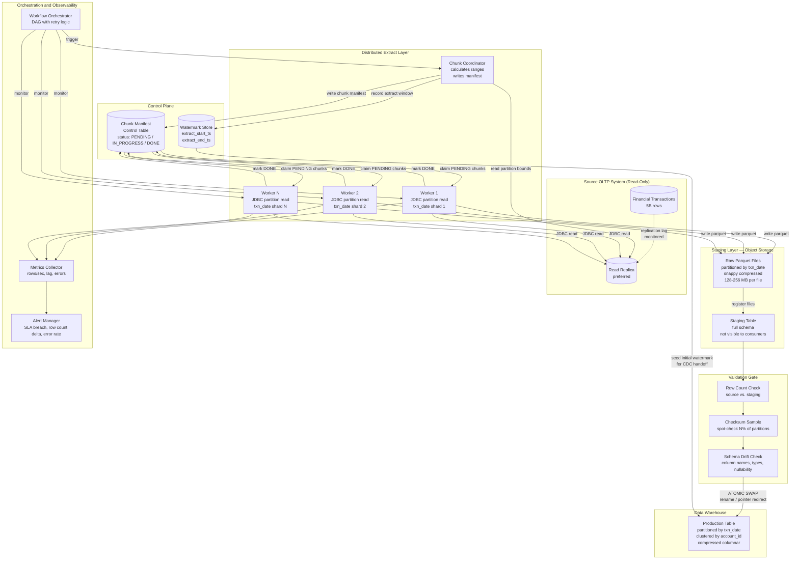

<!-- data-ingestion-patterns: Full Load — OLTP Financial Transactions to Data Warehouse at 5-Billion-Row Scale -->

# Full Load — OLTP Financial Transactions to Data Warehouse at 5-Billion-Row Scale


---

## Problem Statement

Bulk-loading five billion rows from a production OLTP financial transactions table is simultaneously a throughput problem, a concurrency problem, and a correctness problem. The source system is live — every query you run competes with online transaction processing. Read locks held during a naive full scan will degrade production query latency. Connection pool exhaustion from unthrottled parallel reads will take the source offline. And because this is financial data, a silent partial load is worse than a failed load: downstream consumers believing they have a complete dataset when they do not is an audit liability.

The extract must also be resumable. A full load of five billion rows at realistic network throughput will take six to twelve hours. Assuming the job never crashes in that window is an operational mistake, not an engineering decision. Without checkpointing, a failure at hour ten means starting over — doubling or tripling the total load time and extending the window during which the source system bears extract load. The checkpoint design must be colocated with the extract logic, not bolted on afterward.

Finally, this is a one-time historical backfill with hard correctness requirements. The data must reflect inserts, updates, and hard deletes as they existed at a specific point in time. After handoff to change-data-capture for ongoing replication, the warehouse table becomes the authoritative historical record. Any rows missing from the initial load are permanently lost — the OLTP system's transaction log will have rolled past the relevant positions before anyone notices the gap. The partition strategy, isolation level, and target write semantics must all be designed around correctness first, then throughput.

---

## Clarifying Questions

A senior data engineer would ask the following before writing a single line of code. These questions are not procedural — each one eliminates an entire class of design decision.

### Source Schema and Volume

1. **What is the primary key structure?** Is it a single monotonically increasing integer (auto-increment), a composite key, or a UUID? This determines whether the partition key is built-in or must be derived. A UUID primary key requires hash bucketing; an auto-increment ID can be used directly for range partitioning.

2. **What is the approximate row size in bytes?** Five billion rows at 200 bytes per row is one terabyte; at 2,000 bytes it is ten terabytes. This changes the number of partitions needed, target file sizing strategy, and whether the extract fits in a single pass or must be staged in chunks.

3. **Is there a reliable high-watermark column — a `created_at`, `updated_at`, or `txn_date` — that is indexed on the source?** The partition column must be indexed on the OLTP side or the extract query will force a full table scan on every partition read, multiplying source load by the number of partitions.

4. **Are there any wide or LOB columns — text fields, JSON blobs, binary attachments?** These affect row serialization overhead and whether columnar compression ratios will be good or poor on the target.

### Data Correctness and Consistency

5. **At what point-in-time does the warehouse snapshot need to be consistent?** Is the requirement "as of end of business day yesterday," or is it "as of whenever the extract completes"? A rolling extract across eight hours will see rows at different ages. If strict point-in-time consistency is required, the design changes significantly.

6. **How are deletes handled in the OLTP system today — are they hard deletes, soft deletes with an `is_deleted` flag, or tombstone records?** The full load captures the current state of the table. Hard-deleted rows are simply absent. If the downstream CDC system needs to know what was deleted before handoff, you need a different approach than a plain extract.

7. **Are there rows that must never appear in the warehouse due to PII regulations, data residency rules, or contractual obligations?** A five-billion-row financial table almost certainly contains regulated data. Filtering or masking must be decided before the extract runs, not after.

### Source System Constraints

8. **What is the source database's connection pool limit, and how many connections are currently in use during peak hours?** Each parallel extract worker opens one connection to the source. With 32 workers, you need 32 available connections. Exceeding the pool limit will not just fail your job — it will reject connections from the application itself.

9. **Is there a read replica available, or must the extract run against the primary?** A read replica is strongly preferred for a multi-hour, high-concurrency extract. Running against the primary is possible but requires aggressive connection throttling and off-peak scheduling.

10. **What is the network bandwidth and latency between the source system and the compute cluster running the extract?** This is often the actual bottleneck on large extracts, not CPU or source DB capacity. A 10 Gbps link between source and compute is very different from a cross-region extract over 1 Gbps.

### Target and Operational

11. **What is the target table's intended access pattern — full scans over date ranges, point lookups by account or transaction ID, or both?** This determines the partition key and clustering key on the warehouse side. A date-range partition key is almost always correct for a financial transactions table; the clustering key depends on the query pattern.

12. **Who consumes the warehouse table after the full load completes, and when do they need it available?** If downstream jobs depend on the table being fully available by 6 AM, that constrains your extract window, compression choices, and whether you can afford a staging-then-swap approach (which adds a copy or rename step at the end).

---

## Hard Constraints

The following are non-negotiables. Any solution that violates them is disqualified regardless of its other properties.

- **Zero production impact on the source OLTP system.** No table locks, no explicit shared locks, no queries that cause sequential scans on unindexed columns. The source team must not be able to detect that the extract is running.
- **Resumable from any failure point without data re-extraction from scratch.** A crash at any stage — extract, transform, or load — must be recoverable by restarting from the last completed checkpoint, not from the beginning.
- **Idempotent writes to the target.** Re-running any chunk of the extract must produce the same result as running it once. The target must never contain duplicate rows as a result of a retry.
- **Atomic table availability.** The warehouse table must transition from "not present" to "fully populated and consistent" in a single atomic operation. Consumers must never observe a partially loaded table.
- **Point-in-time consistency within defined bounds.** Rows extracted must reflect the state of the source table at a documented timestamp. The acceptable consistency window must be agreed with the business before the load runs.
- **Documented row count and checksum validation before the swap.** The target row count must be validated against a source count query, and a sample checksum must be verified, before the staging table is promoted to production.
- **No schema changes on the source.** The extract must work with existing indexes and the existing schema. No temporary columns, no temporary indexes, no `ANALYZE` operations during business hours.

---

## Architecture Diagram



---

## Solution Design

### Layer 1: Source Analysis and Partition Key Selection

Before a single extract query runs, execute the following analysis queries against the read replica during a low-traffic window. These queries are read-only and index-friendly.

**Step 1: Profile the distribution of the intended partition column.**

For a financial transactions table, `txn_date` (a date or date-truncated timestamp column) is almost always the correct partition key. It is:
- Indexed on the source (required for transaction queries and regulatory reporting)
- Roughly uniform in distribution across business days (avoiding skew)
- Semantically meaningful for the target partition scheme
- Already used by application queries, meaning the query planner will use the index

Run a date histogram to confirm uniformity:

```sql
SELECT
    DATE_TRUNC('month', txn_date)   AS month,
    COUNT(*)                         AS row_count,
    COUNT(*) * 1.0 / SUM(COUNT(*)) OVER () AS pct_of_total
FROM financial_transactions
GROUP BY 1
ORDER BY 1;
```

If any single month contains more than 15% of total rows (high skew), switch to daily granularity. If a single day contains more than 5% of total rows, switch to hourly or add a secondary hash bucket.

**Step 2: Calculate partition count.**

```
Target rows per partition:    10,000,000  (10M rows, manageable chunk)
Total rows:                   5,000,000,000
Required partitions:          500

But:
  Parallelism of compute cluster:    64 executor cores
  Practical partition multiplier:    4x (for task straggler tolerance)
  Maximum concurrent JDBC connections to source: 32 (negotiate with source team)

Effective numPartitions:   min(500, 32) = 32 parallel connections
  → Each connection reads:   5B / 32 = ~156M rows
  → Extract will be chunked into 500 logical chunks, 32 at a time
```

The resolution here is to separate the concept of JDBC parallelism (bound by source connection pool) from the concept of logical chunk count (bound by resumability granularity). Write 500 logical chunks to the manifest table; process them 32 at a time.

**Step 3: Determine the extract window bounds.**

```sql
SELECT
    MIN(txn_date) AS lower_bound,
    MAX(txn_date) AS upper_bound,
    COUNT(DISTINCT txn_date) AS distinct_dates
FROM financial_transactions;
```

Record these values. They become the `lowerBound` and `upperBound` parameters for the distributed extract, and the `extract_start_ts` / `extract_end_ts` values stored in the watermark table for CDC handoff.

---

### Layer 2: Chunk Manifest Design and Checkpointing

The chunk manifest table is the heart of the resumability design. It must be created in a durable metadata store (a control database, or a dedicated metadata schema in the warehouse) before any extract work begins.

```sql
CREATE TABLE extract_chunk_manifest (
    chunk_id          SERIAL PRIMARY KEY,
    source_table      VARCHAR(255)     NOT NULL,
    partition_col     VARCHAR(128)     NOT NULL,
    range_start       DATE             NOT NULL,   -- inclusive
    range_end         DATE             NOT NULL,   -- exclusive
    status            VARCHAR(20)      NOT NULL DEFAULT 'PENDING',
                                       -- PENDING / IN_PROGRESS / DONE / FAILED
    worker_id         VARCHAR(128),               -- which worker claimed this chunk
    claimed_at        TIMESTAMP WITH TIME ZONE,
    completed_at      TIMESTAMP WITH TIME ZONE,
    source_row_count  BIGINT,                     -- populated on completion
    output_path       TEXT,                       -- object storage path written
    retry_count       INT              NOT NULL DEFAULT 0,
    error_message     TEXT,
    created_at        TIMESTAMP WITH TIME ZONE NOT NULL DEFAULT NOW(),
    updated_at        TIMESTAMP WITH TIME ZONE NOT NULL DEFAULT NOW()
);

CREATE INDEX idx_manifest_status ON extract_chunk_manifest(status, chunk_id);
CREATE INDEX idx_manifest_source ON extract_chunk_manifest(source_table, status);
```

**Chunk generation logic (run once before extract starts):**

```python
# Generate one row per calendar date in the extract range
# Adjust granularity based on row distribution analysis
def generate_chunks(lower_bound, upper_bound, source_table):
    chunks = []
    current = lower_bound
    while current < upper_bound:
        next_date = current + timedelta(days=1)  # daily granularity
        chunks.append({
            "source_table":   source_table,
            "partition_col":  "txn_date",
            "range_start":    current,
            "range_end":      next_date,
            "status":         "PENDING"
        })
        current = next_date
    return chunks

# Bulk insert all chunks in a single transaction
# This is idempotent if you check for existing rows first
```

**Worker claim logic (each worker runs this in a loop):**

```sql
-- Claim next available chunk atomically (SELECT FOR UPDATE SKIP LOCKED)
UPDATE extract_chunk_manifest
SET    status     = 'IN_PROGRESS',
       worker_id  = :worker_id,
       claimed_at = NOW(),
       updated_at = NOW()
WHERE  chunk_id = (
    SELECT chunk_id
    FROM   extract_chunk_manifest
    WHERE  status = 'PENDING'
    ORDER  BY chunk_id ASC
    LIMIT  1
    FOR    UPDATE SKIP LOCKED
)
RETURNING chunk_id, range_start, range_end, output_path;
```

`SKIP LOCKED` ensures multiple workers never claim the same chunk. This is the correct concurrency primitive for a worker-pool pattern.

**On worker crash recovery:** Any chunk left in `IN_PROGRESS` state for more than 2x the expected chunk processing time is re-queued to `PENDING` by a separate watchdog process. The watchdog runs every five minutes:

```sql
UPDATE extract_chunk_manifest
SET    status      = 'PENDING',
       retry_count = retry_count + 1,
       error_message = 'Recovered from stalled IN_PROGRESS by watchdog',
       updated_at  = NOW()
WHERE  status      = 'IN_PROGRESS'
AND    claimed_at  < NOW() - INTERVAL '60 minutes'
AND    retry_count < 3;

-- Chunks that have failed 3 times are escalated to FAILED for manual review
UPDATE extract_chunk_manifest
SET    status = 'FAILED',
       updated_at = NOW()
WHERE  status = 'IN_PROGRESS'
AND    claimed_at < NOW() - INTERVAL '60 minutes'
AND    retry_count >= 3;
```

---

### Layer 3: JDBC Extract Configuration

Each worker opens a JDBC connection to the read replica and extracts one chunk. The connection must be configured to minimize source impact.

**Critical JDBC parameters:**

```python
jdbc_options = {
    # Isolation level: READ_UNCOMMITTED prevents shared locks on the source
    # For financial data where dirty reads are not acceptable, use
    # READ_COMMITTED and accept slightly higher source contention
    "isolationLevel":       "READ_COMMITTED",

    # Fetch size controls how many rows are buffered per network round-trip
    # Too small: high network overhead. Too large: OOM on executor.
    # 50,000-100,000 is typical for wide financial rows (~500 bytes/row)
    "fetchsize":            50000,

    # Connection timeout: fail fast rather than hanging
    "connectTimeout":       30,
    "socketTimeout":        3600,   # 1 hour max for a single chunk

    # Push down predicates to the source (do not let compute engine re-filter)
    "pushDownPredicate":    True,
    "pushDownFilters":      True,

    # Disable auto-commit: read-only transactions, no accidental writes
    "autocommit":           False,
}

# The partition query for this chunk
query = f"""
    (SELECT *
     FROM   financial_transactions
     WHERE  txn_date >= DATE '{chunk.range_start}'
     AND    txn_date <  DATE '{chunk.range_end}') AS t
"""
```

**Why `READ_COMMITTED` for financial data instead of `READ_UNCOMMITTED`:** Dirty reads on a financial transactions table can produce rows that were never committed — transactions rolled back after the read would appear in the warehouse as valid transactions. For any regulatory or audit use case, this is unacceptable. `READ_COMMITTED` is the minimum acceptable isolation level. The cost is that the database must maintain row version visibility information during the read, which adds modest overhead. This is acceptable.

**Why not `SERIALIZABLE` or `REPEATABLE_READ`:** These isolation levels hold range locks or snapshot locks for the duration of the transaction, which for a multi-hour extract would block all concurrent writes in the date range being extracted. Never use these for bulk extract from a live OLTP system.

---

### Layer 4: Parquet File Design and Object Storage Layout

Each completed chunk is written as one or more Parquet files to a staging location in object storage. The file layout determines both extract performance and downstream query performance.

**Directory structure:**

```
s3://data-lake-staging/
  financial_transactions/
    extract_run_id=20240115T220000Z/    ← run-scoped staging prefix
      txn_date=2020-01-01/
        part-00001.snappy.parquet       ← ~128-256 MB target
        part-00002.snappy.parquet
      txn_date=2020-01-02/
        part-00001.snappy.parquet
      ...
      txn_date=2024-01-14/
        part-00001.snappy.parquet
      _SUCCESS                          ← written last; signals extract completion
      _manifest.json                    ← row counts, file paths, checksums
```

**Why Parquet:**
- Columnar format enables predicate pushdown in the warehouse query engine — queries filtering by `account_id` or `txn_type` scan only the relevant column files, not full rows
- Dictionary encoding compresses string columns (currency codes, transaction type enums, status codes) by 80-90%
- Run-length encoding compresses the `txn_date` partition column to near-zero overhead since all values within a file are identical or nearly identical
- Schema embedding in file footer enables schema evolution detection without a separate schema registry

**Why Snappy compression over GZIP:**
- Snappy is CPU-optimized for fast decompression at modest compression ratios (~2-3x for financial data)
- GZIP achieves slightly better compression ratios but decompresses 3-5x slower
- For a warehouse where query latency matters more than storage cost, Snappy is the standard choice
- For archive storage where query latency is irrelevant, ZSTD level 3 is the best tradeoff

**Target file size calculation:**

```
Row size estimate:          400 bytes (typical financial transaction row)
Rows per file target:       500,000 (manageable for memory-mapped reads)
Uncompressed file size:     400 * 500,000 = 200 MB
Compressed file size:       200 MB / 2.5 = 80 MB

For a date with 5M rows (average across 5B rows / 1000 days):
  Files needed per date:    5,000,000 / 500,000 = 10 files per partition
  Compressed per date:      10 * 80 MB = 800 MB per date partition

Total compressed size estimate:
  1000 dates * 800 MB = 800 GB object storage for staging
```

**Row group sizing within Parquet files:** Each Parquet file contains one or more row groups. For warehouse bulk loads, target 128 MB row groups. This aligns with the default page cache size of most column-store query engines and maximizes predicate pushdown efficiency.

---

### Layer 5: Idempotency and Atomicity Strategy

The extract must be idempotent at two levels: chunk level and table level.

**Chunk-level idempotency:** Each chunk writes to a path that includes the chunk ID and a content hash:

```
extract_run_id=20240115T220000Z/txn_date=2020-01-01/chunk_id=42/part-00001.snappy.parquet
```

If chunk 42 is re-run after a crash, it writes to the same path prefix. The previous partial output is overwritten atomically (object storage PUT is atomic). Only after all files for the chunk are written does the worker update the manifest to `DONE`. A reader never sees a partial chunk — either the manifest says `DONE` (all files present) or `IN_PROGRESS` (files may be partial).

**Table-level atomicity:** The warehouse never exposes the staging table to consumers. The full load is executed into a staging table (e.g., `financial_transactions_staging_20240115`). Only after all chunks are `DONE` and all validations pass is the staging table atomically renamed or swapped with the production table name.

```sql
-- Atomic swap (warehouse-specific syntax varies)
ALTER TABLE financial_transactions       RENAME TO financial_transactions_backup_20240115;
ALTER TABLE financial_transactions_staging_20240115 RENAME TO financial_transactions;

-- Drop backup after 48 hours (keep for emergency rollback)
-- DROP TABLE financial_transactions_backup_20240115;
```

If the rename operation is not atomic in the target system, use a view:

```sql
-- Before extract
CREATE VIEW financial_transactions AS SELECT * FROM financial_transactions_v1;

-- After extract completes and validates
CREATE OR REPLACE VIEW financial_transactions AS SELECT * FROM financial_transactions_v2;
DROP TABLE financial_transactions_v1;
```

**Why not write directly to the production table:** A direct write leaves the table in a partially loaded state throughout the entire extract duration. Consumers querying during the load will see incomplete results. If the load fails at 80%, the remaining 20% of rows are missing with no automated detection. There is no clean rollback path. The staging-then-swap pattern eliminates all three problems.

---

### Layer 6: Data Warehouse Table Design

The production table design must support the access patterns that financial analysts and downstream pipelines will use, while also making the full load efficient.

**Partition strategy:**

```sql
-- Conceptual DDL (generic column-store warehouse syntax)
CREATE TABLE financial_transactions (
    txn_id              BIGINT          NOT NULL,
    account_id          VARCHAR(32)     NOT NULL,
    txn_date            DATE            NOT NULL,     -- partition key
    txn_timestamp       TIMESTAMP       NOT NULL,
    txn_type            VARCHAR(32)     NOT NULL,
    txn_amount          DECIMAL(18, 4)  NOT NULL,
    currency_code       CHAR(3)         NOT NULL,
    merchant_id         VARCHAR(64),
    merchant_category   VARCHAR(32),
    channel             VARCHAR(16),
    status              VARCHAR(16)     NOT NULL,
    raw_event_id        VARCHAR(128),   -- source system primary key for tracing
    -- Warehouse metadata columns
    _load_ts            TIMESTAMP       NOT NULL,     -- when this row was loaded
    _extract_run_id     VARCHAR(64)     NOT NULL,     -- which extract run wrote this row
    _source_row_hash    VARCHAR(64),                  -- SHA-256 of key source columns
    PRIMARY KEY (txn_date, txn_id)                    -- composite for uniqueness checks
)
PARTITION BY RANGE (txn_date)   -- monthly or daily partitions
CLUSTER BY (account_id, txn_timestamp);  -- sort key for account-centric queries
```

**Why `txn_date` as partition key:**
- All regulatory reporting queries filter by date range first
- Time-range partition pruning eliminates entire partitions from scan
- Future CDC ingestion writes to the current-date partition without touching historical partitions
- Partition-level operations (add, drop, truncate) align with data retention policies

**Why `account_id` as first clustering key:**
- Most analytical queries filter or group by account: "all transactions for account X," "fraud detection across account Y's history"
- Clustering by `account_id` collocates all rows for the same account within the columnar sort order, enabling zone maps to skip row groups that don't contain the target account
- `txn_timestamp` as second clustering key within an account produces chronological ordering, which is the natural access pattern for account history queries

**Why not cluster by `txn_id`:** Clustering by a sequential integer provides no query benefit because no analytical query filters on `txn_id` alone. It would spread account data randomly across the sort order, defeating zone map optimization.

---

### Layer 7: Merge Strategy — Initial Load vs. Ongoing CDC Handoff

**Initial load (this pattern):** The staging table is built from scratch via COPY or bulk insert. No MERGE is needed because there are no pre-existing rows to reconcile. The load is INSERT-only into the staging table, then an atomic rename/swap.

```sql
-- Bulk load into staging (warehouse COPY command, highly optimized path)
COPY financial_transactions_staging
FROM 's3://data-lake-staging/financial_transactions/extract_run_id=20240115T220000Z/'
FORMAT PARQUET
PARTITION BY txn_date;
-- Or equivalent distributed load command for your target system
```

**First CDC run after handoff:** The CDC pipeline will begin emitting events from the LSN/binlog position recorded at the time the snapshot was taken. The first CDC MERGE will encounter rows that already exist in the warehouse (from the full load) and apply updates/deletes on top. This requires a MERGE (UPSERT) operation:

```sql
MERGE INTO financial_transactions AS target
USING cdc_staging_batch AS source
ON target.txn_id = source.txn_id
   AND target.txn_date = source.txn_date  -- include partition key for pruning

WHEN MATCHED AND source._cdc_op = 'D' THEN
    DELETE

WHEN MATCHED AND source._cdc_op IN ('U', 'R') THEN
    UPDATE SET
        txn_amount      = source.txn_amount,
        status          = source.status,
        _load_ts        = source._load_ts,
        -- ... other mutable columns
        _source_row_hash = source._source_row_hash

WHEN NOT MATCHED AND source._cdc_op != 'D' THEN
    INSERT (txn_id, account_id, txn_date, txn_timestamp, ...)
    VALUES (source.txn_id, source.account_id, source.txn_date, ...)
;
```

**Watermark seeding for CDC handoff:** Before the full load job exits, it records the extract end timestamp into the watermark store. The CDC pipeline reads this value as its starting position.

```sql
INSERT INTO ingestion_watermarks (
    table_name,
    watermark_type,
    watermark_value,
    set_by_run_id,
    created_at
) VALUES (
    'financial_transactions',
    'CDC_START_POSITION',
    :extract_end_timestamp,   -- the timestamp when the full snapshot was taken
    :extract_run_id,
    NOW()
);
```

---

### Layer 8: Snapshot Consistency and the Read Replica

For a read replica to provide a consistent snapshot, the replica must be:

1. **Not lagging significantly.** A replica with 30+ minutes of lag will produce a snapshot that is inconsistent even within itself — rows from the replica's "old" state will be mixed with rows from newer flushes as the replica catches up during the extract. Monitor `replication_lag_seconds` before starting.

2. **Not promoted during the extract.** If the primary fails and the replica is promoted during your multi-hour extract, your in-progress extraction is reading from a system that has just become the primary and is being written to. This will not cause data corruption (reads are reads) but it will introduce inconsistency if the replica catches up and applies delayed transactions mid-extract.

**Recommended pre-flight check:**

```sql
-- On replica, before starting extract
SELECT
    EXTRACT(EPOCH FROM (NOW() - pg_last_xact_replay_timestamp())) AS replica_lag_seconds;
-- Proceed only if lag_seconds < 300 (5 minutes)

-- Record the replica's current LSN as the extract start position
SELECT pg_last_wal_replay_lsn() AS extract_start_lsn;
-- This value is stored in the watermark table for CDC handoff alignment
```

---

## Trade-offs

| Decision | Option A | Option B | Recommendation | Why |
|---|---|---|---|---|
| **Partition column** | Auto-increment integer (`txn_id`) | Business date (`txn_date`) | `txn_date` | Integer ranges partition evenly by count but produce no semantic alignment with the warehouse partition scheme. `txn_date` partitions align with both the target table design and regulatory query patterns. Skew risk is manageable for a financial table with daily transaction volumes. |
| **JDBC isolation level** | `READ_UNCOMMITTED` (no source locking) | `READ_COMMITTED` (committed rows only) | `READ_COMMITTED` | `READ_UNCOMMITTED` reads dirty rows — uncommitted transactions that may be rolled back. For financial data this can produce ghost transactions in the warehouse. The modest performance cost of `READ_COMMITTED` is worth the correctness guarantee. |
| **Extract target format** | Row-based format (CSV, Avro) | Columnar format (Parquet) | Parquet | Row formats require full row deserialization for every query. Columnar format enables predicate pushdown, reducing query I/O by 10-100x. The only reason to choose row format is if the downstream consumer cannot read Parquet — which is rare in modern data platforms. |
| **Checkpointing granularity** | Per-day chunks (~10M rows) | Per-hour chunks (~400K rows) | Per-day | Finer granularity means more manifest rows and more atomic object storage operations, but faster recovery after failure. For a 5B-row table with balanced daily distribution, per-day chunks are the right balance. If any day has >100M rows, split that day into hourly chunks. |
| **Atomicity mechanism** | Write directly to production table | Staging-then-swap | Staging-then-swap | Direct writes expose consumers to partial data throughout the load. Staging-then-swap is more complex but provides a clean correctness boundary. The additional storage cost (2x peak) is the only drawback. |
| **Compression codec** | GZIP (high ratio, slow decompress) | Snappy (moderate ratio, fast decompress) | Snappy for active data, ZSTD for archive | Snappy decompresses 3-5x faster than GZIP, which matters for interactive queries. ZSTD at level 3 provides GZIP-comparable ratios with near-Snappy decompression speed, making it ideal for cold archive data that is still occasionally queried. |
| **Source vs. replica extract** | Primary database | Read replica | Read replica always | Extracting from the primary competes with application writes and reads. For a multi-hour extract at 32 concurrent connections, this will degrade application response times measurably. A read replica completely isolates the extract workload. |

---

## Failure Modes and Recovery

| Failure Scenario | Detection Method | Recovery Strategy | Prevention |
|---|---|---|---|
| **Worker crash mid-chunk** | Chunk manifest watchdog: `IN_PROGRESS` for >60 min with no heartbeat update | Watchdog resets status to `PENDING`; next available worker re-claims and re-runs the chunk. Partial files in object storage are overwritten on retry. | Set worker heartbeat interval to 5 min; set watchdog threshold to 3x expected chunk duration. |
| **Read replica lag spike** | Pre-flight check fails: `replica_lag_seconds > 300`; also monitor mid-extract via separate probe | Pause extract, wait for replica to catch up, resume. If lag is caused by replica overload from extract, reduce `numPartitions` by 50%. | Monitor replica lag independently of the extract; set alert at 60 seconds lag before starting. |
| **Source connection pool exhausted** | JDBC connection timeout errors in worker logs; source DB alert on max connections | Reduce `numPartitions` to leave headroom. Implement exponential backoff on connection retry. | Pre-negotiate connection budget with source team; test at target parallelism in a non-production window. |
| **Object storage write failure** | Worker logs `I/O error` or `timeout` on Parquet write; chunk remains `IN_PROGRESS` | Watchdog recovers chunk to `PENDING`; retry writes to same output path (overwrite). | Use multi-part upload with retry logic; set object storage client retry count to 5 with exponential backoff. |
| **Validation row count mismatch** | Post-extract validation step: `source_count != staging_count` | Do not swap to production. Investigate which chunks have incorrect `source_row_count` in manifest. Re-run suspect chunks. | Validate row count at chunk level (compare `source_row_count` in manifest against actual Parquet row count) in addition to table-level validation. |
| **Disk/storage exhaustion on staging** | Object storage quota alert; COPY command fails with `no space` error | Free space by compressing intermediate files further or expanding quota. Implement pre-flight check that estimates required staging space before extract starts. | Pre-calculate storage requirement (compressed size estimate * 1.5 safety margin) and verify quota before starting. |
| **Schema drift on source during extract** | Parquet schema validation step fails: column added, dropped, or renamed mid-extract | Stop extract. Manually reconcile schema across completed and pending chunks. Decide whether to re-run affected chunks with the new schema or continue with the old schema. | Lock schema change deployments on the source system during the extract window. Confirm with source team before starting. |
| **CDC handoff gap** | First CDC run finds rows in the changelog between `extract_start_lsn` and `extract_end_lsn` that are not in the warehouse | Apply the gap rows via a targeted MERGE using the CDC changelog between the two LSN positions | Record both `extract_start_lsn` and `extract_end_lsn` in the watermark table. The CDC system uses `extract_end_lsn` as its start position, but a reconciliation job covers the window between start and end LSN for updates that occurred during the extract. |

---

## Observability Checklist

### Extract Progress Metrics

- **Chunks completed / total chunks** — primary progress indicator; should advance monotonically
- **Rows extracted per second** — rolling 5-minute average; alert if drops below 50% of baseline for 15+ minutes (indicates source contention or worker issue)
- **Active worker count** — should equal configured parallelism; alert on drop to zero
- **Bytes written to staging per second** — throughput indicator; correlates with network saturation
- **Manifest `FAILED` chunk count** — alert immediately on any value > 0

### Source System Health (read replica)

- **Replica lag seconds** — alert at 300 seconds; pause extract at 600 seconds
- **Open connections from extract workers** — must not exceed negotiated connection budget
- **Slow query count on source** — alert if any extract query exceeds 5 minutes wall time (indicates missing index or partition pruning failure)
- **Source database CPU utilization** — alert if extract causes >20% increase over baseline

### Data Quality Gates (run before swap)

- **Staging row count vs. source row count** — must match within 0.01% (allow for rows inserted/deleted during extract window)
- **Null rate on non-nullable columns** — must be 0%
- **Date range coverage** — `MIN(txn_date)` and `MAX(txn_date)` in staging must match expected bounds exactly
- **Duplicate primary key count** — must be 0 (`COUNT(*) != COUNT(DISTINCT txn_id)` is a blocking failure)
- **Sample checksum validation** — SHA-256 of a random 1% sample compared against the same rows queried directly from source

### Post-Load Health

- **Production table row count** — record at swap time; alert if it changes unexpectedly outside of CDC windows
- **Query performance baseline** — run a set of representative analytical queries immediately after swap; compare execution time against pre-load benchmarks
- **CDC pipeline lag after handoff** — first CDC run should process its initial batch within expected latency bounds; alert if first batch takes 5x longer than steady-state

### Alerting Thresholds

| Alert | Threshold | Severity | Action |
|---|---|---|---|
| Extract throughput drops | < 50% of baseline for 15 min | WARNING | Investigate worker logs |
| Replica lag | > 300 seconds | WARNING | Pause extract |
| Replica lag | > 600 seconds | CRITICAL | Stop extract, investigate |
| FAILED chunks in manifest | > 0 | CRITICAL | Page on-call engineer |
| Row count mismatch at validation | > 0.01% delta | CRITICAL | Block swap, investigate |
| Duplicate primary keys | > 0 | CRITICAL | Block swap, investigate |
| Extract not completing within SLA | > 12 hours elapsed | WARNING | Assess parallelism increase |

---

## Interview Answer Template

When asked about full loading a large OLTP table into a data warehouse, use the **constraint-elimination technique**: before proposing any solution, state the constraints that make the naive approach fail. This demonstrates senior-level thinking and structures your answer clearly.

### Opening (30 seconds)

"Before I describe the solution, let me state the constraints that rule out the obvious approaches.

A naive `SELECT *` would take a single connection and serialize the entire table — at any reasonable throughput that's a multi-day operation. Parallel reads with no coordination would exhaust the OLTP connection pool and degrade production application performance. Writing directly to the production warehouse table during the load exposes consumers to partial data. And without checkpointing, any failure requires restarting from scratch.

So the solution has to address four things: parallel extraction within source connection limits, resumability from any failure point, atomicity of the warehouse table swap, and correct handoff state for the CDC system that takes over afterward."

### Core Design (2 minutes)

"The extract layer uses a chunk manifest table. Before any extract starts, I decompose the full date range into one chunk per calendar day — for five billion rows over roughly three years, that's about a thousand chunks. I pre-populate them all as PENDING in a control table.

Workers claim chunks using `SELECT FOR UPDATE SKIP LOCKED` — a concurrency primitive that prevents two workers from claiming the same chunk. Each worker opens one JDBC connection to the read replica, not the primary, with `READ_COMMITTED` isolation to avoid dirty reads on financial data. It reads its assigned date range, writes compressed columnar files to a staging area in object storage, and marks the chunk DONE in the manifest.

I parallelize up to 32 workers — the connection budget I negotiate with the source team — and process all thousand chunks 32 at a time. If a worker crashes, a watchdog resets its chunk to PENDING after a timeout threshold, and another worker picks it up. The chunk write is idempotent because it overwrites the same object storage path.

When all chunks are DONE, I run a validation gate: row count against source, null checks, duplicate primary key check, and a sample checksum. Only if all gates pass do I atomically swap the staging table to the production name.

Finally, I record the extract start and end LSN positions in a watermark table. The CDC pipeline reads that as its starting position, so there's no gap between the full load and the first incremental run."

### Trade-offs Acknowledgment (30 seconds)

"The main trade-offs here: I'm using `READ_COMMITTED` instead of `READ_UNCOMMITTED` — that means the source has to maintain row visibility information during the read, which adds modest overhead. I'm doing staging-then-swap instead of direct writes — that doubles peak storage cost. And I'm using per-day chunks rather than finer granularity — that's a deliberate choice to keep the manifest table small and the recovery window bounded to one day of re-extraction.

If the source team said they could not give me 32 connections, I'd reduce parallelism and extend the extract window. If storage was constrained, I'd process chunks sequentially and clean up as I go rather than staging everything before the swap."

### Handling the Follow-up on Deletes (30 seconds)

"The full load captures the current state of the table — hard-deleted rows are simply absent. That's correct for a point-in-time snapshot. The ongoing CDC pipeline captures future deletes via the transaction log. For deletes that happened historically before the full load, I ask the business whether they matter. Usually they don't — the warehouse is interested in the current and future state of transactions, not in records that were purged from the OLTP system. If they do matter, I'd need a separate delete log or soft-delete mechanism on the source, which is a source system design question, not a warehouse design question."
