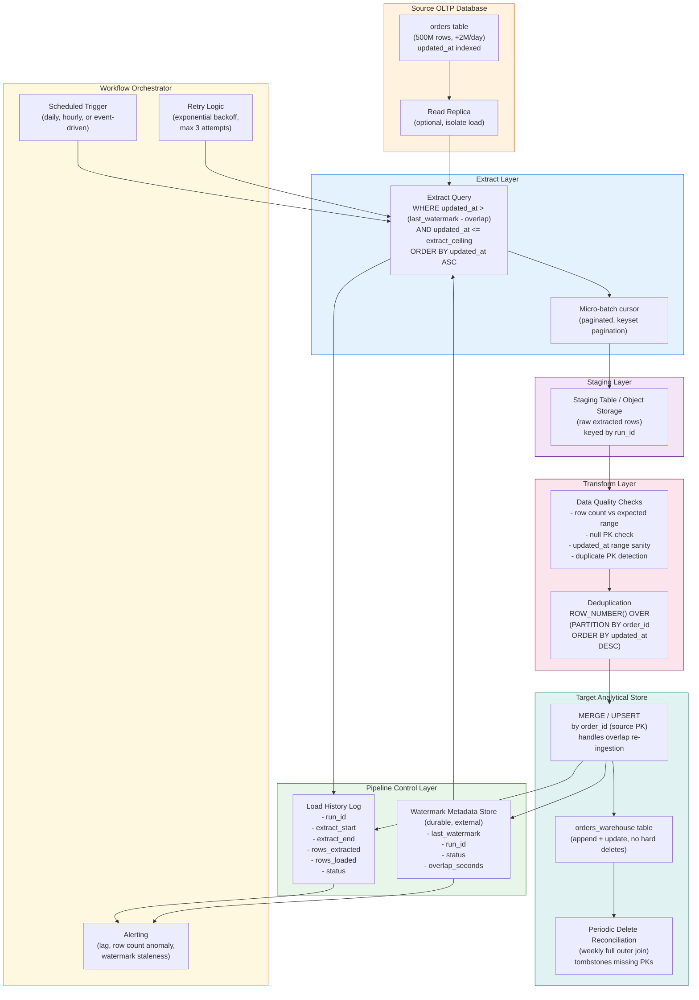

# Incremental High-Watermark Ingestion Pattern


---

## Problem Statement

You have a 500-million-row orders table in a production transactional database growing at 2 million rows per day. Running a full extract every day is not viable: at typical OLTP read throughput it would take hours, saturate the connection pool, degrade production query latency, and transfer 500+ GB of data that has not changed. The solution is incremental ingestion — extracting only the rows that changed since the last successful load.

The high-watermark pattern solves this by tracking the maximum value of a monotonically increasing change-tracking column, typically a last-modified timestamp. Each load extracts only rows whose change-tracking column exceeds the stored watermark. After a successful load, the watermark advances to the new maximum observed. This reduces daily extract volume from 500 million rows to roughly 2 million — a 250x reduction in source query volume and proportional reduction in network, compute, and storage costs.

The pattern sounds simple but has a surprisingly large failure surface in production. Clock drift between application servers means the `updated_at` column is not perfectly monotonic — a row updated at 11:59 PM may not reach the database until 12:05 AM the next day, causing it to land below an already-advanced watermark. Hard deletes are invisible to the pattern entirely. The source index on the change-tracking column must support efficient range scans or the extract query performs a full table scan against a live OLTP database under production load. Watermark state must be stored durably and advanced atomically with the load completion, or a process crash between write and commit creates either silent data loss or duplicate processing depending on which side of the transaction boundary the crash lands. Each of these failure modes requires a deliberate design decision, and ignoring any of them will surface as a production incident.

---

## Clarifying Questions

A senior data engineer would ask the following questions before designing this pipeline. The answers directly determine which design choices are safe and which are not.

### Source System Characteristics

**Q1. Is `updated_at` set by the database or by the application?**
If set by the application, values may reflect the client machine's clock rather than the database server's clock. Clock drift between application servers can put rows out of temporal order. Database-generated timestamps (`DEFAULT NOW()` on update) are safer because they reflect a single clock source.

**Q2. Does the source table have an index on `updated_at`?**
The extract query `WHERE updated_at > :watermark` performs a range scan on this column. Without a dedicated index (or a composite index with `updated_at` as the leading column), the query is a full table scan. On a 500-million-row table under OLTP load, a full scan will lock buffer pool pages, spike I/O, and degrade production query performance. If there is no index and creating one is not possible, the entire architecture needs revisiting.

**Q3. What is the connection pool capacity on the source database, and how many connections can the ingestion pipeline safely consume?**
The source is under heavy OLTP load. Even with an index, each extract query holds a connection for its duration. If the ingestion pipeline opens multiple parallel connections (for partitioned reads), it competes for connection slots with production traffic. This determines whether single-threaded serial extraction is required or whether modest parallelism is safe.

**Q4. Does the application perform batch updates that write many rows with the same `updated_at` timestamp?**
If a batch job updates 50,000 rows and writes the same timestamp to all of them, any watermark landing in the middle of that batch will miss half the rows (or double-read them depending on boundary semantics). This affects whether the watermark boundary should use `>` or `>=` and whether the overlap window needs to be widened.

**Q5. Can you add a database trigger or soft-delete column, or is the schema locked?**
Soft deletes and delete-tracking flags require schema changes. If the schema is locked, deletes are undetectable via watermark and must be handled out-of-band.

### Delete and Change Tracking

**Q6. What is the business requirement for delete propagation?**
If deleted orders must be removed from the warehouse within the same SLA as inserts and updates, the watermark pattern alone cannot meet the requirement. The business answer determines whether a supplementary mechanism (periodic reconciliation, soft-delete enforcement, or a separate delete-capture pipeline) is architecturally required.

**Q7. Are there any columns that change without updating `updated_at`?**
Some applications update fields through direct SQL bypassing the ORM, or have columns managed by background jobs that do not touch the modification timestamp. Changes to those columns are silent to watermark-based ingestion.

### SLA and Correctness

**Q8. What is the acceptable latency between a row being committed in the source and it appearing in the warehouse?**
A once-daily batch load, an hourly micro-batch, and a near-real-time streaming extract all require different infrastructure choices. This also determines how wide the overlap window needs to be and whether late-arriving data within the SLA window is acceptable.

**Q9. What is the downstream consumer's tolerance for duplicate rows during the overlap window reprocessing?**
The overlap window strategy re-ingests rows that were already loaded. If downstream queries use `COUNT(*)` rather than `COUNT(DISTINCT order_id)`, they will double-count until deduplication runs. Understanding this determines whether idempotent writes (UPSERT by primary key) are required on every load or only during backfill.

**Q10. What happens if a load fails midway and the watermark does not advance?**
This is a question about failure recovery expectations. If the answer is "it retries automatically and catches up," the pipeline must be designed for idempotent re-extraction. If the answer is "an on-call engineer investigates," the observability requirements are higher but the design can be simpler.

### Operational and Governance

**Q11. Is there a requirement to audit what data was loaded in each run, and by whom?**
Audit requirements drive the design of the watermark metadata table and load history logging. Regulatory environments often require the ability to reconstruct the exact rows loaded in any historical run.

**Q12. Is there a data retention policy on the source that could cause rows to disappear before the next scheduled load?**
If source data is purged or archived after 90 days, and the pipeline falls behind by 91 days, the gap is unrecoverable via watermark. The recovery path must involve a snapshot from an archive system rather than a simple watermark reset.

---

## Hard Constraints

- **No full table scans on the source.** The source is under OLTP production load. Extract queries must use the index on `updated_at` exclusively. Queries that trigger table scans are a production reliability incident.
- **Watermark must be advanced atomically with load confirmation.** Advancing the watermark before the target write commits causes silent data loss on crash. Failing to advance the watermark after a successful write causes unnecessary re-extraction but is safe if writes are idempotent.
- **Extract queries must be read-only and low-priority on the source.** No locks beyond the minimum required for a consistent read. Set the connection's transaction isolation to READ COMMITTED or use a read replica.
- **The pipeline must be resumable without data loss.** Any component failure at any point in the extract-transform-load cycle must be recoverable by re-running the failed interval without manual intervention.
- **Deletes are not tracked by the source `updated_at` column.** Hard deletes must be handled by a separate mechanism or explicitly out of scope. This constraint must be documented and accepted by downstream consumers before go-live.
- **Clock drift between source systems is real and must be accounted for.** An overlap window of at least 5 minutes must be applied to every extract. High-risk tables (financial transactions, compliance data) require a minimum 48-hour overlap window.
- **All watermark state must be stored in durable external storage.** Watermark values cannot be stored in memory, local files, or in the pipeline process itself. A crash must not cause watermark loss.
- **Target writes must be idempotent.** The overlap window causes re-ingestion of already-loaded rows. Writes must use UPSERT semantics keyed on the source primary key to prevent duplicate rows.

---

## Architecture Diagram



---

## Solution Design

### Layer 1: Watermark Metadata Table Design

The watermark metadata store is the most critical component in the architecture. Its schema must support atomic updates, audit history, and multi-table management.

```sql
-- Primary watermark tracking table
CREATE TABLE ingestion_watermarks (
    table_name           VARCHAR(255)  NOT NULL,
    source_schema        VARCHAR(255)  NOT NULL,
    last_watermark       TIMESTAMP(6)  NOT NULL,  -- microsecond precision
    last_watermark_epoch BIGINT        NOT NULL,  -- Unix epoch millis, avoids DST issues
    last_run_id          UUID          NOT NULL,
    last_run_status      VARCHAR(20)   NOT NULL,  -- RUNNING / SUCCESS / FAILED
    overlap_seconds      INT           NOT NULL DEFAULT 300,  -- 5 min default
    created_at           TIMESTAMP     NOT NULL DEFAULT NOW(),
    updated_at           TIMESTAMP     NOT NULL DEFAULT NOW(),
    PRIMARY KEY (table_name, source_schema)
);

-- Immutable load history log (append-only, never updated after terminal state)
CREATE TABLE ingestion_run_history (
    run_id            UUID          NOT NULL PRIMARY KEY,
    table_name        VARCHAR(255)  NOT NULL,
    source_schema     VARCHAR(255)  NOT NULL,
    extract_start_wm  TIMESTAMP(6)  NOT NULL,  -- effective start (after overlap rewind)
    extract_end_wm    TIMESTAMP(6)  NOT NULL,  -- ceiling used for this run
    nominal_start_wm  TIMESTAMP(6)  NOT NULL,  -- last_watermark before overlap rewind
    rows_extracted    BIGINT,
    rows_loaded       BIGINT,
    rows_deduped      BIGINT,
    run_status        VARCHAR(20)   NOT NULL,
    started_at        TIMESTAMP     NOT NULL DEFAULT NOW(),
    completed_at      TIMESTAMP,
    error_message     TEXT,
    pipeline_version  VARCHAR(50),
    FOREIGN KEY (table_name, source_schema)
        REFERENCES ingestion_watermarks(table_name, source_schema)
);

-- Index to support recent history queries per table
CREATE INDEX idx_run_history_table_started
    ON ingestion_run_history (table_name, source_schema, started_at DESC);
```

**Design decisions explained:**

- `last_watermark_epoch` stores the same timestamp as an integer epoch. This is the field used in all arithmetic (overlap subtraction, comparison). Timestamp arithmetic across DST boundaries using wall-clock timestamps produces incorrect intervals. Epoch is always monotonic.
- `last_run_status = RUNNING` is written at job start. If the job crashes before updating to `SUCCESS` or `FAILED`, the next startup sees a stale `RUNNING` status and treats the previous run as failed, re-extracting from the previous watermark minus overlap. This is safe because target writes are idempotent.
- `overlap_seconds` is stored per table, not hardcoded in the pipeline. Financial tables get 172800 seconds (48 hours). Operational tables get 300 seconds (5 minutes). This allows per-table tuning without code changes.
- The run history table is append-only (never updated after `run_status` is set to a terminal state). This provides a complete audit trail for any historical run.

**Atomic watermark advancement — pseudocode:**

```python
def advance_watermark(conn, table_name, run_id, new_watermark, rows_loaded):
    """
    This must execute in a single transaction. The watermark is only advanced
    if and only if the load is confirmed successful. Never advance watermark
    before confirming the target write.
    """
    with conn.transaction():
        # 1. Confirm run is still in RUNNING state (guard against concurrent runs)
        result = conn.execute("""
            SELECT last_run_id, last_run_status
            FROM ingestion_watermarks
            WHERE table_name = %s
            FOR UPDATE
        """, [table_name])

        if result.last_run_id != run_id:
            raise ConcurrentRunConflict(
                f"Expected run_id {run_id}, found {result.last_run_id}"
            )
        if result.last_run_status != 'RUNNING':
            raise InvalidStateTransition(result.last_run_status)

        # 2. Advance watermark
        conn.execute("""
            UPDATE ingestion_watermarks
            SET last_watermark       = %s,
                last_watermark_epoch = EXTRACT(EPOCH FROM %s::timestamptz) * 1000,
                last_run_status      = 'SUCCESS',
                updated_at           = NOW()
            WHERE table_name = %s AND last_run_id = %s
        """, [new_watermark, new_watermark, table_name, run_id])

        # 3. Finalize run history
        conn.execute("""
            UPDATE ingestion_run_history
            SET run_status   = 'SUCCESS',
                rows_loaded  = %s,
                completed_at = NOW()
            WHERE run_id = %s
        """, [rows_loaded, run_id])
```

---

### Layer 2: Extract Query Design and Index Requirements

**The extract query must be bounded on both sides:**

```sql
-- CORRECT: bounded range with explicit ceiling
SELECT
    order_id,
    customer_id,
    order_status,
    total_amount,
    created_at,
    updated_at
FROM orders
WHERE updated_at > :extract_start          -- lower bound (watermark - overlap)
  AND updated_at <= :extract_ceiling       -- upper bound (NOW() at job start)
ORDER BY updated_at ASC, order_id ASC;    -- deterministic ordering for pagination
```

**Why the upper bound (`extract_ceiling`) is mandatory:**

Without an upper bound, rows written to the source after the extract query starts (but before it finishes) will be included in the current load but will not advance the watermark sufficiently. On the next run, those rows appear below the new watermark and are missed. The ceiling is set to `NOW()` at job start time (before the query executes) and held constant for the entire run. Any rows written after this timestamp will be picked up in the next run.

**Index requirements on the source:**

```sql
-- Minimum required: single-column index on the watermark column
CREATE INDEX idx_orders_updated_at ON orders (updated_at);

-- Better: composite index that also serves as a tiebreaker for keyset pagination
CREATE INDEX idx_orders_updated_at_id ON orders (updated_at ASC, order_id ASC);

-- Validate before pipeline go-live (must show Index Scan, not Seq Scan)
EXPLAIN SELECT order_id, updated_at
FROM orders
WHERE updated_at > '2024-01-01' AND updated_at <= '2024-01-02'
ORDER BY updated_at ASC, order_id ASC
LIMIT 100000;
```

**Without the index on `updated_at`, the extract performs a full sequential scan** of 500 million rows on a live OLTP database. This causes:
- Lock contention with production transactions on shared buffer pages
- Elevated I/O wait on the database server
- Extract query runtimes measured in hours rather than seconds
- Connection held open for the duration, consuming a scarce connection slot

If the index cannot be created (schema locked, DBA restriction), the only viable alternatives are:
1. Extract from a read replica (isolates OLTP from the scan load, but does not eliminate the scan itself)
2. Switch to a log-based change capture approach that reads from the transaction log rather than querying the table

**Keyset pagination for large extracts:**

For daily increments of 2 million rows, a single unbounded query is acceptable. For initial backfills or missed-day catch-up scenarios producing 50+ million rows in a single run, paginate using keyset pagination rather than OFFSET:

```sql
-- Page 1
SELECT order_id, updated_at, customer_id, order_status, total_amount, created_at
FROM orders
WHERE updated_at > :extract_start
  AND updated_at <= :extract_ceiling
ORDER BY updated_at ASC, order_id ASC
LIMIT 100000;

-- Page N: use last row of previous page as the cursor (no OFFSET)
SELECT order_id, updated_at, customer_id, order_status, total_amount, created_at
FROM orders
WHERE (
        updated_at > :last_page_updated_at
     OR (updated_at = :last_page_updated_at AND order_id > :last_page_order_id)
    )
  AND updated_at <= :extract_ceiling
ORDER BY updated_at ASC, order_id ASC
LIMIT 100000;
```

OFFSET pagination degrades as pages increase because the database must scan and discard all prior rows. Keyset pagination has constant cost per page regardless of how deep into the result set you are.

---

### Layer 3: Overlap Window Strategy

The overlap window is the most important correctness mechanism in the watermark pattern. Without it, any clock skew between source systems causes permanent data loss.

**Why clock skew causes silent data loss:**

Imagine the source has two application servers: App-Server-A (clock accurate) and App-Server-B (clock 3 minutes slow). At 14:00:00 UTC, a user places an order. App-Server-B handles the request and writes `updated_at = 13:57:00` (3 minutes in the past due to clock drift). Your watermark for the 14:00 run is `14:00:00`. The WHERE clause filters for `updated_at > 14:00:00`. This row has `updated_at = 13:57:00`, which is below the watermark. It was committed to the database after your watermark was set, but its timestamp says it was in the past. It will never be extracted by the incremental pipeline. It is silently lost.

**The overlap window solution:**

```python
from datetime import datetime, timezone, timedelta

def compute_extract_bounds(watermark_store, table_name):
    """
    Returns (extract_start, extract_ceiling) for the current run.
    extract_start rewinds past the overlap window to catch clock-skewed rows.
    extract_ceiling is set once at job start to prevent unbounded window growth.
    """
    record = watermark_store.get(table_name)
    overlap_seconds = record.overlap_seconds  # stored per table, not hardcoded

    # Ceiling is set NOW, before any queries run, and held constant for entire run
    extract_ceiling = datetime.now(timezone.utc)

    # Rewind past the overlap window using epoch arithmetic (DST-safe)
    overlap_ms = overlap_seconds * 1000
    extract_start_epoch_ms = record.last_watermark_epoch - overlap_ms
    extract_start = datetime.fromtimestamp(
        extract_start_epoch_ms / 1000, tz=timezone.utc
    )

    return extract_start, extract_ceiling

# Typical overlap_seconds values:
# 300      (5 min)  — standard operational tables, database-generated timestamps
# 3600     (1 hr)   — tables with known application clock drift
# 172800   (48 hrs) — financial/compliance tables, or tables with batch-write patterns
#                     that delay updated_at by up to a business day
```

**The overlap window causes re-ingestion of already-loaded rows.** This is intentional and acceptable because:
1. The overlap period is bounded (5 minutes of rows re-extracted daily is negligible volume relative to 2M new rows)
2. Target writes use UPSERT by primary key — re-loading a row that already exists is a no-op if the row has not changed, and a correct update if it has changed

**Sizing the overlap window:**

| Scenario | Recommended Window |
|---|---|
| Database-generated `updated_at`, single-server source | 60 seconds |
| Application-generated `updated_at`, homogeneous fleet with NTP | 5 minutes |
| Application-generated `updated_at`, multi-region, heterogeneous fleet | 30 minutes |
| Batch application that delays writing `updated_at` | Match batch frequency + 50% buffer |
| Financial or compliance data with zero tolerance for missed rows | 48–72 hours |

**The overlap window does NOT solve the late-update problem completely.** If a row's `updated_at` is set by the application to a timestamp that is arbitrarily old (e.g., a data correction job that backdates `updated_at` to match business event time rather than write time), no overlap window can catch it. This requires either a separate event log, an audit trigger, or accepting that corrected historical records are not propagated incrementally.

---

### Layer 4: Clock Skew and Timezone Handling

Clock skew in a distributed environment has three distinct sources, each requiring a different mitigation:

**Source 1: Application server NTP drift**

NTP synchronization keeps clocks accurate to approximately 1–50 milliseconds under normal conditions, but can drift to seconds or even minutes on overloaded servers or after network partition events. Mitigation: enforce database-generated timestamps.

```sql
-- UNSAFE: application sets the timestamp (reflects client clock)
INSERT INTO orders (order_id, updated_at) VALUES (123, '2024-01-15 14:00:00');

-- SAFE: database sets the timestamp (reflects single authoritative clock)
-- PostgreSQL example
ALTER TABLE orders
    ALTER COLUMN updated_at SET DEFAULT NOW();

CREATE OR REPLACE FUNCTION set_updated_at()
RETURNS TRIGGER LANGUAGE plpgsql AS $$
BEGIN
    NEW.updated_at = NOW();
    RETURN NEW;
END;
$$;

CREATE TRIGGER trg_orders_updated_at
BEFORE UPDATE ON orders
FOR EACH ROW EXECUTE FUNCTION set_updated_at();
```

**Source 2: Daylight saving time transitions**

When clocks "fall back," 1:30 AM occurs twice. Any watermark stored as a wall-clock timestamp in a timezone that observes DST produces an ambiguous boundary during the transition hour. Rows in the ambiguous hour may be included or excluded depending on the direction of comparison.

Mitigation: store and compare watermarks as Unix epoch integers, not wall-clock timestamps. Epoch is always monotonic and has no DST concept.

```python
import time
from datetime import datetime, timezone

# Store in watermark table as epoch milliseconds (BIGINT column)
watermark_epoch_ms = int(datetime.now(timezone.utc).timestamp() * 1000)

# All arithmetic in epoch space
overlap_ms = overlap_seconds * 1000
extract_start_epoch_ms = last_watermark_epoch_ms - overlap_ms

# Convert to UTC timestamp only at the point of SQL query construction
extract_start_dt = datetime.fromtimestamp(
    extract_start_epoch_ms / 1000,
    tz=timezone.utc
)
# Pass extract_start_dt to the SQL query as a UTC-normalized timestamp
```

**Source 3: Multi-region source writes with timezone-aware columns**

If the source application stores `updated_at` in local time across regions, rows from different regions will sort non-monotonically when compared across timezone boundaries. Enforce UTC normalization at the database level:

```sql
-- PostgreSQL: enforce UTC storage for all timestamp columns
ALTER TABLE orders
    ALTER COLUMN updated_at TYPE TIMESTAMPTZ
    USING updated_at AT TIME ZONE 'UTC';

-- At query time, always normalize to UTC before comparison
SELECT * FROM orders
WHERE updated_at AT TIME ZONE 'UTC' > :watermark_utc
  AND updated_at AT TIME ZONE 'UTC' <= :ceiling_utc;
```

**Source 4: Daylight saving time spring-forward gap**

When clocks spring forward, 2:00–3:00 AM does not exist in local time. If the watermark lands in this gap, wall-clock timestamp arithmetic produces unexpected results. Epoch-based watermarks are immune because they have no concept of the DST gap — the epoch sequence is unbroken.

---

### Layer 5: Handling the Soft Delete Gap

The watermark pattern cannot detect hard deletes. A row deleted from the source does not produce an updated `updated_at` — it simply disappears. If the warehouse must reflect deletions, one of the following strategies is required:

**Strategy A: Enforce soft deletes at the source (preferred)**

```sql
-- Source table modification
ALTER TABLE orders ADD COLUMN is_deleted  BOOLEAN   NOT NULL DEFAULT FALSE;
ALTER TABLE orders ADD COLUMN deleted_at  TIMESTAMP NULL;

-- Application-level delete becomes an update
UPDATE orders
SET is_deleted = TRUE,
    deleted_at = NOW(),
    updated_at = NOW()   -- critical: must also bump updated_at
WHERE order_id = :id;
```

The watermark pipeline captures deletes as ordinary updates. The warehouse applies them as UPSERT, setting `is_deleted = TRUE`. Downstream queries add `WHERE is_deleted = FALSE` to exclude deleted rows.

Limitation: requires schema change and application change on the source.

**Strategy B: Periodic full reconciliation (no schema change required)**

Run a weekly job that:
1. Extracts all primary keys currently in the source: `SELECT order_id FROM orders`
2. Compares against all primary keys in the warehouse: `SELECT order_id FROM orders_warehouse WHERE NOT is_tombstoned`
3. Keys in warehouse but not in source are tombstoned (soft delete in warehouse)
4. Keys in source but not in warehouse are backfilled

```sql
-- Reconciliation query (runs in warehouse against extracted key snapshot)
WITH source_keys AS (
    SELECT order_id FROM orders_source_keys_snapshot  -- loaded from source extract
),
warehouse_keys AS (
    SELECT order_id FROM orders_warehouse
    WHERE NOT is_tombstoned
)
INSERT INTO orders_warehouse (order_id, is_tombstoned, tombstoned_at)
SELECT w.order_id, TRUE, NOW()
FROM warehouse_keys w
LEFT JOIN source_keys s USING (order_id)
WHERE s.order_id IS NULL
ON CONFLICT (order_id) DO UPDATE
    SET is_tombstoned = TRUE,
        tombstoned_at = NOW();
```

Limitation: deleted rows persist in the warehouse until the next reconciliation run (up to one week).

**Strategy C: Augment with a delete log table**

If the source team can add a delete audit table without modifying the main orders table:

```sql
-- Delete audit table on the source (schema addition only, no orders table change)
CREATE TABLE orders_delete_log (
    order_id    BIGINT     NOT NULL,
    deleted_at  TIMESTAMP  NOT NULL DEFAULT NOW(),
    deleted_by  VARCHAR(50),
    PRIMARY KEY (order_id, deleted_at)
);

-- Application delete operation (transactional)
BEGIN;
    DELETE FROM orders WHERE order_id = :id;
    INSERT INTO orders_delete_log (order_id, deleted_by) VALUES (:id, :user);
COMMIT;
```

The ingestion pipeline extracts from `orders_delete_log` using its own watermark and applies tombstones to the warehouse. This gives near-real-time delete propagation without modifying the orders table schema.

---

### Layer 6: Idempotent Reload Strategy for the Overlap Window

Every row in the overlap window is extracted and loaded on every pipeline run. The target write operation must handle this correctly without creating duplicates.

**MERGE pattern (update if newer, insert if new):**

```sql
-- Generic MERGE / UPSERT
MERGE INTO orders_warehouse AS target
USING orders_staging AS source
    ON target.order_id = source.order_id
WHEN MATCHED AND source.updated_at > target.updated_at THEN
    -- Only overwrite if the source version is newer than what we have
    UPDATE SET
        customer_id   = source.customer_id,
        order_status  = source.order_status,
        total_amount  = source.total_amount,
        updated_at    = source.updated_at,
        _ingested_at  = NOW()
WHEN NOT MATCHED THEN
    INSERT (
        order_id, customer_id, order_status,
        total_amount, created_at, updated_at, _ingested_at
    )
    VALUES (
        source.order_id, source.customer_id, source.order_status,
        source.total_amount, source.created_at, source.updated_at, NOW()
    );
```

**Key design points in the MERGE:**

- The `WHEN MATCHED AND source.updated_at > target.updated_at` condition prevents the overlap window from overwriting a more recent version of a row with an older version. This can happen if: (a) the row was updated after the overlap window started but before the extract ran, and (b) the re-extracted version from the overlap window is older than what was loaded in a previous run.
- Add `_ingested_at` as a warehouse-managed audit column (not sourced from the OLTP table) so you can always determine which pipeline run loaded or last updated each row.
- Never use `INSERT ... IGNORE` or `INSERT ... ON CONFLICT DO NOTHING` as the merge strategy. Silent ignores mask cases where the source row has changed but the warehouse has a stale version with the same primary key.

**Staging table pattern for safe MERGE:**

Do not MERGE directly from the extract stream into the production warehouse table. Write to a staging table first, validate, then MERGE:

```sql
-- Step 1: Extract writes to a run-specific staging table
-- (staging table name: orders_staging_{run_id})

-- Step 2: Validate staging before any write to production
SELECT COUNT(*) AS null_pk_count
FROM orders_staging
WHERE order_id IS NULL;
-- Must be 0; abort if not

SELECT COUNT(*) AS row_count FROM orders_staging;
-- Must be within expected range (e.g., 0 to 5M for a daily load)

SELECT MAX(updated_at) AS max_ts FROM orders_staging;
-- Must be <= extract_ceiling; abort if timestamps exceed ceiling

-- Step 3: MERGE from staging to warehouse (only if all validations pass)
MERGE INTO orders_warehouse AS target
USING orders_staging AS source ...;

-- Step 4: Advance watermark (only after MERGE confirms row count)

-- Step 5: Drop staging table
DROP TABLE orders_staging_{run_id};
```

**Deduplication within a single staging batch:**

The overlap window may produce duplicate `order_id` values within a single extract if the same row was updated multiple times within the overlap period. Before MERGEing, deduplicate within the staging batch:

```sql
-- Keep only the most recent version of each order within the staging batch
CREATE TABLE orders_staging_deduped AS
SELECT *
FROM (
    SELECT *,
           ROW_NUMBER() OVER (
               PARTITION BY order_id
               ORDER BY updated_at DESC
           ) AS rn
    FROM orders_staging
) t
WHERE rn = 1;
```

---

### Layer 7: Read Replica Usage to Protect OLTP

The extract query runs against the source with an index, but it still consumes I/O and connection resources. On a heavily loaded OLTP database, even indexed scans can degrade production performance during peak hours.

**Read replica routing:**

Route all ingestion extract queries to a read replica. The replica is asynchronously replicated from the primary and introduces a small amount of replication lag (typically 1–5 seconds, occasionally up to minutes under heavy write load).

Implication: the minimum overlap window must be at least as wide as the maximum replication lag, plus the NTP drift buffer, plus a safety margin. If the read replica can lag by up to 60 seconds, the minimum overlap window should be at least 120 seconds.

```python
# Connection string selection
REPLICA_DSN  = os.environ['DB_READ_REPLICA_DSN']   # all extracts go here
CONTROL_DB_DSN = os.environ['WATERMARK_CONTROL_DB_DSN']  # watermark state

# Extract connection: read-only, with protective timeouts
extract_conn = connect(REPLICA_DSN)
extract_conn.execute("SET SESSION CHARACTERISTICS AS TRANSACTION READ ONLY")
extract_conn.execute("SET statement_timeout = '600000'")  # 10 min max
extract_conn.execute("SET lock_timeout = '5000'")         # fail fast on lock wait
extract_conn.execute("SET idle_in_transaction_session_timeout = '300000'")

# Watermark control: separate connection, never to the OLTP replica
watermark_conn = connect(CONTROL_DB_DSN)
```

---

## Trade-offs

| Decision | Option A | Option B | Recommendation | Why |
|---|---|---|---|---|
| **Watermark column type for arithmetic** | Wall-clock timestamp (`TIMESTAMP`) | Unix epoch integer (`BIGINT` milliseconds) | Unix epoch for all arithmetic; store both | Epoch avoids DST and timezone ambiguity in comparisons. Wall-clock is human-readable for debugging. Store epoch as the operative watermark; store timestamp as a human-readable display field. |
| **Overlap window size** | Small uniform window (60 seconds) for all tables | Large uniform window (48 hours) for all tables | Per-table configuration based on measured late-arrival distribution | Small window risks missing clock-skewed rows on tables with application-set timestamps. Large window inflates extract volume needlessly on tables with database-set timestamps. Measure and configure per table. |
| **Watermark advancement timing** | Advance before writing to target | Advance after confirming successful write to target | Always after confirmed write, in the same transaction | Advancing before write means a crash between the two operations causes silent, unrecoverable data loss. Advancing after means harmless duplicates on re-run, which idempotent UPSERT handles correctly. |
| **Delete handling** | Soft delete (`is_deleted` flag on source) | Periodic full reconciliation (weekly outer join) | Soft delete if schema change is possible; reconciliation if not | Soft delete provides near-real-time delete propagation with no supplementary jobs. Reconciliation has a staleness window equal to its run frequency and is a full-scan operation on both source and target. |
| **Target write strategy** | `INSERT ... IGNORE` / `ON CONFLICT DO NOTHING` | `MERGE` with conditional update (`AND source.updated_at > target.updated_at`) | Always `MERGE` with conditional update | `INSERT IGNORE` silently drops legitimate updates where the primary key already exists in the warehouse with an older value. `MERGE` with `AND source.updated_at > target.updated_at` correctly updates stale rows without overwriting newer versions with older ones from the overlap window. |
| **Extract source** | Extract directly from primary database | Extract from read replica | Read replica whenever available | Primary extraction competes with production OLTP for connection slots, buffer pool pages, and I/O. Read replica provides isolation at the cost of replication lag, which must be added to the overlap window size. |
| **Staging before MERGE** | Write directly to warehouse target table | Write to run-specific staging table, validate, then MERGE | Always stage-validate-merge | Direct writes leave the target in a partially-loaded state if the job crashes mid-write. Staging allows pre-MERGE validation (null PK check, row count range check) and enables rollback by simply dropping the staging table without touching the production table. |

---

## Failure Modes and Recovery

| Failure Scenario | Detection Method | Recovery Strategy |
|---|---|---|
| **Extract query triggers full table scan (missing or dropped index)** | Slow query log on source shows extract query runtime > 5 minutes. Source DB CPU and I/O spike during pipeline window. `EXPLAIN` plan shows `Seq Scan` instead of `Index Scan`. | Kill the extract connection immediately to protect OLTP. Investigate whether index was dropped by a maintenance script or DBA action. Recreate the index during a low-traffic window. Add a pre-extract schema validation step that runs `EXPLAIN` and aborts if plan is not an index scan. Do not re-run pipeline until index is confirmed present. |
| **Watermark not advanced after successful load (crash between MERGE commit and watermark update)** | Next run's `extract_start` is identical to previous run's. Row count for next run is higher than expected. Watermark staleness alert fires. `last_run_status = RUNNING` in the watermark table from a run that is no longer executing. | Re-run the load from the previous watermark. Because the target uses UPSERT, all re-ingested rows are handled idempotently — rows that already exist are updated only if the source version is newer. After successful re-run, watermark advances correctly. No data loss. |
| **Watermark accidentally advanced before load completed** | Downstream queries return fewer rows than expected for the affected date range. Row count validation detects a gap. `MAX(updated_at)` in warehouse has a discontinuity. | Identify the correct watermark value from the run history log (the `nominal_start_wm` of the run that advanced prematurely). Manually reset `last_watermark` and `last_watermark_epoch` in the watermark table to the pre-corruption value. Re-run the affected load window. Fix the pipeline code that advanced the watermark prematurely. |
| **Clock-skewed rows missed because overlap window was too narrow** | Downstream reconciliation detects rows present in source but absent in warehouse. Specific PKs missing from warehouse despite confirmed source writes. `updated_at` on missing rows is slightly before the extract start boundary. | Widen the overlap window for the affected table in the watermark metadata store. Perform a targeted backfill: extract the affected time range from source with sufficient lookback, MERGE into warehouse. Audit application servers for NTP drift and remediate. |
| **Concurrent pipeline runs attempting to advance the same watermark** | Two processes both see `last_run_status = SUCCESS` for the same table. Watermark table shows unexpected `last_run_id`. `ConcurrentRunConflict` exception in pipeline logs. | The `FOR UPDATE` lock on the watermark record during advancement prevents the second run from committing — it raises `ConcurrentRunConflict` and aborts. No data corruption occurs. Investigate why two runs were scheduled for the same table simultaneously. Add an execution lock at the workflow orchestrator layer. |
| **Source database failover during extract** | Extract queries begin failing with connection errors. Replication lag jumps. Replica becomes unavailable or reports `FATAL: connection to server was lost`. | Switch the extract connection string to the new primary or promoted replica. Re-run the extract from the previous watermark minus overlap. Expand the overlap window temporarily to account for the replication gap during failover. Validate that no rows were missed in the failover window by running a targeted count reconciliation against the source. |
| **Staging table accumulates without cleanup (failed run leaves stale tables)** | Storage utilization alert on staging area. Increasing number of tables or files named with run IDs. Next pipeline run's bootstrap step takes longer than expected. | Implement a staging cleanup job that runs at the start of each pipeline run and drops any staging artifacts older than N hours. Retain recent staging tables for a short debugging window (e.g., 4 hours post-load), then drop automatically. Alert if staging area exceeds a storage threshold. |
| **Source schema change removes or renames `updated_at` column** | Extract query fails immediately with column-not-found error. Pipeline enters `FAILED` state on first query attempt. Alert fires within minutes of the schema change being deployed. | All DDL changes to the source orders table must be communicated to the data engineering team before deployment via a change management process. Add a pre-extract schema validation query (`SELECT updated_at FROM orders LIMIT 1`) that aborts the pipeline with a descriptive error if the column is absent. Resume only after the pipeline configuration is updated to reflect the new column name or the source change is rolled back. |

---

## Observability Checklist

### Pipeline Health Metrics

**Watermark Freshness**
- `watermark_age_seconds` — time elapsed since `last_watermark` was last advanced. Alert if `> run_interval * 2`. A stale watermark means the pipeline is not completing successfully.
- `watermark_advance_delta_seconds` — how many seconds the watermark moved forward in the last successful run. Alert if delta is zero (no rows found, may indicate a missed window) or unexpectedly large (may indicate a watermark was reset to a historical value).

**Row Count Anomaly Detection**
- `rows_extracted_per_run` — should be within a statistically normal range for the table's known growth rate (~2M/day for this scenario). Alert if current run count is `< 50%` or `> 200%` of the 7-day rolling average. Low count suggests missed rows; high count suggests accidental full re-extraction or watermark reset.
- `overlap_window_rows_count` — number of rows re-ingested from the overlap window (rows with `updated_at` between `extract_start` and `nominal_start_wm`). Should be a stable, small fraction of total rows extracted. A spike indicates increased clock drift or a batch update job touching historical rows.
- `rows_loaded_vs_extracted_ratio` — rows written to warehouse divided by rows extracted from staging (after deduplication). Should be close to 1.0. Significantly less than 1.0 indicates data quality filter rejections.

**Extract Performance**
- `extract_query_duration_seconds` — an indexed range scan on 2M rows should complete in under 30 seconds. Alert if `> 300 seconds` (possible plan change to full scan; check source slow query log).
- `source_db_connection_wait_ms` — time spent waiting for a connection from the pool before the extract query starts. Elevated values indicate connection pool exhaustion on the source database.
- `staging_to_warehouse_merge_duration_seconds` — time to MERGE staging into the warehouse target. Alert if growing over successive runs (indicates target table fragmentation or missing statistics on warehouse).

### Data Quality Metrics

**Completeness**
- `null_primary_key_count` — must be 0. Any extracted rows with null `order_id` are ungroupable and cause UPSERT failures. This check runs before the MERGE; the run aborts if count > 0.
- `updated_at_future_value_count` — rows where `updated_at > extract_ceiling`. Indicates application bugs or extreme clock skew. Should be 0.
- `duplicate_pk_in_staging_count` — rows with the same `order_id` in a single staging batch before deduplication. Expected to be > 0 due to the overlap window; must be resolved by deduplication step before MERGE. Alert if count exceeds the expected overlap-window row count by more than 2x.

**Freshness**
- `max_updated_at_in_last_load` — the most recent `updated_at` value in the last successful load. Should be within minutes of `extract_ceiling`. A large gap indicates either the source has no new writes (possible application issue) or the extract window configuration is incorrect.

### Alerting Thresholds

| Alert | Condition | Severity | Action |
|---|---|---|---|
| Watermark staleness | `watermark_age_seconds > run_interval * 2` | High | Page on-call. Pipeline has not completed successfully in expected window. |
| Row count low anomaly | Count `< 50%` of 7-day rolling average | High | Investigate for missed rows. Check extract bounds configuration and overlap window. |
| Row count high anomaly | Count `> 200%` of 7-day rolling average | High | Check for accidental watermark reset or full re-extraction. Kill run if confirmed. |
| Extract duration spike | `extract_query_duration_seconds > 300` | High | Run EXPLAIN on source immediately. Kill if full scan detected. |
| Null primary key in staging | Count `> 0` | High | Abort the current run. Investigate source data quality issue. |
| Staging accumulation | More than 3 staging artifacts older than 24 hours | Medium | Run cleanup job manually. Investigate why automatic cleanup failed. |
| Overlap row count spike | More than 10x normal overlap row count | Medium | Investigate batch update job or increased application clock drift. May need to widen overlap window. |
| UPSERT failure rate | More than 0.1% of rows fail to load | Medium | Inspect error log. Common causes: type mismatch, constraint violation, schema change on source. |

---

## Interview Answer Template

When asked about incremental ingestion with high watermark in an interview, use the **constraint-elimination technique**: name the constraint, explain why it exists, then explain how your design eliminates or mitigates it. This structure demonstrates production depth rather than textbook knowledge.

### Opening (30 seconds)

> "The high-watermark pattern is fundamentally a state management problem. You track the last successfully processed change marker, extract only rows above it, advance the marker atomically after success. The complications all come from the gap between the ideal — a perfectly monotonic change column, no deletes, instant writes — and production reality, which has clock drift, late arrivals, missing deletes, and crash scenarios at any point in the pipeline."

### Body: Walk Through Each Constraint (2–3 minutes)

**Constraint 1 — Clock drift causes silent data loss:**

> "Clock drift between application servers means `updated_at` is not perfectly monotonic. A row written at 11:59 PM might have `updated_at = 11:54 PM` due to a 5-minute drifting clock. If your watermark is 11:55 PM, that row is missed forever. I handle this with an overlap window — I rewind the extract start by 5 to 30 minutes depending on the table's late-arrival profile, and the target uses UPSERT so re-ingested rows are idempotent. For financial tables I use a 48-hour window."

**Constraint 2 — Watermark advancement must be atomic:**

> "There are two ways to corrupt the watermark: advance it before the write commits, or fail to advance it after the write succeeds. The first causes silent data loss — those rows are below the new watermark and will never be re-extracted. The second causes re-extraction, which is safe with UPSERT. So I always advance the watermark in the same transaction that marks the load as successful, and I use a compare-and-swap on the current run ID to prevent concurrent runs from overwriting each other."

**Constraint 3 — Full table scans destroy production OLTP:**

> "The extract query needs a dedicated index on the watermark column. Without it you're running a full sequential scan on 500 million rows against a live production database. Before any pipeline goes live, I validate with EXPLAIN that the query uses an index range scan. I also route reads to a read replica to isolate ingestion from OLTP traffic. If the index cannot be created and read replicas are not available, the watermark pattern is the wrong tool — you'd need log-based change capture instead."

**Constraint 4 — Hard deletes are invisible:**

> "The watermark pattern cannot see deleted rows — they don't have an `updated_at` because they no longer exist. I handle this in one of two ways. If I can modify the source schema, I enforce soft deletes — a delete becomes an UPDATE that sets `is_deleted = TRUE` and bumps `updated_at`. The watermark pipeline picks it up naturally. If I cannot change the source, I run a weekly reconciliation that outer joins source primary keys against warehouse primary keys and tombstones any keys present in the warehouse but absent from the source."

**Constraint 5 — Late updates after watermark read:**

> "There's a subtle race: if a row is updated after I set my extract ceiling but the row's `updated_at` reflects a time before the ceiling due to clock skew, it might land in the gap between two successive runs. The overlap window addresses this by rewinding the start of each run, so consecutive runs always overlap. As long as the overlap window is wider than the maximum possible clock drift plus replication lag, no rows fall through the gap permanently."

### Closing (30 seconds)

> "The pattern sounds simple — track the max timestamp. The complexity is in the failure surface: clock drift, late arrivals, atomic state management, delete blindness, and source index requirements. Each has a specific design response: overlap window for clock drift, UPSERT for idempotency, atomic watermark advancement for crash recovery, soft deletes or reconciliation for the delete gap, and index validation as a hard prerequisite. Skipping any one of these will surface as a production incident."

---

## Quick Reference

```
WATERMARK FORMULA
  extract_start   = last_watermark_epoch - (overlap_seconds * 1000)  [in ms]
  extract_ceiling = NOW() set at job start, held constant for entire run
  new_watermark   = MAX(updated_at) from rows loaded in this run

OVERLAP WINDOW SIZING
  Database-generated timestamps, single server:  60s
  Application-generated timestamps, homogeneous: 300s (5 min)
  Multi-region application fleet:               1800s (30 min)
  Financial / compliance data:                172800s (48 hrs)
  Rule: 2x the observed maximum late-arrival delay for the table

WATERMARK ADVANCEMENT ORDER (NEVER REVERSE)
  1. Write rows to run-specific staging table
  2. Validate staging: null PK = 0, row count in expected range, max ts <= ceiling
  3. Deduplicate staging by (order_id, MAX(updated_at))
  4. MERGE staging into warehouse target
  5. Confirm MERGE row count matches deduped staging count
  6. Advance watermark in atomic transaction with run status update
  Steps 1-5 are safe to retry. Step 6 is the commit point.

INDEX REQUIREMENT (HARD PREREQUISITE)
  Source must have: INDEX ON orders (updated_at ASC)
  or composite:     INDEX ON orders (updated_at ASC, order_id ASC)
  Validate:         EXPLAIN SELECT ... WHERE updated_at > x AND updated_at <= y
  Abort pipeline if plan shows Seq Scan instead of Index Scan

DELETE HANDLING (choose one per table)
  A) Soft delete on source + watermark capture    real-time, requires source change
  B) Weekly reconciliation via key outer join     1-week staleness, no source change
  C) Delete log table + separate watermark        near-real-time, minimal source change
```

---

*Last updated: 2026-06-11 | Pattern version: 2.0 | Scenario: E-commerce orders, 500M rows, 2M/day growth*
