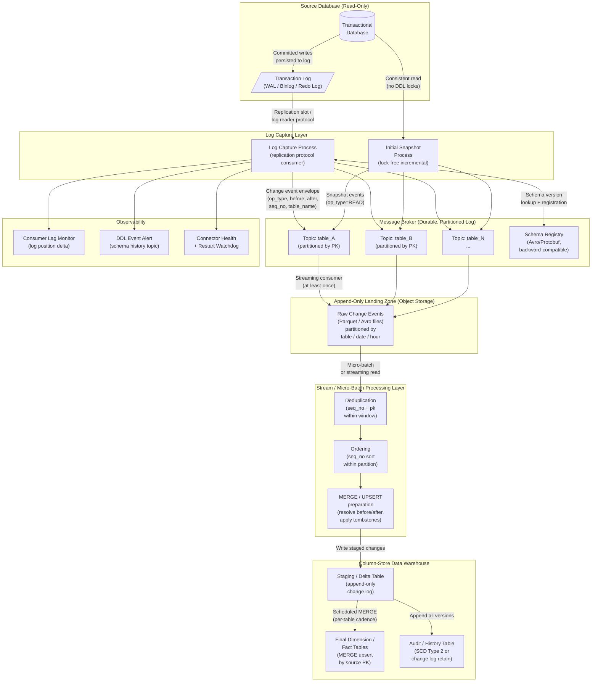

# CDC: Log-Based Change Data Capture


---

## Problem Statement

Log-based change data capture is the correct solution for any pipeline that must capture hard deletes, observe every intermediate row state within a polling window, or deliver changes to a downstream system in under a minute. The fundamental challenge is that you are not querying the database — you are reading a low-level binary artifact (the write-ahead log, transaction log, or binary replication log) that was designed for crash recovery and replica synchronization, not for analytics pipelines. This log has a finite retention window, is sensitive to consumer lag, and can cause severe operational problems on the source system if your consumer falls behind.

The initial snapshot problem compounds this difficulty. When you first connect to a source database with millions of existing rows, you cannot start reading the log from the beginning of time — the log does not go back that far. You must take a consistent snapshot of the current full table state, then seamlessly hand off to the live log stream at exactly the position where the snapshot ended, with no gaps and no duplicate delivery of events that occurred during the snapshot. Achieving this without blocking writes on the source (which could hold application locks for hours on a large table) requires a coordinated multi-phase protocol that is easy to implement incorrectly.

At scale — 50 tables, 200 GB of daily changes, read-only source access, 24-hour log retention, sub-one-hour latency target — these problems interact in dangerous ways. A single slow consumer on one high-volume table can cause the log consumer position to fall behind; if it falls behind far enough that the log rotates, you lose your position and must fully resnapshot that table. With 24-hour log retention and 200 GB/day of changes, you have a hard operational deadline: consumer lag must never exceed approximately 10–12 hours before log segments are eligible for deletion, and your team must have runbooks, alerts, and automated responses in place before day one of production operation.

---

## Clarifying Questions

A senior data engineer would ask the following before designing this system:

### Source System and Log Format
1. **What database engine and version is the source?** The log format, protocol, configuration requirements, and replication slot semantics differ significantly across engines. The answer determines which WAL plugins, replication protocols, and snapshot strategies are available.
2. **Is the 24-hour log retention a hard policy, or can we negotiate to 48–72 hours?** Log retention is your safety buffer. 24 hours means that any consumer outage lasting more than 12 hours (to leave margin for catch-up throughput) requires a full resnapshot of affected tables. A 72-hour window dramatically reduces operational risk.
3. **Can we create a dedicated replication user with read-only replication privileges, or must we share credentials with application users?** Replication requires specific database-level privileges that are distinct from `SELECT` access. Confirm this is achievable under the read-only access constraint.

### Data Characteristics
4. **What is the distribution of the 200 GB/day across the 50 tables? Is it dominated by 2–3 high-volume tables (order events, inventory movements) or spread evenly?** A 90/10 distribution means you need fundamentally different partitioning and consumer scaling for the hot tables vs. the cold ones.
5. **What is the ratio of inserts to updates to deletes? And for updates, are they narrow (1–2 columns changed per event) or wide (full row replacement)?** This directly affects the wire volume of the change event stream and whether the before-image (prior column values) is needed downstream.
6. **Are there tables with very wide rows (100+ columns, large TEXT/BLOB columns)?** Wide rows with full before-and-after images can multiply your event stream volume by 2–3x vs. the raw change volume.

### Business and Latency Requirements
7. **What does "sub-1-hour latency" mean operationally? End-to-end P99, P50, or SLA threshold?** P99 sub-60-minute with 200 GB/day is achievable. P50 sub-5-minute is a different architecture. Know which you are building.
8. **Which of the 50 tables have hard latency SLAs and which are best-effort?** Prioritization determines your consumer topology — you may need dedicated consumer groups for SLA-bound tables.
9. **What does the downstream data warehouse do with deletes — hard delete mirroring, soft tombstone, or archive-then-delete?** This affects the MERGE/UPSERT strategy and whether the DW schema needs an `_is_deleted` flag and `_deleted_at` column.

### Schema and Operations
10. **How frequently do schemas change on the source tables, and what is the process for notifying downstream teams?** Schema changes mid-stream are a top cause of pipeline failures. If the source team deploys a column rename with no notice, your pipeline breaks silently.
11. **Is there a schema registry or DDL change log on the source? Can we subscribe to DDL events?** Determines whether schema evolution can be handled automatically or requires manual intervention.
12. **What are the on-call and incident response expectations for this pipeline?** Log-based CDC has a class of failure modes (log position loss, replication slot bloat, snapshot storms) that require 24/7 response capability. Scope the operational model before committing to the architecture.

---

## Hard Constraints

- **Read-only access to source.** No schema changes, no helper tables, no additional indexes, no stored procedures, no triggers. All state must be maintained on the consumer side.
- **Sub-1-hour end-to-end latency.** P99 from committed transaction on source to queryable row in data warehouse must be under 60 minutes.
- **Must capture hard deletes.** Query-based polling cannot satisfy this requirement. Log reading is mandatory.
- **Must capture inserts, updates, and all intermediate update states** within a polling window (not just final state).
- **24-hour log retention on source.** Consumer lag must be monitored with hard alerts and automated mitigation. Any outage exceeding the safety threshold must trigger a resnapshot workflow.
- **Source team cannot make schema changes.** The pipeline must accommodate schema evolution entirely on the consumer side without source modifications.
- **50 tables, 200 GB/day change volume.** Architecture must scale horizontally. Single-threaded log consumption per table must be evaluated against throughput limits.
- **No vendor lock-in to a specific managed service** (per format requirements — all components described generically).

---

## Architecture Diagram



---

## Solution Design

### Layer 1: Transaction Log Fundamentals

#### What the Log Is

Every major transactional database engine maintains a sequential, append-only log of all committed changes. This log exists primarily for:
1. **Crash recovery** — replay committed transactions that were in memory but not yet flushed to data files
2. **Replication** — stream changes to replica servers to maintain synchronized copies

The log has different names across engines:
- Postgres: Write-Ahead Log (WAL), consumed via logical decoding
- MySQL / MariaDB: Binary Log (binlog)
- Oracle: Redo Log
- SQL Server: Transaction Log, consumed via CDC tables (not direct log reading)

For analytics CDC, we use the **logical replication protocol** layer, which decodes the raw binary log into structured row-level events. This is important: you are not parsing raw binary — the database engine provides a logical decoding API that handles the binary format internally and emits structured change records.

#### Log Retention and the 24-Hour Problem

Log segments are eligible for deletion once:
- All replication consumers have acknowledged reading past that segment
- The segment is older than the configured retention period

With 24-hour retention and 200 GB/day:
- You have approximately 200 GB of log to consume before the oldest segments are deleted
- At average ingestion throughput of ~2.3 MB/s, a healthy pipeline consumes the log far faster than it rotates
- The danger is **consumer lag accumulation** — if your log capture process is paused (maintenance, crash, network partition) for more than ~12 hours, you approach the deletion boundary
- With read-only source access, you cannot extend retention — the 12-hour window is your operational hard deadline for restoring a downed consumer

**Log rotation race condition:** There is a window between when a log segment becomes eligible for deletion and when the cleanup process actually deletes it. This window is typically minutes. Do not rely on it. Your SLA for restoring a downed consumer should be 8 hours, not 12, to give a 4-hour safety margin.

#### Replication Slots and WAL Bloat

Postgres logical replication uses **replication slots** — server-side cursors that track how far each consumer has read. The database will not delete WAL segments that any active slot has not yet consumed, regardless of the configured retention period.

This creates a dangerous failure mode: a **stalled or abandoned replication slot** will cause WAL to accumulate indefinitely until the disk is full. With 200 GB/day of changes, a slot stalled for 5 days = 1 TB of WAL files retained.

Mitigation requirements:
- Monitor `pg_replication_slots` continuously for lag in bytes
- Alert threshold: 50 GB lag per slot
- Auto-drop threshold: 150 GB lag (after paging on-call; document the recovery path as resnapshot)
- Set `max_slot_wal_keep_size` (Postgres 13+) to cap per-slot retention — this causes the slot to be invalidated rather than fill the disk, which is a recoverable failure mode vs. a disk-full production outage
- One replication slot per logical consumer process — never share slots between consumers

For MySQL binlog, there is no slot mechanism — the binlog rotates purely on age and size. The consumer must track its own position (binlog filename + byte offset). If the consumer is offline when the referenced binlog file is deleted, the position is lost and resnapshot is required.

### Layer 2: Change Event Envelope Schema

Every event emitted by the log capture layer must carry a standardized envelope. This is not optional — downstream consumers, deduplication logic, and schema evolution handling all depend on a consistent event structure.

#### Canonical Change Event Envelope

```json
{
  "envelope_version": "1.0",
  "event_metadata": {
    "sequence_number":    "0000001234567890",
    "transaction_id":     "txn-00000000089ABC",
    "event_timestamp_us": 1749600000000000,
    "source_table":       "inventory.product_stock",
    "source_schema":      "inventory",
    "op_type":            "u",
    "schema_version":     42
  },
  "before": {
    "product_id":       12345,
    "warehouse_id":     7,
    "quantity_on_hand": 150,
    "updated_at":       "2026-06-11T10:00:00.000Z"
  },
  "after": {
    "product_id":       12345,
    "warehouse_id":     7,
    "quantity_on_hand": 143,
    "updated_at":       "2026-06-11T10:01:33.421Z"
  },
  "transaction_position": {
    "log_file":   "binlog.004291",
    "log_offset": 8823714,
    "lsn":        "0/3A7F2B18"
  }
}
```

**Field semantics:**

| Field | Type | Required | Description |
|---|---|---|---|
| `sequence_number` | String (zero-padded) | Yes | Monotonically increasing within a log stream. Used for ordering and deduplication. Must be sortable as a string without numeric conversion. |
| `transaction_id` | String | Yes | Groups all events from the same database transaction. Events within a transaction share a `transaction_id` and are ordered by sequence number. |
| `event_timestamp_us` | Int64 (microseconds) | Yes | Wall-clock time of the transaction commit in microseconds since Unix epoch. Do NOT use this for ordering — use `sequence_number`. Use this only for partitioning and latency monitoring. |
| `source_table` | String | Yes | Fully qualified `schema.table_name`. |
| `op_type` | Enum | Yes | `c` (create/insert), `u` (update), `d` (delete), `r` (read — snapshot event). |
| `schema_version` | Int | Yes | Version identifier from schema registry. Consumer looks up column types from registry using this version. |
| `before` | Object or null | Conditional | Full row state before the change. `null` for `c` and `r` events. Required for `u` and `d` events. |
| `after` | Object or null | Conditional | Full row state after the change. `null` for `d` events. Required for `c`, `u`, and `r` events. |
| `transaction_position` | Object | Yes | Log position of this event. Consumers checkpoint this position to resume after restart. |

**Why `before` image matters for deletes:** A `d` event with no `before` image tells you only that a row was deleted. You cannot populate a tombstone record in the warehouse (for SCD Type 2 or audit history) without knowing what the row contained. Always configure your log capture layer to emit full `before` images.

**Why sequence number ordering is stronger than timestamp ordering:** Two transactions committing in the same millisecond will have identical `event_timestamp_us`. Their relative order is only deterministic via the log's physical sequence number. Never sort events by timestamp for correctness-critical ordering — always use `sequence_number`.

### Layer 3: Initial Snapshot Before CDC Starts

This is the most operationally complex phase of the entire CDC setup. It must be designed before the system goes live, not retrofitted later.

#### The Snapshot Problem

When you first connect to a source table, you need:
1. The complete current state of all rows (snapshot)
2. The log position that corresponds to the end of the snapshot — so the live log stream starts from exactly that point

If you take the snapshot first and then find the log position, you may have missed events that occurred between the last row read and when you recorded the log position. If you record the log position first and then scan the table, you may include rows that were inserted after the position you recorded.

#### Approach 1: Table-Lock Snapshot (Simple, High Impact)

```
LOCK TABLE inventory.product_stock IN SHARE MODE;
-- Record current log position / LSN
-- Scan all rows
UNLOCK TABLE;
-- Start log stream from recorded LSN
```

This guarantees consistency but holds a share lock on the table for the duration of the full scan. For a 50-million-row inventory table, that could be 30–90 minutes of blocked writes on the source. With read-only access, you likely cannot execute DDL locks anyway — this approach is typically unavailable.

**Do not use this approach** unless the table is small (< 100k rows) and can be locked during a maintenance window.

#### Approach 2: Lock-Free Incremental Snapshot (Production Standard)

This technique allows the snapshot to proceed without any table locks while the live log stream runs concurrently.

**Protocol:**

```
Phase 1: Start log capture process. Begin consuming the log from NOW.
         Buffer all incoming change events (do not apply to warehouse yet).

Phase 2: Snapshot scan.
         SELECT * FROM product_stock WHERE pk > :last_scanned_pk LIMIT 10000
         Emit each scanned row as an op_type='r' event with a sequence_number
         derived from the scan cursor position.
         Record the LSN/log-position at the start of each chunk.

Phase 3: Reconciliation.
         For each row emitted from the snapshot scan:
           If the buffered log stream contains a newer event for the same PK
           (sequence_number of log event > sequence_number of snapshot event),
           the log event wins — discard the snapshot event.
           Otherwise, apply the snapshot event.

Phase 4: Once scan is complete and reconciliation is done,
         the buffered log events are drained in order.
         Normal streaming operation begins.
```

This works because:
- Snapshot rows are emitted with a sequence number tied to the scan cursor
- Live log events have sequence numbers from the actual log position
- Any row modified after it was scanned will have a log event with a higher sequence number
- The higher-sequence-number event wins, giving you the most recent state

**Chunk size recommendation:** 10,000–50,000 rows per chunk for large tables. Each chunk is independently resumable — if the snapshot process crashes, restart from the last completed chunk. Store completed chunk cursors in a durable control table (not in memory).

**Snapshot control table schema:**

```sql
CREATE TABLE cdc_snapshot_state (
    table_name          VARCHAR(255) NOT NULL,
    chunk_seq           BIGINT NOT NULL,
    min_pk              BIGINT NOT NULL,
    max_pk              BIGINT NOT NULL,
    status              VARCHAR(20) NOT NULL,  -- PENDING / IN_PROGRESS / DONE
    started_at          TIMESTAMP,
    completed_at        TIMESTAMP,
    rows_scanned        BIGINT,
    PRIMARY KEY (table_name, chunk_seq)
);
```

#### Operational Sequence for 50-Table Initial Bootstrap

Do not snapshot all 50 tables simultaneously. Prioritize:

1. **Priority 1 (days 1–2):** High-volume tables and tables with hard latency SLAs. These must be live first. Use the most parallelism here.
2. **Priority 2 (days 3–5):** Medium-volume reference and dimension tables.
3. **Priority 3 (week 2):** Low-volume lookup tables that rarely change.

Reason: with 24-hour log retention, you must complete each table's snapshot and begin log streaming within the retention window. Attempting all 50 simultaneously risks exceeding the retention window for tables that start late.

### Layer 4: Log Capture Process Configuration

The log capture process is a long-running service that holds a replication connection to the source database, reads the log via the replication protocol, decodes raw binary log entries into structured change events, and publishes them to the message broker.

#### Required Source Database Configuration

These settings must be verified (not set — you have read-only access to the source application schema, but these are database engine settings, which may be configurable through the DBA team):

**For WAL-based engines (Postgres-family):**
```
wal_level                = logical      -- Required. 'replica' is insufficient for logical decoding.
max_replication_slots    = 20           -- One per active consumer plus headroom.
max_wal_senders          = 20           -- Concurrent replication connections.
wal_sender_timeout       = 60000        -- 60 seconds. Default is fine.
```

**For binlog-based engines (MySQL-family):**
```ini
binlog_format            = ROW          -- Required. STATEMENT and MIXED are insufficient.
binlog_row_image         = FULL         -- Captures complete before AND after images.
expire_logs_days         = 1            -- Reflects the 24-hour policy.
server_id                = <unique_int> -- Required for replication protocol.
log_bin                  = ON           -- Must be enabled (usually default on modern versions).
```

**Verify these are set before production cutover.** If `binlog_format = STATEMENT`, you will get SQL statements in the log instead of row images — these are not parseable into change event envelopes without re-executing the statement against a replica.

#### Log Capture Process Tuning

```yaml
# Throughput settings
max_batch_size_events:   8192      # Events per poll cycle. Default 2048 is too low for 200GB/day.
poll_interval_ms:        100       # How long to wait for events before returning an empty batch.
max_queue_size_events:   65536     # Internal buffer between log reader and broker publisher.

# Reliability settings
heartbeat_interval_ms:   30000     # Emit a heartbeat event every 30s even when no changes.
                                   # This advances the log position even during quiet periods,
                                   # preventing stale-slot WAL accumulation.

# Snapshot settings
snapshot_mode:           initial   # Run snapshot on first start; skip on reconnect.
snapshot_fetch_size:     10000     # Rows per snapshot SELECT chunk.
snapshot_isolation_mode: repeatable_read  # Use snapshot isolation during scan.

# Schema evolution
include_schema_changes:  true      # Emit DDL change events to schema history topic.
schema_history_topic:    cdc.schema_history.inventory

# Worker resources (per worker process)
heap_memory_mb:          4096      # Minimum for high-throughput sources. Low heap causes OOM
                                   # during large transaction buffering in snapshot reconciliation.
```

**Worker scaling rules:**
- 1 worker process can handle approximately 5,000–8,000 events/second sustainably
- At 200 GB/day = ~2.3 MB/s, assuming average event size of 500 bytes = ~4,600 events/second at steady state
- Burst events (batch job runs, end-of-day processing) can spike 5–10x — size workers for burst
- Horizontal scaling: assign table groups to separate worker processes, each with its own replication slot

### Layer 5: Message Broker Topology

#### Topic Partitioning Strategy

```
Topic naming convention:  cdc.<source_schema>.<table_name>
Partitioning key:         Hash of source primary key

Example:
  cdc.inventory.product_stock      -- 8 partitions
  cdc.inventory.warehouse          -- 2 partitions  
  cdc.orders.order_line_items      -- 16 partitions (high volume)
  cdc.schema_history.inventory     -- 1 partition   (DDL events, must be ordered)
```

**Why partition by primary key:** All events for a given row go to the same partition, guaranteeing that consumers see events for that row in sequence-number order. Without this, events for the same row could arrive out of order at the consumer.

**Partition count:** Set based on peak throughput / target throughput per partition. For a 200 GB/day pipeline with bursty workloads, a 16-partition topic for the top-5 highest-volume tables is a reasonable starting point. Partitions can be increased later but require rebalancing consumers.

#### Message Retention on the Broker

Set broker-side message retention to at least **7 days**. This is your replay buffer — if the landing zone writer fails, you can replay from the broker without going back to the source. This retention is separate from and in addition to the 24-hour source log retention.

```
retention.ms:    604800000    # 7 days
retention.bytes: -1           # No size limit (rely on time-based retention)
compression:     lz4          # 40-50% size reduction on structured JSON/Avro events
```

### Layer 6: Append-Only Landing Zone

The landing zone is intentionally minimal and append-only. Do not apply MERGE logic here. Every change event lands exactly as received from the message broker.

#### Design Principles

1. **Immutable once written.** Landing zone files are never modified after creation. If a file is corrupted or incomplete, it is re-created from broker replay, not edited.
2. **Partitioned by ingestion time** (not event time). Use `ingest_date` and `ingest_hour` as partition columns. Event time partitioning causes late-arriving events to create new small files in old partitions, leading to small-file proliferation.
3. **Schema matches the change event envelope exactly.** Do not transform here. Raw events should be debug-readable without joining to other systems.
4. **Include all envelope metadata fields as first-class columns** (not nested). `op_type`, `sequence_number`, `event_timestamp_us`, `source_table` should be top-level columns for efficient filtering.

#### Landing Zone File Layout

```
object_storage/
  cdc_landing/
    source_schema=inventory/
      source_table=product_stock/
        ingest_date=2026-06-11/
          ingest_hour=10/
            part-00001-a3bc9d.parquet
            part-00002-f8e21a.parquet
            ...
        ingest_date=2026-06-11/
          ingest_hour=11/
            ...
```

#### Why Append-Only Matters

- **Replay safety:** If the downstream MERGE job fails, you can re-run it against the already-landed events. No data is lost.
- **Audit trail:** The landing zone is the immutable record of every change in arrival order. Useful for forensics, compliance, and debugging incorrect downstream state.
- **Decoupling:** Landing zone writers can operate independently of downstream consumers. Writer throughput is limited by I/O, not by MERGE complexity.
- **Late event tolerance:** Events that arrive late (due to broker lag or consumer restart) are appended to the current ingest hour. The downstream MERGE step handles them with sequence-number ordering, not by modifying old landing files.

#### Compaction Policy

Landing zone files accumulate at a high rate. Micro-batch writers create many small files. Implement a compaction job:
- **Trigger:** Hourly, after the landing writer closes the previous hour's files
- **Action:** Compact all files within a given `source_table / ingest_date / ingest_hour` partition into 1–4 files sized 128–256 MB each
- **Do not compact across hours** — keep the ingest-time partitioning intact for efficient time-range scans

### Layer 7: MERGE / UPSERT Strategy in the Data Warehouse

The data warehouse MERGE step transforms the append-only change log into a current-state queryable table.

#### Sequence Number Ordering Within the MERGE Window

Before executing any MERGE, sort the input events by `(source_pk, sequence_number ASC)` and deduplicate to the latest event per primary key per MERGE window. This handles:
- Duplicate events (at-least-once delivery means the same sequence number may appear twice)
- Multiple updates to the same row within the MERGE window (keep only the final state)
- Out-of-order delivery across partitions (sort by sequence number resolves this)

```sql
-- Step 1: Deduplicate and find latest event per PK in the landing batch
WITH ranked_events AS (
    SELECT
        *,
        ROW_NUMBER() OVER (
            PARTITION BY product_id, warehouse_id  -- composite PK
            ORDER BY sequence_number DESC           -- latest event wins
        ) AS rn
    FROM cdc_landing.inventory_product_stock
    WHERE ingest_date = :batch_date
      AND ingest_hour BETWEEN :start_hour AND :end_hour
      AND sequence_number > :last_applied_sequence
),
latest_per_key AS (
    SELECT * FROM ranked_events WHERE rn = 1
)
-- Step 2: MERGE into final table
MERGE INTO dw.inventory_product_stock AS target
USING latest_per_key AS source
    ON target.product_id = source.product_id
    AND target.warehouse_id = source.warehouse_id
WHEN MATCHED AND source.op_type IN ('u', 'r') THEN
    UPDATE SET
        target.quantity_on_hand = source.after_quantity_on_hand,
        target.updated_at       = source.after_updated_at,
        target._cdc_sequence    = source.sequence_number,
        target._cdc_updated_at  = source.event_timestamp_us,
        target._is_deleted      = FALSE
WHEN MATCHED AND source.op_type = 'd' THEN
    UPDATE SET
        target._is_deleted      = TRUE,
        target._deleted_at      = source.event_timestamp_us,
        target._cdc_sequence    = source.sequence_number
WHEN NOT MATCHED AND source.op_type IN ('c', 'r') THEN
    INSERT (
        product_id, warehouse_id, quantity_on_hand, updated_at,
        _cdc_sequence, _cdc_updated_at, _is_deleted
    )
    VALUES (
        source.after_product_id,
        source.after_warehouse_id,
        source.after_quantity_on_hand,
        source.after_updated_at,
        source.sequence_number,
        source.event_timestamp_us,
        FALSE
    );
```

**Important:** Do not hard-delete rows from the final DW table when you see a `d` event. Set `_is_deleted = TRUE`. Hard deletes from the DW break downstream views, reports, and ML features that may be joining to this table. Soft-delete mirroring preserves referential integrity downstream and allows recovery if a delete is later determined to be erroneous.

#### Idempotency of the MERGE

The MERGE must be idempotent. If the MERGE job crashes mid-run and is re-executed against the same landing zone batch, the result must be identical to running it once. This is guaranteed by:
1. Deduplication by `sequence_number` before the MERGE
2. The `WHEN MATCHED` clause overwriting rather than appending
3. Sequence number comparison (`sequence_number > :last_applied_sequence`) ensuring already-applied events are not re-applied

Store `last_applied_sequence` per table in a control table, updated atomically with the MERGE completion in the same transaction where possible.

#### MERGE Cadence

| Table Category | MERGE Cadence | Rationale |
|---|---|---|
| SLA-bound tables (inventory levels, order status) | Every 5 minutes | Satisfies sub-1-hour latency with margin |
| Standard dimension/fact tables | Every 15 minutes | Balances freshness vs. MERGE overhead |
| Low-volume reference tables | Every hour | These rarely change; hourly is sufficient |

At 50 tables, running MERGEs every 5 minutes for all tables simultaneously would create significant contention on the DW. Stage the MERGE schedule so no more than 8–10 MERGEs run concurrently.

### Layer 8: Schema Change Mid-Stream Handling

Schema changes on the source, made without advance notice, are the most common cause of unplanned pipeline outages in CDC systems.

#### Types of Schema Changes and Their Impact

| Change Type | Pipeline Impact | Response Required |
|---|---|---|
| Add nullable column | Low. New field appears in `after` image. Consumer schema needs update to accept it. | Register new schema version. Update DW table with `ALTER TABLE ADD COLUMN`. Automatic if schema registry enforces backward compatibility. |
| Add non-nullable column with default | Medium. Existing rows in snapshot do not have this column. | Register new schema version. Apply default value logic in transformation layer. |
| Rename column | Critical. Log capture sees it as DROP old column + ADD new column. Consumers see the old field disappear. | Requires coordinated migration: add new column, dual-write period, migrate consumers, drop old column. |
| Change column data type (widening) | Medium. e.g., INT to BIGINT. Schema registry should accept as backward-compatible. | Register new schema version. Verify type coercion in transformation layer. |
| Change column data type (narrowing) | Critical. e.g., VARCHAR(255) to VARCHAR(50). Existing data may not fit. | Pipeline should reject via schema registry compatibility check. Escalate to source team. |
| Drop column | High. Field disappears from events. Consumers referencing it fail with null pointer or column-not-found errors. | Register new schema version. Consumers must tolerate missing field (default to null). DW column should be retained as nullable. |
| Change primary key | Critical. Existing snapshot is based on old PK. MERGE logic uses old PK. | Full resnapshot required for affected table. Coordinate with source team for timing. |

#### Schema History Topic

The log capture process must emit a DDL event to a dedicated schema history topic every time it detects a schema change in the log. This topic is a durable, ordered record of all schema versions.

```
Topic: cdc.schema_history.inventory
  -- Append-only
  -- Single partition (global ordering of schema changes)
  -- Infinite retention (never purge schema history)
```

DDL events in this topic trigger:
1. An alert to the pipeline operations team
2. An automated schema registry version registration (if compatible)
3. A manual review gate (if incompatible) before consumers are updated

**Consumer-side defensive coding:** Every consumer reading from CDC topics must handle unknown fields gracefully (ignore extra fields) and handle missing fields gracefully (substitute null or configured default). Never write consumers that fail on `KeyError` when a field is not present in an event.

### Layer 9: Sequence Number Ordering Guarantees

#### Within a Single Partition

Events within a single message broker partition are strictly ordered by the sequence number assigned at log capture time. This guarantees:
- All events for a given primary key (which hashes to the same partition) are consumed in order
- No event for a given row will be processed before an earlier event for the same row

**This guarantee holds only within a single partition.** Events for different primary keys that hash to different partitions have no inter-partition ordering guarantee.

#### Cross-Partition Ordering

For analytics use cases (reporting current state of each row), cross-partition ordering is not needed — each row's events are in the correct order within its partition.

For use cases requiring total global ordering (e.g., reconstructing the exact sequence of all transactions across a table), you must:
1. Collect events from all partitions
2. Sort by `sequence_number` globally before processing
3. Accept increased processing latency proportional to the collection window

#### Sequence Number Gaps

Sequence numbers may have gaps. A gap in sequence numbers does not indicate missing events — it may indicate that the gap range corresponded to transactions on tables not in your capture set, or internal database maintenance operations. Do not alert on sequence number gaps. Only alert on replication lag (time or byte distance between the latest event in the log and the latest event consumed).

---

## Trade-offs

| Decision | Option A | Option B | Recommendation | Why |
|---|---|---|---|---|
| **Initial snapshot approach** | Table-lock snapshot: consistent, blocks writes for hours | Lock-free incremental snapshot: no lock, reconciles via sequence number | Lock-free incremental | With read-only access, table locks may not be available. Even if available, blocking production writes for 2+ hours is unacceptable for a retail inventory system during business hours. Lock-free adds complexity but is the only production-viable option. |
| **Delete handling in DW** | Hard-delete mirror: physically delete row from DW when `op_type=d` is received | Soft-delete tombstone: set `_is_deleted=TRUE`, retain row | Soft-delete tombstone | Hard deletes cascade to downstream views, reports, and ML features, causing silent data quality failures. Soft deletes are recoverable and auditable. The `_is_deleted` filter is cheap at query time. |
| **Landing zone format** | JSON: human-readable, schema-flexible, larger files | Parquet/Avro: columnar, compressed, schema-enforced, 3–5x smaller | Parquet with schema registry | At 200 GB/day change volume, JSON triples storage costs and halves query performance on the landing zone. The schema registry provides the schema-flexibility benefit without JSON's size overhead. |
| **MERGE frequency** | Per-event streaming MERGE: lowest latency, highest DW concurrency, complex conflict resolution | Micro-batch MERGE (every 5–15 minutes): coalesces multiple events per row, simpler logic, lower DW load | Micro-batch MERGE | The sub-1-hour latency SLA does not require per-event streaming. Micro-batch every 5 minutes gives ample margin. Streaming MERGE at 200 GB/day change volume creates severe DW concurrency issues (lock contention, compaction storms). |
| **Exactly-once vs. at-least-once delivery** | Exactly-once: 20–50% throughput penalty, correctness not formally proven per protocol documentation, complex failure recovery | At-least-once + idempotent MERGE: duplicates possible, resolved by UPSERT on PK | At-least-once + idempotent MERGE | At 200 GB/day, the throughput penalty of exactly-once is significant. Idempotent MERGE by primary key provides effectively-once semantics at the data level for all analytical workloads. Reserve exactly-once for financial/compliance pipelines only. |
| **Consumer topology: shared vs. dedicated consumers per table** | Shared consumer: all 50 tables on one consumer process — lower operational overhead | Dedicated consumers per table group: isolated blast radius, independent scaling | Dedicated consumers by table group | With 50 tables and heterogeneous volume, one slow/crashing consumer blocking all tables is unacceptable. Group tables by volume tier (high/medium/low) with separate consumer processes. 3–5 consumer groups vs. 50 individual processes is a reasonable middle ground. |
| **Schema evolution handling: manual vs. automated** | Manual gate: all schema changes require human review before consumers update | Automated with compatibility checks: schema registry enforces backward compatibility, auto-deploys compatible changes | Automated with compatibility checks + alert on incompatible | Compatible changes (add nullable column) should not require manual intervention at 50 tables — the operational burden is too high. Incompatible changes (column rename, type narrowing) must alert and require human review. Schema registry compatibility rules enforce this boundary automatically. |

---

## Failure Modes and Recovery

| Failure Mode | Detection Method | Recovery Strategy | Prevention |
|---|---|---|---|
| **Log position lost (consumer offline > log retention window)** | Alert: consumer lag in bytes approaches log retention size (trigger at 50% of retention). Metric: `replication_lag_bytes > 100GB`. | Full resnapshot of affected tables. Reset consumer offset to new starting position post-snapshot. Resume normal operation. Estimated time: 2–8 hours per large table depending on row count. | Monitor consumer lag every 60 seconds. Auto-restart consumer on crash within 5 minutes. Set operational SLA: consumer must be restored within 8 hours of outage. |
| **Replication slot bloat (Postgres-specific)** | Metric: `pg_replication_slots.lag_bytes > 50GB`. Alert on rate of growth, not just absolute value. | If lag < 100 GB: investigate consumer health, restart if crashed, monitor catch-up rate. If lag > 150 GB and growing: drop the slot (after paging on-call), trigger resnapshot. | Set `max_slot_wal_keep_size` to cap per-slot WAL retention. Monitor all slots, not just active ones — an accidentally orphaned slot can fill disk silently. |
| **Schema change breaking consumers** | Alert: schema history topic receives a new DDL event. Metric: consumer deserialization error rate > 0. | For compatible changes: register new schema version, deploy updated consumer. For incompatible changes: pause consumers for affected tables, coordinate with source team, implement migration, resume. | Schema registry with backward-compatibility enforcement on all topics. Automated DDL event alerting. Consumer-side defensive deserialization (tolerate unknown/missing fields). |
| **Primary database failover (replica promoted to primary)** | Log capture process connection error. Alert: connector status `FAILED` or `STOPPED`. | Reconnect consumer to new primary. For engines that transfer log position automatically (managed services): consumer reconnects and resumes. For engines that do not: verify log position is valid on new primary, resnapshot if position is invalid. | Test failover procedure in staging environment before production. Use managed database services where available (they handle slot propagation). Document exact recovery steps per database engine. |
| **Message broker partition rebalance during high load** | Consumer lag spike during rebalance. Events temporarily duplicated due to re-processing from last committed offset. | At-least-once + idempotent MERGE handles duplicates automatically — no manual intervention needed. Verify MERGE deduplication logic includes sequence number deduplication. | Set consumer session timeout and heartbeat interval appropriately to avoid spurious rebalances. Pre-allocate sufficient partitions to avoid dynamic partition increases during operation. |
| **Landing zone write failure (object storage quota or permissions error)** | Metric: failed write attempts, queue depth growing, consumer lag increasing. Alert: consumer lag > 10 minutes. | Identify root cause (quota, permissions, network). Fix underlying issue. Replay events from message broker (which retains 7 days) from the last successful write offset. Verify no gaps in sequence numbers after recovery. | Message broker retention (7 days) acts as replay buffer. Monitor object storage quota with 30% headroom alert. |
| **MERGE job failure (query timeout or DW resource contention)** | Job scheduler alert: task status `FAILED` or runtime > 2x baseline. Metric: DW queue depth for MERGE jobs. | Re-run MERGE from same landing zone batch — MERGE is idempotent. If DW is overloaded, schedule retry with backoff (5 min, 15 min, 30 min). For persistent failures, investigate query plan and partition statistics. | Set per-table MERGE concurrency limits. Stagger MERGE schedules to avoid simultaneous execution of all 50 tables. Implement query timeout (15 minutes per MERGE) to prevent runaway queries blocking other jobs. |
| **Snapshot reconciliation failure (snapshot chunk crashes mid-scan)** | Metric: snapshot chunk status table contains IN_PROGRESS chunks that have not updated in > 30 minutes. Alert on stale chunk. | Re-run failed chunk from the last completed row in the chunk (use PK cursor from control table). Completed chunks are idempotent — re-running them is safe. Verify reconciliation logic correctly handles events buffered during the re-run. | Chunk-level resumability design (see snapshot control table schema). Heartbeat updates from the snapshot process every 60 seconds to distinguish alive vs. stalled chunks. |

---

## Observability Checklist

### Log Capture Process Metrics

**Throughput:**
- `cdc.events_published_per_second` (by table) — baseline and alert on > 3x baseline spike
- `cdc.bytes_published_per_second` — total pipeline throughput
- `cdc.events_by_op_type` (insert/update/delete/snapshot) — sudden spike in deletes warrants investigation

**Lag:**
- `cdc.consumer_lag_bytes` (by replication slot) — **most critical metric** — alert at 50 GB, auto-remediate at 150 GB
- `cdc.consumer_lag_seconds` — end-to-end latency from source commit to broker publish
- `cdc.last_event_age_seconds` — seconds since last event was published (heartbeat mechanism ensures this never exceeds `heartbeat_interval_ms` even during quiet periods)

**Reliability:**
- `cdc.connector_restarts_total` — alert if > 3 restarts in 1 hour
- `cdc.snapshot_chunks_in_progress` — should be 0 during normal operation; non-zero indicates snapshot in progress or stuck chunk
- `cdc.serialization_errors_total` — any non-zero value requires immediate investigation

### Message Broker Metrics

- `broker.consumer_group_lag` (by topic, by consumer group) — alert if growing monotonically for > 10 minutes
- `broker.topic_message_age_max` — oldest unread message age per topic; must not approach log retention
- `broker.partition_rebalances_per_hour` — frequent rebalances indicate consumer instability
- `schema_history_topic.message_count` — any increase triggers DDL change alert

### Landing Zone Metrics

- `landing.files_written_per_hour` (by table) — validate against expected change volume
- `landing.write_latency_p99` — should be < 5 seconds per file
- `landing.small_files_count` (files < 10 MB) — triggers compaction if > 100 per partition
- `landing.bytes_written_per_hour` — total ingested volume; validate against 200 GB/day / 24 hours = ~8.3 GB/hour average

### Data Warehouse MERGE Metrics

- `dw.merge_duration_seconds` (by table) — alert if > 2x baseline; critical if > 15 minutes
- `dw.rows_merged_per_run` (by table) — sudden drop to zero indicates upstream problem
- `dw.merge_lag_minutes` — time since last successful MERGE completion per table; alert if > latency SLA × 0.5
- `dw.deduplication_rate` (duplicate events removed / total events) — baseline ~0–2%; spikes indicate consumer restart or broker rebalance
- `dw.delete_events_applied` — monitor for unexpected mass-delete events

### End-to-End SLA Alerts

```
CRITICAL: Any table's MERGE lag exceeds 45 minutes  (75% of 60-minute SLA)
WARNING:  Any table's MERGE lag exceeds 30 minutes
CRITICAL: Consumer lag bytes > 100 GB on any replication slot
WARNING:  Consumer lag bytes > 50 GB on any replication slot
CRITICAL: Log capture process has not published an event in > 5 minutes
WARNING:  Schema history topic received a DDL change event (requires human review)
CRITICAL: MERGE job failed 3 consecutive times for any table
```

---

## Interview Answer Template

### The Constraint-Elimination Technique

When answering a CDC architecture question in an interview, use this structure to eliminate non-viable approaches before committing to a solution. This signals senior-level thinking — you understand what does not work before explaining what does.

**Step 1: Restate the hard constraints that eliminate the obvious wrong answers (30 seconds)**

> "The key constraints here are hard deletes must be captured, 24-hour log retention on the source, read-only access, and sub-one-hour latency. Let me explain why these constraints immediately eliminate certain approaches:
>
> — Hard deletes eliminate query-based watermark polling entirely. A deleted row has no updated timestamp. Without log access, you cannot detect it without a full reconciliation scan.
>
> — 24-hour log retention eliminates any architecture that relies on catching up from an extended lag. Your consumer must be operationally resilient with fast restart and automated resnapshot capability.
>
> — Read-only source access eliminates helper tables, triggers, and audit columns on the source. Everything must be derived from the log."

**Step 2: State the architecture and explain each layer's purpose (2 minutes)**

> "Given those constraints, the correct architecture is log-based CDC with an append-only landing zone and micro-batch MERGE into the warehouse.
>
> The pipeline has six layers. The log capture process holds a replication connection to the source and decodes every committed transaction into a standard change event envelope — before-image, after-image, operation type, and a monotonically increasing sequence number. Events publish to a partitioned message broker, keyed by source primary key to guarantee per-row ordering within a partition. A landing zone writer appends all events to immutable Parquet files partitioned by ingestion time — no transformation here, just durable storage with a 7-day replay buffer. A micro-batch processor reads the landing zone every 5 minutes, deduplicates by sequence number, resolves the latest state per primary key, and executes a MERGE into the final warehouse tables. Deletes become soft tombstones with an is-deleted flag, not physical deletes."

**Step 3: Address the hardest operational problems explicitly (90 seconds)**

> "The two hardest operational problems are the initial snapshot and the log retention race condition.
>
> For the snapshot: I'd use a lock-free incremental approach — the log stream starts immediately, the snapshot scanner runs concurrently by primary key chunks, and for any row that received a log event with a higher sequence number than the snapshot scan assigned it, the log event wins. This avoids any blocking of source writes.
>
> For the 24-hour retention race: consumer lag in bytes is my most critical metric. I alert at 50 GB lag, which gives roughly a 6-hour window at 200 GB/day change volume before hitting the retention boundary. If lag exceeds 150 GB, the runbook triggers an automatic resnapshot for affected tables. I also set a per-slot WAL retention cap so a stalled slot cannot fill the source disk — it fails the slot gracefully instead of degrading the source database."

**Step 4: Acknowledge trade-offs (30 seconds)**

> "The main trade-off I'm making is at-least-once delivery with idempotent MERGE instead of exactly-once. For an inventory analytics warehouse, duplicates resolved by primary key UPSERT is sufficient. Exactly-once has a 20–50% throughput penalty and correctness caveats I wouldn't accept for a 200 GB/day pipeline without a specific regulatory requirement driving it."

**Step 5: Invite a drill-down (10 seconds)**

> "I can go deeper on any layer — the schema evolution handling, the replication slot management, the snapshot reconciliation protocol, or the MERGE sequence number ordering logic. Where would you like to focus?"

---

## Sources

- [DBEvents: Uber's Ingestion Framework](https://www.uber.com/blog/dbevents-ingestion-framework/)
- [Uber's Lakehouse Architecture with Apache Hudi](https://www.uber.com/us/en/blog/ubers-lakehouse-architecture/)
- [SpinalTap: Airbnb CDC Architecture](https://medium.com/airbnb-engineering/capturing-data-evolution-in-a-service-oriented-architecture-72f7c643ee6f)
- [Real-Time Data Infrastructure at Uber (arXiv:2104.00087)](https://arxiv.org/pdf/2104.00087)
- [Production CDC Architecture: Scaling Lessons](https://www.novatechflow.com/2026/04/production-cdc-architecture-debezium.html)
- [CDC Pain Points in Production (Estuary)](https://estuary.dev/blog/debezium-cdc-pain-points/)
- [Postgres CDC to Iceberg: Production Lessons (RisingWave)](https://risingwave.com/blog/postgres-cdc-iceberg-production-lessons/)
- [Log-Based CDC Exactly-Once Delivery Documentation](https://debezium.io/documentation/reference/stable/configuration/eos.html)
- [Towards Exactly-Once Delivery in CDC (Debezium Blog)](https://debezium.io/blog/2023/06/22/towards-exactly-once-delivery/)
- [Schema Evolution in CDC Pipelines (Decodable)](https://www.decodable.co/blog/schema-evolution-in-change-data-capture-pipelines)
- [CDC Schema Evolution Handling (RisingWave)](https://risingwave.com/blog/debezium-schema-evolution-streaming-pipelines/)
- [Real-Time Schema Evolution in Column-Store DW with CDC (AWS Blog — Skroutz)](https://aws.amazon.com/blogs/big-data/how-skroutz-handles-real-time-schema-evolution-in-amazon-redshift-with-debezium/)
- [Apache Hudi COW vs MOR: Production Use Cases](https://www.onehouse.ai/blog/comparing-apache-hudis-mor-and-cow-tables-use-cases-from-uber-and-shopee)
- [Apache Hudi MOR Deep Dive](https://hudi.apache.org/blog/2025/07/21/mor-comparison/)
- [Watermark-Based Incremental Ingestion with Hard Deletion Sync](https://www.sunnydata.ai/blog/lakeflow-connect-query-based-capture-incremental-ingestion)
- [Late Event Handling: Watermarks and Merge Backfills](https://www.7tech.co.in/late-event-rewrote-friday-data-science-playbook-watermarks-incremental-dbt-merge-backfills/)
- [Best CDC Tools Comparison 2026 (Estuary)](https://estuary.dev/blog/best-change-data-capture-tools/)
