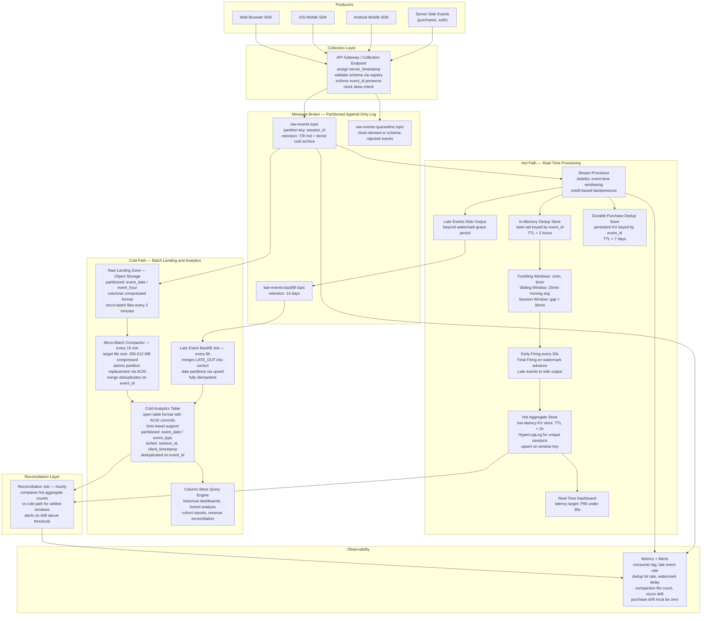

<!-- data-ingestion-patterns: Streaming Ingestion Architecture: Clickstream and Web Analytics -->

# Streaming Ingestion Architecture: Clickstream and Web Analytics


---

## Problem Statement

Web and mobile analytics platforms must serve two fundamentally incompatible consumers from a single stream of behavioral events: a real-time dashboard that shows active users and purchase velocity updated every few seconds, and a historical analytics warehouse that must produce auditable, accurate session and funnel reports. The tension is that speed and accuracy are in direct conflict when events are disordered. Mobile clients cache events while offline and flush them in bursts when connectivity returns — sometimes days later. This means a purchase event with a client timestamp of three days ago can arrive at the ingestion layer right now, and the pipeline must decide whether to include it in a window that already closed, update a result the real-time consumer already read, or route it to a late-arrival backfill process.

The duplicate problem is equally severe. Mobile SDKs implement retry logic with exponential backoff, so any network blip between the device and the collection endpoint causes the same event to be submitted two, three, or more times with identical payloads. Client-side deduplication is unreliable because users force-kill apps, clear caches, and reinstall. Server-side deduplication is the only authoritative layer, but a naive approach — checking a seen-set on every event — becomes a bottleneck at 50,000 events per second and a correctness risk when the pipeline restarts and replays from a checkpoint.

At production scale the challenge extends to the storage tier. Real-time consumers need sub-30-second freshness, which demands a hot in-memory or row-oriented store optimized for low-latency writes and point lookups. Historical consumers need efficient columnar scans over months of data, which demands compacted, partitioned, column-oriented files. Writing to both simultaneously is operationally expensive and introduces consistency drift: the hot path may show a different event count than the cold path for the same time window. The single-source-of-truth requirement means the architecture must reconcile these two views rather than let them diverge permanently.

---

## Clarifying Questions

### Volume and Latency

1. **Peak vs. sustained load:** Is 50K events/second the absolute peak (brief spikes) or a sustained rate during business hours? This determines whether the message broker needs to be sized for sustained 50K or for a buffer against 3-5x spikes.
2. **Real-time SLA specifics:** The "under 30 seconds" dashboard requirement — does that mean P50 latency, P99, or maximum? A P50 of 10 seconds with P99 of 45 seconds may be acceptable, which changes windowing strategy entirely.
3. **Historical query latency:** What is the acceptable query latency for historical batch analytics — seconds (interactive), minutes (scheduled reports), or hours (overnight jobs)?

### Event Characteristics

4. **Late arrival distribution:** What is the observed distribution of mobile offline lag? Is "days late" the tail case (P99.9) or a regular occurrence? This determines the watermark grace period and whether a hot-path late-event side output is needed or a simple scheduled backfill suffices.
5. **Event schema stability:** Are event schemas stable and versioned, or do mobile SDK versions emit different field names? Schema evolution handling in the serialization layer is required if multiple SDK versions are live simultaneously.
6. **Event cardinality:** How many distinct session and user identifiers are active at peak? High-cardinality stateful aggregations (per-session windowing) have very different state store requirements than low-cardinality ones (per-country aggregations).

### Deduplication and Correctness

7. **Deduplication window:** How long after original submission can a duplicate arrive? If the retry window is 24 hours, the deduplication seen-set must retain event IDs for at least 24 hours. If it is 7 days, the storage cost multiplies.
8. **Acceptable duplicate rate for real-time vs. batch:** Is the real-time dashboard allowed to show approximate counts (with possible duplicates) as long as the batch historical path is exact? This is a common and pragmatic trade-off.
9. **Purchase event handling:** Are purchase events subject to the same deduplication strategy as page views, or do they require stricter exactly-once guarantees with financial reconciliation?

### Operational and Compliance

10. **Data retention and deletion:** Do right-to-erasure requirements apply? If a user requests deletion, can the cold storage tier (immutable object files) be updated, or does the architecture need a tombstone-and-query-time-exclusion pattern?
11. **Reprocessing requirements:** How often is the business logic expected to change such that historical reprocessing is required? If it is monthly, a full replay from the raw event log is feasible. If it is weekly, a more automated reprocessing trigger is needed.
12. **Cost model:** Is the organization cost-sensitive to compute (minimize streaming cluster size) or storage (minimize raw event retention)? This determines the hot-tier retention duration and whether tiered storage compaction is prioritized.

---

## Hard Constraints

- **Sub-30-second latency** for real-time dashboard aggregations under peak load of 50K events/second
- **Mobile events arriving up to 72 hours late** must be incorporated into historical analytics without corrupting real-time results
- **Zero duplicate purchases** in historical analytics — deduplication must be exact, not approximate, for revenue-critical events
- **Single raw event log** as the authoritative source of truth — both hot and cold paths read from the same immutable append-only store; no dual-write
- **Idempotent reprocessing** — replaying the raw event log from any offset must produce bit-for-bit identical results in the cold path
- **Small file problem must be managed** — compaction must run automatically to prevent query performance degradation in the cold path as files accumulate from micro-batch writes
- **Event envelope must carry both client and server timestamps** — windowing uses client timestamp (event time) for historical accuracy; server timestamp is used for SLA monitoring and lag detection
- **Schema evolution must be backward-compatible** — old SDK versions and new SDK versions must coexist without pipeline breakage

---

## Architecture Diagram



---

## Solution Design

### Layer 1: Event Envelope Design

Every event must carry a standardized envelope regardless of which SDK or server component emits it. The envelope is the contract between producers and the pipeline.

```json
{
  "event_id":          "01HX9MBQZ4-7F3K-MOBILE-9182",
  "client_timestamp":  "2026-06-11T14:22:03.451Z",
  "server_timestamp":  "2026-06-11T14:22:04.012Z",
  "session_id":        "sess_a7f23bc091e4",
  "user_id":           "usr_4829af",
  "anonymous_id":      "anon_9f3e1b",
  "event_type":        "page_view",
  "event_version":     "2.1",
  "platform":          "ios",
  "app_version":       "4.2.1",
  "properties": {
    "page":            "/product/12345",
    "referrer":        "search",
    "duration_ms":     null
  },
  "context": {
    "sdk_version":     "3.0.1",
    "network_type":    "wifi",
    "offline_queued":  true,
    "retry_count":     2
  }
}
```

**Key design decisions:**

- `event_id` is assigned by the **client SDK** at the moment the event fires, not at collection time. This is the global deduplication key. For offline-queued events, the same `event_id` must be preserved across retries — never regenerated on retry. This is the most common SDK bug that defeats server-side deduplication.
- `client_timestamp` is set at the moment of the user action. This is the **event time** used for all windowing and historical accuracy.
- `server_timestamp` is stamped by the collection endpoint on first receipt. This is used to measure pipeline lag, detect clock skew, and alert on mobile clients with severely wrong clocks.
- `offline_queued: true` flags events that were buffered on-device. These are tagged so the watermark strategy can identify them and route them to the late-arrival backfill path regardless of arrival time.
- `retry_count` in context is informational only — the pipeline must not rely on it being accurate for deduplication. The `event_id` is the only reliable dedup key.
- `event_version` enables schema evolution. The collection layer validates against the registry for the declared version and transforms to a canonical internal schema before writing to the broker.

**Non-deterministic fields banned from all transforms downstream:**

- Current timestamp functions — use `server_timestamp` from the envelope; never call NOW() in streaming transforms
- Auto-generated identifiers in transform logic — all identifiers come from the source event
- Random sampling based on processing order — use deterministic hashing on `event_id` for any sampling logic

### Layer 2: Collection and Schema Validation

The collection endpoint performs these responsibilities synchronously before acknowledging the producer:

1. **Schema validation** against the event version in the registry. Reject malformed events with HTTP 400 — client must not retry a 400. Accept schema-minor-version mismatches with field coercion.
2. **`server_timestamp` injection** — added by the collection layer, never trusted from the client.
3. **Clock skew check** — if `abs(server_timestamp - client_timestamp) > 7 days`, route to the quarantine topic for manual review rather than the main raw topic. This prevents events with corrupted clocks from poisoning historical partitions with dates years in the past or future.
4. **`event_id` presence enforcement** — if the SDK omits `event_id` (older SDK versions), generate a deterministic ID from `hash(session_id || client_timestamp || event_type || properties_sorted_json)`. This is worse than a true client-side ID but is consistent across retries for the same event.
5. **Partitioning assignment** — write to the broker topic with partition key = `session_id`. This ensures all events for a session land on the same partition and are ordered by offset within that session, which simplifies session windowing downstream.

The collection layer is stateless and horizontally scalable. It does not perform deduplication — that is the stream processor's responsibility.

### Layer 3: Message Broker (Partitioned Append-Only Log)

The broker is the single authoritative source of truth for raw events.

**Topic design:**

| Topic | Partitioning Key | Retention | Purpose |
|---|---|---|---|
| `raw-events` | `session_id` | 72h hot + tiered cold archival | All validated events from all platforms |
| `raw-events-quarantine` | `event_id` | 7 days | Clock-skewed or schema-rejected events for manual review |
| `late-events-backfill` | `event_date` (client) | 14 days | Events routed from hot path side output |

**Partition count:** at 50K events/second peak and approximately 500 bytes average envelope, that is 25 MB/s throughput. Size partitions for 2x headroom (50 MB/s write capacity across all partitions). With typical per-partition write limits, 128-256 partitions is a reasonable starting point. Benchmark under peak load before production cutover.

**Compression:** use Snappy or LZ4 at the producer. JSON envelopes compress 4-6x. At 50K events/s x 500 bytes uncompressed = 25 MB/s raw; compressed approximately 5 MB/s. This is a significant storage and bandwidth saving at sustained scale.

**Tiered storage:** hot partitions (last 72 hours) stay on broker local disk for low-latency consumer reads. Older segments are automatically tiered to object storage. Consumer group offsets are preserved — replaying from a 30-day-old offset still works, but reads from the slower object store tier.

**Consumer groups:**

- `hot-path-processor` — stream processor consuming from `raw-events`, commits offsets every checkpoint interval
- `cold-path-lander` — separate consumer writing raw events to the landing zone; operates independently from the hot path
- `monitoring-lag-checker` — lightweight consumer for lag metrics only; reads no data, tracks offsets

### Layer 4: Hot Path — Real-Time Stream Processing

The hot path consumes from `raw-events` and produces aggregated results to the hot aggregate store within 30 seconds.

**Event time and watermarks:**

All windows use `client_timestamp` (event time). The watermark strategy uses bounded out-of-orderness:

- For web events: grace period of 30 seconds. Network lag is predictable and bounded.
- For mobile events: grace period of 5 minutes. Mobile SDKs can queue for seconds to minutes before flushing under normal connectivity conditions.
- Events beyond the watermark grace period are not dropped — they are routed to the **late events side output** for cold path backfill.

Watermark at any moment: `max(client_timestamp seen across all partitions) - grace_period`

**Critical: idle partition handling.** If any session goes quiet (user stops generating events), the partition carrying that session's events becomes idle. Because the global watermark is the minimum across all source partitions, a single idle partition stalls all window firings indefinitely. Configure the stream processor to exclude partitions idle for more than 2 minutes from watermark aggregation. Without this, real-time windows will stop firing during low-traffic hours — a production failure mode that is difficult to diagnose without knowing to look for it. This bug was well-documented and fixed in mature stream processing frameworks; ensure you are running a version with the fix.

**Window types deployed:**

```
Tumbling 1-minute window:
  Input:  page_view, click, purchase events
  Output: events_count, unique_sessions (HyperLogLog), revenue by (event_type, region)
  Emit:   on watermark advance past window end
  Early:  fire every 30 seconds for dashboard freshness before window closes

Tumbling 5-minute window:
  Input:  all events
  Output: funnel step completion rates by platform
  Emit:   on watermark advance

Sliding 15-minute window updated every 1 minute:
  Input:  page_view events
  Output: moving average of active sessions
  Note:   higher state cost due to overlap; limit to essential metrics only

Session window gap = 30 minutes:
  Input:  all events for a session_id
  Output: session duration, page count, conversion flag
  Emit:   on session gap timeout
  Late:   events for an expired session go to side output only
```

**In-process deduplication for hot path:**

The hot path maintains an in-memory or local-disk seen-set keyed by `event_id` with TTL = 2 hours. Before an event enters the windowing logic, it is checked against the seen-set:

- If `event_id` not seen: process event, record in seen-set with TTL
- If `event_id` already seen: discard, increment `dedup_hits_total` counter

This in-process seen-set does not persist across job restarts. After a restart, the job replays from the last committed checkpoint offset, and any events replayed from the broker that were already written to the hot aggregate store overwrite with identical values (idempotent upserts to the aggregate store by window key). The seen-set is rebuilt from the replay window.

**Backpressure handling:**

The stream processor's native credit-based flow control propagates backpressure upstream to the broker consumer. When a downstream sink (hot aggregate store) is slow:

1. The sink operator's output buffer fills
2. Upstream operators reduce their processing rate
3. The broker consumer slows its poll rate
4. Consumer lag increases — this is the observable signal

Do not configure the processor to drop events under backpressure. Instead: alert on sustained consumer lag > 30 seconds, then scale out processor parallelism (add task slots or workers) to restore throughput. The broker's retention buffer means no events are lost during the scale-out window because data is durable on disk.

**Exactly-once semantics for hot path:**

The hot path uses at-least-once delivery at the broker consumer level combined with idempotent upserts at the hot aggregate store. Full end-to-end exactly-once via two-phase commit introduces 2-5 ms of additional latency per event and 10-20% throughput reduction. At 50K events/second this compounds to unsustainable overhead for dashboard counters where approximate results during recovery are acceptable.

For **purchase events specifically**, a stricter path is applied: purchases are checked against a durable purchase dedup store (persistent KV keyed by `event_id`, TTL = 7 days) before the revenue aggregation update. This store survives job restarts, eliminating the duplicate purchase window that the in-memory seen-set would create on recovery.

### Layer 5: Hot Aggregate Store

The hot aggregate store is the read layer for the real-time dashboard. It must support sub-5ms read latency at dashboard query rate, point lookups by window key, and TTL-based automatic eviction of stale window results (retain last 2 hours only).

**Schema example for hot store keys:**

```
Key:   metric:{window_type}:{window_start_utc}:{region}:{event_type}
Value: {count: 12847, unique_sessions_hll: <sketch bytes>, last_updated: ...}

Key:   active_sessions:{window_start_utc}:{platform}
Value: {session_ids_hll: <hyperloglog sketch>, estimated_count: 8432}

Key:   revenue:{window_start_utc}:{region}
Value: {revenue_cents: 4829302}
```

Use a HyperLogLog sketch (not an exact set) for `unique_sessions` in the hot store. At 50K events/second, maintaining an exact set of session IDs per minute window requires gigabytes of state memory across all open windows. HyperLogLog provides approximately 1% relative error with kilobytes of memory per window. Exact unique counts are available from the cold path. Exact revenue amounts are protected by the durable purchase dedup store.

### Layer 6: Cold Path — Raw Landing and Compaction

The cold path consumer reads from `raw-events` in the broker and writes raw events to object storage as the durable, queryable raw layer.

**Landing zone structure:**

```
object-storage://raw-events/
  event_date=2026-06-11/
    event_hour=14/
      batch_000001.parquet   written every 2 minutes by cold path consumer
      batch_000002.parquet
      ...
      batch_000089.parquet   89 files accumulate over 3 hours — small file problem

  event_date=2026-06-10/
    event_hour=00/ through event_hour=23/
      compacted_001.parquet  after compaction: 1-4 files per hour-partition
```

**The small file problem and micro-batch compaction:**

The cold path consumer writes files every 2 minutes to bound cold path latency. At 5K average events/second, each 2-minute batch is approximately 600K events. One file per 2 minutes = 30 files per hour, 720 files per day. Query engines must open, read the footer, and evaluate statistics for every file in a partition scan. 720 files versus 4 files in the same partition is a 180x difference in file-open overhead, which can turn a 2-second query into a 6-minute one over months of data accumulation.

Compaction strategy:

- **Trigger:** every 15 minutes for any partition whose event_hour is more than 30 minutes in the past (allows the partition to be reasonably complete before compacting)
- **Target file size:** 256 MB to 512 MB compressed per file — large enough for efficient sequential reads, small enough for parallel scans across multiple workers
- **Method:** read all small files in the partition, sort by `(event_date, session_id, client_timestamp)`, write 1-4 compacted files, delete originals, update partition metadata atomically
- **ACID requirement:** use an open table format that supports atomic partition rewrites. Without atomicity, a query running during compaction reads a mix of old and new files and returns incorrect (double-counted) results.
- **Z-order clustering (optional):** after initial compaction, Z-order on `(session_id, client_timestamp)` for session-level query acceleration, which reduces data scanned for session assembly queries by 60-80%.

**Cold path deduplication:**

Unlike the hot path (which uses an in-memory seen-set), the cold path uses the destination table's ACID upsert capability for deduplication:

```sql
-- Cold path deduplication merge — generic open table format syntax
MERGE INTO cold_events_table AS target
USING landing_stage AS source
  ON target.event_id = source.event_id
WHEN MATCHED THEN
  UPDATE SET
    target.server_timestamp     = source.server_timestamp,
    target.ingestion_updated_at = current_timestamp()
    -- all other fields are identical on replay; this update is a no-op
WHEN NOT MATCHED THEN
  INSERT (
    event_id, client_timestamp, server_timestamp,
    session_id, user_id, anonymous_id,
    event_type, event_version, platform, app_version,
    properties, context, event_date, event_hour
  )
  VALUES (
    source.event_id, source.client_timestamp, source.server_timestamp,
    source.session_id, source.user_id, source.anonymous_id,
    source.event_type, source.event_version, source.platform, source.app_version,
    source.properties, source.context, source.event_date, source.event_hour
  )
```

This merge runs as part of the compaction job. Small files are compacted AND deduplicated in the same pass, keeping the pipeline operationally simple. The target table uses `event_id` as a unique constraint enforced at the table format level.

**Partitioning strategy for cold table:**

```
Partition layout:  event_date (daily) / event_type
Sort order:        session_id, client_timestamp within partition

Rationale:
- Daily partitions align with query patterns (daily reports, date-range scans)
- event_type secondary partition prunes 80% of data for single-event-type queries
- session_id sort order enables efficient session assembly without full partition scans
- Do NOT partition by user_id — too high cardinality, creates millions of tiny partitions
- Do NOT partition by hour initially — creates 24x more partitions; add only if query
  patterns prove intra-day partitioning is needed for a specific access pattern
```

### Layer 7: Late Event Backfill

Events that arrive at the hot path beyond the watermark grace period are routed to the `late-events-backfill` topic. A scheduled backfill job (runs every 6 hours) processes this topic:

1. Read late events from the backfill topic
2. Determine the correct `event_date` partition from `client_timestamp`
3. Merge into the cold table using the same upsert logic as the compaction job
4. After successful merge, commit the broker offset for the backfill consumer group

Because the cold table uses ACID upserts keyed on `event_id`, the backfill job is fully idempotent. Running it twice for the same set of late events produces the same result.

**Late event impact on historical aggregates:** Scheduled reports that run on a daily cadence automatically include late events that arrived within the 6-hour backfill cycle. For reports that need to account for events up to 72 hours late, the report schedule must be delayed by 72 hours (T+3 days reporting) or re-run daily for a 3-day window to capture all arrivals. Document this behavior explicitly — analysts must understand that a report for a given date can change for up to 3 days after that date.

### Layer 8: Reconciliation Between Hot and Cold Paths

The hot and cold paths process the same raw events independently. They will naturally diverge by small amounts due to: watermark late-event cutoffs in the hot path (approximate, by design), compaction and backfill timing in the cold path, and deduplication timing differences.

A reconciliation job runs hourly and compares aggregate counts for fully settled windows (more than 2 hours in the past to ensure backfill has run):

```sql
-- Reconciliation query — pseudo-SQL
SELECT
    window_hour,
    event_type,
    hot.event_count                                               AS hot_count,
    cold.event_count                                              AS cold_count,
    ABS(hot.event_count - cold.event_count)
      / NULLIF(cold.event_count, 0)                              AS relative_drift
FROM hot_aggregates_hourly   AS hot
JOIN cold_aggregates_hourly  AS cold
  ON  hot.window_hour = cold.window_hour
  AND hot.event_type  = cold.event_type
WHERE window_hour < NOW() - INTERVAL '2 hours'
ORDER BY relative_drift DESC
```

**Acceptable drift thresholds:**

| Event Type | Acceptable Drift | Rationale |
|---|---|---|
| Page views, clicks | < 0.5% relative | HyperLogLog approximation in hot path contributes ~1% error; watermark cutoffs add more |
| Sessions | < 2% relative | Session window boundary effects at watermark |
| Purchases (count) | 0% — alert immediately | Revenue accuracy is non-negotiable |
| Revenue (amount) | 0% — alert immediately | Trigger manual review and cold path reprocessing |

When drift exceeds thresholds, the cold path result is the authoritative value. The hot path is approximate by design for dashboard freshness. Reconciliation alerts are the mechanism by which pipeline bugs — as opposed to normal approximation — are detected and escalated.

---

## Trade-offs

| Decision | Option A | Option B | Recommendation | Why |
|---|---|---|---|---|
| **Hot/cold architecture** | Dual-path with separate batch layer that recomputes truth every few hours | Single event log (Kappa); two read paths consuming from one write path; reprocessing via log replay | **Single event log with tiered storage** | One codebase, one source of truth. Batch layer introduces hours of correction lag and two divergent codebases. Log replay handles reprocessing at the cost of replay time, which is acceptable given broker tiered storage retention |
| **Deduplication strategy (hot path)** | Full exactly-once via two-phase commit on every event | In-memory seen-set (TTL-bounded) combined with idempotent upserts at sink | **In-memory seen-set + idempotent upserts** | Two-phase commit adds 2-5 ms latency and 10-20% throughput reduction. At 50K events/second this compounds to unsustainable overhead. Hot path approximate dedup is acceptable; exact dedup runs in cold path merge |
| **Watermark grace period (mobile)** | 72 hours (captures all offline events, delays all windows by 72 hours) | 5 minutes combined with side output route for late arrivals | **5 minutes + side output** | Holding windows open for 72 hours makes the hot path useless for real-time dashboards. Route late events to a backfill side output. Real-time windows close in 5 minutes; historical accuracy is restored by the scheduled backfill job |
| **Unique session counting (hot path)** | Exact set maintained in stream processor state | HyperLogLog probabilistic sketch (~1% relative error, kilobytes of memory per window) | **HyperLogLog** | Exact sets for session_id at 50K events/second require gigabytes of state memory across all open windows. HyperLogLog uses kilobytes. Exact counts are available from the cold path; hot path shows estimates |
| **Cold path file format** | JSON lines (easy to produce, no schema enforcement, human-readable) | Columnar compressed format with embedded schema and min/max statistics | **Columnar compressed with schema** | 4-10x better analytical query performance due to column pruning and predicate pushdown on statistics. Schema embedded in file prevents silent corruption on schema drift. JSON is unacceptable at production analytical scale |
| **Broker partition key** | `user_id` (groups all events per user, useful for per-user ordering) | `session_id` (groups all events per session) | **`session_id`** | Session is the natural unit of behavioral analytics. Partitioning by session ensures all events for a session window are in order on one partition, simplifying stateful session windowing. User_id creates hot partitions for high-frequency users and poor distribution |
| **Purchase event deduplication** | Same in-memory TTL seen-set as page views (resets on job restart) | Dedicated durable dedup store (persistent KV keyed by event_id, TTL = 7 days) | **Durable dedup store for purchases** | Revenue accuracy is non-negotiable. In-memory seen-set is lost on restart, creating a duplicate purchase window during pipeline recovery. Purchases need a durable record of processed event_ids with TTL matching the full retry window |

---

## Failure Modes and Recovery

| Failure Scenario | Detection Method | Recovery Strategy |
|---|---|---|
| **Stream processor restart or crash** | Consumer group lag spikes above threshold; hot aggregate store stops updating; monitoring alert fires | Processor restarts from last checkpoint. Replays events from broker since checkpoint offset. In-memory dedup seen-set is rebuilt from replay. Hot aggregate store receives idempotent upserts for already-processed windows. No data loss if broker retention covers the checkpoint gap |
| **Consumer lag exceeds 30-second SLA** | Consumer lag metric exceeds alert threshold; dashboard shows stale timestamps | Increase stream processor parallelism (scale out workers). Verify broker partition count supports additional consumers — active consumers must be less than or equal to partition count. If caused by a slow sink, investigate write latency and consider batching writes to the hot aggregate store |
| **Broker partition becomes idle and stalls watermark** | Watermark stops advancing; all real-time windows stop firing; specific alert on watermark staleness per partition shows one partition far behind others | Ensure idle partition timeout is configured to exclude idle partitions from watermark after 2 minutes. If already configured and not triggering, check for the idle timeout accounting bug in older stream processor versions — upgrade to a version with the fix. Consider heartbeat events injected on sparse partitions during low-traffic periods |
| **Mobile events arrive beyond 72-hour backfill window** | Backfill job reports events with client_timestamp outside the 14-day backfill topic retention; alert on events with server minus client timestamp exceeding 72 hours | Route events to quarantine topic for manual review. If the business requires incorporating them, trigger a targeted cold path reprocessing job for the affected date partitions using raw broker replay from tiered storage |
| **Duplicate purchases reach the cold table** | Revenue reconciliation between cold analytics and payments system shows mismatch; purchase count in cold table exceeds distinct event_id count | Investigate whether mobile retry logic is regenerating event_ids — the root cause if event_id is not stable across retries. If confirmed, fix the SDK to preserve event_id. Run a dedup repair query on the cold table for the affected date range, retaining the earliest server_timestamp instance per event_id. The ACID upsert mechanism prevents this if event_ids are stable |
| **Compaction job fails mid-run** | Compaction job monitoring alert fires; partition shows abnormally high file count; analytical query latency degrades | Because compaction uses atomic partition replacement (ACID commit), a failed mid-run leaves original small files intact — the new compacted file was never committed. Re-run the compaction job — it is idempotent. Do not manually delete partial output files until the job has successfully completed and the commit is confirmed |
| **Schema evolution breaks cold path consumer** | Cold path consumer throws deserialization errors; consumer lag grows but no new files appear in landing zone; alert on consumer error rate | Schema registry enforces backward compatibility — new fields are additive only, old fields are deprecated not deleted. Deploy schema migration: add new field to registry as optional with a default value, deploy new consumer version that handles both schema versions, allow both to coexist until all old SDK versions are retired from production |
| **Hot/cold reconciliation drift on purchases** | Reconciliation job alert fires on non-zero drift for purchase event type | Halt dashboard display of purchase revenue metric (show "data reconciling" state). Trigger cold path reprocessing for the affected hour via raw event log replay. Compare raw event counts in broker topic versus cold table to isolate whether events were lost in transit or miscounted in aggregation. Cold path result is always authoritative after investigation |

---

## Observability Checklist

### Broker Layer Metrics

- `consumer_lag_seconds` per consumer group — primary SLA signal; alert if hot-path lag > 30s
- `consumer_lag_events` per consumer group — complementary to seconds; detects large event backlog that may take minutes to drain even after consumer catches up in time
- `partition_count` vs. active consumer threads — alert if active consumers less than partition count (some partitions are unassigned)
- `messages_produced_per_second` — track against 50K peak to detect organic growth approaching capacity limits
- `bytes_produced_per_second` — storage cost projection; alert on unexpected spikes indicating possible bot traffic or instrumentation regression
- `broker_disk_utilization` — alert at 70% to trigger tiered storage policy review before hitting capacity

### Hot Path Stream Processor Metrics

- `watermark_delay_ms` per source partition — alert if any partition's watermark is more than 5 minutes behind wall clock (indicates idle partition issue or severe processing backlog)
- `late_events_routed_to_side_output_per_second` — events beyond watermark grace period; a rising rate indicates mobile offline surge or clock skew incident
- `dedup_hits_rate` — fraction of events identified as duplicates; a sudden spike indicates a retry storm or SDK regression regenerating event_ids
- `window_fire_latency_ms` — time from window close to result in hot aggregate store; target P95 under 5 seconds
- `checkpoint_duration_ms` — time to complete a state checkpoint; alert if over 30 seconds (indicates excessive state size or I/O bottleneck)
- `backpressure_status` per operator — alert if any operator shows sustained backpressure for more than 60 seconds
- `operator_throughput_events_per_second` by operator — detect bottleneck operators where throughput drops in the processing graph

### Cold Path Metrics

- `landing_zone_file_count` per hour-partition — alert if over 200 files in a partition that should be closed (compaction is not keeping up with write rate)
- `compaction_job_duration_seconds` — alert if over 10 minutes (indicates data volume growth requiring more compaction parallelism)
- `compaction_job_last_success_timestamp` — alert if over 20 minutes ago (compaction has failed silently)
- `late_backfill_queue_depth` — events waiting in backfill topic; a rising trend indicates backfill job is falling behind its 6-hour SLA
- `cold_table_row_count_by_event_date` — detect unexpectedly low counts for recent dates (landing consumer failure or compaction merge bug)
- `cold_table_duplicate_event_id_count` — must be 0 after compaction completes; any non-zero value is a deduplication failure requiring immediate investigation

### Reconciliation Metrics

- `hot_cold_drift_pct` by window_hour and event_type — alert on purchase drift over 0%, page view drift over 1%, session drift over 2%
- `reconciliation_job_last_success_timestamp` — alert if over 90 minutes (reconciliation job has failed)
- `late_event_impact_on_cold_counts_pct` — quantifies how much cold path counts change after each backfill run; a growing trend indicates increasing mobile offline usage requiring extended backfill frequency

### Data Quality Alerts

- `events_with_missing_event_id_rate` — should be near zero if SDK is correctly deployed; any spike indicates SDK regression
- `events_with_client_server_clock_skew_gt_1h_rate` — mobile clock drift or corrupted client timestamp; route affected events to quarantine
- `schema_validation_rejection_rate` — alert on any non-trivial rejection rate; indicates SDK deployment issue or schema registry inconsistency
- `purchase_events_without_revenue_field_count` — critical data quality check; revenue calculations produce wrong results if this is non-zero

---

## Interview Answer Template

### Constraint-Elimination Technique

When asked to design this system in an interview, use the following structure to signal senior-level thinking. Start by eliminating bad options before proposing solutions.

**Step 1: Restate the constraints that determine the architecture (30 seconds)**

> "This has three hard constraints that conflict: 30-second real-time latency, mobile late arrivals up to 72 hours, and a single source of truth for both consumers. These three together eliminate any architecture that tries to serve both consumers from a single real-time store — you cannot have a store that is fresh enough for dashboards AND complete enough for historical analytics. So we need two read paths but one write path."

**Step 2: Eliminate the dual-path batch-layer architecture (45 seconds)**

> "The classic solution is a dual-path architecture with a batch layer that recomputes truth every few hours. I would reject that here because: the batch correction lag (hours) means the two layers show different numbers at the same time, which violates the single-source-of-truth requirement; maintaining two codebases doubles operational cost; and the 72-hour mobile late arrival window means the batch layer needs to run for days to be complete anyway, which undermines the premise of fast correction."

**Step 3: Propose Kappa with explicit late-arrival handling (60 seconds)**

> "The better pattern is a single append-only event log as the sole source of truth. Both paths consume from it independently. The hot path uses event-time windowing with a 5-minute watermark grace period for mobile, fires early results every 30 seconds for the dashboard, and routes events beyond the watermark to a side output for backfill. The cold path lands raw events to object storage, compacts every 15 minutes to solve the small file problem, and runs a scheduled backfill job every 6 hours that merges the side output into the correct historical partitions. The two paths are reconciled hourly."

**Step 4: Walk through the deduplication strategy explicitly (45 seconds)**

> "Deduplication is the hardest part. The event_id is assigned at the client SDK at the moment of the event and preserved across retries — never regenerated. The hot path uses an in-memory seen-set with 2-hour TTL — approximate but acceptable for dashboards. Purchase events get a durable dedup store with 7-day TTL because revenue accuracy is non-negotiable. The cold path uses ACID upsert on event_id in the compaction merge job, so no matter how many times the same event arrives, the cold table contains exactly one row per event_id."

**Step 5: Address the failure modes you have pre-thought (30 seconds)**

> "Two failure modes I would proactively monitor: idle partitions in the stream processor — a single quiet partition stalls all watermarks, so I would configure partition idleness timeout to exclude it after 2 minutes. And reconciliation drift on purchases — I would alert on any non-zero drift and treat it as a P1 incident, because that means revenue numbers in the warehouse are wrong."

**Step 6: Invite the follow-up (15 seconds)**

> "I would want to dig into the purchase exactly-once requirements further — is this for internal analytics or for financial settlement? If it feeds payment reconciliation, the durable dedup store needs to be co-deployed with the payments system, not just the analytics pipeline."

---

## Sources

- Kappa Architecture: [ml4devs.com/what-is/kappa-architecture](https://www.ml4devs.com/what-is/kappa-architecture/), [streamkap.com/resources-and-guides/kappa-architecture-guide](https://streamkap.com/resources-and-guides/kappa-architecture-guide), [kai-waehner.de Kappa Replacing Lambda](https://www.kai-waehner.de/blog/2021/09/23/real-time-kappa-architecture-mainstream-replacing-batch-lambda/)
- Streaming architecture 2025 evolution: [blog.madrigan.com/en/blog/202603241514](https://blog.madrigan.com/en/blog/202603241514/)
- Watermarks, event time, and idle partitions: stream processor WatermarkStrategy API (Apache Flink nightlies), FLINK-35886 idle timeout bug fix resolved in 1.19.2+
- Spark backpressure failure under stateful workloads (peer-reviewed): PMC/NCBI PMC9269592
- Stream processing comparison for stateful workloads: [decodable.co/blog/comparing-apache-flink-and-spark](https://www.decodable.co/blog/comparing-apache-flink-and-spark-for-modern-stream-data-processing), [redpanda.com/guides/event-stream-processing-flink-vs-spark](https://www.redpanda.com/guides/event-stream-processing-flink-vs-spark)
- Exactly-once semantics and limits: [conduktor.io/glossary/exactly-once-semantics-in-kafka](https://www.conduktor.io/glossary/exactly-once-semantics-in-kafka), [confluent.io/blog/exactly-once-semantics](https://www.confluent.io/blog/exactly-once-semantics-are-possible-heres-how-apache-kafka-does-it/), ResearchGate 395682231
- KIP-447 producer scalability for exactly-once: Apache Kafka Wiki KIP-447
- Idempotency patterns and phantom write data loss: [streamkap.com/resources-and-guides/idempotency-streaming-pipelines](https://streamkap.com/resources-and-guides/idempotency-streaming-pipelines), [dzone.com/articles/phantom-write-idempotency-data-loss](https://dzone.com/articles/phantom-write-idempotency-data-loss)
- Watermarks and late events in stream analytics: [conduktor.io/glossary/watermarks-and-triggers](https://www.conduktor.io/glossary/watermarks-and-triggers-in-stream-processing), [oneuptime.com/blog 2026-02-16 late arriving events](https://oneuptime.com/blog/post/2026-02-16-how-to-handle-late-arriving-events-and-watermarks-in-azure-stream-analytics/view)
- IoT stream processing at scale: ResearchGate 388547228, [instaclustr.com/education/apache-kafka/kafka-for-iot](https://www.instaclustr.com/education/apache-kafka/kafka-for-iot-4-key-capabilities-and-top-use-cases-in-2025/)
- RocksDB state store for stateful streaming: AWS Big Data Blog RocksDB 101 with EMR and Glue
- Kinesis real-time analytics architectural patterns: AWS Big Data Blog architectural patterns for real-time analytics with Kinesis
