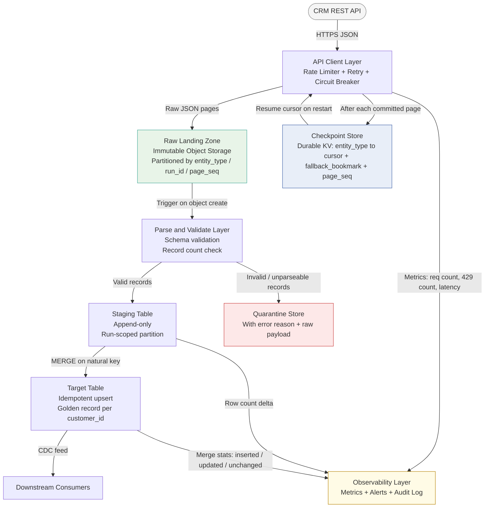

# API Pagination with Rate Limiting at Scale


---

## Problem Statement

You are tasked with ingesting 10 million customer records from a CRM system that exposes only a REST API — no direct database access is available. The API enforces a hard rate limit of 1,000 requests per minute and returns 100 records per page. The API uses cursor-based pagination exclusively; offset-based pagination is not supported. Some endpoints do not expose an `updated_at` filter, making incremental extraction non-trivial. The full load must complete within an 8-hour window. The API returns `429 Too Many Requests` on rate limit violations and exhibits occasional `5xx` errors.

This scenario is hard in production for three compounding reasons. First, the arithmetic of the rate limit creates a tight but achievable ceiling that leaves almost no margin for retries, errors, or uneven distribution — any inefficiency in request dispatch eats directly into the 8-hour window. Second, cursor-based pagination requires durable, crash-safe state management: a cursor is not a page number; it is a server-issued opaque token that expires, becomes invalid after idle time, and cannot be reconstructed if lost. Third, the absence of `updated_at` on some endpoints eliminates the most common incremental strategy and forces a full-scan approach with deduplication logic at the sink layer, turning what looks like a simple API call into a stateful, idempotent pipeline that must handle partial runs, retries, and schema changes without data loss or duplication.

The combination of a fixed time budget, a rate limit that cannot be exceeded without penalty, unreliable transport (5xx errors), cursor expiry, and mixed endpoint capabilities means that every design decision cascades: parallelism strategy, retry policy, checkpoint granularity, and sink write semantics must all be consistent with each other or the pipeline will fail in subtle ways that are difficult to reproduce.

---

## Clarifying Questions

A senior data engineer should drive the design conversation by eliminating assumptions. The following questions, grouped by theme, are the ones that matter most before committing to an architecture.

### Rate Limit and Quota

1. **Is the 1,000 req/min limit per API key, per IP, per account, or global across all consumers?** If it is per API key, spinning up multiple keys and workers multiplies effective throughput. If it is global, all workers share the same budget and a distributed counter is mandatory.
2. **Does the API return a `Retry-After` header on `429` responses, or a `X-RateLimit-Reset` timestamp?** If yes, the client must honor the server-issued wait time rather than computing its own backoff. Using a shorter wait than the server requests triggers further throttling.
3. **Is the rate limit based on a fixed window (resets at :00 of every minute), a sliding window, or a token bucket?** Fixed-window resets cause a thundering herd: all blocked clients simultaneously detect the reset and burst, producing a spike 2x the original load. Knowing the algorithm shapes the client-side dispatch strategy.

### Pagination and Cursors

4. **What is the cursor TTL — how long before an idle cursor expires?** Some APIs invalidate cursors after 15 minutes of inactivity. If a retry or pause causes the pipeline to idle past the TTL, the cursor is invalid and the run must restart from a fallback bookmark or the beginning.
5. **Are cursors opaque tokens or derived values?** Opaque base64/HMAC tokens cannot be reconstructed; derived values (e.g., last-seen ID) can be used as a fallback if the cursor expires. This determines whether the checkpoint store needs to carry both cursor and a fallback position.
6. **Does the API support partitioned or segmented cursors — for example, a cursor per entity type, per account shard, or per date range?** Partitioned cursors allow multiple independent workers without coordination, which is the most effective parallelism strategy available.

### Incremental and Filtering

7. **For endpoints without `updated_at`, does the API support any filter predicate — ID range, status, region, or any other attribute that allows splitting the full dataset into independent partitions?** Even a coarse partition (e.g., customer ID modulo N) enables parallel workers on a full scan.
8. **For entities that do have `updated_at`, is the field indexed and does the API honor it reliably — specifically, does it guarantee no records are missed if two updates share the same millisecond timestamp?** If not, a 1-minute overlap buffer is required on each incremental run.

### Data Quality and Sink

9. **What is the natural key for deduplication?** For a CRM customer record this is typically a system-assigned customer ID, but CRM systems often have merge/split events where two customer IDs are consolidated into one or one is split into two. The dedup key must be stable across these events.
10. **Is the target sink idempotent by default (MERGE/UPSERT semantics) or append-only?** If append-only, a separate dedup step is mandatory. If MERGE, the natural key and the merge predicate must be defined before the first run.

### Operational

11. **Is there a sandbox or staging API environment with a higher rate limit for testing?** Testing pagination and retry logic against a production-rate-limited API is expensive; a sandbox allows validating cursor expiry, 429 handling, and schema edge cases without consuming production quota.
12. **What is the SLA for data freshness downstream — does the 8-hour window mean the data must land and be queryable within 8 hours, or just that the extraction must complete within 8 hours?** If downstream systems query while the load is still running, the sink must handle partial state gracefully (e.g., a staging table with an atomic swap at completion).

---

## Hard Constraints

- **Rate limit must not be exceeded.** A `429` wastes a request slot and triggers a backoff wait, consuming time from the 8-hour budget. Proactive rate-limiting on the client side (pre-throttling) is mandatory.
- **Cursor state must be durable.** Cursor checkpoints must be written to a persistent store (not in-memory) before proceeding to the next page. Crash recovery must resume from the last committed checkpoint, not from the beginning.
- **Sink writes must be idempotent.** Network errors may cause a page to be fetched and partially written. Re-processing the same page must produce the same result as the first write.
- **Raw API responses must be landed before parsing.** The raw JSON payload from each page must be written to immutable object storage before any transformation. This enables deterministic replay without re-hitting the API.
- **No silent data loss.** Records that fail parsing, schema validation, or dedup logic must be routed to a quarantine store — never silently dropped.
- **8-hour wall-clock budget is a hard ceiling.** The architecture must be sized to complete within budget even when retries consume approximately 10-15% of request slots.
- **Cursor invalidation must be handled explicitly.** The pipeline must detect expired/invalidated cursors and fall back to a bookmark-based recovery strategy rather than failing the entire run.
- **Parallelism must be at the entity type level, not at the page level within a single cursor chain.** A single cursor chain is sequential by design; parallelizing within it requires API-side partitioned cursors or explicit range partitioning.

---

## Architecture Diagram



---

## Solution Design

### Layer 1: Rate Budget Calculation and Request Dispatch

Before writing a single line of code, size the problem mathematically:

```
Rate budget:
  1,000 requests/min x 100 records/page = 100,000 records/min

Minimum time for 10M records (zero retries, zero overhead):
  10,000,000 / 100,000 = 100 minutes

8-hour budget in minutes:
  8 x 60 = 480 minutes

Headroom factor:
  480 / 100 = 4.8x

Retry budget (using ~15% of request slots for retries):
  1,000 req/min x 0.15 = 150 retries/min reserved
  Effective throughput: 850 req/min x 100 = 85,000 records/min
  Adjusted minimum time: 10,000,000 / 85,000 = 118 minutes

Conclusion:
  Even with 15% retry overhead, the run fits in ~2 hours with 4x margin.
  This margin absorbs cursor invalidation restarts, schema validation
  overhead, and sink write latency without breaching the 8-hour window.
```

**Client-side rate limiter:** Implement a token bucket on the client side. Do not rely on receiving `429` as the signal to slow down — that is reactive and wasteful. Maintain a counter of requests dispatched in the current second; block dispatch when the counter reaches the per-second allocation (e.g., 16 req/sec for a 1,000/min limit). Refill the bucket at the start of each second.

**Dispatch pseudocode:**

```python
token_bucket = TokenBucket(rate=1000/60, burst=50)

for each page:
    token_bucket.acquire()          # blocks if rate exceeded
    response = api_client.get(cursor=current_cursor)
    handle(response)
```

**Multi-entity parallelism:** If the CRM exposes multiple entity types (contacts, accounts, opportunities), run one worker per entity type. Each worker receives its own rate budget allocation (e.g., 1,000 req/min divided across N workers). This is safe because each cursor chain is independent. Do NOT parallelize within a single cursor chain — pages within a chain are sequential; the next cursor is not known until the current page returns.

**Jitter on startup:** When multiple workers start simultaneously after a scheduled trigger, they will all attempt their first requests at the same instant. Add a random startup delay of 0 to 5 seconds per worker to spread the initial burst.

---

### Layer 2: Cursor Management and Durability

**What a cursor is:** A cursor is a server-issued opaque token that encodes the server's position in the result set. It is typically a base64-encoded string containing an indexed column value and a tie-breaking secondary key. The client must not parse, modify, or reconstruct it. The performance guarantee (O(1) per page) depends entirely on the server having a composite index on the cursor columns with matching sort order — without the index, you get stability but not performance.

**Checkpoint protocol — order of operations is critical:**

```
Step 1: Fetch page using current_cursor
Step 2: Write raw JSON payload to object storage (immutable landing)
Step 3: Parse and write records to staging table (idempotent upsert)
Step 4: Commit next_cursor + fallback_bookmark to checkpoint store
Step 5: Update current_cursor = next_cursor
Step 6: Proceed to next page
```

Committing the cursor (Step 4) MUST happen after the sink write (Step 3). If the process crashes between Steps 3 and 4, the page is re-fetched on restart and the idempotent upsert produces no duplicates. Committing before the sink write risks losing records permanently.

**What to store in the checkpoint:**

```json
{
  "entity_type": "contacts",
  "run_id": "2025-10-15T00:00:00Z",
  "current_cursor": "eyJsYXN0X2lkIjogMTIzNDUsICJ0cyI6ICIyMDI1LTEwLTE1In0=",
  "fallback_bookmark": "2025-10-14T23:58:00Z",
  "page_seq": 4821,
  "records_committed": 482100,
  "checkpoint_at": "2025-10-15T01:22:34Z"
}
```

The `fallback_bookmark` is the maximum `updated_at` (or equivalent timestamp) seen in records processed so far. If the cursor expires, the pipeline falls back to restarting from this bookmark — accepting that records updated between the fallback timestamp and the current time may be re-processed (handled by idempotent upsert) but no records are lost.

**Cursor invalidation handling:**

```
On receiving HTTP 410 Gone, HTTP 400 with "cursor_expired" error code,
or any response indicating the cursor is no longer valid:

  1. Log: cursor expired at page_seq N, fallback_bookmark = T
  2. If fallback_bookmark exists and endpoint supports updated_at filter:
       Restart from updated_at >= fallback_bookmark - 60s (1-minute buffer)
  3. If endpoint has no updated_at filter:
       Restart from page 1 with full-scan + dedup-at-sink strategy
       (the sink's idempotent upsert absorbs the re-scan safely)
  4. Alert: cursor invalidation event; include entity_type, page_seq, and lag
```

**Empty-page loop protection:** Some APIs return an empty page body with a non-null `next_cursor`, causing an infinite loop. Implement a circuit: if 5 consecutive pages return zero records with a non-null cursor, halt the worker and raise an alert. Do not silently loop.

**Concurrent run collision:** Two ingestion workers starting from the same checkpoint cursor will write duplicate data if the sink uses append semantics. Enforce single-writer per cursor partition using a distributed lock (e.g., SETNX on a distributed cache) or optimistic locking on the checkpoint store.

---

### Layer 3: Retry Logic and Error Handling

**Error classification — do not retry all errors equally:**

| HTTP Status | Error Class | Action |
|---|---|---|
| `429 Too Many Requests` | Transient / Rate Limited | Retry with exponential backoff + jitter; honor `Retry-After` header |
| `503 Service Unavailable` | Transient / Server Overload | Retry with exponential backoff |
| `500 Internal Server Error` | Possibly Transient | Retry up to 3 times; if persistent, circuit break |
| `502 Bad Gateway` | Transient / Proxy Error | Retry with backoff |
| `504 Gateway Timeout` | Transient | Retry with backoff; verify idempotency of request |
| `400 Bad Request` | Permanent / Client Error | Do NOT retry; log cursor + request details; alert |
| `401 Unauthorized` | Permanent / Auth Error | Do NOT retry; refresh token if OAuth; alert immediately |
| `403 Forbidden` | Permanent / Permission | Do NOT retry; alert; escalate |
| `404 Not Found` | Permanent | Do NOT retry; log; skip entity if appropriate |
| `410 Gone` | Cursor Expired | Trigger cursor invalidation recovery (see Layer 2) |

**Exponential backoff with full jitter algorithm:**

```python
import random
import time

def backoff_wait(attempt: int, base_seconds: float = 1.0, cap_seconds: float = 60.0) -> float:
    """
    Full jitter exponential backoff.
    Returns wait time in seconds.

    Formula: wait = random(0, min(cap, base * 2^attempt))

    Example wait sequence (base=1, cap=60):
      attempt=0: random(0,  1)  -> avg  0.5s
      attempt=1: random(0,  2)  -> avg  1.0s
      attempt=2: random(0,  4)  -> avg  2.0s
      attempt=3: random(0,  8)  -> avg  4.0s
      attempt=4: random(0, 16)  -> avg  8.0s
      attempt=5: random(0, 32)  -> avg 16.0s
      attempt=6: random(0, 60)  -> avg 30.0s  (capped)

    Full jitter is preferred over equal jitter because it produces
    lower mean wait time while still preventing thundering herd.
    """
    exponential = min(cap_seconds, base_seconds * (2 ** attempt))
    return random.uniform(0, exponential)


def fetch_with_retry(cursor: str, max_attempts: int = 5) -> dict:
    for attempt in range(max_attempts):
        response = api_client.get(cursor=cursor)

        if response.status_code == 200:
            return response.json()

        if response.status_code == 429:
            retry_after = response.headers.get("Retry-After")
            if retry_after:
                wait = float(retry_after)   # honor server's signal
            else:
                wait = backoff_wait(attempt)
            time.sleep(wait)
            continue

        if response.status_code in (500, 502, 503, 504):
            if attempt == max_attempts - 1:
                raise TransientError(f"Exhausted retries on {response.status_code}")
            time.sleep(backoff_wait(attempt))
            continue

        if response.status_code in (400, 401, 403, 404):
            raise PermanentError(f"Non-retryable error: {response.status_code}")

        if response.status_code == 410:
            raise CursorExpiredError("Cursor invalidated; trigger fallback recovery")

    raise TransientError("Max retry attempts exhausted")
```

**`Retry-After` header precedence:** When the API issues a `429` with a `Retry-After` header, the client MUST use that value, not its own computed backoff. Using a shorter wait violates the server's recovery signal and may result in account-level throttling or temporary bans.

**Circuit breaker states:**

- **Closed (normal):** Requests flow through.
- **Open (tripped):** After N consecutive failures (e.g., 10), stop sending requests for a cooling period (e.g., 60 seconds). Return a synthetic failure immediately rather than queuing requests.
- **Half-open (probe):** After the cooling period, send one probe request. If it succeeds, close the circuit. If it fails, reset the cooling timer and remain open.

---

### Layer 4: Raw Landing and Immutable Storage

Every API response page must be written to immutable object storage before any transformation occurs. This is non-negotiable.

**Why this matters:** If a parsing bug, schema change, or transformation error is discovered after the run completes, you must be able to re-process from the raw data without re-hitting the API. Re-hitting the API after an error means re-consuming quota, re-dealing with rate limits, and potentially receiving different data (records may have changed in the interim). Raw landing enables deterministic replay.

**Landing path convention:**

```
raw/
  entity_type=contacts/
    run_id=2025-10-15T00:00:00Z/
      page_seq=00001.json.gz
      page_seq=00002.json.gz
      ...
      page_seq=99999.json.gz
```

Partition by `entity_type` and `run_id`. Sequence number (`page_seq`) provides ordering and enables gap detection: missing page sequences in a directory indicate an incomplete run. For 10M records at ~500 bytes each uncompressed, raw storage is approximately 5 GB uncompressed or 1-2 GB compressed.

**Immutability enforcement:** Use object-storage versioning and lifecycle policies to prevent overwrites. A re-run writes to a new `run_id` path — never overwrites the previous run's raw files. This makes every run independently replayable.

---

### Layer 5: Incremental Strategy When No `updated_at` Exists

Some CRM API endpoints do not expose an `updated_at` filter, eliminating the standard incremental extraction approach. Three strategies are available, ordered by suitability:

**Strategy A: Full scan with idempotent upsert (recommended for most cases)**

Run a full scan of the endpoint on every scheduled execution. The sink uses MERGE/UPSERT semantics on the natural key. Records that have not changed produce an "unchanged" merge outcome and do not modify existing rows. Records that have changed produce an "updated" outcome. New records produce an "inserted" outcome. The run is safe to re-execute at any time.

The rate math (100 minutes minimum, 480 minutes budget) shows daily full scans are feasible with comfortable margin. For intra-day runs (hourly), the math must be rechecked against the available quota window.

**Strategy B: Hash-based change detection (for high-frequency runs)**

During the first run, compute a deterministic hash (SHA-256 of sorted, normalized field values) for each record and store it alongside the record in the target table. On subsequent runs, fetch the full record, compute the same hash, compare against the stored hash. Only write if hashes differ. This reduces sink write volume but not API read volume — the full scan still happens. The benefit is reduced write amplification on a large target table.

**Strategy C: Synthetic watermark using stable creation order (use with caution)**

If the API returns records in creation-order and supports an ID range filter (e.g., `?customer_id_gt=12345`), use the maximum ID seen in the last run as a watermark. Only fetch records with ID greater than the watermark. This misses updates to existing records. It is only correct when the use case requires new inserts only, not current state of existing records.

---

### Layer 6: Sink Design and Idempotency

**Target table structure:**

```sql
-- Run-scoped staging table (truncated per run or partitioned by run_id)
CREATE TABLE customer_staging (
    customer_id         VARCHAR(64)     NOT NULL,
    run_id              VARCHAR(64)     NOT NULL,
    page_seq            INTEGER         NOT NULL,
    raw_payload         TEXT,                       -- original JSON string
    email               VARCHAR(256),
    full_name           VARCHAR(512),
    phone               VARCHAR(64),
    account_id          VARCHAR(64),
    created_at          TIMESTAMP,
    updated_at          TIMESTAMP,
    source_system       VARCHAR(64)     DEFAULT 'crm_api',
    ingested_at         TIMESTAMP       DEFAULT CURRENT_TIMESTAMP,
    record_hash         VARCHAR(64)     -- SHA-256 of normalized field values
);

-- Golden target table
CREATE TABLE customer (
    customer_id         VARCHAR(64)     NOT NULL PRIMARY KEY,
    email               VARCHAR(256),
    full_name           VARCHAR(512),
    phone               VARCHAR(64),
    account_id          VARCHAR(64),
    created_at          TIMESTAMP,
    updated_at          TIMESTAMP,
    source_system       VARCHAR(64),
    first_seen_at       TIMESTAMP,
    last_updated_at     TIMESTAMP,
    record_hash         VARCHAR(64),
    _ingestion_run_id   VARCHAR(64)
);
```

**Merge pattern (idempotent upsert with hash guard):**

```sql
MERGE INTO customer AS target
USING (
    -- Deduplicate within the staging batch: take most-recent version per key
    SELECT DISTINCT ON (customer_id)
        customer_id, email, full_name, phone, account_id,
        created_at, updated_at, source_system, record_hash,
        run_id AS _ingestion_run_id
    FROM customer_staging
    WHERE run_id = :current_run_id
    ORDER BY customer_id, updated_at DESC NULLS LAST
) AS source
ON target.customer_id = source.customer_id

WHEN MATCHED AND target.record_hash != source.record_hash THEN
    UPDATE SET
        email               = source.email,
        full_name           = source.full_name,
        phone               = source.phone,
        account_id          = source.account_id,
        updated_at          = source.updated_at,
        last_updated_at     = CURRENT_TIMESTAMP,
        record_hash         = source.record_hash,
        _ingestion_run_id   = source._ingestion_run_id

WHEN NOT MATCHED THEN
    INSERT (customer_id, email, full_name, phone, account_id,
            created_at, updated_at, source_system,
            first_seen_at, last_updated_at, record_hash, _ingestion_run_id)
    VALUES (source.customer_id, source.email, source.full_name,
            source.phone, source.account_id, source.created_at,
            source.updated_at, source.source_system,
            CURRENT_TIMESTAMP, CURRENT_TIMESTAMP,
            source.record_hash, source._ingestion_run_id);
```

The `record_hash` guard in the MATCHED clause prevents write amplification: if a record has not changed since the last run, the update is skipped entirely. Only truly changed records incur a write.

**Atomic staging swap:** Load all pages into `customer_staging` first. Run the MERGE only after the full run completes and record counts pass validation checks. If the run fails mid-way, the staging table is incomplete and the MERGE is not executed — the target table remains consistent.

---

## Trade-offs

| Decision | Option A | Option B | Recommendation | Why |
|---|---|---|---|---|
| **Parallelism unit** | Parallel pages within one cursor chain | Parallel independent entity types / cursor partitions | Parallel entity types (Option B) | A cursor chain is inherently sequential — the next cursor is only returned in the current response. Option A requires API-side partitioned cursors (rarely available). Option B exploits natural independence between entity types with zero coordination overhead. |
| **Rate limit enforcement** | Reactive: retry on `429` | Proactive: client-side token bucket pre-throttling | Client-side token bucket (Option B) | Reactive throttling wastes request slots and burns time from the budget. Proactive throttling dispatches at exactly the allowed rate with no wasted requests. |
| **Cursor storage** | In-memory only | Durable persistent store (KV or relational table) | Durable store (Option B) | An in-memory cursor is lost on any crash, requiring a full restart. A durable checkpoint enables resume from the last committed page. Given 10M records and occasional 5xx errors, crash recovery is not an edge case — it is a baseline requirement. |
| **Incremental strategy (no `updated_at`)** | Full scan + idempotent upsert | Hash-based change detection at sink | Full scan + upsert (Option A) | Both require reading all records from the API. The upsert approach is simpler, has no additional state to manage, and the rate budget math shows the full scan fits comfortably within the 8-hour window. Hash detection adds complexity for marginal benefit at this scale. |
| **Raw landing** | Skip; parse in-flight | Always land raw JSON before parsing | Always land raw (Option B) | Skipping raw landing eliminates replay capability. If a bug is discovered post-run, the only recovery is re-hitting the API, consuming quota and receiving potentially changed data. Raw landing is a one-time cost that pays dividends on every incident. |
| **Retry on `500`** | Always retry all 5xx identically | Classify: retry `503`/`502`/`504`; limit retries on `500` | Classify by status code (Option B) | `500` may indicate a server-side bug triggered by a specific cursor position. Retrying indefinitely loops on the same broken state. Limit `500` retries to 3 and circuit-break if the error persists. |
| **Sink write timing** | Write to target directly during run | Stage first; merge atomically after full run completes | Stage + atomic merge (Option B) | Writing directly to the target during the run exposes consumers to partial state throughout the 2-hour load window. Staging keeps the target consistent; the merge runs once after full validation passes. |

---

## Failure Modes and Recovery

| Failure Scenario | Detection Method | Recovery Strategy |
|---|---|---|
| **Cursor expires mid-run** (API TTL exceeded due to pause or retry backoff) | HTTP `410 Gone` or API-specific error code; cursor checkpoint timestamp older than known TTL | Fall back to `fallback_bookmark` if endpoint supports `updated_at` filter; otherwise restart full scan from page 1. Idempotent upsert at sink absorbs the re-scan without duplicates. Alert with page sequence number and estimated re-scan cost. |
| **Rate limit exceeded (`429` storm)** | `429` response count spikes; pipeline throughput drops to zero | Honor `Retry-After` header. If no header, apply exponential backoff with full jitter. Do not decrease sleep floor below server's recovery time. If `429` rate exceeds 5% of total requests, reduce dispatch rate by 20% and alert on rate limit misconfiguration. |
| **Persistent `5xx` errors (API instability)** | 3 or more consecutive `5xx` on same cursor position; circuit breaker trips | Open circuit breaker; pause worker for cooling period (60s default). Send probe request after cooling. If probe succeeds, resume. If `5xx` persists for more than 10 minutes, alert on-call; halt worker gracefully at current checkpoint. |
| **Empty-page infinite loop** | 5 or more consecutive empty-body pages with non-null `next_cursor` | Halt worker immediately. Log cursor value and page sequence. Alert engineering team — this is an API bug, not a transient error. Do not retry; the loop will not self-resolve. |
| **Schema change mid-run** | JSON parse error or missing required field on pages after initial pages succeed; schema hash mismatch vs. first-page schema | Route affected pages to quarantine store with original raw JSON preserved. Continue processing unaffected pages. Alert on schema change; do not silently coerce unexpected types. Triage quarantine records after run completes. |
| **8-hour budget overrun** | Workflow orchestrator wall-clock timer exceeds 8 hours; records committed less than 10M | Halt at checkpoint. Preserve cursor state. Analyze cause: excessive retries (check `429` count), slow sink writes (check merge latency), under-provisioned workers (check throughput per worker). Do not simply extend the window — identify and fix the root cause. |
| **Checkpoint store unavailable** | Write to checkpoint fails with connection error after successful page fetch | Do not proceed to the next page without a committed checkpoint. Retry checkpoint write with backoff for up to 2 minutes. If still unavailable, halt the worker gracefully at the current cursor. Preferable to losing position and re-processing thousands of pages. |
| **Natural key collision** (two source records with identical `customer_id`) | MERGE produces unexpected row counts; record hash audit detects conflicting values on same key | Route duplicate-key records to quarantine table with both conflicting payloads. Do not auto-resolve without business logic. Alert data stewards. These typically reflect CRM data quality issues (merge events, test records, migration artifacts). |

---

## Observability Checklist

### Throughput and Progress Metrics

- Records fetched per minute (by entity type)
- Pages completed per minute (by entity type)
- Records committed to staging per minute
- Cumulative records committed vs. total expected (10M target)
- Estimated time to completion (ETA) — recomputed every 5 minutes
- Pages remaining vs. pages completed (requires knowing total page count, if the API exposes it)

### Rate Limit Metrics

- `429` response count per minute (by entity type)
- `429` rate as a percentage of total requests in the window
- `Retry-After` wait time distribution (p50, p95)
- Token bucket fill level (current available tokens)
- Consecutive `429` streak length (circuit breaker input metric)

### Reliability Metrics

- `5xx` response count per minute (by status code)
- Retry attempt distribution (histogram: how many requests needed 1, 2, 3+ retries)
- Circuit breaker state changes (open / closed / half-open transitions with timestamps)
- Cursor invalidation events (count and page sequence where they occurred)
- Checkpoint write latency (p95)
- Checkpoint store write failure count

### Data Quality Metrics

- Quarantine record count per run (by error reason: parse failure, schema mismatch, key collision)
- Records with null natural key (should be zero; alert immediately if non-zero)
- Staging record count vs. target record count post-merge
- MERGE outcomes per run: inserted count, updated count, unchanged count
- Record hash mismatch rate (updated / total — unexpected spikes indicate upstream data churn)

### Pipeline Health Metrics

- Run start time, end time, elapsed duration
- Peak memory usage of worker processes
- Object storage write latency (p95) for raw landing
- Sink write latency (p95) for staging upserts and final merge

### Alert Tiers

| Alert | Severity | Threshold | Response |
|---|---|---|---|
| ETA exceeds 8-hour budget | Critical (page) | ETA greater than 7 hours with less than 80% complete | Investigate throughput immediately; check `429` rate and retry latency |
| `429` rate spike | High | `429` greater than 5% of requests in any 5-min window | Reduce dispatch rate; verify token bucket configuration |
| Circuit breaker opened | High | Any state change to Open | Alert on-call; investigate API health dashboard |
| Cursor invalidation event | High | Any occurrence | Log page sequence; verify fallback recovery triggered correctly |
| Quarantine records spike | Medium | Quarantine count greater than 0.1% of page records | Inspect raw payload for schema change |
| Checkpoint store write failure | Critical (page) | Any write failure | Halt worker; do not proceed without durable checkpoint |
| Run did not start by scheduled time | Medium | Run not in "running" state within 5 min of scheduled trigger | Alert on workflow orchestrator health; check worker logs |
| Zero records committed in 10 minutes | High | Throughput equals zero for 10 or more consecutive minutes | Check circuit breaker state; check API connectivity; check worker logs |

---

## Interview Answer Template

When asked this question in an interview, structure your verbal answer using the **constraint-elimination technique**: state the constraint, explain why it eliminates certain approaches, and arrive at the design through elimination rather than assertion. This demonstrates reasoning over recall.

**Opening — rate budget math (30 seconds):**
"Before designing anything, I do the rate budget math because it determines whether the 8-hour window is comfortable or tight. At 1,000 requests per minute and 100 records per page, that is 100,000 records per minute. For 10 million records, the minimum extraction time with zero retries is 100 minutes. With 15% retry overhead, call it 120 minutes. The 8-hour window gives nearly 4x headroom — so this is feasible, but only if retry and error handling is tight."

**Pagination and cursor durability (45 seconds):**
"The cursor-based pagination eliminates offset-based designs — offset pagination breaks at scale and has consistency problems on live data. Cursor pagination is O(1) per page on the server given a composite index on the cursor columns. The key engineering challenge is that cursors are stateful and expire. I need a durable checkpoint store — not in-memory — that persists the current cursor and a fallback bookmark after every successfully committed page. The commit order matters: write to sink first, then commit cursor. Reversing this risks permanent data loss."

**Rate limiting and retry (45 seconds):**
"I use a client-side token bucket for proactive pre-throttling — I never want to receive a `429` because it wastes a slot and burns time from the budget. When a `429` does arrive, I honor the `Retry-After` header if present; otherwise I apply exponential backoff with full jitter to avoid the thundering herd problem that occurs when all throttled clients detect the rate limit window reset simultaneously. I wrap the API client in a circuit breaker: if 10 consecutive requests fail, stop for 60 seconds, then probe with a single request before resuming."

**Incremental strategy for endpoints without `updated_at` (30 seconds):**
"For endpoints without `updated_at`, I use full scan plus idempotent upsert at the sink. The rate math shows the full scan fits in 2 hours — well within budget. I land the raw JSON to object storage before any transformation, which enables deterministic replay without re-hitting the API. I stage all records in a run-scoped staging table and merge into the target atomically only after the full run completes and record counts pass validation."

**Parallelism (20 seconds):**
"Parallelism is at the entity type level, not at the page level within a cursor chain. A cursor chain is sequential by design — the next cursor is not known until the current page returns. If the CRM exposes contacts, accounts, and opportunities as separate endpoints, I run one worker per endpoint with the rate budget divided across workers."

**Closing — the three silent failure modes (20 seconds):**
"The three things that cause silent production failures if you get them wrong: committing the cursor before the sink write, not handling cursor expiry explicitly, and retrying `400` errors as if they were `503`. Everything else — backoff formula, storage partitioning, merge semantics — follows from standard idempotency patterns once those three are locked in."

---

## Appendix: Cursor Pagination vs. Offset Pagination Reference

| Property | Offset Pagination | Cursor (Keyset) Pagination |
|---|---|---|
| Server query complexity | O(n) — must scan and discard all preceding rows | O(1) per page given composite index on cursor columns |
| Consistency under concurrent writes | Rows can be skipped or duplicated if inserts/deletes occur between pages | Stable — records inserted before cursor position do not affect subsequent pages |
| Client state required | None — page number is self-contained | Cursor must be stored and recovered on restart |
| Cursor expiry risk | None | Yes — server-side TTL may invalidate cursor |
| Random access (jump to page N) | Supported natively | Not supported — must paginate sequentially |
| Index requirement | Any index on sort column | Composite index on (sort_col, tie_break_col) |
| Scale behavior | Degrades linearly; LIMIT 100 OFFSET 5000000 scans 5M rows | Constant regardless of depth, given correct indexing |
| Parallel page fetching | Possible with range partitioning (requires coordination) | Only possible with server-issued partitioned cursors |

---

*Reference: data_ingestion_patterns/05-api-pagination-rate-limited.md*
*Research claims verified: adversarial 3-vote pass on all major claims (cursor O(1) with caveat, thundering herd, backoff with jitter, cursor invalidation TTL)*
*Last updated: 2026-06-11*
