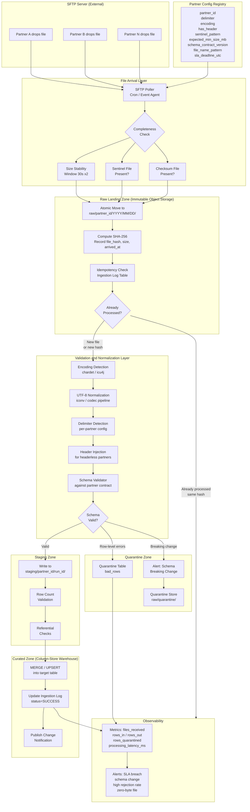

# SFTP File Drop Ingestion — B2B Partner Data Exchange

> **Domain:** Data Ingestion | **Difficulty:** Senior / Staff | **Category:** File-Based Batch Ingestion

---

## Problem Statement

B2B file-drop ingestion occupies an awkward position in the data engineering stack: it is simple enough that teams underestimate it, yet adversarial enough in practice that under-engineered pipelines accumulate silent data quality failures for months before anyone notices. The fundamental challenge is that you have no API handshake, no delivery acknowledgment protocol, and no guaranteed ordering. Files arrive whenever partners feel like sending them. Partners crash mid-transfer. Partners re-send the same filename with corrected data and expect you to overwrite the previous version silently. Some partners have never heard of UTF-8.

At scale — fifteen external partners, files ranging from 1 MB to 50 GB, arriving unpredictably around the clock — the naive approach of "poll, read, load" collapses under a specific set of compounding failures: partial uploads processed as complete files, restatement files ignored because the filename was already seen, encoding errors silently truncating rows, and schema drifts from partners who change their extract format without notification. Each of these failures is individually recoverable if detected promptly; the dangerous scenario is the combination of several occurring simultaneously across different partners, producing subtly wrong data in the warehouse without any pipeline error surfacing.

The deeper engineering problem is that you are building a reliable system on top of an unreliable protocol. SFTP was designed for interactive file transfer by humans, not as a machine-to-machine data delivery substrate. It has no native event notification, no transaction semantics, no built-in deduplication, and inconsistent behavior across server implementations for features like file locking. Every reliability guarantee in this architecture must be built in the consumer, not assumed from the protocol.

---

## Clarifying Questions

### File Arrival and Delivery

1. **Delivery schedule:** Do any partners have a committed delivery SLA (e.g., "file arrives by 06:00 UTC daily"), or are all 15 partners truly unpredictable with no SLA? The answer determines whether you need absence alerting with a hard deadline or just anomaly detection on delivery frequency.

2. **File naming conventions:** Is the filename stable across deliveries (e.g., `acme_orders.csv` always replaces the previous `acme_orders.csv`), or do partners embed timestamps in filenames (e.g., `acme_orders_20251015.csv`)? Mixed conventions across 15 partners require per-partner filename pattern config.

3. **Completeness signaling:** Do any partners currently send a sentinel file (`.done`, `.ctl`, `.manifest`) after upload completion, or is this a new capability you could negotiate with them? Even getting 5 of 15 partners to adopt this pattern significantly reduces partial-file risk.

4. **Correction semantics:** When a partner re-drops a file as a correction, does it always replace the full dataset (full-replacement), or do some partners send delta corrections (only the changed rows)? These require fundamentally different processing logic.

### File Content and Schema

5. **Header rows and schema contracts:** For the partners who send no header row, do you have a documented column contract (column names, order, types) in writing with each partner, or is column order inferred from samples? A partner silently adding a column shifts all subsequent column positions.

6. **Delimiter consistency:** Are delimiters consistent per partner (always CSV, always pipe), or can a single partner switch formats between deliveries? Some ERPs export CSV by default but switch to pipe-delimited for larger extracts.

7. **Encoding detection:** Are the Latin-1 partners a known fixed set, or could any partner switch encoding without notice? If the set is unknown, you need runtime encoding detection, not just a per-partner config flag.

8. **File size distribution:** Is the 50 GB upper bound a theoretical maximum or a regular occurrence? Files above ~5 GB require streaming processing rather than load-into-memory approaches — the architecture changes significantly at that threshold.

### Downstream and Operations

9. **Downstream SLA:** What is the acceptable latency from file arrival to data available in the warehouse — minutes, hours, or a daily batch window? This determines whether you need near-real-time processing or whether a 15-minute polling interval is acceptable.

10. **Reprocessing scope:** When a correction file arrives (same filename, new data), must you reprocess only that partner's data, or does downstream logic depend on cross-partner joins that require reprocessing multiple partners together?

11. **Audit and compliance:** Is there a regulatory requirement to retain the original raw files (pre-transformation) for a defined retention period? This determines whether the raw landing zone needs immutable write-once storage.

12. **Partner onboarding cadence:** How frequently are new partners added? If onboarding is monthly, a config-registry-driven architecture pays off quickly; if partners are added once a year, simpler per-partner config files may suffice.

---

## Hard Constraints

- **Never process a file that is still being uploaded.** A partial file loaded into the warehouse is worse than a missing file because it silently corrupts downstream aggregations.
- **Same filename with different content must trigger reprocessing, not be silently skipped.** File-level idempotency must be hash-based, not name-based.
- **All raw files must be retained in an immutable landing zone before any transformation.** This enables deterministic replay without re-pulling from the vendor.
- **Encoding must be normalized to UTF-8 before any downstream processing.** Mixed-encoding data in the warehouse causes non-deterministic query behavior.
- **Malformed records must be quarantined, never silently dropped.** Silent drops are invisible until a downstream audit reveals missing data.
- **Schema validation must run before any data is written to the curated zone.** Breaking schema changes must halt processing and alert, not corrupt the target table.
- **Processing must be idempotent end-to-end.** Re-running any pipeline stage over the same raw input must produce identical output with no duplicates.
- **No vendor-specific SFTP locking behavior may be relied upon.** File completeness detection must use portable, server-agnostic methods.
- **Files above a minimum size threshold (configurable per partner) must be validated before processing.** A 50 GB partner delivering a 2 KB file is an anomaly, not a valid empty delivery.

---

## Architecture Diagram



---

## Solution Design

### 5.1 Partner Config Registry

Every architectural decision that varies per partner — delimiter, encoding, filename pattern, schema contract, SLA deadline — must be externalized into a config registry, not hardcoded in pipeline logic. This registry is the single source of truth for onboarding new partners and modifying existing ones without deploying code.

**Minimum schema for the registry:**

```sql
CREATE TABLE partner_config (
    partner_id          VARCHAR(64)     PRIMARY KEY,
    display_name        VARCHAR(255)    NOT NULL,
    sftp_directory      VARCHAR(512)    NOT NULL,
    file_name_pattern   VARCHAR(255)    NOT NULL,   -- regex, e.g. "^acme_orders.*\.csv$"
    delimiter           CHAR(1)         NOT NULL,   -- ',' or '|' or '\t'
    encoding            VARCHAR(32)     NOT NULL,   -- 'utf-8', 'latin-1', 'auto'
    has_header_row      BOOLEAN         NOT NULL,
    column_contract_id  VARCHAR(64)     NOT NULL REFERENCES column_contracts(contract_id),
    sentinel_pattern    VARCHAR(255),               -- NULL if not used; e.g. "^acme_orders.*\.done$"
    checksum_pattern    VARCHAR(255),               -- NULL if not used; e.g. "^acme_orders.*\.md5$"
    expected_min_size_mb DECIMAL(10,2),             -- alert if delivered file is below this
    expected_max_size_mb DECIMAL(10,2),             -- alert if above (possible runaway extract)
    sla_deadline_utc    TIME,                       -- NULL if no SLA
    sla_frequency       VARCHAR(32),                -- 'daily', 'weekly', 'adhoc'
    correction_mode     VARCHAR(32)     NOT NULL,   -- 'full_replace' or 'delta_upsert'
    target_table        VARCHAR(255)    NOT NULL,
    natural_key_columns VARCHAR(1024),              -- comma-separated column names for upsert
    is_active           BOOLEAN         NOT NULL DEFAULT TRUE,
    created_at          TIMESTAMPTZ     NOT NULL DEFAULT NOW(),
    updated_at          TIMESTAMPTZ     NOT NULL DEFAULT NOW()
);
```

The `column_contracts` table stores the expected schema per partner with column names, positions (for headerless files), data types, and nullability. Contract versions are immutable — a new contract version is created when a partner changes their schema, and the ingestion log records which contract version was used for each file.

**Runtime behavior:** When a file arrives, the poller looks up the partner config by matching the file's source directory and filename against `sftp_directory` and `file_name_pattern`. If no match is found, the file is quarantined and an alert fires — unrecognized files must never be silently ignored.

### 5.2 File Arrival Detection

**Polling approach:** A scheduler runs every N minutes (configurable; typically 1–5 minutes for time-sensitive partners, 15 minutes for daily-batch partners). It connects to the SFTP server, lists the directory, and compares the result against a local manifest of already-seen files. New files are queued for completeness checking.

Polling has two failure modes to design around: (1) the poll interval must be shorter than the minimum acceptable processing latency, and (2) listing large directories repeatedly is expensive — use directory-per-partner layouts rather than a flat shared directory, and filter by filename pattern before inspecting file metadata.

**Event-driven approach (preferred where available):** Some SFTP server deployments support inotify events (Linux) or can be configured to write to a message broker on file close. This eliminates polling latency and server load. Where available, configure the SFTP server to emit a file-closed event to an internal message queue; the ingestion worker subscribes to this queue. Events are more reliable than polling for detecting files that arrive and complete upload within a single polling interval.

**Hybrid pattern (most production deployments):** Files are synced from SFTP to object storage by a lightweight bridge agent running on the SFTP server host. Object storage natively supports event-on-object-create notifications. The ingestion pipeline subscribes to these notifications. The bridge agent is stateless — it syncs all files it finds and lets the ingestion pipeline's idempotency layer handle deduplication. This decouples the unreliable SFTP substrate from the reliable event-driven processing layer.

### 5.3 File Completeness Detection

This is the most critical correctness concern in the entire architecture. A partial file loaded into the warehouse silently corrupts all downstream aggregations with no error surfacing in the pipeline logs.

**Strategy 1 — Sentinel file (most reliable; requires partner cooperation):**
The partner uploads the data file, then writes a zero-byte `.done` or `.ctl` file with a matching name stem after the upload completes. The consumer holds the data file in a pending state until the sentinel appears. The sentinel file approach works even for files that take hours to upload (large files, slow connections). It is the only strategy that provides a definitive signal from the producer that the file is complete. Negotiate this with partners during onboarding — even offering to provide a simple shell script wrapper that creates the sentinel file after their existing FTP command.

```
acme_orders_20251015.csv      ← data file
acme_orders_20251015.csv.done ← sentinel: created after upload completes
```

**Strategy 2 — Checksum file (reliable; detects corruption too):**
The partner generates an MD5 or SHA-256 hash of the data file and uploads it as a sidecar file. The consumer downloads both files, computes the hash of the data file, and compares. This simultaneously validates completeness and detects corruption or transmission errors. Preferred over sentinel-only for files where bit-flip corruption is a concern (very large files, compressed files where a single bit error corrupts decompression).

```
acme_orders_20251015.csv
acme_orders_20251015.csv.md5   ← contains: d41d8cd98f00b204e9800998ecf8427e
```

**Strategy 3 — Size stability window (portable fallback; no partner changes required):**
Poll the file size twice with a gap of 30–60 seconds. If the size is identical on both polls, treat the upload as likely complete. This is a heuristic, not a guarantee — a partner that uploads exactly 30 seconds worth of data between your two polls will produce a false positive. Combine with a minimum time-since-first-seen threshold (e.g., do not process any file seen for less than 90 seconds) to reduce this risk.

Implementation:

```python
def is_upload_stable(sftp_client, remote_path: str, stability_window_seconds: int = 30) -> bool:
    size_t0 = sftp_client.stat(remote_path).st_size
    time.sleep(stability_window_seconds)
    size_t1 = sftp_client.stat(remote_path).st_size
    return size_t0 == size_t1 and size_t0 > 0
```

**Strategy 4 — Minimum size threshold (defense-in-depth):**
Every partner config includes an `expected_min_size_mb`. A file that is suspiciously small (e.g., a partner who normally sends 2 GB sending 4 KB) is almost certainly a partial upload or an accidentally empty extract. Reject and alert rather than processing a near-empty file as a valid empty delivery.

**Production recommendation:** Use sentinel file as the primary strategy for partners you can negotiate with. Use checksum file for high-value, large-file partners. Use size stability window as the fallback for legacy partners who cannot be modified. Layer minimum size threshold as defense-in-depth for all partners regardless of primary strategy.

**Critical caveat on SFTP file locking:** Some documentation suggests attempting an exclusive lock on the file to detect active uploads. Do not rely on this. Many SFTP server implementations (including widely deployed OpenSSH SFTP subsystem and ProFTPD) do not enforce file locks at the server level. A lock attempt will succeed even while the file is being actively written. This approach produces false confidence and should not be used.

### 5.4 Atomic Move to Raw Landing Zone

Once a file passes completeness checks, it must be atomically moved to the immutable raw landing zone. "Atomic" here means: the file either fully appears in the landing zone, or it does not appear at all. There is no intermediate state where a partially-copied file exists in the landing zone.

**On object storage:** Upload the file to a staging prefix (e.g., `raw/staging/partner_id/filename`), then use the object storage's atomic rename/copy operation to move it to the permanent prefix (e.g., `raw/partner_id/YYYY/MM/DD/filename`). Compute and record the SHA-256 hash during upload.

**Directory layout:**

```
raw/
  partner_id=acme/
    year=2025/month=10/day=15/
      acme_orders_20251015.csv          ← immutable; never modified after landing
      acme_orders_20251015.csv.meta.json ← file_hash, file_size, arrived_at, partner_id
```

The `.meta.json` sidecar is written atomically alongside the data file and contains all provenance metadata needed to reproduce the ingestion decision. The raw zone is append-only — files are never modified or deleted after landing. Corrections produce new files in the same directory partition with a new `landed_at` timestamp.

### 5.5 Idempotency Gate (Ingestion Log)

Before any processing, check the ingestion log to determine whether this exact file content has already been successfully processed:

```sql
CREATE TABLE ingestion_log (
    log_id              BIGSERIAL       PRIMARY KEY,
    partner_id          VARCHAR(64)     NOT NULL,
    file_name           VARCHAR(512)    NOT NULL,
    file_hash_sha256    CHAR(64)        NOT NULL,
    file_size_bytes     BIGINT          NOT NULL,
    landed_at           TIMESTAMPTZ     NOT NULL,
    processing_started_at TIMESTAMPTZ,
    processing_completed_at TIMESTAMPTZ,
    rows_read           BIGINT,
    rows_loaded         BIGINT,
    rows_quarantined    BIGINT,
    status              VARCHAR(32)     NOT NULL,  -- PENDING, PROCESSING, SUCCESS, FAILED, DUPLICATE, QUARANTINED
    contract_version    VARCHAR(64),
    run_id              UUID,
    error_message       TEXT,
    CONSTRAINT uq_file_hash UNIQUE (partner_id, file_hash_sha256)
);
```

**Decision logic:**

| Scenario | file_name match | file_hash match | Action |
|---|---|---|---|
| New file, new content | No | No | Process normally |
| Exact duplicate (same name, same content) | Yes | Yes | Skip with status=DUPLICATE; log and alert |
| Correction file (same name, different content) | Yes | No | Process as correction; mark previous SUCCESS record as SUPERSEDED |
| Renamed file with same content | No | Yes | Log as duplicate with different name; skip loading; alert for investigation |

The constraint `UNIQUE (partner_id, file_hash_sha256)` ensures that even if two pipeline workers race to process the same file, only one will successfully insert a PROCESSING record. The other will receive a constraint violation and back off.

**Correction handling (same filename, new content):**
When a partner re-drops a file with the same name but different content, this represents a full replacement of the previous delivery. The pipeline must:
1. Mark the previous `ingestion_log` record for this partner + filename as `SUPERSEDED`
2. Process the new file normally
3. For `full_replace` partners: truncate and reload the target table partition; for `delta_upsert` partners: run a MERGE using the natural key

The correction workflow must be idempotent — if the pipeline crashes mid-correction and restarts, it must produce the same result.

### 5.6 Encoding Detection and Normalization

Encoding must be resolved before any row-level parsing. Attempting to parse a Latin-1 encoded file as UTF-8 produces one of two outcomes: a hard exception on the first non-ASCII byte, or silent replacement of characters with the Unicode replacement character (U+FFFD). Both are unacceptable.

**Detection pipeline:**

1. **Check partner config first.** If `encoding = 'utf-8'` or `encoding = 'latin-1'`, trust the config. Only invoke auto-detection if `encoding = 'auto'` or if the config's declared encoding fails validation.

2. **BOM detection.** Check the first 3 bytes for a UTF-8 BOM (0xEF 0xBB 0xBF), UTF-16 LE BOM (0xFF 0xFE), or UTF-16 BE BOM (0xFE 0xFF). If found, the encoding is definitively known. Strip the BOM before processing.

3. **Statistical detection.** Run a character-frequency-based detector (chardet, icu4j, or equivalent) on the first 64 KB of the file. These detectors are probabilistic — they return a confidence score. Only accept the detection if confidence exceeds 0.90. If confidence is below threshold, quarantine the file and alert.

4. **Normalization.** Transcode the entire file from detected encoding to UTF-8 using a lossless codec pipeline. Configure the transcoder to fail loudly (not silently replace) on unmappable characters — an unmappable character is a signal of misidentified encoding or corrupted data.

5. **Validation sweep.** After transcoding, validate that the output is valid UTF-8 by scanning all bytes. Log any rows containing the replacement character as encoding-suspicious.

**Critical edge case — mixed-encoding files:** Some partners produce files where the header row is UTF-8 (auto-generated by software) and data rows contain Latin-1 characters from a legacy database. Statistical detection on the first 64 KB may not detect the Latin-1 rows if the header dominates the sample. Mitigation: run encoding validation on a random sample of rows from the file body, not just the header.

### 5.7 Schema Validation

Schema validation occurs after encoding normalization, before any data is written to staging. The validator compares the parsed file structure against the contract stored in `column_contracts`.

**For files with header rows:**
- Parse the header row and extract column names
- Compare against the contract: extra columns, missing columns, renamed columns
- Non-breaking additions (new nullable columns not in the contract): log a warning, continue processing, trigger schema evolution workflow to update contract
- Missing required columns or renamed columns: halt processing, quarantine file, fire high-priority alert

**For files without header rows:**
- Column mapping is purely positional based on the contract
- A partner adding or removing a column without notification shifts all subsequent column positions silently — this is the highest-risk schema scenario for headerless files
- Mitigation: validate row width (column count per row) against the contract; if any row has a different column count, quarantine and alert immediately

**Type validation:**
- For critical numeric and date columns, validate a sample of values against the declared type
- A column declared as DECIMAL that contains string values like "N/A" or "–" is a common vendor data quality issue
- Log type mismatches to the quarantine table as row-level errors; do not reject the entire file unless the mismatch rate exceeds the configured threshold (e.g., >1% of rows)

**Schema contract versioning:**
When a non-breaking schema change is detected (e.g., a new column added), automatically create a new contract version and associate it with this file's ingestion log record. This creates an audit trail of schema evolution without blocking processing.

### 5.8 Streaming Processing for Large Files

Files up to ~500 MB can be read into memory on a adequately provisioned worker. Files above this threshold require streaming processing — reading and processing in chunks rather than loading the entire file.

**Streaming architecture:**
- Open the file as a byte stream from object storage
- Pass through the encoding transcoder as a streaming filter
- Parse CSV/pipe-delimited rows incrementally using a streaming parser (never load the entire file into a dataframe)
- Write parsed rows to staging in micro-batches of 10,000–50,000 rows
- Track row count throughout to enable progress monitoring and anomaly detection

**Memory-bounded processing pattern:**

```python
def stream_process_file(raw_path: str, partner_config: PartnerConfig, run_id: str):
    row_count = 0
    quarantine_count = 0
    batch = []

    with open_streaming(raw_path, encoding='utf-8') as stream:
        reader = delimited_reader(stream, delimiter=partner_config.delimiter)

        if partner_config.has_header_row:
            header = next(reader)
            validate_header(header, partner_config.contract)
        else:
            # Inject synthetic header from contract
            header = [col.name for col in partner_config.contract.columns]

        for row in reader:
            row_count += 1
            try:
                validated_row = validate_and_cast_row(row, header, partner_config.contract)
                batch.append(validated_row)
            except RowValidationError as e:
                quarantine_row(row, e, run_id)
                quarantine_count += 1

            if len(batch) >= BATCH_SIZE:
                write_batch_to_staging(batch, partner_config, run_id)
                batch = []

        if batch:
            write_batch_to_staging(batch, partner_config, run_id)

    return row_count, quarantine_count
```

**Checkpoint within large files:** For files above 10 GB, implement intra-file checkpointing: record the byte offset and row count after each staging batch commit. If the process crashes mid-file, resume from the last checkpoint rather than reprocessing from the beginning.

### 5.9 Quarantine Zone

The quarantine zone is first-class infrastructure, not an afterthought. It captures three categories of rejected content:

**Category 1 — Entire files (file-level quarantine):**
Files that fail completeness checks, schema validation (breaking changes), or hash verification. Stored in `raw/quarantine/file/partner_id/YYYY/MM/DD/` with a sidecar JSON explaining the rejection reason.

**Category 2 — Individual rows (row-level quarantine):**
Rows within an otherwise valid file that fail type validation, referential checks, or encoding validation. Stored in a `quarantine_rows` table:

```sql
CREATE TABLE quarantine_rows (
    quarantine_id       BIGSERIAL       PRIMARY KEY,
    run_id              UUID            NOT NULL,
    partner_id          VARCHAR(64)     NOT NULL,
    file_name           VARCHAR(512)    NOT NULL,
    file_hash_sha256    CHAR(64)        NOT NULL,
    row_number          BIGINT          NOT NULL,
    raw_row_content     TEXT            NOT NULL,
    rejection_reason    VARCHAR(64)     NOT NULL,   -- 'TYPE_MISMATCH', 'NULL_REQUIRED_FIELD', 'ENCODING_ERROR', etc.
    rejection_detail    TEXT,
    quarantined_at      TIMESTAMPTZ     NOT NULL DEFAULT NOW()
);
```

**Category 3 — Unrecognized files:**
Files that do not match any partner config. Stored with an alert; never silently ignored.

**Quarantine SLOs:**
- File-level quarantine items: reviewed within 4 business hours
- Row-level quarantine rate >1% for any partner: alert within 15 minutes
- Unrecognized files: alert immediately

### 5.10 Staging-to-Curated Promotion

After streaming processing writes to the staging zone and row-count validation passes, promote data to the curated zone:

**Full replace (correction mode = `full_replace`):**
```sql
-- Atomic partition swap: delete old partition, insert new partition in a transaction
BEGIN;
DELETE FROM target_table WHERE partner_id = :partner_id AND load_date = :load_date;
INSERT INTO target_table SELECT * FROM staging_table WHERE run_id = :run_id;
UPDATE ingestion_log SET status = 'SUCCESS', rows_loaded = :rows_loaded WHERE run_id = :run_id;
COMMIT;
```

**Delta upsert (correction mode = `delta_upsert`):**
```sql
MERGE INTO target_table AS t
USING (SELECT * FROM staging_table WHERE run_id = :run_id) AS s
ON (t.partner_id = s.partner_id AND t.entity_id = s.entity_id)
WHEN MATCHED THEN
    UPDATE SET
        t.field_a = s.field_a,
        t.field_b = s.field_b,
        t.updated_at = s.updated_at,
        t.source_run_id = s.run_id
WHEN NOT MATCHED THEN
    INSERT (partner_id, entity_id, field_a, field_b, created_at, updated_at, source_run_id)
    VALUES (s.partner_id, s.entity_id, s.field_a, s.field_b, NOW(), s.updated_at, s.run_id);
```

---

## Trade-offs

| Decision | Option A | Option B | Recommendation | Why |
|---|---|---|---|---|
| **Completeness detection** | Size stability window (no vendor changes) | Sentinel file (requires vendor cooperation) | Sentinel for negotiable partners; stability window as fallback | Sentinel is definitive and works for arbitrarily slow uploads. Stability window is a heuristic that fails for slow uniform uploads. The 15-partner scale justifies the onboarding effort. |
| **Encoding strategy** | Trust partner config; fail hard on mismatch | Auto-detect encoding at runtime for all files | Auto-detect with config override | Config can be wrong or stale. Auto-detect with >0.90 confidence provides a safety net. Trust the config first to avoid performance cost of detection on high-frequency partners. |
| **File idempotency key** | filename only | filename + SHA-256 hash | filename + SHA-256 hash | Filename-only idempotency silently skips correction files that have the same name but new content — the most dangerous failure mode for B2B restatements. Hash-based detection catches this. |
| **Partial-file window** | 30-second stability check | Sentinel file | Sentinel where possible; 30s + minimum size threshold as defense-in-depth | A 30-second window is fragile for files that upload at an exactly stable 1 MB/s. Layering minimum size threshold catches the "partial upload that happened to stabilize" case. |
| **Schema evolution handling** | Halt on any schema change | Auto-evolve schema silently | Halt on breaking changes; auto-evolve non-breaking changes with alert | Silent auto-evolution on breaking changes (missing required columns, type changes) corrupts downstream. Non-breaking additions (new nullable columns) can be tolerated with a logged alert and contract version bump. |
| **Large file processing** | Distributed compute engine for all files | Single-worker streaming for files under 5 GB; distributed for larger | Tiered: streaming worker up to 5 GB; distributed compute engine above | Launching a distributed compute job for a 5 MB file is operational overhead with no benefit. Single-worker streaming is simpler, faster to start, and sufficient for the majority of partner files. Reserve distributed processing for genuinely large files. |
| **Quarantine behavior** | Reject entire file if any row is invalid | Quarantine invalid rows; continue processing valid rows | Row-level quarantine with configurable rejection rate threshold | Rejecting an entire 50 GB file because 3 rows have a null in a non-required field is disproportionate. Row-level quarantine with a rejection rate threshold (e.g., halt if >5% of rows are bad) balances quality with pragmatism. |

---

## Failure Modes and Recovery

| Failure | Detection Method | Recovery Strategy |
|---|---|---|
| **Partial file processed** | Row count is below `expected_min_rows` (rolling average); downstream aggregates show anomaly | Delete staged rows for this run; delete raw file from landing zone (or mark as INVALID); wait for re-delivery or request re-send from partner; re-process when complete file arrives |
| **File never arrives (SLA breach)** | Scheduled absence check: query `ingestion_log` for expected partner + date combinations where no SUCCESS record exists past `sla_deadline_utc` | Fire page-level alert to on-call; escalate to partner account team; downstream jobs that depend on this partner's data must be held or run with stale data flag |
| **Correction file missed (same name, old hash accepted)** | Only detectable if idempotency uses filename-only (design bug); prevented by hash-based idempotency | Require hash-based idempotency as hard constraint; if deployed without it, build a reconciliation query comparing partner-reported record counts against warehouse counts |
| **Encoding misidentification** | Parse exceptions mid-file; rows with Unicode replacement character (U+FFFD) in output; character distribution anomaly in string columns | Quarantine affected rows; escalate to partner for encoding declaration in writing; update partner config; re-process raw file from landing zone |
| **Schema breaking change** | Schema validator detects missing required column or type mismatch; pipeline halts and fires alert | Quarantine entire file; notify partner account team; update column contract after understanding the change; re-process from raw landing zone once contract is updated |
| **Duplicate delivery (same content)** | `ingestion_log` UNIQUE constraint on `(partner_id, file_hash_sha256)` catches it | Log as DUPLICATE; skip processing; optionally alert partner that duplicate delivery occurred (some partners re-send unnecessarily, wasting bandwidth) |
| **Zero-byte or near-empty file** | `file_size_bytes = 0` or below `expected_min_size_mb` | Quarantine; fire alert; do not mark as SUCCESS; request re-delivery; do not treat as "valid empty delivery" unless partner explicitly sends an empty file with a manifest indicating no data for this period |
| **Concurrent workers racing on same file** | Two workers attempt to insert `(partner_id, file_hash_sha256)` into `ingestion_log`; one gets constraint violation | The losing worker detects the constraint violation and backs off; it polls `ingestion_log` until the winning worker completes or fails; if winner fails, losing worker retakes the file |

---

## Observability Checklist

### File Arrival Metrics

- `files_received_total` — counter by `partner_id`; baseline: expected daily delivery count per partner
- `file_size_bytes` — histogram by `partner_id`; alert on values below `expected_min_size_mb`
- `file_arrival_delay_minutes` — time from expected SLA deadline to actual arrival; alert on breach
- `files_pending_completeness_check` — gauge; alert if any file is stuck in pending state for >N minutes (configurable per partner based on expected upload duration)

### Processing Metrics

- `rows_read_total` — counter by `partner_id`, `run_id`
- `rows_loaded_total` — counter by `partner_id`, `run_id`
- `rows_quarantined_total` — counter by `partner_id`, `run_id`, `rejection_reason`
- `quarantine_rate_pct` — `rows_quarantined / rows_read * 100`; alert at >1%; page at >5%
- `processing_duration_seconds` — histogram by `partner_id`; alert on >2x rolling average (possible large correction file or performance regression)
- `encoding_detection_confidence` — histogram; alert if any detection below 0.90
- `schema_validation_failures_total` — counter by `partner_id`, `change_type` (breaking vs. non-breaking)

### Idempotency and Correctness Metrics

- `duplicate_files_skipped_total` — counter by `partner_id`; non-zero is normal for partners who re-send; large values indicate partner tooling issue
- `correction_files_processed_total` — counter by `partner_id`; track correction frequency
- `ingestion_log_status_distribution` — distribution of SUCCESS / FAILED / QUARANTINED / DUPLICATE per partner per day

### Alerts

| Priority | Condition | Notification Channel |
|---|---|---|
| Page | Expected file not received past SLA deadline | On-call rotation |
| Page | Schema breaking change detected on any partner | On-call + data engineering team channel |
| Page | Row quarantine rate >5% for any partner | On-call |
| Page | Zero-byte file received | On-call |
| High | Row quarantine rate >1% for any partner | Data engineering channel |
| High | Processing latency >2x rolling average | Data engineering channel |
| High | Unrecognized file (no matching partner config) | Data engineering channel |
| Medium | Non-breaking schema change detected | Data quality channel |
| Medium | Duplicate delivery from partner | Data quality channel |
| Low | Encoding auto-detection confidence between 0.85–0.90 | Dashboard only; reviewed in weekly data quality review |

---

## Interview Answer Template

### How to structure the verbal answer — Constraint-Elimination Technique

When asked "How would you design a file drop ingestion system for 15 B2B partners?", do NOT immediately jump to technology choices. Start by eliminating constraints through clarifying questions, then state your constraints explicitly before proposing a solution. This signals senior-level systems thinking.

**Opening move — surface the hidden constraints:**
> "Before I design anything, I want to understand a few constraints that completely change the architecture. First: do partners have delivery SLAs, or is arrival truly unpredictable? Second: when the same filename is re-dropped, is that always a full replacement or can it be a delta? Third: for files up to 50 GB, what is the acceptable latency from arrival to warehouse — minutes, hours, or a daily batch window? The answers to these three questions alone determine three major architectural decisions."

**State the constraints you are designing against:**
> "Given the scenario — 15 partners, unpredictable arrival, same filename means full replacement, files 1 MB to 50 GB, mixed encoding, some without headers — here are the non-negotiables I am designing around: never process a file still uploading, hash-based idempotency not name-based, all raw files immutable before transformation, encoding normalized before parsing, bad rows quarantined never dropped silently."

**Walk the architecture in layers, naming the failure at each layer:**
> "Layer 1 is arrival detection. I use a polling agent that syncs SFTP to object storage, then event-on-object-create for processing. The failure I am defending against is the partial upload problem — I layer sentinel file detection for partners I can negotiate with, and size stability window plus minimum size threshold for legacy partners I cannot touch."
>
> "Layer 2 is the idempotency gate. Before any processing, I check a hash of the file against an ingestion log table. The key insight here is that filename-only idempotency silently skips corrections — the most dangerous B2B failure mode. Hash-based detection catches same-name-different-content and handles the restatement workflow."
>
> "Layer 3 is encoding normalization. I run BOM detection first, then statistical detection if the partner config says auto. The failure mode I am defending against is mixed-encoding files — headers in UTF-8, data rows in Latin-1 — which statistical detection on the first 64 KB misses. So I also validate a sample of body rows."
>
> "Layer 4 is schema validation against a contract registry. Breaking changes halt and alert. Non-breaking additions trigger a schema evolution workflow and log a new contract version. The registry is the single source of truth for all 15 partners — delimiter, encoding, has-header, natural key, SLA deadline — all externalized so onboarding a new partner is a config change, not a code change."
>
> "Layer 5 is staging-to-curated promotion. Full-replace partners get a partition delete-then-insert in a transaction. Delta partners get a MERGE on the natural key. Both are idempotent — re-running from the raw landing zone produces identical output."

**Close with observability:**
> "The observability layer is where silent failures surface. The three metrics I watch most closely are: quarantine rate by partner (>1% triggers an alert, >5% pages), expected-file-absent alerts keyed to each partner's SLA, and schema validation failure counts by change type. Silent data loss is the hardest class of bug in file ingestion — the observability layer has to be as carefully engineered as the processing layer."
