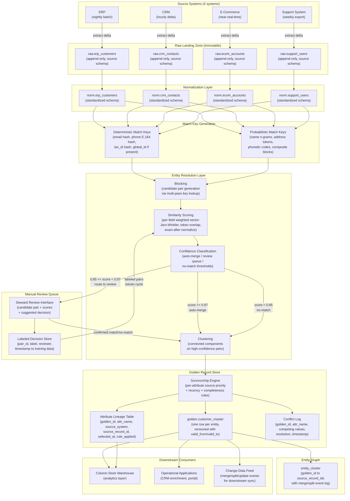

<!-- data-ingestion-patterns: 07 — Multi-Source Merge and Master Data Management (MDM) -->

# 07 — Multi-Source Merge and Master Data Management (MDM)

> **Domain:** Data Integration / MDM
> **Difficulty:** ★★★★★ Senior / Staff
> **Category:** Entity Resolution · Golden Record · Survivorship · Lineage

---

## Problem Statement

Enterprise data landscapes routinely fragment customer identity across independently evolved systems. A customer acquired through an e-commerce channel gets one record ID; the same customer calling the support desk generates a second, unrelated record; the ERP system that processes their invoice creates a third. When the CRM team later imports from a trade-show list, a fourth partial record appears. None of these systems were designed to share a global customer identifier, each has its own data entry conventions, and each updates on a different schedule — the ERP posts nightly batch extracts, the CRM syncs hourly, the e-commerce platform streams events in near-real time, and the support system exports weekly. The customer exists in four places with four slightly different spellings of their name, two address formats, one system using a PO Box and another using the physical address, and phone numbers with and without country codes.

The core difficulty is not technical in the narrow sense — it is the compounding of three simultaneous problems. First, **identity ambiguity**: two records in different systems may or may not represent the same real-world entity, and the answer is probabilistic, not certain. Second, **attribute authority disagreement**: even when two records are confirmed duplicates, there is no single source that is correct for all fields. The ERP may have the legally registered company name while the CRM has the preferred trading name; the support system has the most recent mobile number while the ERP has the billing address on file with the government. Third, **temporal consistency**: the "most recent" value is not always the most authoritative, and sources update at different cadences, meaning a stale high-authority source can overwrite a fresher low-authority source if survivorship rules are naive.

A production MDM pipeline must solve all three simultaneously: it must decide whether two records are the same entity (entity resolution), decide which source wins for each attribute (survivorship), and maintain a stable, versioned golden record that can be audited back to its contributing source records at any point in time. It must do this continuously as new records arrive and existing records are updated, without requiring a full recompute of all entity clusters on every change. And it must expose a manual review queue for cases where automated confidence is insufficient, together with a feedback mechanism so human decisions improve future automation.

---

## Clarifying Questions

### Entity Scope and Identity Signals

1. **What are the available deterministic identity signals across sources?** Do any sources share a tax ID, government-issued ID, email address, or phone number that can serve as a reliable anchor for deterministic matching before probabilistic methods are needed? The presence of even one shared deterministic signal collapses a hard probabilistic problem into a much simpler lookup.

2. **What is the entity type — individual person, business entity, or both?** Person matching and business matching require different blocking strategies, different similarity algorithms, and different survivorship rules. If both are required, the pipeline must type-classify records before matching and never attempt to cross-resolve person records against company records.

3. **Are there known hierarchical relationships to preserve?** For example, a parent company with subsidiaries, or a household with individual members. Entity resolution merges duplicates; hierarchy management relates distinct entities. Conflating the two is a common and expensive design error.

### Source System Characteristics

4. **What is the update frequency and change-capture mechanism for each source?** Does each source expose a reliable `updated_at` timestamp or sequence number for incremental extraction? A source that only provides full-snapshot exports requires a different change-detection strategy (hash comparison against previous snapshot) than a source with a proper CDC feed.

5. **What is the data quality profile of each source?** Specifically: what is the null rate for each identity field (email, phone, address) per source? What known transformation artifacts exist (e.g., one system uppercases all names, another truncates to 30 characters)? Quality profiling before designing matching rules prevents building a pipeline on faulty assumptions.

6. **Are there any known cross-source linkages already in use?** For example, does the CRM store an ERP account ID for some customers, even if not all? Partial cross-referencing data is high-value input for seeding the entity graph.

### Matching and Merge Rules

7. **What is the acceptable false positive rate vs. false negative rate tradeoff?** A false positive (merging two distinct customers) causes downstream data contamination — orders shipped to the wrong address, communications going to the wrong person, incorrect revenue attribution. A false negative (failing to merge two records for the same customer) causes fragmented analytics and duplicate outreach. These are not symmetrically bad; in a KYC or financial context, false positives have regulatory consequences that far outweigh false negatives.

8. **Who owns the survivorship rules and on what basis were they determined?** Are source priority rankings documented and agreed upon by source system owners, or are they assumptions made by the data team? Undocumented survivorship rules become tribal knowledge and break silently when source systems change.

9. **Is there an existing golden record store, or is this greenfield?** If a golden record store exists, a migration strategy is needed that preserves existing golden IDs to avoid breaking downstream consumers. If greenfield, the initial bulk-match run is a one-time O(N^2) problem that must be solved with aggressive blocking.

### Operational and Governance Requirements

10. **What are the latency requirements for golden record freshness?** Does a downstream system (e.g., real-time fraud detection, customer-facing portal) require the golden record to reflect source updates within seconds, minutes, or hours? This drives whether the MDM pipeline runs as a streaming job, a micro-batch, or a nightly batch.

11. **What are the data privacy and right-to-erasure obligations?** If a customer invokes a GDPR erasure right, the pipeline must be able to identify every source record contributing to a golden record, remove or suppress the relevant source records, re-evaluate survivorship for the affected attributes, and produce an audit trail proving the erasure was complete. This requires source-to-golden lineage at the attribute level, not just the record level.

12. **What is the manual review capacity?** If the matching pipeline generates 10,000 low-confidence candidate pairs per day, but the stewardship team can review 200 pairs per day, the queue will grow unboundedly. Either the auto-merge threshold must be adjusted, the steward team must be scaled, or a priority triage must be applied. This is a capacity planning question that must be answered before go-live.

---

## Hard Constraints

- **No loss of source fidelity:** Source records must be preserved as-is in an immutable raw landing zone. Transformations and normalization happen in separate layers. The original source record must always be recoverable.
- **Golden record ID stability:** Once assigned, a golden record ID must never be reused or reassigned. Merges and splits must be tracked as events, not as in-place overwrites of IDs.
- **Attribute-level lineage:** Every field in the golden record must be traceable to the specific source system, source record ID, and timestamp from which it was selected. Record-level lineage is insufficient.
- **Idempotent reprocessing:** Replaying the pipeline from raw inputs must produce the same golden record state. Non-deterministic matching (e.g., random tiebreaking) violates this constraint.
- **Audit trail for merges and splits:** Every merge decision (including the matching score, the rule that triggered the merge, and the operator if manually confirmed) must be logged as an immutable event.
- **Conflict logging is mandatory:** When survivorship rules produce a non-unanimous decision, the conflict must be logged — never silently resolved with an undocumented tiebreaker.
- **Manual review queue must be bounded:** A maximum queue depth and a maximum record age in the queue must be defined. Records aged out of the queue without resolution must fall back to a documented default policy, not be silently dropped.
- **No cross-domain entity conflation:** Person records and organization records must be maintained in separate entity classes with separate matching pipelines. They may be related (a person works for a company) but must never be merged as duplicates.

---

## Architecture Diagram



---

## Solution Design

### Layer 1: Per-Source Raw Landing (No Transforms)

Each source system lands into its own isolated raw table with no schema transformations applied. The raw landing layer is **append-only and immutable**. Every row carries extraction metadata added by the ingestion process, not by the source:

```sql
-- Raw landing table for ERP source (pattern is identical for all 4 sources)
CREATE TABLE raw.erp_customers (
    _raw_id          BIGINT GENERATED ALWAYS AS IDENTITY,
    _source_system   VARCHAR(50)  NOT NULL DEFAULT 'erp',
    _extracted_at    TIMESTAMP    NOT NULL,
    _batch_id        VARCHAR(100) NOT NULL,
    _record_hash     CHAR(64)     NOT NULL,  -- SHA-256 of source payload
    -- All source columns preserved verbatim with source names and source types:
    customer_id      VARCHAR(50),
    cust_name        VARCHAR(200),
    addr_line1       VARCHAR(300),
    addr_line2       VARCHAR(300),
    city             VARCHAR(100),
    state_cd         VARCHAR(10),
    postal_cd        VARCHAR(20),
    country_cd       VARCHAR(10),
    phone_1          VARCHAR(50),
    email_addr       VARCHAR(200),
    tax_ref_num      VARCHAR(50),
    created_dt       VARCHAR(30),   -- stored as string; type cast in normalization
    modified_dt      VARCHAR(30),
    _raw_payload     TEXT           -- full JSON/CSV original for replay
);
```

**Why no transforms at landing:** If normalization logic has a bug, the raw record is the only recovery path. Transforming before landing means a logic bug requires re-extraction from the source system — which may be unavailable, rate-limited, or have already purged the record.

**Within-source deduplication before normalization:** A single source can deliver the same record multiple times (restatements, re-extracts). Detect within-source duplicates using `_record_hash`:

```sql
-- Identify first appearance of each source record version
SELECT DISTINCT ON (source_system, customer_id, _record_hash)
    *
FROM raw.erp_customers
ORDER BY source_system, customer_id, _record_hash, _extracted_at ASC;
```

### Layer 2: Normalization Layer

Normalization applies deterministic, reversible transformations to produce a common schema. Every normalized record retains a foreign key back to its raw record.

**Normalization operations by field type:**
- Name: trim whitespace, collapse multiple spaces, title-case, remove non-printable characters
- Phone: strip all formatting, validate digit count, prepend country code, store as E.164 (`+15551234567`)
- Email: lowercase, trim, validate format — treat as case-insensitive in practice
- Address: standardize abbreviations (`St.` to `Street`, `Ave` to `Avenue`), normalize state codes to ISO-3166-2
- Tax ID: strip dashes and spaces, validate check digit if applicable
- Dates: parse to `TIMESTAMP WITH TIME ZONE`; if source provides only date, assume midnight UTC

```sql
CREATE TABLE norm.unified_customers (
    norm_id              BIGINT GENERATED ALWAYS AS IDENTITY,
    raw_table            VARCHAR(50)  NOT NULL,   -- which raw table this came from
    raw_id               BIGINT       NOT NULL,
    source_system        VARCHAR(50)  NOT NULL,
    source_record_id     VARCHAR(50)  NOT NULL,
    normalized_at        TIMESTAMP    NOT NULL,
    -- Normalized fields with consistent naming across all sources:
    full_name            VARCHAR(500),
    email                VARCHAR(320),
    phone_e164           VARCHAR(20),
    address_line1        VARCHAR(300),
    address_line2        VARCHAR(300),
    city                 VARCHAR(100),
    state_iso            VARCHAR(10),
    postal_code          VARCHAR(20),
    country_iso2         CHAR(2),
    tax_id               VARCHAR(30),
    source_created_at    TIMESTAMP WITH TIME ZONE,
    source_updated_at    TIMESTAMP WITH TIME ZONE,
    -- Per-field quality flags used in survivorship:
    email_valid          BOOLEAN,
    phone_valid          BOOLEAN,
    address_complete     BOOLEAN
);
```

### Layer 3: Match Key Generation

Match keys are derived representations of normalized records used to find candidate pairs efficiently. Two types:

**Deterministic match keys** — exact or near-exact signals with very high precision:

```sql
CREATE TABLE mdm.deterministic_keys (
    key_id            BIGINT GENERATED ALWAYS AS IDENTITY,
    source_system     VARCHAR(50)  NOT NULL,
    source_record_id  VARCHAR(50)  NOT NULL,
    key_type          VARCHAR(30)  NOT NULL,
    -- key_type values: 'email', 'phone_e164', 'tax_id', 'global_id'
    key_value         VARCHAR(500) NOT NULL,
    key_hash          CHAR(64)     NOT NULL,  -- SHA-256 for fast equality joins
    generated_at      TIMESTAMP    NOT NULL
);

CREATE INDEX idx_det_keys_lookup ON mdm.deterministic_keys (key_type, key_hash);
```

Deterministic key types in descending confidence order:
1. `tax_id` — government-issued identifier; highest confidence anchor
2. `email` — high confidence after normalization; watch for shared departmental emails
3. `phone_e164` — medium-high confidence; shared landlines are a known false-positive source
4. `global_id` — any pre-existing cross-system identifier (loyalty program ID, etc.)

**Probabilistic blocking keys** — representations that group records into candidate buckets:

```sql
CREATE TABLE mdm.probabilistic_keys (
    key_id            BIGINT GENERATED ALWAYS AS IDENTITY,
    source_system     VARCHAR(50)  NOT NULL,
    source_record_id  VARCHAR(50)  NOT NULL,
    key_type          VARCHAR(50)  NOT NULL,
    -- key_type examples:
    --   'soundex_surname_postcode'
    --   'name_3gram_set'
    --   'address_token_set'
    --   'metaphone_firstname_city'
    key_value         VARCHAR(500) NOT NULL,
    generated_at      TIMESTAMP    NOT NULL
);

CREATE INDEX idx_prob_keys_lookup ON mdm.probabilistic_keys (key_type, key_value);
```

Probabilistic key generation examples:

```sql
-- Soundex of surname + first 5 chars of postal code
INSERT INTO mdm.probabilistic_keys
    (source_system, source_record_id, key_type, key_value, generated_at)
SELECT
    source_system,
    source_record_id,
    'soundex_surname_postal5',
    SOUNDEX(SPLIT_PART(full_name, ' ', -1)) || SUBSTRING(postal_code, 1, 5),
    CURRENT_TIMESTAMP
FROM norm.unified_customers
WHERE full_name IS NOT NULL AND postal_code IS NOT NULL;

-- First 3 chars of first name + first 3 chars of city
INSERT INTO mdm.probabilistic_keys
    (source_system, source_record_id, key_type, key_value, generated_at)
SELECT
    source_system,
    source_record_id,
    'firstname3_city3',
    LOWER(SUBSTRING(SPLIT_PART(full_name, ' ', 1), 1, 3)) ||
    LOWER(SUBSTRING(city, 1, 3)),
    CURRENT_TIMESTAMP
FROM norm.unified_customers
WHERE full_name IS NOT NULL AND city IS NOT NULL;
```

**Multi-pass blocking:** Run all blocking key types and take the union of candidate pairs. Any pair that appears in at least one block proceeds to scoring. This recovers matches missed by any single key at the cost of more pairs to score — still far fewer than the full N^2 cross-product.

### Layer 4: Similarity Scoring and Confidence Classification

For each candidate pair generated by blocking, compute a weighted similarity vector:

```sql
CREATE TABLE mdm.candidate_pairs (
    pair_id              BIGINT GENERATED ALWAYS AS IDENTITY,
    left_source          VARCHAR(50)  NOT NULL,
    left_record_id       VARCHAR(50)  NOT NULL,
    right_source         VARCHAR(50)  NOT NULL,
    right_record_id      VARCHAR(50)  NOT NULL,
    blocking_key_type    VARCHAR(50)  NOT NULL,
    -- Per-field similarity scores (0.0 to 1.0):
    score_name           NUMERIC(5,4),   -- Jaro-Winkler
    score_email          NUMERIC(5,4),   -- exact=1.0, domain-only=0.5, none=0.0
    score_phone          NUMERIC(5,4),   -- exact after E.164 normalize = 1.0
    score_address        NUMERIC(5,4),   -- token overlap after standardization
    score_tax_id         NUMERIC(5,4),   -- exact=1.0, else 0.0
    -- Composite weighted score:
    composite_score      NUMERIC(5,4)    NOT NULL,
    -- Classification:
    match_decision       VARCHAR(20)     NOT NULL,
    -- match_decision: 'AUTO_MERGE', 'REVIEW', 'NO_MATCH'
    scored_at            TIMESTAMP       NOT NULL,
    model_version        VARCHAR(50),    -- null=rule-based, version string=ML
    UNIQUE (left_source, left_record_id, right_source, right_record_id)
);
```

**Composite score formula (rule-based baseline):**

```
composite_score =
    (score_tax_id  * 0.40)  -- dominant: tax ID is a deterministic anchor
  + (score_email   * 0.25)  -- high signal, but shared emails exist
  + (score_phone   * 0.15)  -- medium signal, shared landlines are a hazard
  + (score_name    * 0.12)  -- supporting evidence only
  + (score_address * 0.08)  -- supporting evidence only
```

**Threshold configuration (tunable per domain and over time):**

```sql
CREATE TABLE mdm.threshold_config (
    entity_class     VARCHAR(50)  NOT NULL,
    effective_from   DATE         NOT NULL,
    auto_merge_min   NUMERIC(5,4) NOT NULL DEFAULT 0.97,
    review_min       NUMERIC(5,4) NOT NULL DEFAULT 0.85,
    -- Pairs below review_min are classified NO_MATCH
    PRIMARY KEY (entity_class, effective_from)
);
```

**Deterministic fast-path:** Before computing the full composite score, check deterministic keys. If two records share an exact tax ID hash or email hash, classify AUTO_MERGE immediately without scoring. This reduces scoring compute by 30-60% in typical enterprise datasets.

```sql
-- Deterministic match fast-path
INSERT INTO mdm.candidate_pairs
    (left_source, left_record_id, right_source, right_record_id,
     blocking_key_type, score_tax_id, composite_score, match_decision, scored_at)
SELECT
    dk1.source_system, dk1.source_record_id,
    dk2.source_system, dk2.source_record_id,
    'deterministic_' || dk1.key_type,
    CASE WHEN dk1.key_type = 'tax_id' THEN 1.0 ELSE NULL END,
    1.0,
    'AUTO_MERGE',
    CURRENT_TIMESTAMP
FROM mdm.deterministic_keys dk1
JOIN mdm.deterministic_keys dk2
    ON dk1.key_type    = dk2.key_type
    AND dk1.key_hash   = dk2.key_hash
    AND (dk1.source_system, dk1.source_record_id) <
        (dk2.source_system, dk2.source_record_id)  -- avoid symmetric duplicates
WHERE dk1.key_type IN ('tax_id', 'email');
```

### Layer 5: Clustering and Entity Graph

Connected-components clustering converts pairwise match decisions into entity clusters. The union-find algorithm is applied across all AUTO_MERGE decisions (plus any REVIEW pairs confirmed by stewards):

```sql
-- Entity cluster: maps each source record to its golden entity
CREATE TABLE mdm.entity_cluster (
    golden_id         BIGINT       NOT NULL,
    source_system     VARCHAR(50)  NOT NULL,
    source_record_id  VARCHAR(50)  NOT NULL,
    linked_at         TIMESTAMP    NOT NULL,
    link_type         VARCHAR(20)  NOT NULL,
    -- link_type: 'AUTO_MERGE', 'MANUAL_CONFIRM', 'SEED'
    link_pair_id      BIGINT,
    reviewer_id       VARCHAR(100),
    PRIMARY KEY (source_system, source_record_id)
);

-- Immutable merge/split event log
CREATE TABLE mdm.entity_events (
    event_id         BIGINT GENERATED ALWAYS AS IDENTITY,
    event_type       VARCHAR(20)  NOT NULL,
    -- event_type: 'NEW_ENTITY', 'MERGE', 'SPLIT', 'RECORD_ADDED', 'RECORD_REMOVED'
    golden_id        BIGINT       NOT NULL,
    merged_from_id   BIGINT,      -- set when two golden records merge
    split_to_ids     TEXT,        -- JSON array; set when one golden splits
    occurred_at      TIMESTAMP    NOT NULL,
    triggered_by     VARCHAR(50)  NOT NULL,
    -- triggered_by: 'PIPELINE_AUTO', 'STEWARD_ACTION', 'ERASURE_REQUEST'
    notes            TEXT
);
```

**Transitive closure query — find all source records for an entity:**

```sql
WITH RECURSIVE entity_graph AS (
    SELECT source_system, source_record_id
    FROM mdm.entity_cluster
    WHERE golden_id = :target_golden_id

    UNION

    SELECT cp.right_source, cp.right_record_id
    FROM entity_graph eg
    JOIN mdm.candidate_pairs cp
        ON  cp.left_source    = eg.source_system
        AND cp.left_record_id = eg.source_record_id
        AND cp.match_decision IN ('AUTO_MERGE')
)
SELECT DISTINCT source_system, source_record_id
FROM entity_graph;
```

### Layer 6: Survivorship Engine and Golden Record Construction

Survivorship applies per attribute, independently selecting the best available value from all source records in the cluster:

```sql
CREATE TABLE golden.customer_master (
    golden_id          BIGINT           PRIMARY KEY,
    -- Surviving attribute values:
    full_name          VARCHAR(500),
    email              VARCHAR(320),
    phone_e164         VARCHAR(20),
    address_line1      VARCHAR(300),
    address_line2      VARCHAR(300),
    city               VARCHAR(100),
    state_iso          VARCHAR(10),
    postal_code        VARCHAR(20),
    country_iso2       CHAR(2),
    tax_id             VARCHAR(30),
    -- Version control (SCD Type 2):
    valid_from         TIMESTAMP        NOT NULL,
    valid_to           TIMESTAMP,       -- NULL = current version
    version_number     INTEGER          NOT NULL DEFAULT 1,
    created_at         TIMESTAMP        NOT NULL,
    updated_at         TIMESTAMP        NOT NULL,
    -- Aggregate quality signals:
    source_count       INTEGER          NOT NULL,
    match_confidence   NUMERIC(5,4),    -- lowest pairwise confidence in cluster
    requires_review    BOOLEAN          NOT NULL DEFAULT FALSE
);
```

**Survivorship rules configuration:**

```sql
CREATE TABLE mdm.survivorship_rules (
    rule_id                BIGINT GENERATED ALWAYS AS IDENTITY,
    entity_class           VARCHAR(50)   NOT NULL,
    attribute_name         VARCHAR(100)  NOT NULL,
    rule_type              VARCHAR(30)   NOT NULL,
    -- rule_type values:
    --   'SOURCE_PRIORITY'  -- ranked source list wins
    --   'MOST_RECENT'      -- highest source_updated_at wins
    --   'MOST_COMPLETE'    -- fewest null sub-components wins
    --   'MOST_FREQUENT'    -- consensus value in cluster wins
    --   'LONGEST_NON_NULL' -- longest non-null string wins
    source_priority_order  JSONB,        -- ordered array of source_system names
    effective_from         DATE          NOT NULL,
    PRIMARY KEY (entity_class, attribute_name, effective_from)
);

-- Example configuration for customer entity class:
INSERT INTO mdm.survivorship_rules
    (entity_class, attribute_name, rule_type, source_priority_order, effective_from)
VALUES
    ('customer', 'tax_id',        'SOURCE_PRIORITY',
     '["erp","support","crm","ecom"]',     '2025-01-01'),
    ('customer', 'full_name',     'SOURCE_PRIORITY',
     '["erp","crm","ecom","support"]',     '2025-01-01'),
    ('customer', 'email',         'MOST_RECENT',
     NULL,                                 '2025-01-01'),
    ('customer', 'phone_e164',    'MOST_RECENT',
     NULL,                                 '2025-01-01'),
    ('customer', 'address_line1', 'SOURCE_PRIORITY',
     '["erp","support","crm","ecom"]',     '2025-01-01'),
    ('customer', 'postal_code',   'SOURCE_PRIORITY',
     '["erp","support","crm","ecom"]',     '2025-01-01');
```

**Survivorship execution — MOST_RECENT rule for email:**

```sql
-- Select the most recently updated valid email across all sources in the cluster
SELECT DISTINCT ON (ec.golden_id)
    n.email               AS surviving_value,
    n.source_system       AS winning_source,
    n.source_record_id    AS winning_record_id,
    n.source_updated_at   AS value_as_of,
    'MOST_RECENT'         AS rule_applied
FROM mdm.entity_cluster ec
JOIN norm.unified_customers n
    ON  n.source_system    = ec.source_system
    AND n.source_record_id = ec.source_record_id
WHERE ec.golden_id = :target_golden_id
  AND n.email      IS NOT NULL
  AND n.email_valid = TRUE
ORDER BY ec.golden_id, n.source_updated_at DESC NULLS LAST;
```

**Survivorship execution — SOURCE_PRIORITY rule for tax_id:**

```sql
-- Select tax_id from the highest-ranked source that has a non-null value
WITH ranked_sources AS (
    SELECT
        n.tax_id,
        n.source_system,
        n.source_record_id,
        n.source_updated_at,
        -- Priority rank from survivorship_rules config (lower rank = higher priority)
        array_position(
            ARRAY(
                SELECT jsonb_array_elements_text(source_priority_order)
                FROM mdm.survivorship_rules
                WHERE entity_class  = 'customer'
                  AND attribute_name = 'tax_id'
                ORDER BY effective_from DESC LIMIT 1
            ),
            n.source_system
        ) AS priority_rank
    FROM mdm.entity_cluster ec
    JOIN norm.unified_customers n
        ON  n.source_system    = ec.source_system
        AND n.source_record_id = ec.source_record_id
    WHERE ec.golden_id = :target_golden_id
      AND n.tax_id IS NOT NULL
)
SELECT tax_id, source_system, source_record_id, source_updated_at, 'SOURCE_PRIORITY' AS rule_applied
FROM ranked_sources
ORDER BY priority_rank NULLS LAST, source_updated_at DESC NULLS LAST
LIMIT 1;
```

**Attribute lineage logging — every field selection is recorded:**

```sql
CREATE TABLE mdm.attribute_lineage (
    lineage_id          BIGINT GENERATED ALWAYS AS IDENTITY,
    golden_id           BIGINT        NOT NULL,
    attribute_name      VARCHAR(100)  NOT NULL,
    selected_value      TEXT,
    source_system       VARCHAR(50)   NOT NULL,
    source_record_id    VARCHAR(50)   NOT NULL,
    source_updated_at   TIMESTAMP,
    survivorship_rule   VARCHAR(50)   NOT NULL,
    golden_version      INTEGER       NOT NULL,
    selected_at         TIMESTAMP     NOT NULL,
    PRIMARY KEY (golden_id, attribute_name, golden_version)
);
```

**Conflict logging — when competing values exist, log all of them:**

```sql
CREATE TABLE mdm.survivorship_conflicts (
    conflict_id         BIGINT GENERATED ALWAYS AS IDENTITY,
    golden_id           BIGINT        NOT NULL,
    attribute_name      VARCHAR(100)  NOT NULL,
    golden_version      INTEGER       NOT NULL,
    competing_values    JSONB         NOT NULL,
    -- Format: [{"source":"erp","value":"ACME Corp","updated_at":"2025-10-01T00:00:00Z"},...]
    winning_value       TEXT,
    resolution_rule     VARCHAR(50)   NOT NULL,
    logged_at           TIMESTAMP     NOT NULL,
    requires_attention  BOOLEAN       NOT NULL DEFAULT FALSE
);
```

### Layer 7: Manual Review Queue

```sql
CREATE TABLE mdm.review_queue (
    review_id         BIGINT GENERATED ALWAYS AS IDENTITY,
    pair_id           BIGINT        NOT NULL REFERENCES mdm.candidate_pairs(pair_id),
    composite_score   NUMERIC(5,4)  NOT NULL,
    priority_score    NUMERIC(5,4)  NOT NULL,  -- business-impact weighting
    status            VARCHAR(20)   NOT NULL DEFAULT 'PENDING',
    -- status: 'PENDING', 'IN_REVIEW', 'CONFIRMED_MATCH', 'CONFIRMED_NO_MATCH', 'EXPIRED'
    assigned_to       VARCHAR(100),
    enqueued_at       TIMESTAMP     NOT NULL,
    reviewed_at       TIMESTAMP,
    expires_at        TIMESTAMP     NOT NULL,
    reviewer_notes    TEXT,
    left_snapshot     JSONB,   -- normalized record snapshot at time of scoring
    right_snapshot    JSONB
);

-- Priority score formula:
--   priority = composite_score
--            + 0.3 * (tax_id IS NOT NULL in either record)
--            + 0.2 * (email IS NOT NULL in either record)
--            + 0.1 * (either record updated within last 30 days)
-- Higher priority = review sooner

-- Queue health monitoring view
CREATE VIEW mdm.review_queue_health AS
SELECT
    status,
    COUNT(*)                                                              AS count,
    AVG(composite_score)                                                  AS avg_score,
    MIN(enqueued_at)                                                      AS oldest_item,
    COUNT(*) FILTER (WHERE expires_at < CURRENT_TIMESTAMP + INTERVAL '12 hours'
                      AND status IN ('PENDING', 'IN_REVIEW'))             AS sla_at_risk
FROM mdm.review_queue
GROUP BY status;

-- SLA enforcement: auto-expire items past deadline, apply no-match fallback
UPDATE mdm.review_queue
SET status = 'EXPIRED'
WHERE status IN ('PENDING', 'IN_REVIEW')
  AND expires_at < CURRENT_TIMESTAMP;
```

### Layer 8: Feedback Loop for Matching Improvement

Human review decisions are the highest-quality training signal available. Every confirmed match and confirmed no-match is stored as a labeled record for model retraining:

```sql
CREATE TABLE mdm.match_labels (
    label_id           BIGINT GENERATED ALWAYS AS IDENTITY,
    pair_id            BIGINT        NOT NULL,
    -- Feature snapshot at time of scoring (preserves training stability):
    score_name         NUMERIC(5,4),
    score_email        NUMERIC(5,4),
    score_phone        NUMERIC(5,4),
    score_address      NUMERIC(5,4),
    score_tax_id       NUMERIC(5,4),
    composite_score    NUMERIC(5,4),
    -- Ground truth label:
    is_match           BOOLEAN       NOT NULL,
    label_source       VARCHAR(20)   NOT NULL,
    -- label_source: 'STEWARD_REVIEW', 'AUTO_CONFIRMED', 'AUDIT_CORRECTION'
    reviewer_id        VARCHAR(100),
    labeled_at         TIMESTAMP     NOT NULL,
    model_version_used VARCHAR(50)
);

-- Retraining readiness check
CREATE VIEW mdm.retraining_readiness AS
SELECT
    COUNT(*) FILTER (
        WHERE labeled_at > (
            SELECT MAX(effective_from)
            FROM mdm.threshold_config
            WHERE entity_class = 'customer'
        )
    )                                                      AS new_labels_since_last_config,
    500                                                    AS retraining_threshold,
    COUNT(*) FILTER (
        WHERE labeled_at > (
            SELECT MAX(effective_from)
            FROM mdm.threshold_config
            WHERE entity_class = 'customer'
        )
    ) >= 500                                               AS retraining_recommended
FROM mdm.match_labels;
```

**Feedback flywheel:** New steward decisions produce labels. Labels retrain the scoring model. An improved model reduces borderline pairs. Fewer borderline pairs means steward time concentrates on the highest-risk ambiguous cases. Those decisions produce more high-quality labels. Quality improvement is compounding, not one-time.

**Bootstrap guidance:** Before 5,000 labeled pairs exist, run rule-based scoring only. Introduce ML as a challenger model — running in parallel with rule-based scoring, its decisions logged but not actioned — until confidence in the ML model is established through shadow-mode evaluation.

### Layer 9: GDPR Erasure Support via Attribute Lineage

The attribute lineage table is the prerequisite for compliant erasure. The procedure is:

```sql
-- Step 1: Find all golden records where the erased source record contributed any attribute
SELECT DISTINCT al.golden_id, al.attribute_name, al.golden_version
FROM mdm.attribute_lineage al
WHERE al.source_system    = :erased_source_system
  AND al.source_record_id = :erased_source_record_id;

-- Step 2: For each affected attribute on each affected golden record,
-- re-run survivorship excluding the erased source record.
-- If no remaining source can supply the attribute, set it to NULL.

-- Step 3: Create a new golden record version (SCD Type 2 insert)
INSERT INTO golden.customer_master
    (golden_id, full_name, email, ..., valid_from, valid_to, version_number)
SELECT
    golden_id,
    -- re-survived values here
    CURRENT_TIMESTAMP,
    NULL,
    version_number + 1
FROM golden.customer_master
WHERE golden_id = :affected_golden_id
  AND valid_to IS NULL;

-- Close the previous version
UPDATE golden.customer_master
SET valid_to = CURRENT_TIMESTAMP
WHERE golden_id      = :affected_golden_id
  AND version_number = :previous_version;

-- Step 4: Log the erasure event
INSERT INTO mdm.entity_events
    (event_type, golden_id, occurred_at, triggered_by, notes)
VALUES
    ('ERASURE_RESURVIVAL', :affected_golden_id, CURRENT_TIMESTAMP,
     'ERASURE_REQUEST', 'Source record ' || :erased_source_record_id || ' removed from ' || :erased_source_system);
```

---

## Trade-offs

| Decision | Option A | Option B | Recommendation | Why |
|---|---|---|---|---|
| **Blocking strategy** | Single blocking key per pass — simple, deterministic, easy to debug | Multi-pass blocking with union of candidate sets — complex, higher recall, more pairs to score | Multi-pass blocking | A single blocking key guarantees missed matches whenever that key is null or malformed in either record. Multi-pass recovers these at the cost of more scoring compute. The additional compute is cheap; missed merges are expensive and silent. |
| **Matching approach** | Rule-based only — fully explainable, no training data required, zero-day deployable | ML classifier — higher accuracy on ambiguous cases, less interpretable, requires labeled data | Rule-based first; ML challenger after 5,000 labels | Rules are auditable and debuggable from day one. Introduce ML only once labeled data establishes confidence. Never replace rule-based entirely — regulators require explainability for merge decisions in KYC and financial contexts. |
| **Survivorship granularity** | Whole-record selection — pick the "best" source and use all its fields | Per-attribute selection — each field independently selects its best source | Per-attribute selection | No single source is authoritative for all fields. The ERP may have the correct legal name and tax ID but a stale address. Whole-record selection forces a trade-off that is wrong for some attributes in virtually every real deployment. |
| **Golden record storage** | Mutable current record only — simple, compact, fast reads | Versioned SCD Type 2 with valid_from/valid_to on every version | Versioned SCD Type 2 | GDPR erasure audits, regulatory entity history, and root-cause debugging of golden record state all require answering "what was the golden record at time T?" A mutable model cannot answer this. Storage overhead is modest relative to audit risk. |
| **Review queue overflow policy** | Block new auto-merges until queue drains — safe, may halt pipeline | Auto-expire aged items as confirmed no-match and continue — keeps pipeline moving, may miss real merges | Auto-expire as no-match after SLA with alert and audit log | Blocking the pipeline creates an operational crisis. Auto-expiring as no-match is safe because no-match is reversible — two separate records can be merged later. Falsely merging is much harder to reverse and causes downstream contamination. |
| **Deterministic fast-path** | Require full composite scoring for all pairs uniformly | Fast-path: exact deterministic key hit (tax ID, email) triggers auto-merge without full scoring | Fast-path for deterministic signals | A verified exact tax ID match is sufficient evidence for merge without a full scoring pass. Reduces scoring compute 30-60% in typical enterprise datasets and reduces queue depth for human review. |
| **Attribute lineage storage** | Log only the winning value and winning source per version — compact | Log all competing values per attribute per version — complete | Log all competing values | Compact lineage fails GDPR erasure: you cannot prove an erased source no longer influences the golden record unless you have a complete record of which sources contributed which values at each version. Storage overhead is modest; audit risk is not. |

---

## Failure Modes and Recovery

| Failure Scenario | Detection Method | Recovery Strategy |
|---|---|---|
| **Over-merging: two distinct entities share a golden ID** | Post-merge validation: flag golden records with high attribute variance (multiple distinct city values or 3+ distinct name tokens). Alert on large clusters exceeding a configured threshold (e.g., >10 source records). | Split event: create two new golden IDs, redistribute source records via steward decision, re-run survivorship for both. Propagate split via CDC to downstream consumers. Trace and correct downstream contamination. Log root cause (usually a shared phone number or overly broad blocking key). |
| **Under-merging: same entity has two or more separate golden records** | Periodic duplicate scan: run full scoring pass on golden records themselves (not source records). If two golden records score above the review threshold, route to steward queue. | Steward confirms merge. Merge event logged. Surviving golden ID is the lower-numbered one by convention (stable, predictable). Losing ID registered in a redirect table for downstream compatibility. |
| **Survivorship selects stale value due to source clock skew** | Monitor `source_updated_at` distribution per source. Alert if a source's max `source_updated_at` has not advanced in >2x its expected update interval. | Reprocess survivorship for affected attributes after clock correction. Flag golden records whose winning source was the skewed system during the affected window. Emit updated CDC events. |
| **Blocking index staleness causes new records to miss existing matches** | Track blocking key coverage: percentage of normalized records with at least 2 distinct blocking keys. Alert if coverage drops below threshold (high null rate in name or address fields from a specific source reduces key generation). | Rebuild blocking indexes on full normalized corpus. Re-run blocking pass for all records newer than the last full index build. This is O(N), not O(N^2), because blocking is a lookup, not pairwise comparison. |
| **Manual review queue exceeds capacity** | Queue depth exceeds N × daily_review_capacity. Items within 12 hours of SLA expiry exceeds alert threshold. | Triage by priority score: auto-expire lowest-priority items first. Alert stewardship manager. If sustained, lower auto-merge threshold by 0.01 (accepting more auto-merges to reduce inflow) and document the change with a rationale and a planned review date. |
| **Source schema change breaks normalization** | Normalization layer reject rate for one source spikes above baseline (alert threshold: >2% per batch). Row count anomaly: normalized output count drops relative to raw landing count. | Quarantine all records from the affected source after the schema change point. Fix normalization mapping. Backfill quarantined records. Golden records that depended on the affected source for any attribute are flagged for re-evaluation. |
| **GDPR erasure request for a source record in a cluster** | Standard erasure request intake process. SLA: 72 hours to completion. | Trace attribute lineage for the erased source record. Re-run survivorship for all affected attributes using remaining sources. Version the golden record. Emit erasure-completion audit event with before/after lineage diff. Verify no surviving golden field is still sourced from the erased record. |
| **Entity resolution pipeline lag exceeds SLA** | Monitor lag between `source_updated_at` in normalized layer and `updated_at` in golden record. Alert if lag exceeds configured SLA per entity class. | Investigate upstream bottleneck: blocking index rebuild time, scoring backlog size, review queue depth, or compute capacity. For high-priority entity classes, implement a priority processing lane that processes records from high-frequency sources ahead of weekly-batch sources. |

---

## Observability Checklist

### Source Ingestion Metrics (per source system)

- `records_landed_count` — rows written to raw landing per batch
- `records_normalized_count` — rows successfully normalized per batch
- `normalization_reject_rate_pct` — percentage of landed rows that failed normalization; alert threshold: >2%
- `source_freshness_lag_hours` — difference between current time and max `source_updated_at` in normalized layer; alert if >2x expected update interval
- `null_rate_by_field` — null percentage per identity field (email, phone, tax_id, address) with baseline and drift detection

### Match Key Generation Metrics

- `blocking_key_coverage_pct` — percentage of normalized records with at least 2 distinct blocking keys generated; alert if <80%
- `candidate_pairs_generated_count` — total pairs per blocking run; sudden spike indicates a hub record or blocking regression
- `avg_records_per_blocking_bucket` — average cluster size per key; high average indicates poor blocking discrimination

### Scoring and Classification Metrics

- `auto_merge_rate_pct` — percentage of scored pairs classified AUTO_MERGE; sudden increase may indicate a rule regression
- `review_queue_inflow_rate` — new pairs added to queue per hour
- `review_queue_depth_current` — current pending item count; alert threshold configurable per steward capacity
- `review_sla_breach_rate_pct` — items expired without review per day; target near zero
- `score_distribution_p50_p95` — composite score percentiles; distribution shift indicates source quality change or model drift

### Golden Record Quality Metrics

- `golden_record_count_total` — total distinct entities; anomalous growth indicates over-splitting; shrinkage indicates over-merging
- `avg_source_records_per_entity` — should be stable over time; sudden increase indicates merge cascade
- `large_cluster_count` — entities with more than N contributing source records; manual review candidates
- `conflict_rate_by_attribute_pct` — percentage of golden record updates where survivorship produced a conflict; high rate on a specific attribute indicates source quality issue
- `attribute_completeness_pct_by_field` — percentage of golden records with non-null value per field; decline indicates source system issue

### Downstream Impact Metrics

- `golden_record_update_lag_minutes` — time between source record change and golden record update
- `cdc_event_count_per_hour` — merge/split/update events emitted to downstream consumers
- `attribute_lineage_coverage_pct` — percentage of golden record fields with complete lineage; target: 100%
- `erasure_completion_time_hours` — time from erasure request to verified completion; SLA: 72 hours

### Alert Severity Tiers

| Alert | Severity |
|---|---|
| Source extraction missed expected window | Page |
| GDPR erasure SLA missed (>72 hours unresolved) | Page |
| Attribute lineage gap detected in golden record | Page |
| Normalization reject rate >2% for any source | High |
| Review queue SLA breach rate >5% over 24 hours | High |
| Large cluster detected exceeding threshold | High |
| Source freshness lag >2x expected interval | High |
| Blocking key coverage <80% | Dashboard |
| Non-breaking schema addition detected in source | Dashboard |
| Auto-merge rate change >20% relative to 7-day average | Dashboard |

---

## Interview Answer Template

### The Constraint-Elimination Technique

When asked "How would you design an MDM pipeline for customer data across multiple source systems?", resist the urge to immediately describe a solution. First, eliminate the ambiguity that would make any solution wrong.

**Step 1 — Anchor the hardest constraint (30 seconds):**

> "Before diving into design, the most important question is: what deterministic identity signals are shared across sources? If any two systems share email addresses or tax IDs, a large fraction of the matching problem becomes a deterministic lookup, not a probabilistic inference. The answer completely changes the architecture — with good anchor fields, you can fast-path 60-70% of matches before touching any fuzzy similarity logic."

**Step 2 — State the fundamental tradeoff (30 seconds):**

> "MDM has an irreducible false-positive vs. false-negative tradeoff. Merging two distinct customers — a false positive — contaminates downstream data and can have regulatory consequences. Failing to merge two records for the same customer — a false negative — produces fragmented analytics but is reversible. I optimize to minimize false positives, which means conservative auto-merge thresholds and routing borderline cases to human review."

**Step 3 — Describe the pipeline in layers (2 minutes):**

> "Six layers. First: raw landing with zero transformation — every source record is preserved immutably. Second: normalization into a common schema — E.164 phones, lowercase emails, standardized address abbreviations — with the transforms applied as auditable steps separate from landing. Third: match key generation — both deterministic keys (email hash, tax ID hash) and probabilistic blocking keys like Soundex-of-surname plus postal prefix — to narrow N-squared comparisons to a manageable candidate set. Fourth: similarity scoring on candidate pairs using per-field weighted scores — Jaro-Winkler for names, exact-after-normalize for phones, token overlap for addresses. Fifth: survivorship — and this is where most designs go wrong — applied per attribute, not per record. The ERP may own the tax ID; the CRM owns the most recent phone. Sixth: golden record construction with full SCD Type 2 version history so any point-in-time state is reconstructable for audits."

**Step 4 — Address operational reality (1 minute):**

> "Two things that separate production MDM from a whiteboard design: the manual review queue and the feedback loop. Automated thresholds always produce a band of borderline cases. These must go to a steward queue with a defined SLA, priority scoring, and an expiry fallback policy. Every steward decision is a labeled training example. Those labels retrain the scoring model. A better model produces fewer borderline cases. Fewer borderline cases means steward time concentrates on the highest-risk ambiguous pairs. Those produce more high-quality labels. The quality improvement is compounding."

**Step 5 — Name the failure mode most interviewers miss (30 seconds):**

> "The most underappreciated failure mode is over-merging in the presence of hub records — records with generic shared attributes like a corporate switchboard number that trigger false blocking key matches. The mitigation is requiring a composite score above threshold before any merge, not just a blocking key hit, combined with post-merge cluster variance checks that flag suspicious merges for steward review. A cluster with five distinct city values across ten contributing records should never have been auto-merged silently."
