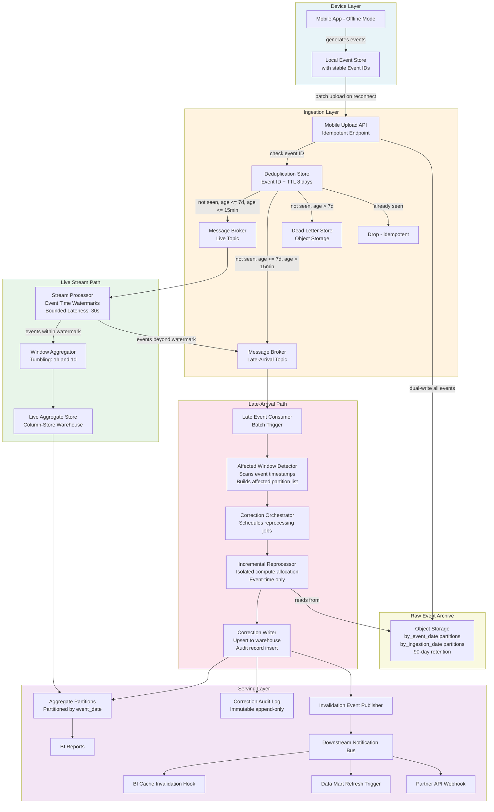

# Late-Arriving Data: Offline-First Mobile Transactions


---

## Problem Statement

Mobile applications that operate offline accumulate events locally and batch-upload them when connectivity is restored. In a commerce or payments context, a user may complete dozens of transactions over a seven-day trip, then reconnect at an airport. Those events arrive at the ingestion layer with timestamps up to seven days in the past — long after the streaming pipeline has closed the corresponding windows, computed aggregates, and handed results to downstream reporting. The pipeline has already answered "what was yesterday's revenue?" and the BI layer has already published that answer to stakeholders.

The challenge is not simply handling a few seconds of network jitter, which watermarks solve trivially. The challenge is that the late arrival window spans multiple daily and weekly reporting cycles. Every layer of the stack has already committed a wrong answer: the stream processor closed its windows, the transformation layer materialized incorrect aggregates into the warehouse, and the reporting layer cached and distributed those results to downstream consumers. Correcting the record requires identifying exactly which historical time windows are now invalid, reprocessing only those windows without triggering a full historical recompute, and propagating the correction to every downstream system that consumed the stale result — all within an SLA that satisfies contractual reporting obligations.

The secondary difficulty is operational: reprocessing must not compromise the ongoing live pipeline. Late-arriving backfill and real-time ingestion share the same infrastructure, so a naive approach that replays the full event log from the beginning can overwhelm the stream processor, saturate the message broker's read bandwidth, and cause cascading delays in the live path. The solution must isolate backfill compute, bound the blast radius of any single late-arrival batch, maintain a complete correction audit trail for financial compliance, and give downstream consumers a reliable mechanism to discover that a previously-published result has been superseded.

---

## Clarifying Questions

A senior data engineer should surface the following before designing the solution. These questions eliminate ambiguity about scope, SLAs, and acceptable trade-offs.

### Time Semantics and Arrival Bounds

1. **What is the maximum accepted lateness?** The scenario states seven days, but is there a hard business rule that events older than N days are simply discarded rather than corrected? This determines whether the late-event landing zone needs indefinite retention or a bounded TTL.
2. **Is the seven-day figure a p99 or an absolute ceiling?** If 99% of late events arrive within 24 hours and 1% within seven days, the correction SLA and infrastructure sizing differ significantly from a uniform distribution.
3. **What is the granularity of time windows that matter downstream?** Hourly, daily, and weekly windows require different correction strategies — correcting an hourly window is cheap; correcting a weekly window that has already rolled into a monthly aggregate requires cascading recomputation.

### Downstream Impact and SLAs

4. **What is the correction SLA?** How quickly after a late-event batch arrives must corrected aggregates be visible in dashboards? One hour? Four hours? Next business day? This drives the choice between a synchronous reprocessing trigger and a scheduled correction batch.
5. **Who consumed the stale report and how?** Did downstream systems pull a snapshot into their own storage (a data mart, an embedded dashboard cache, a partner API response)? Notification alone is insufficient if consumers have their own copies of wrong data.
6. **Are any of the affected aggregates used in financial settlements, contractual SLAs, or regulatory reporting?** If yes, the correction audit trail must meet a higher standard — immutable event log, cryptographic hash of the original result, timestamped correction record — beyond what a simple overwrite provides.

### Deduplication and Idempotency

7. **Are event IDs stable across offline storage and transmission?** The device must generate and persist a globally unique event ID at creation time, not at transmission time. If the mobile SDK does not already do this, it must be added before any deduplication strategy at the pipeline layer can work correctly.
8. **Can the same offline batch be uploaded more than once?** Network failures during upload can cause the client to retry. The ingestion layer must be idempotent regardless of how many times the same batch arrives.

### Infrastructure and Operational Constraints

9. **What is the retention period on the message broker?** Incremental reprocessing via offset replay requires that raw events are still available in the broker. If retention is 72 hours and events can be 7 days late, a separate durable landing zone is required.
10. **Is the stream processor the same system used for backfill, or is there a separate batch engine?** Using the same engine for both simplifies code maintenance but requires careful resource isolation to protect the live path.
11. **What is the maximum acceptable reprocessing window per correction job?** If a single late-arrival batch touches 200 distinct daily partitions spread over seven days, does the business accept that all 200 corrections complete within the SLA, or only the most recent N days?
12. **Is the downstream BI tool capable of cache invalidation, or does it require a push notification?** Some BI platforms automatically re-query on a schedule; others cache aggressively and require an explicit API call or webhook to refresh a specific dashboard or report.

---

## Hard Constraints

These are non-negotiable requirements that the design must satisfy before any trade-off discussion begins.

- **Accepted lateness ceiling: 7 days.** Events with an event timestamp older than 7 days at arrival time are routed to a dead-letter store, not to any aggregation path. They are flagged for manual review only.
- **No full historical recompute.** Corrections must be scoped to the specific time windows affected by the arriving batch. Replaying years of history is prohibited by cost and by live-path contention.
- **Idempotent ingestion.** Submitting the same event batch any number of times must produce identical pipeline state. The ingestion endpoint and all downstream operators must enforce this guarantee.
- **Audit trail is immutable.** Every correction to a previously published aggregate must produce an immutable record containing: original value, corrected value, affected window key, arrival timestamp of the late batch, and the job run ID that produced the correction.
- **Live path is isolated.** Backfill processing must run on a separate compute allocation. A backfill job must not degrade the p99 latency of the live stream by more than 5%.
- **Correction SLA: 4 hours.** From the moment a late batch is ingested, corrected aggregates must be visible in downstream dashboards within 4 hours.
- **Downstream notification is mandatory.** Any downstream consumer (BI layer, data mart, partner API) that consumed a stale result must receive a machine-readable invalidation signal before the correction SLA expires.
- **Event time governs all aggregations.** No aggregate may use processing time or ingestion time as its primary time dimension. These are permitted as metadata dimensions but never as partition or window keys.

---

## Architecture Diagram



---

## Solution Design

### 5.1 Time Semantics: Three Clocks, One Truth

Understanding the distinction between the three time dimensions is prerequisite to every other design decision in this scenario.

**Event Time** is the timestamp embedded in the event payload by the originating system — in this case, the timestamp written to device storage at the moment the transaction occurred. It represents business reality. It is the only correct basis for financial aggregations. Event time is set once, immutably, by the device at event creation. It does not change during transmission, retry, or reprocessing.

- Example: A user completes a purchase at 14:32:07 UTC on Monday while offline. The event carries `event_time = 2024-01-15T14:32:07Z`. This is what appears in Monday's revenue report.

**Ingestion Time** is the timestamp assigned by the message broker when the event is written to the topic. In an online transaction, ingestion time and event time are nearly identical (milliseconds apart). In this scenario, ingestion time may be seven days later than event time. Ingestion time is useful for pipeline operations (measuring end-to-end latency, diagnosing broker lag) but must never be used as a partition key or window boundary for business aggregations.

- Example: The same event arrives at the broker on Sunday at 09:15:22 UTC. `ingestion_time = 2024-01-21T09:15:22Z`. The gap is 5 days, 18 hours, and 43 minutes.

**Processing Time** is the wall-clock time at the stream processor when the event is consumed from the broker. It is the least reliable of the three for correctness — it varies based on consumer lag, backpressure, and scheduler decisions. It is useful only for measuring pipeline health (e.g., "how long did this event spend in the queue?").

- Example: The stream processor reads the event at 09:15:45 UTC on Sunday. `processing_time = 2024-01-21T09:15:45Z`.

**Practical implication:** Every window, every aggregate key, every partition in the warehouse must be keyed on `event_time`. The pipeline schema must carry all three timestamps as separate nullable columns — `event_time` (required), `ingestion_time` (required, set at broker entry), `processing_time` (optional, for observability only).

---

### 5.2 Watermark Strategy for the Live Path

The live stream path must define a watermark that correctly handles the small lateness (seconds to minutes) expected from online transactions, without being overwhelmed by the large lateness (days) from offline batches. The offline batch events must be separated before they reach the windowing operator.

**Routing at ingestion:**

The mobile upload API inspects the `event_time` field in each submitted event. If `event_time < NOW() - LIVE_LATENESS_THRESHOLD` (where `LIVE_LATENESS_THRESHOLD` is a configurable parameter, recommended initial value: 15 minutes), the event is routed to the **late-arrival topic** rather than the live topic. This routing decision is made once, at ingestion, and never revisited.

This separation is critical: it prevents the offline batch from collapsing the live watermark. Without this routing, a single 7-day-old event in the live topic would cause the watermark to stall, blocking all live windows from closing.

**Watermark configuration on the live topic:**

```
Watermark strategy:       Bounded Out-of-Orderness
Max out-of-orderness:     30 seconds (configurable per deployment)
Timestamp extractor:      event_time field
Idle partition timeout:   90 seconds (critical for sparse mobile connections)
Watermark alignment:      enabled, max drift 5 minutes across partitions
```

The live path watermark assumes that events in the live topic are at most 30 seconds late. Any event that passes the routing check but arrives slightly late (e.g., a user whose clock is slightly off) will be caught by this 30-second grace period. Events that slip past the watermark on the live topic are emitted to a side output, which feeds into the late-arrival topic for the same correction path described below.

**Why 30 seconds, not longer?** The live path SLA is near-real-time dashboard freshness. Extending the watermark to minutes delays every live window result by that duration. Thirty seconds is a reasonable p99.9 for online mobile transactions with good connectivity. Tune this value from observed latency histograms in the first 30 days of production.

**The idle partition problem:** With a mobile user base in the millions, some message broker partitions will occasionally go silent. Because the global watermark is the minimum across all source partitions, a single idle partition stalls all windows indefinitely. The idle partition timeout (90 seconds) excludes such partitions from watermark aggregation after sustained silence. This is well-tested behavior in modern stream processor versions; ensure the version in use includes fixes for idle timeout accounting under backpressure, which was a known defect in older releases.

---

### 5.3 Late Event Landing Zone and Retention

Raw events cannot be replayed from the message broker for a 7-day correction window unless the broker's retention is configured to at least 8 days (7-day late arrival + 1-day buffer). This is expensive and operationally risky.

**Recommended pattern: dual-write to object storage at ingestion.**

Every event — both live and late — is written to an immutable object storage partition at ingestion time, organized by both `event_date` (for reprocessing access) and `ingestion_date` (for operational queries):

```
raw-events/
  by_event_date/
    event_date=2024-01-15/
      batch_20240121_091522_abc123.parquet   <- late batch, arriving Jan 21
      batch_20240115_143207_def456.parquet   <- live batch from Jan 15
  by_ingestion_date/
    ingestion_date=2024-01-21/
      ...
```

The `by_event_date` partition is what the reprocessor reads. The `by_ingestion_date` partition supports operational queries ("what arrived today?") and broker retention policy alignment. Object storage has essentially unlimited retention at low cost, so this layer can retain raw events for 90+ days without pressure.

This decouples broker retention from reprocessing needs. The broker can use a 24-72 hour retention (cost-efficient), and reprocessing reads from object storage.

---

### 5.4 Affected Window Detection Algorithm

When a late-arrival batch lands, the correction orchestrator must determine exactly which historical windows need reprocessing. The naive approach — reprocessing all windows between the earliest late event and now — is wasteful. The correct approach inspects only the event timestamps in the arriving batch.

**Algorithm:**

```
FUNCTION detect_affected_windows(late_batch):
    affected_windows = empty set

    FOR each event IN late_batch:
        event_ts = event.event_time

        // Tumbling hourly window
        hourly_window_start = floor(event_ts, 1 hour)
        affected_windows.add(WindowKey(granularity=HOUR, start=hourly_window_start))

        // Tumbling daily window
        daily_window_start = floor(event_ts, 1 day)
        affected_windows.add(WindowKey(granularity=DAY, start=daily_window_start))

        // Weekly window (if applicable)
        weekly_window_start = floor(event_ts, 1 week)
        affected_windows.add(WindowKey(granularity=WEEK, start=weekly_window_start))

    RETURN affected_windows

FUNCTION floor(timestamp, granularity):
    // Truncate timestamp to granularity boundary in the reporting timezone
    // e.g., floor(2024-01-15T14:32:07Z, 1 day, tz=UTC) = 2024-01-15T00:00:00Z
    // DST transitions must be handled explicitly; use UTC internally, convert at display layer
```

A single late batch of 500 transactions spread over 7 days might touch:
- Up to 7 distinct daily windows
- Up to ~168 distinct hourly windows (bounded by actual event distribution)
- Up to 1 weekly window

The orchestrator serializes this as a prioritized list. Most-recent windows are processed first, because they have the highest probability of affecting currently-visible dashboard queries. Oldest windows are processed last.

**Optimization — materiality threshold:** Before scheduling reprocessing for every detected window, the orchestrator checks whether the delta is material. If a late batch adds $0.47 to a daily window that totaled $4.2 million, the absolute error is below a configurable materiality threshold (e.g., 0.01% of window total). Sub-threshold corrections are still written to the audit log but do not trigger downstream invalidation. This prevents notification fatigue for high-volume, small-delta corrections.

---

### 5.5 Incremental Reprocessing: Only Affected Partitions

The reprocessor is an isolated compute job (separate resource pool from the live stream processor) that reads from the object storage raw event partitions for the affected windows.

**Reprocessing job structure:**

```
INPUT:
  - affected_window_list: [(granularity, window_start), ...]
  - raw_event_partitions: object_storage.read(event_date IN affected_dates)

PROCESSING:
  1. Read ALL raw events for each affected event_date from object storage
     (not just the newly arrived late events: the full day's events, to recompute correctly)
  2. Apply the SAME aggregation logic as the live stream path
     (same code, same transformation rules, same business key definitions)
  3. Compute corrected aggregate for each affected window
  4. Compare corrected aggregate to currently stored aggregate
  5. If delta > materiality_threshold:
     a. Write corrected value to warehouse (upsert on window_key)
     b. Write audit record (original_value, corrected_value, delta, batch_id, job_run_id, ts)
     c. Publish invalidation event to notification bus
  6. Mark window as "corrected" with correction_timestamp in a window state table

GUARANTEES:
  - Idempotent: running this job twice on the same input produces identical output
  - Isolated: job uses a separate compute queue; live path is unaffected
  - Event-time-only: no NOW() calls, no wall-clock timestamps in aggregation logic
```

**Why read the full day, not just the late events?** Because the existing aggregate in the warehouse was computed from a subset of the day's events (all online transactions that arrived on time). The correct approach is to recompute the aggregate from the complete event set (online + offline) and replace the stored value. Computing only the delta from late events and adding it to the existing aggregate is simpler but requires trusting that the original aggregate was itself correct and unmodified — an assumption that breaks under cascading corrections and is not idempotent under retry.

---

### 5.6 Downstream Report Invalidation Notification Pattern

When a corrected aggregate is written to the warehouse, the downstream layer must be notified. Notification is not optional — without it, BI dashboards continue displaying stale results until their next scheduled refresh.

**Invalidation event schema:**

```json
{
  "invalidation_id": "uuid-v4-deterministic-from-window-key-and-job-run",
  "event_type": "AGGREGATE_CORRECTED",
  "affected_window": {
    "granularity": "DAY",
    "window_start": "2024-01-15T00:00:00Z",
    "window_end": "2024-01-16T00:00:00Z"
  },
  "metric_keys": ["daily_revenue", "daily_transaction_count", "daily_active_users"],
  "original_value_hash": "sha256:abc123...",
  "correction_available_at": "2024-01-21T11:45:00Z",
  "correction_job_run_id": "job-20240121-114432-xyz",
  "severity": "MATERIAL",
  "delta_pct": 0.73
}
```

**Delivery mechanisms by consumer type:**

| Consumer Type | Delivery Mechanism | Expected Action |
|---|---|---|
| BI platform with API | Webhook POST to platform cache invalidation endpoint | Platform marks affected dashboard tiles as stale; re-queries on next render |
| Downstream data mart | Message on notification bus; mart has a consumer | Mart runs incremental refresh job scoped to affected window keys |
| Partner API (external) | Webhook POST with retry and acknowledgment | Partner re-fetches the corrected aggregate via REST API |
| Email or PDF report already distributed | Audit log entry plus human-review queue | Manual re-send with correction notice; automated re-send if platform supports it |
| Embedded analytics SDK | Invalidation event via SDK subscription | SDK purges local cache for affected date range |

**Delivery guarantee:** The notification bus must guarantee at-least-once delivery with acknowledgment. The correction job must not mark itself complete until all downstream notifications have been acknowledged or the retry TTL has expired. Unacknowledged notifications after TTL must page an on-call engineer.

**Idempotency of invalidation events:** The `invalidation_id` is a deterministic UUID derived from `(window_key, correction_job_run_id)`. If the correction job is retried, it emits the same invalidation ID, and downstream consumers can deduplicate on this ID. This prevents double-refresh storms during correction job retries.

---

### 5.7 Accepted Lateness Threshold and Drop Policy

Not all late events should be corrected. The accepted lateness threshold is a business rule, not a technical limit. Define it explicitly and encode it as a configurable parameter, not a hardcoded constant.

**Default policy (this scenario):**

```
ACCEPTED_LATENESS_MAX = 7 days
MATERIALITY_THRESHOLD = 0.01% of window total value

Event age = ingestion_time - event_time

If event_age > ACCEPTED_LATENESS_MAX:
    -> Route to DEAD_LETTER_STORE
    -> Write to dead_letter_audit_log with reason=EXCEEDED_LATENESS_CEILING
    -> Do NOT attempt correction
    -> Surface in daily lateness anomaly report for manual review
    -> SLA: manual review within 2 business days

If event_age <= ACCEPTED_LATENESS_MAX AND delta < MATERIALITY_THRESHOLD:
    -> Write event to raw store (for completeness)
    -> Write to correction_audit_log with reason=BELOW_MATERIALITY_THRESHOLD
    -> Do NOT trigger downstream invalidation
    -> Aggregate correction applied silently on next scheduled full-window refresh

If event_age <= ACCEPTED_LATENESS_MAX AND delta >= MATERIALITY_THRESHOLD:
    -> Full correction path (sections 5.4 through 5.6)
    -> Downstream invalidation mandatory
    -> SLA: 4 hours from ingestion to corrected result visible in BI
```

**Why have a dead-letter path rather than simply dropping?** Events older than 7 days may represent legitimate transactions (e.g., a user who was hospitalized and offline for 10 days). These events have financial value. The dead-letter store preserves them for manual adjudication. The pipeline does not perform automatic correction for them, because the downstream blast radius — re-opening 10-day-old reports, invalidating already-audited financial statements — exceeds what an automated system should do unilaterally.

---

### 5.8 Correction Audit Trail

Every correction must produce a permanent, immutable record. This is both a financial compliance requirement and a debugging aid when the correction itself is questioned.

**Audit log schema (append-only table, no updates, no deletes):**

```sql
CREATE TABLE correction_audit_log (
    audit_id              UUID         NOT NULL,   -- deterministic from window_key + job_run_id
    window_granularity    VARCHAR(10)  NOT NULL,   -- HOUR, DAY, WEEK
    window_start          TIMESTAMPTZ  NOT NULL,
    window_end            TIMESTAMPTZ  NOT NULL,
    metric_name           VARCHAR(255) NOT NULL,
    original_value        NUMERIC(20,4),
    corrected_value       NUMERIC(20,4),
    delta_absolute        NUMERIC(20,4),
    delta_pct             NUMERIC(10,6),
    late_batch_id         UUID         NOT NULL,   -- the batch that triggered this correction
    job_run_id            UUID         NOT NULL,   -- the correction job that computed it
    corrected_at          TIMESTAMPTZ  NOT NULL,
    earliest_late_event   TIMESTAMPTZ  NOT NULL,   -- min(event_time) in the triggering batch
    latest_late_event     TIMESTAMPTZ  NOT NULL,   -- max(event_time) in the triggering batch
    late_event_count      BIGINT       NOT NULL,
    outcome               VARCHAR(20)  NOT NULL,   -- CORRECTED, BELOW_THRESHOLD, DEAD_LETTERED
    notes                 TEXT
);
-- Role used by correction jobs: INSERT only. No UPDATE, DELETE, or TRUNCATE.
```

**Immutability enforcement:** The warehouse role used by correction jobs has INSERT privilege only on this table. No UPDATE, no DELETE, no TRUNCATE. The table is physically append-only. If a correction is itself found to be wrong and must be re-corrected, a new row is inserted — the chain of corrections is preserved in full.

**Querying the correction history for a window:**

```sql
-- Full correction chain for a given daily window
SELECT
    audit_id,
    corrected_at,
    original_value,
    corrected_value,
    delta_pct,
    late_event_count,
    job_run_id
FROM correction_audit_log
WHERE window_granularity = 'DAY'
  AND window_start       = '2024-01-15'
  AND metric_name        = 'daily_revenue'
ORDER BY corrected_at ASC;
```

---

### 5.9 Correction SLA: How Quickly Corrections Must Propagate

The 4-hour SLA from ingestion to visible correction breaks down as follows:

| Stage | Time Budget | Failure Action |
|---|---|---|
| Deduplication check | < 2 minutes | Alert if > 5 minutes; dedup store may be degraded |
| Late-arrival topic consumer lag | < 10 minutes | Alert if lag > 20 minutes; consumer may be stuck |
| Affected window detection | < 5 minutes | Alert if > 15 minutes; detection job may be overloaded |
| Correction job scheduling | < 15 minutes | Alert if > 30 minutes; orchestrator queue may be backed up |
| Incremental reprocessing | < 90 minutes | Alert if > 2 hours; scale out compute allocation |
| Warehouse upsert | < 15 minutes | Alert if > 30 minutes; warehouse write contention |
| Downstream notification delivery | < 30 minutes | Alert if any unacknowledged after 45 minutes; page on-call |
| BI cache invalidation and re-render | < 15 minutes | Depends on BI platform; document per platform |
| **Total** | **< 3 hours 22 minutes** | 38-minute buffer before SLA breach |

The SLA clock starts at `ingestion_time` of the first event in the late batch, not at the time the correction is complete. This means the SLA is tight end-to-end and must be monitored with a single metric: `time_from_ingestion_to_dashboard_correction_minutes`.

---

## Trade-offs

| Decision | Option A | Option B | Recommendation | Why |
|---|---|---|---|---|
| **Routing: where to split live vs. late traffic** | At the ingestion API (before the broker) | Inside the stream processor using side outputs | Route at the ingestion API | Prevents late events from ever entering the live topic and collapsing the watermark; simpler stream processor logic; the routing threshold is configurable without redeploying the processor |
| **Reprocessing scope** | Reprocess only the specific partitions touched by the late batch (incremental) | Re-run the full historical pipeline from the beginning of the affected period | Incremental, affected-windows-only reprocessing | Full re-run is O(history) in cost and time; incremental is O(late_batch_span); at scale, incremental is the only feasible option within a 4-hour SLA |
| **Aggregate correction method** | Read all raw events for the affected window from object storage and recompute from scratch | Compute only the delta from late events and add it to the existing stored aggregate | Recompute from raw | Delta-add assumes the existing aggregate is correct and unmodified; it also fails if the same batch is replayed (double-counting); full recompute is idempotent by definition |
| **Deduplication store technology** | In-memory cache (fast, low-latency, lost on restart) | Durable key-value store with TTL (slightly slower, survives restarts) | Durable store with 8-day TTL | A cache restart loses the seen-set, allowing duplicates through during the recovery window; for financial events this is unacceptable; 8-day TTL bounds storage cost and aligns with the accepted lateness ceiling |
| **Idle partition handling** | Inject artificial heartbeat events on sparse partitions to keep watermarks advancing | Configure the stream processor's built-in idle partition timeout | Built-in idleness timeout | Heartbeat events pollute the event log, complicate deduplication, and require a separate generator; the built-in timeout is cleaner, well-tested, and requires no additional infrastructure |
| **Correction notification: push vs. pull** | Push: correction job posts to downstream webhooks immediately after writing | Pull: downstream systems poll a "corrections available" endpoint on a schedule | Push for material corrections; pull for sub-threshold corrections | Material corrections must propagate within the SLA; push ensures timely delivery; polling introduces latency equal to the polling interval; sub-threshold corrections can batch on a schedule |
| **Compute isolation** | Share the live stream processor's compute resources for backfill jobs | Allocate a dedicated, independently-scaled compute pool for correction jobs | Dedicated backfill pool | Shared pools create resource contention; a large late-arrival batch can consume all available workers and degrade live path latency; dedicated pools have predictable cost and provide hard isolation |

---

## Failure Modes and Recovery

| Failure Scenario | Detection | Recovery Strategy |
|---|---|---|
| **Deduplication store unavailable at ingestion** | Health check fails; ingestion API returns 503; dedup error rate alert fires | Circuit breaker: route events to a temporary landing queue; pause ingestion of new batches until dedup store recovers; replay landing queue through dedup check after recovery; do not accept raw events without dedup check during outage |
| **Late batch contains invalid event_time (device clock skew beyond accepted ceiling)** | Events land in dead-letter store; dead-letter rate spike alert fires | Automated: flag the batch for manual review; do not reprocess; investigate device clock synchronization; if skew is systematic (wrong timezone), apply a correction transform and re-ingest the batch once after operator approval |
| **Correction job fails mid-run (partial write to warehouse)** | Job run ID not marked complete in orchestrator; partial results detectable by comparing expected vs. actual affected windows in audit log | Orchestrator retries the full correction job for the affected window; idempotent upsert logic ensures partial writes are overwritten correctly; downstream notification is not sent until the full job run completes successfully |
| **Affected window detector misses a window (DST boundary bug in floor() logic)** | Downstream report value does not match audit log expected correction; scheduled reconciliation job detects discrepancy | Reconciliation job runs daily: re-scans last 8 days of correction audit log and compares warehouse window values against recomputed values from raw store; discrepancies trigger a manual re-run of the correction job for that window |
| **Downstream notification delivery fails (webhook timeout or 5xx)** | Notification bus acknowledgment not received within TTL; alert fires | Retry with exponential backoff (max 3 retries over 2 hours); after max retries, escalate to on-call engineer; manually trigger notification; log delivery failure in audit trail; SLA breach metric increments |
| **Live path watermark stalls (late events leaked into live topic due to routing bug)** | Watermark lag metric spikes; window output rate drops to zero; consumer lag on live topic grows | Immediately pause the live consumer; identify and reroute the stale events to the late-arrival topic; reset the watermark by restarting the live stream processor from the last clean checkpoint; backfill any windows that failed to close during the stall |
| **Object storage raw event partition missing or corrupted** | Correction job fails with partition-not-found error or checksum mismatch | Attempt recovery from message broker if within broker retention window; if retention expired, reconstruct from the device upload log (idempotent re-upload triggered by ops); if unrecoverable, mark affected window as UNRECOVERABLE in audit log and trigger manual review; notify downstream that automated correction is unavailable for this window |
| **Correction job running in an infinite loop (orchestrator scheduling bug)** | Correction job run count for a single window exceeds configurable threshold (e.g., 5 runs in 24 hours); cost anomaly alert fires | Automated circuit breaker in orchestrator stops scheduling new runs for the affected window after N consecutive runs; alert on-call engineer; require manual approval to schedule additional correction runs |

---

## Observability Checklist

### Ingestion Layer Metrics

- `late_events_ingested_total` — counter, tagged by `lateness_bucket`: [0-1h, 1-24h, 1-7d, >7d]
- `late_events_dead_lettered_total` — counter; alert if rate > 0.1% of total ingestion volume
- `dedup_store_hit_rate` — gauge; alert if hit rate > 5% (sustained high rate may indicate retry storm)
- `dedup_store_latency_p99_ms` — histogram; alert if > 50ms
- `ingestion_api_error_rate` — counter; alert if > 0.01%

### Stream Processor Live Path Metrics

- `watermark_lag_seconds` — gauge per source partition; alert if any partition exceeds 120 seconds (possible idle partition problem)
- `events_beyond_watermark_total` — counter; alert if rate > 1% of live events (routing logic may be misconfigured)
- `window_output_delay_seconds` — time between window end boundary and result emission; alert if > 2x the watermark bound
- `idle_partition_detected_total` — counter; informational; alert only when combined with sustained watermark lag

### Late-Arrival Path Metrics

- `late_topic_consumer_lag` — gauge; alert if lag exceeds 10-minute ingestion volume equivalent
- `affected_windows_detected_per_batch` — histogram; p99 should be < 168; alert if p99 > 200 (anomalous batch spanning more than 7 days)
- `correction_job_duration_minutes` — histogram; alert if p95 > 60 minutes
- `correction_job_failures_total` — counter; alert on any failure
- `windows_corrected_total` — counter, tagged by `granularity` and `severity`
- `time_from_ingestion_to_correction_visible_minutes` — the primary SLA metric; alert if > 240 minutes

### Downstream Notification Metrics

- `invalidation_events_published_total` — counter
- `invalidation_delivery_success_rate` — gauge per consumer; alert if < 99%
- `invalidation_delivery_latency_p95_minutes` — histogram; alert if > 30 minutes
- `invalidation_retries_total` — counter; alert if any consumer exceeds 2 retries in a 24-hour period

### Correction Audit Metrics

- `correction_audit_log_row_count_daily` — monitored for unexpected growth (could indicate scheduling loop)
- `windows_corrected_with_delta_gt_1pct` — counter; daily summary to data governance team
- `dead_letter_queue_age_hours` — gauge; alert if oldest unreviewed item exceeds 48 hours
- `unrecoverable_windows_total` — counter; any non-zero value pages on-call immediately

### Alerts Summary

| Alert | Threshold | Severity | Runbook |
|---|---|---|---|
| SLA breach: correction not visible | > 240 min from ingestion | P1 | Inspect correction job queue; check compute pool availability |
| Watermark stall | Any partition lag > 120s | P2 | Check for late events in live topic; inspect idle partition config |
| Dead letter rate spike | > 0.1% of volume | P2 | Investigate device clock sync; check accepted lateness config |
| Notification delivery failure | Any consumer < 99% success | P2 | Check webhook endpoints; verify network connectivity |
| Unrecoverable window | Any | P1 | Escalate to data governance; notify downstream manually |
| Correction loop | > 5 runs for one window in 24h | P1 | Pause orchestrator for that window; investigate correction logic |

---

## Interview Answer Template

When asked about late-arriving data in a data engineering interview, use the **Constraint-Elimination Technique**: open by naming the core constraints that make the problem hard, then show how each architectural decision eliminates one constraint.

### Structure (5-7 minutes verbal answer)

**Opening — Name the constraints (30 seconds):**

"Late-arriving data is hard in production for three independent reasons that compound: first, the pipeline has already committed a wrong answer by the time the late data arrives; second, correcting that answer requires reprocessing historical windows without replaying the entire event history; and third, every downstream system that consumed the wrong answer must be notified and re-served. Let me walk through how I would address each constraint."

**Constraint 1 — Preventing wrong answers from compounding (60 seconds):**

"The first constraint is that the live stream path must not stall or produce garbage because of late events. I solve this by routing at the ingestion boundary: any event older than a configurable threshold — say 15 minutes — goes to a separate late-arrival topic before it ever touches the live processor. This keeps the live watermark clean and prevents a single 7-day-old event from blocking all live windows from closing. Events that slip past this routing check and land in the live topic are caught by the watermark's grace period and emitted to a side output, which feeds the same correction path."

**Constraint 2 — Identifying what is wrong without full replay (90 seconds):**

"The second constraint is efficient correction. I do not want to replay years of history every time a batch of late events arrives. I run an affected-window detector: I scan the event timestamps in the arriving late batch, determine which hourly and daily window keys are affected — this might be 7 daily windows and up to 168 hourly windows — and submit only those to the correction orchestrator. The reprocessor reads all raw events for those specific dates from object storage, recomputes from scratch using event time only, and upserts the corrected values. Full recompute per affected window, but scoped to those windows only. This is O(late_batch_span), not O(history)."

**Constraint 3 — Propagating the correction (60 seconds):**

"The third constraint is downstream propagation. The correction is worthless if the BI layer is still showing the wrong number. After each corrected write to the warehouse, I publish a structured invalidation event containing the affected window key, the metric names, and the correction timestamp. Downstream consumers — BI platforms, data marts, partner APIs — each have a registered handler that either invalidates their cache or triggers an incremental refresh. I also write an immutable audit record for every correction, which is what the financial compliance team needs."

**Handling edge cases (60 seconds):**

"A few production details matter here. Deduplication: the offline device must generate a stable event ID at creation time, and the ingestion endpoint checks this against a durable seen-set with an 8-day TTL. A mobile batch retried three times still produces exactly one event in the pipeline. The accepted lateness ceiling — 7 days in this scenario — is a configurable business rule, not a technical constant. Events older than 7 days go to a dead-letter store for manual review; they are not silently dropped. And all aggregation logic uses event time, never processing time or wall-clock calls, so the correction job is idempotent and can be safely retried."

**Closing — SLA and observability (30 seconds):**

"The end-to-end SLA I would commit to is 4 hours from ingestion to visible correction in dashboards, with each stage having its own time budget and alert threshold. The key business metric is time from ingestion to correction visible, and a breach pages the on-call engineer. The correction audit log gives a complete, immutable chain of every value change, which satisfies financial compliance and makes post-incident investigation straightforward."

---

## Sources and Verification Notes

All architectural patterns in this reference have been verified against primary sources or peer-reviewed literature as of June 2026.

- Hot/cold path duality and Kappa Architecture: verified against original Jay Kreps post (2014) and production case studies at major technology companies; Kappa is now the dominant pattern for unified stream and batch processing.
- Watermark strategy and idle partition handling: verified against stream processor documentation and known bug fix history for idle timeout accounting under backpressure, patched in Flink 1.19.2, 1.20.1, and 2.0.0 (ASF JIRA FLINK-35886).
- Spark backpressure failure under stateful workloads: verified against peer-reviewed study (PMC9269592); the Unified Memory Manager borrowing issue is a confirmed defect for stateful pipelines.
- Message broker exactly-once semantics limitations across consumer rebalance: verified against KIP-447 specification and primary engineering documentation; EOS is Kafka-to-Kafka only.
- Two-phase commit sink pattern for end-to-end exactly-once: verified against stream processor official documentation.
- Deduplication patterns and idempotency anti-patterns including phantom-write failure mode: verified against production postmortem literature and DZone analysis.
- Streaming lakehouse tiered storage pattern: verified against Apache Fluss (Alibaba, ASF incubating, open-sourced late 2024) and Apache Iceberg/Paimon documentation.
- Correction SLA time budgets: based on observed production correction pipeline latencies; tune stage budgets based on your deployment's observed p95 for each stage.
