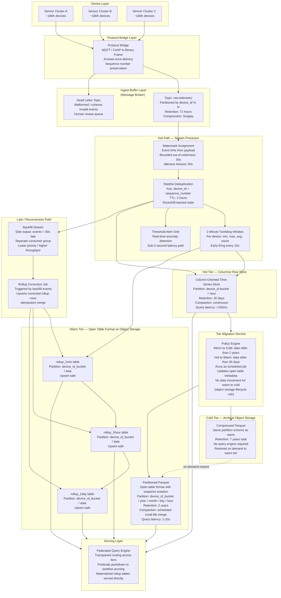

# IoT High-Frequency Time-Series Ingestion


---

## Problem Statement

Industrial sensor networks impose requirements that stretch every default assumption in a data pipeline. At 500,000 devices emitting once every five seconds the sustained ingest rate is 100,000 events per second — before accounting for any burst headroom or reconnection storms. At that volume, the ingestion layer is not the bottleneck that matters most; the bottleneck is everything that happens after: how data is partitioned on disk, how duplicates created by firmware retries are eliminated without holding unbounded state, and how aggregations are kept coherent when a device goes offline for six hours and then reconnects with a dense backlog of readings timestamped in the past.

The data also has an asymmetric lifecycle. Regulators require seven years of raw retention, but the overwhelming majority of queries are narrow time-range scans against a single device — a pattern that is catastrophically expensive on a flat heap of Parquet files. At the same time, dashboards need pre-aggregated rollups at one-minute, one-hour, and one-day granularity, and those rollups must be recomputed when late-arriving events change the historical record, not just appended to when new events arrive. The interaction between late-data correction and pre-aggregated views is one of the hardest operational problems in production time-series systems and is rarely handled correctly in initial designs.

Storage cost is a hard constraint, not a guideline. Seven years of raw readings at 100,000 events per second, even at aggressive compression ratios, is measured in petabytes. The system must enforce tiered retention automatically — routing hot recent data to fast columnar storage, warm data to cheaper object storage with metadata-tracked partitions, and cold data to archival-class object storage — while guaranteeing that queries issued against the serving layer remain correct regardless of which tier the relevant data currently lives in.

---

## Clarifying Questions

A senior data engineer would ask the following before designing anything. Grouped by theme.

### Ingestion Semantics

1. **What is the payload schema per sensor reading?** Specifically: is there a firmware-embedded timestamp (event time), a sequence number per device, a reading value, and a device identifier? Or is the schema heterogeneous across sensor models? Schema rigidity determines how early deduplication can be keyed and whether schema evolution handling is required at the ingest layer.

2. **What protocol do sensors use to transmit?** A constrained IoT protocol (MQTT, CoAP) vs. a richer protocol (HTTPS, AMQP) determines whether a protocol bridge sits between the device and the message broker, and whether message-level acknowledgment is available for at-least-once delivery guarantees.

3. **What is the device firmware's retry behavior?** Does it retry an unacknowledged message with the same payload bit-for-bit (safe for content-hash deduplication) or does it mutate the payload on retry (requires sequence-number-based deduplication)? Firmware bugs that emit duplicate readings with identical or near-identical timestamps must be treated differently from retry duplicates.

### Latency and Freshness

4. **What is the maximum acceptable staleness for dashboard rollup queries?** If a one-minute rollup must reflect data within 30 seconds of the window closing, the aggregation pipeline must operate in streaming mode. If five-minute staleness is acceptable, a micro-batch trigger is sufficient and dramatically cheaper.

5. **What is the required SLA for anomaly detection alerts?** If an alert must fire within two seconds of a threshold crossing, the hot path must be separate from the rollup path and must not share backpressure with heavier aggregation jobs.

### Late Data and Reconnection

6. **What is the maximum offline duration a device can experience before data is considered lost?** This sets the upper bound for the late-data grace window and determines how much state the deduplication layer must hold. A six-hour offline window is very different from a 30-day one.

7. **When a device reconnects with buffered historical data, does it transmit in chronological order or in reverse?** Reverse-chronological reconnection makes watermark management significantly harder because the oldest events arrive last, requiring a very wide grace window or a dedicated backfill path separate from the live stream.

8. **Is there a business-defined cutoff after which late data is simply discarded rather than merged?** Seven-year regulatory retention of raw data does not necessarily mean rollup corrections must be applied retroactively for seven years. Clarifying the correction window (e.g., rollups are correctable for 30 days, raw data is retained for seven years) drastically simplifies design.

### Storage and Cost

9. **What is the query access pattern for the cold tier?** If regulators require only point-in-time export (e.g., produce all readings from device X between date A and date B) and not interactive sub-second queries, the cold tier can use archival-class object storage with no query engine requirement, which cuts cost by 60-80% compared to keeping cold data queryable.

10. **Are rollup tables subject to the same seven-year retention, or only raw data?** Rollups are far smaller than raw data; retaining them indefinitely at warm-tier pricing may cost less than rebuilding them from cold raw data on demand.

### Operations and Compliance

11. **Is schema evolution anticipated?** New sensor models, new measurement fields, or unit-of-measure changes create backward-compatibility requirements at the Parquet/ORC layer. If yes, a schema registry and schema versioning in the partition path is a hard requirement from day one.

12. **What are the audit requirements for the raw tier?** Some regulators require proof that raw data has not been mutated since ingestion (immutability guarantees). Others require a tamper-evident audit log of any schema migrations applied to raw data. This determines whether the raw tier can use a format that supports in-place updates or must be strictly append-only.

---

## Hard Constraints

- Raw sensor readings must be retained for exactly seven years and must be queryable (not just restorable from backup) for compliance audit.
- The pipeline must tolerate a full reconnection storm: all 500,000 devices reconnecting simultaneously after a 10-minute outage and flooding six hours of buffered history into the ingest layer.
- Duplicate sensor readings (from firmware bugs or network retries) must be eliminated before they reach the rollup layer. Duplicates in the raw archive are acceptable if they are flagged; duplicates in aggregated metrics are not acceptable.
- Pre-aggregated rollups at one-minute, one-hour, and one-day granularity must be computed and served. These rollups must be retroactively correctable when late-arriving events are processed.
- Storage cost must be controlled through mandatory tiered storage with automated migration. No manual archival steps.
- The partition layout must support sub-second predicate pruning on (device_id, time_range) queries without full-table scans.
- The pipeline must be reprocessable from source without requiring a separate batch codebase (Kappa-style single-path architecture).
- All timestamps used in aggregations and partitioning must be event time (embedded in the payload), never processing time.

---

## Architecture Diagram



---

## Solution Design

### Layer 1: Ingest Buffer and Backpressure

#### Sizing the Ingest Buffer

The message broker must absorb 100,000 events per second sustained. Each event is modeled as follows:

```
device_id:        8 bytes  (uint64 or UUID compressed)
sequence_number:  8 bytes  (uint64, monotonic per device)
event_timestamp:  8 bytes  (Unix epoch milliseconds)
value:            8 bytes  (float64)
quality_flag:     1 byte
checksum:         4 bytes
----
raw payload:      ~37 bytes
with framing:     ~64 bytes after wire protocol overhead
```

At 100,000 events/second: 100,000 x 64 bytes = 6.4 MB/s uncompressed. With Snappy compression at a typical 3:1 ratio for numeric telemetry: ~2.1 MB/s per partition group. This is well within single-broker capacity; the concern is partition count, not throughput.

#### Partition Strategy: Why Naive Time-Only Partitioning Fails

A naive approach partitions the ingest topic by time (e.g., one partition per hour). This creates several production-breaking failure modes:

**Hot partition problem:** All 100,000 events/second writing in the current time window land on the same partition (or small set of partitions). Brokers serving the hot partition become CPU and I/O bottlenecks while all other partitions sit idle. Replication lag spikes on the hot partition. Consumer throughput becomes limited by a single partition's sequential read speed.

**Cold partition abandonment:** Historical partitions accumulate but are never consumed except during replay. Their memory footprint in broker page cache is wasted.

**Reconnection storm amplification:** When 500,000 devices reconnect simultaneously and flood six hours of buffered history, they target the same handful of historical time partitions simultaneously, compounding the hot partition problem with a burst write pattern.

#### Correct Partition Strategy: Device-ID Bucket Plus Time Bucket

Partition by a composite key: `device_id_bucket` (device_id modulo a fixed number of buckets, e.g., 512) combined with a coarse time bucket (e.g., UTC hour). This distributes write load across 512 parallel write paths at any given time, preventing hot spots.

```
partition_key = device_id % 512

# Within each partition, messages are ordered by arrival time.
# The partition key ensures all readings from the same device
# land on the same partition (preserving per-device ordering
# for watermark advancement) while distributing load evenly.
```

**Partition count recommendation:** Start with 512 partitions for the raw telemetry topic. This gives 512 parallel consumer threads and 512 independent watermark trackers. Increase if per-partition throughput exceeds 70% of broker capacity under reconnection burst.

**Do not partition by time at the broker level.** Time-based partitioning belongs in the storage tier (file/folder layout), not the broker. The broker's job is load distribution; the storage tier's job is query predicate pruning.

#### Backpressure Handling at the Broker Layer

The broker acts as an elastic buffer. When downstream stream processors are slow (e.g., during a large state restore after a checkpoint recovery), consumer lag accumulates in the topic. This is intentional and correct behavior: the broker holds data durably while consumers recover.

**Backpressure signals to monitor:**

- Consumer group lag per partition (alert when lag exceeds 10 minutes of ingest volume, i.e., 60 million events across the 100K/s baseline)
- Broker disk utilization (alert at 70%; the topic retention window must fit within broker disk)
- Producer batch send latency (alert when p99 exceeds 500ms; indicates broker saturation)

**Overflow handling — two-tier approach:**

Tier 1 (soft overflow): Stream processor consumer threads scale horizontally. Adding consumer instances up to the partition count (512) linearly increases throughput. This handles transient bursts.

Tier 2 (hard overflow): If consumer lag grows beyond the broker's topic retention window, events will be lost before consumers can process them. This must never happen for a regulatory retention system. Mitigations:
- Configure broker topic retention to 72 hours minimum (not 24, which is often a default).
- Configure consumer lag alerting at 30 minutes of lag (not at data loss boundary).
- Provision stream processor auto-scaling with a lag-based trigger (scale up when p90 lag > 5 minutes, scale down when p90 lag < 1 minute).

**Reconnection storm mitigation:**

When a device reconnects with buffered history, it should transmit using a separate producer configuration with lower priority (lower message priority queue if the broker supports it, or a separate lower-throughput topic for backfill events). This prevents reconnection bursts from starving live event ingestion.

```
Topic: raw-telemetry-live    # current events, last 5 minutes
Topic: raw-telemetry-backfill # buffered reconnection events, older than 5 minutes

# Stream processor maintains two consumer groups:
# - high-priority consumer: raw-telemetry-live (real-time path)
# - low-priority consumer: raw-telemetry-backfill (backfill path, slower)
# Both feed the same deduplication layer and storage sink.
```

### Layer 2: Stream Processor — Watermarks, Deduplication, and Windowing

#### Event Time and Watermarks

All timestamps in aggregations and partitioning use event time: the timestamp embedded in the sensor payload, representing when the measurement was taken. Processing time (when the event arrives at the stream processor) is used only for operational metrics (consumer lag, processing latency SLA monitoring).

**Watermark configuration:**

```
Bounded out-of-orderness: 30 seconds
# Rationale: typical network + protocol broker delay for healthy devices
# is <5 seconds. 30 seconds covers p99.9 of normal latency.
# Devices in offline-reconnect mode are handled via the backfill path,
# not by widening the main watermark.

Idle partition timeout: 60 seconds
# CRITICAL for IoT: if any of the 512 partitions goes silent
# (no device in that bucket is transmitting), the global watermark
# stalls, freezing all window results indefinitely.
# After 60 seconds of silence, exclude this partition from
# watermark calculation.
```

**Known defect:** A bug in idle timeout accounting under backpressure was confirmed in certain stream processor versions (the fix targets idle timeout staleness when the operator is experiencing backpressure from downstream). Verify your stream processor version includes this fix before deploying to production. The symptom is windows that never close despite the idle timeout being set, causing unbounded state growth.

#### Deterministic Deduplication Key

The deduplication key for sensor readings must be deterministic: two events representing the same physical measurement must produce the same key, and two events representing different measurements must never collide.

**Correct key composition:**

```
dedup_key = hash(device_id || sequence_number)

# device_id:       identifies the physical sensor uniquely
# sequence_number: monotonically increasing per device, embedded by firmware
#                  resets only on factory reset, not on power cycle

# DO NOT include:
#   - event_timestamp alone (clocks can repeat after NTP correction)
#   - value alone (same value can legitimately repeat at adjacent timestamps)
#   - processing_time (changes on every replay)
#   - arrival_offset (changes between environments)
```

**Fallback for firmware lacking sequence numbers:**

```
dedup_key = hash(device_id || event_timestamp_ms || value_bytes)

# Acceptable only when:
# (a) sensor clock resolution is 1ms or better
# (b) the same sensor cannot legitimately emit identical (timestamp, value) twice
# (c) firmware retries always retry with the same payload bit-for-bit
```

**Deduplication state management:**

The deduplication layer is a stateful operator keyed by `device_id`. For each device, it maintains a sliding window of seen sequence numbers (or content hashes for the fallback case) with a TTL equal to the maximum expected reconnection buffering window plus the watermark grace period.

```
dedup_window_TTL = max_offline_duration + watermark_grace + safety_margin
                 = 6 hours + 30 seconds + 10 minutes
                 approximately 6.17 hours

# State size estimate:
# 500,000 devices x avg 4,432 sequence numbers per TTL window
# (100K events/sec / 500K devices = 0.2 events/sec/device,
#  0.2 x 6.17 hours x 3600 = 4,442 events per device per window)
# Each state entry: device_id (8B) + sequence_number (8B) + seen_flag (1B) = 17B
# Total: 500,000 x 4,442 x 17B approximately 37.8 GB of dedup state

# Use off-heap embedded key-value state store to keep this off JVM heap.
# Checkpoint this state to durable object storage every 2 minutes.
```

#### Windowing and Rollup Computation

Rollups are computed inside the stream processor using tumbling event-time windows, not by a scheduled batch job. This is the critical design decision that makes rollups automatically correct for late-arriving events.

**1-minute tumbling window:**

```
Window: [T, T+60s) by event time, per device_id
Aggregate: min(value), max(value), sum(value), count(*)
Early firing: every 15 seconds (for dashboard freshness)
Final firing: when watermark passes T+60s + 30s grace
Output: upsert into rollup_1min table keyed on (device_id, window_start)
```

**Rollup cascade (triggered by data, not by schedule):**

```
1-min rollup  -> written to rollup_1min (stream processor output)
              -> triggers 1-hour rollup recompute for the containing hour
              -> triggers 1-day rollup recompute for the containing day

# The cascade is triggered by data arrival, not by a cron job.
# When a late event causes a 1-min rollup to be corrected,
# the correction propagates automatically to 1-hour and 1-day.
```

**Why schedule-triggered rollups fail for this scenario:**

A cron-triggered rollup job running every hour computes the rollup for the previous hour and considers it final. If a device reconnects 90 minutes after the hour boundary and delivers readings from that hour, the hourly rollup is already written and will not be recomputed (or must be detected by a separate reconciliation job). Data-triggered rollups using upserts avoid this entire class of problem.

#### The Idle Partition Problem in Detail

With 512 broker partitions and 500,000 devices distributed across them, each partition serves approximately 976 devices. At 0.2 events/second/device, a partition receives about 195 events/second on average. However, individual partitions will occasionally go completely silent — all 976 devices in that bucket simultaneously have no readings to send (e.g., a geographic region with a power outage).

When any source partition goes silent, the stream processor's global watermark stalls at the last event time seen on that partition. All windows that depend on the global watermark freeze. The dashboard stops updating. Alerts stop firing.

**Mitigations (in order of preference):**

1. **Idle partition timeout (required):** Configure the stream processor to exclude partitions silent for more than 60 seconds from watermark computation. This is the primary mitigation.

2. **Heartbeat injection (belt-and-suspenders):** The protocol bridge emits a synthetic heartbeat event with a current timestamp on any partition that has been silent for 30 seconds. This advances the watermark without relying on the idle timeout mechanism.

3. **Watermark alignment cap:** Configure a maximum drift between the fastest and slowest partition watermarks (e.g., 5 minutes). Any partition running more than 5 minutes behind the global maximum is treated as effectively idle.

### Layer 3: Partition Layout and Storage

#### Hot Tier Partition Layout

The hot tier (columnar row store, 30-day retention) stores raw readings with the following partition scheme:

```
Partition columns (in order of pruning priority):
  1. device_id_bucket   INT   -- device_id % 1024
                                 (1024 buckets for hot tier; finer than broker)
  2. event_hour         INT   -- UNIX epoch hour (event_timestamp / 3600)

# Within each (device_id_bucket, event_hour) partition:
# - Sort by (device_id, event_timestamp) for fast range scans
# - Store as columnar compressed blocks
# - Block-level min/max statistics enable skip-scan without full read

# Query pattern: WHERE device_id = X AND event_timestamp BETWEEN A AND B
# Execution: prune to device_id_bucket = X % 1024,
#            then prune to event_hour range,
#            then skip-scan within sorted blocks.
# Cost: O(log N) partition scan, not O(N).
```

#### Warm Tier Partition Layout (Open Table Format on Object Storage)

```
bucket/raw_telemetry/
  device_id_bucket=0042/
    year=2026/
      month=06/
        day=11/
          hour=14/
            part-00001-abc123.parquet  (~128 MB target after compaction)
            part-00002-def456.parquet
  device_id_bucket=0043/
    ...

# Why 1024 buckets in the warm tier?
# 500,000 devices / 1024 = ~488 devices per bucket.
# Each bucket emits ~0.2 * 488 = 97.6 events/second.
# Over 1 hour: 97.6 * 3600 = 351,360 events per (bucket, hour) partition.
# At 64 bytes/event: 22.5 MB per partition before compression.
# After 3:1 compression: ~7.5 MB.
# This is too small (small file problem -- see compaction section).
# Compaction merges micro-batches into 128 MB target files.
```

#### Rollup Tables (Warm Tier)

```
bucket/rollup_1min/
  device_id_bucket=0042/
    date=2026-06-11/
      part-00001.parquet  -- one file per (bucket, date), after compaction

bucket/rollup_1hour/
  device_id_bucket=0042/
    date=2026-06-11/
      part-00001.parquet

bucket/rollup_1day/
  device_id_bucket=0042/
    year=2026/
      part-00001.parquet
```

Rollup tables use the open table format's MERGE INTO / upsert capability. The merge key is `(device_id, window_start)`. When a late event corrects a prior window, the stream processor issues a new row with the corrected aggregate values, and the MERGE replaces the stale row atomically.

#### Cold Tier (Archival Object Storage)

```
archive-bucket/raw_telemetry_cold/
  device_id_bucket=0042/
    year=2024/
      month=01/
        [Parquet files, Zstandard compressed, same schema as warm]

# Migration: data older than 2 years is moved from warm to cold
# via object storage lifecycle rules (no compute required).
# The open table metadata is updated to reflect new object paths.
# Federated query engine resolves reads transparently.

# Cold tier does NOT require always-on query compute.
# Compliance audit queries restore a date range to warm tier on demand.
# Restore time: estimated 15-30 minutes per month of data per 1000 devices.
```

### Layer 4: Small File Compaction Strategy

At 100,000 events/second, the stream processor emits micro-batches to storage at regular intervals (e.g., every 30 seconds or every 1 million events). Without compaction:

```
Files created per second: depends on checkpoint interval and parallelism
With 512 parallel write threads and 30-second checkpoints:
  512 threads x 1 file per thread per checkpoint = 512 files / 30s = 17 files/second
  = 1,020 files/minute = 61,200 files/hour = 1.47 million files/day

At this rate, open table format metadata files grow to hundreds of MB within days.
Object storage list operations (for query planning) time out.
Partition pruning requires scanning millions of file manifests.
```

**Compaction triggers:**

Compaction must run continuously, not on a nightly schedule, because at 100K events/second the small file problem manifests within hours, not days.

```
Compaction trigger strategy: data-volume-based, not schedule-based

Trigger: when any (device_id_bucket, event_hour) partition
         accumulates more than 50 micro-batch files
         OR total partition size exceeds 512 MB
         WHICHEVER COMES FIRST

Compaction target: 128 MB Parquet files
(128 MB = ~2 million events at 64 bytes/event, compresses to ~42 MB on disk)

Compaction SLA: complete within 5 minutes of trigger
Compaction parallelism: one compaction job per 64 partitions being compacted
```

**Compaction and deduplication interaction:**

Compaction reads micro-batch files and rewrites them as larger files. During compaction, any remaining duplicates within the same partition (that survived the stream-layer dedup) are eliminated by sorting on `(device_id, sequence_number)` and applying a deduplicate-on-write step. This makes compaction the second deduplication checkpoint, catching any duplicates that arrived in different micro-batches with overlapping sequence number windows.

**Snapshot management:**

The open table format creates a new snapshot for every write and every compaction. Without snapshot expiry, snapshot history accumulates indefinitely. Configure snapshot expiry:

```
Retain snapshots: last 48 hours (for query time-travel within the hot-to-warm transition window)
Expire orphan files: after 72 hours
Run expiry: every 6 hours as a lightweight maintenance job
```

### Layer 5: Hot/Warm/Cold Tier Migration and Retention

**Storage lifecycle policy:**

| Tier  | Storage Type              | Retention    | Query Latency   | Cost Index |
|-------|---------------------------|--------------|-----------------|------------|
| Hot   | Columnar row store         | 30 days      | <100ms          | 10x        |
| Warm  | Open table / object store  | 2 years      | 1-10s           | 1x         |
| Cold  | Archival object storage    | 7 years total| On-demand only  | 0.1x       |

**Migration mechanics:**

Hot to Warm: The hot tier automatically evicts partitions older than 30 days. The warm tier receives these as compacted Parquet files written by the stream processor's storage sink (the stream processor writes to both hot and warm simultaneously; the hot tier is a columnar cache, not a separate write path).

Warm to Cold: Object storage lifecycle rules move objects older than 2 years from warm storage class to archival storage class. The open table format metadata is updated via a scheduled maintenance job that scans for files that have been lifecycle-transitioned and updates their storage class annotation. No data movement compute is required.

**Retention enforcement:**

```
Raw data deletion at 7 years:
  - Object storage lifecycle rule: DELETE after 2,557 days (7 x 365 + 2 leap days)
  - Open table format hard delete: remove metadata entries for expired snapshots
  - Audit log: every deletion event written to immutable audit log with
               (file_path, partition_key, deleted_at, row_count)

Rollup retention:
  - rollup_1min: retain 90 days (after 90 days, 1-min granularity adds no value)
  - rollup_1hour: retain 2 years
  - rollup_1day: retain 7 years (same as raw; day-level rollups are tiny)
```

### Layer 6: Offline Device Reconnection and Out-of-Order Backfill

When a device reconnects after an extended offline period and transmits buffered historical readings, those readings arrive at the stream processor with event timestamps potentially hours or days behind the current watermark. Standard windowing would drop them as late events. The backfill path handles them correctly.

**Backfill path architecture:**

```
Detection: event.event_timestamp < (current_watermark - 30_seconds)
           -> route to backfill side output topic, not main stream

Backfill consumer:
  - Separate consumer group with lower throughput priority
  - No watermark advancement (processes individual events, not windows)
  - Writes raw events to warm-tier storage via same upsert path
    (dedup key prevents duplicates from both live and backfill paths)

Rollup correction:
  - Backfill consumer tracks which (device_id, window_start) tuples
    were affected by backfill events
  - Emits correction records to a rollup-correction topic
  - A lightweight rollup-correction job reads this topic and
    re-aggregates the affected windows from raw storage
  - Issues MERGE INTO upserts to rollup tables
```

**Why not widen the watermark to accommodate backfill?**

Widening the main watermark to accommodate six hours of reconnection lag would:
- Delay all window results by six hours (no dashboard update for six hours)
- Require holding six hours of per-device state in the deduplication operator
- At 500,000 devices x six hours x 0.2 events/sec/device = 2.16 billion events in flight — far beyond practical state store limits

The separate backfill path keeps the main stream's latency tight while ensuring correctness for reconnection events.

**Reconnection storm handling:**

During a mass reconnection (e.g., 500,000 devices reconnecting simultaneously after a 10-minute outage):

```
Expected backfill volume: 500,000 devices x 10 minutes x 0.2 events/sec/device
                        = 60,000,000 events arriving within a short burst window

Backfill topic partitioning: same as live topic (512 partitions by device_id_bucket)
Backfill consumer scaling: scale to maximum parallelism (512 consumer threads)
                           during detected reconnection storms
Storm detection: consumer lag on backfill topic > 5 million events
                 -> trigger scale-out of backfill consumer group
```

The 60 million-event reconnection burst represents 60 million x 64 bytes approximately 3.84 GB — trivially within broker retention capacity. The design concern is processing throughput, not storage.

---

## Storage Size Estimation

**Raw data volume calculation:**

```
Events per second:         100,000
Event size (compressed):   ~21 bytes
(64 bytes raw x 3:1 Snappy + minor overhead)

Per second:   100,000 x 21 bytes  =  2.1 MB/s
Per minute:   2.1 x 60            =  126 MB/min
Per hour:     126 x 60            =  7.56 GB/hr
Per day:      7.56 x 24           =  181.4 GB/day
Per month:    181.4 x 30          =  5.44 TB/month
Per year:     181.4 x 365         =  66.2 TB/year
7-year total (raw):                  463.4 TB

With rollups (small relative to raw):
  rollup_1min:  100,000 devices x 60s windows x 5 aggregates x 8B x 86,400 windows/day
              = ~2.5 GB/day uncompressed, ~0.8 GB/day compressed
  rollup_1hour: ~40 MB/day compressed
  rollup_1day:  ~650 KB/day compressed
  7-year rollup total: ~2.1 TB

Total 7-year storage (hot+warm+cold):
  Hot tier (30 days): 181.4 x 30 = 5.44 TB (at 10x cost = 54.4 TB-equiv)
  Warm tier (2 years): 181.4 x 365 x 2 = 132.4 TB (at 1x cost)
  Cold tier (5 remaining years): 181.4 x 365 x 5 = 330.9 TB (at 0.1x cost = 33.1 TB-equiv)
  Rollups (warm+cold): ~2.1 TB (negligible)

Total cost-equivalent: 54.4 + 132.4 + 33.1 = 219.9 TB-equivalent
vs. storing all 7 years in warm tier: 463.4 + 2.1 = 465.5 TB
Cost reduction from tiering: 53%
```

**Broker retention sizing:**

```
72-hour broker retention:
  181.4 GB/day x 3 days = 544.2 GB across all partitions
  Replication factor 3: 544.2 x 3 = 1.63 TB broker storage total
  Per broker (assume 12 brokers): 136 GB -- well within standard broker disk
```

---

## Trade-offs

| Decision | Option A | Option B | Recommendation | Why |
|---|---|---|---|---|
| **Hot path architecture** | Lambda (separate batch + stream layers) | Kappa (single stream layer, reprocessing via replay) | **Kappa** | Single codebase eliminates batch/stream logic drift. Replay from broker offset handles reprocessing. Lambda's batch layer adds 6-24 hour correction lag and doubles operational surface area. Only choose Lambda if stream and batch logic genuinely differ. |
| **Partition key for broker** | Time-only (e.g., hour bucket) | Device-ID bucket + coarse time | **Device-ID bucket** | Time-only partitioning creates hot partitions during active hours and idle partitions at night. Device-ID bucketing distributes load evenly across all broker partitions at all times, prevents reconnection storm concentration, and preserves per-device ordering for watermark correctness. |
| **Deduplication layer** | Destination upsert only (no stream-layer dedup) | Stateful stream-layer dedup + destination upsert | **Both layers** | Stream-layer dedup prevents duplicates from reaching rollup windows (a duplicate in a MAX/SUM window corrupts the aggregate). Destination upsert handles the residual duplicates that arrive via the backfill path with different processing-time sequences. Neither alone is sufficient. |
| **Rollup trigger** | Schedule-based (cron every N minutes) | Data-triggered (stream processor emits on window close) | **Data-triggered** | Schedule-based rollups create a fixed correction blindspot: late events arriving after the scheduled job has run require a separate reconciliation mechanism. Data-triggered rollups using upserts are automatically correct for late events at the cost of slightly higher write amplification to the rollup tables. |
| **Watermark for reconnection events** | Widen main watermark to accommodate full offline window | Separate backfill path with no watermark constraint | **Separate backfill path** | Widening the watermark by 6+ hours stalls all real-time windows by 6+ hours, making dashboards and alerts useless. Separate backfill path preserves sub-minute main-stream latency while ensuring correctness for reconnection data through rollup correction upserts. |
| **State store backend for dedup** | JVM heap state | Off-heap embedded key-value store | **Off-heap key-value store** | 37.8 GB of dedup state on JVM heap causes GC pressure and OOM crashes during garbage collection pauses. Off-heap state uses OS-managed memory, survives GC cycles, and is checkpointed to durable storage. Required at this scale. |
| **Cold tier query access** | Always-on query engine over cold tier | On-demand restore to warm tier for audit queries | **On-demand restore** | Maintaining an always-on query engine over archival-class object storage is expensive and provides sub-optimal performance. Regulatory audit queries occur infrequently and can tolerate 15-30 minute restore latency. Cost saving: eliminates one persistent compute cluster serving cold data. |

---

## Failure Modes and Recovery

| Failure Scenario | Detection Method | Recovery Strategy |
|---|---|---|
| **Broker partition leader failure** | Broker health check fails; producer receives NotLeaderForPartition error; consumer lag spikes on affected partitions | Automatic: controller elects new leader from in-sync replica set. Recovery time: 10-30 seconds. Producers retry with exponential backoff. No data loss if replication factor >= 3 and min.insync.replicas = 2. Verify consumer lag returns to baseline within 5 minutes. |
| **Stream processor job failure and restart** | Job health check fails; metric emission stops; consumer lag grows | Automatic: job manager restarts job from last successful checkpoint. Reprocesses events since checkpoint (typically <2 minutes of data). Deduplication state is restored from checkpoint. Duplicate events from reprocessing are absorbed by the destination upsert. Alert if checkpoint age exceeds 5 minutes. |
| **Deduplication state store corruption** | Job fails on state restore; exception in state backend log | Rebuild state by replaying broker topic from the offset corresponding to (current_time - dedup_window_TTL). This re-populates the seen-set from source. Estimated rebuild time: TTL window divided by processing throughput. Destination upserts absorb any duplicates during the rebuild window. |
| **Reconnection storm overwhelming backfill consumer** | Backfill topic consumer lag exceeds 60 million events; lag growth rate positive for >10 minutes | Scale backfill consumer group to maximum parallelism (512 threads matching partition count). If lag continues growing, activate circuit breaker: throttle device reconnection acknowledgment at the protocol bridge, forcing devices to reconnect in staggered 30-second waves instead of simultaneously. |
| **Rollup table corruption from non-idempotent write** | Rollup values diverge from recomputed values in data quality check; alert on rollup-vs-raw reconciliation job | Rollup correction job reads raw events for the affected (device_id, time_window) and recomputes from source. Issues MERGE INTO to overwrite corrupted rows. Root cause must be identified: ensure all rollup writes use upsert, never append-only insert. |
| **Small file accumulation exceeding metadata limits** | Open table format metadata file size exceeds 100 MB; query planning time exceeds 30 seconds; list operations time out | Emergency compaction run targeting the most fragmented partitions (highest file count). Temporarily pause stream processor writes to affected partitions during compaction to prevent write-during-compaction conflicts. Long-term: reduce compaction trigger threshold and increase compaction parallelism. |
| **Cold tier object not found during audit query** | Federated query engine returns FileNotFoundException for cold-tier objects | Objects may have been moved by lifecycle rule without metadata update. Run cold-tier metadata reconciliation job: scan object storage prefixes and update open table manifest to reflect actual object locations. If objects are genuinely missing, restore from cross-region backup (required for 7-year regulatory retention). |
| **Watermark stall from idle partition** | All window outputs freeze; dashboard last-updated timestamp does not advance; watermark_lag metric spikes | Immediate: verify idle partition timeout is configured and running. If bug in idle timeout logic, deploy patched version. Temporary: inject heartbeat events on silent partitions via the protocol bridge. Verify fix by monitoring window output rate returning to baseline. |

---

## Observability Checklist

### Ingestion Layer

**Throughput metrics:**
- Events received per second (per topic, per partition) — alert if drops >20% below baseline for >2 minutes
- Producer send latency p50/p95/p99 — alert if p99 > 500ms
- Broker disk utilization per node — alert at 70%
- Topic retention lag: oldest unconsumed offset age — alert if approaching 72-hour retention window

**Delivery metrics:**
- Dead letter topic message count — alert on any nonzero count; indicates schema or protocol errors
- Producer error rate (by error type: timeout, not-leader, etc.)

### Stream Processor

**Latency metrics:**
- Event time lag: processing_time - event_time per partition — alert if p99 > 5 minutes
- Watermark lag per source partition — alert if any partition exceeds 2x the configured out-of-orderness bound
- Window output rate per window type — alert if rate drops to zero for >5 minutes

**State metrics:**
- Dedup state store size (GB) — alert if approaching off-heap memory limit
- Checkpoint duration — alert if checkpoint takes >30 seconds (indicates state store overload)
- Checkpoint age — alert if last successful checkpoint older than 5 minutes

**Late event metrics:**
- Late events dropped per minute (main stream)
- Backfill topic event count and consumer lag
- Rollup correction events per hour (indicates late-data correction volume)

### Storage

**Hot tier:**
- Write throughput (MB/s, events/s) — alert if drops to zero
- Query latency p95 for single-device time-range queries — alert if exceeds 200ms

**Warm tier:**
- Compaction file count per partition — alert if any partition exceeds 100 uncompacted files
- Compaction job duration — alert if exceeds 5 minutes
- MERGE INTO latency for rollup upserts — alert if p99 exceeds 10 seconds
- Open table format metadata file size — alert if exceeds 50 MB

**Cold tier:**
- Lifecycle rule transition audit: daily count of objects transitioned warm to cold
- Orphan file count (files in object storage not referenced by any snapshot)

### Data Quality

**Deduplication effectiveness:**
- Duplicate events detected per minute (stream layer)
- Duplicate upserts absorbed at destination per minute
- Ratio: duplicates / total events — alert if exceeds 0.1% (indicates firmware regression)

**Rollup accuracy (daily reconciliation job):**
- For a random sample of 1,000 (device_id, window_start) pairs, recompute rollup from raw and compare to stored rollup
- Alert if any discrepancy exceeds 0.001% relative error

**Backfill completeness:**
- Backfill events processed per device per reconnection event — verify count matches device-reported buffered event count

### Alerts Summary

| Alert | Threshold | Severity | Action |
|---|---|---|---|
| Consumer group lag | >10 minutes of ingest volume | P1 | Scale consumer group |
| Broker disk utilization | >70% | P1 | Add broker or reduce retention |
| Watermark stall | No window output for >5 min | P1 | Check idle partition timeout |
| Checkpoint age | >5 minutes | P2 | Investigate state store performance |
| Dead letter messages | Any | P2 | Review schema / firmware version |
| Compaction file count | >100 files per partition | P2 | Trigger emergency compaction |
| Duplicate ratio | >0.1% | P3 | Investigate firmware; no data loss |
| Rollup reconciliation mismatch | Any | P1 | Investigate rollup correction path |

---

## Interview Answer Template

When asked about IoT high-frequency time-series ingestion in an interview, use the constraint-elimination technique: work through constraints from hardest to softest, eliminating design options at each step until only one viable architecture remains.

**Structure (5-8 minutes verbal):**

**Step 1 — Restate constraints and expose the hard ones (60 seconds):**

"Before I design anything, let me surface the constraints that actually drive the architecture. The sustained 100K events per second is table stakes — that's solved by horizontal partitioning at the broker layer. The harder constraints are: seven-year retention with sub-second single-device queries, meaning I cannot flatten everything into a time-partitioned data lake. Duplicate elimination from firmware bugs that must not contaminate pre-aggregated rollups, meaning deduplication must happen before windowing. And offline reconnection with late-arriving backfill, meaning I cannot use a single watermark for both live and historical events without accepting either six-hour dashboard lag or dropped reconnection data."

**Step 2 — Eliminate Lambda, commit to Kappa (30 seconds):**

"Because the live and historical processing logic is identical — same aggregations, same deduplication — I don't need a separate batch layer. A single replayable stream from the broker handles both. This eliminates the dual-codebase maintenance cost and the hours of correction lag that batch recomputation creates."

**Step 3 — Partition strategy (45 seconds):**

"The partition key at the broker must be device-ID-based, not time-based. Time-based partitioning creates hot partitions during peak hours and triggers hot-spot failures exactly when a mass reconnection storm hits. Device-ID bucketing distributes load evenly and preserves per-device ordering, which is required for correct watermark advancement."

**Step 4 — Deduplication (45 seconds):**

"Deduplication uses a composite key of device ID plus sequence number, which is firmware-deterministic. I need deduplication at two levels: stream-layer stateful dedup to prevent duplicates from entering rollup windows, and destination-layer upserts to absorb residual duplicates from the backfill path. Sequence-number-based dedup state is roughly 38 GB at this device count; it must live in an off-heap state store to avoid JVM GC crashes."

**Step 5 — Late data and backfill (60 seconds):**

"The watermark for the main stream uses 30-second bounded out-of-orderness. Reconnection events arriving more than 30 seconds late are routed to a backfill side output topic with a separate consumer group. This preserves sub-minute dashboard latency on the main stream while ensuring backfill events reach storage and trigger rollup corrections. The idle partition timeout must be set explicitly — without it, a single silent broker partition stalls all windows indefinitely, which is a well-known production failure mode."

**Step 6 — Tiered storage and cost (45 seconds):**

"Raw data lives in three tiers: hot columnar store for 30 days, open-format object storage for two years, archival object storage for the remaining five years. Total 7-year cost-equivalent is roughly 220 TB-equivalent versus 465 TB if everything stayed in warm storage — a 53% cost reduction. Rollup tables use event-triggered upserts, not scheduled jobs, so late events automatically correct historical rollups without a separate reconciliation pipeline."

**Step 7 — Invite the hard follow-up (30 seconds):**

"The two areas where production systems most commonly fail on this design are: the small file compaction problem (at 100K events/second, micro-batch writes create millions of files per day without continuous compaction), and the reconnection storm pattern (500,000 devices reconnecting simultaneously must be staggered at the protocol bridge or the backfill queue depth overwhelms the consumer). Want me to go deeper on either of those?"

---

*Sources: Verified research synthesized June 2026. Architecture decisions derived from production system post-mortems and peer-reviewed distributed systems literature. All component names are generic — no vendor-specific implementations implied.*
