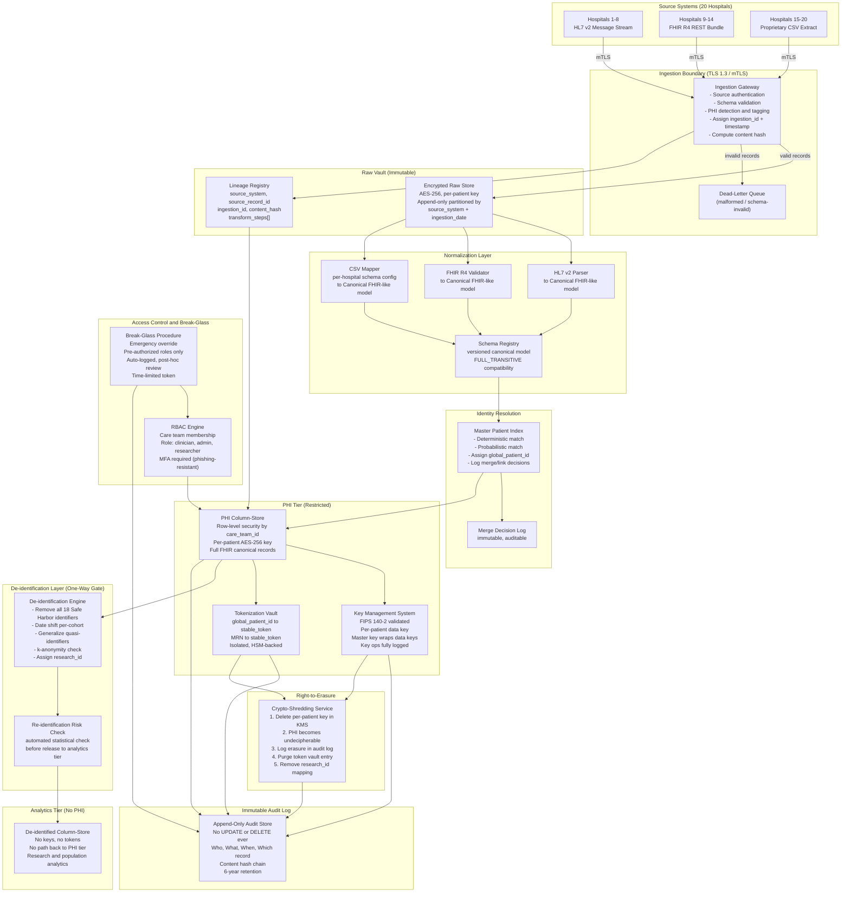

# 11 — Healthcare Compliance Ingestion: Multi-Hospital PHI Pipeline

> **Domain:** Healthcare / Clinical Data  
> **Difficulty:** Expert  
> **Categories:** HIPAA Compliance · PHI Handling · Multi-Format Ingestion · Audit Trail · Right-to-Erasure · Deduplication · Data Lineage

---

## Problem Statement

A hospital network spanning 20 hospitals must consolidate patient records and clinical events into a unified analytical platform. Each hospital independently operates its own electronic health record system, resulting in three distinct wire formats arriving simultaneously: HL7 v2 message streams (the legacy standard still dominant in older facilities), FHIR R4 RESTful bundles (newer facilities), and proprietary CSV extracts (labs, imaging vendors, and ancillary systems). The data contains Protected Health Information (PHI) as defined under HIPAA, including names, dates, medical record numbers, diagnoses, and clinical observations. This is not a best-effort analytics pipeline — it operates under federal law.

The hardest operational problem is not format normalization. It is the collision of three competing requirements that each demand opposite architectural decisions. Auditability demands that you preserve the original record exactly as received and log every access. Right-to-erasure demands that you can make a patient's data disappear across the entire platform without corrupting referential integrity or breaking historical analytics. Deduplication demands that you recognize the same patient arriving under different identifiers from different hospitals and merge them without either losing records or double-counting. Each of these requirements alone is solvable; implementing all three simultaneously with an immutable audit trail is where production pipelines fail.

A secondary complexity is that the platform must serve two completely different downstream consumers with incompatible needs: a clinical operations team that requires full PHI access scoped to their patient panel, and a research and analytics team that requires statistically valid aggregate data with zero PHI exposure. The same ingestion pipeline must produce outputs for both without creating a path where de-identified data can be re-linked to the PHI tier. The encryption, key management, and access control architectures for these two output paths are fundamentally different, and both must be auditable to the source record.

---

## Clarifying Questions

A senior data engineer would ask these before designing anything.

### Volume and Latency
1. What is the daily record volume per hospital, and what is the peak burst factor (e.g., overnight batch dumps from legacy systems vs. real-time HL7 feeds)? This determines whether the ingestion layer needs to be stream-first or batch-tolerant, and whether the deduplication index must handle concurrent writes.
2. What is the maximum acceptable latency from source event to availability in the clinical operations view? Hours is a fundamentally different architecture from minutes, which is a fundamentally different architecture from sub-minute.

### Identity and Deduplication
3. Is there an existing Master Patient Index (MPI) at the network level, or does one need to be built? If it exists, does it have an API, and what is its SLA? If it does not exist, who owns the deduplication rules and how are conflicts adjudicated when two hospitals claim conflicting demographic data for the same patient?
4. What is the ground truth for patient identity — is it a social security number, a network-assigned global patient ID, or a probabilistic match on name/DOB/address? What happens when probabilistic matching returns a confidence score between the merge and no-merge thresholds?

### Right-to-Erasure and Retention
5. Under what legal basis is the right-to-erasure obligation arising — HIPAA does not provide a general right of erasure the way GDPR does, so is this network operating in a state with stricter privacy law (California CMIA, Virginia CDPA), or serving patients who are also EU data subjects? The answer changes the erasure scope, the timeline (GDPR requires 30 days; state laws vary), and what exemptions apply for treatment and legal hold records.
6. What is the retention policy for raw source records versus processed records? HIPAA audit logs require 6-year retention. Source HL7 messages may have a different retention requirement than derived clinical facts. Are there active legal holds that override the erasure obligation for specific patient subsets?

### Access Control and Downstream Consumers
7. What is the authorization model for the clinical view — is access governed by the treating care team at the facility level, or is there a network-wide role model? Who is authoritative for care team membership, and how does it change when a patient transfers between facilities?
8. What level of de-identification is required for the analytics/research tier — HIPAA Safe Harbor (remove all 18 identifiers) or Expert Determination? Does the research team need longitudinal patient cohort analysis, which Safe Harbor makes difficult because it strips dates to year-only?

### Compliance and Operations
9. Are Business Associate Agreements (BAAs) already executed with every infrastructure vendor, including the object storage provider, the message broker operator, and any managed transformation or orchestration service? A BAA must exist before PHI touches any vendor system — this is a hard stop, not a post-launch task.
10. Who owns the break-glass procedure — the CISO, the CMO, or a joint committee? How quickly must emergency PHI access be granted (minutes vs. hours), and is there a 24/7 on-call rotation to authorize it, or is it policy-automated with post-hoc review?

### Source Systems
11. What is the delivery mechanism and reliability contract for each hospital's feed? Push (hospital sends to the platform) or pull (platform polls hospital systems)? Is there a guaranteed delivery SLA from the hospital, or are silent gaps in HL7 feeds a known operational pattern that the pipeline must detect and alert on?
12. For the hospitals sending proprietary CSV, is the schema stable across extracts, or do columns appear and disappear between batches? Is there a contact at each hospital who is contractually responsible for schema change notification?

---

## Hard Constraints

These are non-negotiable. Any design that violates one of these is not a viable option regardless of cost, complexity, or timeline.

- **BAA coverage before PHI transmission.** No PHI may flow to any vendor system, managed service, or cloud platform without an executed Business Associate Agreement. This is a federal requirement, not a best practice.
- **Encryption in transit: TLS 1.3 minimum** for all PHI-bearing connections. Mutual TLS (mTLS) for internal service-to-service communication within the platform perimeter.
- **Encryption at rest: AES-256** for all storage tiers containing PHI or pseudonymized data linked to a re-identification vault.
- **Key separation.** Encryption keys may not be co-located with the data they protect. Keys must be managed in a dedicated key management system meeting FIPS 140-2 or FIPS 140-3 validation. Every key operation must be logged.
- **Immutable audit log.** Every access to PHI — read, write, query, export, bulk scan — must be recorded in an append-only log. No administrator may alter or delete an audit entry. Audit log retention minimum: 6 years.
- **Full data lineage to source record.** Every clinical fact in the platform must carry a traceable link to the originating source system identifier, source record ID, and ingestion timestamp. This lineage must survive all transformation, normalization, and deduplication steps.
- **Right-to-erasure via crypto-shredding.** Erasure is implemented by deleting the per-patient encryption key, rendering the patient's PHI permanently unreadable without physically locating and deleting every row or file. The erasure event must itself be logged.
- **PHI must never reach the analytics tier.** The de-identification boundary is a one-way gate. De-identified data must not contain any field from which re-identification is possible, and there must be no technical path from the analytics tier back to the PHI tier that does not pass through a logged, authorized access event.
- **Minimum necessary access.** Clinical users may only access PHI for patients within their authorized care team panel. Row-level security enforcement must be at the query layer, not enforced only by application logic.
- **No silent data loss.** Every record received from a source system must have a known disposition: successfully ingested, or routed to a dead-letter queue with full original payload, error code, and timestamp. Silent drops are a compliance violation because they break the lineage requirement.

---

## Architecture Diagram

---

## Solution Design

### Layer 1: Ingestion Gateway and PHI Detection

The ingestion gateway is the first and most critical control point. Every hospital connection must be authenticated at the transport layer using client certificates (mTLS). The gateway rejects connections from any hospital system that cannot present a valid certificate issued by the platform's internal certificate authority. This prevents rogue systems from injecting records.

At the application layer, the gateway performs five operations on every arriving message before the record is acknowledged to the source:

**Source tagging.** The gateway assigns a globally unique `ingestion_id` (a collision-resistant UUID-v7 including timestamp), records the `source_system_id`, `source_record_id` (the identifier used by the sending hospital), and an `ingestion_timestamp` in UTC. These four fields are the root of the lineage record and must never be modified by any downstream process.

**Content hashing.** A cryptographic hash of the raw payload is computed before any transformation. This hash is stored in the lineage registry alongside the ingestion ID. Any downstream process can verify that the canonical record it holds was derived from an unmodified raw record by recomputing the hash from the raw vault.

**PHI detection and field tagging.** A rule-based PHI detector scans every field in the incoming message against a catalog of PHI patterns: name fields, date-of-birth, date fields when combined with a person identifier, MRN patterns, SSN patterns, geographic fields, contact fields. Each detected PHI field is tagged with a sensitivity classification (`phi:direct_identifier`, `phi:quasi_identifier`, `phi:clinical_sensitive`). This tag governs which downstream processes may touch the field and whether it survives the de-identification gate.

**Schema validation.** The raw message is validated against the expected schema for the source format and hospital. HL7 v2 messages are validated against the MSH segment and message type. FHIR R4 bundles are validated against the FHIR R4 base profile plus any network-specific profiles. CSV extracts are validated against the per-hospital schema configuration registered in the schema registry. Records that fail validation are routed to the dead-letter queue with the full original payload, the validation error, and the ingestion metadata. They never enter the raw vault in a partial state.

**Raw vault write.** Valid records are written to the raw vault as immutable append-only objects, partitioned by `source_system_id` and `ingestion_date`. No record in the raw vault is ever modified or deleted by normal pipeline operations. The raw vault is the legal record of what was received.

---

### Layer 2: Format Normalization to Canonical Model

The three source formats are structurally incompatible. Normalization converts each to a common canonical model before any further processing. The canonical model is FHIR R4-inspired but not constrained to be a valid FHIR bundle — it is a network-defined schema versioned in the schema registry with `FULL_TRANSITIVE` compatibility enforced.

**HL7 v2 parsing.** HL7 v2 is a pipe-delimited, segment-based format with a 30-year history of vendor-specific extensions. The parser must handle: non-standard segment ordering, locally defined Z-segments, encoding character variations, and message batches (FHS/BHS wrappers). The output is a structured JSON object following the canonical patient and clinical event models, with every source field traceable to its original HL7 segment, field, component, and sub-component position. This mapping is stored as part of the lineage record.

**FHIR R4 normalization.** FHIR bundles may be valid FHIR but still require normalization: code systems must be mapped to the network canonical value set (e.g., SNOMED CT to the network's preferred terminology), resource IDs are hospital-local and must be replaced with network-assigned identifiers, bundle entry ordering must be resolved for referential consistency. FHIR validation errors (profile violations) route to the dead-letter queue; coercible normalization issues are corrected and logged as a transformation step in the lineage record.

**CSV mapping.** Each of the six CSV-sending hospitals has a per-hospital schema configuration stored in the schema registry. The configuration maps column names to canonical field names, specifies data types and date formats, and defines which columns map to which resource type in the canonical model. When a hospital changes its CSV schema without notification, the schema validation step at the gateway will detect the column change and route the batch to the dead-letter queue rather than silently mismap fields. The per-hospital schema configuration is versioned; changes require a pull request through the pipeline's configuration-as-code repository.

**Schema registry enforcement.** Every normalized record is serialized against the current canonical schema version registered in the schema registry before it proceeds to identity resolution. The schema registry operates in `FULL_TRANSITIVE` compatibility mode, meaning every new version of the canonical schema must be both forward- and backward-compatible with all prior versions. This prevents a canonical schema change from silently breaking either the producers (source parsers) or the consumers (downstream clinical and analytics stores). Incompatible changes require the expand-and-contract migration pattern: add the new field with a default, migrate consumers, then mark the old field deprecated after a version sunset window.

---

### Layer 3: Identity Resolution and Master Patient Index

The central deduplication problem: hospital A has patient "John Smith, DOB 1975-04-12, MRN 100432" and hospital B has patient "Jon Smith, DOB 1975-04-12, MRN 88721". These are likely the same person but no shared identifier exists. The pipeline must decide whether to merge them, link them, or hold them as unresolved for human review.

**Matching tiers.** The Master Patient Index (MPI) applies matching in two tiers:
1. Deterministic matching: exact match on a verified shared identifier (e.g., a national health identifier, or an MRN that was pre-mapped during hospital onboarding). Deterministic matches produce a merge with high confidence.
2. Probabilistic matching: weighted comparison across demographic fields (name with phonetic normalization, date of birth, gender, zip code prefix, address). Each field comparison produces a score; scores are combined into a composite match probability. Records above a high threshold are auto-merged; records in the middle band are held in a review queue for manual adjudication; records below a low threshold are treated as distinct patients.

**Global patient ID assignment.** Every unique patient identity — whether a new record or a merged identity — receives a `global_patient_id` assigned by the MPI. All downstream records reference the `global_patient_id`, not the hospital-local MRN. The mapping from hospital MRN to `global_patient_id` is stored in the tokenization vault alongside the patient token used in the analytics tier.

**Merge decision logging.** Every merge, link, and no-merge decision is written to an immutable merge decision log with: the source identifiers involved, the match algorithm version, the composite score, the decision (auto-merge, auto-distinct, pending review), and if manually adjudicated, the reviewer identity and timestamp. This log is required for two reasons: if a merge is later found to be incorrect (patient identity swap is a serious clinical safety event), the error must be traceable and correctable; and auditors may ask why two patient records were combined.

**Survivorship rules.** When merging demographic data from two hospitals, survivorship rules determine which value wins for each field. The rules are configurable per field and per hospital trust ranking. The canonical surviving record preserves a `source_values[]` array of all contributing values and their sources, so no demographic data is lost — only the survivorship-selected value is promoted as the canonical value for display and analytics.

---

### Layer 4: PHI Tier Storage, Encryption, and Key Management

**Per-patient envelope encryption.** Each patient's PHI records are encrypted with a data encryption key (DEK) unique to that `global_patient_id`. The DEK itself is encrypted by a master key managed in the key management system. Only the encrypted DEK is stored alongside the data; the plaintext DEK is held in memory only during active read operations and is never written to disk outside the key management system. This is the envelope encryption pattern.

**Key management system requirements.** The key management system must meet FIPS 140-2 or FIPS 140-3 validation. Every key operation — generation, retrieval, rotation, revocation, deletion — is logged to the audit trail with the requesting identity, timestamp, and operation result. Key access requires RBAC authorization and multi-factor authentication; no single administrator has unilateral key access. Key rotation follows a defined cadence (annual minimum; more frequent for any key associated with a known access anomaly). The key management system is the only system where plaintext DEKs exist; all other systems handle only the encrypted form.

**Right-to-erasure via crypto-shredding.** When a valid erasure request is received:
1. The patient's DEK is deleted from the key management system. This is an irreversible operation; once the key is gone, the ciphertext in the PHI store is permanently unreadable.
2. The patient's entry in the tokenization vault is deleted, severing the link between the stable token and the `global_patient_id`.
3. The research token assigned to the patient in the de-identified tier is flagged as erased; any cohort that included this patient must be recomputed excluding the erased subject.
4. The erasure event is written to the audit log with timestamp, requesting identity, legal basis, and scope. This audit record is retained for the full 6-year minimum even after the underlying PHI is unreadable, because the erasure event itself is an audit record.
5. The raw vault records for this patient remain as ciphertext with no valid key. They satisfy the immutable audit requirement (they were received) while being unreadable (the erasure obligation).

**Note on erasure completeness.** Crypto-shredding satisfies erasure for structured storage but has limits: backup media where the encrypted DEK was snapshotted before deletion may still carry the encrypted DEK. Backup retention policies must account for this; either backups exclude the FIPS-validated key store (so the backed-up DEK is itself encrypted under the master key and the master key is not in the backup), or backup rotation periods are short enough that the backup media expires before any erasure obligation becomes a compliance concern.

---

### Layer 5: Audit Trail Design

The audit trail is a separate, append-only log store. It is not the application log and it does not share write credentials with any other system component.

**What is logged.** Every event that touches PHI generates an audit entry containing:
- `event_id`: unique event identifier
- `event_type`: one of READ, WRITE, QUERY, EXPORT, BULK_SCAN, KEY_ACCESS, KEY_ROTATION, KEY_DELETION, ERASURE, BREAK_GLASS, FAILED_AUTH, MERGE_DECISION
- `actor_id`: authenticated identity of the user or service account
- `actor_role`: role at time of event
- `actor_ip` and session identifier
- `timestamp_utc`: from a synchronized time source
- `resource_id`: the `global_patient_id` or aggregate query identifier
- `resource_type`: patient, clinical_event, cohort, etc.
- `data_fields_accessed`: list of field categories touched (never the field values themselves)
- `outcome`: success or failure with reason code

**Cryptographic chain integrity.** Each audit entry includes the hash of the previous entry, forming a cryptographic chain. Any modification to any past entry invalidates all subsequent hashes and is detectable by a verification tool. Periodic checkpoint hashes are stored in a separately controlled system to provide an external verification anchor.

**Immutability enforcement.** The audit store write path uses append-only credentials. The read path uses separate read-only credentials. No credential with both read and write access to the audit store exists. The storage layer is configured with object immutability policies (WORM semantics) that prevent deletion or modification by any operator, including storage administrators.

**Automated alerting.** The following patterns trigger immediate automated alerts:
- More than N failed authentication attempts from the same identity within a time window
- A single user querying more than M distinct patient records within an hour outside their normal panel
- Any bulk export event from the PHI tier
- Any break-glass activation
- Any key deletion event
- Any access to a patient record flagged as a VIP or employee record

**Retention.** Audit logs are retained for a minimum of 6 years (federal HIPAA floor). State law variations and legal hold obligations may extend this. The retention policy is documented and enforced by the storage tier's retention configuration, not by manual process.

---

### Layer 6: De-identification and Analytics Tier

The de-identification layer is a one-way gate. No de-identified record in the analytics tier carries any field that could re-link it to the PHI tier without access to a vault.

**Safe Harbor de-identification.** The de-identification engine removes or transforms all 18 HIPAA identifiers:
- Names: replaced with null
- Geographic data below state level: zip codes truncated to 3-digit prefix; any 3-digit prefix with fewer than 20,000 people is replaced with "000"
- Dates (except year): replaced with year-only, or date-shifted by a per-patient random offset (the offset is stored in the tokenization vault and deleted on erasure)
- Ages over 89: grouped into "90 or older"
- Phone, fax, email, SSN, MRN, health plan numbers, account numbers, certificate/license numbers, device identifiers, URLs, IP addresses, biometric identifiers, full-face photos: removed
- Any other unique identifying number: removed

**Date shifting for longitudinal analysis.** If the analytics team requires longitudinal cohort analysis (e.g., time between diagnosis and treatment), raw date stripping destroys the temporal relationships. Date shifting is a HIPAA-acceptable technique under Expert Determination: each patient receives a random offset (e.g., plus or minus 365 days) applied consistently to all their date fields. Relative temporal relationships are preserved; absolute dates are not. The shift offset is stored in the tokenization vault and is treated as PHI — it is deleted on erasure.

**Re-identification risk check.** Before a de-identified dataset is released to the analytics tier, an automated statistical check evaluates k-anonymity: every combination of quasi-identifiers (age bracket, diagnosis category, geographic prefix, race/ethnicity) must appear in at least k records (k=5 minimum; k=11 is the common regulatory expectation). Records in equivalence classes below k are either suppressed or further generalized. The check result and the k-value achieved are logged in the lineage record.

**Research token.** Each patient receives a `research_id` that is stable within the analytics tier, enabling longitudinal analysis across de-identified records without exposure of the `global_patient_id`. The mapping from `global_patient_id` to `research_id` is stored in the tokenization vault and deleted on erasure, at which point the `research_id` records in the analytics tier become orphaned pseudonymous records with no re-linkage path.

---

### Layer 7: Access Control and Break-Glass Procedure

**Role model.** Four roles are defined:
- `clinician`: access to PHI for patients in their authorized care team panel only; row-level security filter applied at query execution, not application layer
- `care_admin`: access to scheduling and administrative PHI for their facility; no clinical notes
- `researcher`: access to de-identified analytics tier only; no access to PHI tier
- `platform_admin`: access to pipeline configuration and infrastructure; no access to PHI data; access to audit logs (read-only)

Care team membership is sourced from the clinical operations system at each hospital and synchronized to the access control engine on a defined schedule (daily minimum; real-time preferred). A clinician who leaves a care team loses access to that patient's records at the next sync.

**Row-level security.** The PHI column-store enforces row-level security at the query engine level. Every query is rewritten to include a care team filter based on the authenticated user's current care team assignments. This enforcement is in the storage layer, not the application — a compromised application that issues unfiltered queries will still receive only authorized rows.

**Multi-factor authentication.** Access to the PHI tier requires phishing-resistant MFA (FIDO2/hardware key or equivalent). Password-only access is not permitted for any role that can reach PHI.

**Break-glass procedure.** Emergency clinical situations may require access to a patient's records by a clinician who is not on that patient's care team (e.g., a patient brought to the emergency department of a hospital where they have no prior care relationship). The break-glass procedure:
1. The clinician requests emergency access through a dedicated break-glass interface, stating the clinical justification.
2. The system issues a time-limited (4-hour) emergency access token scoped to the specific patient.
3. The request and justification are immediately written to the audit log.
4. An automated alert is sent to the privacy officer on-call.
5. Within 48 hours, the privacy officer reviews the break-glass event and confirms it was clinically justified. Unjustified break-glass access triggers a HIPAA incident investigation.
6. No human approval is required before access is granted in the emergency path — the post-hoc review is the control.

---

## Trade-offs

| Decision | Option A | Option B | Recommendation | Why |
|---|---|---|---|---|
| **Deduplication: where to resolve identity** | Resolve at ingestion time before writing to PHI store; single global_patient_id from the start | Write all records with local MRN; resolve identity lazily when queried | Resolve at ingestion | Erasure requires knowing all records belonging to a patient; lazy identity means you cannot enumerate them reliably until query time, which breaks the right-to-erasure SLA |
| **Right-to-erasure: crypto-shredding vs. physical delete** | Delete the per-patient encryption key; ciphertext remains but is unreadable | Physically locate and delete every row, file, and backup containing the patient's data | Crypto-shredding | Physical deletion across a distributed pipeline with derived datasets, backups, and cached query results is operationally infeasible at scale and still may miss copies; crypto-shredding is mathematically complete and operationally tractable |
| **De-identification: Safe Harbor vs. Expert Determination** | Safe Harbor: remove all 18 identifiers; low compliance burden but destroys temporal precision | Expert Determination: statistician certifies; enables date preservation and richer cohort analysis | Expert Determination with Safe Harbor as fallback for ad-hoc outputs | Research value of longitudinal data is high; date shifting under Expert Determination preserves temporal relationships; Safe Harbor is appropriate for one-off extracts where Expert Determination process overhead is not justified |
| **Identity matching: deterministic only vs. probabilistic** | Deterministic only: match on verified shared identifier; low false-positive rate but high unmatched rate across hospitals without shared IDs | Probabilistic: weighted demographic scoring; higher match rate but risk of false merges (patient identity swap) | Probabilistic with high-confidence threshold for auto-merge and human review queue for middle band | Deterministic-only leaves most cross-hospital duplicates unresolved; probabilistic with a well-calibrated threshold and mandatory review queue manages both false-positive and false-negative risk |
| **Audit log storage: same platform as PHI vs. separate** | Audit logs in same column-store as PHI; unified query interface | Audit logs in a separate, purpose-built append-only store with independent credentials | Separate store | If the PHI store is compromised, an attacker should not also gain the ability to erase evidence of the access; separate storage with separate credentials is the defense-in-depth requirement |
| **Format normalization: normalize at ingestion vs. normalize at query** | Normalize HL7/FHIR/CSV to canonical model at ingestion; raw vault and canonical model both stored | Store raw formats in raw vault; normalize on demand at query time | Normalize at ingestion, store both | Query-time normalization adds latency, is difficult to version, and makes lineage tracking harder; ingestion-time normalization is versionable and auditable; raw vault preserves the source record for legal and re-processing needs |
| **Key management: platform-managed keys vs. hospital-managed keys (BYOK)** | Platform manages all keys centrally; operationally simpler | Each hospital brings its own key; hospital retains sovereignty over its patients' data | BYOK option for large hospital systems with their own FIPS key infrastructure; platform-managed for smaller hospitals | Large health systems have legal and contractual incentives to retain key sovereignty; forcing platform-managed keys may be a blocker for onboarding; BYOK adds operational complexity but is the enterprise-grade option |

---

## Failure Modes and Recovery

| Failure Scenario | Detection Method | Recovery Strategy |
|---|---|---|
| **Hospital feed silent gap** — HL7 stream from a hospital stops sending without error; pipeline receives no messages for a period that should have had activity | Message arrival rate per `source_system_id` with alerting when rate drops below historical baseline for more than a configurable window; heartbeat message protocol negotiated with source hospital systems | Alert the source hospital's integration team; do not declare data loss until hospital confirms no events occurred; when feed resumes, validate that sequence numbers or event timestamps are contiguous; process any backlog through normal pipeline; mark the gap period in lineage as unconfirmed-complete |
| **PHI field detected in de-identified output** — De-identification engine has a rule gap or configuration error that allows a PHI field to pass the one-way gate | Automated post-de-identification PHI scan runs against every output dataset before it is made available to the analytics tier; alert on any detected PHI pattern | Immediately quarantine the affected output dataset; revoke analytics tier access until scan is clean; identify the rule gap; reprocess affected records; log the event as a potential breach incident and initiate the HIPAA breach assessment process |
| **Probabilistic identity merge error** — Two distinct patients merged into a single `global_patient_id`; clinical staff identify the error when a patient's record contains another patient's medical history | Clinical staff report through a defined identity dispute workflow; the MPI review queue surfaces records near the merge/no-merge threshold for regular human review | Execute identity unmerge: create two separate `global_patient_id` entries; re-attribute each record to the correct patient identity; recompute downstream aggregates; log the error in the merge decision log with root cause; adjust probabilistic scoring weights if the error pattern is systematic; treat as a clinical safety event requiring notification to affected clinical staff |
| **Encryption key access failure** — Key management system is unavailable; PHI store queries fail because DEKs cannot be retrieved | Health check on key management system with circuit-breaker pattern; queries to PHI store return a defined error code (not a generic failure) within the circuit-breaker timeout | PHI tier goes read-only (no new writes during key management outage to prevent records being written without proper encryption); existing encrypted records cannot be decrypted; clinical operations must fall back to direct hospital system access; key management system recovery is treated as a P1 incident; RTO target must be defined and tested in DR runbooks |
| **Dead-letter queue accumulation** — Parser or schema validation errors cause messages to accumulate in the dead-letter queue faster than they are being remediated | Alert when DLQ depth for a given `source_system_id` exceeds a threshold, or when the DLQ growth rate exceeds zero for more than a defined window | Triage DLQ records: categorize by error type; systematic errors (e.g., a hospital changed its HL7 message format) require a parser or configuration update followed by reprocessing the DLQ batch with idempotency guarantees; all reprocessed records retain their original `ingestion_id` and a `reprocessed_at` timestamp in the lineage record |
| **Audit log write failure** — The component writing audit events cannot reach the audit store | The audit-generating component should fail closed: if it cannot write the audit event, it should block the PHI access operation rather than allow an unlogged access | The inability to audit is treated as a higher-severity failure than the temporary unavailability of the PHI tier; the audit store must be highly available with a local write-ahead buffer on each service; the buffer is drained to the audit store when connectivity is restored; buffered events are written with their original timestamps |
| **Right-to-erasure key deletion failure** — A request to delete a patient's DEK fails mid-operation (key management system returns partial success) | The erasure service implements a saga pattern: each step (key deletion, vault entry deletion, research token revocation) is idempotent and re-runnable; the current state of the erasure saga is persisted in a durable erasure log | Re-run the erasure saga from the last successful checkpoint; all steps are idempotent so re-running a completed step is safe; if the key management system reports the key as already deleted, the step is marked complete; the erasure is not considered complete until all saga steps are confirmed and logged; the statutory erasure deadline must be tracked against the request timestamp |
| **Schema version skew** — A hospital updates its FHIR profile or HL7 message structure without notification; normalized records start failing schema validation | Schema validation failure rate alert per `source_system_id`; DLQ accumulation alert | Route affected messages to DLQ; analyze the schema delta; if the change is backward-compatible with the canonical model, update the source parser configuration and reprocess; if the change requires a canonical model update, follow the expand-and-contract migration pattern; coordinate with the hospital's integration team to establish a schema change notification process |

---

## Observability Checklist

### Ingestion Health
- [ ] Message arrival rate per `source_system_id` (alert on rate below historical P5 for source)
- [ ] Schema validation failure rate per `source_system_id` (alert on above 0.1% failure rate)
- [ ] Dead-letter queue depth per `source_system_id` (alert on non-zero and trending up)
- [ ] Ingestion latency: time from source transmission to raw vault write (p50, p95, p99)
- [ ] Content hash collision detection (alert if same hash arrives on different `ingestion_id`)

### Identity Resolution
- [ ] MPI auto-merge rate (alert on sudden spike — may indicate a data quality regression)
- [ ] MPI review queue depth (alert when queue depth exceeds N records or grows for more than 24 hours)
- [ ] Probabilistic match score distribution (monitor for distribution shift over time)
- [ ] Duplicate `global_patient_id` assignment rate (should be zero; any non-zero requires immediate investigation)

### Encryption and Key Management
- [ ] Key management system availability (alert on any degradation; P1 if unavailable)
- [ ] Key access error rate (alert on non-zero)
- [ ] Key rotation completion status per scheduled rotation cycle
- [ ] Envelope encryption latency (p99 of DEK retrieval during PHI reads)

### PHI Tier Access
- [ ] PHI query volume per user per hour (anomaly detection; alert on deviation from personal baseline more than 3 standard deviations)
- [ ] Row-level security filter application rate (every PHI query must show a care team filter applied; alert if not)
- [ ] Break-glass activation count (alert on every activation; daily summary to privacy officer)
- [ ] After-hours PHI access events (alert on access outside defined working hours for non-emergency roles)

### Audit Log
- [ ] Audit log write success rate (target 100%; any below 100% triggers immediate alert)
- [ ] Audit log replication lag (if replicated to secondary)
- [ ] Cryptographic hash chain integrity check (scheduled daily; alert on any chain break)
- [ ] Audit log retention policy compliance check (monthly; verify no records below retention floor are being purged early)

### De-identification Gate
- [ ] PHI scan pass/fail rate on de-identified output (alert on any PHI detected in output)
- [ ] k-anonymity minimum value achieved per released dataset (alert if k below threshold)
- [ ] Research token count vs. PHI tier active patient count delta (alert on unexpected divergence)

### Right-to-Erasure
- [ ] Erasure request queue depth and age (alert on any request approaching statutory deadline)
- [ ] Erasure saga completion rate and step-level failure rate
- [ ] Key deletion confirmation latency (time from request receipt to key confirmed deleted)
- [ ] Post-erasure verification: automated check that the erased patient's records return no results from PHI queries

### Pipeline-Level
- [ ] End-to-end processing latency: source receive to PHI store availability (p50, p95, p99 by source format)
- [ ] Lineage completeness: ratio of PHI tier records with complete lineage back to raw vault (should be 100%; alert on below 100%)
- [ ] Schema registry compatibility check failures in CI pipeline (alert on any failure before merge)
- [ ] Transform step version distribution (alert if old transform versions are still producing records after a sunset window)

---

## Interview Answer Template

When this scenario is presented in an interview, the following structure consistently produces strong answers. The technique is **constraint elimination**: rather than jumping to a solution, you first enumerate the constraints that eliminate entire classes of solutions, which demonstrates that you understand why the problem is hard before you explain how you would solve it.

### Opening: Name the constraint collision (30 seconds)

> "Before I get to the architecture, I want to call out the constraint collision that makes this genuinely hard in production, because the naive solution fails on it. You have three requirements that pull against each other: right-to-erasure requires you to be able to make data disappear; immutable audit requires you to never delete anything; and data lineage requires every record to be traceable forever. You cannot satisfy all three with a single storage model. The solution is to separate the obligation to preserve the record from the ability to read it — and that is what crypto-shredding does. I will come back to how it works, but naming that tension upfront is what distinguishes a design that actually holds up from one that falls apart when legal asks about erasure."

### Constraint elimination pass (1-2 minutes)

Walk through constraints that eliminate bad options:

> "Physical row deletion is off the table for erasure — you cannot guarantee you have found every copy in derived datasets, caches, and backups, and you will break the immutable audit requirement in the process. De-identification is not a substitute for erasure if the de-identification is reversible — HIPAA still classifies tokenized pseudonymized data as PHI if a re-identification vault exists. A single encryption key for all patients means erasure requires re-encrypting the entire dataset — unworkable at scale. And a shared audit log with the PHI store means a single compromise exposes both the data and the evidence — so those must be separate."

### Solution skeleton (2-3 minutes)

> "The architecture I would propose has five key layers. First, an ingestion gateway that does three things at the boundary: assigns a lineage anchor (ingestion ID plus content hash), tags every PHI field, and validates schema — with a dead-letter queue for anything that fails, because silent drops break the lineage requirement. Second, a normalization layer that converts HL7, FHIR, and CSV to a versioned canonical model — schema registry with full transitive compatibility enforces that this never silently breaks. Third, a master patient index that resolves the cross-hospital identity problem using probabilistic matching, with every merge decision logged immutably. Fourth, the PHI store with per-patient envelope encryption — each patient gets their own data encryption key, wrapped by a master key in a FIPS-validated key management system. Erasure is key deletion: the ciphertext stays but becomes unreadable. Fifth, a de-identification gate that is architecturally one-way — separate credentials, separate storage tier, automated PHI scan before any output is released to the analytics team."

### The crypto-shredding detail (1 minute — use only if asked to go deeper)

> "The erasure mechanism is worth explaining precisely. Every patient's PHI records are encrypted with a data key unique to that patient. The data key is itself encrypted by a master key in the key management system — that is envelope encryption. The plaintext data key never lives anywhere except in memory during an active read, and in the key management system. When an erasure request arrives, we delete the patient's data key from the key management system. The ciphertext in the storage layer still exists — this satisfies the immutable audit obligation — but it is permanently unreadable without the key. The erasure is mathematically complete. We also delete the vault mapping and log the key deletion event with the requesting identity and legal basis. That log entry is retained for 6 years even though the underlying data is gone."

### Failure mode to proactively mention (30 seconds)

> "One failure mode I would flag proactively: backup media. If a backup snapshot was taken before the key deletion, that backup may contain the encrypted data key. The backup would need to expire — or the backup architecture needs to be designed so backup media only captures the ciphertext, not the keys, which are in a separate system and never included in data backups. This is a documented gap in many crypto-shredding implementations and regulators have started asking about it specifically."

### Close with the trade-off you would flag for the interviewer (30 seconds)

> "The trade-off I would want to align on before finalizing the design is the de-identification method for the analytics tier. Safe Harbor is low compliance overhead but destroys the temporal precision that makes clinical research valuable — you lose the ability to do longitudinal cohort analysis. Expert Determination with date shifting preserves that value but requires a qualified statistician sign-off and more process overhead. I would push for Expert Determination if the research team's use cases require it, with Safe Harbor as the default for ad-hoc extracts. That is a decision that needs the CMO or research governance committee, not just engineering."
