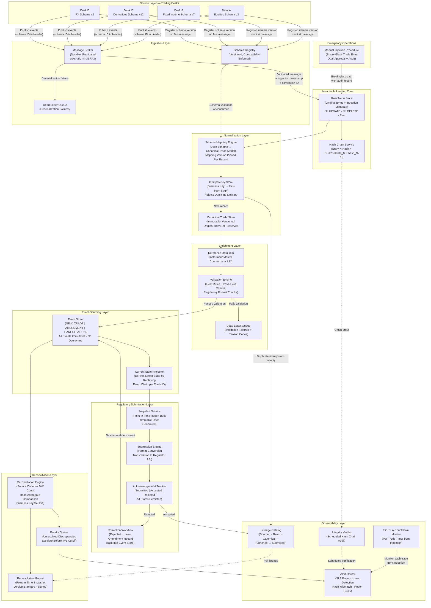

<!-- data-ingestion-patterns: Financial Regulatory Trade Reporting Ingestion -->

# Financial Regulatory Trade Reporting Ingestion

> **Domain:** Financial Services — Regulatory Compliance
> **Difficulty:** Principal / Staff Engineer
> **Category:** Zero-Loss Ingestion · Immutable Audit · Event Sourcing · Reconciliation · Multi-Schema Integration

---

## Problem Statement

Investment banks operate under strict regulatory obligations to report every executed trade to regulators within T+1 (one business day after trade date). The core engineering challenge is not throughput — trade volumes are manageable — but rather the combination of correctness guarantees, auditability requirements, and operational constraints that collectively make this one of the hardest data pipeline classes to build correctly.

The first dimension of difficulty is zero data loss tolerance. Missing a single reportable trade triggers regulatory scrutiny and fines that can reach millions per violation per day. Unlike most data pipelines where occasional late or missing records are acceptable, here a single missed record is a compliance event. This forces every architectural decision — from message broker configuration to storage commitment strategy — toward at-least-once delivery with explicit deduplication, never at-most-once. The pipeline must guarantee that a trade accepted at source will appear in the regulatory submission or generate an explicit exception that humans can act on before the T+1 deadline.

The second dimension is the immutability requirement. Regulators require an audit trail that cannot be modified or deleted by anyone, including system administrators. This eliminates standard UPDATE and DELETE operations from the audit layer entirely and forces an event sourcing model where corrections appear as new amendment or cancellation records, not as overwrites of prior records. Simultaneously, the data warehouse must prove it matches the source exactly — a reconciliation framework must account for every source record and explain any discrepancy. Add to this that multiple legacy trading desks each use different schemas evolved over decades, and the canonical trade model normalization layer must absorb all structural variation without losing fidelity. The operational consequence of getting this wrong is not a degraded user experience but a regulatory fine and potential license revocation.

---

## Clarifying Questions

### Volume and SLA Scoping
1. What is the average daily trade count across all desks, and what is the peak intraday rate (trades per second)? This determines whether the pipeline needs to handle microsecond-level throughput or whether the constraint is purely correctness at moderate volume.
2. What is the exact T+1 deadline clock — end of business day in which timezone, and does T+1 mean calendar day or business day? Does the regulator accept batched end-of-day submissions or require near-real-time streaming reports?
3. For the T+1 SLA, when does the countdown start — trade execution timestamp, trade confirmation timestamp, or when the source system writes the record to its database?

### Source Systems and Schema Variation
4. How many distinct trading desk source systems are there, and do they use push (emit events) or pull (we poll) integration? What latency can we expect from trade execution to record availability in the source system?
5. What is the overlap and divergence in the canonical fields across desk schemas — are the differences in field names only, or are there semantic differences (e.g., different notional calculation conventions, different instrument identifier schemes like ISIN vs CUSIP vs internal codes)?
6. Are source systems capable of emitting change events (inserts, updates, deletes) with a sequence number or LSN, or do we poll for new and modified records by timestamp? What is the source system's SLA for delivering a trade event to us after execution?

### Regulatory Submission Mechanics
7. Does the regulator accept amendments and cancellations to previously submitted reports, and what is the window within which corrections can be filed without penalty? Is there a maximum number of amendments per original report?
8. Does the regulator expose a synchronous API that acknowledges receipt, or is it asynchronous with a separate confirmation feed? How do we detect if a submission was received but rejected for content errors (wrong instrument code, missing field)?
9. Are there multiple regulatory bodies to report to (domestic + cross-border), and do they require different formats or subsets of trade data from the same source record?

### Audit and Reconciliation Expectations
10. What is the audit trail retention requirement in years, and does the immutability requirement extend to the raw landing zone or only to the submitted regulatory records? Does legal require the ability to reproduce the exact bytes submitted to the regulator on any historical date?
11. For the reconciliation report, what counts as a match — exact byte equivalence, business key match with value equivalence, or approximate match within tolerance for floating-point fields? Who consumes the reconciliation report — internal risk operations, external auditors, or regulators directly?
12. What is the acceptable latency between a trade being executed and it appearing in the reconciliation report? Is reconciliation a batch end-of-day process, or does the risk function require intraday reconciliation snapshots?

---

## Hard Constraints

- **Zero data loss:** Every record accepted from a source system must appear in the regulatory submission or in an explicit, human-reviewed exception queue before the T+1 deadline. Silent drops are not acceptable under any failure scenario.
- **Append-only audit storage:** No UPDATE or DELETE operations are permitted on any record in the audit landing zone or the immutable regulatory submission store. Corrections are expressed as new records with a reference to the original record identifier and an amendment type code.
- **Immutability enforcement at storage layer:** The raw landing zone and the submitted-records store must use storage-layer immutability (write-once, read-many policy locks or equivalent) that prevents deletion even by infrastructure administrators. Application-level soft-delete is not sufficient.
- **Idempotent ingestion:** Every record must carry a globally unique, source-assigned business key. Re-delivery of the same record (due to retry, replay, or disaster recovery) must produce exactly one record in the canonical store. Deduplication is mandatory.
- **Amendments are new records:** When a trade is amended or cancelled, the amendment is ingested as a new event with its own sequence number, referencing the original trade identifier. The original record is never modified. The current state of any trade is derived by replaying the event sequence.
- **Canonical trade model:** All desk-specific schemas are normalized to a single canonical trade model at ingestion time. The raw original record is preserved alongside the normalized record. Schema mapping logic is version-controlled and auditable.
- **Reconciliation proof:** The pipeline must produce a daily reconciliation report that proves the data warehouse row count, business key set, and field-level hash aggregate match the source system exactly. Any discrepancy must be flagged before the T+1 submission deadline.
- **T+1 SLA monitoring:** The pipeline must maintain a real-time countdown per unprocessed trade from ingestion timestamp to T+1 deadline. Trades approaching the deadline without reaching submission-ready state must trigger escalating alerts.
- **Cryptographic chain integrity:** The audit log must implement a cryptographic hash chain so that any tampering with historical records is mathematically detectable. This must be verifiable on demand without requiring distributed consensus infrastructure.
- **Schema compatibility enforcement:** Any change to a source desk schema must be caught at the registry boundary before it can silently corrupt downstream normalization. Schema registration rejects breaking changes; all new schema versions require backward compatibility validation.
- **Correlation ID propagation:** Every trade event is assigned a correlation ID at the moment it enters the pipeline. That ID propagates through every transformation, enrichment, and submission step and appears in all logs, metrics, and audit records for that event.

---

## Architecture Diagram

---

## Solution Design

### Layer 1: Source Integration and Schema Registry

Each trading desk is treated as an independent schema domain. The schema registry is the single enforcement gate between source variability and downstream stability. Every desk registers its schema before the first message is accepted. The registry enforces backward compatibility by default — new schema versions may add fields with defaults but may not remove fields or change types in ways that break existing consumers. The compatibility mode for all regulatory topics is set to FULL_TRANSITIVE: every new schema version must be compatible with all prior versions in both directions, not just the immediately preceding version.

The ingestion layer assigns a correlation ID to every incoming message at the moment of first receipt. This ID is immutable and propagates through every subsequent system. The ingestion timestamp (wall clock, synchronized to authoritative time source within 50 milliseconds) is recorded at this point. Neither the correlation ID nor the ingestion timestamp can be altered by any downstream process.

Message broker topics for trade events are configured with replication factor of at least three, minimum in-sync replicas of three, and producer acknowledgement mode requiring all in-sync replicas to confirm before the producer receives success. This eliminates the possibility of a message being acknowledged to the source but lost before it reaches durable storage. Idempotent producers are enabled at the broker level to prevent duplicate writes caused by producer retries on network timeout.

Dead letter queues are mandatory for every consumer. A message that fails schema validation or deserialization is not retried indefinitely; it is routed to the DLQ with the original payload, the error type, the schema ID attempted, and the correlation ID. DLQ records trigger an immediate alert and are counted against the T+1 SLA clock. An unresolved DLQ record is a potential missed trade.

### Layer 2: Immutable Raw Landing Zone

The raw landing zone is the system of record for every byte that entered the pipeline. It is structured as an append-only log: records are written once and never modified or deleted. The storage layer enforces this through a policy lock (write-once, read-many) at the object or block level, not at the application level. System administrators cannot delete records during the policy lock retention period. This satisfies the regulatory requirement for an audit trail that cannot be altered after the fact.

Each record written to the raw landing zone carries: the original payload bytes, the source desk identifier, the schema registry ID at time of ingest, the ingestion timestamp, the correlation ID, a SHA-256 hash of the payload bytes, and a sequence number within the topic partition. The hash of the payload bytes is computed at ingestion, before any transformation.

The hash chain service links each landing zone record to the previous record in sequence: `hash_chain_N = SHA256(payload_hash_N + hash_chain_{N-1})`. The current chain head hash is checkpointed to a separately controlled, air-gapped store at regular intervals. Any insertion, modification, or deletion in the landing zone will cause hash chain verification to fail at the point of tampering and all subsequent entries. This provides mathematical proof of non-tampering without blockchain infrastructure and without any performance overhead during normal write operations. Verification runs as a scheduled job, not inline with writes.

Retention on the raw landing zone is set to the maximum required by any applicable regulation across all reporting jurisdictions. For a broker-dealer also subject to commodity trading regulations and operating in EU markets, this is effectively seven years, and the immutability policy is set accordingly.

### Layer 3: Schema Normalization to Canonical Trade Model

The canonical trade model is the single common schema to which all desk-specific schemas are normalized. It is defined as a versioned schema in the registry and changes to it follow the same compatibility rules as source schemas. The canonical model contains a superset of fields across all desks plus a section for desk-specific extension fields that do not map to canonical fields.

Each desk has a versioned schema mapping definition — a declarative specification that maps source fields to canonical fields, including any transformation rules (unit conversions, identifier scheme translations, date format normalization). The schema mapping definition is version-controlled alongside the pipeline code. Every canonical record carries a reference to the mapping version used to produce it. This is critical: if a mapping bug is discovered, the exact population of records produced by the buggy mapping version can be identified and reprocessed.

Before writing a canonical record, the idempotency store is checked against the business key (source desk + trade identifier + trade version number). If the business key has been seen before, the new delivery is a duplicate and is logged with the correlation ID but not written again. This handles the case of source system replay, message broker redelivery on consumer restart, and disaster recovery reprocessing.

The raw original record reference (landing zone sequence number and partition key) is embedded in every canonical record. Given any canonical record, the exact original bytes that produced it can be retrieved from the immutable landing zone.

### Layer 4: Enrichment and Validation

Enrichment joins canonical trade records against reference data: instrument master (legal identifiers, asset class, trading venue), counterparty master (legal entity identifier, jurisdiction, client classification), and any other lookup data required by the regulatory format. Reference data joins are performed against point-in-time snapshots keyed to the trade date, not current reference data. Instrument attributes can change over time; regulatory reports must reflect what the instrument was on the trade date, not what it is today.

Validation applies both field-level rules (non-null required fields, enumeration value constraints, numeric range checks) and cross-field rules (notional calculation consistency, valid instrument-counterparty combinations, settlement date logic). Validation rules are expressed as version-controlled policy code, not hardcoded conditionals. The validation version is recorded on every record. A trade that fails validation is routed to the validation DLQ with the full set of failure reasons, not just the first failure. The original record is preserved. The alert triggers the T+1 SLA clock for manual review.

A separate regulatory format pre-check validates that the enriched, validated canonical record can be serialized into the exact format the regulator's submission API expects. This check runs at the end of the enrichment layer, before the event is committed to the event store. Catching format errors here rather than at submission time preserves the T+1 window for correction.

### Layer 5: Event Sourcing for Trade Lifecycle Management

The event store holds three event types only: `NEW_TRADE`, `AMENDMENT`, and `CANCELLATION`. No other event types exist. No record in the event store is ever modified or deleted.

A `NEW_TRADE` event represents the original trade report. An `AMENDMENT` event represents a correction to a previously submitted report. It carries: the original trade identifier, the amendment sequence number (1 for first amendment, 2 for second, etc.), the fields being amended with their new values, the reason code for the amendment, and the timestamp of the amendment. A `CANCELLATION` event represents the withdrawal of a previously submitted report. It carries: the original trade identifier, the cancellation sequence number, and the reason code.

The current state projector derives the current reportable state of any trade by replaying all events for that trade identifier in sequence number order. This derived projection is a view, not the system of record. If the projection store is lost, it can be rebuilt entirely from the event store. The event store is the truth; the projection is a performance optimization.

Point-in-time queries are supported: given a trade identifier and a timestamp, the projector replays only events that occurred before that timestamp, producing the state of the record as it existed at that moment. This is essential for regulatory examinations that ask "what did you know about trade X on date Y?"

### Layer 6: Reconciliation Framework

Reconciliation runs on a schedule that ensures completion before the T+1 deadline. For T+1 deadlines at end of business day, reconciliation must complete by mid-afternoon to allow time for break investigation and resolution.

The reconciliation framework operates at three levels of granularity:

**Level 1 — Count reconciliation:** The total number of records in the source system for the reporting period must equal the total number of records in the canonical store. Any discrepancy triggers a Level 2 investigation immediately.

**Level 2 — Business key set reconciliation:** The set of trade identifiers in the source system is compared to the set in the canonical store using a hash of the sorted business key list. This detects both missing records (in DW but not source) and phantom records (in DW but not source) in a single operation without transmitting the full key list. For any discrepancy, the symmetric difference is computed to identify the specific missing or extra keys.

**Level 3 — Field-level hash reconciliation:** For every record in both systems, a hash is computed over the set of reportable fields (not all fields — only those that appear in the regulatory submission). The aggregate hash of all record-level hashes is compared between source and canonical store. A mismatch at the aggregate level triggers record-by-record comparison using a binary search over sorted hash lists to identify the specific divergent records efficiently.

Reconciliation results are written as immutable point-in-time snapshots with a version stamp and a cryptographic signature. The signature is produced using a key controlled by the risk operations team, not the data engineering team. This ensures that reconciliation reports cannot be produced retroactively or altered after review.

Breaks — records that appear in the source but not in the DW, or records with divergent field values — are written to the breaks queue. Each break record carries the trade identifier, the break type, the field-level diff if available, and the T+1 deadline timestamp for that trade. Breaks are assigned to analysts by severity and deadline urgency.

### Layer 7: Regulatory Submission and Acknowledgement Tracking

The snapshot service builds the regulatory submission package from the current state projection at a specific point in time. Once built, the snapshot is immutable: the exact bytes that were submitted to the regulator are stored in the immutable landing zone alongside the submission timestamp, submission version, and a hash of the package. If the regulator later claims a different record was submitted, the stored hash provides cryptographic proof.

Submission state for every trade follows a defined state machine: `PENDING_SUBMISSION` → `SUBMITTED` → `ACCEPTED` or `REJECTED`. State transitions are append-only log entries. There is no state that represents an unknown or ambiguous submission status. If the regulator API returns an error at the transport layer (timeout, network failure), the submission is retried with exponential backoff and jitter, using idempotency keys to prevent double submission. If the API confirms submission but the response is lost (the classic dual-write problem), the idempotency key prevents a second submission from creating a duplicate report.

Rejected submissions enter the correction workflow. The rejection reason is stored with the original submission record. A new `AMENDMENT` event is created in the event store, the corrected record flows through validation again, and a new submission package is generated. The original submission record is never modified.

The acknowledgement tracker maintains the full submission history for every trade identifier: every submission attempt, every response (success, failure, rejection, timeout), and every correction. This history is queryable by the operations team and is included in the lineage record for regulatory examination.

### Layer 8: T+1 SLA Monitoring

Every trade carries two timestamps in the monitoring system: the ingestion timestamp (when it entered the pipeline) and the T+1 deadline timestamp (calculated from the trade date per the applicable regulatory calendar). The difference between these is the available processing window.

The SLA monitor evaluates every unsubmitted trade continuously against its deadline. Alerts escalate in tiers: 
- 4 hours before deadline: notification to the data engineering on-call
- 2 hours before deadline: escalation to the compliance operations team
- 1 hour before deadline: escalation to the head of compliance and the chief data officer
- 30 minutes before deadline: incident declared, emergency procedures activated

Each alert includes the trade identifier, desk, current pipeline stage, time remaining, and the last known error if the trade is stuck.

### Layer 9: Emergency Manual Injection Procedure

For scenarios where a trade executed but was not captured by any source system (system outage, network partition, trading desk manual trade entry), a break-glass procedure exists for manual trade injection. This procedure requires:

1. Dual approval from two named officers (compliance officer + desk head) with a written justification
2. Manual entry via a secured, separately authenticated injection interface — not the normal ingestion pipeline
3. The injected record carries a `MANUAL_INJECTION` flag, the approver identities, the approval timestamps, and a reference to the justification document
4. The injected record follows the same immutable landing zone path as any other record: it is written once, hashed, chain-linked, and cannot be modified afterward
5. A separate mandatory reconciliation run triggers immediately after injection to verify the record's presence in all downstream stores
6. The break-glass event itself is logged in the audit trail with the same immutability guarantees as any other event

Manual injection is auditable, traceable, and subject to the same zero-modification rules as every other record. The existence of the manual injection procedure does not weaken the integrity guarantees; it strengthens them by providing a controlled alternative to unaudited workarounds.

---

## Trade-offs

| Decision | Option A | Option B | Recommendation | Why |
|---|---|---|---|---|
| **Delivery guarantee model** | Exactly-once semantics (EOS) via distributed transactions | At-least-once with idempotency-key deduplication | At-least-once + dedup | EOS adds significant complexity, reduces throughput, and has subtle failure modes when spanning the message broker and external systems. At-least-once with a durable idempotency store is simpler to reason about, easier to operate, and achieves the same correctness outcome for this workload. |
| **Amendment handling** | Update original record in place; maintain version history separately | Append new amendment event; derive current state via event replay | Event sourcing (append-only) | Regulators require the ability to reconstruct the exact record that was submitted at any prior point in time. Event sourcing provides this natively. In-place updates with separate history tables are operationally fragile and create divergence risk between the history and the primary record. |
| **Schema normalization timing** | Normalize at ingestion before landing in raw store | Preserve raw bytes in landing zone; normalize in a separate downstream step | Normalize downstream; preserve raw | The raw landing zone must preserve original bytes for audit purposes. Normalizing at ingestion would discard the original representation. Separating concerns also means a mapping bug can be corrected and the raw data reprocessed without any gap in the audit trail. |
| **Reconciliation frequency** | Batch once per day at end of trading session | Continuous intraday micro-batch reconciliation | Intraday micro-batch (hourly minimum) | End-of-day reconciliation discovered at 4pm leaves insufficient time to investigate and resolve breaks before a T+1 deadline that may be 5pm. Intraday reconciliation surfaces breaks when time to act is still available. The additional compute cost is negligible relative to the fine exposure from a late correction. |
| **Immutability enforcement** | Application-level soft-delete flags; no physical deletion | Storage-layer policy lock (write-once, read-many at object/block level) | Storage-layer policy lock | Application-level controls are defeated by direct storage access, administrative override, or software bugs. Storage-layer immutability is enforced by the infrastructure and survives application compromise. Regulators explicitly require that records cannot be altered or deleted — this requires enforcement below the application layer. |
| **Correction report format** | Send full amended record to regulator, replacing original | Send delta (changed fields only) with reference to original submission | Full amended record | Delta formats reduce payload size but require the regulator to apply the delta correctly, creating dependency on regulator-side state consistency. Sending the full corrected record is idempotent from the regulator's perspective and eliminates ambiguity about what the corrected submission contains. |
| **Reference data join timing** | Join at ingestion using current reference data | Join at submission time using point-in-time reference data snapshot | Point-in-time snapshot at submission | Instrument attributes (classification, eligible trading venue) can change between trade date and report date. Regulatory submissions must reflect attributes as of trade date. Point-in-time reference data snapshots stored alongside the trade record ensure the submission is reproducible and defensible. |

---

## Failure Modes and Recovery

| Failure Scenario | Detection Method | Recovery Strategy |
|---|---|---|
| **Source system fails to deliver trade** | T+1 SLA monitor detects no ingestion event for a known trade (detected via reconciliation Level 2 — key set diff); or source system health check fails | Source system team is alerted immediately. If trade data is recoverable from source, normal ingestion path is used. If source is unrecoverable before T+1, emergency manual injection procedure is activated with dual approval. The DLQ and reconciliation report document the gap. |
| **Message broker partition failure (records in flight lost)** | Consumer lag monitor shows zero progress on affected partition; at-rest record count diverges from source count | Because producer `acks=all` with `min.ISR=3` is required, a partition failure should result in producer write rejection, not silent loss. The producer exception is caught and the source system is alerted to retry. If records were already acknowledged before the failure, the broker replication protocol ensures recovery from remaining replicas. Investigate any gap in the reconciliation count. |
| **Schema breaking change deployed to source without registry enforcement** | Schema registry rejects registration; DLQ receives deserialization failures for messages using unregistered schema version; consumer group lag spikes | Deserialized failures route to DLQ with original bytes preserved. Source system team reverts the schema change or registers a compatible version. DLQ messages are reprocessed once compatible schema is available. No records are lost; all affected records are traceable via correlation ID. |
| **Hash chain integrity check fails** | Scheduled integrity verifier reports hash mismatch at sequence position N | Immediately freeze all writes to the affected landing zone partition. Preserve the current state for forensic investigation. Compare the stored checkpoint hash with the recomputed hash from the last verified checkpoint to narrow the tampered range. Activate incident response. Report to legal and compliance. Do not attempt to repair the chain; the evidence of tampering must be preserved. |
| **Regulator API unavailable at submission deadline** | Submission engine receives HTTP 5xx or timeout; acknowledgement tracker shows no `SUBMITTED` state transitions within expected window | Submission engine retries with exponential backoff up to a configured maximum. If the API remains unavailable past a threshold, escalate to compliance operations who initiate regulator-side contact for deadline extension or alternative submission channel. All retry attempts are logged with timestamps. When the API recovers, submission proceeds; idempotency keys prevent duplicate reports. |
| **Reconciliation break discovered 1 hour before T+1 deadline** | Reconciliation engine Level 2 or Level 3 check produces non-empty break set; T+1 monitor shows less than 60 minutes remaining | Immediate escalation per SLA tier. Break records are triaged by trade count and potential fine exposure. For records still in the pipeline (validation DLQ or enrichment DLQ), fast-path review and reprocessing begins. For records missing from the pipeline entirely, manual injection procedure is activated in parallel. Compliance documents the investigation timeline regardless of outcome. |
| **Canonical normalization mapping produces incorrect output (mapping bug)** | Post-deployment data quality check compares canonical fields against expected values; or reconciliation Level 3 hash mismatch; or regulatory rejection for invalid field content | All canonical records produced by the affected mapping version are identified using the mapping version field embedded in every record. These records are flagged and reprocessed through the corrected mapping version. Because the raw landing zone preserves original bytes, reprocessing is deterministic and produces no audit gap. Amendment events are generated for any records already submitted to the regulator. |
| **Duplicate trade delivered by source system after restart** | Idempotency store returns existing sequence number for incoming business key; deduplication counter increments | Duplicate is rejected at the idempotency check without writing to the canonical store. The rejection is logged with the correlation ID of both the original and duplicate message. The T+1 clock is not reset; the original ingestion timestamp remains authoritative. No action required unless the supposed duplicate is actually a legitimate amendment with the same trade identifier but different version number — in which case the version number must be distinct. |

---

## Observability Checklist

### Ingestion Health
- **Trade ingest rate** per desk per minute — alert on zero rate during trading hours for any desk
- **DLQ depth** per topic — alert on any non-zero DLQ depth; DLQ records are potential missed trades
- **Schema registry rejection rate** — alert on any rejection; indicates a source system deployed a breaking schema change
- **Consumer group lag** per topic partition — sustained lag means the pipeline is falling behind real-time
- **Producer acknowledgement failure rate** — any unacknowledged message is a potential loss event

### T+1 SLA Monitoring
- **Trades in pipeline by time-to-deadline bucket**: >4h, 2-4h, 1-2h, <1h
- **Count of trades not yet in submission-ready state** at each deadline tier
- **Mean and P99 end-to-end latency** from ingestion to submission-ready state, by desk
- **Manual injection events** per day — any non-zero value triggers a post-incident review
- **Alert escalation count** by tier per trading day

### Reconciliation and Correctness
- **Reconciliation Level 1 delta** (count mismatch) — must be zero at T+1 cutoff
- **Reconciliation Level 2 delta** (key set mismatch count) — must be zero at T+1 cutoff
- **Reconciliation Level 3 hash mismatch count** — must be zero at T+1 cutoff
- **Break queue depth and age** — break records older than 2 hours before T+1 deadline trigger escalation
- **Deduplication rejection rate** — spike indicates source system replay or upstream system issue

### Immutability and Audit Integrity
- **Hash chain verification status** (pass/fail) per landing zone partition — alert on any failure immediately
- **Time since last successful hash chain verification** — alert if verification has not run within the scheduled window
- **Checkpoint anchor write success rate** — alert on failure; checkpoint anchors are the recovery point for integrity verification
- **Storage policy lock expiration warnings** — alert 90 days before any immutability policy approaches expiration (retention period ending)

### Submission and Acknowledgement
- **Submission success rate** — regulatory rejections vs acceptances; non-zero rejection rate requires investigation
- **Time-to-acknowledgement** from submission to regulator confirmation — anomalies indicate regulator API issues
- **Correction report count** per trading day — trend upward indicates upstream data quality degradation
- **Open rejections** (submitted but not yet corrected) approaching deadline — immediate alert

### Schema Evolution
- **Active schema version per desk** — alert when a desk is producing messages on a version more than one major version behind current canonical
- **Schema compatibility check failure rate** in CI pipeline
- **Consumer groups reading deprecated schema versions** — track and drive to zero before sunset date

---

## Interview Answer Template

### Constraint-Elimination Technique

When asked about financial regulatory ingestion in an interview, use this structure to demonstrate systematic engineering reasoning:

**Step 1 — Anchor on the non-negotiables (30 seconds)**

"The first thing I do is separate the constraints from the design choices. In regulatory trade reporting, three constraints are non-negotiable: zero data loss, immutability of the audit record, and T+1 deadline adherence. Everything else is a design choice. Zero loss means at-least-once delivery with explicit deduplication — never at-most-once. Immutability means event sourcing and append-only storage at the infrastructure layer, not the application layer. T+1 means every trade has a countdown clock from ingestion, and the pipeline is designed around that deadline, not around batch convenience."

**Step 2 — Eliminate the wrong abstractions early (30 seconds)**

"The second thing I eliminate is the UPDATE pattern. In a standard data warehouse, amendments mean updating a row. In regulatory pipelines, amendments are new events. The original record is never touched. This is not a preference — regulators require the ability to reconstruct what was submitted at any point in history, and UPDATE-based models cannot provide that reliably. Once you accept event sourcing as a constraint, the rest of the architecture follows logically."

**Step 3 — Layer the architecture (90 seconds)**

"The architecture has eight layers: source integration with schema registry enforcement, immutable raw landing zone with hash chain integrity, canonical normalization that preserves the original bytes, enrichment with point-in-time reference data, an event store for trade lifecycle events, a reconciliation framework that runs intraday, a submission layer with full acknowledgement tracking, and an observability layer with T+1 countdown monitoring per trade. The critical insight is that each layer has a single responsibility and produces an immutable artifact. If anything goes wrong, you can reconstruct from any prior layer."

**Step 4 — Address the failure scenarios proactively (30 seconds)**

"The interviewer will ask about failure. The three I lead with are: source system drops a trade before it reaches the broker — detected by reconciliation Level 2 key set comparison, recovered via manual injection with dual approval and full audit trail. Schema breaking change deployed silently — caught by schema registry compatibility enforcement before it reaches production, with DLQ preservation of affected messages. Hash chain tampering — detected by scheduled integrity verification, responded to by freezing the partition and triggering incident response rather than attempting repair."

**Step 5 — Close with the governance layer (20 seconds)**

"The governance layer ties everything together: a lineage catalog that traces every record from source bytes to regulatory submission, policy-as-code for validation rules and retention periods, and a reconciliation report that is itself an immutable, signed artifact. This is what you present to regulators during examination — not a dashboard, but a signed, reproducible proof that the data warehouse matches the source exactly."
