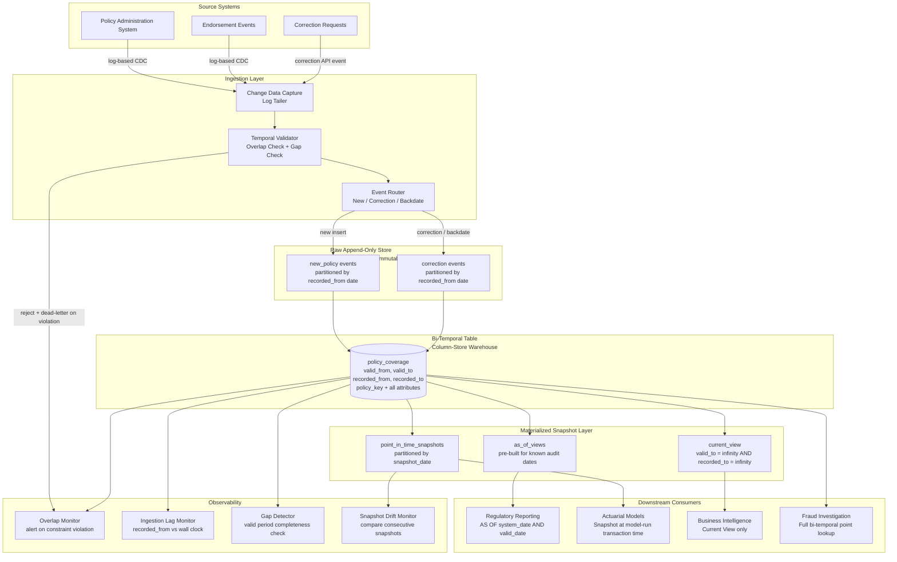

<!-- data-ingestion-patterns: 13 — Bi-Temporal Ingestion for Insurance Policy Data -->

# 13 — Bi-Temporal Ingestion for Insurance Policy Data


---

## Problem Statement

Insurance policy administration produces one of the most temporally complex data challenges in enterprise data engineering. A policy might be written today with an effective date six months in the past, then corrected three times over the next two years as underwriting errors surface, and finally audited by a regulator who demands to know exactly what your system showed on a specific date in 2022. No single timestamp captures this reality. A naive `updated_at` column tells you when a row was last touched, but not when the insured event was actually in force, and not what any historical system snapshot looked like before the correction arrived.

The core difficulty is that two independent notions of time are orthogonal and must be tracked separately. **Valid time** is the real-world assertion period — when the policy was actually in force in the physical world, independent of when anyone recorded that fact. **Transaction time** is the system-recorded observation period — when your warehouse first knew about a fact and when it stopped believing it. A correction backdated two years ago changes valid time without altering prior transaction time history. The system knew what it knew when it knew it; that record is immutable. What changed is the real-world assertion, not the historical system belief. Conflating these two axes is not merely an academic error: it produces regulatory reports that cannot be defended under audit, actuarial models that produce different results when re-run against the same historical period, and fraud investigations that cannot reconstruct the information environment at the time of a suspicious event.

The operational challenge compounds the conceptual one. Insurance data volumes are large, correction rates are high (policy endorsements, premium adjustments, and retroactive reclassifications are routine business events, not exceptions), and downstream consumers have contradictory requirements. Regulatory consumers need a point-in-time snapshot of what the system asserted on a specific past date. Actuarial consumers need guaranteed reproducibility — the same model run against last quarter's data must produce byte-identical results regardless of how many corrections have arrived since. Business intelligence consumers need the current best understanding of what is true in the world right now. A single table design with a single timestamp satisfies none of these three simultaneously.

---

## Clarifying Questions

### Data Characteristics

1. **Correction frequency and depth**: What percentage of policies receive retroactive corrections per month, and how far back in time do corrections typically reach? A 2% monthly correction rate with a 90-day lookback has very different storage and query implications than a 0.1% rate with a 7-year lookback mandated by regulatory retention policy.

2. **Source system trust model**: Does the source policy administration system provide explicit valid-time boundaries (`effective_date`, `expiry_date`) on every record, or must valid time be inferred from event sequencing? If inferred, what is the key-ordering guarantee — can two events for the same policy arrive out of order?

3. **Event types**: Beyond simple corrections, does the pipeline need to handle policy reinstatements (a lapsed policy made active again for a past period), rescissions (a policy declared to have never existed), and partial-period corrections (a premium change that applies only to a sub-interval of an existing row's valid period)?

### Regulatory and Compliance

4. **Audit date range and granularity**: What is the earliest date a regulator could demand an AS-OF snapshot, and what granularity — end-of-day, end-of-quarter, or arbitrary intra-day? Intra-day AS-OF snapshots with high correction volumes require transaction time stored at microsecond precision, not daily granularity.

5. **Regulatory immutability requirement**: Must the raw ingestion layer produce a record that is provably unmodified after initial write, satisfying an external audit without relying on internal attestation? This determines whether append-only object storage is a compliance requirement or merely an optimization.

6. **Retention horizons per data class**: Premium data, claims data, and actuarial assumption data frequently have different mandated retention periods under insurance regulation. Does the schema design need to support per-column or per-partition retention policies with hard deletion of expired data while preserving the temporal spine?

### Actuarial and Modeling

7. **Snapshot reproducibility contract**: When the actuarial team says "re-run the Q3 model against Q3 data," what exactly must be frozen? Only the policy dimension, or also the claims loss triangle, reinsurance treaties, and actuarial assumption tables? Each of these is a separate temporal entity that may have received corrections. The scope of the reproducibility guarantee determines how many tables need full bi-temporal tracking.

8. **Model run cadence and lag**: How long after quarter-end does the actuarial team typically finalize the data extract for a model run? If corrections are still arriving 45 days after quarter-end when the model runs, the snapshot must capture transaction time as of the model run date, not as of quarter-end.

### Ingestion Architecture

9. **Source CDC reliability**: Does the source system publish a reliable change log with before/after images and a monotonic sequence number, or does the pipeline receive periodic full dumps that must be differenced? Full-dump differencing can fail silently when two changes cancel each other out within a single dump interval.

10. **Backfill depth for initial load**: On first deployment, must the pipeline backfill 7 years of policy history with bi-temporal semantics, or is a cutover approach acceptable where pre-deployment history is loaded with a single synthetic transaction-time timestamp? The backfill approach is more expensive but required if regulators can request pre-deployment AS-OF queries.

### Operations and SLAs

11. **Downstream consumer isolation**: Can the actuarial snapshot materialization job tolerate reading from a table that is simultaneously receiving inbound corrections, or must the pipeline provide snapshot isolation guarantees that prevent the materialization job from seeing a partially-applied correction batch?

12. **Recovery time objective for temporal inconsistency**: If a bug in the ingestion pipeline produces overlapping valid-time periods for a policy, what is the acceptable window for detection and repair? This determines whether overlap detection must block the inbound write (synchronous constraint) or can be a deferred reconciliation job (asynchronous alert).

---

## Hard Constraints

- **Immutability of transaction time**: Once a row is written with a `recorded_from` timestamp, that value is never modified. Corrections create new rows; they do not alter existing ones. This is the non-negotiable invariant that makes AS-OF queries trustworthy.
- **No overlapping valid periods for the same entity key**: At any point in transaction time, the set of rows for a given policy key with an active `recorded_to = 'infinity'` must have non-overlapping valid-time intervals. The constraint must be enforced at write time, not deferred.
- **Valid time must be sourced from the business system**: `valid_from` and `valid_to` must reflect the business assertion from the source system, never inferred from pipeline processing time. Processing timestamp belongs only to transaction time columns.
- **Correction must not alter prior transaction-time history**: A retroactive correction that changes valid time for a policy for a past period must close the old row (set `recorded_to` to the correction's ingestion timestamp) and insert a new row. The old row survives permanently as the historical belief record.
- **Snapshot materialization must be idempotent and deterministic**: Given the same transaction-time cutoff and valid-time range as inputs, the snapshot job must produce byte-identical output regardless of when it runs or how many subsequent corrections have arrived.
- **All timestamps stored as UTC**: No local timezone storage anywhere in the temporal columns. Timezone metadata stored separately as a descriptor column if needed for display.
- **Partition strategy must support both time axes**: The physical table must be partitionable in a way that allows efficient pruning on both `recorded_from` (for AS-OF queries against a past system state) and `valid_from` (for queries against a past real-world period). These are conflicting partition keys and require explicit design.
- **Audit log must survive the policy itself**: If a policy is cancelled or rescinded, its entire bi-temporal history must be retained for the full regulatory retention period. Hard deletion of cancelled policy rows is not permitted during the retention window.

---

## Architecture Diagram



---

## Solution Design

### 1. The Two Time Axes: Precise Definitions with Insurance Examples

**Valid Time** is the period during which a fact is asserted to be true in the real world, independent of when any system recorded it. Valid time is a business-domain claim. It can be set in the past (backdating) or the future (forward-dating), and it can be corrected retroactively.

> Example: Policy P-1001 was issued with an effective date of January 1, 2023. The policy administration system recorded this fact on January 15, 2023. The valid time of the policy coverage starts January 1, 2023, two weeks before the system knew about it. If an underwriter later discovers the policy should have been rated in a different territory and corrects it on March 1, 2025, the valid time of the corrected record still spans January 1, 2023 — the coverage period does not move. Only the attributes (territory, premium) change.

**Transaction Time** (also called system time or recorded time) is the period during which the warehouse believed a particular row to represent ground truth. Transaction time is a system-domain fact. It is always set by the pipeline at the moment of ingestion, never by the source system. It is never modified after write. When a correction arrives, the old row's transaction time is closed (its `recorded_to` is set to the correction's ingestion timestamp) and a new row is inserted with a fresh `recorded_from`. The old row persists forever.

> Example: The original policy P-1001 row was ingested on January 15, 2023 (`recorded_from = 2023-01-15`). The warehouse believed this row was correct until March 1, 2025, when the correction arrived and the row was closed (`recorded_to = 2025-03-01`). A new corrected row was inserted with `recorded_from = 2025-03-01` and `recorded_to = infinity`. If a regulator asks "what did your system show for policy P-1001 on July 4, 2024," the query must return the original uncorrected row, because that row's transaction time window covers July 4, 2024. The correction had not yet arrived.

**Why both axes are required for insurance:**

- Valid time alone lets you answer "what coverage was in force on date X" but cannot answer "what did we report to the regulator on date Y" if corrections arrived between X and Y.
- Transaction time alone lets you answer "what did our system believe on date Y" but cannot reconstruct the real-world effective periods correctly, because transaction time does not reflect the business-asserted validity window.
- Only bi-temporal modeling answers: "What did our system believe, as of the regulatory audit date, about the coverage that was in force during the loss event?"

---

### 2. Bi-Temporal Table Schema

```sql
-- Core bi-temporal fact table for insurance policy coverage
CREATE TABLE policy_coverage (

    -- Surrogate key for the specific bi-temporal row version
    -- Never exposed to business users; used only for row-level audit trail
    row_id              BIGINT          NOT NULL,

    -- Natural business key — stable across all versions and corrections
    policy_key          VARCHAR(64)     NOT NULL,

    -- ---------------------------------------------------------------
    -- VALID TIME AXIS
    -- Business-asserted: when the coverage was in force in the world
    -- Set by source system, never by the pipeline
    -- Can be backdated; can be corrected retroactively
    -- ---------------------------------------------------------------
    valid_from          TIMESTAMP WITH TIME ZONE    NOT NULL,
    valid_to            TIMESTAMP WITH TIME ZONE    NOT NULL,
    -- Sentinel: valid_to = '9999-12-31 23:59:59+00' means open-ended

    -- ---------------------------------------------------------------
    -- TRANSACTION TIME AXIS
    -- System-recorded: when the warehouse believed this row was true
    -- Set by the ingestion pipeline at write time, never by source
    -- Immutable after write — corrections close old rows, never edit them
    -- ---------------------------------------------------------------
    recorded_from       TIMESTAMP WITH TIME ZONE    NOT NULL,
    recorded_to         TIMESTAMP WITH TIME ZONE    NOT NULL,
    -- Sentinel: recorded_to = '9999-12-31 23:59:59+00' means currently believed

    -- ---------------------------------------------------------------
    -- Policy attributes — all business payload
    -- ---------------------------------------------------------------
    insured_name        VARCHAR(256),
    coverage_type       VARCHAR(64),
    territory_code      CHAR(5),
    annual_premium      NUMERIC(18, 4),
    risk_class          VARCHAR(32),
    underwriter_id      VARCHAR(64),
    policy_status       VARCHAR(32),   -- active, lapsed, cancelled, rescinded

    -- ---------------------------------------------------------------
    -- Audit metadata — pipeline-written, never source-provided
    -- ---------------------------------------------------------------
    source_event_id     VARCHAR(128)    NOT NULL,  -- CDC sequence number or event UUID
    ingestion_batch_id  VARCHAR(64)     NOT NULL,  -- pipeline run identifier
    correction_reason   VARCHAR(512),              -- populated on corrections, null on new inserts
    is_correction       BOOLEAN         NOT NULL DEFAULT FALSE,

    -- ---------------------------------------------------------------
    -- Constraints
    -- ---------------------------------------------------------------
    CONSTRAINT pk_policy_coverage PRIMARY KEY (row_id),
    CONSTRAINT chk_valid_period CHECK (valid_to > valid_from),
    CONSTRAINT chk_recorded_period CHECK (recorded_to > recorded_from),
    CONSTRAINT chk_valid_from_utc CHECK (EXTRACT(TIMEZONE FROM valid_from) = 0),
    CONSTRAINT chk_recorded_from_utc CHECK (EXTRACT(TIMEZONE FROM recorded_from) = 0)
);

-- Index for the most common query pattern:
-- "give me the current best-known state for all active policies"
CREATE INDEX idx_current_view
    ON policy_coverage (policy_key, valid_from, valid_to)
    WHERE recorded_to = '9999-12-31 23:59:59+00';

-- Index for AS-OF transaction-time queries (regulatory audit)
CREATE INDEX idx_as_of_recorded
    ON policy_coverage (recorded_from, recorded_to, policy_key);

-- Index for valid-time range scans (actuarial loss period queries)
CREATE INDEX idx_valid_period
    ON policy_coverage (valid_from, valid_to, policy_key);

-- Partial index for active rows only — covers most BI queries
CREATE INDEX idx_active_rows
    ON policy_coverage (policy_key, valid_from)
    WHERE recorded_to = '9999-12-31 23:59:59+00'
      AND valid_to    = '9999-12-31 23:59:59+00';
```

**Schema design rationale:**

The four temporal columns (`valid_from`, `valid_to`, `recorded_from`, `recorded_to`) create a 2D bounding box in time-space for each row. A row is "current truth" only if `recorded_to = infinity` (still believed) and `valid_to = infinity` (still in force in the world). A row describing a past coverage period that has been superseded by a correction will have a finite `recorded_to` but may still have a valid `valid_from`/`valid_to` range — it represents what the system believed about that period before the correction arrived.

The `row_id` surrogate key is intentionally separate from the `policy_key`. Business users should never query by `row_id`. It exists solely so that the correction process can target a specific bi-temporal version when closing it. Using `policy_key` alone as the primary key would prevent storing multiple versions.

---

### 3. Ingestion Pattern: New Policy Record

When a new policy arrives from the source system with no prior history in the warehouse:

```sql
-- Ingestion logic for a new policy record
-- Pipeline receives: policy_key, valid_from, valid_to, all attributes, source_event_id
-- Pipeline generates: row_id, recorded_from = NOW() UTC, recorded_to = infinity

INSERT INTO policy_coverage (
    row_id,
    policy_key,
    valid_from,
    valid_to,
    recorded_from,
    recorded_to,
    insured_name,
    coverage_type,
    territory_code,
    annual_premium,
    risk_class,
    underwriter_id,
    policy_status,
    source_event_id,
    ingestion_batch_id,
    correction_reason,
    is_correction
)
VALUES (
    generate_row_id(),                          -- pipeline-generated surrogate
    'P-1001',
    '2023-01-01 00:00:00+00',                  -- valid_from: from source system
    '9999-12-31 23:59:59+00',                  -- valid_to: open-ended policy
    CURRENT_TIMESTAMP AT TIME ZONE 'UTC',       -- recorded_from: pipeline wall clock
    '9999-12-31 23:59:59+00',                  -- recorded_to: currently believed
    'Acme Manufacturing Co.',
    'COMMERCIAL_GENERAL_LIABILITY',
    'IL-06',
    42500.0000,
    'CLASS_B',
    'UW-007',
    'active',
    'CDC-SEQ-000194827',
    'BATCH-2023-01-15-001',
    NULL,                                       -- not a correction
    FALSE
);

-- Pre-insert validation that must pass before the INSERT executes:
-- 1. No existing row with same policy_key, overlapping valid period,
--    AND recorded_to = infinity (would indicate duplicate or conflict)
-- 2. valid_from and valid_to are valid UTC timestamps
-- 3. source_event_id has not been seen before (idempotency check)
```

**Validation query for overlap check (must return 0 rows before INSERT proceeds):**

```sql
SELECT row_id
FROM   policy_coverage
WHERE  policy_key   = 'P-1001'
  AND  recorded_to  = '9999-12-31 23:59:59+00'   -- currently believed rows only
  AND  valid_from   < '9999-12-31 23:59:59+00'    -- proposed valid_to
  AND  valid_to     > '2023-01-01 00:00:00+00'    -- proposed valid_from
  -- if any row satisfies both conditions, the valid periods overlap
;
```

---

### 4. Ingestion Pattern: Retroactive Correction (Most Complex Case)

A correction arrives on March 1, 2025 stating that policy P-1001, which was originally classified as territory IL-06, was incorrectly classified and should have been territory IL-09 since its inception. The valid period does not change (the policy is still in force since January 1, 2023). Only the attribute value changes.

This is a two-step atomic operation: close the old row by setting its `recorded_to`, then insert the corrected row.

```sql
-- Step 1: Close the superseded row
-- Set recorded_to to the exact moment the correction was ingested
-- This preserves the row as the historical belief record
-- The row is now retrievable for any AS-OF query before 2025-03-01

UPDATE policy_coverage
SET    recorded_to       = '2025-03-01 14:22:17+00',   -- correction ingestion timestamp
       ingestion_batch_id = 'BATCH-2025-03-01-044'      -- update batch for audit
WHERE  policy_key   = 'P-1001'
  AND  valid_from   = '2023-01-01 00:00:00+00'          -- same valid period
  AND  valid_to     = '9999-12-31 23:59:59+00'          -- same valid period
  AND  recorded_to  = '9999-12-31 23:59:59+00'          -- must be currently believed row
;
-- This UPDATE must affect exactly 1 row. If 0 or >1 rows affected, abort and alert.

-- Step 2: Insert the corrected row
-- recorded_from = same timestamp used as recorded_to in Step 1 (no gap, no overlap)
-- valid_from and valid_to are IDENTICAL to the row being superseded
-- Only the business attributes change

INSERT INTO policy_coverage (
    row_id,
    policy_key,
    valid_from,
    valid_to,
    recorded_from,
    recorded_to,
    insured_name,
    coverage_type,
    territory_code,   -- CORRECTED VALUE
    annual_premium,
    risk_class,
    underwriter_id,
    policy_status,
    source_event_id,
    ingestion_batch_id,
    correction_reason,
    is_correction
)
VALUES (
    generate_row_id(),
    'P-1001',
    '2023-01-01 00:00:00+00',                  -- SAME valid_from as superseded row
    '9999-12-31 23:59:59+00',                  -- SAME valid_to as superseded row
    '2025-03-01 14:22:17+00',                  -- recorded_from: same as Step 1 recorded_to
    '9999-12-31 23:59:59+00',                  -- recorded_to: now current
    'Acme Manufacturing Co.',
    'COMMERCIAL_GENERAL_LIABILITY',
    'IL-09',                                    -- CORRECTED: was IL-06
    42500.0000,
    'CLASS_B',
    'UW-007',
    'active',
    'COR-EVENT-000847261',
    'BATCH-2025-03-01-044',
    'Territory reclassification — original underwriting error, ref ticket UW-2025-0312',
    TRUE                                        -- flagged as correction
);
```

**Critical invariant**: The `recorded_to` value in Step 1 and the `recorded_from` value in Step 2 must be identical to the microsecond. This ensures zero gap and zero overlap in transaction time. Any gap would create an interval where no row covers that transaction time, making AS-OF queries for that period return no data — a silent data hole. Any overlap would violate the constraint that only one row per policy key can be "currently believed" for a given valid period.

---

### 5. Ingestion Pattern: Backdated Insert

A policy is discovered to have been in force since September 1, 2022, but the source system only received the data today (June 11, 2026). This is a common scenario in surplus lines or excess coverage discovered during claims investigation.

```sql
-- Backdated insert: valid_from is in the past, but this is the first time
-- the warehouse has ever seen this policy.
-- Transaction time starts now (June 11, 2026).
-- Valid time is backdated to September 1, 2022.

INSERT INTO policy_coverage (
    row_id,
    policy_key,
    valid_from,
    valid_to,
    recorded_from,
    recorded_to,
    -- ... all attributes ...
    source_event_id,
    ingestion_batch_id,
    correction_reason,
    is_correction
)
VALUES (
    generate_row_id(),
    'P-5567',
    '2022-09-01 00:00:00+00',                  -- valid_from: backdated business assertion
    '2024-03-31 23:59:59+00',                  -- valid_to: policy expired 2024
    CURRENT_TIMESTAMP AT TIME ZONE 'UTC',       -- recorded_from: TODAY — first knowledge
    '9999-12-31 23:59:59+00',
    -- ... attribute values ...
    'BACK-EVENT-000029112',
    'BATCH-2026-06-11-007',
    'Late-reported policy discovered during claims investigation — ref CLM-2026-0089',
    FALSE   -- this is not a correction; it is a first-time insert of a backdated fact
);
```

**Key insight**: This backdated insert has `recorded_from = 2026-06-11`, even though `valid_from = 2022-09-01`. This means any AS-OF query asking "what did the system believe on December 31, 2023" will correctly return no data for P-5567 — the system did not know about it yet. Any AS-OF query after June 11, 2026 will return this policy. This is the correct and intended behavior: the backdated valid time does not alter the transaction-time history.

---

### 6. AS-OF Query Patterns

**Query Type 1: Current world view (BI consumer)**
"What are all policies currently in force in the real world, using our most current belief?"

```sql
SELECT
    policy_key,
    insured_name,
    coverage_type,
    territory_code,
    annual_premium,
    policy_status,
    valid_from,
    valid_to
FROM policy_coverage
WHERE recorded_to = '9999-12-31 23:59:59+00'  -- most current system belief
  AND valid_to    = '9999-12-31 23:59:59+00'  -- currently in force in the world
  AND policy_status = 'active'
;
```

**Query Type 2: AS-OF system date (regulatory audit)**
"What did our system show for all Illinois policies on July 4, 2024 — the date the regulator is auditing?"

```sql
-- This returns what our system BELIEVED on 2024-07-04,
-- using the best-known real-world validity at that time.
-- Corrections that arrived after 2024-07-04 are EXCLUDED.

SELECT
    policy_key,
    insured_name,
    coverage_type,
    territory_code,
    annual_premium,
    policy_status,
    valid_from,
    valid_to,
    recorded_from   -- shows when this version was recorded
FROM policy_coverage
WHERE recorded_from <= '2024-07-04 23:59:59+00'  -- system knew about it by audit date
  AND recorded_to   >  '2024-07-04 23:59:59+00'  -- system still believed it on audit date
  AND territory_code LIKE 'IL-%'
  -- No filter on valid_to or valid_from — returns all policies
  -- the system believed were valid on or around the audit date
;
```

**Query Type 3: Full bi-temporal AS-OF (fraud investigation)**
"What did our system believe, as of the date of the suspicious claim (March 15, 2023), about whether policy P-1001 provided coverage on that claim date?"

```sql
-- The fraud investigator needs to know:
-- (a) Was the policy believed to be active on 2023-03-15 (valid time)?
-- (b) What did the system believe about that policy as of 2023-03-15 (transaction time)?

SELECT
    policy_key,
    coverage_type,
    territory_code,
    annual_premium,
    policy_status,
    valid_from,
    valid_to,
    recorded_from,
    recorded_to,
    is_correction,
    correction_reason
FROM policy_coverage
WHERE policy_key     = 'P-1001'
  AND valid_from     <= '2023-03-15 00:00:00+00'   -- valid period covers claim date
  AND valid_to       >  '2023-03-15 00:00:00+00'   -- valid period covers claim date
  AND recorded_from  <= '2023-03-15 23:59:59+00'   -- system knew about it by claim date
  AND recorded_to    >  '2023-03-15 23:59:59+00'   -- system believed it on claim date
ORDER BY recorded_from DESC
;
```

**Query Type 4: Full bi-temporal history for a policy (all versions)**
"Show me every version of policy P-1001 that has ever existed in the system, in chronological order of when we learned about it."

```sql
SELECT
    row_id,
    policy_key,
    valid_from,
    valid_to,
    recorded_from,
    recorded_to,
    territory_code,
    annual_premium,
    policy_status,
    is_correction,
    correction_reason,
    source_event_id,
    CASE
        WHEN recorded_to = '9999-12-31 23:59:59+00'
        THEN 'CURRENT'
        ELSE 'SUPERSEDED'
    END AS row_status
FROM policy_coverage
WHERE policy_key = 'P-1001'
ORDER BY recorded_from ASC, valid_from ASC
;
-- This query is the full audit trail: every belief the system ever held
-- about this policy, ordered by when each belief was formed.
```

---

### 7. Snapshot Materialization for Reproducible Actuarial Model Runs

The actuarial reproducibility requirement is one of the most demanding constraints because it must guarantee that running the same model code against "last quarter's data" produces identical results regardless of when the model is re-run. This means corrections that arrived after the original model run date must be invisible.

The mechanism is: at the time of the original model run, record the exact transaction-time cutoff used. Future re-runs use that same cutoff. Because transaction time is immutable in the bi-temporal table, the query returns identical rows every time.

```sql
-- Step 1: Record the snapshot cutoff metadata at model run time
-- This record is the reproducibility contract.
-- Store in a separate snapshot registry table.

CREATE TABLE actuarial_snapshot_registry (
    snapshot_id         VARCHAR(64)     PRIMARY KEY,
    model_run_id        VARCHAR(128)    NOT NULL,
    snapshot_label      VARCHAR(256)    NOT NULL,   -- e.g., "Q3_2024_LOSS_RESERVE_V1"
    valid_time_from     TIMESTAMP WITH TIME ZONE NOT NULL,
    valid_time_to       TIMESTAMP WITH TIME ZONE NOT NULL,
    transaction_time_as_of  TIMESTAMP WITH TIME ZONE NOT NULL, -- the key cutoff
    created_at          TIMESTAMP WITH TIME ZONE NOT NULL DEFAULT CURRENT_TIMESTAMP,
    created_by          VARCHAR(128)    NOT NULL,
    row_count           BIGINT,         -- filled in after materialization completes
    checksum            VARCHAR(64)     -- SHA-256 of sorted output for verification
);

-- Register the snapshot before materializing
INSERT INTO actuarial_snapshot_registry
    (snapshot_id, model_run_id, snapshot_label, valid_time_from, valid_time_to,
     transaction_time_as_of, created_by)
VALUES
    ('SNAP-Q3-2024-001', 'MODEL-RUN-2024-10-15-003',
     'Q3_2024_LOSS_RESERVE_V1',
     '2024-07-01 00:00:00+00',   -- valid time window: Q3 2024
     '2024-09-30 23:59:59+00',
     '2024-10-15 08:00:00+00',   -- transaction time: as of model run morning
     'actuarial-pipeline-svc'
    );
```

```sql
-- Step 2: Materialize the snapshot using the registered cutoffs
-- This query is reproducible: run it today, run it in 2027, same result.

CREATE TABLE actuarial_snapshot_q3_2024_v1 AS
SELECT
    policy_key,
    coverage_type,
    territory_code,
    annual_premium,
    risk_class,
    policy_status,
    valid_from,
    valid_to,
    recorded_from,
    -- Include the snapshot metadata as columns for downstream traceability
    'SNAP-Q3-2024-001'              AS snapshot_id,
    '2024-10-15 08:00:00+00'        AS transaction_time_as_of
FROM policy_coverage
WHERE -- Valid time: coverage must overlap with Q3 2024
      valid_from   <  '2024-09-30 23:59:59+00'
  AND valid_to     >  '2024-07-01 00:00:00+00'
  -- Transaction time: only what the system believed as of model-run morning
  AND recorded_from <= '2024-10-15 08:00:00+00'
  AND recorded_to   >  '2024-10-15 08:00:00+00'
;
-- The WHERE clause is the exact dual-axis AS-OF predicate.
-- Any correction ingested after 2024-10-15 08:00:00 UTC is invisible.
-- Re-running this exact query in 2027 produces the same rows.
```

```sql
-- Step 3: Re-run verification
-- To verify a re-run matches the original, compare checksums.

WITH rerun AS (
    SELECT
        policy_key,
        coverage_type,
        territory_code,
        annual_premium,
        risk_class,
        policy_status,
        valid_from,
        valid_to
    FROM policy_coverage
    WHERE valid_from   <  '2024-09-30 23:59:59+00'
      AND valid_to     >  '2024-07-01 00:00:00+00'
      AND recorded_from <= '2024-10-15 08:00:00+00'
      AND recorded_to   >  '2024-10-15 08:00:00+00'
    ORDER BY policy_key, valid_from  -- deterministic ordering for checksum
),
original AS (
    SELECT checksum FROM actuarial_snapshot_registry
    WHERE snapshot_id = 'SNAP-Q3-2024-001'
)
-- Compare rerun checksum against stored checksum in registry
-- If they differ, transaction-time immutability has been violated — raise P0 alert
;
```

---

### 8. Relationship to SCD Type 2 and Why SCD2 Alone Is Insufficient

SCD Type 2 (Slowly Changing Dimension Type 2) addresses only the valid-time axis. A standard SCD2 dimension adds `effective_from` and `effective_to` columns to track when an attribute value was true in the real world. It does NOT track when the warehouse first recorded that version.

**SCD2 table for comparison:**

```
policy_key | territory | effective_from | effective_to   | is_current
P-1001     | IL-06     | 2023-01-01    | 9999-12-31    | TRUE
```

When the correction arrives on March 1, 2025:

```
policy_key | territory | effective_from | effective_to   | is_current
P-1001     | IL-06     | 2023-01-01    | 2025-03-01    | FALSE   <- updated
P-1001     | IL-09     | 2023-01-01    | 9999-12-31    | TRUE    <- inserted
```

**What SCD2 cannot answer:**

1. "What did our system show for this policy on July 4, 2024?" — After the correction, the original IL-06 row has `is_current = FALSE`, but there is no timestamp recording when the system stopped believing it. If you query `is_current = FALSE` rows, you cannot distinguish rows that were superseded before July 4, 2024 (irrelevant to the audit) from rows superseded after July 4, 2024 (the actual system state on the audit date).

2. "Were there corrections in transit on the regulatory audit date?" — No mechanism to detect this.

3. Actuarial reproducibility — impossible. A re-run against "Q3 2024 data" will include corrections that arrived in 2025, because the SCD2 table no longer contains the pre-correction state in a queryable form tied to when the system believed it.

**The precise gap**: SCD2 stores the start of a belief (`effective_from`) but never stores the end of a belief tied to a specific system timestamp. When you close an SCD2 row, you record when the real-world validity ended, but you lose the record of when your system stopped believing that version. Bi-temporal modeling adds the `recorded_from`/`recorded_to` pair specifically to capture this missing dimension.

---

### 9. Storage Implications and Partition Strategy

**Storage overhead**: Each correction adds a new row rather than modifying an existing one. A policy that receives 5 corrections over its lifetime generates 6 rows (original + 5 corrections) compared to SCD2's 2 rows (current + one historical). For insurance portfolios with high endorsement rates, expect 3x–6x row count versus a current-only table. Column compression in column-store warehouses mitigates this significantly because correction rows share most attribute values with the row they supersede.

**Partition strategy — the two-axis conflict:**

Transaction-time queries (regulatory AS-OF) benefit from partitioning by `recorded_from` because all rows from a given ingestion day are co-located and the query can prune partitions by ingestion date range.

Valid-time queries (actuarial loss period analysis) benefit from partitioning by `valid_from` because all policies in force during a calendar period are co-located.

These partition strategies are mutually exclusive as primary partition keys. Resolution options:

```
Option A: Partition by recorded_from (transaction time primary)
  -- Best for: regulatory audit, ingestion lag monitoring, corrections backfill
  -- Weakness: actuarial queries that filter on valid_from must scan all partitions

Option B: Partition by valid_from (valid time primary)
  -- Best for: actuarial queries, underwriting period analysis
  -- Weakness: AS-OF regulatory queries must scan all partitions

Option C: Dual-layer partitioning (recommended for large tables)
  -- Primary partition: recorded_from YEAR (coarse — controls file count)
  -- Secondary partition/clustering: valid_from MONTH (within each primary partition)
  -- Effect: regulatory queries prune on primary; actuarial queries benefit from
  --         secondary sort order on valid_from within each partition year
  -- Tradeoff: cross-year valid_from queries still require multi-partition scan

Option D: Separate materialized tables per query pattern
  -- Maintain the bi-temporal source table partitioned by recorded_from
  -- Materialize a valid-time-ordered copy for actuarial use
  -- Tradeoff: additional storage and synchronization complexity, but each
  --           consumer gets optimally partitioned data
```

For most insurance portfolios, Option C (dual-layer) is the recommended starting point. Separate materialized tables (Option D) become necessary when the actuarial team's query SLA cannot be met with the combined partition scheme.

---

## Trade-offs

| Decision | Option A | Option B | Recommendation | Why |
|---|---|---|---|---|
| **How to store corrections** | UPDATE the existing row (overwrite attribute values) | Append new row, close old row with `recorded_to` timestamp | **Option B — append-only close-and-insert** | Option A destroys the historical belief record. After the UPDATE, you cannot answer "what did the system show before the correction." Option B preserves the full audit trail. The storage cost is justified by regulatory defensibility. |
| **Transaction time granularity** | Daily (date only) | Microsecond UTC timestamp | **Option B — microsecond UTC** | Daily granularity means all corrections within the same day are indistinguishable. If two corrections arrive on the same day, the AS-OF query cannot determine which version was active at a specific hour. Microsecond precision is cheap to store and eliminates this ambiguity. |
| **Overlap constraint enforcement** | Synchronous check at write time (blocks insert if overlap detected) | Asynchronous reconciliation job (post-insert alert) | **Option A for current rows; Option B for historical rows** | Overlapping rows for currently-believed (`recorded_to = infinity`) versions are a data integrity failure that must be blocked immediately — downstream queries return wrong data silently. Overlaps in historical rows (finite `recorded_to`) are analytically visible and can be flagged asynchronously without blocking ingestion. |
| **Snapshot materialization approach** | Pre-built static snapshot tables per quarter | Dynamic AS-OF query against the bi-temporal table at runtime | **Option A (static snapshots) for actuarial; Option B (dynamic) for regulatory audit** | Actuarial models need guaranteed reproducibility and fast read access; static snapshots deliver both. Regulatory audit queries are infrequent and ad-hoc; the overhead of pre-building every possible AS-OF date is unjustifiable. Dynamic queries against a well-indexed bi-temporal table handle regulatory use cases. |
| **Valid time source** | Trust source system's effective dates verbatim | Validate and possibly adjust source effective dates in pipeline | **Option A — trust source system, log anomalies** | The source policy administration system is the system of record for when coverage was in force. Silently adjusting valid-time values in the pipeline creates a hidden divergence between what the warehouse says and what the policy admin system says. Log all anomalies (future dates beyond threshold, retroactive dates beyond lookback) as warnings, but ingest as provided. |
| **SCD2 compatibility layer** | Maintain a separate SCD2 view for BI tools that cannot handle bi-temporal semantics | Require all consumers to query the bi-temporal table directly | **Option A — expose an SCD2-compatible view** | Most BI semantic layers and reporting tools generate SQL that does not understand bi-temporal semantics. They will query the table without time qualifiers and return multiple rows per policy. A view that filters to `recorded_to = infinity` (current belief) and returns `valid_from`/`valid_to` as SCD2 columns is a low-cost compatibility shim. |
| **Backfill of pre-bi-temporal history** | Load all historical data with a synthetic `recorded_from = data_migration_date` | Reconstruct transaction time from system audit logs, emails, or source DB backup snapshots | **Option A with explicit documentation** | Option B is theoretically more accurate but practically impossible for most organizations. Source DB backup snapshots are rarely available at the granularity needed, and reconstructed transaction timestamps would be approximations. A clearly documented synthetic `recorded_from` is more honest than a fabricated one. Mark synthetic rows with an `is_synthetic_transaction_time = TRUE` flag. |

---

## Failure Modes and Recovery

| Failure Mode | Detection Method | Recovery Strategy |
|---|---|---|
| **Overlapping valid periods for same policy key** (two rows with `recorded_to = infinity` and overlapping `valid_from`/`valid_to`) | Pre-write overlap check query returns non-zero rows. Nightly reconciliation job on all current rows. Alert if count > 0. | Identify the two conflicting rows. Determine which source event arrived second (by `recorded_from`). Close the earlier-recorded row by setting `recorded_to` to the later row's `recorded_from`. Confirm overlap is resolved. Root cause: bug in overlap-check logic or race condition in concurrent ingestion workers. |
| **Gap in transaction time** (a policy has no row covering a specific time in its history — `recorded_to` of one row does not equal `recorded_from` of the next) | Gap detection query: for each policy, check that sorted `(recorded_from, recorded_to)` intervals have zero gaps. Run nightly. | Identify the gap window. Determine which source event should have covered this period. Re-ingest the missing event or manually insert a bridge row with documented provenance. Mark row with `correction_reason = 'Gap repair — pipeline failure ref INC-XXXX'`. |
| **Correction ingested with wrong `valid_from`** (the correction closes and replaces a row but the new row has a valid_from shifted by one day due to timezone conversion error) | Reconciliation query comparing source system valid dates to warehouse valid dates for all corrected rows (`is_correction = TRUE`) over the past rolling 7 days. | Identify affected rows. Open an out-of-band correction event to re-close the erroneous new row and insert a row with the correct valid_from. This creates a 3-version chain: original, erroneous correction, correct correction. All three are preserved in transaction time. |
| **Actuarial snapshot drift** (a re-run of a snapshot query produces a different row count or checksum than the original, indicating transaction-time immutability has been violated) | Compare snapshot checksum in `actuarial_snapshot_registry` against re-run checksum. Alert if mismatch. Run as part of every actuarial job start. | This is a P0 incident. Immediately halt actuarial processing. Audit pipeline write logs for any UPDATE or DELETE against `policy_coverage` that modified `recorded_from` or `recorded_to` on rows with `recorded_from < snapshot transaction_time_as_of`. Restore affected rows from the append-only raw object storage layer. Conduct root cause analysis on what allowed a non-append write to the temporal table. |
| **Source system sends duplicate event** (same `source_event_id` arrives twice, possibly due to CDC at-least-once delivery) | Idempotency check: query `policy_coverage` for `source_event_id = incoming_id` before processing. If match found, skip and log. | Standard duplicate suppression via idempotency key. If a duplicate was processed before idempotency checks were in place, identify the duplicate row by matching `source_event_id` with `is_correction = FALSE` and `recorded_from` within seconds of the original. Close the duplicate row with `recorded_to = its recorded_from` (zero-duration row) and document in correction_reason. |
| **Timezone error produces out-of-order transaction time** (a row has `recorded_from` earlier than the row it superseded because a pipeline node used local time instead of UTC) | Invariant check: for any policy key, `recorded_from` of each row must be strictly greater than `recorded_from` of all rows it superseded (same `valid_from`, `valid_to`, finite `recorded_to`). Alert on violation. | Identify all rows with timezone-corrupt timestamps. Determine correct UTC values from pipeline logs or other metadata. This requires a correction operation that is itself a data quality event — document as an ingestion incident, correct the timestamps, and re-validate all downstream snapshots that used the affected rows. |
| **Retroactive correction cascade** (correcting a policy's territory code for a past period silently invalidates pre-existing regulatory reports and actuarial snapshots that were based on the old territory assignment) | Trigger a downstream impact scan whenever `is_correction = TRUE` rows are inserted with `valid_from` more than 90 days in the past. List all snapshot IDs in `actuarial_snapshot_registry` whose `valid_time_from`/`valid_time_to` overlaps the corrected valid period. | Notify downstream owners of all affected snapshots. Re-run regulatory reports that cover the corrected period. For actuarial model runs, determine whether the correction is material (premium delta > threshold). If material, create a new model run with the corrected data; preserve the original snapshot with its original checksum as the historical record of what was believed at that time. |

---

## Observability Checklist

### Ingestion Health

- **Rows written per batch** — total new inserts and correction close-and-inserts; alert on batch size exceeding 3 standard deviations from 30-day mean.
- **Correction rate** — `is_correction = TRUE` rows as a percentage of total rows per ingestion hour; sustained rate above 5% may indicate upstream data quality regression.
- **Retroactive depth** — for each correction, `(CURRENT_TIMESTAMP - valid_from)` in days; track P50/P95/P99; alert if P99 exceeds expected regulatory lookback window.
- **Ingestion lag** — `(recorded_from - source_event_timestamp)` for each row; alert if P95 exceeds SLA threshold (typically 5–15 minutes for near-real-time ingestion).
- **Dead letter queue depth** — count of events rejected by the temporal validator (overlap check failures, invalid timestamps, missing required fields); alert on any non-zero count.

### Data Integrity

- **Overlap count** — daily count of policies with overlapping currently-believed valid periods; must be zero at all times; P0 alert if non-zero.
- **Gap count** — daily count of policies with transaction-time gaps in their history; alert on any non-zero count.
- **Orphaned closed rows** — rows where `recorded_to` is finite but no corresponding row exists with `recorded_from = that recorded_to` value (missing correction row that should have been inserted); run nightly.
- **Valid period ordering violations** — rows where `valid_to <= valid_from`; must be zero; caught at insert time by CHECK constraint but monitored separately as defense-in-depth.
- **Idempotency failures** — count of events rejected as duplicates; sustained non-zero count indicates an upstream CDC delivery issue.

### Snapshot and Reproducibility

- **Snapshot checksum match rate** — for all snapshots in `actuarial_snapshot_registry`, percentage whose re-computed checksum matches the stored checksum; must be 100%; any miss is a P0 incident.
- **Snapshot materialization time** — elapsed seconds for each actuarial snapshot job; alert if exceeds SLA; track trend for capacity planning.
- **Snapshot age** — for each snapshot label, days since last materialization; alert if a regularly-scheduled snapshot is overdue.
- **Downstream report divergence** — automated comparison of regulatory report totals for a given audit date generated today vs. generated last month; divergence indicates either a legitimate correction was applied (expected) or a transaction-time violation (P0 investigation required).

### Query Performance

- **AS-OF query latency** — P50/P95/P99 for all four query pattern types; alert if P95 exceeds threshold.
- **Full-table scan rate** — percentage of queries hitting the bi-temporal table that use at least one partition-pruning predicate; sustained low pruning rate indicates index or query plan regression.
- **Current-view query latency** — the `recorded_to = infinity AND valid_to = infinity` query is the highest-frequency consumer path; alert if P95 latency increases by more than 20%.

---

## Interview Answer Template

### How to Structure a Verbal Answer

When asked "How would you design a bi-temporal ingestion pipeline for insurance policy data?" in a senior data engineering interview, apply the **constraint-elimination technique**:

**Step 1 — Expose the hidden complexity (30 seconds):**

> "Before I propose a design, I want to surface a constraint that eliminates most naive approaches. A policy effective date tells you when coverage was in force, but it does not tell you when the warehouse knew about it. These are two independent facts. Any design that uses a single timestamp conflates them, and that conflation has specific failure modes: you cannot reproduce a regulatory AS-OF query, you cannot guarantee actuarial model reproducibility, and you cannot prove to an auditor what your system showed on a specific past date."

**Step 2 — Define the two axes precisely (60 seconds):**

> "Bi-temporal modeling tracks valid time and transaction time separately. Valid time is the business-domain assertion — when the coverage was in force in the real world. Transaction time is the system-recorded observation — when the warehouse first believed a row and when it stopped believing it. A correction arriving today might retroactively change valid time for a policy from two years ago. Transaction time for the old belief ends today; the old row is preserved. Transaction time for the new belief starts today. The old row is never modified."

**Step 3 — Walk through the three ingestion cases (90 seconds):**

> "There are three cases the ingestion pipeline must handle differently. For a new policy, you stamp `recorded_from = now`, `recorded_to = infinity`, and `valid_from`/`valid_to` from the source system. For a retroactive correction, you atomically close the superseded row by setting its `recorded_to = now`, then insert a new row with `recorded_from = same now` and identical `valid_from`/`valid_to`. For a backdated insert — a policy you're learning about for the first time but which was in force years ago — you set `recorded_from = now` but `valid_from` to the historical business date. The key invariant is that `recorded_from` in the new row must exactly equal `recorded_to` in the superseded row, with zero gap."

**Step 4 — Address the three consumer requirements (60 seconds):**

> "The three consumers have different query patterns. Regulators need an AS-OF system-date query: filter on `recorded_from <= audit_date AND recorded_to > audit_date`. Actuarial models need reproducibility: register the exact transaction-time cutoff in a snapshot registry, materialize the snapshot once, and use that cutoff for all future re-runs. BI users need current best belief: filter on `recorded_to = infinity`."

**Step 5 — Name the failure modes that distinguish you from junior candidates (30 seconds):**

> "The two failure modes that will hurt you if you do not design for them explicitly are: overlapping valid periods, which corrupt AS-OF queries silently, and transaction-time immutability violations, which break actuarial reproducibility. The first is prevented by a synchronous overlap check before every insert on currently-believed rows. The second is prevented by making the bi-temporal table append-only for the time columns — corrections close rows but never modify existing `recorded_from` values."

**Step 6 — Trade-off close (20 seconds):**

> "The trade-off is storage: expect 3–6x row count versus a current-only table due to version accumulation. Column compression in a column-store warehouse mitigates this significantly. The storage cost is a direct exchange for regulatory defensibility and actuarial reproducibility — for insurance data, that is not a trade-off you negotiate away."
