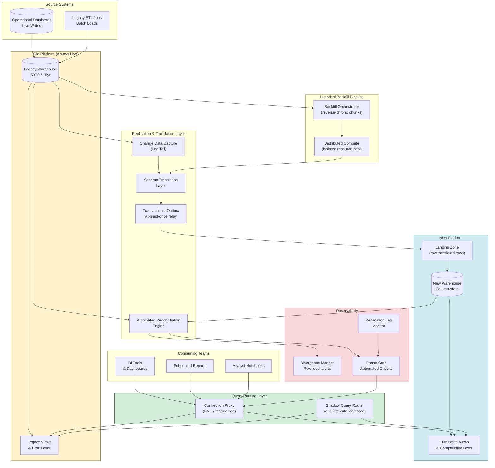

# 14 — Zero-Downtime Live Data Warehouse Migration

---

## Problem Statement

Migrating a 50TB, 15-year-old on-premise data warehouse to a new platform while users are actively querying it for dashboards and operational reporting is one of the hardest data engineering problems in practice. The core tension is that you cannot pause writes: the source system receives new data continuously while you are moving it. Every decision you make about sequencing the migration is undermined by the fact that records written five minutes ago in the old system need to appear in the new system before the next dashboard refresh cycle.

The reversibility requirement makes this harder still. A naive approach writes data to the new system and cuts over when the backfill completes. But if you discover data quality issues, schema translation errors, or performance regressions on the new platform after cutting over, you have no path back. The old system has continued receiving writes during your migration window. Rolling back means reconciling weeks of divergence — the exact problem you were trying to avoid. Production-grade migrations maintain the old system as the authoritative source of truth until the instant of cutover, keep both systems in sync via continuous replication, and preserve the ability to redirect all traffic back to the old system within minutes if anything goes wrong.

The atomic cutover requirement adds a third constraint. Users must experience no gap in reporting. A cutover that is visible to users — even a five-minute window where some dashboards see the old system and others see the new — creates inconsistency in business-critical decisions. This means the switch must be coordinated at the access layer, not at the data layer: you route queries rather than move data at cutover time, and the data must already be in both places before that moment arrives.

---

## Clarifying Questions

A senior data engineer should ask the following before designing any migration architecture. Groupings reflect how answers constrain the design space.

### Data Characteristics

1. **What is the distribution of data age?** Is the 50TB roughly uniform across 15 years, or is the majority of query traffic concentrated on the last 12-24 months? This determines backfill sequencing priority — you must serve recent data first.
2. **What is the daily write volume to the old system?** A system receiving 500GB/day during migration requires fundamentally different dual-write capacity planning than one receiving 5GB/day.
3. **Are there large objects, semi-structured payloads, or non-standard data types in the old system?** BLOBs, nested XML, or proprietary column types each require a schema translation layer that must be validated before any cutover gate is passed.

### Schema and Compatibility

4. **What is the schema divergence between old and new platform?** Identical DDL is rare across platform migrations. Differences in null semantics, timestamp precision, string encoding, numeric precision, and reserved keywords all require explicit translation rules and affect reconciliation logic.
5. **Are there stored procedures, views, or computed columns in the old system that consume teams rely on?** If downstream tools depend on view definitions that encapsulate business logic, those views must be recreated on the new platform and validated to produce identical outputs before any report traffic shifts.

### Operational Constraints

6. **What is the acceptable reconciliation lag tolerance?** Can the new system be up to 60 seconds behind the old during the dual-serve phase, or must it be within one CDC cycle (~5 seconds)? This determines whether you can use asynchronous replication or need synchronous dual-write.
7. **What is the rollback SLA?** If you discover a critical data quality issue two weeks into migration, what is the maximum acceptable time to restore full service on the old system? This determines how long you must keep the old system as an active target for writes rather than a read-only snapshot.
8. **Who controls the query routing layer?** If consuming teams embed direct connection strings in BI tools, migration requires a coordinated credential rotation or a proxy layer that can be switched centrally without touching individual tools.

### Consistency and Correctness

9. **What is the business key for each major entity?** Row counts and column checksums are necessary but not sufficient for validation. You need to be able to join old and new on a stable business key to detect row-level mismatches, and that key must exist and be indexed on both sides.
10. **Are there any tables that cannot tolerate even a one-second divergence window?** Real-time operational tables (e.g., inventory counts, active session state) may require synchronous dual-write rather than CDC-based replication, with the associated write latency penalty.

### Cutover and Decommission

11. **What is the minimum dwell time in dual-serve mode before cutover is permitted?** Most regulated environments require at least one full business cycle (typically one month-end close, one quarter-end, one regulatory reporting cycle) of parallel operation before old system decommission is allowed.
12. **What constitutes an irreversible action?** Decommissioning compute, deleting data, and revoking credentials are irreversible. You need explicit organizational sign-off at the phase gate before any of these occur, and the sequence matters — compute before data, data never until confirmed.

---

## Hard Constraints

- The old system must remain the authoritative source of truth for all writes until the moment of atomic cutover. No write must be lost or accepted by the new system alone during any phase prior to cutover.
- Migration must be reversible at any phase gate. Rolling back to the old system must not require data reconciliation; the old system must remain current at all times.
- No reporting gap is acceptable. Dashboards must return results from either old or new at all times. The routing switch must be invisible to consumers.
- Schema translation must be deterministic and idempotent. The same source row processed twice must produce the same translated row in the new system.
- Validation must compare production snapshots, not async replicas. Replication lag in a secondary replica corrupts checksum comparisons.
- Backfill must not impact live ingestion throughput. Resource partitioning between the live replication path and the historical backfill path must be enforced at the infrastructure level.
- Divergence detection must be automated and continuous. Manual spot-checks are insufficient; automated reconciliation must run on a cadence shorter than the dashboard refresh cycle.
- Decommission of old system infrastructure must be gated on a completed and signed-off dwell period, never automated.

---

## Architecture Diagram

---

## Solution Design

### Phase 0: Foundation and Shadow Mode

Before any data moves, the foundational infrastructure must be in place and verified. This phase has no consumer impact and no risk surface — it runs entirely alongside the production old system.

**Schema Translation Layer**

The old and new platforms will have type system differences. Build an explicit, versioned mapping table that covers every column in every table scheduled for migration. The mapping must address:

- Numeric precision differences (old platform DECIMAL(18,4) may map to new platform NUMERIC(18,4) or require explicit CAST logic if the new platform uses different internal representation)
- Timestamp handling: all timestamps must be normalized to UTC with explicit timezone metadata before landing in the new system; the old system may store local time implicitly
- String encoding: character set differences (Latin-1 vs UTF-8) must be resolved at the translation layer, not assumed to be handled by the platform
- NULL semantics: some platforms treat empty string and NULL differently; define the canonical rule for each column family
- Reserved word conflicts: column names that are reserved on the new platform must be aliased in the compatibility view layer

The schema translation layer is implemented as a deterministic function: same input row always produces same output row. It is tested against a sample of 100,000 rows from each major table before any live replication begins.

**Connection Proxy Setup**

All consumer connections must route through a proxy or DNS alias that can be switched without touching individual BI tools or report configurations. The proxy starts pointing exclusively to the old system. Consuming teams are migrated to use the proxy connection string (not the direct old-system connection string) as a prerequisite. This migration of connection strings is the only consumer-facing change that happens before cutover, and it produces no change in behavior.

**Outbox Relay Infrastructure**

The transactional outbox pattern is used rather than naive dual-write to avoid cross-system atomicity failures. The old system's application layer (or a CDC log tailer) writes change records to an outbox table within the same transaction as the source write. A relay process reads the outbox and delivers to the new system. This guarantees at-least-once delivery with no cross-system atomicity requirement. Idempotency at the new system sink prevents duplicate processing.

**Isolated Resource Pools**

The backfill compute pool and the live replication path must be physically isolated. Backfill jobs running on shared compute will contend with replication lag under load. Define explicit CPU, memory, and I/O quotas for each. The live replication path gets priority; backfill is throttled if replication lag exceeds the defined SLA.

**Phase Gate — Shadow Mode Success Criteria:**
- Connection proxy routes 100% of traffic to old system, zero consumer impact observed
- Schema translation layer produces zero errors on 100,000-row sample from each migrated table
- Outbox relay delivers test events with p99 latency under defined SLA
- Backfill compute pool demonstrated to not impact replication lag under simulated load

---

### Phase 1: Live Replication Activation (Shadow Replication)

The CDC log tailer is activated on the old system. All change events — inserts, updates, deletes — flow through the schema translation layer and land in the new system. The new system receives data but serves no queries. This is the shadow replication phase.

**CDC Implementation**

Log-based CDC is preferred over trigger-based or query-based polling because it adds minimal overhead to the source system and captures all change types with accurate before/after states. The log tailer reads the old system's transaction log. Key operational decisions:

- Log retention on the old system must be set to cover at least twice the expected maximum replication lag, to allow for relay restarts without data loss
- The outbox relay maintains its own cursor (log sequence number or equivalent) in durable storage, not in memory, so restarts resume from the correct position
- Schema changes to the old system (DDL events) must be captured and handled explicitly; unanticipated DDL changes are the most common cause of silent replication failures

**Replication Lag Monitoring**

Replication lag is the elapsed time between a write on the old system and the corresponding row appearing in the new system. This is monitored by writing a heartbeat row to a dedicated monitoring table on the old system at a fixed interval (e.g., every 10 seconds) and measuring time-to-appear in the new system. P50, P95, and P99 lag are tracked. Any sustained P99 lag exceeding the defined SLA triggers an alert before phase gating.

**Phase Gate — Shadow Replication Success Criteria:**
- Replication lag P99 under SLA threshold for 72 consecutive hours
- Zero schema translation errors in production traffic (not just sample)
- Outbox relay restart tested: delivers all events after restart with no gaps
- DDL change handling tested with a non-production table schema change

---

### Phase 2: Historical Backfill

With live replication running, historical data is migrated. The backfill runs concurrently with live replication. The strategy is reverse-chronological: most recent data is migrated first. This means if consumers are switched to the new system before the backfill completes, they can immediately query recent data — the data most likely to be needed for operational reporting — while older historical data continues to arrive in the background.

**Backfill Sequencing**

Partition each table by time dimension (typically month or quarter). Start with the most recent complete period and work backward. Each partition is migrated as a unit:

1. Export a consistent snapshot of the partition from the old system (not the live table — use a snapshot or a bounded-time scan that avoids the replication window)
2. Run through the schema translation layer
3. Load to the new system with deduplication logic that handles the overlap with live replication (rows already delivered via CDC must not be duplicated)
4. Validate the partition (row count, column checksums, sample row comparison)
5. Mark partition as complete in the backfill manifest

**Deduplication at the Overlap Boundary**

The live replication path and the backfill path will write the same rows near the boundary between live data and historical data. The new system must be idempotent: if the same business key with the same transaction timestamp is written twice, the second write is a no-op. This is implemented via MERGE (upsert) semantics rather than INSERT, or via a pre-load deduplication step.

**Backfill Progress and ETA**

The backfill orchestrator maintains a manifest of all partitions, their status, and their estimated completion. ETA is recalculated after each partition completes based on actual throughput. This manifest drives the phase gate decision: the new system cannot be promoted to serve queries until backfill for the query-scope window (typically last N years per business requirement) is complete.

**Phase Gate — Backfill Success Criteria:**
- All partitions within the business-required query window (e.g., last 5 years) validated with row count and checksum match
- Overlap boundary deduplication verified with zero duplicate business keys in the new system
- Backfill throughput verified to not have impacted live replication lag SLA during any 24-hour window

---

### Phase 3: Automated Reconciliation Engine

Reconciliation runs continuously throughout all phases. It is not a one-time check before cutover — it is a permanent operational process that provides the evidence base for every phase gate decision.

**Three Reconciliation Tiers**

**Tier 1 — Row Count Reconciliation**: For each table and each time-partitioned segment, compare row counts between old and new systems. Row count match is a necessary but not sufficient condition for data integrity. Run every 15 minutes for live tables, every hour for historical partitions.

**Tier 2 — Column Checksum Reconciliation**: For each table, compute a deterministic aggregate hash of each column's values within a partition (typically a hash of the concatenated sorted values, or a SUM of a hash function applied per row). Compare between old and new. A checksum mismatch after a row count match indicates a data transformation error (e.g., precision difference, encoding difference) rather than a missing row.

**Tier 3 — Query Result Reconciliation**: Execute a set of representative business queries — the actual queries that power critical dashboards — against both old and new systems and compare results. This is the highest-confidence validation tier. It catches errors that survive row count and checksum checks, such as view logic differences or aggregation semantic differences. Query result reconciliation runs hourly against a curated set of 20-50 representative queries.

**Divergence Detection and Alerting**

Any mismatch at any tier triggers an alert with the following information:
- Which table, which partition, which tier of check failed
- The magnitude of divergence (number of rows, number of mismatched columns, query result delta)
- The timestamp of the last clean check and the first dirty check (to bound the divergence window)
- Whether the divergence is growing (replication issue) or stable (backfill gap)

Divergence alerts block phase gate advancement. A clean divergence check across all three tiers for a defined dwell period is required before each phase gate.

**Phase Gate — Reconciliation Success Criteria:**
- All three reconciliation tiers pass with zero divergence for 48 consecutive hours
- All representative business queries return identical results from old and new systems
- Divergence alert system demonstrated to fire correctly on a synthetically injected mismatch

---

### Phase 4: Dual-Serve Mode

The new system begins serving a fraction of query traffic. Both old and new are live. This is the validation phase under real query load from real consumers.

**Traffic Shifting Strategy**

Traffic is shifted incrementally using the connection proxy's routing rules. The proxy supports routing by user group, by report type, and by percentage.

**User-group routing** is used first. A small cohort of technically sophisticated internal users (data engineers, analysts with SQL access) is shifted to the new system. They can identify issues proactively. This cohort is not on production-critical reporting paths.

**Report-type routing** is used next. Non-critical reports (data quality monitoring dashboards, internal analytics) are shifted before business-critical reports (executive dashboards, regulatory reporting, customer-facing reports). This limits blast radius during the validation window.

**Percentage routing** is used for bulk traffic shift. After user-group and report-type validation, the remaining traffic is shifted in increments: 10% → 25% → 50% → 75% → 100%. Each increment dwells for at least 24 hours (or one full business reporting cycle, whichever is longer) before the next increment is applied.

**Shadow Query Execution**

Before any traffic is shifted, the shadow query router dual-executes queries against both old and new systems and compares results at the application level, without exposing the new system result to users. This provides confidence in the new system's correctness before any consumer sees results from it. Shadow execution runs during Phase 1 and 2 and provides the query result validation input to Tier 3 reconciliation.

**Rollback From Dual-Serve**

At any point during dual-serve, routing can be reversed to 100% old system within seconds by updating the proxy routing rule. This requires no data reconciliation because the old system has received all writes throughout the dual-serve phase via the live replication path (which continues running in reverse during rollback, if needed).

**Phase Gate — Dual-Serve Success Criteria:**
- At least one full business reporting cycle completed at each traffic percentage increment with zero consumer-reported discrepancies
- Query result reconciliation shows zero divergence across all tier-3 queries for the dwell period
- Rollback procedure tested and timed: full redirect back to old system in under 5 minutes

---

### Phase 5: Atomic Cutover

Cutover is the moment at which the proxy is switched to route 100% of traffic to the new system and the old system stops receiving new writes.

**Pre-Cutover Checklist**

All of the following must be verified before cutover is initiated:
- Replication lag is at nominal levels (not during a spike)
- No active backfill jobs are running that would add load to the new system
- Reconciliation Tier 1, 2, and 3 all pass
- Incident response contacts are online and aware of the cutover window
- Rollback procedure is documented, distributed, and has been rehearsed

**Cutover Sequence**

1. Quiesce new writes to the old system. For a data warehouse, this typically means pausing the legacy ETL jobs and draining any in-flight CDC events. The old system continues to serve read queries via the proxy during drain.
2. Wait for the replication lag to reach zero (all events from old system have landed in new system).
3. Verify final reconciliation pass: Tier 1, Tier 2, Tier 3 all clean.
4. Switch proxy routing to 100% new system. This is a single configuration change, not a data movement operation. It completes in under 1 second.
5. Verify that queries from at least three representative dashboard checks return expected results from the new system.
6. Resume ETL jobs, now pointed at the new system.

The entire cutover sequence from quiesce to verified is targeted at under 10 minutes, with the user-visible impact being under 1 second (the proxy switch).

**Post-Cutover Dual-Write Dwell**

The replication path from old to new is maintained for at least 30 days post-cutover, even though the old system no longer receives new writes. This supports rollback if a delayed issue is discovered (e.g., a month-end close process that runs quarterly reveals a data error). During this dwell period, the old system remains available for reads.

---

### Phase 6: Decommission

Decommission is the final phase and is explicitly not automated. Each step requires manual sign-off.

**Decommission Sequence**

1. Stop the replication pipeline. Verify that the new system has been sole source of truth for at least one full business reporting cycle with zero escalations.
2. Archive the old system's raw data to cold object storage. Do not delete. Retention policy for archived data must be defined before this step.
3. Remove the compatibility view layer on the new system. This requires verifying that all consumers have been updated to use native new-system query patterns, not the compatibility shims.
4. Decommission old system compute (database engine, ETL servers). This is irreversible.
5. Update all documentation, runbooks, and data catalog entries to reflect the new system as authoritative.

---

## Trade-offs

| Decision | Option A | Option B | Recommendation | Why |
|---|---|---|---|---|
| **Write consistency during dual phase** | Synchronous dual write (single coordinated transaction) | Async CDC + outbox relay | Outbox relay | Synchronous dual write across separate systems violates atomicity under CAP; network partitions mid-write create unrecoverable divergence. Outbox relay gives at-least-once with idempotent sink at the cost of ~1–30s lag. |
| **Backfill sequencing** | Chronological (oldest first) | Reverse-chronological (newest first) | Reverse-chronological | Operational dashboard queries are concentrated on recent data. Serving recent partitions first means the new system can absorb read traffic before full backfill completes, shortening the dual-serve dwell time. |
| **Traffic shift mechanism** | Percentage-based (e.g., 10→50→100) | User-group and report-type routing | Hybrid (user-group first, then percentage) | Pure percentage routing exposes random users to potential issues. User-group routing first targets technically capable internal users who can identify problems. Percentage routing scales after validation. |
| **Schema translation** | Translate at write time in the replication pipeline | Translate at read time in the compatibility view layer | Write-time translation | Read-time translation means the raw data in the new system is still in old-system format, creating a permanent dependency on the translation layer. Write-time translation normalizes data at ingestion and removes the dependency. |
| **Reconciliation strategy** | Row count only | Row count + column checksums + query result comparison | All three tiers | Row counts miss data quality issues (wrong values, precision errors, encoding corruption). Checksums add column-level confidence. Query result comparison is the only tier that catches view logic errors and aggregation semantic differences. |
| **Rollback mechanism** | Data-level rollback (copy data back to old system) | Routing-level rollback (redirect proxy to old system) | Routing-level rollback | Data-level rollback requires reconciling all writes that landed in the new system during dual-serve — a multi-hour operation at scale. Routing-level rollback is a sub-second configuration change, provided the old system has remained current. |
| **Cutover timing** | Planned maintenance window (low-traffic period) | Continuous / any time after phase gates pass | Planned low-traffic window | Even with a sub-second proxy switch, cutover carries risk. A low-traffic window minimizes the number of in-flight queries at the moment of switch and reduces the blast radius of any unexpected issues. |

---

## Failure Modes and Recovery

| Failure | Detection | Recovery Strategy |
|---|---|---|
| **Replication lag spike** — backfill or network event causes live replication to fall behind SLA | Heartbeat latency monitor exceeds P99 threshold; alert fires within one heartbeat interval | Pause backfill jobs immediately (replication takes priority); investigate relay backpressure; if lag does not recover within 15 minutes, roll back traffic to 0% new system and diagnose before re-attempting phase gate |
| **Schema translation error** — a column type difference silently truncates or corrupts values in the new system | Tier 2 (column checksum) reconciliation mismatch; may also surface as a Tier 3 query result divergence | Stop replication pipeline for affected tables; fix translation rule; reprocess affected partitions from old system snapshot; revalidate full Tier 1/2/3 before resuming traffic shift |
| **Dual-write atomicity failure** — outbox relay crashes after old system write but before new system delivery | Outbox table accumulates unprocessed rows; relay consumer lag monitor fires | Restart relay from persisted cursor; idempotent sink on new system absorbs redelivered events without duplication; verify backlog drains to zero before declaring recovery |
| **Divergence after cutover** — post-cutover reconciliation reveals a mismatch that was not caught during dwell | Tier 3 query result reconciliation fires after cutover; business user escalation | Engage rollback procedure: redirect proxy to old system (sub-5-minute operation if old system is still current); investigate divergence root cause in new system without time pressure; fix and re-migrate affected data before re-attempting cutover |
| **Consumer connection routing failure** — a consuming team has a hardcoded connection string that bypasses the proxy | Tier 3 query result comparison shows no traffic from that consumer on the new system; report discrepancy after cutover | Audit all connection strings before entering dual-serve phase; maintain a registry of all consuming tools and their connection configuration; require sign-off from each team owner that proxy routing is in place |
| **Backfill overlap duplication** — the boundary between live replication and backfill produces duplicate rows in the new system | Row count reconciliation shows new system row count exceeding old system count; duplicate key scan on new system | Idempotent MERGE semantics prevent this if implemented correctly; if duplication occurs, run deduplication job on affected partition using business key + transaction timestamp; re-validate Tier 1/2/3 before continuing |
| **Schema change on old system during migration** — a DDL event (column add, type change) on the old system is not captured by the CDC pipeline | Replication errors or silent column omission; Tier 2 checksum divergence on the affected table | CDC pipeline must capture DDL events; if not supported natively, implement a schema change monitor that compares old system DDL snapshot on a schedule; halt replication for affected table until translation layer is updated for the new schema |
| **Rollback after decommission of old system compute** — a critical issue is discovered after old system infrastructure has been decommissioned | No automated detection — this is a governance failure | This scenario is prevented by the mandatory dwell period and phased decommission sequence; if it occurs despite controls, recover from cold archive (data was archived to object storage before compute decommission); restore to a new instance of the old platform from archive — this will take hours to days |

---

## Observability Checklist

### Replication Health

- **Replication lag P50 / P95 / P99**: measured via heartbeat table, sampled every 10 seconds, aggregated over 1-minute windows. Alert threshold: P99 > SLA for 5 consecutive minutes.
- **Outbox table backlog depth**: number of unprocessed rows in the outbox. Alert threshold: backlog depth growing for 10 consecutive minutes.
- **CDC event throughput**: events per second processed by the replication pipeline. Alert: drop to zero for more than 30 seconds (indicates pipeline failure, not just low traffic).
- **Schema translation error rate**: count of rows that failed translation per minute. Alert: any non-zero value in production traffic.

### Reconciliation

- **Tier 1 row count match rate**: percentage of table-partition pairs with matching row counts. Alert: any mismatch unresolved after one reconciliation cycle.
- **Tier 2 checksum match rate**: percentage of table-column-partition tuples with matching checksums. Alert: any mismatch.
- **Tier 3 query result match rate**: percentage of representative queries returning identical results from old and new systems. Alert: any mismatch during dual-serve phase; informational during shadow phase.
- **Divergence window duration**: for any detected mismatch, how many consecutive reconciliation cycles has it persisted. Alert: any divergence persisting beyond 3 cycles escalates to incident.

### Traffic and Query

- **Traffic distribution by system**: percentage of queries routed to old vs. new system. Track in real time; deviations from configured split indicate proxy routing issues.
- **Query error rate by system**: error rates from both old and new systems, tracked separately. Any increase in new system error rate during traffic shift triggers rollback evaluation.
- **Query latency P50 / P95 / P99 by system**: performance regressions on the new system under real load must be detected before 100% cutover. Alert: P99 latency on new system exceeds 150% of old system baseline.

### Backfill Progress

- **Backfill partition completion rate**: partitions completed per hour. Track against ETA to detect slowdowns.
- **Backfill impact on replication lag**: correlation between backfill throughput and replication lag. Alert: replication lag increases when backfill is active (indicates resource contention).
- **Backfill error rate**: failed partition migrations per hour. Alert: any non-zero rate.

### Phase Gate Status

- **Phase gate dashboard**: single view showing current phase, all phase gate criteria, and pass/fail status for each. Must be accessible to all stakeholders (data engineering, data governance, business owners).
- **Phase dwell timer**: time elapsed in current phase since all gate criteria were first satisfied. Dwell requirements (e.g., 72 hours at each phase) are tracked and enforced automatically; phase advancement is blocked until dwell requirement is met.

---

## Interview Answer Template

When asked about zero-downtime migration strategy in an interview, structure your answer using the constraint-elimination technique: identify the hardest constraints first, show how each constrains the design, and present the architecture as the intersection of all constraints. This demonstrates senior-level thinking rather than pattern recitation.

**Opening — Name the Core Constraint**

"The hardest part of this problem is not the data volume — 50TB is large but not unusual. The hardest part is the combination of three simultaneous constraints: no reporting gap, full reversibility at any point, and continuous writes to the source system throughout. Each of these alone is solvable. Together, they eliminate most approaches."

**Constraint Elimination**

"No reporting gap means I cannot have a dark window. Any approach that requires stopping old system reads during cutover is eliminated. That rules out simple lift-and-shift.

Reversibility means the old system must remain the authoritative write target until the last possible moment. Any approach that starts accepting writes in the new system before validation is complete creates a divergence problem on rollback. That rules out blue-green with simultaneous writes.

Continuous writes mean the old system is changing the entire time I'm migrating. Any snapshot-based approach that copies data once and then cuts over will be stale. I need a live replication path that continuously synchronizes changes."

**Architecture**

"The architecture that satisfies all three constraints is a five-phase migration: shadow replication, validated backfill, dual-serve with incremental traffic shift, atomic proxy-level cutover, and a post-cutover dwell before decommission.

The key insight is that cutover is not a data operation — it is a routing operation. By the time I throw the switch, both systems have the same data, because live replication has been running continuously. The switch is a proxy configuration change. It takes under one second and is invisible to consumers.

Reversibility is preserved throughout because the old system never stops being the write target until the proxy switch. Rolling back is also a proxy configuration change. No data reconciliation required."

**Validation**

"I run three tiers of reconciliation continuously: row counts, column checksums, and query result comparison. The third tier is the most important — it runs the actual queries that power dashboards and compares results. This catches errors that survive row-count and checksum validation, like view logic differences.

Phase gates are automated. No phase advances until the gate criteria have been met continuously for the required dwell period. A human can observe the gate dashboard, but the dwell timer is not waivable."

**Failure Mode Acknowledgment**

"The failure mode I'm most concerned about is silent divergence — a data quality issue that exists in the new system but doesn't surface in reconciliation until a business user finds it in a dashboard. The defense is Tier 3 reconciliation: by comparing actual query outputs rather than just raw data, I validate the full stack including views and aggregation logic. I also require shadow query execution before any consumer sees new system results, which gives an additional detection layer."

**Trade-off You Would Make**

"If pressed to trade off between consistency and cutover speed, I choose consistency every time. The cost of a one-week extended dwell in dual-serve mode is trivially small compared to the cost of rolling back from a bad cutover on a 50TB warehouse. The schedule is subordinate to correctness."
