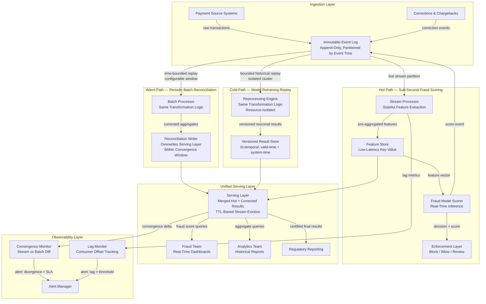

# Hybrid Lambda/Kappa Architecture: Real-Time Fraud Detection with Historical Correctness

---

## Problem Statement

Payment fraud detection creates an irreconcilable tension between two legitimate and simultaneous data needs: a fraud-scoring team that needs transaction decisions in under one second, and an analytics team that needs aggregations which are provably correct over three years of history including late corrections applied retroactively. These two requirements are not just different service-level objectives — they require fundamentally different computational models. Real-time scoring must make a decision before a transaction clears, with incomplete information, using approximate state. Historical analytics must recompute results from scratch whenever a fraud model is retrained or a charge-back corrects the label of a transaction that occurred 18 months ago. No single naive architecture satisfies both simultaneously.

Lambda architecture was invented to address exactly this split: run a batch layer for correctness and a speed layer for low latency, merge the outputs in a serving layer. In practice, Lambda creates a new problem that is equally severe — the batch and stream codebases inevitably diverge. Two separate engineering teams implement the same business logic (fraud scoring features, aggregation rules, label correction semantics) in two separate compute paradigms. The drift starts within weeks: a bug fix applied to the batch SQL is not ported to the stream processor, or a new feature flag is added to the stream path and forgotten on the batch side. Six months later, the serving layer merge produces results that are internally inconsistent, and no one can identify which layer is wrong. At 10,000 transactions per second over three years, the dataset is too large to manually reconcile.

Kappa architecture responds by eliminating the batch layer entirely: make the immutable event log large enough to hold all history, and reprocess historical events through the same streaming pipeline when corrections or retraining are needed. This solves the dual-codebase problem but creates a new class of resource and correctness risks at the scale described here. Replaying 500 billion events through a streaming cluster consumes days of compute, saturates cluster capacity, and can disturb live fraud scoring during the replay window. Log retention for three years at 10K TPS is not free. Out-of-order event handling and watermark misconfiguration can silently produce wrong aggregations that are indistinguishable from correct ones. The hybrid approach described in this document keeps a single shared codebase while separating the hot path from the cold reprocessing path, using convergence SLA enforcement and bi-temporal result versioning to guarantee that batch and stream always agree at a defined point in time.

---

## Clarifying Questions

A senior data engineer would ask the following before designing this system:

### Latency and Correctness Boundaries
1. **What does "sub-second" mean operationally for fraud scoring — P50, P99, or maximum allowable? And is the latency budget from event ingestion to scoring decision, or from transaction initiation to block/allow enforcement?** P99 sub-second with 10K TPS at peak requires a hot path with no blocking joins and pre-materialized feature state. If the clock starts at transaction initiation rather than ingestion, the network and ingestion overhead alone may consume 200–400ms, leaving little margin.
2. **What is the acceptable "convergence window" — the maximum time the stream result and the batch-corrected result may differ?** This is the convergence SLA. If the analytics team can tolerate a 4-hour window where stream aggregations may differ from batch-reconciled results, the architecture is much simpler than if the window must be 15 minutes. This number drives reprocessing trigger frequency and serving layer TTL configuration.
3. **When the fraud model is retrained and historical labels change, what is the reprocessing SLA? Can the corrected results take 24 hours, or is 2 hours required?** This determines whether reprocessing must co-execute with live traffic (competing for cluster resources) or can run in a dedicated off-peak window.

### Data and Scale Characteristics
4. **What is the distribution of the 10K TPS — flat rate or spiky (e.g., 3x spikes at market open, holiday peaks)?** Peak provisioning for the hot path must be based on burst capacity, not average. A flat-rate architecture at 10K TPS will fail silently at 30K TPS during a Black Friday spike.
5. **Of the 500 billion events in three years of history, what fraction are corrections (chargebacks, label reversals, retroactive fraud reclassifications) vs. original transactions?** If corrections represent 0.1% of events, the reprocessing scope on any given model retrain is bounded and tractable. If corrections represent 5%, full history replay is almost always needed.
6. **What is the schema of a "correction" event? Is it a separate event type appended to the same log, or a mutation of the original event record?** Immutable log correctness depends on corrections being new append events, not mutations. If the source system overwrites original records, the log loses its "source of truth" property and the entire architecture premise breaks.

### Single Source of Truth
7. **Where does the authoritative label for a transaction live — the original stream event, the corrected batch record, or a separate corrections table?** The answer determines the write path for the serving layer and which system "wins" in a conflict. If the stream result and batch result disagree, the serving layer must know which to prefer at any point in the convergence window.
8. **When the analytics team says "correct aggregations," do they mean correct as of event-time (when the transaction occurred) or as of system-time (when the correction was processed)?** This is a bi-temporal question. If they need both — what the system believed at audit date vs. what actually happened — the serving layer must maintain two time axes, not one. This roughly doubles storage and query complexity.

### Reprocessing Scope
9. **When the fraud model is retrained, does every historical transaction need to be rescored, or only transactions within a lookback window (e.g., the last 90 days)?** Full-history replay of 500 billion events is a fundamentally different engineering problem than windowed replay of the last 90 days. Most fraud model retraining use cases only require rescoring the active review window, not all-time history.
10. **Can reprocessing run on a separate compute cluster, isolated from live scoring traffic?** Resource isolation is the difference between reprocessing being a planned maintenance operation and an incident-causing resource contention event.

### Operations and Team
11. **Who owns the convergence SLA — the platform team, the fraud team, or the analytics team? And is there a downstream consumer (regulatory report, risk dashboard) that requires a certified "final" result flag on each aggregate?** Convergence monitoring is operational work. Someone must own the alert, the runbook, and the escalation path when the stream and batch diverge beyond the SLA window.
12. **What is the team's experience split between batch processing and stream processing? And is there an existing transformation layer with tested business logic?** If 90% of the team's expertise is in SQL-based batch transformation, a Kappa-only architecture with complex stateful streaming operators is a significant capability risk. The hybrid approach allows the team to encode business logic once in a SQL-based transformation layer that compiles to both stream and batch execution modes.

---

## Hard Constraints

- **Sub-second fraud scoring latency.** P99 from transaction event ingestion to scoring decision delivered to enforcement layer must be under 1,000ms. Any architectural component on the hot path must be eliminated if it adds blocking latency.
- **Batch and stream results must agree within the convergence SLA.** "Batch and stream cannot disagree" means divergence is permissible within a defined window (e.g., 4 hours) but must be zero at convergence time. This must be measurable and monitored with automated alerts.
- **Single source of truth via immutable event log.** All data — original transactions, corrections, label updates — must be appended to the same immutable log in event-time order. No direct mutations of existing log records. The log is the only source of truth; all derived stores are caches.
- **Full reprocessing capability.** When the fraud model is retrained, the entire scoring pipeline must be replayable over the relevant historical window. The replay must produce bit-for-bit identical results to the original run given the same input events.
- **Scale: 10K TPS sustained, 500 billion events, 3 years history.** Hot-path components must be horizontally scalable with no single-threaded bottlenecks. Reprocessing must not starve live traffic.
- **Late corrections must propagate to analytics.** A chargeback processed today that reclassifies a transaction from six months ago must update the affected aggregate metrics. This requires the batch/correction path to have write authority over the serving layer.
- **No dual business logic codebases.** The batch and stream paths must share the same transformation logic definition. If the logic must be expressed twice, the architecture violates the single-codebase constraint.

---

## Architecture Diagram

---

## Solution Design

### Layer 1: Immutable Event Log as Single Source of Truth

The architectural foundation is an immutable, append-only distributed log partitioned by event time. Every event — original transactions, corrections, chargebacks, model rescoring results, and schema-level metadata events — is appended to this log. No record in the log is ever mutated or deleted within the retention window. This is the only thing all three processing paths share.

**Partitioning strategy**: Partition by a hash of the payment account identifier as the primary key, with event-time as the sort key within each partition. This ensures that all events for a single account are co-located in the same partition, enabling the stream processor to maintain per-account state without cross-partition joins. At 10K TPS and 500 billion events over three years, partition count must be sized to keep each partition's throughput below the per-partition write limit of the chosen log infrastructure, with 20–30% headroom for burst.

**Correction event schema**: A correction event must carry four fields beyond the normal transaction payload: (1) the `original_event_id` it is correcting, (2) the `correction_type` (label reversal, amount adjustment, fraud reclassification), (3) the `valid_time_start` and `valid_time_end` of the corrected assertion (bi-temporal valid time axis), and (4) the `correction_source` (chargeback system, compliance review, model retrain). The stream processor and batch processor must apply corrections identically: corrections do not overwrite original events but generate new derived results in the serving layer.

**Retention policy**: At 10K TPS with an average event size of 2KB, daily volume is approximately 1.7TB compressed. Three years of retention at this rate is approximately 1.8PB. Log retention must be partitioned into a hot tier (last 14 days, replicated 3x on high-throughput storage), a warm tier (14 days to 1 year, replicated 2x), and a cold tier (1 to 3 years, compressed columnar format on object storage, accessible for reprocessing but not for live stream consumption).

**Log compaction is prohibited** for the raw transaction topic. Compaction would mutate the log by replacing earlier records with later values, destroying the immutability guarantee. A separate compacted topic may be maintained as a derived current-state view, but it must never be used as the reprocessing source.

---

### Layer 2: Hot Path — Sub-Second Fraud Scoring

The hot path has a single, absolute requirement: P99 latency under 1,000ms from event ingestion to scoring decision. Every component on this path must be evaluated against this budget.

**Typical latency budget breakdown:**
- Log ingestion (producer to partition leader): 5–20ms
- Stream processor event receipt: 10–30ms (consumer lag under normal operation)
- Feature extraction and state lookup: 20–100ms (depends on feature store read latency)
- Model inference: 50–200ms (depends on model complexity and hardware)
- Decision write to enforcement layer: 5–20ms
- Total P99 target: under 1,000ms with 400–600ms of available margin for spikes

**Stream processor design**: The stream processor must maintain pre-aggregated feature state per account in a local state store (not a remote database) to eliminate network round-trips on the critical scoring path. Features like "number of transactions in the last 5 minutes from this account" must be maintained as rolling window counters in operator-local memory, checkpointed to durable storage at configurable intervals (every 30 seconds is a common production setting that balances recovery time against checkpoint overhead).

Stateful operators must handle out-of-order events using event-time watermarks. The watermark must be set conservatively: at 10K TPS across a globally distributed payment system, late-arriving events from mobile clients or delayed network hops may arrive 30–60 seconds behind the watermark. Setting the watermark too aggressively (e.g., 5 seconds) silently drops late features and produces incorrect fraud scores without any error signal. A 90-second allowed lateness with late event sidecar capture is a reasonable production configuration.

**Feature store**: The feature store is a low-latency key-value store pre-populated by the stream processor. It must support single-digit millisecond P99 reads. It holds the materialized feature vector for each active account, updated by the stream processor as new events arrive. The fraud model scorer reads from this store rather than computing features on demand. This decouples the feature computation (stateful, complex) from the inference step (stateless, fast).

**What the hot path does NOT do**: The hot path does not apply corrections. It does not join against historical batch results. It does not recompute aggregations over multi-day windows. All of these operations happen on the warm or cold path. The hot path accepts that its fraud scores are computed on best-available real-time state and may be superseded by corrected batch results in the serving layer after the convergence window.

---

### Layer 3: Warm Path — Periodic Batch Reconciliation

The warm path runs on a schedule (every 1 to 4 hours depending on the convergence SLA) and reprocesses the last N hours of events from the immutable log. Its purpose is to apply corrections that arrived after the stream processor made its original scoring decision, and to produce aggregates that are provably correct over recent history.

**Time-bounded replay, not full history**: The warm path does not replay all 500 billion events. It replays a bounded window — typically the lookback period relevant to current model features plus a buffer for late corrections. For most fraud detection use cases, a 7–14 day lookback window is sufficient. This makes the warm path tractable: at 1.7TB/day, a 14-day window is approximately 24TB, which a medium-sized batch cluster can process in 1–3 hours.

**Shared transformation logic**: The single most important design decision in this architecture is that the batch processor executing the warm path uses the same transformation logic definition as the stream processor on the hot path. This is achieved by expressing business logic in a SQL-based transformation layer that compiles to both streaming and batch execution plans. The logic is written once, tested once, and deployed to both execution modes. Any change to the logic goes through a single code review and release process. This eliminates the dual-codebase problem entirely.

**Correction application**: The warm path reads both original transaction events and correction events from the log, joining them by `original_event_id`. It computes the corrected state for each transaction and writes aggregate results to the serving layer, overwriting (not appending to) the stream-produced results for the same time windows. The write operation must be atomic at the window-partition level: the serving layer must not expose a partially-reconciled window to query clients.

**Reconciliation writer idempotency**: The warm path must be safe to re-run. If the batch job fails mid-write and restarts, it must produce the same result as a clean run. This requires the reconciliation writer to use a replace-partition-atomically pattern: write to a staging partition, then atomically swap it with the serving partition once the write is complete. Partial writes to the staging partition are invisible to query clients.

---

### Layer 4: Cold Path — Model Retraining Replay

When the fraud model is retrained, historical transactions must be rescored against the new model to update serving-layer results and to provide the analytics team with correct historical fraud rates under the new model's definitions.

**Resource isolation is non-negotiable**: Reprocessing must run on a dedicated cluster that does not share compute resources with the hot path stream processor. At 500 billion events (even in the common case where only a 90-day window is being reprocessed, that is still ~45 billion events), a replay job consuming cluster resources will increase hot-path latency and can push the stream processor above the P99 latency budget. The reprocessing cluster must have its own resource quota, its own consumer group offset tracking, and its own write path to the versioned result store.

**Versioned result store with bi-temporal indexing**: Results from the reprocessing engine are written to a versioned result store that maintains two time axes: valid time (when the transaction occurred in the real world) and system time (when the scoring result was written). This allows the analytics team to query: "What did our fraud model say about this transaction as of the Q3 audit date?" (system-time query) vs. "What does our current best understanding say about this transaction?" (current-version query). Without this bi-temporal indexing, a model retrain irreversibly overwrites the historical audit trail.

**Replay ordering guarantee**: When replaying from the immutable log, events must be processed in the same per-partition order as the original run. If the log infrastructure has been repartitioned between the original run and the replay (e.g., partition count increased due to scaling), the replay may produce different per-partition orderings and different aggregate results. This is the most dangerous silent failure mode in a Kappa-style replay. The reprocessing engine must consume from the original partition topology at the time of the events being replayed, or must use a partition-agnostic ordering guarantee (e.g., event-time sort before processing).

**Replay trigger and scope**: Reprocessing is triggered by a model deployment event. The reprocessing scope is defined by the retrain window: if the new model uses a 90-day feature lookback, the replay must cover the 90-day window plus an additional 14 days to allow correction events to propagate. Replay is never full-history by default; full-history replay must be explicitly approved and scheduled as a planned maintenance operation.

---

### Layer 5: Unified Serving Layer and Convergence

The serving layer is the single query endpoint for both the fraud team and the analytics team. It merges results from three sources: the hot-path feature store (for real-time account state), the warm-path reconciliation writer (for corrected recent aggregates), and the versioned result store (for historical and model-versioned results).

**Convergence SLA definition**: The convergence SLA is the maximum time window during which the serving layer is permitted to return stream-produced results that may differ from the eventually-correct batch-reconciled results. A typical production SLA is 4 hours: for any query against data older than 4 hours, the serving layer must return batch-reconciled results, not stream results. For any query against data less than 4 hours old, stream results are acceptable with a "pending reconciliation" flag in the response metadata.

**Convergence measurement**: The convergence monitor continuously computes the difference between stream-produced aggregates and batch-reconciled aggregates for the same time windows. It emits a `convergence_delta` metric per window partition. An alert fires if the delta for any window older than the SLA threshold is non-zero. This metric is the primary correctness signal for the entire architecture.

**TTL-based stream result eviction**: Stream-produced results in the serving layer carry a TTL equal to the convergence SLA. Once the TTL expires, the serving layer refuses to serve the stream result and falls back to the batch-reconciled result. If no batch-reconciled result exists for that window (e.g., the warm-path job failed), the serving layer returns an error with an explicit "result not yet certified" status code rather than silently returning a stale stream result. This makes convergence failures visible to consumers rather than hiding them.

**Query routing logic**:
- Real-time fraud score for a specific transaction: served from hot-path feature store + most recent scoring decision, with latency < 10ms.
- Aggregate fraud rate for a time window in the last 4 hours: served from stream-produced result with "pending" flag.
- Aggregate fraud rate for a time window older than 4 hours: served from batch-reconciled result, certified.
- Historical result as of a specific model version or audit date: served from versioned result store, bi-temporal lookup.

---

## Lambda vs. Kappa vs. Hybrid: Architecture Comparison

| Dimension | Lambda Architecture | Kappa Architecture | Hybrid (This Document) |
|---|---|---|---|
| **Codebases** | Two separate (batch SQL + stream code). Diverge within months. | One (stream only). | One (shared transformation logic compiles to batch and stream). |
| **Reprocessing at 500B events** | Native: batch layer reprocesses full history on schedule. Cost is ongoing, not incremental. | Full replay through streaming engine. At 10K TPS history, 3-year replay takes days, saturates cluster. | Time-bounded warm replay (7–14 days) covers most correction use cases. Full cold replay is available but isolated and explicitly triggered. |
| **Correctness guarantee** | Batch layer is exact; speed layer is approximate. Merge layer must reconcile two potentially-conflicting exact/approximate results. | Single pipeline, so no merge ambiguity. But watermark misconfiguration produces silently-wrong results. | Convergence SLA makes permissible divergence explicit and measurable. Correctness violations are observable, not silent. |
| **Fraud scoring latency** | Sub-second via speed layer. Batch layer results available after batch cycle. | Sub-second via unified stream. | Sub-second via hot path. |
| **Late-correction handling** | Corrections flow through batch layer and overwrite serving layer on next batch cycle. Stream layer never self-corrects. | Corrections are new events; replay produces corrected results. But replay is expensive at scale. | Warm path applies corrections every 1–4 hours within the convergence SLA. Cold path handles deep-history corrections. |
| **Audit and bi-temporal history** | Batch layer maintains history but typically single-temporal. | Replay by definition rewrites history; bi-temporal requires explicit versioning. | Versioned result store with bi-temporal indexing preserves audit trail across model retrains. |
| **Operational complexity** | High: two clusters, two deployment pipelines, two sets of on-call runbooks, serving-layer merge logic. | Medium: one cluster, but complex stateful operator management and replay orchestration. | Medium-high: three processing paths, but shared logic and explicit convergence monitoring reduce debugging surface. |
| **Log retention cost at 3 years / 500B events** | Not applicable to log; batch layer uses periodic snapshots. | Full log retention required for full replay. At ~1.8PB, requires tiered storage strategy. | Tiered hot/warm/cold log storage. Cold tier compressed columnar format reduces effective cost by 5–10x vs. raw. |
| **Team skill requirement** | Batch + stream expertise in parallel. Hard to hire for both. | Deep streaming expertise only. Accessible to streaming-specialist teams. | Batch SQL + stream processing. Shared logic layer reduces the skill gap between the two. |

---

## Cost Model Comparison

| Cost Dimension | Lambda | Kappa | Hybrid |
|---|---|---|---|
| **Compute: steady state** | 2x (dual cluster running continuously) | 1x (single stream cluster) | 1.3x (stream cluster + periodic warm batch cluster, cold cluster on-demand) |
| **Storage: event log** | Modest (batch uses snapshots, not full log) | High: full 3-year log at ~1.8PB required | Medium: tiered storage reduces effective cost; cold tier 5–10x cheaper per GB |
| **Reprocessing compute** | Included in ongoing batch cluster cost | Spike cost: days of compute for full 500B replay; risk of starving live cluster if not isolated | Controlled: warm path bounded by 7–14 day window; cold path isolated and explicitly triggered |
| **Engineering overhead** | High: maintaining two codebases, two test suites, two deployment pipelines | Medium: single codebase but complex streaming operator expertise required | Medium: single logic definition but three execution path configurations |
| **Incident cost** | High: logic divergence between batch and stream is difficult to diagnose and expensive to fix | High: watermark misconfiguration and replay ordering divergence are silent and hard to detect | Medium: convergence monitor makes divergence observable; most failures are detectable before they affect end users |
| **Total 3-year TCO estimate** | Highest | Medium (dominated by log storage) | Medium-low (tiered storage + on-demand cold cluster + shared codebase reduce all three cost axes) |

---

## Trade-offs

| Decision | Option A | Option B | Recommendation | Why |
|---|---|---|---|---|
| **Architecture pattern** | Pure Lambda: separate batch and stream codebases, serving-layer merge | Pure Kappa: single stream pipeline, full log replay for reprocessing | Hybrid: shared transformation logic, time-bounded warm replay, isolated cold reprocessing | Pure Lambda creates dual-codebase divergence at scale. Pure Kappa makes full 500B replay impractical and resource-dangerous. Hybrid bounds reprocessing cost while eliminating the divergence problem. |
| **Transformation logic expression** | Separate batch SQL and stream operator code | Single stream operator code (batch via micro-batch mode) | SQL-based transformation layer that compiles to both stream and batch execution plans | Micro-batch mode on a stream processor does not produce identical results to a true batch engine for complex window semantics. A SQL layer that compiles to both avoids this while preventing codebase divergence. |
| **Convergence SLA window** | 15 minutes (near-real-time reconciliation, warm batch runs every 15 minutes) | 24 hours (nightly batch reconciliation) | 4 hours | 15-minute batch cycles at 24TB warm window size are operationally fragile and expensive. 24-hour windows mean analytics queries on recent data may be 24 hours stale. 4 hours balances resource cost against freshness requirement. |
| **Correction event model** | Mutations: corrections overwrite original log records in place | Append-only: corrections are new events referencing the original event ID | Append-only corrections | Mutations destroy the immutability guarantee, making replay non-deterministic. Append-only corrections enable full audit trail and bi-temporal history at the cost of slightly more complex query logic. |
| **Reprocessing trigger scope** | Full 3-year history replay on every model retrain | Time-bounded replay of the model's feature lookback window (e.g., 90 days) | Time-bounded replay with explicit full-history option requiring approval | Full history replay at 500B events takes days and consumes enormous resources. Most model retrains only affect the feature window. Full-history replay should be a conscious decision, not the default. |
| **Serving layer conflict resolution** | Stream results always win (lowest latency, highest freshness) | Batch results always win (highest correctness) | TTL-based handoff: stream wins within convergence window, batch wins after TTL expiry | "Stream always wins" means corrections never propagate to query clients. "Batch always wins" means queries against recent data are always stale by up to the batch cycle time. TTL-based handoff makes the tradeoff explicit and configurable per use case. |
| **Bi-temporal versioning scope** | All serving-layer results are bi-temporal (valid time + system time) | Only model-retrain results are versioned; real-time results are overwritten in place | Bi-temporal versioning for all results older than the convergence window; real-time results are single-temporal with explicit "pending" flag | Full bi-temporal on all results roughly doubles storage and query complexity. Single-temporal on real-time results is acceptable because they are within the convergence window and not yet authoritative. |

---

## Failure Modes and Recovery

| Failure Scenario | Detection Method | Impact | Recovery Strategy |
|---|---|---|---|
| **Warm-path batch job fails mid-write; serving layer has partial reconciliation for a time window** | Reconciliation writer emits a job completion event with per-window status. Convergence monitor detects non-zero delta for windows older than convergence SLA that are not marked "pending". Alert fires within 5 minutes. | Analytics queries against affected windows return stream results past the TTL; serving layer returns "result not yet certified" error. Fraud scoring is unaffected (hot path). | Warm-path job retries from the staging partition. Idempotent replace-partition-atomic write means partial writes to staging are discarded. New attempt starts clean. SLA breach if retry time exceeds convergence window. |
| **Stream processor watermark set too aggressively; late-arriving events silently dropped** | Late-event sidecar captures all events arriving after watermark. Monitoring compares sidecar event count per window against expected event count from the log offset delta. Non-zero sidecar rate triggers alert. | Fraud scores for accounts with mobile or high-latency payment channels are computed on incomplete feature state. May produce false negatives (missed fraud) without any error signal if not monitored. | Increase allowed lateness parameter and redeploy stream processor. Replay the affected time window through the warm path to produce corrected aggregates. No hot-path restart required. |
| **Reprocessing job competes for cluster resources with live fraud scoring; hot-path latency exceeds P99 budget** | Hot-path latency P99 metric crosses threshold (e.g., 800ms) during reprocessing window. Resource utilization metrics show reprocessing cluster consuming > 20% of shared cluster capacity. | Fraud scoring latency degrades; may push P99 above 1,000ms SLA. In worst case, enforcement layer receives late decisions and transactions that should be blocked clear before the decision arrives. | Reprocessing job must run on isolated cluster with hard resource quota. If contamination is detected (shared cluster), immediately pause reprocessing job. Resume on isolated cluster. Add cluster isolation as a hard infrastructure constraint in the reprocessing trigger runbook. |
| **Replay ordering divergence: log was repartitioned between original run and replay; replay produces different aggregates** | Compare row-level checksum of replay output against original output for a known validation window. Checksums must match for replay to be considered valid. | Fraud model features computed during replay differ from those computed during the original run. Rescored results for model retraining are subtly wrong. This is a silent failure with no runtime error signal. | Before any reprocessing run, assert that partition topology for the replay window matches the original. If partition topology has changed, replay must sort events by event time within each original partition boundary before processing. Add partition-topology snapshot metadata to each log segment at write time. |
| **Immutable log record mutated (compaction enabled on raw transaction topic)** | Log segment checksums are computed at write time and stored in a metadata manifest. A background integrity checker periodically reads log segments and verifies checksums. Any segment whose checksum does not match the manifest triggers an alert. | Reprocessing from a mutated log will produce different results than the original run, violating the deterministic replay guarantee. Audit trails become unreliable. | Compaction must be disabled on the raw transaction topic at the infrastructure configuration level, enforced via infrastructure-as-code policy. If mutation is detected, treat as a data integrity incident. Restore the affected segment from the cold-tier archive (retained separately as an immutable backup). |
| **Correction event references a non-existent original event ID** | Warm-path job emits a metric counting unresolvable correction references per batch window. Any non-zero count triggers an alert to the data quality team. | The correction is silently ignored. The original transaction's fraud label is not updated. Aggregate fraud rates computed by the analytics team are incorrect for the affected time window. | Corrections with unresolvable original event IDs are written to a dead-letter queue for manual review. The data quality team investigates whether the original event was lost (log integrity issue) or the correction references an event from outside the retained log window. |
| **Serving-layer TTL misconfigured; stale stream results served past convergence SLA** | Convergence monitor compares serving-layer result version timestamps against batch-reconciled result timestamps for the same windows. If a stream-produced result is being served for a window where a batch-reconciled result exists, the monitor triggers a critical alert. | Analytics team receives stream-produced results that may include uncorrected fraud labels. Aggregate fraud rates are incorrect. If regulatory reports are generated from these results, compliance exposure exists. | Fix TTL configuration and redeploy serving layer. Serving layer re-reads batch-reconciled results for all affected windows. Regenerate any regulatory reports that may have been based on stale stream results. |
| **Feature store becomes inconsistent with stream processor state after stream processor restart** | Feature store and stream processor state store both emit a heartbeat with their last-processed event offset. If the offsets diverge by more than a configurable threshold, an alert fires. After any stream processor restart, a consistency check compares sampled feature store values against values recomputed from checkpoint state. | Fraud scoring uses stale or incorrect feature vectors, producing wrong scores until the feature store is resynchronized. Most dangerous in the minutes immediately following a stream processor restart. | Stream processor restart must include a feature store warm-up phase: before resuming live scoring, replay events from the checkpoint position to the current log head to rebuild feature state. Enforce a minimum warm-up completion check before the scorer begins reading from the feature store. |

---

## Observability Checklist

### Hot Path Latency and Throughput
- `hot_path_p99_latency_ms` — P99 end-to-end latency from event ingestion to scoring decision. Alert at 800ms (warning) and 950ms (critical).
- `hot_path_p50_latency_ms` — P50 latency. Sudden P50 increases often precede P99 SLA breaches.
- `stream_processor_consumer_lag_events` — Number of events the stream processor is behind the log head per partition. Alert if any partition lag exceeds 30 seconds of throughput (i.e., 300,000 events at 10K TPS).
- `transactions_per_second_ingest` — Current ingest rate. Alert if rate exceeds 80% of provisioned capacity to trigger pre-emptive scaling.
- `feature_store_read_p99_latency_ms` — Feature store read latency. Alert at 50ms. Spikes here are the most common cause of hot-path P99 budget overruns.
- `fraud_score_decision_rate` — Decisions per second broken down by outcome (block, allow, review). Sudden shifts in ratio indicate a model or feature quality issue.

### Convergence and Correctness
- `convergence_delta_by_window` — Absolute difference between stream-produced and batch-reconciled aggregate for each time window. Must be zero for windows older than the convergence SLA. Alert immediately on any non-zero value past the SLA window.
- `windows_pending_reconciliation` — Count of time windows currently within the convergence SLA window and awaiting batch reconciliation. Normal; alert if count grows unexpectedly (may indicate warm-path job is not running).
- `warm_path_job_completion_latency_minutes` — How long each warm-path batch job takes to complete. Alert if duration exceeds 80% of the convergence SLA window.
- `correction_events_processed_per_window` — Count of correction events applied per time window per warm-path run. Sudden spikes indicate upstream chargeback surges that may require warm-path frequency increase.
- `late_event_sidecar_rate_per_partition` — Rate of events captured in the late-event sidecar (arrived after watermark). A sustained non-zero rate indicates the watermark allowed-lateness parameter needs tuning.

### Reprocessing
- `reprocess_job_cluster_cpu_utilization` — CPU utilization of the isolated reprocessing cluster. Must not exceed 90% to leave recovery headroom. Alert if production cluster shows any CPU contribution from reprocessing jobs (indicates isolation breach).
- `reprocess_events_per_second` — Reprocessing throughput. Used to estimate completion time.
- `reprocess_partition_topology_match` — Boolean check: do the partition boundaries of the replay window match the original run? Alert and halt if false.
- `replay_checksum_match_rate` — Fraction of validation windows where replay output checksum matches the expected checksum from the original run. Must be 1.0. Any value below 1.0 is a critical data integrity alert.

### Log Integrity
- `log_segment_checksum_failures_total` — Count of log segments whose checksum does not match the manifest. Must be zero. Any non-zero value is a critical data integrity incident.
- `unresolvable_correction_references_per_window` — Count of correction events per warm-path window that reference a non-existent original event ID. Must be zero; non-zero values are written to dead-letter queue and trigger a data quality alert.
- `cold_tier_archive_sync_lag_hours` — How far behind the cold-tier immutable archive is relative to the warm tier. Alert if lag exceeds 24 hours (archive cannot serve as recovery source if it is too stale).

### Serving Layer Health
- `serving_layer_stale_stream_results_total` — Count of serving-layer reads that returned a stream-produced result for a window where a batch-reconciled result exists. Must be zero after TTL eviction is implemented. Non-zero indicates TTL misconfiguration.
- `certified_result_query_rate` — Rate of queries served from batch-reconciled (certified) results vs. pending stream results. Useful for capacity planning and SLA reporting.
- `versioned_result_store_query_latency_p99_ms` — P99 latency for bi-temporal historical queries. Alert at 500ms.

---

## Interview Answer Template

### The Constraint-Elimination Technique

When asked "How would you design a real-time fraud detection pipeline that also supports accurate historical analytics?" in a staff or principal engineer interview, use this structure:

**Step 1 — Surface the core tension explicitly (30 seconds)**

"The hard part of this problem is that fraud scoring and historical analytics have irreconcilable latency requirements. Fraud scoring needs a decision in under a second. Historical analytics needs results that are provably correct after corrections are applied — and corrections can arrive hours, days, or months after the original event. Any architecture that tries to satisfy both requirements with a single processing path will either be too slow for fraud scoring or too imprecise for analytics. So the first question I'd ask is: what is the acceptable convergence window — how long can the analytics team tolerate a result that might still be revised?"

**Step 2 — Eliminate naive options with specific failure modes (60 seconds)**

"Pure Lambda solves the latency split but creates a dual-codebase problem. When the fraud scoring logic changes, you have to update it in both the batch SQL and the stream operator code. In practice, these diverge within a quarter. You get a serving layer that merges results from two engines running different business logic — and no alert when they disagree.

Pure Kappa sounds cleaner — one codebase, replay history through the same stream. But at 500 billion events over three years, a full replay takes days, saturates the streaming cluster, and can push your live fraud scoring above its latency budget. And if the log was repartitioned since the original run, the replay doesn't produce identical results — silently."

**Step 3 — Introduce the hybrid design with the key insight (90 seconds)**

"The hybrid approach I'd use has three processing paths that all read from a single immutable event log. The hot path is a stream processor that maintains per-account feature state in local memory, scores transactions in under a second, and writes decisions back to the log. The warm path runs every few hours and replays a bounded recent window — say, 14 days — to apply corrections and produce certified aggregates. The cold path is for model retraining: it runs on an isolated cluster, replays the feature lookback window, and writes versioned results to a bi-temporal store.

The critical design decision is that all three paths use the same transformation logic. I'd express the business rules in a SQL-based transformation layer that compiles to both batch and stream execution plans. The logic is written once, tested once, and deployed to all three paths. That eliminates the dual-codebase divergence that kills Lambda architectures.

The serving layer uses TTL-based handoff: for any query window within the convergence SLA — say, 4 hours — the serving layer returns stream results with a 'pending' flag. Once the TTL expires, it switches to batch-reconciled results. If no batch-reconciled result exists for that window, it returns an explicit error rather than serving a stale stream result silently."

**Step 4 — Address the failure modes proactively (30 seconds)**

"The two failure modes I'd make sure the interviewer knows I've thought about: watermark misconfiguration in the stream processor, which silently drops late-arriving events and produces wrong fraud feature vectors with no error signal — mitigated by capturing all late events in a sidecar and monitoring the sidecar rate. And replay ordering divergence, which happens when the log is repartitioned between the original run and the replay — mitigated by asserting partition topology match before any reprocessing run and adding a checksum-based replay validation step."

**Step 5 — Tie back to the business constraint (15 seconds)**

"The convergence SLA is the contract between the platform team and the analytics team. It's not a technical parameter — it's a business decision about how stale an analytics result can be before it creates compliance or operational risk. Getting that number defined and measured with an automated alert is the first thing I'd do before writing any code."
