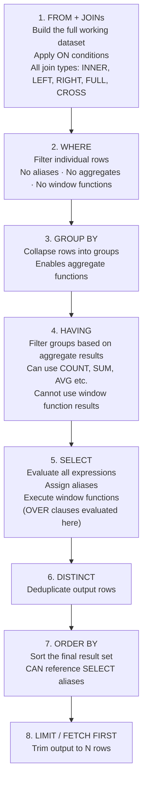

<!-- Part of sql-patterns: SQL Order of Execution — Written vs Execution Order, Flow Diagram, Critical Rules -->
<!-- Source: sql_patterns.md lines 1717–1921 -->

## N. SQL Order of Execution

Understanding the **logical order** in which SQL processes each clause is one of the most fundamental — and most commonly misunderstood — concepts in SQL. It explains every "column not found", "aggregate not allowed here", and "can't filter on window function" error you will ever encounter.

### Written Order (What You Type) vs Execution Order (What the Engine Does)

```sql
-- Written order (left to right, top to bottom):
SELECT      <expressions, aliases, window functions>
FROM        <tables>
JOIN        <other tables> ON <condition>
WHERE       <row filter>
GROUP BY    <grouping columns>
HAVING      <group filter>
ORDER BY    <sort columns>
LIMIT       <row count>
```sql

```sql
-- Logical Execution Order:
Step 1: FROM + JOINs
Step 2: WHERE
Step 3: GROUP BY
Step 4: HAVING
Step 5: SELECT  (window functions evaluated here)
Step 6: DISTINCT
Step 7: ORDER BY
Step 8: LIMIT / TOP / FETCH FIRST
```

### Execution Flow Diagram



### Full Keyword Reference Table

| Keyword | Exec Order | Can Reference | Cannot Reference |
|---|---|---|---|
| `WITH` (CTE) | 0 — pre-query | — | — |
| `FROM` | 1 | Table columns | SELECT aliases |
| `JOIN` / `ON` | 1 (with FROM) | Table columns | SELECT aliases |
| `WHERE` | 2 | Table columns | SELECT aliases, aggregates, window functions |
| `GROUP BY` | 3 | Table columns | SELECT aliases (most DBs) |
| `HAVING` | 4 | Table columns, aggregates | SELECT aliases (most DBs), window functions |
| `WINDOW` | 5 | Everything up to GROUP BY | — |
| `SELECT` | 6 | Everything above + window functions | — |
| `DISTINCT` | 6.5 | SELECT output | — |
| `ORDER BY` | 7 | SELECT aliases ✓ | — |
| `LIMIT` / `TOP` / `FETCH FIRST` | 8 | — | — |
| `QUALIFY` *(Snowflake/BQ/DuckDB)* | After 6 | Window function results | — |
| `UNION / INTERSECT / EXCEPT` | Between queries | — | — |

### Critical Rule Implications with Examples

**Rule 1 — Cannot use SELECT aliases in WHERE (WHERE runs before SELECT)**

```sql
-- WRONG: alias 'fee' doesn't exist when WHERE runs
SELECT trade_amount * 0.02 AS fee
FROM trades
WHERE fee > 100;              -- ERROR: column "fee" does not exist

-- CORRECT — repeat the expression in WHERE:
SELECT trade_amount * 0.02 AS fee
FROM trades
WHERE trade_amount * 0.02 > 100;

-- CORRECT — wrap in a CTE (CTE runs before main SELECT):
WITH fees AS (
    SELECT *, trade_amount * 0.02 AS fee
    FROM trades
)
SELECT * FROM fees WHERE fee > 100;
```

**Rule 2 — Cannot filter on window function results in WHERE (window functions run in SELECT, after WHERE)**

```sql
-- WRONG: ROW_NUMBER() is computed in SELECT phase; WHERE runs before that
SELECT *, ROW_NUMBER() OVER (PARTITION BY user_id ORDER BY executed_at DESC) AS rn
FROM trades
WHERE rn = 1;                 -- ERROR: rn not yet computed

-- CORRECT — wrap in a subquery or CTE:
WITH ranked AS (
    SELECT *, ROW_NUMBER() OVER (PARTITION BY user_id ORDER BY executed_at DESC) AS rn
    FROM trades
)
SELECT * FROM ranked WHERE rn = 1;
```

**Rule 3 — HAVING filters groups, WHERE filters rows — they are NOT interchangeable**

```sql
-- WHERE: filters individual rows BEFORE grouping
-- HAVING: filters groups AFTER aggregation

-- Find users with > 10 BUY trades averaging > 5000
SELECT user_id, COUNT(*) AS buy_count, AVG(trade_amount) AS avg_amount
FROM trades
WHERE trade_type = 'BUY'          -- filter rows first (before grouping)
GROUP BY user_id
HAVING COUNT(*) > 10              -- filter groups (after aggregation)
   AND AVG(trade_amount) > 5000;

-- WRONG: aggregate in WHERE
WHERE COUNT(*) > 10               -- ERROR: aggregate functions not allowed in WHERE
```

**Rule 4 — ORDER BY CAN reference SELECT aliases (ORDER BY runs after SELECT)**

```sql
-- VALID: ORDER BY runs after SELECT, so alias 'fee' is available
SELECT trade_amount * 0.02 AS fee, user_id
FROM trades
ORDER BY fee DESC;                -- works!
```

**Rule 5 — GROUP BY usually cannot reference SELECT aliases (most engines)**

```sql
-- WRONG in most SQL engines (GROUP BY runs before SELECT):
SELECT DATE_TRUNC('month', executed_at) AS month, COUNT(*) AS trades
FROM trades
GROUP BY month;                   -- ERROR in PostgreSQL, Redshift, etc.

-- CORRECT — repeat the expression:
GROUP BY DATE_TRUNC('month', executed_at);

-- NOTE: MySQL and BigQuery are exceptions — they allow GROUP BY aliases
```

**Rule 6 — QUALIFY (Snowflake, BigQuery, DuckDB): filter on window function results without a CTE**

```sql
-- QUALIFY runs after SELECT (where window functions are computed)
-- Equivalent to wrapping in a CTE and using WHERE rn = 1

SELECT *
FROM trades
QUALIFY ROW_NUMBER() OVER (PARTITION BY user_id ORDER BY executed_at DESC) = 1;

-- Also useful for filtering on RANK, DENSE_RANK, etc.
SELECT *
FROM trades
QUALIFY DENSE_RANK() OVER (PARTITION BY trading_pair ORDER BY trade_amount DESC) <= 3;
```

**Rule 7 — CTEs (WITH clause) execute before the main query**

```sql
-- Conceptual execution order with CTEs:
-- Step 0a: Execute CTE1 → materialise result
-- Step 0b: Execute CTE2 (can reference CTE1) → materialise result
-- Step 1–8: Execute main SELECT using CTE results as virtual tables

WITH
daily_volume AS (                              -- computed first
    SELECT DATE(executed_at) AS day, SUM(trade_amount) AS vol
    FROM trades GROUP BY 1
),
ranked_days AS (                               -- computed second, uses daily_volume
    SELECT *, RANK() OVER (ORDER BY vol DESC) AS rnk
    FROM daily_volume
)
SELECT * FROM ranked_days WHERE rnk <= 7;     -- main query uses both CTEs
```

**Rule 8 — UNION / INTERSECT / EXCEPT: ORDER BY applies to the final combined result**

```sql
-- ORDER BY at the end sorts the entire combined result, not individual queries
SELECT user_id, 'deposit' AS type FROM deposits
UNION ALL
SELECT user_id, 'trade'   AS type FROM trades
ORDER BY user_id;            -- ORDER BY applies to the combined result set
```

### Common Interview Gotchas

| Error | Root Cause | Fix |
|---|---|---|
| `column "alias" does not exist` in WHERE | WHERE runs before SELECT | Repeat the expression or use a CTE |
| `aggregate functions not allowed in WHERE` | WHERE runs before GROUP BY | Move aggregate condition to HAVING |
| `window function not allowed in WHERE` | Window functions run in SELECT | Wrap in CTE/subquery, then WHERE |
| `column "alias" not in GROUP BY` | GROUP BY runs before SELECT in most DBs | Repeat the full expression in GROUP BY |
| Zero rows from `NOT IN (subquery)` | Subquery returns NULLs | Use `NOT EXISTS` instead |
| Running SUM doubles up on ties | Default frame is RANGE (includes all tied rows at CURRENT ROW) | Use explicit `ROWS BETWEEN UNBOUNDED PRECEDING AND CURRENT ROW` |

---

---

